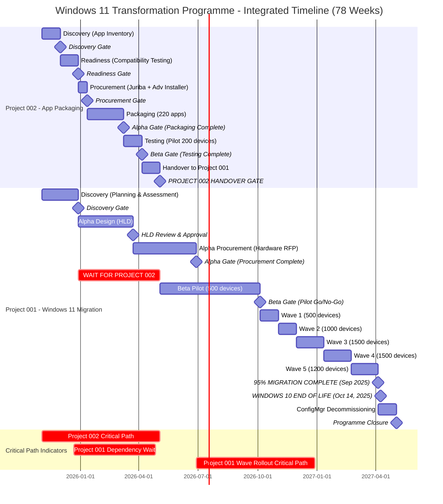
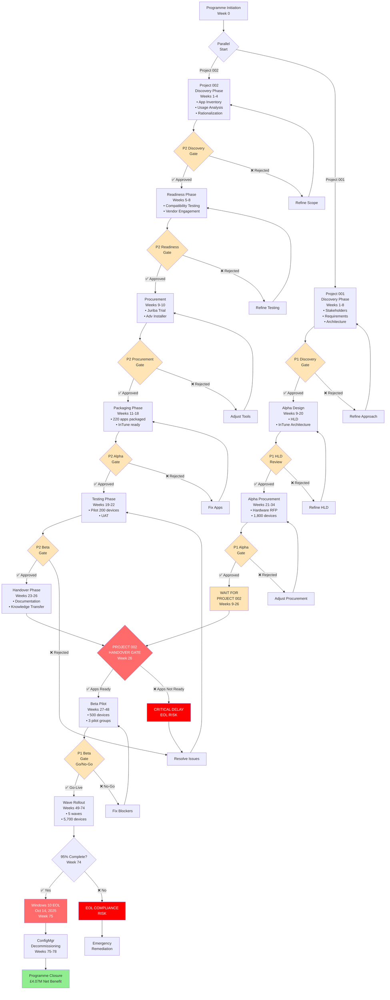

# Portfolio Master Plan: Windows 11 Transformation Programme

**Programme**: Windows 11 Transformation
**Version**: 1.0
**Date**: 2025-10-28
**Owner**: IT Operations Director / Programme Director
**Status**: DRAFT

---

## Executive Summary

**Programme**: Windows 11 Transformation Programme (2 integrated projects)
**Duration**: 78 weeks (18 months) - November 2025 to May 2027
**Total Budget**: £4.43M
**Programme Team**: 10-18 FTE average (varies by phase)
**Delivery Model**: Agile Delivery with Phased Rollout & Gate-Based Governance

### Programme Objective

Transform the organization's endpoint management infrastructure by migrating 6,000 Windows 10 devices to Windows 11 and transitioning from on-premises Configuration Manager to cloud-native Microsoft InTune management, while comprehensively rationalizing and repackaging the application portfolio to ensure compatibility, security, and cost optimization before Windows 10 End of Life (October 14, 2025).

### Programme Scope

**Project 001**: Windows 10 to Windows 11 Migration with InTune
- Migrate 6,000 devices to Windows 11
- Deploy Microsoft InTune cloud-native management
- Replace 1,800 devices (30%) with Windows 11 hardware
- Decommission Configuration Manager infrastructure
- Achieve Zero Trust security posture

**Project 002**: Application Packaging and Rationalisation (Critical Dependency)
- Rationalize application portfolio from 350 → 220 applications
- Repackage all retained applications for InTune deployment
- Test compatibility with Windows 11 and ARM64 devices
- Deliver £200K+ annual licensing cost savings

### Critical Success Factors

1. **Project 002 must complete by Week 26** (Month 6) to unblock Project 001 pilot deployment
2. **Windows 10 EOL deadline**: October 14, 2025 (Week 75) - immovable external constraint
3. **95% migration completion by September 1, 2025** (Week 74) - 6-week buffer before EOL
4. **Zero P1 security incidents** related to unsupported Windows 10 devices post-EOL
5. **ConfigMgr decommissioning by Month 18** (Week 78) to realize £2M annual savings

### Programme Budget

| Project | Duration | Budget | Purpose |
|---------|----------|--------|---------|
| **Project 002** - Application Packaging | 26 weeks | **£231K** | Rationalize 350→220 apps, package for InTune |
| **Project 001** - Windows 11 Migration | 78 weeks | **£4.2M** | Migrate 6,000 devices, InTune deployment |
| **Programme Total** | 78 weeks | **£4.43M** | Combined investment |

**Project 002 Budget Breakdown (£231K)**:
- Juriba DPC migration automation: £75K (3-year license)
- Advanced Installer packaging tool: £27K (3-year license)
- VDI testing infrastructure: £13K (3-year)
- External contractors (packaging): £100K (5 FTE × 8 weeks)
- Internal project management: £16K (0.3 FTE × 26 weeks)

**Project 001 Budget Breakdown (£4.2M)**:
- Hardware replacement (1,800 devices): £2.8M
- Professional services (migration engineers): £500K
- InTune licenses (3 years): £200K
- Project management & training: £400K
- Contingency (10%): £300K

### Programme Benefits (3-year)

| Benefit Category | Value | Source |
|------------------|-------|--------|
| **Infrastructure Cost Reduction** | £4.5M | ConfigMgr decommissioning (£2M/year × 3 years, minus £600K InTune costs) |
| **Licensing Cost Savings** | £600K | Application rationalization (350→220 apps = £200K/year × 3 years) |
| **Productivity Gains** | £1.0M | Automation, reduced manual intervention |
| **Risk Reduction** | £1.5M | Compliance maintained, cyber insurance renewed, breach avoidance |
| **Strategic Value** | £0.9M | Cloud transformation enablement, AI readiness, talent retention |
| **Total Benefits** | **£8.5M** | |
| **Total Investment** | **£4.43M** | |
| **Net Benefit** | **£4.07M** | |
| **ROI** | **92%** | Over 3 years |
| **Payback Period** | **15 months** | |

### Programme Success Criteria

**Project 002 Success Criteria**:
- ✅ Reduce application portfolio by 30-40% (350 → 220 applications)
- ✅ Achieve 100% Tier 1 application compatibility certification by Week 8
- ✅ Package 100% of retained applications for InTune deployment by Week 18
- ✅ Deliver £200K+ annual licensing cost savings through rationalization
- ✅ Maintain <5% application-related support tickets during migration
- ✅ Complete project within £231K budget

**Project 001 Success Criteria**:
- ✅ Achieve 95% migration completion by September 1, 2025 (5,700 devices)
- ✅ Maintain <2% support ticket rate per deployed user
- ✅ Deliver £2M annual cost savings through ConfigMgr decommissioning
- ✅ Achieve 100% device compliance with Zero Trust security policies
- ✅ Maintain >80% user satisfaction through post-migration surveys
- ✅ Zero P1 security incidents related to unsupported Windows 10 devices post-EOL
- ✅ Complete within £4.2M budget

### Key Programme Milestones

| Week | Milestone | Project | Gate |
|------|-----------|---------|------|
| 4 | Discovery Complete - Application Inventory | 002 | Discovery Gate |
| 8 | Discovery Complete - Windows 11 Planning | 001 | Discovery Gate |
| 8 | Readiness Assessment - App Compatibility Certified | 002 | Readiness Gate |
| 10 | Procurement Complete - Juriba + Advanced Installer | 002 | Procurement Gate |
| 18 | Alpha Complete - All 220 Apps Packaged | 002 | Alpha Gate |
| 20 | HLD Review - InTune Architecture Approved | 001 | HLD Gate |
| 22 | Beta Complete - App Testing Validated | 002 | Beta Gate |
| 26 | **CRITICAL: Project 002 Handover to Project 001** | 002 → 001 | **Handover Gate** |
| 34 | Alpha Complete - Hardware Procurement Done | 001 | Alpha Gate |
| 48 | Pilot Complete - 500 Devices Migrated | 001 | Beta (Pilot) Gate |
| 60 | 50% Migration Complete - 3,000 Devices | 001 | Checkpoint |
| 74 | **95% Migration Complete - 5,700 Devices (Sep 2025)** | 001 | **Production Gate** |
| 75 | **Windows 10 End of Life (Oct 14, 2025)** | - | **HARD DEADLINE** |
| 78 | ConfigMgr Decommissioned - £2M Annual Savings | 001 | Programme Closure |

### Critical Dependencies

**Upstream Dependencies (External)**:
- Windows 10 End of Life: October 14, 2025 (immovable external constraint)
- Hardware vendor lead times: 12 weeks for 1,800 devices
- Microsoft InTune capacity planning: 6,000 concurrent devices

**Inter-Project Dependencies (Internal)**:
1. **Project 002 → Project 001** (CRITICAL PATH):
   - Project 002 must deliver 220 packaged applications by Week 18
   - Project 002 must complete testing and handover by Week 26
   - Project 001 pilot cannot start until Week 27 (dependent on Project 002 handover)
   - **If Project 002 delays, entire Windows 11 migration timeline slips toward EOL deadline**

2. **Project 001 → Project 002** (Feedback Loop):
   - Project 001 pilot results (Weeks 27-48) inform any app re-packaging needs
   - Project 002 hypercare support continues through Project 001 wave rollout (Weeks 49-74)

**Downstream Dependencies (Post-Programme)**:
- ConfigMgr decommissioning unlocks £2M annual savings (Month 18)
- InTune evergreen management enables continuous Windows updates (post-migration)
- Application lifecycle management transitions to DevOps model (Year 2+)

---

## Portfolio Gantt Timeline (Integrated View)

---

## Programme Workflow & Dependencies Diagram

---

## Critical Path Analysis

### Programme Critical Path

The programme has **TWO sequential critical paths** that must both succeed:

#### Critical Path 1: Project 002 (Weeks 1-26)
**Duration**: 26 weeks
**Why Critical**: Project 001 pilot cannot start without packaged applications

**Critical Activities**:
1. **Discovery (Weeks 1-4)**: Application inventory and rationalization planning
   - Delay impact: Pushes all subsequent activities, delays handover to Project 001
2. **Readiness (Weeks 5-8)**: Compatibility testing (Tier 1 + Tier 2)
   - Delay impact: Packaging cannot start without knowing which apps are compatible
3. **Procurement (Weeks 9-10)**: Juriba + Advanced Installer deployment
   - Delay impact: Packaging throughput drops from 70 apps/week to 15 apps/week (manual)
4. **Packaging (Weeks 11-18)**: 220 applications packaged for InTune (CRITICAL)
   - Delay impact: **DIRECTLY delays Project 001 pilot start** → risks EOL deadline
   - Throughput: 70 apps/week (Juriba + Advanced Installer automation)
   - Buffer: 2 weeks contingency built into 8-week schedule
5. **Testing (Weeks 19-22)**: Pilot deployment validation
   - Delay impact: Delays handover gate, blocks Project 001 pilot preparation
6. **Handover (Weeks 23-26)**: Knowledge transfer to Project 001 team
   - Delay impact: Project 001 team cannot configure InTune without documentation

**If Project 002 delays beyond Week 26**:
- Project 001 pilot slips from Week 27 → later
- Wave rollout starts later → less time before EOL deadline (Week 75)
- **Risk**: Fail to achieve 95% migration by September 1, 2025 (Week 74)
- **Consequence**: Devices remain on unsupported Windows 10 after EOL → compliance failure, cyber insurance loss, breach exposure

#### Critical Path 2: Project 001 Wave Rollout (Weeks 49-74)
**Duration**: 26 weeks
**Why Critical**: Must migrate 5,700 devices (95%) before Windows 10 EOL

**Critical Activities**:
1. **Beta Pilot (Weeks 27-48)**: 500 devices across 3 pilot groups
   - Delay impact: Delays wave rollout start, reduces buffer before EOL
2. **Wave 1 (Weeks 49-52)**: 500 devices
   - Delay impact: Pushes subsequent waves toward EOL deadline
3. **Wave 2 (Weeks 53-56)**: 1,000 devices
   - Delay impact: 2× Wave 1 volume, must maintain 250 devices/week throughput
4. **Wave 3 (Weeks 57-62)**: 1,500 devices
   - Delay impact: Accelerated pace, any issues here create bottleneck
5. **Wave 4 (Weeks 63-68)**: 1,500 devices
   - Delay impact: Must maintain Wave 3 pace to stay on track
6. **Wave 5 (Weeks 69-74)**: 1,200 devices (final push to 95%)
   - Delay impact: **NO BUFFER** - this is the last chance before EOL (Week 75)

**If Wave Rollout delays**:
- Fewer than 5,700 devices (95%) migrated by September 1, 2025 (Week 74)
- Stragglers (300 devices, 5%) become 600+ devices (10%+)
- **Risk**: 10%+ devices remain on Windows 10 after EOL (October 14, 2025)
- **Consequence**: Compliance failure (£500K+ fines), cyber insurance loss (£300K+ exposure), breach risk (£2M+ potential cost)

### Critical Path Mitigation Strategies

**For Project 002 Critical Path**:
1. **Parallel Processing**: Start Tier 2 compatibility testing concurrently with Tier 1 (Week 5-8)
2. **Pre-procurement**: Run Juriba 30-day trial during Readiness phase (Week 5-8) to accelerate procurement
3. **Packaging Throughput**: Deploy 5 FTE contractors with Advanced Installer training (70 apps/week capacity)
4. **Weekly Checkpoints**: Track packaging progress weekly (target: 27-28 apps/week)
5. **Escalation Trigger**: If <20 apps/week by Week 13 → add 2 more FTE contractors

**For Project 001 Critical Path**:
1. **Pilot in Parallel**: Run Project 001 Discovery/Alpha phases (Weeks 1-34) while Project 002 progresses
2. **Hardware Pre-positioning**: Order hardware early (Week 21-34) to avoid lead time bottleneck
3. **InTune Pre-configuration**: Configure InTune tenant during Week 26 wait (ahead of pilot)
4. **Support Scaling**: Scale support team from 2 FTE (pilot) → 6 FTE (Wave 3-5) to maintain throughput
5. **Contingency Date**: Target 95% by **August 25, 2025** (Week 73) to create 1-week buffer

---

## Programme Governance

### Governance Structure

**Programme Board** (Monthly):
- **Chair**: CIO
- **Members**: CFO, CISO, IT Operations Director, Enterprise Architect, PMO Lead
- **Purpose**: Strategic oversight, budget approval, risk escalation
- **Meetings**: Monthly (first Monday of each month)

**Programme Steering Committee** (Fortnightly):
- **Chair**: IT Operations Director
- **Members**: Project 002 Lead, Project 001 Lead, Enterprise Architect, CISO representative
- **Purpose**: Tactical coordination, dependency management, gate approvals
- **Meetings**: Fortnightly (alternating Fridays)

**Project 002 Team** (Weekly):
- **Project Lead**: Application Packaging Lead (1 FTE)
- **Team**: 5 FTE contractors (packaging), 0.5 FTE enterprise architect, 0.5 FTE test engineer
- **Purpose**: Deliver 220 packaged applications by Week 18
- **Meetings**: Weekly stand-ups (Mondays)

**Project 001 Team** (Weekly):
- **Project Lead**: Migration Project Manager (1 FTE)
- **Team**: 3 FTE migration engineers, 2-6 FTE support engineers (scales by phase), 0.5 FTE architect
- **Purpose**: Migrate 6,000 devices by Week 74
- **Meetings**: Weekly stand-ups (Wednesdays)

### Gate Approval Process

Each gate requires formal approval before proceeding to the next phase:

| Gate | Approver | Criteria | Consequence of Failure |
|------|----------|----------|------------------------|
| **Discovery Gate (P2)** | Steering Committee | App inventory complete, rationalization plan approved | Return to Discovery, refine scope |
| **Readiness Gate (P2)** | Steering Committee | Tier 1 compatibility certified, vendor shortlist approved | Extend testing, delay procurement |
| **Procurement Gate (P2)** | Steering Committee | Juriba + Advanced Installer deployed, team trained | Adjust tools, delay packaging |
| **Alpha Gate (P2)** | Steering Committee | 220 apps packaged, InTune configs ready | Extend packaging, add resources |
| **Beta Gate (P2)** | Steering Committee | Pilot testing passed, UAT approved | Fix issues, re-test |
| **Handover Gate (P2→P1)** | **Programme Board** | Documentation complete, knowledge transfer done, Project 001 ready | **CRITICAL**: Delay Project 001 pilot |
| **Discovery Gate (P1)** | Steering Committee | Stakeholders aligned, requirements defined | Refine approach, extend Discovery |
| **HLD Review (P1)** | Architecture Board | InTune architecture approved, security validated | Refine HLD, re-review |
| **Alpha Gate (P1)** | Steering Committee | Hardware procured, professional services onboarded | Adjust procurement, extend Alpha |
| **Beta Gate (P1)** | **Programme Board** | Pilot successful, 500 devices migrated, user satisfaction >80% | Fix blockers, extend pilot |
| **Production Gate (P1)** | **Programme Board** | 95% migration complete (5,700 devices), Week 74 | Emergency remediation, extended support |

**Gate Approval Criteria Format**:
- ✅ All deliverables complete
- ✅ Quality criteria met (testing passed, documentation reviewed)
- ✅ Risks mitigated or accepted
- ✅ Budget within tolerance (+/- 10%)
- ✅ Schedule within tolerance (+/- 1 week for Project 002, +/- 2 weeks for Project 001)
- ✅ Stakeholder sign-off obtained

### RAID Log (Programme-Level)

**Risks** (Top 5 - see individual project risk registers for full details):

| Risk ID | Description | Impact | Probability | Mitigation | Owner |
|---------|-------------|--------|-------------|------------|-------|
| R-001 | Project 002 delays beyond Week 26 | CRITICAL | Medium | Weekly tracking, contractor buffer, escalation at Week 13 if <20 apps/week | P2 Lead |
| R-002 | Windows 10 EOL deadline missed (Week 75) | CRITICAL | Low | 6-week buffer (target Week 74), contingency Wave 6 if needed | P1 Lead |
| R-003 | Hardware procurement delays (12-week lead time) | HIGH | Medium | Early ordering (Week 21), vendor SLA with penalties | P1 Lead |
| R-004 | Application compatibility failures during pilot | HIGH | Medium | Extensive testing in Project 002 (Weeks 19-22), Microsoft App Assure fallback | P2 Lead |
| R-005 | User resistance / change management failure | MEDIUM | Medium | Training programme (Weeks 30-48), executive sponsorship, user champions | P1 Lead |

**Assumptions**:
- A-001: Microsoft InTune capacity supports 6,000 concurrent devices (validated with Microsoft)
- A-002: Hardware vendors can deliver 1,800 devices within 12-week lead time (based on market research)
- A-003: Internal IT staff available for training and support (0.3 FTE P2, 2-6 FTE P1)
- A-004: Windows 10 EOL date remains October 14, 2025 (no Microsoft extension)
- A-005: Budget £4.43M approved by CFO and available for drawdown

**Issues**:
- None currently (programme not yet started)

**Dependencies**:
- D-001: Project 002 → Project 001 (Week 26 handover) - **CRITICAL**
- D-002: Architecture Principles approved (complete)
- D-003: InTune tenant provisioned (Week 1 - to be completed)
- D-004: Hardware vendor selection (Week 27-28 - to be completed)
- D-005: Professional services contract signed (Week 34 - to be completed)

---

## Programme Resource Plan

### Resource Profile by Phase

**Project 002 Resource Profile** (26 weeks):

| Phase | Duration | Team Size | Key Roles |
|-------|----------|-----------|-----------|
| Discovery | 4 weeks | 2.5 FTE | Project Lead (1), Analyst (1), Architect (0.5) |
| Readiness | 4 weeks | 3.5 FTE | Project Lead (1), Test Engineer (2), Architect (0.5) |
| Procurement | 2 weeks | 2.5 FTE | Project Lead (1), Procurement (1), Architect (0.5) |
| Packaging | 8 weeks | 6.25 FTE | Project Lead (1), Contractors (5), Architect (0.25) |
| Testing | 4 weeks | 4.5 FTE | Project Lead (1), Test Engineer (2), Contractors (1), Architect (0.5) |
| Handover | 4 weeks | 2.5 FTE | Project Lead (1), Tech Writer (1), Architect (0.5) |
| **Average** | 26 weeks | **4 FTE** | |

**Project 001 Resource Profile** (78 weeks):

| Phase | Duration | Team Size | Key Roles |
|-------|----------|-----------|-----------|
| Discovery | 8 weeks | 4.5 FTE | PM (1), Architect (1), Analyst (2), CISO Rep (0.5) |
| Alpha Design | 12 weeks | 6 FTE | PM (1), Architect (2), Engineer (2), Procurement (1) |
| Alpha Procurement | 14 weeks | 7.5 FTE | PM (1), Procurement (2), Vendor Mgmt (2), Architect (1), Legal (0.5), Finance (1) |
| Beta Pilot | 22 weeks | 9 FTE | PM (1), Migration Engineers (3), Support (2), Architect (1), Trainer (2) |
| Beta Wave Rollout | 26 weeks | 22.5 FTE | PM (1), Migration Engineers (3), Support (6), Comms (2), Trainer (2), Vendor (8), Architect (0.5) |
| Live Closure | 4 weeks | 6 FTE | PM (1), Decom Engineer (2), Support (2), Architect (1) |
| **Average** | 78 weeks | **13 FTE** | |

**Programme Total Average**: 17 FTE (4 FTE Project 002 + 13 FTE Project 001)

**Programme Peak**: 28.75 FTE (Week 49-74: 6.25 FTE Project 002 hypercare + 22.5 FTE Project 001 wave rollout)

### Skills Required

**Project 002 Skills**:
- Application packaging (MSIX, Win32, App-V)
- Advanced Installer tool expertise
- Windows 11 compatibility testing
- InTune application deployment
- Juriba DPC platform administration
- VDI infrastructure (testing environments)

**Project 001 Skills**:
- Microsoft InTune administration (expert level)
- Windows Autopilot deployment
- Configuration Manager (legacy system knowledge)
- Azure AD / Entra ID identity management
- PowerShell scripting / automation
- Zero Trust security implementation (Conditional Access, MFA, BitLocker)
- Change management / user training
- Hardware deployment logistics

### Training Requirements

**Project 002 Training** (Weeks 9-10):
- Advanced Installer training: 2 days (5 contractors)
- Juriba DPC platform training: 3 days (project lead + 2 contractors)
- InTune app deployment training: 1 day (all team members)
- **Cost**: Included in £231K budget (vendor-provided training)

**Project 001 Training** (Weeks 30-48):
- InTune administration (MS-102 certification path): 5 days (3 migration engineers)
- Windows Autopilot deployment: 2 days (3 migration engineers)
- Zero Trust security implementation: 3 days (architect + CISO rep)
- End-user training (self-paced e-learning): 2 hours per user × 6,000 users
- Support team training (pilot process): 2 days (2-6 support engineers)
- **Cost**: £150K (included in £400K PM & training budget)

---

## Communication Plan

### Stakeholder Communication Matrix

| Stakeholder Group | Frequency | Channel | Content | Owner |
|-------------------|-----------|---------|---------|-------|
| **Programme Board** | Monthly | Formal meeting | Strategic updates, budget, risks, gate approvals | IT Ops Director |
| **Steering Committee** | Fortnightly | Formal meeting | Tactical coordination, dependency status, gate prep | P1 + P2 Leads |
| **Project Teams** | Weekly | Stand-up / Teams | Sprint progress, blockers, coordination | P1 + P2 Leads |
| **End Users** | Monthly | Email newsletter | Migration timeline, training availability, FAQs | Comms Lead |
| **IT Support Team** | Weekly | Teams channel | Technical updates, known issues, workarounds | P1 Lead |
| **Departmental Managers** | Bi-weekly | Email + 1:1s | Departmental rollout schedule, change impact | Comms Lead |
| **Executive Leadership** | Quarterly | Executive briefing | Strategic alignment, benefits realization, escalations | CIO |

### Communication Milestones

| Week | Milestone | Communication | Audience | Channel |
|------|-----------|---------------|----------|---------|
| 1 | Programme Kickoff | "Windows 11 Transformation Announced" | All staff | Email + Town Hall |
| 8 | Discovery Complete | "Planning Complete - Migration Timeline Confirmed" | All staff | Email newsletter |
| 26 | Project 002 Handover | "Application Readiness Achieved" | IT teams | Email + Teams |
| 34 | Hardware Procurement | "New Windows 11 Devices Arriving Soon" | Pilot users | Email |
| 48 | Pilot Complete | "Pilot Success - Wave Rollout Starting" | All staff | Email + Town Hall |
| 60 | 50% Milestone | "Halfway There - 3,000 Devices Migrated" | All staff | Email newsletter |
| 74 | 95% Milestone | "Migration Complete - Windows 11 Transformation Success" | All staff | Email + Town Hall |
| 78 | Programme Closure | "ConfigMgr Decommissioned - £2M Annual Savings Realized" | Exec leadership | Exec briefing |

---

## Benefits Realization Plan

### Benefits Tracking Schedule

**Month 6 (Week 26)**: Project 002 Complete
- ✅ Licensing cost savings: £200K/year (350→220 apps)
- ✅ Measure: License reconciliation report (Finance team)

**Month 12 (Week 52)**: 50% Migration Complete
- ⏳ Productivity gains: £250K (automation benefits starting)
- ⏳ Measure: Support ticket volume trend (ServiceNow analytics)

**Month 18 (Week 78)**: Programme Complete
- ✅ Infrastructure cost reduction: £2M/year (ConfigMgr decommissioned)
- ✅ Risk reduction: £500K (compliance maintained, insurance renewed)
- ✅ Measure: Infrastructure cost baseline vs. actual (Finance team)

**Year 2-3**: Ongoing Benefits
- ⏳ Productivity gains: £1M total over 3 years
- ⏳ Strategic value: £900K (cloud transformation, AI enablement, talent retention)
- ⏳ Measure: Quarterly benefits realization reviews (Programme Board)

### Benefits Realization Metrics

| Benefit | Baseline | Target | Measurement Method | Frequency |
|---------|----------|--------|-------------------|-----------|
| **Infrastructure Cost Reduction** | £2.6M/year | £600K/year | Finance cost reports | Monthly |
| **Licensing Cost Savings** | £600K/year | £400K/year | License reconciliation | Quarterly |
| **Support Ticket Rate** | 5%/user | <2%/user | ServiceNow analytics | Weekly |
| **User Satisfaction** | 65% (baseline) | >80% | Post-migration surveys | Monthly |
| **Device Compliance** | 60% (baseline) | 100% | InTune compliance dashboard | Daily |
| **Migration Completion** | 0% | 95% by Week 74 | InTune enrollment data | Daily |
| **Security Incidents** | Baseline TBD | Zero P1 incidents post-EOL | Security operations centre | Daily |

---

## ArcKit Commands Integration (Programme View)

### Project 002 ArcKit Commands

| Week | Phase | Command | Purpose |
|------|-------|---------|---------|
| 1-2 | Discovery | `/arckit.stakeholders` | Stakeholder analysis (if needed) |
| 3-4 | Discovery | `/arckit.requirements` | Business requirements (already complete) |
| 5-8 | Readiness | `/arckit.research` | Tool evaluation (already complete) |
| 9-10 | Procurement | `/arckit.sow` | SOW for contractors (if needed) |
| 11-18 | Packaging | `/arckit.data-model` | Application inventory schema (already complete) |
| 19-22 | Testing | `/arckit.traceability` | App → test → deployment traceability |
| 23-26 | Handover | `/arckit.analyze` | Quality analysis before handover |

### Project 001 ArcKit Commands

| Week | Phase | Command | Purpose |
|------|-------|---------|---------|
| 1-2 | Discovery | `/arckit.stakeholders` | Stakeholder analysis (already complete) |
| 5-6 | Discovery | `/arckit.requirements` | Requirements analysis (already complete) |
| 7 | Discovery | `/arckit.principles` | Architecture principles (already complete) |
| 8 | Discovery | `/arckit.sobc` | Business case (already complete) |
| 8 | Discovery | `/arckit.risk` | Risk register creation |
| 12-15 | Alpha Design | `/arckit.diagram` | InTune architecture diagrams (C4 model) |
| 18 | Alpha Design | `/arckit.hld-review` | HLD approval gate preparation |
| 21-22 | Alpha Procurement | `/arckit.sow` | Hardware RFP / SOW generation |
| 23-27 | Alpha Procurement | `/arckit.evaluate` | Vendor evaluation framework |
| 19 | Alpha | `/arckit.sobc` | Updated business case (refined costs) |
| 30 | Beta Pilot | `/arckit.secure` | Secure by Design assessment (UK Gov) |
| 45 | Beta Pilot | `/arckit.analyze` | Quality analysis (pilot validation) |
| 60 | Wave Rollout | `/arckit.traceability` | Requirements → deployment traceability |
| 74 | Production | `/arckit.analyze` | Final quality analysis |
| 78 | Closure | `/arckit.sobc` | Benefits realization validation |

### Programme-Level ArcKit Commands

| Week | Command | Purpose |
|------|---------|---------|
| 1 | `/arckit.plan` | Generate programme master plan (this document) |
| 26 | `/arckit.analyze` | Programme health check (Project 002 handover) |
| 48 | `/arckit.analyze` | Programme health check (pilot validation) |
| 60 | `/arckit.analyze` | Programme health check (50% milestone) |
| 74 | `/arckit.analyze` | Programme health check (95% milestone) |
| 78 | `/arckit.analyze` | Final programme quality review |

---

## Success Criteria Summary

### Programme Success Criteria

**Technical Success**:
- ✅ 95% migration completion by September 1, 2025 (5,700 devices)
- ✅ 100% device compliance with Zero Trust security policies
- ✅ 220 applications packaged and deployed successfully
- ✅ ConfigMgr decommissioned by Month 18
- ✅ <2% support ticket rate per deployed user

**Financial Success**:
- ✅ Complete within £4.43M budget (+/- 10% tolerance = £4.0M - £4.87M)
- ✅ Deliver £4.07M net benefit over 3 years
- ✅ Achieve 92% ROI
- ✅ Realize 15-month payback period

**User Success**:
- ✅ >80% user satisfaction through post-migration surveys
- ✅ <5% application-related support tickets during migration
- ✅ Zero critical business disruption incidents

**Compliance Success**:
- ✅ Zero P1 security incidents related to unsupported Windows 10 devices post-EOL
- ✅ Cyber insurance renewed (dependent on EOL compliance)
- ✅ Achieve compliance with Zero Trust architecture principles

---

## Next Steps

### Immediate Actions (Week 0-1)

**Programme Initiation**:
1. ✅ **Secure Programme Board approval** for £4.43M budget (CIO + CFO sign-off)
2. ✅ **Appoint Programme Director** (IT Operations Director) and Project Leads (P1 + P2)
3. ✅ **Establish governance structure** (Programme Board, Steering Committee, RAID log)
4. ✅ **Provision InTune tenant** (Microsoft 365 E5 licenses for 6,000 users)
5. ✅ **Reserve contractor resources** (5 FTE for Project 002 packaging, 3 FTE for Project 001 migration)

**Project 002 Kickoff (Week 1)**:
1. ✅ **Run `/arckit.stakeholders`** (if additional stakeholder analysis needed beyond existing work)
2. ✅ **Initiate application inventory discovery** (use existing CMDB + ConfigMgr data)
3. ✅ **Schedule stakeholder interviews** (15-20 departmental app owners, Weeks 1-2)
4. ✅ **Establish weekly stand-ups** (Project 002 team, every Monday 10:00 AM)

**Project 001 Kickoff (Week 1)**:
1. ✅ **Run `/arckit.risk`** to create initial risk register
2. ✅ **Review existing stakeholder analysis** (`stakeholder-drivers.md`)
3. ✅ **Review existing requirements** (`requirements.md`)
4. ✅ **Review existing architecture principles** (`.arckit/memory/architecture-principles.md`)
5. ✅ **Schedule Discovery workshops** (hardware assessment, InTune design, security baseline)

### Week 1-4 Actions

**Project 002**:
- Complete application inventory (350 applications)
- Conduct stakeholder interviews (departmental app owners)
- Analyze application usage data (ConfigMgr analytics)
- Develop initial rationalization assessment (350 → 220 apps)
- Prepare Discovery Gate presentation (Week 4)

**Project 001**:
- Complete Discovery workshops (stakeholder engagement, hardware assessment)
- Review architecture principles with Architecture Board
- Create initial risk register (identify top 10 risks)
- Develop initial SOBC (validate £4.2M budget assumptions)
- Prepare Discovery Gate presentation (Week 8)

### Week 26 Critical Handover Preparation

**Project 002 Deliverables to Project 001** (Week 26):
1. ✅ **220 packaged applications** (InTune-ready .intunewin or .msix files)
2. ✅ **Application deployment documentation** (installation guides, known issues, workarounds)
3. ✅ **InTune deployment configurations** (deployment profiles, assignment rules, detection logic)
4. ✅ **Compatibility test results** (Windows 11 + ARM64 validation reports)
5. ✅ **Application traceability matrix** (app → requirements → tests → deployment)
6. ✅ **Hypercare support plan** (Project 002 team support during Project 001 pilot)

**Project 001 Readiness for Handover** (Week 26):
1. ✅ **InTune tenant configured** (conditional access policies, compliance policies, enrollment profiles)
2. ✅ **Autopilot deployment profiles created** (zero-touch provisioning workflows)
3. ✅ **Pilot user groups identified** (50 + 200 + 250 = 500 pilot users selected)
4. ✅ **Hardware procurement complete** (1,800 devices ordered, delivery scheduled)
5. ✅ **Professional services contract signed** (3 FTE migration engineers onboarded)
6. ✅ **Training materials prepared** (end-user e-learning, support team guides)

---

## Programme Closure Checklist (Week 78)

**Technical Closure**:
- [ ] 95%+ devices migrated to Windows 11 (5,700+ devices)
- [ ] ConfigMgr infrastructure decommissioned (servers, databases, agents)
- [ ] InTune evergreen management operational (automatic updates enabled)
- [ ] Zero Trust security policies enforced (100% compliance)
- [ ] Application lifecycle management transitioned to DevOps model

**Financial Closure**:
- [ ] Final budget reconciliation (£4.43M +/- 10% tolerance validated)
- [ ] Benefits realization validated (£4.07M net benefit confirmed)
- [ ] £2M annual savings baseline established (ConfigMgr costs eliminated)
- [ ] £200K annual licensing savings confirmed (350→220 apps)

**Documentation Closure**:
- [ ] Lessons learned report published (successes, challenges, recommendations)
- [ ] Final programme quality analysis (`/arckit.analyze`)
- [ ] Benefits realization report (3-year tracking plan)
- [ ] Operational handover to BAU support team (runbooks, escalation paths)
- [ ] Executive closure briefing (CIO + Programme Board)

**Governance Closure**:
- [ ] All gates passed (7 Project 001 gates + 6 Project 002 gates = 13 total)
- [ ] All RAID items closed or transitioned to BAU
- [ ] Programme Board formal closure approval
- [ ] Celebration event (recognition of team contributions)

---

## Appendices

### Appendix A: Glossary

| Term | Definition |
|------|------------|
| **ARM64** | 64-bit ARM processor architecture (used in Microsoft Surface Pro X, Copilot+ PCs) |
| **Autopilot** | Microsoft Windows Autopilot - zero-touch device provisioning service |
| **BAU** | Business As Usual - ongoing operational support after project completion |
| **ConfigMgr** | Microsoft Configuration Manager (formerly SCCM) - on-premises device management platform |
| **Copilot+ PC** | Windows 11 devices with Neural Processing Unit (NPU) for AI workloads |
| **EOL** | End of Life - Windows 10 EOL date is October 14, 2025 |
| **FTE** | Full-Time Equivalent - measure of workforce capacity (1 FTE = 1 person working full-time) |
| **GDS** | UK Government Digital Service - defines Agile Delivery framework (Discovery → Alpha → Beta → Live) |
| **HLD** | High-Level Design - architecture overview document |
| **InTune** | Microsoft InTune - cloud-native device management platform (part of Microsoft 365 E5) |
| **MSIX** | Modern Windows application packaging format (containerized, isolated) |
| **NPV** | Net Present Value - discounted value of future cash flows (benefits - costs) |
| **ROI** | Return on Investment - (net benefits / total investment) × 100% |
| **SOBC** | Strategic Outline Business Case - UK Government business case format (5-case model) |
| **TPM 2.0** | Trusted Platform Module 2.0 - hardware security chip (required for Windows 11) |
| **UAT** | User Acceptance Testing - validation by end users before production rollout |
| **Win32** | Traditional Windows application packaging format (wrapped for InTune as .intunewin) |
| **Zero Trust** | Security model: "never trust, always verify" (MFA, conditional access, least privilege) |

### Appendix B: References

**Project Artifacts**:
- Project 001 Project Plan: `projects/001-windows-11-migration-intune/project-plan.md`
- Project 002 Project Plan: `projects/002-application-packaging-rationalisation/project-plan.md`
- Project 001 SOBC: `projects/001-windows-11-migration-intune/sobc.md`
- Project 001 Stakeholder Analysis: `projects/001-windows-11-migration-intune/stakeholder-drivers.md`
- Project 001 Requirements: `projects/001-windows-11-migration-intune/requirements.md`
- Project 002 Requirements: `projects/002-application-packaging-rationalisation/requirements.md`
- Project 002 Research: `projects/002-application-packaging-rationalisation/research-findings.md`
- Architecture Principles: `.arckit/memory/architecture-principles.md`

**External Standards**:
- GDS Service Manual: https://www.gov.uk/service-manual
- Microsoft Windows 11 Requirements: https://www.microsoft.com/en-us/windows/windows-11-specifications
- Microsoft InTune Documentation: https://learn.microsoft.com/en-us/mem/intune/
- UK Government Green Book (Business Cases): https://www.gov.uk/government/publications/the-green-book-appraisal-and-evaluation-in-central-governent
- HM Treasury Orange Book (Risk Management): https://www.gov.uk/government/publications/orange-book

### Appendix C: Change Log

| Version | Date | Author | Changes |
|---------|------|--------|---------|
| 1.0 | 2025-10-28 | Enterprise Architect | Initial portfolio master plan created |

---

**Document Status**: DRAFT - Pending Programme Board Approval
**Next Review**: Week 8 (Discovery Gate) - Update with actual progress vs. plan
**Document Owner**: IT Operations Director / Programme Director

---

*This portfolio master plan integrates Project 001 (Windows 11 Migration) and Project 002 (Application Packaging) into a unified transformation programme with coordinated timelines, dependencies, and governance.*
