# Deployment Diagram: Azure Cloud Infrastructure for Windows 11 Migration

**Document Type**: Architecture Diagram - Deployment Topology
**Project ID**: 001-windows-11-migration-intune
**Version**: 1.0
**Date**: 2025-11-04
**Status**: FINAL
**Owner**: Enterprise Architecture Team

---

## Document Control

| Version | Date | Author | Changes |
|---------|------|--------|---------|
| 1.0 | 2025-11-04 | Enterprise Architecture Team | Initial deployment diagram for Azure cloud infrastructure (UK South primary, UK West DR) |

**Distribution List**:
- Enterprise Architecture Review Board
- CIO (Executive Sponsor)
- CISO (Security Executive)
- IT Operations Director
- Security Architect
- Cloud Infrastructure Team

---

## 1. Executive Summary

### Purpose

This deployment diagram provides a detailed view of the Azure cloud infrastructure topology for the Windows 10 to Windows 11 migration project. It shows the physical deployment of Microsoft 365 SaaS services, Azure PaaS resources, network architecture, security zones, and connectivity patterns.

**Diagram Type**: Deployment Diagram (Infrastructure Topology)
**Audience**: Cloud architects, infrastructure engineers, security team, IT operations
**Abstraction Level**: Shows cloud regions, network boundaries, compute resources, data residency

### Infrastructure Overview

The architecture is **100% cloud-native Microsoft Azure SaaS/PaaS** with no on-premises infrastructure (except transitional Configuration Manager during Month 0-18). All production workloads run in Microsoft-managed multi-tenant SaaS services (InTune, Azure AD, Defender for Endpoint, OneDrive) with data primarily residing in **UK South** region.

**Key Architecture Characteristics**:
- **Cloud Provider**: Microsoft Azure (UK South primary, UK West DR)
- **Deployment Model**: SaaS (99%) + PaaS (1% for InTune DB) - **Zero IaaS**
- **Data Residency**: UK/EU only (GDPR, UK data sovereignty compliance)
- **Availability**: 99.9%-99.99% Microsoft-managed SLAs
- **Security Zones**: 3 zones (Internet, Azure Cloud, Endpoint Devices)

**Strategic Rationale**:
- **Cloud First (Principle 1)**: 100% cloud-native, Configuration Manager decommissioned Month 18
- **Zero Infrastructure Overhead**: No servers to patch, no datacenters to maintain
- **Global Scale**: Microsoft operates 60+ Azure regions globally, automatic scaling
- **Compliance**: UK data residency, GDPR Article 5 (data minimization, purpose limitation)

---

## 2. Deployment Diagram

### 2.1 Mermaid Diagram

```mermaid
flowchart TB
    subgraph Internet["Internet Zone"]
        Users["End Users | 6,000 employees | Laptops, Desktops, Tablets"]
        OEM["OEM Vendors | Dell, HP, Lenovo | Autopilot Pre-Registration"]
    end

    subgraph AzureCloud["Microsoft Azure Cloud"]
        subgraph UKSouth["UK South Region (London) - PRIMARY"]
            subgraph SaaS["Microsoft 365 SaaS Services"]
                InTune["Microsoft InTune | SaaS - Endpoint Manager | 99.9% SLA | Device management"]
                AzureAD["Azure AD Premium P1 | SaaS - Identity Platform | 99.99% SLA | Authentication, MFA"]
                Autopilot["Windows Autopilot | SaaS - Provisioning Service | 99.9% SLA | Zero-touch"]
                Defender["Defender for Endpoint | SaaS - Security Platform | 99.9% SLA | EDR, threat detection"]
                OneDrive["OneDrive for Business | SaaS - Cloud Storage | 99.9% SLA | 1TB per user | 6,000 TB capacity"]
                PowerBI["Power BI Service | SaaS - Analytics | 99.9% SLA | Dashboards, reports"]
            end

            subgraph PaaS["Azure PaaS Resources"]
                InTuneDB[("InTune Database | Azure SQL Database | Zone-redundant | 3 availability zones | 6,000+ device records")]
                LogAnalytics["Azure Log Analytics | Workspace | 7-year retention | 2,555 days | Audit logs"]
                KeyVault["Azure Key Vault | Secrets Management | BitLocker keys, certificates | HSM-backed"]
            end

            subgraph API["API Gateway"]
                GraphAPI["Microsoft Graph API | REST Gateway | 20,000 req/min rate limit | OAuth 2.0"]
            end
        end

        subgraph UKWest["UK West Region (Cardiff) - DISASTER RECOVERY"]
            InTuneDBBackup[("InTune DB Backup | Azure SQL Geo-Replication | RPO: <24 hours | Daily snapshots")]
            LogAnalyticsBackup["Log Analytics Export | Azure Blob Storage | Immutable | 7-year retention"]
        end
    end

    subgraph OnPrem["On-Premises (Transitional - Month 0-18) - SUNSET"]
        ConfigMgr["Configuration Manager | SCCM CB | Windows Server | Co-management | DECOMMISSION: Month 18"]
        ConfigMgrDB[("ConfigMgr Database | SQL Server 2019 | Device inventory | ARCHIVE: Month 18")]
    end

    subgraph Endpoint["Endpoint Devices"]
        Win11Device1["Windows 11 Device 1 | Azure AD Joined | TPM 2.0, BitLocker | InTune Agent"]
        Win11Device2["Windows 11 Device 2 | Azure AD Joined | TPM 2.0, BitLocker | Defender Agent"]
        Win11DeviceN["Windows 11 Device N | 6,000 devices total | OneDrive Sync Client"]
    end

    Users -->|"HTTPS:443 | TLS 1.3 | OAuth 2.0"| AzureAD
    Users -->|"HTTPS:443 | Device Enrollment"| InTune
    OEM -->|"Autopilot API | Hardware Hash Registration"| Autopilot

    AzureAD <-->|"Microsoft Graph API | Device Registration"| InTune
    InTune <-->|"Microsoft Graph API | Onboarding Policy"| Defender
    InTune <-->|"Microsoft Graph API | KFM Policy Deployment"| OneDrive
    InTune -->|"TLS-Encrypted SQL | Device Inventory"| InTuneDB
    InTune -->|"Azure Monitor API | Audit Logs"| LogAnalytics
    InTune -->|"Key Retrieval API | BitLocker Keys"| KeyVault
    AzureAD -->|"OAuth 2.0 | Dashboard Access"| PowerBI
    PowerBI -->|"Azure SQL TLS | Query Device Data"| InTuneDB
    GraphAPI ---|"Unified Gateway"| InTune
    GraphAPI ---|"Unified Gateway"| AzureAD
    GraphAPI ---|"Unified Gateway"| Defender
    GraphAPI ---|"Unified Gateway"| OneDrive

    InTuneDB -.->|"Geo-Replication | Async | Daily Backup"| InTuneDBBackup
    LogAnalytics -.->|"Export to Blob | Immutable | Compliance"| LogAnalyticsBackup

    Win11Device1 -->|"Check-in Every 8 Hours | HTTPS:443"| InTune
    Win11Device2 -->|"Threat Telemetry | HTTPS:443"| Defender
    Win11DeviceN -->|"File Sync | HTTPS:443 | Desktop, Documents, Pictures"| OneDrive
    Win11Device1 -->|"Azure AD Auth | OAuth 2.0"| AzureAD

    Win11Device1 -.->|"Co-Management (Transitional) | HTTPS/WinRM"| ConfigMgr
    ConfigMgr -.->|"Co-Management Connector | Workload Sync"| InTune
    ConfigMgr -->|"On-Prem SQL | Device Inventory"| ConfigMgrDB

    classDef internet fill:#E8F4F8,stroke:#0078D4,stroke-width:2px
    classDef azure fill:#0078D4,stroke:#005A9E,stroke-width:2px,color:#fff
    classDef saas fill:#50E6FF,stroke:#0078D4,stroke-width:2px
    classDef paas fill:#FFA500,stroke:#CC8400,stroke-width:2px
    classDef onprem fill:#D3D3D3,stroke:#808080,stroke-width:2px,stroke-dasharray: 5 5
    classDef endpoint fill:#00BCF2,stroke:#0078D4,stroke-width:2px
    classDef dr fill:#FFD700,stroke:#CC8400,stroke-width:2px

    class Internet internet
    class AzureCloud,UKSouth azure
    class InTune,AzureAD,Autopilot,Defender,OneDrive,PowerBI saas
    class InTuneDB,LogAnalytics,KeyVault,GraphAPI paas
    class UKWest,InTuneDBBackup,LogAnalyticsBackup dr
    class OnPrem,ConfigMgr,ConfigMgrDB onprem
    class Endpoint,Win11Device1,Win11Device2,Win11DeviceN endpoint
```



### 2.2 Visualization Instructions

**View this diagram by pasting the Mermaid code into:**
- **GitHub markdown**: Renders automatically in this file
- **https://mermaid.live**: Online editor for interactive viewing
- **VS Code**: Install "Markdown Preview Mermaid Support" extension

---

## 3. Infrastructure Inventory

### 3.1 Azure Cloud Resources (UK South - Primary Region)

| Resource | Type | Purpose | Availability | Data Residency | Cost Model |
|----------|------|---------|--------------|----------------|------------|
| **Microsoft InTune** | SaaS (Microsoft-managed multi-tenant) | Device enrollment, policy distribution, app deployment, compliance evaluation | 99.9% SLA (Microsoft-guaranteed) | UK/EU (data residency commitments) | Included in Microsoft 365 E3/E5 (per-user licensing) |
| **Azure AD Premium P1** | SaaS (Microsoft-managed global) | User/device authentication, Conditional Access, MFA, device registration | 99.99% SLA (Microsoft-guaranteed) | Globally distributed (identity metadata), UK/EU for tenant data | £6/user/month (£72K/year for 6,000 users) |
| **Windows Autopilot** | SaaS (Microsoft-managed) | Zero-touch provisioning, hardware hash registration, deployment profiles | 99.9% SLA (Microsoft-guaranteed) | UK/EU | Included in Microsoft 365 E3/E5 |
| **Defender for Endpoint** | SaaS (Microsoft-managed) | EDR, threat analytics, real-time protection, security recommendations | 99.9% SLA (Microsoft-guaranteed) | UK/EU (telemetry data) | Included in Microsoft 365 E5 or £4.50/user/month |
| **OneDrive for Business** | SaaS (Microsoft-managed) | Cloud storage, KFM sync, file versioning, backup (1TB/user, 6,000 TB total) | 99.9% SLA (Microsoft-guaranteed) | UK/EU (primary), geo-redundant 3x replication | Included in Microsoft 365 E3/E5 |
| **Power BI Service** | SaaS (Microsoft-managed) | Migration dashboards, compliance reports, executive KPIs, daily refresh | 99.9% SLA (Microsoft-guaranteed) | UK/EU | Included in Microsoft 365 E5 or Power BI Pro £7.90/user/month |
| **InTune Database** | Azure SQL Database (PaaS - zone-redundant) | Device inventory (6,000+ records), policy configs, compliance status, app metadata | 99.99% SLA (zone-redundant across 3 AZs in UK South) | UK South (3 availability zones) | £500/month (estimated for 100 GB database, burstable tier) |
| **Azure Log Analytics** | PaaS (Microsoft-managed workspace) | Centralized logging, audit logs, 7-year retention (2,555 days), KQL queries | 99.9% SLA (Microsoft-guaranteed) | UK South | £2.50/GB ingested + £0.12/GB retention (estimated £2K/month) |
| **Azure Key Vault** | PaaS (HSM-backed secrets management) | BitLocker recovery keys, VPN certificates, app secrets, HSM-backed | 99.99% SLA (zone-redundant) | UK South | £0.03/10K operations (estimated £50/month) |
| **Microsoft Graph API** | REST API Gateway (Microsoft-managed) | Unified API for InTune, Azure AD, Defender, OneDrive (20K req/min rate limit) | 99.9% SLA (Microsoft-guaranteed) | Global (API gateway), data from UK/EU services | Included in Microsoft 365 (no additional cost) |

**Total Cloud Costs** (Estimated Annual):
- **Microsoft 365 E5 Licenses**: £40/user/month × 6,000 users = £2.88M/year (includes InTune, Azure AD P1, Defender, OneDrive, Power BI)
- **Azure PaaS Resources**: £30K/year (InTune DB, Log Analytics, Key Vault)
- **Total**: £2.91M/year

**Cost Savings vs On-Premises**:
- Configuration Manager decommissioning: £150K/year (server hardware, SQL licensing, datacenter, operational overhead)
- Autopilot vs manual imaging: £50K/year (IT labor savings, no imaging infrastructure)
- Cloud-native management: £80K/year (no on-prem infrastructure patching, no VPN for remote workers)
- **Net Savings**: £280K/year (9.6% reduction vs on-prem baseline)

### 3.2 Azure Cloud Resources (UK West - DR Region)

| Resource | Type | Purpose | Availability | RPO | RTO |
|----------|------|---------|--------------|-----|-----|
| **InTune DB Backup** | Azure SQL Geo-Replication (PaaS) | Daily automated backups of InTune database (device inventory, policy configs) | 99.9% SLA (passive standby) | <24 hours (daily snapshots) | <24 hours (restore + redeploy InTune configs) |
| **Log Analytics Export** | Azure Blob Storage (immutable, archive tier) | 7-year audit log retention for compliance (GDPR Article 32, ISO 27001) | 99.99% SLA (geo-redundant GRS) | <24 hours (daily export) | <48 hours (restore workspace, import logs) |

**DR Testing**: Annual DR drill (simulated UK South outage, validate failover to UK West)

### 3.3 On-Premises Resources (Transitional - Month 0-18) **SUNSET**

| Resource | Type | Purpose | Decommissioning Plan | Cost Savings |
|----------|------|---------|----------------------|--------------|
| **Configuration Manager Server** | Windows Server 2019+ on-premises (VM or physical) | Co-management, gradual workload transition, legacy app deployment | **Month 18**: Decommission server, repurpose VM resources | £80K/year (server hardware, SQL licensing, datacenter power/cooling) |
| **ConfigMgr Database** | SQL Server 2019 on-premises | Device inventory, app packages, deployment history | **Month 18**: Archive to Azure Blob Storage (5-year retention), delete on-prem database | £30K/year (SQL licensing, storage, backup infrastructure) |

**Total On-Premises Decommissioning Savings**: £110K/year (reallocate to cloud licensing)

### 3.4 Endpoint Devices (6,000 Windows 11 Devices)

| Device Type | Count | Deployment | Security Controls | Connectivity |
|-------------|-------|------------|-------------------|-------------|
| **Laptops** | ~4,500 (75%) | Azure AD Joined, InTune managed, Autopilot provisioned | TPM 2.0, Secure Boot, BitLocker, Defender for Endpoint, MFA | WiFi (corporate) + VPN (optional for on-prem apps) |
| **Desktops** | ~1,200 (20%) | Azure AD Joined, InTune managed, Autopilot provisioned | TPM 2.0, Secure Boot, BitLocker, Defender for Endpoint, MFA | Wired Ethernet (corporate network) |
| **Tablets** | ~300 (5%) | Azure AD Joined, InTune managed, Autopilot provisioned | TPM 2.0, BitLocker, Defender for Endpoint, MFA | WiFi (corporate) + 4G/5G (optional) |

**Device Connectivity Requirements**:
- **Internet Bandwidth**: 100 Mbps minimum per 500 concurrent users (Autopilot provisioning, app downloads, OneDrive sync)
- **Firewall Rules**: Allow HTTPS (443) to Azure AD (*.microsoftonline.com), InTune (*.windows.net), Defender (*.securitycenter.windows.com), OneDrive (*.onedrive.com)
- **Proxy/Egress Filtering**: Corporate proxy required (no direct internet access from devices)
- **VPN**: NOT required for InTune/Azure AD (cloud-native), optional for on-prem apps during transition (Month 0-18)

---

## 4. Network Architecture

### 4.1 Network Topology

**Azure Cloud Network**:
- **No Customer VPC/VNet**: All services are Microsoft-managed SaaS/PaaS (no customer-owned network infrastructure)
- **Microsoft Global Network**: Traffic routed over Microsoft's private backbone (not public internet) for performance/security
- **ExpressRoute**: Not required (SaaS services accessible over public internet with TLS 1.3 encryption)

**Corporate Network Integration**:
- **Internet Breakout**: Devices access Azure services over corporate internet connection (no MPLS, no site-to-site VPN)
- **Proxy/Firewall**: Corporate proxy required for egress filtering, URL filtering, threat inspection
- **DNS**: Azure AD/InTune endpoints resolved via public DNS (no split-brain DNS required)

**Network Flow Patterns**:

```
[End User Device] → [Corporate WiFi/Ethernet] → [Corporate Firewall/Proxy] → [Internet] → [Azure Cloud (UK South)]
                                                                              → [Microsoft Global Network]
```

### 4.2 Firewall Rules (Corporate Firewall)

**Required Outbound Rules** (HTTPS:443 egress):

| Destination | FQDN | Purpose | Protocol | Port |
|-------------|------|---------|----------|------|
| **Azure AD** | *.microsoftonline.com, login.microsoft.com, login.windows.net | Authentication, MFA, device registration | HTTPS | 443 |
| **InTune** | *.manage.microsoft.com, *.officeconfig.msocdn.com, graph.microsoft.com | Device enrollment, policy download, app deployment | HTTPS | 443 |
| **Defender** | *.securitycenter.windows.com, *.wd.microsoft.com, *.events.data.microsoft.com | EDR telemetry, threat intelligence, alerts | HTTPS | 443 |
| **OneDrive** | *.onedrive.com, *.sharepoint.com, *.office.com | File sync (KFM), upload/download | HTTPS | 443 |
| **Windows Update** | *.windowsupdate.microsoft.com, *.update.microsoft.com, *.download.windowsupdate.com | Windows 11 feature/quality updates | HTTPS | 443 |
| **Microsoft Graph API** | graph.microsoft.com | Unified API gateway | HTTPS | 443 |

**Blocked Traffic** (Egress Filtering):
- Legacy authentication protocols (NTLM, Basic Auth) - blocked by Azure AD Conditional Access
- Non-HTTPS traffic to Microsoft services (HTTP:80) - blocked by firewall
- Traffic to non-approved cloud services (Shadow IT) - blocked by Cloud App Security

**Network Performance**:
- **Latency**: <20ms UK → Azure UK South (London), <30ms UK → Azure UK West (Cardiff)
- **Bandwidth**: 100 Mbps minimum per 500 users, 1 Gbps recommended for 6,000 users
- **QoS**: Not required (Azure services tolerate packet loss, jitter via TCP retransmissions)

### 4.3 VPN Architecture (Transitional - Month 0-18)

**Purpose**: Access to on-premises Configuration Manager and legacy applications during co-management transition

**VPN Solution**: Always-On VPN (Windows 10/11 built-in) with IKEv2/IPSec
- **VPN Server**: Windows Server RRAS or Azure VPN Gateway (if on-prem network extended to Azure)
- **Authentication**: Azure AD via RADIUS proxy or certificate-based (InTune certificate profiles)
- **Split Tunneling**: Enabled (Microsoft 365 traffic goes direct to internet, on-prem traffic via VPN)
- **Decommissioning**: VPN decommissioned Month 18 (when Configuration Manager sunset complete)

---

## 5. Security Architecture

### 5.1 Security Zones

**Zone 1: Internet Zone (Untrusted)**
- **Components**: End user devices (before Azure AD join), OEM vendors, public internet
- **Threats**: Phishing, malware, man-in-the-middle (MITM), credential theft
- **Controls**: TLS 1.3 encryption, certificate validation, Azure AD MFA, device attestation

**Zone 2: Azure Cloud Zone (Trusted)**
- **Components**: InTune, Azure AD, Defender, OneDrive, InTune DB, Log Analytics, Key Vault
- **Threats**: Unauthorized admin access, API abuse, data exfiltration, insider threat
- **Controls**: Azure AD RBAC, Conditional Access (MFA + compliant device for admin access), audit logging (7-year retention), JIT admin access (PIM)

**Zone 3: Endpoint Device Zone (Semi-Trusted)**
- **Components**: Windows 11 devices (Azure AD Joined, InTune managed)
- **Threats**: Malware, physical theft, local privilege escalation, lateral movement
- **Controls**: TPM 2.0 device attestation, BitLocker encryption, Defender for Endpoint (real-time protection + EDR), Conditional Access (compliant device required)

**Zone 4: On-Premises Zone (Transitional - Untrusted) - SUNSET Month 18**
- **Components**: Configuration Manager server, ConfigMgr database
- **Threats**: Legacy vulnerabilities, lateral movement, on-prem breach
- **Controls**: Network segmentation, firewall rules, on-prem AD authentication, **DECOMMISSIONING Month 18 eliminates this attack surface**

### 5.2 Data Encryption

**Data at Rest**:
- **BitLocker (Endpoint Devices)**: AES-256 encryption, TPM 2.0, recovery keys escrowed to Azure AD via InTune
- **OneDrive (Cloud Storage)**: AES-256 encryption, Microsoft-managed keys, files encrypted per-user (tenant isolation)
- **Azure SQL (InTune DB)**: Transparent Data Encryption (TDE) with Azure Key Vault, automatic key rotation
- **Azure Log Analytics**: Encrypted at rest (Microsoft-managed keys), immutable audit logs

**Data in Transit**:
- **TLS 1.3**: All communications to Azure services (InTune, Azure AD, Defender, OneDrive)
- **Certificate Validation**: Public key infrastructure (PKI), certificate pinning for Defender agent
- **VPN (Transitional)**: IKEv2/IPSec for on-prem resource access during co-management (Month 0-18)

**Key Management**:
- **Azure Key Vault**: Store BitLocker recovery keys (6,000+ devices), VPN certificates, app secrets
- **HSM-Backed**: Hardware Security Module (HSM) for cryptographic key protection (FIPS 140-2 Level 2)
- **Key Rotation**: BitLocker keys rotated on device wipe/retirement, VPN certificates renewed annually

### 5.3 Identity & Access Management (IAM)

**Authentication**:
- **Azure AD**: OAuth 2.0, SAML 2.0, OpenID Connect for user/device authentication
- **Multi-Factor Authentication (MFA)**: Enforced for 100% of users via Conditional Access (Microsoft Authenticator app, FIDO2 keys)
- **Windows Hello for Business**: Passwordless authentication (PIN + biometric) for device sign-in
- **Certificate-Based Auth**: InTune certificate profiles for 802.1X WiFi, VPN (user/device certificates)

**Authorization**:
- **Azure AD RBAC**: Least privilege roles for InTune admins (InTune Administrator, Endpoint Security Manager, Read-Only Operator)
- **Conditional Access**: Risk-based policies (user risk, sign-in risk, device compliance, location)
  - **CA-001**: Require MFA for all users (100% enforcement)
  - **CA-002**: Require compliant device for corporate resources (InTune compliance policy)
  - **CA-003**: Block legacy authentication (no Basic Auth, NTLM)
  - **CA-004**: Require approved client apps (Outlook, Teams mobile)
- **JIT Admin Access**: Azure AD Privileged Identity Management (PIM) for time-limited Global Admin elevation (max 8 hours)

**Audit & Compliance**:
- **Azure AD Audit Logs**: 7-year retention in Log Analytics (GDPR Article 32, ISO 27001)
- **InTune Audit Logs**: All policy changes, device wipes, app deployments logged
- **Sign-In Logs**: MFA success/failure, Conditional Access evaluations, risky sign-ins

### 5.4 Zero Trust Security Model

**Principle**: "Never trust, always verify" - all access requests validated (user, device, location, risk)

**Four Pillars**:

**Pillar 1: Device Attestation**
- **TPM 2.0 Device Health Attestation**: InTune verifies TPM 2.0 enabled, Secure Boot active, HVCI enabled
- **Compliance Policy**: Devices failing attestation marked non-compliant, blocked from corporate resources
- **Enforcement**: Conditional Access policy requires compliant device

**Pillar 2: Identity Protection**
- **MFA Enforcement**: 100% of users require MFA (Microsoft Authenticator, FIDO2)
- **Windows Hello for Business**: Passwordless authentication (PIN + biometric)
- **Risk-Based Access**: Azure AD Identity Protection detects risky sign-ins (impossible travel, leaked credentials)

**Pillar 3: Conditional Access**
- **Policy Evaluation**: Every access request evaluated before resource access granted
- **Grant Controls**: Require MFA, require compliant device, require approved client app
- **Block Controls**: Block legacy auth, block non-compliant devices, block untrusted locations

**Pillar 4: Endpoint Protection**
- **Defender for Endpoint**: Real-time protection, EDR, attack surface reduction (ASR rules)
- **BitLocker**: Full disk encryption (AES-256), TPM 2.0, keys escrowed to Azure AD
- **Application Control**: WDAC (Windows Defender Application Control) for high-security devices

---

## 6. High Availability & Disaster Recovery

### 6.1 High Availability Strategy

| Service | HA Mechanism | Availability SLA | Failure Scenario | Failover Time |
|---------|--------------|------------------|------------------|---------------|
| **InTune** | Microsoft multi-region SaaS (automatic failover across global Azure regions) | 99.9% (Microsoft-guaranteed) | UK South region outage | <1 hour (Microsoft-managed automatic failover) |
| **Azure AD** | Globally distributed (99.99% SLA, replicated across 20+ Azure regions) | 99.99% (Microsoft-guaranteed) | UK South region outage | <1 hour (global failover, transparent to users) |
| **Defender** | Microsoft multi-region SaaS | 99.9% (Microsoft-guaranteed) | UK South region outage | <1 hour (Microsoft-managed automatic failover) |
| **OneDrive** | Geo-redundant storage (GRS) with 3x replication (UK South + UK West + EU region) | 99.9% (Microsoft-guaranteed) | UK South region outage | <1 hour (automatic failover to UK West or EU) |
| **InTune DB** | Azure SQL zone-redundant (3 availability zones in UK South) | 99.99% (zone-redundant SLA) | Single AZ failure | <30 seconds (automatic failover to another AZ) |
| **Log Analytics** | Multi-region SaaS (replicated across Azure regions) | 99.9% (Microsoft-guaranteed) | UK South region outage | <1 hour (Microsoft-managed failover) |

**Device Impact During Outage**:
- **InTune**: Devices continue functioning with cached policies (8-hour grace period before policy drift)
- **Azure AD**: Users cached locally (passwordless Windows Hello continues working), MFA prompts fail (deny access)
- **Defender**: Real-time protection continues (local agent), threat telemetry upload paused, resumes when service restored
- **OneDrive**: Offline file access from local cache (read/write), sync resumes when service restored

### 6.2 Disaster Recovery Plan

**DR Scenario**: Complete loss of UK South region (datacenter outage, natural disaster)

**DR Procedure**:

| Service | DR Action | RPO | RTO | Validation |
|---------|-----------|-----|-----|------------|
| **InTune** | Microsoft automatic failover to UK West or EU region | 0 (no data loss, real-time replication) | <1 hour | Annual DR drill (simulate UK South outage) |
| **Azure AD** | Automatic global failover (no customer action required) | 0 (no data loss, global replication) | <1 hour | Included in Microsoft SLA |
| **InTune DB** | Restore from latest geo-replicated backup in UK West | <24 hours (daily snapshots) | <24 hours (restore database, redeploy InTune configs via IaC) | Quarterly backup restore test |
| **Log Analytics** | Re-create workspace in UK West, import logs from Azure Blob backup | <24 hours (daily export) | <48 hours (restore workspace, import 7 years of logs) | Annual DR drill |
| **OneDrive** | Automatic geo-failover to UK West or EU (GRS replication) | <1 hour (RPO varies by file last sync time) | <1 hour (automatic failover) | Included in Microsoft SLA |

**DR Testing**:
- **Annual DR Drill**: Simulated UK South outage (Q2 each year)
- **Test Scope**: Validate InTune DB restore, Log Analytics re-creation, InTune config redeployment via IaC
- **Test Duration**: 4 hours (planned outage window, pilot users only)
- **Success Criteria**: All services restored within RTO, no data loss, pilot users can enroll/manage devices

**DR Documentation**:
- **DR Runbook**: Step-by-step DR procedure (stored in Azure Blob, printed copies in IT Operations)
- **Contact List**: Microsoft Support (Premier), Azure Infrastructure Team, CISO, CIO
- **Escalation Path**: IT Operations → CISO → CIO → Executive Leadership

### 6.3 Backup Strategy

| Data Type | Backup Method | Frequency | Retention | Location | Validation |
|-----------|---------------|-----------|-----------|----------|------------|
| **InTune DB (Device Inventory, Policy Configs)** | Azure SQL automated backups + geo-replication | Daily (automated) | 30 days (point-in-time restore) + 7 years (compliance) | UK West (geo-replica) | Monthly restore test |
| **Audit Logs (Azure AD, InTune, Defender)** | Azure Log Analytics export to Blob Storage | Daily (automated) | 7 years (GDPR Article 32, ISO 27001) | UK West (immutable, archive tier) | Quarterly restore test |
| **BitLocker Recovery Keys** | Azure Key Vault (HSM-backed) | Real-time (on key escrow) | Device lifecycle + 3 years | UK South (zone-redundant) + UK West (geo-replicated) | Annual disaster recovery drill |
| **InTune Configurations (Policies, Profiles, Apps)** | Infrastructure-as-Code (PowerShell scripts, Graph API JSON) | Weekly (Git commit) | Indefinite (version control) | GitHub (private repo) + Azure Blob (backup) | Monthly IaC deployment test |
| **OneDrive User Files** | Microsoft-managed geo-redundant storage (GRS) | Real-time (continuous sync) | Employment duration + 30 days | UK South (primary) + UK West (replica) + EU (2nd replica) | User-initiated restore (self-service) |

**Backup Validation**:
- **Monthly**: Restore InTune DB from backup to test environment, validate data integrity
- **Quarterly**: Export Log Analytics logs from backup, verify 7-year retention, query compliance data
- **Annual**: Full DR drill (restore all services from backups, validate RTO/RPO)

---

## 7. Performance & Scalability

### 7.1 Performance Targets

| Metric | Target | Achieved | Validation |
|--------|--------|----------|------------|
| **Autopilot Provisioning Time** | <30 minutes (device power-on to user-ready desktop) | 25 minutes avg (pilot validated) | NFR-P-001 |
| **Windows 11 Upgrade Duration** | <90 minutes (in-place upgrade, device unusable) | 75 minutes avg (pilot validated) | NFR-P-002 |
| **InTune Check-In Interval** | Every 8 hours (policy refresh, compliance evaluation) | 8 hours (Microsoft default) | InTune telemetry |
| **OneDrive Sync Speed** | >10 MB/s per device (initial sync), <5 min incremental sync | 15 MB/s avg (100 Mbps corporate network) | OneDrive sync logs |
| **API Rate Limit (Microsoft Graph)** | 20,000 requests/min per tenant | <5,000 requests/min actual (6,000 devices × 8-hour check-in = 12.5 req/min) | Azure Monitor API metrics |
| **Network Latency (UK → Azure UK South)** | <20ms round-trip | 12ms avg (London to Azure UK South) | Network performance monitoring |

### 7.2 Scalability

**Current Scale**:
- **Devices**: 6,000 Windows 11 devices (Azure AD Joined, InTune managed)
- **Users**: 6,000 users (Microsoft 365 E5 licenses)
- **OneDrive Storage**: 6,000 TB total (1 TB/user × 6,000 users)
- **InTune Database**: 100 GB (6,000 device records + policy configs + compliance history)

**Scalability Limits** (Microsoft-documented):
- **InTune**: 500,000 devices per tenant (Microsoft SaaS, no customer scaling action required)
- **Azure AD**: 5.5 million objects per tenant (users, devices, groups)
- **OneDrive**: 25 TB/user maximum (expandable to 100 TB on request)
- **Microsoft Graph API**: 20,000 req/min per tenant (throttling at 20K requests/min)

**Scaling Strategy**:
- **Horizontal Scaling**: Microsoft SaaS auto-scales (no customer action required)
- **API Throttling Mitigation**: Implement retry logic with exponential backoff (PowerShell scripts, Graph API calls)
- **OneDrive Capacity Expansion**: Request quota increase from Microsoft if users exceed 1 TB (rare)

**Future Growth**:
- **Year 1**: 6,000 devices (current)
- **Year 2**: 7,000 devices (+1,000 new hires, 16% growth)
- **Year 3**: 8,000 devices (+1,000 new hires, 14% growth)
- **Scaling Plan**: No infrastructure changes required (Microsoft SaaS auto-scales), increase Microsoft 365 license count

---

## 8. Compliance & Governance

### 8.1 Data Residency

**UK Data Sovereignty Requirements**:
- **Primary Region**: UK South (London) - all data at rest stored in UK datacenters
- **Secondary Region**: UK West (Cardiff) - backup/DR stored in UK datacenters
- **Tertiary Region**: EU regions (Ireland, Netherlands) - OneDrive geo-redundant replication (GDPR-compliant)

**Data Residency Validation**:
- **Microsoft Data Residency Commitments**: https://learn.microsoft.com/en-us/microsoft-365/enterprise/o365-data-locations
- **InTune**: Customer data stored in UK/EU regions (no USA storage except transient API calls)
- **Azure AD**: Identity metadata globally distributed, tenant data stored in UK/EU
- **OneDrive**: File content stored in UK/EU regions (user-selected geography during tenant setup)
- **Defender**: Threat telemetry processed in UK/EU regions (Microsoft security operations)

**GDPR Compliance** (UK GDPR Article 5):
- **Data Minimization**: Only necessary data collected (device inventory, compliance status, audit logs)
- **Purpose Limitation**: Data used ONLY for endpoint management, not marketing/analytics
- **Storage Limitation**: 7-year audit retention (justified by legal obligations), 30-day OneDrive post-termination
- **Integrity & Confidentiality**: TLS 1.3 encryption, BitLocker, access controls (RBAC, Conditional Access)

### 8.2 MOD Secure by Design Compliance

**⚠️ IMPORTANT**: This project does NOT require MOD CAAT (Cyber Activity and Assurance Tracker) registration because it delivers changes to an **EXISTING accredited in-service system** (Windows 10 enterprise environment), NOT a new operational capability.

**Organizational Security Governance** (NOT MOD SbD):
- **Security Impact Assessment**: Completed using organizational template (ISO 27001, NIST CSF, NCSC Secure Design Principles)
- **CAB Approval**: Change Advisory Board approval obtained before pilot deployment (Month 2-3)
- **Security Architecture Review**: Organizational security team review (Security Architect, CISO representative)
- **Penetration Testing**: CREST-certified penetration testing (annual re-testing)

**NCSC Secure Design Principles** (Applied):
1. **Principle 1: Establish context** - Business requirements, threat model (STRIDE), risk register
2. **Principle 2: Make compromise difficult** - Zero Trust (MFA, device attestation, Conditional Access)
3. **Principle 3: Make disruption difficult** - HA/DR strategy, 99.9% SLA, Configuration Manager co-management during transition
4. **Principle 4: Make compromise detection easier** - Defender for Endpoint EDR, audit logging, SIEM integration
5. **Principle 5: Reduce impact of compromise** - Least privilege (RBAC), JIT admin access (PIM), network segmentation

### 8.3 ISO 27001 Compliance

**Information Security Controls** (ISO/IEC 27001:2022):

| ISO 27001 Control | Implementation | Evidence |
|-------------------|----------------|----------|
| **A.5.10: Acceptable Use of Information** | InTune Acceptable Use Policy deployed, user training | Policy document, training completion logs |
| **A.8.2: Privileged Access Rights** | Azure AD RBAC, PIM (JIT admin access), least privilege | RBAC assignments, PIM audit logs |
| **A.8.3: Information Access Restriction** | Conditional Access (MFA, compliant device), Azure AD RBAC | CA policies, sign-in logs |
| **A.8.5: Secure Authentication** | MFA (100% enforcement), Windows Hello, certificate-based auth | Azure AD MFA report, Conditional Access logs |
| **A.8.8: Management of Technical Vulnerabilities** | Defender for Endpoint (vulnerability management), Windows Update for Business | Defender vulnerability reports, WSUS compliance |
| **A.8.9: Configuration Management** | InTune configuration profiles, security baselines, audit logging | InTune policy compliance reports |
| **A.8.10: Information Deletion** | OneDrive 30-day post-termination deletion, 7-year audit log retention | DPIA data retention policy, Log Analytics retention |
| **A.8.12: Data Leakage Prevention** | Conditional Access (block download on non-compliant devices), Azure Information Protection | CA policies, AIP audit logs |
| **A.8.23: Web Filtering** | Corporate proxy/firewall (URL filtering, threat inspection) | Firewall logs, blocked URL reports |
| **A.8.24: Use of Cryptography** | TLS 1.3 (transit), BitLocker AES-256 (rest), Azure Key Vault (HSM) | Encryption audit, Key Vault logs |

---

## 9. Cost Analysis

### 9.1 Total Cost of Ownership (TCO) - 3-Year

| Cost Category | Year 1 | Year 2 | Year 3 | 3-Year Total |
|---------------|--------|--------|--------|--------------|
| **Microsoft 365 E5 Licenses** (6,000 users × £40/user/month) | £2,880,000 | £2,880,000 | £2,880,000 | £8,640,000 |
| **Azure PaaS Resources** (InTune DB, Log Analytics, Key Vault) | £30,000 | £30,000 | £30,000 | £90,000 |
| **Configuration Manager Decommissioning** (Month 18 - one-time cost for data archive, server repurposing) | £20,000 | £0 | £0 | £20,000 |
| **Network Bandwidth Upgrades** (1 Gbps upgrade for 6,000 users) | £50,000 | £0 | £0 | £50,000 |
| **Penetration Testing** (CREST-certified, annual) | £20,000 | £20,000 | £20,000 | £60,000 |
| **DR Drills & Testing** (annual DR drill, quarterly backup restore tests) | £10,000 | £10,000 | £10,000 | £30,000 |
| **Total Cloud Costs** | £3,010,000 | £2,940,000 | £2,940,000 | £8,890,000 |

### 9.2 Cost Savings vs On-Premises

| Cost Savings Category | Year 1 | Year 2 | Year 3 | 3-Year Total |
|-----------------------|--------|--------|--------|--------------|
| **Configuration Manager Decommissioning** (server hardware, SQL licensing, datacenter, operational overhead) | £80,000 | £150,000 | £150,000 | £380,000 |
| **Autopilot vs Manual Imaging** (IT labor savings, no imaging infrastructure) | £50,000 | £50,000 | £50,000 | £150,000 |
| **Cloud-Native Management** (no on-prem infrastructure patching, no VPN for remote workers) | £80,000 | £80,000 | £80,000 | £240,000 |
| **Total Cost Savings** | £210,000 | £280,000 | £280,000 | £770,000 |

**Net TCO** (Cloud - Savings):
- **Year 1**: £3,010,000 - £210,000 = £2,800,000 net
- **Year 2**: £2,940,000 - £280,000 = £2,660,000 net
- **Year 3**: £2,940,000 - £280,000 = £2,660,000 net
- **3-Year Net TCO**: £8,890,000 - £770,000 = £8,120,000

**Cost Savings vs On-Premises Baseline**: 8.7% reduction (£770K savings over 3 years)

---

## 10. Linked Artifacts

### 10.1 Source Artifacts

| Artifact | Version | Relevance to Deployment Diagram | Link |
|----------|---------|-------------------------------|------|
| **High-Level Design (HLD)** | v2.0 (2025-10-28) | SOURCE: Deployment diagram derived from HLD Section 3 (Deployment Architecture) | `projects/001-windows-11-migration-intune/hld.md` |
| **C4 Container Diagram** | v1.0 (2025-11-04) | SIBLING: Container diagram shows logical containers, deployment diagram shows physical infrastructure | `projects/001-windows-11-migration-intune/diagrams/container-intune-architecture.md` |
| **Requirements** | v5.0 (2025-10-28) | SOURCE: NFR-SEC-002 (data encryption), NFR-A-001/002 (availability SLAs), NFR-C-002 (7-year audit retention) | `projects/001-windows-11-migration-intune/requirements.md` |
| **Architecture Principles** | v1.1 (2025-10-14) | SOURCE: Principle 1 (Cloud-First), Principle 2 (Zero Trust), UK data residency | `.arckit/memory/architecture-principles.md` |
| **Risk Register** | v3.0 (2025-10-28) | RELATED: R-009 (data breach risk) informs encryption architecture, R-015 (DR/BCP) informs HA/DR strategy | `projects/001-windows-11-migration-intune/risk-register.md` |
| **MOD Secure by Design** | v3.0 (2025-10-28) | SOURCE: Security zones, encryption controls, IAM controls, physical security (Azure datacenter) | `projects/001-windows-11-migration-intune/mod-secure-by-design.md` |
| **DPIA** | v1.0 (2025-11-04) | SOURCE: UK data residency requirements, OneDrive data flows, 7-year audit retention | `projects/001-windows-11-migration-intune/dpia.md` |

### 10.2 Related Diagrams

| Diagram | Type | Relationship | Link |
|---------|------|--------------|------|
| **C4 Container Diagram** | C4 Level 2 | SIBLING: Container diagram shows logical architecture, deployment diagram shows physical infrastructure | `projects/001-windows-11-migration-intune/diagrams/container-intune-architecture.md` |
| **Data Flow Diagram: PII Handling** | Data Flow | SIBLING: Shows how PII flows through infrastructure (OneDrive, InTune DB, Log Analytics, UK data residency) | TBD - Use `/arckit.diagram dataflow` to generate |
| **Sequence Diagram: Device Enrollment** | Interaction | CHILD: Shows detailed enrollment sequence across infrastructure components (Autopilot, Azure AD, InTune) | TBD - Use `/arckit.diagram sequence` to generate |

---

## 11. Change History

| Version | Date | Author | Changes |
|---------|------|--------|---------|
| 1.0 | 2025-11-04 | Enterprise Architecture Team | Initial deployment diagram for Azure cloud infrastructure. UK South (primary) + UK West (DR). 10 Azure SaaS/PaaS resources, 2 on-prem transitional (SUNSET Month 18), 6,000 endpoint devices. Network architecture (firewall rules, VPN), security zones (3 zones), encryption (TLS 1.3, BitLocker, TDE), IAM (Conditional Access, RBAC, PIM). HA/DR strategy (99.9%-99.99% SLAs, RPO <24h, RTO <24h). Performance targets (NFR-P-001/002 met). GDPR compliance (UK data residency, 7-year retention). ISO 27001 controls mapped. TCO analysis (£8.89M 3-year, £770K savings vs on-prem). Linked to 7 source artifacts. |

---

**END OF DOCUMENT**

**Classification**: OFFICIAL
**Document ID**: ARC-WIN11-DEPLOYMENT-v1.0-20251104
