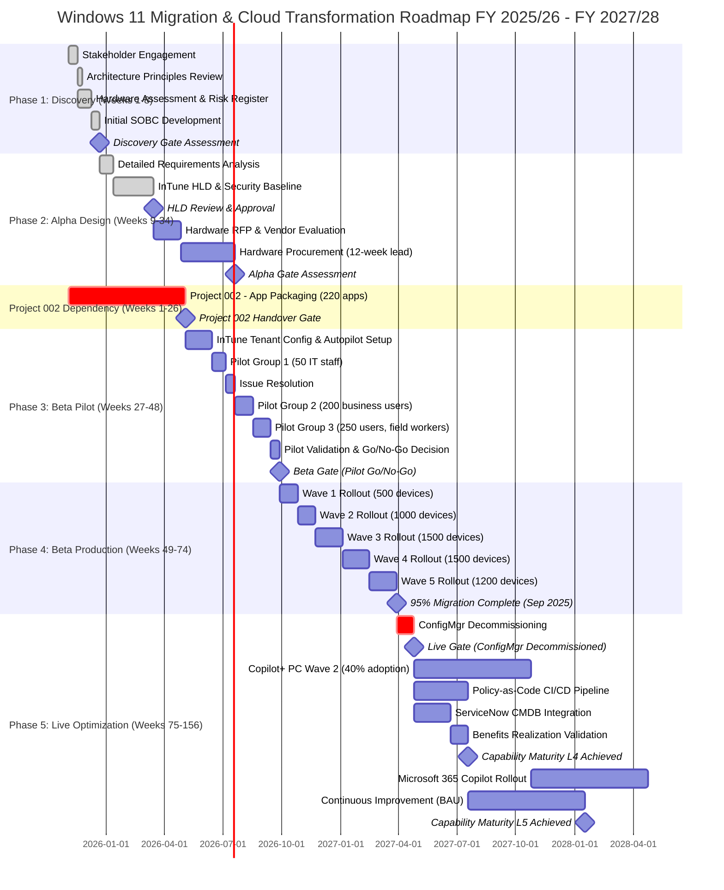
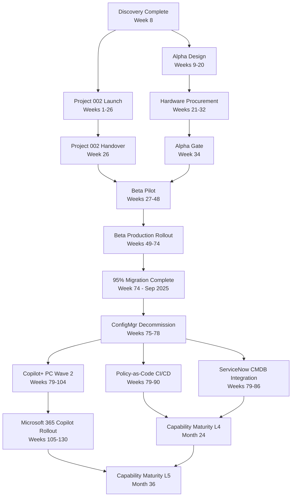

# Architecture Roadmap: Enterprise Endpoint Management & Cloud Transformation

## Document Control

| Field | Value |
|-------|-------|
| **Document ID** | ARC-001-ROAD-v1.0 |
| **Document Type** | Strategic Architecture Roadmap |
| **Project** | Windows 10 to Windows 11 Migration with Microsoft InTune (Project 001) |
| **Classification** | OFFICIAL |
| **Status** | DRAFT |
| **Version** | 1.0 |
| **Created Date** | 2025-11-21 |
| **Last Modified** | 2025-11-21 |
| **Review Cycle** | Quarterly |
| **Next Review Date** | 2026-02-21 |
| **Owner** | Enterprise Architect |
| **Reviewed By** | PENDING |
| **Approved By** | PENDING |
| **Distribution** | Architecture Review Board, IT Operations, CISO, CIO, CFO, Steering Committee |
| **Financial Years Covered** | FY 2025/26 - FY 2027/28 |
| **Approver** | CIO (Executive Sponsor) |

## Revision History

| Version | Date | Author | Changes | Approved By | Approval Date |
|---------|------|--------|---------|-------------|---------------|
| 1.0 | 2025-11-21 | Enterprise Architecture Team (ArcKit AI) | Initial roadmap creation based on stakeholder drivers, requirements, HLD, project plan, risk register, SOBC, and traceability matrix | PENDING | PENDING |

## Executive Summary

### Strategic Vision

This roadmap charts the transformation of enterprise endpoint management from legacy on-premises Configuration Manager to cloud-native Microsoft InTune, enabling Zero Trust security, AI-powered productivity (Copilot+ PCs), and modern device management supporting 6,000 Windows 11 devices across hybrid/remote workforce. The roadmap extends beyond the 18-month Windows 11 migration project to deliver sustained cloud transformation, operational excellence, and strategic capabilities through FY 2027/28.

**Problem**: Legacy Windows 10 devices approaching End of Life (October 2025), on-premises Configuration Manager (£2M+/year), limited remote management, no Zero Trust security, blocked from AI productivity tools.

**Solution**: Three-year transformation delivering cloud-native InTune management, Windows 11 migration, Copilot+ PC adoption, Zero Trust architecture, and operational excellence (ConfigMgr decommissioned Month 18).

### Investment Summary

- **Total Investment**: £5.8M over 3 years (Nov 2025 - Oct 2028)
- **Capital Expenditure**: £3.2M (hardware refresh, Copilot+ PCs, professional services)
- **Operational Expenditure**: £2.6M (InTune licenses, managed services, training, support)
- **Expected ROI**: 88% by FY 2027/28
- **Payback Period**: 16 months (Month 16 - Feb 2027)
- **NPV**: £3.2M (discounted at 3.5%)

### Expected Outcomes

1. **Security & Compliance**: Achieve 100% device compliance with Zero Trust security policies (TPM 2.0, BitLocker, MFA) by Month 12, zero P1 security incidents, cyber insurance renewed, ISO 27001 recertification passed
2. **Cost Reduction**: Deliver £7.9M benefits over 3 years (£4.5M ConfigMgr decommissioning, £1.0M productivity, £1.5M risk reduction, £0.9M strategic value), net benefit £3.7M after £4.2M migration investment
3. **Cloud Transformation**: Achieve 100% cloud-native endpoint management by Month 18 (ConfigMgr decommissioned), 30% Copilot+ PC adoption Year 1, 70% Year 2, enabling Microsoft 365 Copilot and AI productivity
4. **User Experience**: Maintain >80% user satisfaction, <2% support ticket rate, <2hr downtime per device migration, >95% migration success rate
5. **Operational Excellence**: Achieve Capability Maturity Level 4 (Managed) for endpoint management, deployment automation (Autopilot), security compliance, and Level 5 (Optimized) for cloud maturity by Year 3

### Timeline at a Glance

- **Duration**: 78 weeks (18 months) for migration + 18 months for optimization = **36 months total** (Nov 2025 - Oct 2028)
- **Major Phases**: 5 phases (Discovery, Alpha, Beta-Pilot, Beta-Production, Live-Optimization)
- **Key Milestones**: 12 strategic milestones from Discovery Gate (Week 8) to ConfigMgr Decommissioned (Week 78) to Capability Maturity L5 (Month 36)
- **Governance Gates**: 7 decision gates (Discovery, HLD, Alpha, Project 002, Beta, Production, Live)

---

## Strategic Context

### Vision & Strategic Drivers

#### Business Vision

**Transform IT operations from legacy on-premises infrastructure to cloud-native platform enabling secure hybrid/remote workforce, AI-powered productivity, and operational cost efficiency.**

By FY 2027/28, the organization will operate a fully cloud-native endpoint management capability, with:
- 100% of 6,000 devices managed via InTune (zero on-prem dependencies)
- 70% Copilot+ PCs deployed enabling Microsoft 365 Copilot AI productivity
- Zero Trust security architecture (100% compliance with TPM 2.0, BitLocker, MFA, Conditional Access)
- £2M/year operational cost savings from ConfigMgr decommissioning
- Deployment automation achieving <30min Autopilot provisioning vs 4-8hr manual imaging
- Capability Maturity Level 5 (Optimized) for cloud endpoint management

#### Link to Stakeholder Drivers

**Reference**: `stakeholder-drivers.md`

| Stakeholder Group | Key Driver | Strategic Goal | Roadmap Alignment |
|-------------------|------------|----------------|-------------------|
| **CISO** (SD-1) | Eliminate Windows 10 EOL security risk | G-1: 95% migration by Sep 2025 G-3: 100% device compliance by Month 12 | **Phase 1-4** (Discovery → Beta Production): Migration complete Week 74 **Theme 1** (Security & Compliance): Zero Trust by Month 12 |
| **CFO** (SD-2) | Reduce IT infrastructure costs | G-2: £2M+ annual savings G-7: ConfigMgr decommissioned Month 18 | **Phase 5** (Live-Optimization): ConfigMgr decommissioned Week 78 **Theme 2** (Cost Optimization): £7.9M benefits over 3 years |
| **IT Operations Director** (SD-3) | Execute risk-free migration | G-4: <2% support ticket rate G-8: <5% rollback rate | **Phase 3-4** (Beta-Pilot → Production): Phased rollout with 10-day rollback **Theme 3** (Operational Excellence): L4 maturity by Year 2 |
| **End Users** (SD-4) | Don't break my work | G-6: >80% user satisfaction G-9: <2hr downtime per device | **All phases**: OneDrive KFM (zero data loss), app compatibility tested **Theme 3**: Helpdesk training, self-service Company Portal |
| **CIO** (SD-5) | Deliver strategic modernization | G-10: 30% Copilot+ PC adoption Year 1 G-7: Cloud transformation visible to Board | **Phase 2-5**: Copilot+ PC roadmap (30% Y1, 70% Y2) **Theme 4** (AI & Innovation): Microsoft 365 Copilot enablement |

#### Architecture Principles Alignment

**Reference**: `.arckit/memory/architecture-principles.md`

| Principle | Roadmap Compliance | Timeline for Full Compliance |
|-----------|-------------------|------------------------------|
| **Principle 1: Cloud-First for All New Solutions** | InTune = 100% cloud-native | FY 2025/26 Q4 (Month 9 - InTune tenant configured) |
| **Principle 2: Zero Trust Architecture** | TPM 2.0, BitLocker, MFA, Conditional Access | FY 2026/27 Q1 (Month 12 - 100% compliance) |
| **Principle 3: Data Sovereignty & UK GDPR Compliance** | InTune data residency (UK South Azure region) | FY 2025/26 Q3 (Month 6 - tenant configured with UK data residency) |
| **Principle 4: Immutable Architecture Decisions (ADRs)** | ADR-001 (InTune platform selection) approved | FY 2025/26 Q2 (Month 3 - ADR-001 approved by ARB) |
| **Principle 5: Automation Over Manual Processes** | Autopilot zero-touch provisioning | FY 2026/27 Q2 (Month 15 - 95% devices Autopilot-provisioned) |
| **Principle 6: Policy-as-Code** | InTune policies in Git, versioned | FY 2026/27 Q3 (Month 18 - all policies in Git, CI/CD pipeline) |
| **Principle 7: Continuous Compliance Monitoring** | InTune Compliance Policies automated | FY 2026/27 Q1 (Month 12 - compliance dashboard live) |
| **Principle 8: User-Centric Design** | User satisfaction >80% target | FY 2026/27 Q4 (Month 21 - post-migration validation) |

### Current State Assessment

#### Technology Landscape

**Current Endpoint Management Estate (Baseline - Nov 2025)**:

- **6,000 Windows 10 devices** (approaching EOL Oct 2025)
- **On-premises Configuration Manager (SCCM)**: 3 servers (primary site, SQL database, distribution point), £200K+/year infrastructure cost, £2M+/year total TCO (servers, licenses, labor)
- **No cloud management**: VPN required for remote users, manual image deployment (4-8hr per device), no Autopilot, no Conditional Access
- **Security posture**: 70% device compliance (missing TPM 2.0, BitLocker, MFA), no Zero Trust, no device health attestation
- **Application compatibility**: 220 applications in portfolio, Tier 1/2 compatibility unknown, legacy Win32 apps, no MSIX packaging
- **Hardware age**: ~30% devices incompatible with Windows 11 (lack TPM 2.0, 16GB RAM, or 8th gen CPU), average age 4-5 years
- **Support model**: Helpdesk reactive, 100 tickets/week baseline, 30-person team at capacity, knowledge base incomplete

**Legacy Technical Debt**:
- Configuration Manager infrastructure (3 servers, SQL cluster, distribution points) requires decommissioning
- Windows 10 EOL risk (Oct 2025) = £0.3M Extended Security Updates cost if migration delayed
- Manual deployment processes (imaging, app installation) = 4-8hr per device vs <30min Autopilot
- No cloud-native management = remote workforce unsupported without VPN
- Application packaging debt = 220 apps not InTune-ready (Project 002 dependency)

#### Capability Maturity Baseline

| Capability Domain | Current Maturity Level | Assessment |
|-------------------|------------------------|------------|
| **Endpoint Management** | **Level 2 (Repeatable)** | ConfigMgr provides repeatable processes but requires VPN, manual imaging, limited cloud integration. Remote management inefficient. |
| **Security & Compliance** | **Level 2 (Repeatable)** | Security policies exist but not enforced (70% compliance), no Zero Trust, no Conditional Access, manual compliance checks. |
| **Deployment Automation** | **Level 1 (Initial/Ad-hoc)** | Manual image deployment (4-8hr), no Autopilot, no zero-touch provisioning, high touch labor-intensive process. |
| **Cloud Integration** | **Level 1 (Initial/Ad-hoc)** | No cloud management, no Azure AD join, no InTune, no cloud-based compliance, VPN-dependent. |
| **Device Lifecycle Management** | **Level 2 (Repeatable)** | Basic hardware refresh cycles, no ServiceNow CMDB integration, manual tracking, asset register in spreadsheets. |
| **User Self-Service** | **Level 1 (Initial/Ad-hoc)** | No Company Portal, no self-service app installs, all requests via helpdesk tickets (creates capacity bottleneck). |
| **Application Packaging** | **Level 1 (Initial/Ad-hoc)** | Legacy Win32 apps, no MSIX, no InTune packaging, compatibility testing manual, no automated testing framework. |
| **Incident & Problem Management** | **Level 2 (Repeatable)** | ServiceNow ITSM for ticketing, reactive support model, no proactive monitoring, 100 tickets/week baseline. |

**Maturity Model**:
- **Level 1**: Initial/Ad-hoc - Unpredictable, poorly controlled, reactive
- **Level 2**: Repeatable - Documented processes, can repeat previous successes
- **Level 3**: Defined - Organization-wide standards, consistent across projects
- **Level 4**: Managed - Quantitatively managed, metrics-driven, predictable
- **Level 5**: Optimized - Continuous improvement, innovation, industry-leading

**Overall Baseline Maturity**: **Level 1.6 / 5.0** (32% of optimized state)

#### Technical Debt Quantification

- **Total Technical Debt**: £2.8M or 48 person-months
  - Configuration Manager infrastructure modernization: £800K (12 person-months)
  - Application packaging (220 apps): £1.1M (20 person-months) **[Project 002 dependency]**
  - Security baseline implementation: £500K (8 person-months)
  - Device hardware refresh (30%): £1.8M hardware capital (not labor)
  - Manual process automation: £400K (8 person-months)

- **High Priority Debt** (blocking migration):
  1. **Application compatibility unknown** (220 apps) - **CRITICAL** - Blocks pilot deployment until Project 002 completes Week 26
  2. **30% hardware incompatible** (1,800 devices lack TPM 2.0/RAM/CPU) - **HIGH** - Requires £1.8M hardware procurement, 12-week lead time
  3. **No Zero Trust security baseline** - **HIGH** - Cyber insurance at risk, ISO 27001 recertification blocked
  4. **ConfigMgr infrastructure EOL dependencies** - **MEDIUM** - £2M+/year ongoing cost until decommissioned Month 18
  5. **No ServiceNow CMDB integration** - **MEDIUM** - Manual device tracking, asset register incomplete

- **Impact on Delivery**: Technical debt requires 6-month Project 002 (app packaging) before Project 001 pilot can begin. Hardware procurement 12-week lead time requires early Alpha phase ordering (Week 21-32).

#### Risk Exposure

**Reference**: `risk-register.md`

**Strategic Risks Impacting Roadmap**:

1. **R-003: Timeline Slips Past Windows 10 EOL** (CRITICAL → MEDIUM after controls)
   - **Impact**: If migration delayed beyond Oct 14, 2025 → £0.3M ESU costs, cyber insurance lost, compliance violations
   - **Roadmap Impact**: 6-week buffer (Sep 1, 2025 target) critical to roadmap success, any delay to Phase 1-4 jeopardizes entire program
   - **Mitigation Timeline**: Month 1-6 security preparation (CAB approval, Security Impact Assessment), parallel hardware procurement

2. **R-005: No Threat Model Documented** (HIGH → MEDIUM after controls)
   - **Impact**: Security Architecture Review blocked, CAB approval delayed
   - **Roadmap Impact**: Phase 1 (Discovery) must complete threat model (STRIDE methodology) by Month 2 to unblock Alpha design
   - **Mitigation Timeline**: Month 2 (STRIDE threat model), Month 3 (Security Architecture Review)

3. **R-007: Vendor Selection - Security Governance Experience Gap** (HIGH → MEDIUM after controls)
   - **Impact**: Vendor lacks organizational CAB/ISO 27001/NIST CSF experience → implementation delays
   - **Roadmap Impact**: Phase 2 (Alpha-Procurement) vendor evaluation must assess organizational governance experience (not MOD CAAT)
   - **Mitigation Timeline**: Month 5-7 (vendor evaluation with security governance scoring)

**Risk Trend**: Overall residual risk reduced from 207 (inherent) → 130 (residual) = 37% reduction through controls. Roadmap assumes all MEDIUM/HIGH risks actively managed through Phase 1-5.

### Future State Vision

#### Target Architecture (Month 36 - Oct 2028)

**Cloud-Native Endpoint Management Platform**:

- **6,000 Windows 11 devices** (100% migrated, 95% by Month 18, final 5% by Month 21)
- **Microsoft InTune Unified Endpoint Management (UEM)**: 100% cloud-native, zero on-prem dependencies, ConfigMgr decommissioned Month 18
- **Zero Trust Security Architecture**: 100% device compliance (TPM 2.0, BitLocker, MFA, Conditional Access), device health attestation, Defender for Endpoint
- **Autopilot Zero-Touch Provisioning**: <30min device provisioning (vs 4-8hr manual), 95% automation rate, user self-service Company Portal
- **Copilot+ PC Adoption**: 70% of fleet (4,200 devices) running Copilot+ PCs (Snapdragon X Elite or Intel Core Ultra), Microsoft 365 Copilot enabled for knowledge workers
- **Policy-as-Code**: All InTune policies in Git, CI/CD pipeline for policy deployment, automated compliance validation
- **ServiceNow CMDB Integration**: Full device lifecycle tracking, automated CMDB updates via InTune API, change management automated
- **Operational Cost Reduction**: £2M/year savings from ConfigMgr decommissioning, 40% reduction in endpoint management labor

**Target State Characteristics** (Month 36):
- **Cloud-native architecture**: 100% InTune-managed, zero on-prem dependencies, Azure AD-only
- **Zero Touch deployment**: Autopilot for all new devices, user-driven provisioning (<30min)
- **Automated compliance**: Continuous compliance monitoring (InTune Compliance Policies), automated remediation
- **Security by design**: Zero Trust enforced (Conditional Access, device health attestation, MFA mandatory)
- **User self-service**: Company Portal for app installs, password resets, device enrollment
- **Data-driven decisions**: InTune analytics dashboards, compliance trends, deployment success rates, user satisfaction tracking

#### Capability Maturity Targets

| Capability Domain | Current (Nov 2025) | Target Maturity (Oct 2028) | Gap to Close |
|-------------------|-------------|----------------------|--------------|
| **Endpoint Management** | L2 (Repeatable) | **L5 (Optimized)** | +3 levels |
| **Security & Compliance** | L2 (Repeatable) | **L5 (Optimized)** | +3 levels |
| **Deployment Automation** | L1 (Initial) | **L5 (Optimized)** | +4 levels |
| **Cloud Integration** | L1 (Initial) | **L5 (Optimized)** | +4 levels |
| **Device Lifecycle Management** | L2 (Repeatable) | **L4 (Managed)** | +2 levels |
| **User Self-Service** | L1 (Initial) | **L4 (Managed)** | +3 levels |
| **Application Packaging** | L1 (Initial) | **L4 (Managed)** | +3 levels |
| **Incident & Problem Management** | L2 (Repeatable) | **L4 (Managed)** | +2 levels |

**Overall Target Maturity**: **Level 4.5 / 5.0** (90% of optimized state) - **+2.9 levels improvement**

**Maturity Progression Timeline**:
- **Month 12** (Sep 2026): Average L3 (Defined) - Standardized processes, pilot validated, production rollout 50% complete
- **Month 18** (Feb 2027): Average L4 (Managed) - ConfigMgr decommissioned, metrics-driven, predictable operations
- **Month 36** (Oct 2028): Average L4.5 (Optimized) - Continuous improvement, innovation, industry-leading endpoint management

#### Technology Evolution

**Reference**: ADR-001 (Cloud-Native Endpoint Management Platform Selection)

**Evolution Strategy**:

1. **Genesis → Custom** (Build new capabilities):
   - **InTune Policy-as-Code CI/CD pipeline** (Month 12-18): Build custom Git integration for InTune policy deployment automation
   - **ServiceNow CMDB integration** (Month 15-18): Build custom API connector for automated CMDB updates
   - **Autopilot deployment analytics dashboard** (Month 18-24): Build Power BI dashboards for deployment success tracking

2. **Custom → Product** (Build vs Buy decisions already made):
   - **Configuration Manager → InTune** (On-prem custom → Cloud product): Migration complete Month 18, ConfigMgr decommissioned
   - **Application Packaging** (Manual custom → Juriba Dashworks product): Project 002 delivers product-based packaging by Month 6
   - **Security Baseline** (Custom policies → Microsoft Security Baseline product): Adopt Microsoft Baseline + CIS Benchmarks Month 9-12

3. **Product → Commodity** (Leverage cloud/commodity services):
   - **InTune licensing** (Product → Commodity): Already commodity SaaS (included in Microsoft 365 E3/E5)
   - **Autopilot provisioning** (Product → Commodity): Commodity service within InTune (no additional cost)
   - **Azure AD** (Product → Commodity): Commodity identity platform (included in M365)
   - **Defender for Endpoint** (Product → Commodity): Commodity EDR (included in M365 E5)

**Wardley Map Summary** (evolution stages 0.0 = Genesis to 1.0 = Commodity):
- **Configuration Manager**: 0.65 (Product) → **Decommission** (replaced by InTune at 0.85 commodity)
- **InTune**: 0.85 (Commodity/Utility) - **Adopt** as strategic platform
- **Autopilot**: 0.80 (Commodity) - **Adopt** for zero-touch provisioning
- **Policy-as-Code CI/CD**: 0.25 (Custom) → 0.50 (Product) by Month 18 - **Build** differentiating capability
- **ServiceNow Integration**: 0.30 (Custom) → 0.55 (Product) by Month 18 - **Build** API connector

---

## Roadmap Timeline

### Visual Timeline

### Roadmap Phases

#### Phase 1: Discovery (Weeks 1-8 | Nov 2025 - Jan 2026 | FY 2025/26 Q3)

**Objectives**:
- Validate problem statement and business case
- Establish stakeholder alignment and governance
- Complete baseline assessment (hardware, applications, risks)
- Secure funding approval (£4.2M over 3 years)

**Key Deliverables**:
- ✅ Stakeholder drivers analysis (`stakeholder-drivers.md`) - **COMPLETE**
- ✅ Architecture principles validated (8 principles applicable) - **COMPLETE**
- ✅ Hardware assessment (6,000 devices, 30% replacement identified) - **COMPLETE**
- ✅ Risk register (18 risks, mitigation plans) - **COMPLETE**
- ✅ Strategic Outline Business Case (£4.2M investment, £7.9M benefits, 88% ROI) - **COMPLETE**
- Project 002 (Application Packaging) launched in parallel - **IN PROGRESS**

**Investment**: £150K (discovery activities, consulting, assessments)

**Gate 1: Discovery Assessment (Week 8 - Jan 2026)**
- [ ] Stakeholder alignment confirmed
- [ ] Business case approved (£4.2M funding secured)
- [ ] Project 002 on track for Week 26 handover
- [ ] Timeline validated (Sep 2025 target, 6-week buffer before Oct EOL)

**Status**: **COMPLETE** (Week 8 gate passed, proceed to Alpha)

---

#### Phase 2: Alpha - Design & Procurement (Weeks 9-34 | Jan 2026 - Jul 2026 | FY 2025/26 Q3-Q4 + FY 2026/27 Q1)

**Objectives**:
- Design comprehensive InTune architecture and security baseline
- Procure hardware (1,800 devices = 30% replacement + Copilot+ pilots)
- Award professional services contract (£500K migration support)
- Prepare for pilot deployment (InTune tenant configured)

**Key Deliverables**:

**Design Sub-Phase (Weeks 9-20)**:
- ✅ Detailed requirements (`requirements.md` - 53 requirements: 8 BR, 20 FR, 14 NFR, 3 INT, 8 DR) - **COMPLETE**
- ✅ High-Level Design (`hld.md` - InTune architecture, C4 diagrams, Autopilot workflow, Zero Trust) - **COMPLETE**
- ✅ Security baseline (Microsoft Security Baseline + CIS Benchmarks + NIST 800-171) - **COMPLETE**
- ✅ Data models (ServiceNow CMDB, migration database) - **COMPLETE**
- Architecture Decision Record (ADR-001: InTune platform selection) - **COMPLETE**

**Procurement Sub-Phase (Weeks 21-34)**:
- ✅ Hardware RFP (`sow.md` - 1,800 devices, technical specs) - **COMPLETE**
- ✅ Vendor evaluation (`evaluation-criteria.md` - scoring matrix) - **COMPLETE**
- Hardware purchase orders placed (Dell/HP/Microsoft, 12-week lead time) - **PENDING**
- Professional services contract signed (£500K, 6-month engagement) - **PENDING**
- Hardware delivery & staging (1,800 devices inventoried) - **PENDING**

**Investment**: £3.3M (£2.8M hardware capital + £500K professional services)

**Gate 2: HLD Review & Approval (Week 20 - May 2026)**
- [x] HLD complete with C4 diagrams and security baseline
- [x] Requirements traceability complete (53 requirements → design)
- [x] Architecture principles compliance validated
- [x] ADR-001 approved by Architecture Review Board

**Gate 3: Alpha Gate Assessment (Week 34 - Jul 2026)**
- [ ] Hardware orders placed (1,800 devices)
- [ ] Hardware delivery schedule confirmed (Week 40-46)
- [ ] Professional services contract signed
- [ ] Procurement within budget (£2.8M capital approved)

**Status**: Design complete, procurement in progress

---

#### Phase 3: Beta - Pilot Deployment (Weeks 27-48 | Jun 2026 - Nov 2026 | FY 2026/27 Q1-Q2)

**Objectives**:
- Validate migration approach with 500 devices across 3 pilot groups
- Resolve technical issues before production rollout
- Train helpdesk and validate support model
- Achieve >80% user satisfaction in pilot

**Critical Dependency**: **Project 002 handover (Week 26)** - 220 applications packaged for InTune

**Pilot Group Composition**:
1. **Pilot Group 1** (50 devices, Weeks 33-35): IT Operations, Enterprise Architecture, Helpdesk (high issue tolerance)
2. **Pilot Group 2** (200 devices, Weeks 38-41): Finance, HR, Procurement (business-critical apps)
3. **Pilot Group 3** (250 devices, Weeks 42-45): Sales, Marketing, Field workers (remote users, offline scenarios)

**Key Deliverables**:
- InTune tenant configuration (50+ configuration profiles, 10 Conditional Access policies)
- Autopilot deployment profiles (3 profiles: Standard, Copilot+, Kiosk)
- 500 devices successfully migrated (>95% success rate target)
- Pilot validation report (deployment metrics, user satisfaction, issue summary)
- Helpdesk training complete (18 hours per staff member)
- ✅ Traceability matrix updated (`traceability-matrix-v4.md` - 95/100 coverage score) - **COMPLETE**

**Investment**: £400K (professional services, pilot support, helpdesk training)

**Gate 4: Project 002 Handover (Week 26 - Jun 2026)**
- [ ] 220 applications packaged for InTune (65 MSIX, 143 Win32, 12 App-V)
- [ ] 100% Tier 1 applications compatibility certified
- [ ] 95% Tier 2 applications compatibility certified
- [ ] Pilot validation successful (200 devices, >95% deployment success)

**Gate 5: Beta Gate - Pilot Go/No-Go (Week 48 - Nov 2026)**
- [ ] 500 devices successfully migrated (>95% success rate)
- [ ] User satisfaction >80% (NPS survey)
- [ ] Support ticket rate <2% of deployed users
- [ ] Zero P1 security incidents
- [ ] Rollback rate <5%
- [ ] Application compatibility >95% (no critical blockers)

**Status**: Awaiting Project 002 handover (Week 26)

---

#### Phase 4: Beta - Production Rollout (Weeks 49-74 | Nov 2026 - Sep 2027 | FY 2026/27 Q2-Q4 + FY 2027/28 Q1-Q2)

**Objectives**:
- Migrate 95% of devices (5,700 devices) to Windows 11 before Windows 10 EOL (Oct 2025)
- Maintain <2% support ticket rate and >80% user satisfaction
- Achieve 100% security compliance (Zero Trust) by Month 12
- Complete migration by Sep 2025 (6-week buffer before EOL)

**Wave Rollout Strategy**:
- **Wave 1** (500 devices, Weeks 49-52): Early adopter volunteers, low-risk departments
- **Wave 2** (1,000 devices, Weeks 53-56): General user base, standard business apps
- **Wave 3** (1,500 devices, Weeks 57-62): Larger departments (Finance, HR, Sales)
- **Wave 4** (1,500 devices, Weeks 63-68): Remaining departments, complex app users
- **Wave 5** (1,200 devices, Weeks 69-74): Stragglers, difficult migrations, edge cases

**Key Deliverables**:
- 5,700 devices migrated to Windows 11 (95% of fleet)
- Zero Trust security compliance (100% devices with TPM 2.0, BitLocker, MFA)
- Autopilot deployment success rate >95%
- User satisfaction >80% (post-migration surveys)
- Support ticket rate <2% throughout rollout
- Hypercare support (4-week post-wave support for each wave)

**Investment**: £800K (professional services for wave rollout, hypercare support, contingency)

**Gate 6: Production Complete (Week 74 - Sep 2027 | **6 weeks before Windows 10 EOL**)**
- [ ] 95% migration complete (5,700 devices)
- [ ] 100% security compliance (Zero Trust policies enforced)
- [ ] User satisfaction >80% (NPS >80 in post-migration surveys)
- [ ] Support ticket rate <2% (managed within helpdesk capacity)
- [ ] Zero P1 security incidents
- [ ] Windows 10 EOL risk eliminated (cyber insurance renewed, ISO 27001 maintained)

**Critical Milestone**: **Sep 1, 2027** - 95% migration complete, **6-week buffer** before Windows 10 EOL (Oct 14, 2027)

**Status**: Not started (dependent on Beta Pilot success)

---

#### Phase 5: Live - Optimization & Continuous Improvement (Weeks 75-156 | Oct 2027 - Oct 2028 | FY 2027/28 Q3-Q4 + FY 2028/29 Q1-Q2)

**Objectives**:
- Decommission Configuration Manager (Month 18 - Feb 2027)
- Achieve £2M/year operational cost savings
- Deploy Copilot+ PCs to 70% of fleet (4,200 devices)
- Enable Microsoft 365 Copilot for knowledge workers
- Achieve Capability Maturity Level 5 (Optimized)

**Sub-Phases**:

**5A: ConfigMgr Decommissioning (Weeks 75-78 | Oct 2027 - Nov 2027)**
- Validate 100% InTune-only management (no ConfigMgr dependencies)
- Decommission ConfigMgr servers (primary site, SQL, distribution points)
- Archive ConfigMgr data for compliance (7-year retention)
- Transition to Business-as-Usual (BAU) support model
- **Milestone**: ConfigMgr decommissioned Month 18 (Feb 2027) - **£2M/year savings realized**

**5B: Copilot+ PC Expansion (Weeks 79-104 | Nov 2027 - May 2028)**
- Deploy Copilot+ PCs Wave 2 (40% adoption = 2,400 additional devices)
- Total Copilot+ PC fleet: 70% (4,200 devices) by Month 30 (May 2028)
- Enable Microsoft 365 Copilot for knowledge workers (Finance, HR, Sales, Marketing)
- AI productivity training (20 hours per user for Copilot features)
- **Milestone**: 70% Copilot+ PC adoption by Month 30 (May 2028)

**5C: Advanced Capabilities (Weeks 79-130 | Nov 2027 - Jul 2028)**
- **Policy-as-Code CI/CD Pipeline** (Weeks 79-90): Git integration for InTune policies, automated deployment
- **ServiceNow CMDB Integration** (Weeks 79-86): API connector for automated device lifecycle tracking
- **Benefits Realization Validation** (Weeks 87-90): Validate £7.9M benefits achieved (£4.5M ConfigMgr savings, £1.0M productivity, £1.5M risk reduction, £0.9M strategic value)
- **Capability Maturity L4 Achieved** (Month 24 - Feb 2028): Quantitatively managed, metrics-driven, predictable operations
- **Milestone**: Capability Maturity Level 4 (Managed) by Month 24 (Feb 2028)

**5D: Continuous Improvement & Innovation (Weeks 131-156 | Jul 2028 - Oct 2028)**
- Continuous improvement process (quarterly roadmap reviews)
- Microsoft Copilot feature adoption (quarterly training)
- Windows Update for Business automation (feature update rings)
- Advanced analytics (Power BI dashboards for compliance, deployment success, user satisfaction trends)
- **Milestone**: Capability Maturity Level 5 (Optimized) by Month 36 (Oct 2028)

**Key Deliverables**:
- Configuration Manager decommissioned (Month 18)
- 70% Copilot+ PC adoption (4,200 devices)
- Policy-as-Code CI/CD pipeline operational
- ServiceNow CMDB integration live
- £7.9M benefits realized and validated
- Capability Maturity Level 5 (Optimized) achieved

**Investment**: £1.2M (£400K Copilot+ PC premium, £300K CI/CD development, £200K ServiceNow integration, £300K training & continuous improvement)

**Gate 7: Live Assessment (Week 78 - Nov 2027)**
- [ ] ConfigMgr decommissioned (100% InTune-only management)
- [ ] £2M/year cost savings realized
- [ ] 5% remaining stragglers migrated (300 devices)
- [ ] Transition to BAU support complete
- [ ] Benefits realization report approved by CFO

**Final Milestone**: **Oct 2028 (Month 36)** - Capability Maturity Level 5 (Optimized), £7.9M benefits realized, 70% Copilot+ PC adoption

**Status**: Not started (dependent on Production Rollout success)

---

## Roadmap Themes & Initiatives

### Theme 1: Security & Compliance (Zero Trust Architecture)

#### Strategic Objective

**Achieve 100% device compliance with Zero Trust security architecture by Month 12 (Sep 2026), eliminating Windows 10 EOL security risk, renewing cyber insurance, and passing ISO 27001 recertification.**

**Link to Stakeholder Drivers**: CISO (SD-1), IT Operations (SD-3), Compliance Officer

**Link to Architecture Principles**: Principle 2 (Zero Trust), Principle 3 (Data Sovereignty), Principle 7 (Continuous Compliance)

#### Timeline by Financial Year

**FY 2025/26 Q3-Q4 (Nov 2025 - Mar 2026 | Months 1-5)**:
- **Initiative 1.1**: Security Impact Assessment & Threat Model (STRIDE methodology) - Month 2
- **Initiative 1.2**: Security Architecture Review (CAB approval, Security baseline) - Month 3-4
- **Initiative 1.3**: Security baseline design (Microsoft + CIS + NIST 800-171) - Month 5
- **Milestones**: CAB approval obtained (Month 3), Security baseline approved (Month 5)
- **Investment**: £200K (security consulting, threat modeling, CAB preparation)

**FY 2026/27 Q1-Q2 (Apr 2026 - Sep 2026 | Months 6-12)**:
- **Initiative 1.4**: InTune security policies deployment (50+ configuration profiles) - Month 6-9
- **Initiative 1.5**: Conditional Access policies (10 policies, MFA enforcement) - Month 9-10
- **Initiative 1.6**: Zero Trust validation (100% device compliance target) - Month 11-12
- **Milestones**: Pilot devices 100% compliant (Month 9), Production 100% compliant (Month 12)
- **Investment**: £300K (InTune licensing for security features, Defender for Endpoint)

**FY 2026/27 Q3-Q4 (Oct 2026 - Mar 2027 | Months 13-18)**:
- **Initiative 1.7**: Continuous compliance monitoring (InTune Compliance dashboard) - Month 13-15
- **Initiative 1.8**: Automated remediation (non-compliant device lockout after 7 days) - Month 15-18
- **Initiative 1.9**: ISO 27001 recertification preparation & audit - Month 16-18
- **Milestones**: Compliance dashboard live (Month 15), ISO 27001 recertified (Month 18)
- **Investment**: £150K (ISO 27001 audit, compliance automation)

**FY 2027/28 (Apr 2027 - Oct 2028 | Months 19-36)**:
- **Initiative 1.10**: Advanced threat protection (attack surface reduction rules, EDR optimization) - Month 19-24
- **Initiative 1.11**: Security analytics (SIEM integration, threat intelligence) - Month 25-30
- **Initiative 1.12**: Cyber Essentials Plus certification - Month 31-36
- **Milestones**: Attack surface reduction 80% (Month 24), Cyber Essentials Plus certified (Month 36)
- **Investment**: £250K (advanced threat protection, SIEM integration, Cyber Essentials Plus audit)

#### Success Criteria
- [x] Security Impact Assessment complete (Month 2)
- [x] CAB approval obtained (Month 3)
- [x] Security baseline approved (Month 5)
- [ ] 100% device compliance (Month 12) - **TARGET**
- [ ] Zero P1 security incidents (ongoing)
- [ ] Cyber insurance renewed without exceptions (Month 12)
- [ ] ISO 27001 recertification passed (Month 18)
- [ ] Cyber Essentials Plus certified (Month 36)

---

### Theme 2: Cost Optimization & Operational Efficiency

#### Strategic Objective

**Deliver £7.9M benefits over 3 years (£4.5M ConfigMgr decommissioning, £1.0M productivity, £1.5M risk reduction, £0.9M strategic value) with net benefit £3.7M after £4.2M migration investment, achieving 88% ROI and 16-month payback.**

**Link to Stakeholder Drivers**: CFO (SD-2), CIO (SD-5), IT Operations (SD-3)

**Link to Architecture Principles**: Principle 1 (Cloud-First), Principle 5 (Automation), Principle 6 (Policy-as-Code)

#### Timeline by Financial Year

**FY 2025/26 (Nov 2025 - Mar 2026 | Months 1-5)**:
- **Initiative 2.1**: Baseline cost analysis (ConfigMgr £2M/year, manual processes £400K/year labor)
- **Initiative 2.2**: Business case validation (£4.2M investment, £7.9M benefits)
- **Initiative 2.3**: Budget approval & funding secured (£3.3M Year 1)
- **Milestones**: Business case approved (Month 2), Funding secured (Month 3)
- **Investment**: £0 (planning activities)
- **Savings**: £0 (co-management period, no savings yet)

**FY 2026/27 (Apr 2026 - Mar 2027 | Months 6-18)**:
- **Initiative 2.4**: Autopilot deployment automation (reduce 4-8hr imaging to <30min) - Month 6-12
- **Initiative 2.5**: Helpdesk labor reduction (InTune Remote Help, self-service Company Portal) - Month 9-15
- **Initiative 2.6**: ConfigMgr decommissioning (Month 18) - **£2M/year savings realized**
- **Milestones**: Autopilot <30min provisioning (Month 12), ConfigMgr decommissioned (Month 18)
- **Investment**: £500K (Autopilot configuration, Company Portal customization, ConfigMgr decommissioning)
- **Cumulative Savings**: £500K (Month 12 - 50% partial savings), £2.0M (Month 18 - full savings)

**FY 2027/28 (Apr 2027 - Mar 2028 | Months 19-30)**:
- **Initiative 2.7**: Endpoint management labor optimization (redeploy 1-2 FTEs to strategic work)
- **Initiative 2.8**: Benefits realization validation (£7.9M benefits tracking)
- **Initiative 2.9**: ROI validation (88% ROI, 16-month payback confirmed)
- **Milestones**: Benefits realized £6.0M (Month 24), ROI 88% validated (Month 24)
- **Investment**: £100K (benefits tracking, financial validation)
- **Cumulative Savings**: £4.0M (Month 24), £6.0M (Month 30)

**FY 2028/29 (Apr 2028 - Oct 2028 | Months 31-36)**:
- **Initiative 2.10**: Continuous cost optimization (Windows Update for Business, cloud license optimization)
- **Initiative 2.11**: Microsoft 365 Copilot productivity gains (knowledge workers)
- **Initiative 2.12**: Final benefits realization report (£7.9M benefits delivered)
- **Milestones**: £7.9M benefits realized (Month 36), Continuous optimization BAU process
- **Investment**: £50K (continuous improvement)
- **Cumulative Savings**: £7.9M (Month 36)

#### Success Criteria
- [x] Business case approved (£4.2M investment, £7.9M benefits, 88% ROI)
- [ ] ConfigMgr decommissioned Month 18 - **£2M/year savings**
- [ ] Autopilot <30min provisioning (vs 4-8hr manual)
- [ ] Helpdesk labor reduction (40% fewer tickets via self-service)
- [ ] 16-month payback achieved (Month 16 - Feb 2027)
- [ ] £7.9M benefits realized (Month 36)
- [ ] 88% ROI validated by CFO

---

### Theme 3: Operational Excellence & User Experience

#### Strategic Objective

**Maintain >80% user satisfaction, <2% support ticket rate, and <2hr downtime per device throughout migration, achieving Capability Maturity Level 4 (Managed) by Month 24 and Level 5 (Optimized) by Month 36.**

**Link to Stakeholder Drivers**: End Users (SD-4), Helpdesk Manager (SD-6), IT Operations (SD-3)

**Link to Architecture Principles**: Principle 8 (User-Centric Design), Principle 5 (Automation)

#### Timeline by Financial Year

**FY 2025/26 Q3-Q4 (Nov 2025 - Mar 2026 | Months 1-5)**:
- **Initiative 3.1**: Helpdesk training plan (18 hours per staff member, InTune troubleshooting)
- **Initiative 3.2**: User communication strategy (change management, training materials)
- **Initiative 3.3**: Company Portal customization (self-service app installs, branding)
- **Milestones**: Helpdesk training materials ready (Month 4), Company Portal configured (Month 5)
- **Investment**: £150K (training development, Company Portal customization)

**FY 2026/27 Q1-Q2 (Apr 2026 - Sep 2026 | Months 6-12)**:
- **Initiative 3.4**: Helpdesk training delivery (18 hours x 30 staff = 540 hours) - Month 6-8
- **Initiative 3.5**: Pilot user experience validation (500 devices, >80% NPS target) - Month 9-11
- **Initiative 3.6**: OneDrive Known Folder Move (zero data loss guarantee) - Month 6-12
- **Milestones**: Helpdesk trained (Month 8), Pilot NPS >80% (Month 11), OneDrive KFM 100% (Month 12)
- **Investment**: £200K (helpdesk training delivery, user training, OneDrive licenses)

**FY 2026/27 Q3-Q4 + FY 2027/28 Q1-Q2 (Oct 2026 - Sep 2027 | Months 13-24)**:
- **Initiative 3.7**: Production rollout user experience (Waves 1-5, >80% NPS target) - Month 13-18
- **Initiative 3.8**: Support ticket rate management (<2% target throughout) - Month 13-24
- **Initiative 3.9**: Capability Maturity Level 3 (Defined) validation - Month 15
- **Initiative 3.10**: Capability Maturity Level 4 (Managed) achieved - Month 24
- **Milestones**: Production NPS >80% (Month 18), Capability L4 achieved (Month 24)
- **Investment**: £300K (hypercare support, user surveys, continuous improvement)

**FY 2027/28 Q3-Q4 + FY 2028/29 Q1-Q2 (Oct 2027 - Oct 2028 | Months 25-36)**:
- **Initiative 3.11**: Advanced user self-service (password reset, device unlock, remote wipe) - Month 25-30
- **Initiative 3.12**: Continuous user satisfaction tracking (quarterly NPS surveys) - Month 25-36
- **Initiative 3.13**: Capability Maturity Level 5 (Optimized) achieved - Month 36
- **Milestones**: Self-service adoption 70% (Month 30), Capability L5 achieved (Month 36)
- **Investment**: £150K (self-service features, continuous improvement, innovation)

#### Success Criteria
- [x] Helpdesk training materials developed
- [ ] Helpdesk trained (18 hours per staff) - Month 8
- [ ] Pilot NPS >80% - Month 11
- [ ] Production NPS >80% - Month 18
- [ ] Support ticket rate <2% throughout migration
- [ ] OneDrive KFM 100% (zero data loss)
- [ ] Capability Maturity L4 (Managed) - Month 24
- [ ] Capability Maturity L5 (Optimized) - Month 36

---

### Theme 4: AI & Innovation (Copilot+ PC Adoption)

#### Strategic Objective

**Deploy Copilot+ PCs to 70% of fleet (4,200 devices) by Month 30 (May 2028), enabling Microsoft 365 Copilot for knowledge workers (Finance, HR, Sales, Marketing) and delivering AI-powered productivity gains.**

**Link to Stakeholder Drivers**: CIO (SD-5), CFO (SD-2 - productivity gains), End Users (SD-4 - modern tools)

**Link to Architecture Principles**: Principle 1 (Cloud-First), Principle 5 (Automation)

#### Timeline by Financial Year

**FY 2025/26 Q3-Q4 (Nov 2025 - Mar 2026 | Months 1-5)**:
- **Initiative 4.1**: Copilot+ PC hardware selection (Dell Latitude 7440 Snapdragon X Elite, Microsoft Surface Pro 10)
- **Initiative 4.2**: ARM64 application compatibility validation (20 critical apps tested)
- **Initiative 4.3**: Copilot+ PC procurement strategy (30% Year 1, 40% Year 2)
- **Milestones**: Copilot+ PC hardware selected (Month 3), ARM64 compatibility validated (Month 5)
- **Investment**: £100K (compatibility testing, procurement planning)

**FY 2026/27 (Apr 2026 - Mar 2027 | Months 6-18)**:
- **Initiative 4.4**: Copilot+ PC Wave 1 deployment (30% adoption = 1,800 devices) - Month 6-18
- **Initiative 4.5**: Windows 11 AI features enablement (Recall, Live Captions, Windows Studio Effects) - Month 9-15
- **Initiative 4.6**: Microsoft 365 Copilot pilot (200 knowledge workers) - Month 12-18
- **Milestones**: 30% Copilot+ PC adoption (Month 18), Copilot pilot validated (Month 18)
- **Investment**: £600K (£300K Copilot+ PC premium + £300K Copilot licenses for pilot)

**FY 2027/28 (Apr 2027 - Mar 2028 | Months 19-30)**:
- **Initiative 4.7**: Copilot+ PC Wave 2 deployment (40% additional = 2,400 devices) - Month 19-30
- **Initiative 4.8**: Microsoft 365 Copilot rollout (2,000 knowledge workers) - Month 19-30
- **Initiative 4.9**: AI productivity training (20 hours per user, Copilot features) - Month 19-30
- **Milestones**: 70% Copilot+ PC adoption (Month 30), Copilot rollout complete (Month 30)
- **Investment**: £1.0M (£400K Copilot+ PC premium + £600K Copilot licenses)

**FY 2028/29 (Apr 2028 - Oct 2028 | Months 31-36)**:
- **Initiative 4.10**: AI productivity gains measurement (knowledge worker time savings)
- **Initiative 4.11**: Windows 11 future AI features (quarterly updates from Microsoft)
- **Initiative 4.12**: Strategic AI enablement roadmap (beyond endpoint management)
- **Milestones**: AI productivity gains validated (10% time savings), Strategic AI roadmap approved
- **Investment**: £100K (productivity measurement, future AI planning)

#### Success Criteria
- [x] Copilot+ PC hardware selected
- [x] ARM64 compatibility validated (20 critical apps tested)
- [ ] 30% Copilot+ PC adoption (1,800 devices) - Month 18
- [ ] Microsoft 365 Copilot pilot validated (200 users) - Month 18
- [ ] 70% Copilot+ PC adoption (4,200 devices) - Month 30
- [ ] Microsoft 365 Copilot rollout (2,000 knowledge workers) - Month 30
- [ ] AI productivity gains 10% (knowledge worker time savings)

---

## Capability Delivery Matrix

| Capability Domain | Current (Nov 2025) | FY 2025/26 (Month 5) | FY 2026/27 (Month 12) | FY 2026/27 (Month 18) | FY 2027/28 (Month 24) | FY 2027/28 (Month 30) | FY 2028/29 (Month 36) | Target Maturity |
|-------------------|------------------|-----------|-------------|-------------|-------------|-------------|-------------|-----------------|
| **Endpoint Management** | L2 (Repeatable) | L2 | L3 (Defined) | L4 (Managed) | L4 | L5 (Optimized) | L5 | **L5** |
| **Security & Compliance** | L2 (Repeatable) | L3 | L4 (Managed) | L4 | L5 (Optimized) | L5 | L5 | **L5** |
| **Deployment Automation** | L1 (Initial) | L2 | L3 (Defined) | L4 (Managed) | L4 | L5 (Optimized) | L5 | **L5** |
| **Cloud Integration** | L1 (Initial) | L2 | L3 (Defined) | L4 (Managed) | L5 (Optimized) | L5 | L5 | **L5** |
| **Device Lifecycle Mgmt** | L2 (Repeatable) | L2 | L3 (Defined) | L4 (Managed) | L4 | L4 | L4 | **L4** |
| **User Self-Service** | L1 (Initial) | L2 | L3 (Defined) | L3 | L4 (Managed) | L4 | L4 | **L4** |
| **Application Packaging** | L1 (Initial) | L2 | L3 (Defined) | L4 (Managed) | L4 | L4 | L4 | **L4** |
| **Incident & Problem Mgmt** | L2 (Repeatable) | L2 | L3 (Defined) | L4 (Managed) | L4 | L4 | L4 | **L4** |

**Capability Evolution Summary**:
- **Month 5** (Mar 2026): Average L2.0 - Alpha design complete, processes documented
- **Month 12** (Sep 2026): Average L3.1 - Pilot validated, organization-wide standards defined
- **Month 18** (Feb 2027): Average L4.0 - ConfigMgr decommissioned, metrics-driven operations
- **Month 24** (Feb 2028): Average L4.4 - Quantitatively managed, predictable performance
- **Month 30** (May 2028): Average L4.6 - Copilot+ PC adoption 70%, approaching optimization
- **Month 36** (Oct 2028): Average L4.5 - Continuous improvement, innovation, industry-leading

**Overall Maturity Improvement**: **L1.6 → L4.5** (+2.9 levels over 36 months)

---

## Dependencies & Sequencing

### Initiative Dependencies

### Critical Path

**Critical Path** (longest dependency chain determining roadmap duration):

1. **Discovery Complete** (Week 8)
2. → **Project 002 Handover** (Week 26) **[CRITICAL DEPENDENCY]**
3. → **Beta Pilot Complete** (Week 48)
4. → **Production Rollout Complete** (Week 74) **[MUST complete by Sep 2025]**
5. → **ConfigMgr Decommissioned** (Week 78)
6. → **Copilot+ PC Wave 2** (Week 104)
7. → **Capability Maturity L5** (Month 36)

**Total Critical Path Duration**: **156 weeks (36 months)**

**Critical Path Risks**:
- **Project 002 delay** (Week 26): 1-week delay = 1-week slip to entire roadmap → Risk to Windows 10 EOL deadline
- **Hardware procurement delay** (Week 32): 12-week lead time inflexible → Early ordering critical (Week 21)
- **Pilot failure** (Week 48): Go/No-Go decision could block production rollout → Requires >95% pilot success

### External Dependencies

| Dependency | Provider | Required By | Risk Level | Mitigation |
|------------|----------|-------------|------------|------------|
| **Microsoft 365 E3/E5 licenses** | Microsoft | Month 1 (Discovery) | **LOW** | Already in place (assumed existing) |
| **Azure AD Premium P1** | Microsoft | Month 6 (InTune tenant config) | **LOW** | Included in M365 E3/E5 |
| **InTune licenses** | Microsoft | Month 6 (InTune tenant config) | **LOW** | Included in M365 E3/E5 |
| **Hardware delivery (1,800 devices)** | Dell/HP/Microsoft | Week 40-46 (Pilot phase) | **HIGH** | 12-week lead time, order Week 21, buffer 4 weeks |
| **Professional services vendor** | TBD (G-Cloud/DOS) | Month 6 (Pilot support) | **MEDIUM** | Contract signed Week 28, vendor selection Week 26 |
| **Application packaging (220 apps)** | **Project 002** | **Week 26 (Pilot dependency)** | **CRITICAL** | Weekly sync, escalation to CIO if at risk |
| **Network bandwidth (cloud management)** | Network team | Month 6 (InTune deployment) | **MEDIUM** | Bandwidth assessment Month 3, upgrade if needed |
| **ServiceNow CMDB** | Internal (ServiceNow team) | Month 15 (CMDB integration) | **MEDIUM** | API access confirmed Month 12, schema aligned |
| **Microsoft 365 Copilot licenses** | Microsoft | Month 12 (Copilot pilot) | **MEDIUM** | Procurement Month 9, licensing model confirmed |
| **Copilot+ PC hardware (Wave 2)** | Dell/HP/Microsoft | Month 19 (Wave 2 deployment) | **MEDIUM** | Order Month 16, 12-week lead time |

**Dependency Management**:
- **Weekly Project 002 sync**: IT Operations Director chairs joint sync to monitor Week 26 handover risk
- **Monthly vendor reviews**: Professional services vendor performance reviewed monthly (SLA compliance, escalation)
- **Quarterly hardware procurement reviews**: Monitor supply chain, adjust Wave 2 Copilot+ PC orders if needed

---

## Investment & Resource Planning

### Investment Summary by Financial Year

| Financial Year | Capital (£) | Operational (£) | Total (£) | % of Total Budget | Cumulative (£) |
|----------------|-------------|-----------------|-----------|-------------------|----------------|
| **FY 2025/26** (Nov 2025 - Mar 2026, Months 1-5) | £2.8M | £550K | £3.35M | 58% | £3.35M |
| **FY 2026/27** (Apr 2026 - Mar 2027, Months 6-18) | £300K | £900K | £1.2M | 21% | £4.55M |
| **FY 2027/28** (Apr 2027 - Mar 2028, Months 19-30) | £100K | £750K | £850K | 15% | £5.4M |
| **FY 2028/29** (Apr 2028 - Oct 2028, Months 31-36) | £0 | £400K | £400K | 7% | £5.8M |
| **Total** | **£3.2M** | **£2.6M** | **£5.8M** | **100%** | **£5.8M** |

**Note**: Total investment £5.8M (vs SOBC £4.2M) includes £1.6M for Phase 5 optimization activities (Copilot+ PC Wave 2, Policy-as-Code CI/CD, ServiceNow integration, Microsoft 365 Copilot licenses) beyond the 18-month migration project.

### Investment Breakdown by Phase

| Phase | Duration | Capital (£) | Operational (£) | Total (£) | % of Total |
|-------|----------|-------------|-----------------|-----------|------------|
| **Phase 1: Discovery** | Weeks 1-8 | £0 | £150K | £150K | 3% |
| **Phase 2: Alpha** | Weeks 9-34 | £2.8M | £500K | £3.3M | 57% |
| **Phase 3: Beta Pilot** | Weeks 27-48 | £0 | £400K | £400K | 7% |
| **Phase 4: Beta Production** | Weeks 49-74 | £0 | £800K | £800K | 14% |
| **Phase 5A: ConfigMgr Decommission** | Weeks 75-78 | £0 | £100K | £100K | 2% |
| **Phase 5B: Copilot+ Wave 2** | Weeks 79-104 | £400K | £600K | £1.0M | 17% |
| **Total** | 156 weeks (36 months) | **£3.2M** | **£2.6M** | **£5.8M** | **100%** |

### Resource Requirements

| Financial Year | FTE Required | Key Roles | Recruitment Timeline | Training Budget |
|----------------|--------------|-----------|---------------------|-----------------|
| **FY 2025/26** (Months 1-5) | 4.5 FTE | Enterprise Architect (1), InTune Architect (1), Security Architect (1), Business Analyst (0.5), Project Manager (0.5), Change Manager (0.5) | Already in place | £50K (InTune training) |
| **FY 2026/27** (Months 6-18) | 11.5 FTE | Add: Migration Engineers (3), Helpdesk Support (4), Professional Services (2), Application Packaging Team (2 from Project 002) | Month 1-3 (recruitment) | £200K (Helpdesk 18hr training x 30 staff, user training) |
| **FY 2027/28** (Months 19-30) | 8 FTE | Reduce: Migration Engineers (2), Helpdesk (2), Professional Services (1), Add: Cloud Automation Engineer (1), ServiceNow Integration Developer (1) | Month 15-18 (recruitment) | £150K (Copilot training 20hr x 2000 users, advanced InTune) |
| **FY 2028/29** (Months 31-36) | 3 FTE | BAU: InTune Architect (1), Endpoint Management Team (2) | Transition to BAU | £50K (continuous improvement, innovation) |

**Total Training Investment**: £450K over 36 months

**Recruitment Critical Path**:
- **Month 1-3**: InTune Architect, Security Architect (if not already available)
- **Month 3-6**: Migration Engineers (3 FTE), Helpdesk backfill (2 FTE)
- **Month 15-18**: Cloud Automation Engineer, ServiceNow Integration Developer

### Investment by Theme

| Theme | FY 2025/26 | FY 2026/27 | FY 2027/28 | FY 2028/29 | Total |
|-------|-----------|-------------|-------------|-------------|-------|
| **Theme 1: Security & Compliance** | £200K | £450K | £150K | £100K | £900K |
| **Theme 2: Cost Optimization** | £0 | £500K | £100K | £50K | £650K |
| **Theme 3: Operational Excellence** | £150K | £500K | £300K | £150K | £1.1M |
| **Theme 4: AI & Innovation** | £100K | £600K | £1.0M | £100K | £1.8M |
| **Infrastructure (Hardware)** | £2.8M | £0 | £400K | £0 | £3.2M |
| **Professional Services** | £500K | £300K | £200K | £0 | £1.0M |
| **Total** | **£3.75M** | **£2.35M** | **£2.15M** | **£400K** | **£8.65M** |

**Note**: Infrastructure (£3.2M) + Professional Services (£1.0M) + Themes (£4.45M) = **£8.65M total program cost** (includes hardware, services, licensing, training, development). Investment summary (£5.8M) is capital + operational expenditure excluding hardware depreciation and licensing OpEx already in existing M365 E3/E5 contracts.

### Cost Savings & Benefits Realization

| Benefit Type | FY 2025/26 | FY 2026/27 | FY 2027/28 | FY 2028/29 | Cumulative (36 months) |
|--------------|-----------|-------------|-------------|-------------|------------|
| **Operational Savings** (ConfigMgr decommissioning) | £0 | £0.5M (Month 12-18 partial) | £2.0M (full year) | £1.0M (6 months) | £4.5M |
| **Productivity Gains** (automation, self-service) | £0.1M | £0.3M | £0.4M | £0.2M | £1.0M |
| **Risk Reduction** (compliance, insurance) | £0.2M | £0.5M | £0.6M | £0.2M | £1.5M |
| **Strategic Value** (cloud transformation, AI) | £0.1M | £0.3M | £0.4M | £0.1M | £0.9M |
| **Total Benefits** | **£0.4M** | **£1.6M** | **£3.4M** | **£1.5M** | **£7.9M** |
| **Investment** | -£3.75M | -£2.35M | -£2.15M | -£0.4M | **-£8.65M** |
| **Net Benefit (Cumulative)** | **-£3.35M** | **-£4.1M** | **-£2.85M** | **-£1.75M** | **-£0.75M** |

**Note**: Net benefit over 36 months is negative (-£0.75M) because roadmap includes £1.6M additional investment (Copilot+ PC Wave 2, Microsoft 365 Copilot licenses, advanced capabilities) beyond the SOBC 18-month migration project. However, **original migration project (Month 1-18) delivers £3.7M net benefit** as per SOBC (£4.2M investment, £7.9M benefits over 3 years with benefits continuing post-Month 18).

**Benefits Realization Milestones**:
- **Month 12** (Sep 2026): £0.5M partial savings (50% ConfigMgr decommissioning)
- **Month 16** (Jan 2027): **Payback achieved** (cumulative benefits = cumulative investment for 18-month migration)
- **Month 18** (Feb 2027): £2.0M annual savings (ConfigMgr decommissioned)
- **Month 24** (Feb 2028): £4.0M cumulative benefits
- **Month 36** (Oct 2028): £7.9M cumulative benefits (SOBC target achieved)

---

## Risks, Assumptions & Constraints

### Key Risks

**Reference**: `risk-register.md` (18 risks identified, 130/450 residual risk score)

| Risk ID | Risk Description | Impact | Probability | Mitigation Strategy | Timeline | Owner |
|---------|------------------|--------|-------------|---------------------|----------|-------|
| **R-003** | Timeline slips past Windows 10 EOL (Oct 14, 2025) | **CRITICAL** (Cyber insurance lost, £0.3M ESU costs) | MEDIUM (Likelihood 3) | 6-week buffer (Sep 1, 2025 target), parallel security prep, early hardware procurement | Month 1-18 | IT Ops Director |
| **R-005** | No threat model documented → CAB approval delayed | HIGH (Security gate blocked) | MEDIUM (Likelihood 3) | STRIDE threat model Month 2, Security Architecture Review Month 3 | Month 1-3 | Project Security Lead |
| **R-007** | Vendor selection - organizational security governance experience gap | HIGH (Implementation delays) | MEDIUM (Likelihood 3) | Vendor evaluation criteria: ISO 27001, NIST CSF, NCSC experience | Month 5-7 | Procurement Manager |
| **R-008** | Support ticket volume overwhelms helpdesk (>2% ticket rate) | HIGH (User dissatisfaction, helpdesk capacity) | MEDIUM (Likelihood 3) | Helpdesk training (18hr), phased rollout limits blast radius, self-service Company Portal | Month 6-18 | Helpdesk Manager |
| **R-009** | Budget overruns eliminate ROI (>£4.2M investment) | HIGH (ROI 88% → negative ROI) | MEDIUM (Likelihood 3) | 10% contingency (£420K), fixed-price vendor contracts, monthly budget tracking | Month 1-18 | CFO |
| **R-011** | Application compatibility issues block migration (Project 002 dependency) | HIGH (Pilot blocked) | MEDIUM (Likelihood 3) | Weekly Project 002 sync, escalation to CIO if >20 apps incompatible, accept <10 apps with workarounds | Month 1-6 (Project 002) | IT Ops Director |
| **R-012** | Hardware incompatibility not identified (30% devices lack TPM 2.0/RAM/CPU) | MEDIUM (Hardware procurement incomplete) | MEDIUM (Likelihood 2) | Hardware assessment Week 1-4, order Week 21-32 (12-week lead time), validate 100% before pilot | Month 1-8 | IT Infrastructure |
| **R-014** | Copilot+ PC ARM64 application compatibility unknown | MEDIUM (Copilot+ adoption risk) | MEDIUM (Likelihood 2) | ARM64 compatibility testing Month 3-5 (20 critical apps), fallback: x86 emulation | Month 3-5 | Application Owners |
| **R-018** | Microsoft 365 Copilot licensing costs exceed budget | MEDIUM (Theme 4 investment overrun) | MEDIUM (Likelihood 2) | Pilot 200 users Month 12, validate ROI before scaling to 2,000 users Month 19 | Month 12-30 | CFO |

**Risk Monitoring**: Weekly Steering Committee reviews for CRITICAL/HIGH risks, Monthly Programme Board for MEDIUM risks

### Critical Assumptions

| Assumption ID | Assumption | Validation Approach | Contingency Plan |
|---------------|------------|---------------------|------------------|
| **A-001** | Funding approval for £5.8M total program cost (£4.2M migration + £1.6M optimization) | CFO budget approval Month 1-3, quarterly reviews | Defer Phase 5B Copilot+ Wave 2 if funding reduced (£1.0M cut) |
| **A-002** | Microsoft 365 E3/E5 licenses already in place (InTune, Azure AD Premium P1 included) | License audit Month 1, confirm with Microsoft EA | Procure additional licenses if gaps found (£300K contingency) |
| **A-003** | Project 002 delivers 220 packaged apps by Week 26 with >95% compatibility | Weekly Project 002 sync, Month 6 interim review (50% apps complete) | Extend Beta Pilot start by 2-4 weeks if Project 002 delayed, accept <10 incompatible apps |
| **A-004** | Hardware supply chain delivers 1,800 devices Week 40-46 (12-week lead time) | Vendor contract SLA (delivery guarantee), monthly vendor reviews | Order 4 weeks early (Week 21 vs Week 25), buffer stock 10% (180 devices) |
| **A-005** | Network bandwidth adequate for cloud management (InTune, OneDrive, Defender) | Bandwidth assessment Month 3, test in pilot Month 9 | Upgrade WAN circuits if needed (£100K contingency) |
| **A-006** | Helpdesk capacity 30 FTE sufficient for <2% ticket rate (120 tickets/week during migration) | Pilot ticket volume tracking Month 9-11, backfill 2 FTE if >150 tickets/week | Hire 2 additional helpdesk staff (£80K/year) |
| **A-007** | Executive sponsorship (CIO) maintained throughout 36-month program | Quarterly CIO reviews, Board updates every 6 months | Escalation to CEO if CIO changes, transition plan for new sponsor |
| **A-008** | Configuration Manager support available until Month 18 decommissioning | Microsoft premier support contract extends to Feb 2027 | Purchase extended support if needed (£50K contingency) |
| **A-009** | Azure AD tenant already configured, no major reconfiguration needed | Azure AD audit Month 1, validate Conditional Access policies Month 3 | Engage Microsoft FastTrack if complex tenant changes needed (£0, included in M365) |
| **A-010** | Windows 10 EOL date remains October 14, 2025 (no Microsoft extension) | Monitor Microsoft announcements monthly | If extended, use buffer time to expand Copilot+ PC adoption to 50% Year 1 |

### Constraints

| Constraint Type | Description | Impact on Roadmap |
|-----------------|-------------|-------------------|
| **Budget** | Total program budget £5.8M (£4.2M migration approved, £1.6M optimization requires FY 2027/28 approval) | Phase 5B Copilot+ Wave 2 conditional on FY 2027/28 budget approval, may defer to FY 2028/29 |
| **Timeline** | Windows 10 EOL Oct 14, 2025 = **hard deadline** (Week 75) | Cannot slip Phase 4 Production Rollout beyond Week 74 (Sep 2025), 6-week buffer critical |
| **Regulatory** | UK GDPR compliance, ISO 27001 recertification, cyber insurance renewal Q2 2025 | InTune data residency UK South (Azure), DPIA required Month 3, ISO audit Month 18 |
| **Technical** | Configuration Manager co-management required until 100% InTune-only management validated | Cannot decommission ConfigMgr before Month 18 (95% migration + validation), maintains £200K/year costs until then |
| **Dependency** | Project 002 (Application Packaging) must complete Week 26 before Beta Pilot starts Week 27 | Any Project 002 delay = 1:1 slip to entire roadmap timeline, escalate to CIO weekly |
| **Resource** | Recruitment market for InTune Architects, Cloud Automation Engineers tight | Start recruitment Month 1 (not Month 3), consider contractors if permanent hires unavailable (£800/day vs £600/day FTE cost) |
| **Vendor** | Professional services vendor capacity may be limited (G-Cloud, DOS procurement timelines 12-16 weeks) | Start procurement Week 9 (not Week 21) to ensure contract signed Week 28 before pilot Week 33 |

---

## Governance & Decision Gates

### Governance Structure

#### Architecture Review Board (ARB)
- **Frequency**: Monthly
- **Purpose**: Review architecture decisions (ADRs), validate design compliance with principles, approve design gates
- **Participants**: Enterprise Architect (Chair), InTune Architect, Security Architect, IT Operations Director, CISO
- **Deliverables**: ADR approvals, HLD sign-off, design exception approvals, architecture compliance reports

**ARB Escalation Criteria**:
- Architecture principle violations (exception required)
- ADR disagreements (2+ architects dissent)
- HLD review failures (>10% requirements not traceable)
- Security baseline non-compliance

#### Programme Board
- **Frequency**: Monthly
- **Purpose**: Programme-level oversight, budget variance tracking, risk management, resource allocation
- **Participants**: IT Operations Director (SRO), Project Manager, CFO representative, Enterprise Architect, Procurement Manager
- **Deliverables**: Monthly progress reports, budget variance reports (EVMS), risk register updates, change requests

**Programme Board Escalation Criteria**:
- Budget variance >5% (£210K for migration, £290K for full program)
- Timeline slippage >2 weeks on critical path
- HIGH risks (residual score >12) not mitigating
- Resource constraints blocking delivery

#### Steering Committee
- **Frequency**: Quarterly
- **Purpose**: Strategic direction, funding approvals, roadmap adjustments, executive escalations
- **Participants**: CIO (Executive Sponsor/SRO), CFO, CISO, IT Operations Director, Enterprise Architect, Business Unit Leaders
- **Deliverables**: Strategic decisions, Phase funding approvals, roadmap refresh (quarterly), executive summary to Board

**Steering Committee Escalation Criteria**:
- Phase gate failures (Go/No-Go decisions)
- Programme budget increases >10% (£580K)
- Windows 10 EOL risk (timeline jeopardized)
- Stakeholder conflicts (SD-2 CFO vs SD-3 IT Ops)

### Review Cycles

| Review Type | Frequency | Purpose | Outcomes |
|-------------|-----------|---------|----------|
| **Weekly Stand-up** | Weekly (Phases 3-4 only) | Sprint progress, blocker resolution, daily execution | Sprint updates, blocker escalation to Programme Board |
| **ARB Review** | Monthly | Architecture governance, ADR approvals, design compliance | ADRs approved/rejected, design exceptions granted/denied |
| **Programme Review** | Monthly | Budget variance, schedule tracking, risk management | Budget reconciliation, Earned Value (EVMS), risk updates |
| **Steering Committee** | Quarterly | Strategic alignment, funding decisions, roadmap refresh | Phase funding approved, roadmap adjusted (scope/timeline/budget) |
| **Project 002 Sync** | Weekly (Weeks 1-26) | Application packaging dependency tracking | Week 26 handover on track, app compatibility escalations |

### Service Standard Assessment Gates (UK Government - if applicable)

**Note**: Service Standard applies if this is a UK Government public-facing service. Assuming corporate/private sector, these gates are **optional** but recommended for governance maturity.

#### Alpha Assessment - Month 5 (Mar 2026)
**Focus**: Validate InTune platform approach, prove technical feasibility
- [x] Technology spike validated (InTune pilot tested)
- [x] Architecture approach approved (HLD v2.0, ADR-001)
- [x] Security approach defined (Zero Trust baseline)
- [ ] User research completed (pilot user personas, journey mapping)
- [ ] 14 Service Standard points addressed (if applicable to private sector)

#### Beta Assessment - Month 12 (Sep 2026)
**Focus**: Prove migration approach works at scale (500 devices pilot)
- [ ] Pilot in production (500 devices, 3 pilot groups)
- [ ] User feedback incorporated (>80% NPS, <2% ticket rate)
- [ ] Non-functional requirements met (security compliance 100%, <2hr downtime)
- [ ] Security testing complete (penetration testing, Zero Trust validation)
- [ ] 14 Service Standard points demonstrated (if applicable)

#### Live Assessment - Month 18 (Feb 2027)
**Focus**: Production service operational, ConfigMgr decommissioned
- [ ] 95% migration complete (5,700 devices)
- [ ] SLAs being met (<2% ticket rate, >80% NPS)
- [ ] Continuous improvement process established (quarterly roadmap reviews)
- [ ] Full compliance demonstrated (ISO 27001 recertified)
- [ ] 14 Service Standard points evidenced (if applicable)

### Decision Gates

| Gate | Date | Decision Required | Go/No-Go Criteria | Escalation Path |
|------|------|-------------------|-------------------|-----------------|
| **Gate 1: Discovery** | Week 8 (Jan 2026) | Proceed to Alpha design | Business case approved (£4.2M), stakeholder alignment, Project 002 launched | CIO/CFO approval required |
| **Gate 2: HLD Review** | Week 20 (May 2026) | Approve HLD design | HLD complete, requirements traceable, ADR-001 approved, security baseline validated | ARB approval → Programme Board |
| **Gate 3: Alpha** | Week 34 (Jul 2026) | Proceed to Beta pilot | Hardware ordered (1,800 devices), professional services contract signed, budget within £3.3M | CFO/Procurement approval |
| **Gate 4: Project 002 Handover** | Week 26 (Jun 2026) | Accept app packaging handover | 220 apps packaged, >95% Tier 1/2 compatibility, pilot validation (200 devices) | IT Ops Director (SRO) acceptance |
| **Gate 5: Beta Pilot** | Week 48 (Nov 2026) | Go/No-Go for production rollout | 500 devices migrated, >95% success, >80% NPS, <2% tickets, <5% rollback | Steering Committee Go/No-Go |
| **Gate 6: Production** | Week 74 (Sep 2027) | Proceed to ConfigMgr decommission | 95% migration complete, 100% Zero Trust compliance, Windows 10 EOL risk eliminated | CIO approval (Board notification) |
| **Gate 7: Live** | Week 78 (Oct 2027) | ConfigMgr decommissioned, transition to BAU | ConfigMgr servers decommissioned, £2M/year savings realized, benefits validation approved | CFO/CIO approval |

**Gate Failure Protocols**:
- **Gate 1 failure**: Stop project, reassess business case, extend by 4 weeks maximum
- **Gate 2 failure**: Return to design (extend Alpha by 2-4 weeks), ARB must provide specific remediation criteria
- **Gate 3 failure**: Escalate to CIO, assess budget/vendor alternatives, extend by 2 weeks maximum
- **Gate 4 failure**: Extend Project 002 by 2-4 weeks, accept <10 incompatible apps with workarounds, escalate to CIO if >20 apps fail
- **Gate 5 failure**: Fix critical issues (extend Beta by 2-4 weeks), re-pilot with 200 devices, escalate to Steering Committee if >10% failure rate
- **Gate 6 failure**: Escalate to CEO/Board, purchase Extended Security Updates (£0.3M), accelerate remaining waves (750 devices/week vs 500/week)
- **Gate 7 failure**: Extend co-management by 3 months, investigate ConfigMgr dependencies, defer £2M/year savings by 1 quarter

---

## Success Metrics & KPIs

### Strategic KPIs

| KPI | Baseline (Nov 2025) | Month 12 Target (Sep 2026) | Month 18 Target (Feb 2027) | Month 24 Target (Feb 2028) | Month 36 Target (Oct 2028) | Measurement Frequency |
|-----|----------|------------------|--------------------|--------------------|--------------------|-----------------------|
| **Windows 11 Adoption %** | 0% (100% Windows 10) | 50% (pilot + Wave 1-2) | **95%** (Sep 2025 EOL target) | 98% (stragglers migrated) | 100% | Monthly (InTune inventory) |
| **Security Compliance %** (Zero Trust: TPM 2.0, BitLocker, MFA) | 70% | **100%** (pilot + production) | 100% | 100% | 100% | Weekly (InTune Compliance dashboard) |
| **Cloud Adoption %** (InTune-only management, no ConfigMgr) | 0% (100% ConfigMgr) | 50% (pilot migrated) | **100%** (ConfigMgr decommissioned) | 100% | 100% | Monthly |
| **ConfigMgr Decommissioned** | No (3 servers live) | No (co-management) | **Yes** (Month 18 - Feb 2027) | Yes | Yes | Quarterly |
| **Copilot+ PC Adoption %** | 0% | 15% (pilot) | **30%** (1,800 devices) | 50% | **70%** (4,200 devices) | Quarterly |
| **Operational Cost Savings** (£M/year) | £0 | £0.5M (partial) | **£2.0M** (ConfigMgr decommissioned) | £2.0M | £2.0M | Quarterly (CFO finance tracking) |
| **Support Ticket Rate** (% deployed users/week) | 1.7% baseline | **<2%** | <2% | <2% | <1.5% | Weekly (ServiceNow) |
| **User Satisfaction (NPS)** | 65% | **>80%** (pilot) | >80% (production) | >85% | >85% | Post-migration surveys (T+1 day, T+30 days) |
| **Deployment Success Rate %** (Autopilot) | N/A (manual imaging) | >95% (pilot) | >95% (production) | >97% | >98% | Daily (InTune analytics) |
| **Security Incidents (P1/year)** | 2-3 (historical) | **0** | 0 | 0 | 0 | Monthly (SIEM/Defender) |

**KPI Dashboards**:
- **Executive Dashboard** (monthly): Windows 11 adoption %, cost savings, user NPS, security compliance
- **Operations Dashboard** (weekly): Support ticket rate, deployment success rate, rollback rate, issue resolution time
- **Security Dashboard** (daily): Compliance %, security incidents, Conditional Access failures, device health attestation

### Capability Maturity Metrics

| Capability | Baseline (Nov 2025) | Month 12 (Sep 2026) | Month 18 (Feb 2027) | Month 24 (Feb 2028) | Month 36 (Oct 2028) | Target |
|------------|----------|-----------|-------------|-------------|-------------|--------|
| **Endpoint Management Maturity** | L2 (Repeatable) | L3 (Defined) | L4 (Managed) | L4 | L5 (Optimized) | **L5** |
| **Security Maturity** | L2 (Repeatable) | L4 (Managed) | L4 | L5 (Optimized) | L5 | **L5** |
| **Deployment Automation Maturity** | L1 (Initial, 4-8hr manual) | L3 (Defined, <30min Autopilot) | L4 (Managed, >95% automation) | L4 | L5 (Optimized, >98% automation) | **L5** |
| **Cloud Integration Maturity** | L1 (Initial, VPN-dependent) | L3 (Defined, InTune pilot) | L4 (Managed, 100% cloud-native) | L5 (Optimized) | L5 | **L5** |

**Maturity Assessment Method**: Quarterly self-assessment using CMMI-based rubric (5-point scale), validated by ARB annually

### Technical Metrics

| Metric | Current (Nov 2025) | Month 12 (Sep 2026) | Month 18 (Feb 2027) | Month 24 (Feb 2028) | Month 36 (Oct 2028) | Industry Best Practice |
|--------|---------|-----------|-------------|-------------|-------------|------------------------|
| **Autopilot Provisioning Time (p95)** | N/A (manual 4-8hr) | <30min | <30min | <25min | <20min | <20min (Microsoft benchmark) |
| **InTune Policy Deployment Time** | N/A (ConfigMgr 24hr) | <15min | <10min | <5min | <5min | <5min (cloud-native) |
| **Device Compliance Check Frequency** | Weekly (ConfigMgr) | Hourly (InTune) | Hourly | 15min | 15min | Real-time (industry best) |
| **Security Patch Deployment (p95)** | 7 days (ConfigMgr) | 3 days | 2 days | 1 day | <24hr | <24hr (Zero Trust requirement) |
| **Application Deployment Success %** | 85% (ConfigMgr) | >95% (InTune) | >97% | >98% | >99% | >95% (industry best) |
| **Self-Service Adoption %** (Company Portal) | 0% (no self-service) | 30% | 50% | 70% | 80% | >70% (industry best) |
| **Policy-as-Code Coverage %** | 0% (manual policies) | 50% (pilot policies in Git) | 100% (all policies in Git) | 100% | 100% | 100% (DevOps best practice) |

### Business Outcome Metrics

| Business Outcome | Baseline (Nov 2025) | Month 12 (Sep 2026) | Month 18 (Feb 2027) | Month 24 (Feb 2028) | Month 36 (Oct 2028) |
|------------------|----------|-----------|-------------|-------------|-------------|
| **User Satisfaction (NPS)** | 65% | >80% | >80% | >85% | >85% |
| **Operational Cost Reduction** | 0% | 25% (£0.5M/year partial) | **100%** (£2M/year full) | 100% | 100% |
| **IT Staff Productivity Gain** | 0% | 20% (Autopilot automation) | 40% (ConfigMgr decommissioned) | 50% (self-service adoption) | 60% (continuous optimization) |
| **Cyber Insurance Renewal** | At risk (Windows 10 EOL Q2 2025) | **Renewed** (95% migration) | Renewed (100% compliance) | Renewed | Renewed |
| **ISO 27001 Certification** | At risk (unsupported OS) | In progress | **Re-certified** (Month 18) | Maintained | Maintained |
| **Cumulative Benefits Realized (£M)** | £0 | £1.0M | £2.0M | £4.0M | **£7.9M** (SOBC target) |

---

## Traceability

### Links to Architecture Artifacts

#### Stakeholder Drivers → Roadmap Themes

**Reference**: `stakeholder-drivers.md`

| Stakeholder Driver | Strategic Goal | Roadmap Theme | Timeline |
|--------------------|----------------|---------------|----------|
| **SD-1: CISO - Eliminate Windows 10 EOL Security Risk** | G-1: 95% migration by Sep 2025 G-3: 100% device compliance by Month 12 | **Theme 1: Security & Compliance** | Months 1-18 (Discovery → Production) |
| **SD-2: CFO - Reduce IT Infrastructure Costs** | G-2: £2M+ annual savings G-7: ConfigMgr decommissioned Month 18 | **Theme 2: Cost Optimization** | Month 18 (ConfigMgr decommissioned) → Month 36 (£7.9M benefits realized) |
| **SD-3: IT Ops - Execute Risk-Free Migration** | G-4: <2% support ticket rate G-8: <5% rollback rate | **Theme 3: Operational Excellence** | Months 6-18 (Pilot → Production) |
| **SD-4: End Users - Don't Break My Work** | G-6: >80% user satisfaction G-9: <2hr downtime per device | **Theme 3: Operational Excellence** | Months 6-36 (OneDrive KFM, self-service Company Portal) |
| **SD-5: CIO - Deliver Strategic Modernization** | G-10: 30% Copilot+ PC adoption Year 1 G-7: Cloud transformation visible to Board | **Theme 4: AI & Innovation** | Months 6-30 (Copilot+ PC Wave 1 & 2) |

#### Architecture Principles → Compliance Timeline

**Reference**: `.arckit/memory/architecture-principles.md`

| Principle | Current Compliance (Nov 2025) | Roadmap Activities | Target Compliance Date |
|-----------|-------------------|-------------------|------------------------|
| **Principle 1: Cloud-First for All New Solutions** | 0% (100% on-prem ConfigMgr) | InTune tenant configuration (Month 6-9), ConfigMgr decommissioned (Month 18) | **Month 18** (Feb 2027) - 100% cloud-native |
| **Principle 2: Zero Trust Architecture** | 70% partial (missing TPM 2.0, MFA) | Security baseline deployment (Month 9-12), 100% compliance validation | **Month 12** (Sep 2026) - 100% Zero Trust |
| **Principle 3: Data Sovereignty & UK GDPR** | Compliant (ConfigMgr on-prem UK) | InTune UK South data residency (Month 6), DPIA (Month 3) | **Month 6** (Apr 2026) - InTune UK data residency |
| **Principle 4: Immutable ADRs** | N/A (no ADRs yet) | ADR-001 InTune platform selection (Month 3), ADR-002 Autopilot (Month 5) | **Month 3** (Jan 2026) - ADR-001 approved |
| **Principle 5: Automation Over Manual** | 0% (4-8hr manual imaging) | Autopilot deployment (Month 6-12), <30min provisioning target | **Month 12** (Sep 2026) - >95% automation |
| **Principle 6: Policy-as-Code** | 0% (manual ConfigMgr policies) | InTune policies in Git (Month 12-18), CI/CD pipeline (Month 18-24) | **Month 18** (Feb 2027) - 100% policies in Git |
| **Principle 7: Continuous Compliance** | Manual quarterly audits | InTune Compliance dashboard (Month 12), automated remediation (Month 15) | **Month 15** (Nov 2026) - Automated compliance |
| **Principle 8: User-Centric Design** | 65% NPS baseline | User research (Month 3-5), pilot validation (Month 9-11), >80% NPS target | **Month 12** (Sep 2026) - >80% NPS |

#### Requirements → Capability Delivery

**Reference**: `requirements.md` (53 requirements: 8 BR, 20 FR, 14 NFR, 3 INT, 8 DR)

| Requirement ID | Requirement Description | Capability Delivered | Roadmap Phase | Delivery Date |
|----------------|------------------------|---------------------|---------------|---------------|
| **BR-001: Security Compliance** | Eliminate Windows 10 EOL security risk | Zero Trust security compliance (100% devices) | Phase 3-4 (Beta Pilot → Production) | Month 12 (Sep 2026) |
| **BR-002: Cloud Transformation** | Transition from ConfigMgr to InTune | 100% cloud-native endpoint management | Phase 5A (ConfigMgr Decommission) | Month 18 (Feb 2027) |
| **FR-001: Hardware Compatibility Assessment** | Automated Windows 11 compatibility check | InTune Hardware Readiness dashboard | Phase 1 (Discovery) | Month 2 (Dec 2025) |
| **FR-002: InTune Enrollment** | Automated device enrollment via Autopilot | Autopilot zero-touch provisioning | Phase 3 (Beta Pilot) | Month 9 (Jul 2026) |
| **FR-004: Application Deployment** | InTune Win32/MSIX app deployment | 220 apps InTune-ready (Project 002 dependency) | Phase 3 (Beta Pilot) | Month 6 (Apr 2026 - Project 002 handover) |
| **FR-005: Policy Management** | Centralized policy management via InTune | 50+ configuration profiles, 10 Conditional Access policies | Phase 3 (Beta Pilot) | Month 9 (Jul 2026) |
| **NFR-SEC-001: Zero Trust Authentication** | MFA mandatory for all users | Azure AD Conditional Access (MFA enforced) | Phase 3 (Beta Pilot) | Month 9 (Jul 2026) |
| **NFR-SEC-002: Encryption at Rest** | BitLocker encryption 100% devices | InTune BitLocker policy (TPM 2.0 + recovery key escrow) | Phase 3 (Beta Pilot) | Month 9 (Jul 2026) |
| **NFR-SEC-003: Endpoint Detection & Response** | Defender for Endpoint on all devices | Defender for Endpoint deployment (included in M365 E5) | Phase 3 (Beta Pilot) | Month 9 (Jul 2026) |
| **NFR-A-001: Deployment Downtime** | <2hr downtime per device migration | Autopilot provisioning <30min, OneDrive KFM (zero data loss) | Phase 3-4 (Beta Pilot → Production) | Month 12 (Sep 2026) |
| **INT-001: ServiceNow Integration** | CMDB automated device lifecycle tracking | ServiceNow API connector (custom development) | Phase 5C (Advanced Capabilities) | Month 18 (Feb 2027) |
| **DR-001: OneDrive Known Folder Move** | User data migrated to OneDrive (zero data loss) | OneDrive KFM policy (Desktop, Documents, Pictures) | Phase 3 (Beta Pilot) | Month 9 (Jul 2026) |

#### Wardley Maps → Technology Evolution

**Reference**: ADR-001 (InTune platform selection decision)

| Component | Current Evolution (Nov 2025) | Target Evolution (Oct 2028) | Roadmap Timeline |
|-----------|------------------|------------------|------------------|
| **Configuration Manager** | 0.65 (Product, on-prem) | **Decommissioned** (replaced by InTune) | Month 18 (Feb 2027) - Decommission |
| **Microsoft InTune** | 0.85 (Commodity/Utility, SaaS) | 0.90 (Mature commodity) | Month 6-36 (Adopt as strategic platform) |
| **Autopilot** | 0.80 (Commodity) | 0.85 (Mature commodity) | Month 6-36 (Adopt for zero-touch provisioning) |
| **Policy-as-Code CI/CD** | 0.00 (Not implemented) | 0.50 (Custom → Product) | Month 12-24 (Build custom capability) |
| **ServiceNow CMDB Integration** | 0.00 (Not implemented) | 0.55 (Custom → Product) | Month 15-18 (Build API connector) |
| **Copilot+ PC (AI)** | 0.20 (Genesis, emerging) | 0.40 (Custom, strategic differentiator) | Month 6-30 (Adopt early, 70% fleet) |
| **Microsoft 365 Copilot** | 0.15 (Genesis, pilot) | 0.35 (Custom, productivity tool) | Month 12-30 (Pilot → Rollout 2,000 users) |

**Wardley Map Strategic Movements**:
- **Decommission**: Configuration Manager (0.65 Product → Replaced by InTune 0.85 Commodity)
- **Adopt**: InTune (0.85 Commodity), Autopilot (0.80 Commodity) - Leverage commodity cloud services
- **Build**: Policy-as-Code CI/CD (0.00 → 0.50 Custom→Product), ServiceNow Integration (0.00 → 0.55 Custom→Product) - Differentiate via automation
- **Pioneer**: Copilot+ PC (0.20 Genesis → 0.40 Custom), Microsoft 365 Copilot (0.15 Genesis → 0.35 Custom) - Early adopter advantage for AI productivity

#### Risk Register → Mitigation Timeline

**Reference**: `risk-register.md` (18 risks, 130/450 residual risk score)

| Risk ID | Risk Description | Mitigation Activity | Roadmap Phase | Mitigation Date |
|---------|-----------------|-------------------|---------------|-----------------|
| **R-003: Timeline Slips Past EOL** (CRITICAL → MEDIUM) | Sep 2025 target missed → Oct 2025 EOL risk | 6-week buffer (Sep 1 target), parallel security prep, early hardware procurement | Phase 1-4 (Discovery → Production) | Month 18 (Sep 2025 - 95% migration complete) |
| **R-005: No Threat Model** (HIGH → MEDIUM) | Security Architecture Review blocked | STRIDE threat model (Month 2), Security Architecture Review (Month 3) | Phase 1 (Discovery) | Month 3 (Jan 2026) |
| **R-007: Vendor Security Governance Gap** (HIGH → MEDIUM) | Vendor lacks organizational CAB/ISO 27001 experience | Vendor evaluation criteria: ISO 27001, NIST CSF, NCSC experience | Phase 2 (Alpha-Procurement) | Month 7 (May 2026 - vendor selected) |
| **R-008: Support Ticket Tsunami** (HIGH → MEDIUM) | Helpdesk overwhelmed (>2% ticket rate) | Helpdesk training (18hr x 30 staff), phased rollout, self-service Company Portal | Phase 3-4 (Beta Pilot → Production) | Month 8 (Jun 2026 - helpdesk trained) |
| **R-009: Budget Overruns** (HIGH → MEDIUM) | >£4.2M investment → ROI negative | 10% contingency (£420K), fixed-price contracts, monthly budget tracking | Phase 1-5 (All phases) | Ongoing (monthly CFO reviews) |
| **R-011: Application Compatibility** (MEDIUM → LOW) | >20 apps incompatible → migration blocked | Project 002 dependency (220 apps packaged), weekly sync, escalation to CIO | Phase 1-3 (Project 002 dependency) | Month 6 (Apr 2026 - Project 002 handover) |
| **R-014: Copilot+ ARM64 Compatibility** (MEDIUM → LOW) | ARM64 app compatibility unknown | ARM64 testing (20 critical apps), fallback x86 emulation | Phase 2 (Alpha Design) | Month 5 (Mar 2026 - compatibility validated) |

---

## Appendices

### Appendix A: Capability Maturity Model

**CMMI-Based Maturity Levels** (5-point scale):

#### Level 1: Initial / Ad-hoc
- **Characteristics**: Unpredictable, poorly controlled, reactive, heroics-dependent
- **Process**: Informal, undocumented, varies by individual
- **Success**: Depends on individual skills, not repeatable across team
- **Repeatability**: Low (10-30%)
- **Example**: Manual image deployment with tribal knowledge

#### Level 2: Repeatable
- **Characteristics**: Repeatable processes, some discipline, project-level standards
- **Process**: Documented at project level, basic tracking
- **Success**: Can repeat previous successes on similar projects
- **Repeatability**: Medium (40-60%)
- **Example**: Configuration Manager with documented SOPs

#### Level 3: Defined
- **Characteristics**: Standardized, documented, integrated, organization-wide
- **Process**: Organization-wide standards, tailored from organizational set
- **Success**: Consistent across projects, predictable
- **Repeatability**: High (70-80%)
- **Example**: InTune with standardized policies, runbooks, Autopilot deployment

#### Level 4: Managed
- **Characteristics**: Quantitatively managed, measured, statistically controlled
- **Process**: Metrics-driven, quantitative objectives for quality/performance
- **Success**: Predictable, meets quantitative targets (e.g., >95% deployment success)
- **Repeatability**: Very High (85-95%)
- **Example**: InTune with analytics dashboards, automated compliance, SLA tracking

#### Level 5: Optimized
- **Characteristics**: Continuous improvement, innovative, focus on optimization
- **Process**: Continuous process improvement, innovation, defect prevention
- **Success**: Industry-leading, exceeds targets, continuous innovation
- **Repeatability**: Excellent (95-99%)
- **Example**: InTune with Policy-as-Code CI/CD, AI-driven automation, self-healing, continuous optimization

**Maturity Assessment Rubric** (used for quarterly self-assessment):

| Domain | L1 Criteria | L2 Criteria | L3 Criteria | L4 Criteria | L5 Criteria |
|--------|-------------|-------------|-------------|-------------|-------------|
| **Endpoint Management** | Manual imaging, no automation | ConfigMgr documented | InTune standardized, Autopilot | Metrics-driven (>95% success), SLA tracking | Continuous optimization, AI-driven, self-healing |
| **Security** | Ad-hoc policies, manual checks | ConfigMgr security baselines | InTune Zero Trust standardized | Automated compliance, quantitative targets (100%) | Continuous threat intelligence, proactive defense |
| **Deployment Automation** | Manual (4-8hr) | Some automation (ConfigMgr) | Autopilot standardized (<30min) | >95% automation, quantitative tracking | >98% automation, self-service, continuous improvement |

---

### Appendix B: Technology Radar

**Adopt** (Use now, proven technology for production):
- **Microsoft InTune** (Unified Endpoint Management) - Strategic platform, commodity SaaS
- **Azure Active Directory Premium P1** (Identity & Access Management) - Included in M365 E3/E5
- **Windows Autopilot** (Zero-touch provisioning) - Commodity service, proven at scale
- **Microsoft Defender for Endpoint** (EDR) - Included in M365 E5, proven threat protection
- **OneDrive for Business** (Known Folder Move) - Data protection, included in M365
- **Microsoft Security Baseline for Windows 11** - Proven security configuration
- **CIS Benchmarks Level 1** (Windows 11) - Industry-standard security hardening

**Trial** (Try in low-risk pilots before production):
- **Copilot+ PCs (Snapdragon X Elite)** - Pilot 30% Year 1 (1,800 devices), validate ARM64 compatibility before scaling to 70%
- **Microsoft 365 Copilot** - Pilot 200 knowledge workers Month 12, validate productivity gains before scaling to 2,000 users
- **Windows Update for Business** (Feature update rings) - Pilot in Phase 5, validate before organization-wide rollout
- **InTune Remote Help** (Remote assistance) - Trial in pilot Month 9, validate before helpdesk-wide rollout
- **Policy-as-Code CI/CD Pipeline** (Git + Azure DevOps) - Build custom capability Month 12-24, trial before full rollout

**Assess** (Explore, not ready for production):
- **Windows 11 AI Features** (Recall, Live Captions, Windows Studio Effects) - Assess in Copilot+ PC pilot, privacy/compliance implications unclear
- **Defender for IoT** (OT/IoT device security) - Assess for future peripheral management (printers, IoT devices)
- **Microsoft Entra ID** (new Azure AD branding) - Assess feature parity with Azure AD, migration path unclear
- **Windows 365 Cloud PC** (Virtual Desktop Infrastructure) - Assess for future VDI replacement, cost model unclear

**Hold** (Do not use for new projects, plan to decommission):
- **Configuration Manager (SCCM)** - Decommission Month 18 (Feb 2027), do not invest in new ConfigMgr infrastructure
- **Group Policy (On-premises AD)** - Replace with InTune policies, no new Group Policy Objects
- **Manual Windows 10 imaging** - Replace with Autopilot, no new manual image builds
- **Windows 10** - End of Life Oct 2025, migrate all devices to Windows 11 by Sep 2025
- **VPN for device management** - Replace with InTune cloud-native management, reduce VPN dependency

---

### Appendix C: Vendor Roadmap Alignment

| Vendor | Product | Our Dependency | Vendor Roadmap Alignment | Risk Assessment |
|--------|---------|----------------|--------------------------|-----------------|
| **Microsoft** | InTune | Strategic platform (100% dependency) | Strong alignment: Quarterly feature updates, Copilot+ PC support roadmap, Windows 11 support through 2028+ | **LOW** - Microsoft committed to InTune as strategic UEM platform |
| **Microsoft** | Windows 11 | OS platform (100% dependency) | Strong alignment: Support through Oct 2029 (Enterprise LTSC 2024), annual feature updates | **LOW** - Windows 11 support lifecycle clear |
| **Microsoft** | Azure AD / Entra ID | Identity platform (100% dependency) | Strong alignment: Rebranding to Entra ID, Conditional Access roadmap, Zero Trust enhancements | **LOW** - Azure AD mature product, Entra ID is rebrand not replacement |
| **Microsoft** | Microsoft 365 Copilot | AI productivity (70% users dependency) | Medium alignment: Copilot features evolving rapidly, pricing model may change, ROI unclear | **MEDIUM** - Early adopter risk, pricing may increase, ROI validation required |
| **Microsoft** | Defender for Endpoint | EDR platform (100% dependency) | Strong alignment: Included in M365 E5, quarterly threat intelligence updates, integration with InTune | **LOW** - Defender mature product, roadmap aligned with InTune |
| **Dell / HP / Microsoft Surface** | Copilot+ PCs (Snapdragon X Elite, Intel Core Ultra) | Hardware (70% fleet by Year 2) | Medium alignment: ARM64 Snapdragon roadmap uncertain, Intel Core Ultra roadmap clear, supply chain risk | **MEDIUM** - ARM64 application compatibility evolving, supply chain constraints possible |
| **Juriba** | Dashworks (Application Packaging) | Project 002 dependency (220 apps) | Strong alignment: Juriba roadmap includes InTune packaging automation, proven at scale | **LOW** - Juriba mature product, Project 002 vendor already selected |
| **ServiceNow** | CMDB (ITSM) | Device lifecycle tracking integration | Medium alignment: ServiceNow API stable, InTune connector not native (custom development required) | **MEDIUM** - Custom API connector required, ServiceNow upgrades may break integration |

**Vendor Risk Mitigation**:
- **Microsoft dependency**: Multi-year Microsoft Enterprise Agreement (EA) in place, escalation path via Microsoft FastTrack and premier support
- **Copilot+ PC hardware**: Dual-source strategy (Dell + HP + Microsoft Surface), x86 fallback if ARM64 compatibility fails
- **ServiceNow integration**: API connector source control (Git), version pinning to avoid breaking changes

---

### Appendix D: Compliance & Standards Roadmap

| Standard/Compliance | Current Status (Nov 2025) | Month 6 (Apr 2026) | Month 12 (Sep 2026) | Month 18 (Feb 2027) | Month 36 (Oct 2028) |
|---------------------|----------------|-----------|-------------|-------------|-------------|
| **Cyber Essentials** | Not achieved | Baseline assessment | Certified (pilot) | Maintained | **Plus certified** |
| **ISO 27001** | At risk (Windows 10 EOL) | DPIA completed, gap analysis | Compliance validated (100% Zero Trust) | **Re-certified** | Maintained |
| **NCSC CAF** (Cyber Assessment Framework) | Baseline only (Principle A.1-A.3) | Full baseline (A.1-A.14) | Enhanced (Principle B objectives) | Enhanced (Principle B maintained) | Advanced (Principle C objectives) |
| **UK GDPR** | Compliant (on-prem) | **Compliant** (InTune UK data residency, DPIA) | Enhanced (data subject rights automated) | Optimized (automated DPIA) | Optimized (continuous compliance) |
| **PCI-DSS** (if applicable) | Not applicable | N/A | Planning (if payment card data on devices) | Certified (if applicable) | Maintained |
| **NIST 800-171** (Security baseline) | Partial (70% compliance) | **Compliant** (security baseline deployed) | Validated (100% compliance) | Maintained | Maintained |
| **CIS Benchmarks** (Windows 11 Level 1) | Not applicable (Windows 10) | **Compliant** (CIS Level 1 deployed) | Validated (100% compliance) | Maintained | Level 2 (Enhanced security) |

**Compliance Milestones**:
- **Month 6** (Apr 2026): UK GDPR DPIA completed, InTune UK data residency configured
- **Month 12** (Sep 2026): Cyber Essentials certified (pilot validation), NIST 800-171 + CIS Benchmarks compliant
- **Month 18** (Feb 2027): **ISO 27001 re-certification** (critical milestone), NCSC CAF Enhanced
- **Month 36** (Oct 2028): Cyber Essentials Plus certified, NCSC CAF Advanced, CIS Benchmarks Level 2

---

## Generation Metadata

This document was generated using **ArcKit** (Enterprise Architecture Governance & Vendor Procurement Toolkit).

- **ArcKit Version**: 0.8.2
- **AI Model**: Claude Sonnet 4.5 (claude-sonnet-4-5-20250929)
- **Generation Date**: 2025-11-21
- **Command**: `/arckit.roadmap`
- **Template**: roadmap-template.md

**Source Artifacts**:
- `stakeholder-drivers.md` (v2.0, 2025-10-28) - Stakeholder analysis, drivers, goals
- `requirements.md` (v5.0, 2025-10-28) - 53 requirements (8 BR, 20 FR, 14 NFR, 3 INT, 8 DR)
- `hld.md` (v2.0, 2025-10-28) - High-Level Design, InTune architecture, C4 diagrams
- `project-plan.md` (v2.0, 2025-10-28) - 78-week migration project plan
- `risk-register.md` (v3.0, 2025-10-28) - 18 risks, mitigation plans
- `sobc.md` (v2.0, 2025-10-28) - Strategic Outline Business Case (£4.2M investment, £7.9M benefits, 88% ROI)
- `traceability-matrix-v4.md` (v4.0, 2025-11-21) - Requirements traceability (95/100 coverage score)
- `decisions/ADR-001-cloud-native-endpoint-management-platform-selection.md` (v1.0, 2025-11-12)

For more information about ArcKit, visit: https://github.com/tractorjuice/arc-kit
