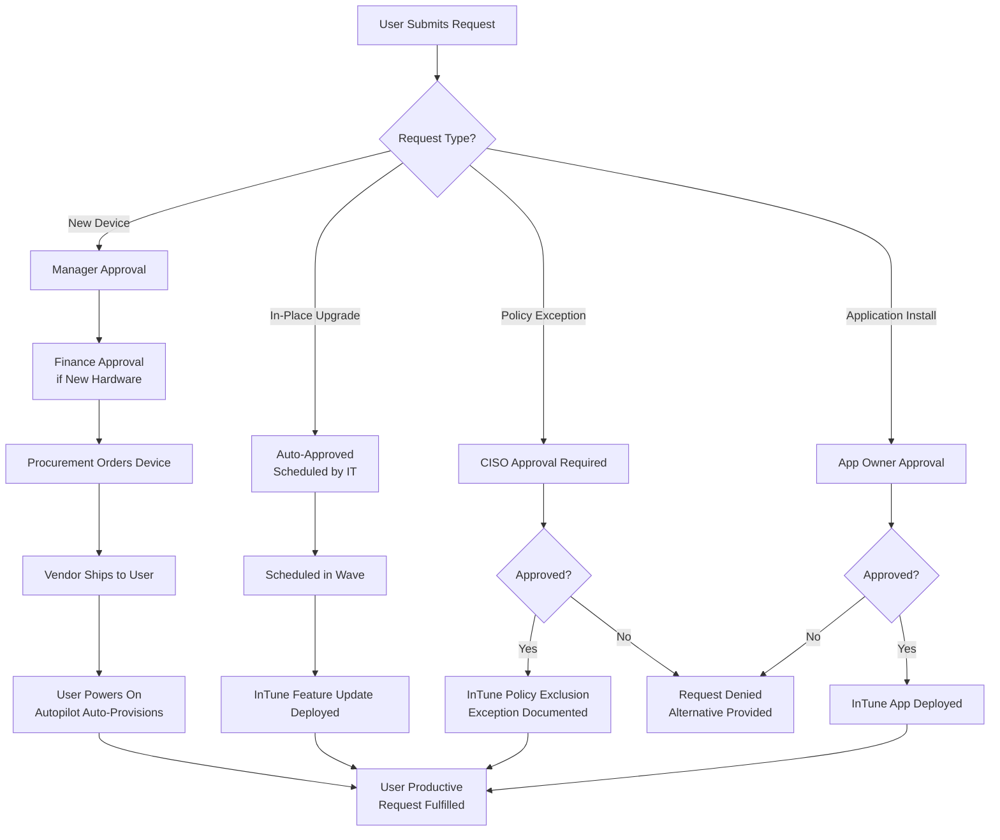
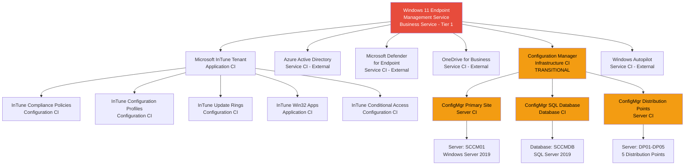

# ServiceNow Service Design: Windows 11 Migration

**Project**: Windows 10 to Windows 11 Migration using Microsoft InTune
**Service Name**: Windows 11 Endpoint Management Service
**Project ID**: 001-windows-11-migration-intune
**Document Version**: 1.0
**Last Updated**: 2025-10-20
**Service Owner**: IT Operations & Enterprise Architecture

---

## 1. Service Overview

### Service Description

The Windows 11 Endpoint Management Service provides cloud-native device management, security policy enforcement, and zero-touch provisioning for all Windows endpoints across the organization. This service migrates [NUMBER] Windows 10 devices to Windows 11 while transitioning from on-premises Configuration Manager to Microsoft InTune, enabling modern management capabilities, remote workforce support, and Zero Trust security posture.

**Business Capability**: Secure, compliant, and remotely manageable Windows endpoints supporting [NUMBER] users across [NUMBER] locations with automated deployment, policy enforcement, and threat protection.

**Service Type**: Infrastructure Service
**Service Owner**: IT Operations Director + Enterprise Architecture Team
**Service Tier**: **Tier 1 Critical** (99.9% availability required per NFR-A-001)
**Support Model**: 24/7 on-call for P1/P2 incidents (endpoint services are mission-critical)

### Service Scope

**In Scope**:
- Microsoft InTune tenant management and policy administration
- Windows Autopilot device provisioning
- Device compliance monitoring and enforcement
- Security baseline and Conditional Access policy management
- Application deployment via InTune
- Microsoft Defender for Endpoint integration
- Configuration Manager co-management (Months 0-18)
- Helpdesk support for endpoint issues
- User training and communication

**Out of Scope**:
- Server operating systems (separate CMDB service)
- Virtual Desktop Infrastructure (VDI) - separate project
- macOS/Linux/Mobile endpoints (existing services)
- Network infrastructure (dependency)
- Microsoft 365 licensing (dependency)

### Service Dependencies

**Upstream Dependencies** (Services this depends on):
- **Azure Active Directory** (Critical) - User/device authentication, Conditional Access
- **Microsoft Defender for Endpoint** (Critical) - Threat protection, EDR
- **OneDrive for Business** (Critical) - User data backup (Known Folder Move)
- **Corporate Network / VPN** (Important) - Connectivity for on-premises resources
- **Configuration Manager** (Transitional) - Co-management during 18-month transition
- **Microsoft 365 E3/E5 Licensing** (Critical) - InTune entitlement
- **Internet Bandwidth** (Critical) - 50 Gbps aggregate for concurrent provisioning

**Downstream Dependencies** (Services that depend on this):
- **Line-of-Business Applications** - Deployed via InTune to endpoints
- **Corporate WiFi / VPN** - Certificate-based authentication pushed via InTune
- **Microsoft Teams / Office 365** - Installed and configured via InTune
- **Security Operations Center (SOC)** - Defender for Endpoint alerts integration
- **Helpdesk / ServiceNow Incident Management** - Endpoint support tickets

### Service Criticality

- **Business Impact**: **CRITICAL** - Migration deadline Sep 1, 2025 (Windows 10 EOL Oct 14, 2025). Failure to migrate results in unsupported devices, security vulnerabilities, compliance violations, and cyber insurance policy invalidation (BR-001).
- **User Impact**: **CRITICAL** - [NUMBER] users depend on endpoints for daily productivity. Endpoint outages block all work.
- **Availability Requirement**: 99.9% per NFR-A-001 (43.8 minutes max downtime/month)
- **Support Coverage**: 24/7 on-call for P1/P2 incidents

---

## 2. Service Catalog Entry

### Service Catalog Display Name
**"Windows 11 Device Provisioning and Management"**

### Service Description (User-Facing)
"Request access to Windows 11 devices with zero-touch provisioning, automated security policies, and cloud-native management. New devices are pre-configured with corporate applications, security settings, and user data sync via OneDrive."

### Request Process

**Requestable Items**:
1. **New Device Provisioning** - Request Autopilot-enabled Windows 11 device (new hire, replacement)
2. **In-Place Upgrade** - Upgrade existing Windows 10 device to Windows 11
3. **Device Policy Exception** - Request exception to standard security policies (e.g., local admin rights for developers)
4. **Application Installation** - Request additional software beyond standard catalog

### Fulfillment Workflow



### Fulfillment Times

| Request Type | Approval SLA | Fulfillment SLA | Total Time |
|--------------|--------------|-----------------|------------|
| **New Device Provisioning** | Manager: 1 business day<br/>Finance: 1 business day | Procurement: 5-10 business days<br/>Autopilot: 30 minutes | **7-12 business days** |
| **In-Place Upgrade (Scheduled)** | Auto-approved | Scheduled in next wave:<br/>- Pilot: Week 1-4<br/>- Production: Weeks 9-24 | **Variable (per wave schedule)** |
| **Policy Exception** | CISO: 2 business days | Immediate (policy update) | **2 business days** |
| **Application Installation** | App Owner: 1 business day | 1-2 hours (InTune deploy) | **1-2 business days** |

### Approval Chain

| Request Type | Approver 1 | Approver 2 | Approver 3 | Auto-Reject Conditions |
|--------------|------------|------------|------------|------------------------|
| **New Device** | Manager | Finance (if >$1,500) | - | User already has device <3 years old |
| **In-Place Upgrade** | Auto-approved | - | - | Device not compatible (no TPM 2.0) |
| **Policy Exception** | CISO | CTO (if admin rights) | - | No business justification provided |
| **Application Install** | Application Owner | IT Security (if non-approved app) | - | Application has known vulnerabilities |

---

## 3. CMDB Design

### CI Hierarchy

The Windows 11 Endpoint Management Service is modeled as a **Business Service** with child **Application**, **Infrastructure**, and **Service** CIs representing InTune components, Microsoft cloud services, and on-premises Configuration Manager (transitional).



### Configuration Item Inventory

| CI Name | CI Class | Parent CI | Owner | Environment | Status | Decommission Date |
|---------|----------|-----------|-------|-------------|--------|-------------------|
| **Windows 11 Endpoint Management Service** | Business Service | - | IT Operations Director | PROD | **Operational** | - |
| **Microsoft InTune Tenant** | Application | Windows 11 Endpoint Management Service | IT Operations - Endpoint Team | PROD | **Operational** | - |
| **Azure Active Directory** | Service (External) | Windows 11 Endpoint Management Service | Microsoft | PROD | **Operational** | - |
| **Microsoft Defender for Endpoint** | Service (External) | Windows 11 Endpoint Management Service | Microsoft | PROD | **Operational** | - |
| **OneDrive for Business** | Service (External) | Windows 11 Endpoint Management Service | Microsoft | PROD | **Operational** | - |
| **Windows Autopilot** | Service (External) | Windows 11 Endpoint Management Service | Microsoft | PROD | **Operational** | - |
| **Configuration Manager** | Infrastructure | Windows 11 Endpoint Management Service | IT Operations - Legacy Endpoint Team | PROD | **TRANSITIONAL** | **Month 18 (Q2 2026)** |
| **InTune Compliance Policies** | Configuration | Microsoft InTune Tenant | IT Operations - Endpoint Team | PROD | **Operational** | - |
| **InTune Configuration Profiles** | Configuration | Microsoft InTune Tenant | IT Operations - Endpoint Team | PROD | **Operational** | - |
| **InTune Update Rings** | Configuration | Microsoft InTune Tenant | IT Operations - Endpoint Team | PROD | **Operational** | - |
| **InTune Win32 Apps** | Application | Microsoft InTune Tenant | IT Operations - Application Team | PROD | **Operational** | - |
| **InTune Conditional Access Policies** | Configuration | Microsoft InTune Tenant | IT Security - Identity Team | PROD | **Operational** | - |
| **ConfigMgr Primary Site (SCCM01)** | Server | Configuration Manager | IT Operations - Legacy Endpoint Team | PROD | **TRANSITIONAL** | **Month 18 (Q2 2026)** |
| **ConfigMgr SQL Database (SCCMDB)** | Database | Configuration Manager | DBA Team | PROD | **TRANSITIONAL** | **Month 18 (Q2 2026)** |
| **ConfigMgr Distribution Points (DP01-DP05)** | Server | Configuration Manager | IT Operations - Infrastructure Team | PROD | **TRANSITIONAL** | **Month 18 (Q2 2026)** |

**Total CIs**: 15 Configuration Items (11 permanent, 4 transitional)

### Key CI Attributes

**For: Windows 11 Endpoint Management Service**
- `u_service_tier`: **1** (Tier 1 Critical)
- `u_availability_sla`: **99.9%** (NFR-A-001)
- `u_business_owner`: IT Operations Director
- `u_technical_owner`: Enterprise Architect + Endpoint Manager
- `u_support_hours`: **24/7**
- `u_support_group`: **Windows11-Migration-L2**
- `u_escalation_group`: **Windows11-Migration-L3**
- `u_maintenance_window`: **Sunday 02:00-06:00 UTC**
- `u_devices_supported`: **[NUMBER]** devices
- `u_users_supported`: **[NUMBER]** users
- `u_locations_supported`: **[NUMBER]** locations

**For: Microsoft InTune Tenant**
- `u_technology_stack`: **Microsoft InTune (Endpoint Manager), Azure AD Premium P1/P2**
- `u_tenant_id`: [InTune Tenant ID]
- `u_tenant_url`: https://endpoint.microsoft.com
- `u_health_check_url`: https://portal.azure.com/#view/Microsoft_Intune_DeviceSettings/DevicesMenu/~/overview (InTune dashboard)
- `u_repository_url`: [Git repository for Policy-as-Code exports - FR-021 pending]
- `u_api_endpoint`: https://graph.microsoft.com (Microsoft Graph API)
- `u_microsoft_support_plan`: Microsoft 365 E3/E5 Premier Support
- `u_compliance_frameworks`: CIS Benchmarks for Windows 11, Microsoft Security Baselines

**For: Configuration Manager (TRANSITIONAL)**
- `u_technology_stack`: **System Center Configuration Manager (Current Branch), SQL Server 2019**
- `u_decommission_date`: **Month 18 (Q2 2026)** per FR-018
- `u_decommission_status`: **Co-Management Active** (InTune workload transition in progress)
- `u_workload_transition_percentage`: **Month 0: 0% → Month 6: 50% → Month 12: 80% → Month 18: 100%** (FR-006)
- `u_server_hostnames`: SCCM01 (Primary Site), DP01-DP05 (Distribution Points)
- `u_database_server`: SCCMDB (SQL Server 2019)
- `u_management_point_url`: http://sccm01.corp.local/
- `u_annual_cost`: **$[X]/year** (servers, storage, maintenance, labor) per BR-003
- `u_cost_savings_post_decommission`: **$[X]/year** per BR-003

### CMDB Relationships

| Source CI | Relationship Type | Target CI | Dependency Type |
|-----------|-------------------|-----------|-----------------|
| Windows 11 Endpoint Management Service | **Depends on** | Microsoft InTune Tenant | **Critical** (core service) |
| Windows 11 Endpoint Management Service | **Depends on** | Azure Active Directory | **Critical** (authentication/authorization) |
| Windows 11 Endpoint Management Service | **Depends on** | Microsoft Defender for Endpoint | **Critical** (security/compliance) |
| Windows 11 Endpoint Management Service | **Depends on** | OneDrive for Business | **Critical** (user data backup) |
| Windows 11 Endpoint Management Service | **Depends on** | Windows Autopilot | **Critical** (device provisioning) |
| Windows 11 Endpoint Management Service | **Depends on** | Configuration Manager | **Transitional** (co-management until Month 18) |
| Microsoft InTune Tenant | **Contains** | InTune Compliance Policies | **Child Configuration** |
| Microsoft InTune Tenant | **Contains** | InTune Configuration Profiles | **Child Configuration** |
| Microsoft InTune Tenant | **Contains** | InTune Update Rings | **Child Configuration** |
| Microsoft InTune Tenant | **Contains** | InTune Win32 Apps | **Child Application** |
| Microsoft InTune Tenant | **Contains** | InTune Conditional Access Policies | **Child Configuration** |
| Configuration Manager | **Hosted on** | ConfigMgr Primary Site (SCCM01) | **Server hosting** |
| Configuration Manager | **Hosted on** | ConfigMgr SQL Database (SCCMDB) | **Database hosting** |
| Configuration Manager | **Uses** | ConfigMgr Distribution Points (DP01-DP05) | **Infrastructure dependency** |
| InTune Conditional Access Policies | **Depends on** | Azure Active Directory | **Critical** (policy enforcement) |
| InTune Compliance Policies | **Depends on** | Microsoft Defender for Endpoint | **Important** (device risk level) |

### CI Lifecycle Management

**Active CIs (Permanent)**:
- Microsoft InTune Tenant and child CIs → **No planned decommission** (strategic platform)
- Azure AD, Defender for Endpoint, OneDrive, Autopilot → **External services, Microsoft-managed**

**Transitional CIs (18-Month Lifecycle)**:
- Configuration Manager and child CIs → **Decommission Month 18 (Q2 2026)** per FR-018
- **Co-Management Transition Timeline**:
  - **Month 0-6**: 0-50% InTune workload transition (pilot, early adopters)
  - **Month 7-12**: 50-80% InTune workload transition (production waves 1-10)
  - **Month 13-18**: 80-100% InTune workload transition (production waves 11-20, ConfigMgr decommissioning)
- **Decommissioning Process** (FR-018):
  - **Month 16-17**: Verify 100% workload transition, document dependencies, obtain stakeholder sign-off
  - **Month 17**: Disable client deployments, set ConfigMgr to read-only mode
  - **Month 18**: Backup database for archival (7 years), uninstall ConfigMgr clients, decommission servers
- **Cost Savings**: $[X]/year after decommissioning (infrastructure, licensing, labor) per BR-003

---

## 4. Service Level Agreements (SLAs)

### Availability SLA

**Source**: NFR-A-001 (InTune Service Availability), NFR-A-002 (Business Continuity During Migration)

| Service Tier | Availability | Max Downtime/Month | Max Downtime/Year | Service Dependency |
|--------------|--------------|-------------------|-------------------|-------------------|
| **Tier 1 Critical** | **99.9%** | **43.8 minutes** | **8.76 hours** | Microsoft InTune SLA 99.9% (Microsoft Azure SLA) |

**Measurement Method**:
- **InTune Service Uptime**: Microsoft Service Health Dashboard + Azure portal (Microsoft responsible)
- **Endpoint Accessibility**: Device check-in status to InTune (monitored via InTune reporting)
- **Policy Application Success**: InTune policy compliance reporting (target: >95% devices compliant)

**Exclusions from SLA**:
- Planned maintenance during maintenance windows (Sunday 02:00-06:00 UTC)
- User-caused incidents (device damage, lost password)
- Third-party service outages (Azure AD, OneDrive) → covered by Microsoft SLAs
- Microsoft InTune service disruptions → covered by Microsoft 99.9% SLA per NFR-A-001

**Contingency Plan** (NFR-A-001):
- **During InTune outage**: Devices continue to operate with last-applied policies (no immediate impact), users access corporate resources via cached credentials (90-day refresh token), no new enrollments until service restored
- **Extended outage (>4 hours)**: Executive communication, delay non-critical migrations, escalate to Microsoft Premier Support
- **Fallback capability**: Configuration Manager remains available during 18-month co-management period (Month 0-18 only). After ConfigMgr decommissioning (Month 18+), no on-premises fallback (cloud-only dependency accepted).

### Performance SLA

**Source**: NFR-P-001 (Autopilot Provisioning Time), NFR-P-002 (Windows 11 Upgrade Duration)

| Transaction Type | Target (95th percentile) | Target (99th percentile) | Measurement Method |
|------------------|--------------------------|--------------------------|-------------------|
| **Autopilot Provisioning** (new device) | **<30 minutes** | **<45 minutes** | Endpoint Analytics - OOBE start to Enrollment Status Page completion |
| **Windows 11 In-Place Upgrade** | **<90 minutes** | **<120 minutes** | InTune Update Compliance reporting - upgrade start to desktop login |
| **Policy Application** (device check-in) | **<5 minutes** | **<10 minutes** | InTune reporting - policy assignment to device compliance |
| **Application Installation** (InTune Win32 app) | **<10 minutes** | **<20 minutes** | InTune app deployment reporting - install start to app ready |

**Load Conditions** (NFR-S-001):
- **Peak load**: 500 devices provisioning simultaneously (Wave deployment scenario)
- **Average load**: 50 devices per day (new hires, replacements)
- **Burst capacity**: 1,000 devices upgrading simultaneously (Windows 11 feature update deployment)
- **Network bandwidth**: 100 Mbps per device minimum (aggregate: 50 Gbps during peak waves)

**Performance Degradation Thresholds**:
- **Warning**: Autopilot provisioning >45 minutes for >10% of devices → P3 incident (investigate)
- **Critical**: Autopilot provisioning >60 minutes for >25% of devices → P1 incident (pause waves, escalate to Microsoft)

### Incident Resolution SLA

**Source**: Derived from Tier 1 Critical service classification (99.9% availability target)

| Priority | Impact | Urgency | Response Time | Resolution Target | Escalation |
|----------|--------|---------|---------------|-------------------|------------|
| **P1** | Critical (service down, multiple users unable to work) | High | **1 hour** | **4 hours** | Immediate to L3 + Manager |
| **P2** | High (degraded service, single user or small group unable to work) | High | **4 hours** | **8 hours** | 2 hours to L3 |
| **P3** | Medium (minor inconvenience, workaround exists) | Medium | **8 hours** | **24 hours** | 24 hours to L3 |
| **P4** | Low (cosmetic issue, no productivity impact) | Low | **1 business day** | **3 business days** | 3 days to L3 |
| **P5** | Informational (question, feature request) | Low | **2 business days** | **10 business days** | None |

**Business Hours**: 24/7 for P1/P2 (critical endpoint service), business hours (Mon-Fri 08:00-18:00 local) for P3-P5

**Incident Resolution SLA Measurement**:
- **Response Time**: From incident creation to first response from assignment group
- **Resolution Time**: From incident creation to incident closed (service restored)
- **Escalation**: Automatic escalation if response/resolution SLA at risk

### Support Coverage

| Support Tier | Hours | On-Call | Contact Method | Response Channel |
|--------------|-------|---------|----------------|------------------|
| **Critical (P1/P2)** | **24/7** | **Yes** (PagerDuty) | Phone: [NUMBER]<br/>PagerDuty: [INCIDENT_EMAIL]<br/>ServiceNow: Auto-create + page | Incident bridge (Microsoft Teams call)<br/>ServiceNow incident |
| **Standard (P3-P5)** | **Business hours**<br/>(Mon-Fri 08:00-18:00 local) | **No** | ServiceNow portal<br/>Email: windows11-support@corp.local<br/>Slack: #windows11-migration | ServiceNow incident<br/>Slack channel |

**On-Call Rotation**:
- **Primary**: Endpoint Manager (L3)
- **Secondary**: Enterprise Architect (escalation)
- **Manager**: IT Operations Director (executive escalation)
- **Rotation Schedule**: Weekly rotation (Monday 00:00 UTC to Sunday 23:59 UTC)

**Support Escalation**:
- **L1 (Helpdesk)** → **L2 (Windows11-Migration-L2)** → **L3 (Windows11-Migration-L3)** → **Microsoft Premier Support** (InTune platform issues)

---

## 5. Incident Management

### Priority Matrix

**Priority Calculation**: Priority = f(Impact, Urgency)

| Impact | Urgency: High (immediate action) | Urgency: Medium (can wait hours) | Urgency: Low (can wait days) |
|--------|----------------------------------|----------------------------------|------------------------------|
| **Critical** (Service down, multiple users blocked) | **P1** (1hr/4hr) | **P2** (4hr/8hr) | **P3** (8hr/24hr) |
| **High** (Degraded service, small group affected) | **P2** (4hr/8hr) | **P3** (8hr/24hr) | **P4** (1d/3d) |
| **Medium** (Minor issue, workaround exists) | **P3** (8hr/24hr) | **P4** (1d/3d) | **P4** (1d/5d) |
| **Low** (Cosmetic issue, no impact) | **P4** (1d/3d) | **P4** (1d/5d) | **P5** (2d/10d) |

### Incident Categories and Assignment Groups

| Category | Subcategory | Assignment Group | Escalation Group | Common Issues |
|----------|-------------|------------------|------------------|---------------|
| **Windows11-Service** | InTune Service Outage | Windows11-Migration-L2 | Windows11-Migration-L3 + Microsoft Support | Microsoft InTune service down (upstream) |
| **Windows11-Enrollment** | Autopilot Provisioning Failure | Windows11-Migration-L2 | Windows11-Migration-L3 | Device not enrolling via Autopilot, stuck at Enrollment Status Page |
| **Windows11-Enrollment** | Device Compliance Failure | Windows11-Migration-L2 | Windows11-Migration-L3 | Device marked non-compliant (TPM, BitLocker, Defender issues) |
| **Windows11-Policy** | Configuration Profile Not Applied | Windows11-Migration-L2 | Windows11-Migration-L3 | InTune policy not deploying to device |
| **Windows11-Policy** | Conditional Access Blocking User | Windows11-Migration-L2 → Identity-L2 | Windows11-Migration-L3 → Identity-L3 | User blocked from corporate resources due to non-compliant device |
| **Windows11-Apps** | Application Not Installing | Windows11-Migration-L2 | Application-L2 | InTune Win32 app failing to install, detection rule issues |
| **Windows11-Upgrade** | Windows 11 Upgrade Failure | Windows11-Migration-L2 | Windows11-Migration-L3 | In-place upgrade failed, rollback required (FR-017) |
| **Windows11-Security** | Defender Not Onboarding | Windows11-Migration-L2 | Security-L2 | Microsoft Defender for Endpoint not onboarding to tenant |
| **Windows11-Data** | OneDrive KFM Not Syncing | Windows11-Migration-L2 | Collaboration-L2 | Known Folder Move not syncing Desktop/Documents/Pictures |
| **Windows11-Decommission** | ConfigMgr Co-Management Issue | Windows11-Migration-L2 | Legacy-Endpoint-L2 | Configuration Manager co-management workload transition failure |

**Assignment Group Staffing**:
- **Windows11-Migration-L2**: 8 FTEs (24/7 coverage: 3 shifts � 2-3 staff per shift)
- **Windows11-Migration-L3**: 3 FTEs (Endpoint Manager + 2 Senior Engineers, on-call rotation)
- **Escalation to Microsoft**: Microsoft Premier Support (InTune platform issues beyond L3)

### P1 Incident Response Runbook

**Trigger Conditions for P1**:
- **InTune Service Down**: Microsoft InTune service health shows "Service Degradation" or "Service Interruption" for >15 minutes
- **Autopilot Provisioning Failure**: >25% of devices fail Autopilot enrollment in a wave (>125 devices out of 500)
- **Mass Conditional Access Block**: >100 users blocked from corporate resources due to compliance policy failure
- **Security Incident**: Mass malware detection across >50 devices (Defender for Endpoint alert)
- **Migration Rollback Required**: Windows 11 upgrade failure rate >10% in a wave, rollback triggered (FR-017, BR-008)

**Runbook: P1 Incident Response**

**Phase 1: Detection & Alert (0-5 minutes)**
1. **Automated Detection**:
   - InTune service health monitoring (Azure Service Health API) detects outage → Auto-create ServiceNow incident (Priority: P1)
   - Endpoint Analytics alert: Autopilot provisioning time >60 minutes for >25% devices → Auto-create ServiceNow incident (Priority: P1)
   - Defender for Endpoint alert: Mass malware outbreak → Forward alert to ServiceNow + SOC
   - InTune compliance reporting: >100 devices non-compliant simultaneously → Auto-create ServiceNow incident (Priority: P1)
2. **Page On-Call**: PagerDuty sends alert to Windows11-Migration-L3 primary on-call engineer
3. **ServiceNow Auto-Actions**:
   - Create incident with P1 priority
   - Assign to Windows11-Migration-L3 assignment group
   - Page on-call engineer via PagerDuty
   - Create Microsoft Teams incident bridge call (invite: on-call engineer, manager, enterprise architect)
   - Send Slack notification to #windows11-migration and #incidents channels

**Phase 2: Response & War Room (5-15 minutes)**
1. **Acknowledge Incident** (Target: <5 minutes from page):
   - On-call engineer acknowledges PagerDuty alert
   - Join Microsoft Teams incident bridge call
   - Acknowledge incident in ServiceNow (status: **Work in Progress**)
2. **Assemble War Room** (if >100 users impacted):
   - On-call engineer (Incident Commander)
   - IT Operations Director (executive escalation)
   - Enterprise Architect (architecture decisions)
   - Security Architect (if security incident)
   - Microsoft TAM (Technical Account Manager) - if InTune platform issue
   - Communications Lead (if user communication required)
3. **Initial Assessment**:
   - Check Microsoft Service Health Dashboard (https://portal.azure.com/#view/Microsoft_Azure_Health/ServiceIssuesBladeV2)
   - Check InTune dashboard (https://endpoint.microsoft.com) - any widespread alerts?
   - Check Endpoint Analytics (https://endpoint.microsoft.com/#view/Microsoft_Intune_DeviceSettings/DevicesMenu/~/analytics) - provisioning/upgrade metrics
   - Query affected devices: ServiceNow CMDB + InTune device inventory
   - Determine blast radius: How many users/devices impacted?

**Phase 3: Diagnosis & Root Cause (15-60 minutes)**
1. **InTune Service Outage**:
   - Verify Microsoft Service Health Dashboard shows "Service Degradation" or "Service Interruption"
   - Check Microsoft 365 Admin Message Center for incident details
   - **Action**: If Microsoft upstream outage, escalate to Microsoft Premier Support (Priority: Critical), no action possible until Microsoft resolves
   - **Communication**: Notify users via Slack/Email: "InTune service experiencing issues. Microsoft is investigating. No action required from users. Updates every 30 minutes."
2. **Autopilot Provisioning Failure**:
   - Identify failing devices: InTune Autopilot deployment report
   - Check common failure reasons: Hardware hash not uploaded, Autopilot profile not assigned, network connectivity issues, Azure AD join failure
   - Review Autopilot logs on failing device: `C:\ProgramData\Microsoft\InTune\Logs\` (if accessible)
   - **Action**: If pilot wave (<100 devices), troubleshoot individually. If production wave (>100 devices), **PAUSE WAVE** per BR-008 (>10% failure rate = pause criteria).
3. **Mass Conditional Access Block**:
   - Identify root cause: InTune compliance policy change? Azure AD Conditional Access policy misconfiguration? Mass device non-compliance (BitLocker, Defender)?
   - Check Azure AD Sign-In Logs for Conditional Access failures
   - Check InTune compliance policy changes (InTune audit log)
   - **Action**: If policy misconfiguration, revert policy change immediately (emergency change). If legitimate non-compliance, provide grace period (24 hours per FR-005) and user communication.
4. **Security Incident (Mass Malware)**:
   - Coordinate with SOC (Security Operations Center) - security team leads investigation
   - Isolate affected devices via Microsoft Defender for Endpoint (network isolation)
   - Identify malware variant, attack vector, patient zero
   - **Action**: SOC-led remediation. Endpoint team supports device wipe/re-provision if required.
5. **Migration Rollback Required**:
   - Determine root cause: Application incompatibility? Driver issue? Windows 11 upgrade failure (hardware compatibility)?
   - Check rollback criteria (FR-017, BR-008): >10% upgrade failure rate in wave, P1 incident affecting business operations
   - **Action**: Execute rollback procedure (Phase 4 below). Pause wave per BR-008. Investigate root cause before resuming.

**Phase 4: Mitigation & Rollback (60-240 minutes)**
1. **InTune Service Outage**:
   - **Mitigation**: None (wait for Microsoft resolution). Configuration Manager remains available during co-management period (Month 0-18) as fallback per NFR-A-001.
   - **User Communication**: Hourly updates until service restored.
2. **Autopilot Provisioning Failure**:
   - **Mitigation**:
     - If hardware hash missing: Upload hardware hashes manually for failing devices (FR-002)
     - If network issue: Provide wired Ethernet during provisioning (bypass WiFi)
     - If Azure AD join failure: Verify Azure AD tenant connectivity, check Conditional Access policies
   - **Wave Pause**: If >10% failure rate, **PAUSE WAVE** until root cause resolved per BR-008
3. **Mass Conditional Access Block**:
   - **Immediate Mitigation**: If policy misconfiguration, **EMERGENCY CHANGE** to revert policy (ECAB approval within 2 hours per Change Management Plan)
   - **Grace Period**: If legitimate non-compliance, extend grace period from 24 hours to 72 hours (emergency change) to allow users to remediate
   - **User Communication**: Email/Slack with remediation steps (e.g., "Enable BitLocker", "Update Defender definitions")
4. **Security Incident**:
   - **SOC-Led**: Security team leads remediation
   - **Endpoint Team**: Support device isolation, wipe, re-provision via InTune Fresh Start
   - **Post-Incident**: Review security baseline, update InTune policies to prevent recurrence
5. **Migration Rollback** (FR-017):
   - **Rollback Procedure** (for devices <10 days post-upgrade):
     - **Bulk Rollback**: Deploy InTune PowerShell script to automate rollback across affected device group (FR-017)
     - **Script**: `Start-Process -FilePath "C:\Windows\System32\SystemSettingsAdminFlows.exe" -ArgumentList "RollbackOS"` (triggers Windows "Go Back" feature)
     - **Manual Rollback**: User navigates to Settings > System > Recovery > Go Back to Windows 10
   - **Rollback for Devices >10 Days Post-Upgrade**: Windows.old folder auto-deleted. **Device Re-Image Required** (FR-017):
     - Wipe device via InTune (Remote action: Wipe)
     - Re-provision with Windows 10 Autopilot profile (temporary)
     - User data restored from OneDrive (Known Folder Move)
   - **Root Cause Investigation**: Application compatibility? Driver issue? Document findings, update application testing (FR-013), resume wave after resolution.

**Phase 5: Resolution & Verification (Variable)**
1. **Service Restored**:
   - Verify metric returned to normal: Autopilot provisioning time <30 minutes, compliance rate >95%, no Conditional Access blocks
   - Monitor for 30 minutes to confirm stability
2. **Close Incident**:
   - Update ServiceNow incident: Status = **Resolved**, Resolution notes = Root cause + actions taken
   - Notify users: Service restored
3. **Schedule Post-Incident Review (PIR)**:
   - **Timing**: Within 2 business days of P1 incident
   - **Attendees**: Incident Commander, IT Operations Director, Enterprise Architect, affected team leads
   - **Agenda**: Timeline review, root cause analysis, action items to prevent recurrence
   - **Output**: PIR document with lessons learned, process improvements, configuration changes

**Phase 6: Post-Incident Review & Continuous Improvement**
1. **PIR Meeting** (scheduled within 2 business days):
   - Review incident timeline: Detection → Response → Diagnosis → Mitigation → Resolution
   - Root cause analysis (5 Whys technique)
   - Identify action items: Process improvements, monitoring enhancements, runbook updates, training needs
2. **Action Items Tracking**:
   - Create ServiceNow problem record (link to incident)
   - Assign action items with owners and due dates
   - Track completion via ServiceNow problem management
3. **Runbook Update**:
   - Update P1 runbook with lessons learned
   - Add new diagnosis steps, mitigation procedures, common failure patterns
   - Quarterly runbook review (Section 8 - Knowledge Management)

**P1 Incident Escalation Path**:
1. **L2 → L3**: Automatic escalation after 1 hour if no progress
2. **L3 → Manager**: Immediate escalation for P1 incidents (IT Operations Director paged)
3. **Manager → Microsoft Premier Support**: If InTune platform issue beyond L3 capability
4. **Manager → CTO/CIO**: If >500 users impacted, executive communication required

---

## 6. Change Management Plan

### Change Categories

**Change Type Definitions**:

| Change Type | Description | Approval Process | Lead Time | Downtime Allowed | Examples |
|-------------|-------------|------------------|-----------|------------------|----------|
| **Standard** | Pre-approved, low-risk, repeatable changes | **Auto-approved** (no CAB) | **1 hour** | **None** | InTune app deployment (approved apps), User device enrollment via Autopilot, Password reset, OneDrive KFM enable |
| **Normal** | Planned changes requiring CAB approval | **CAB approval** (weekly meeting) | **5 business days** | **Maintenance window** (Sunday 02:00-06:00 UTC) | InTune compliance policy update, Configuration profile change, Security baseline update, Windows 11 feature update rollout (wave deployment), Application packaging (new Win32 app) |
| **Emergency** | Unplanned changes to restore service or mitigate security risk | **ECAB approval** (within 2 hours) | **2 hours** | **Allowed 24/7** | InTune service outage mitigation, Security vulnerability patch (zero-day), Mass Conditional Access policy revert, Malware outbreak remediation, Migration rollback (>10% failure rate) |
| **Major** | High-impact changes affecting multiple services or large user base | **CAB + ECAB + CTO approval** | **2 weeks** | **Scheduled maintenance** (weekend) | Configuration Manager decommissioning (FR-018), InTune tenant migration (if required), Major Windows 11 feature update (e.g., 22H2 → 23H2 across all devices) |

### Change Approval Board (CAB)

**CAB Membership**:
- **Chair**: IT Operations Director
- **Members**:
  - Enterprise Architect
  - Endpoint Manager (Technical Lead)
  - Security Architect
  - Application Owner (LOB apps)
  - Helpdesk Manager
  - Change Manager (PMO)
  - Finance Representative (for budget impact)

**CAB Meeting Schedule**:
- **Frequency**: Weekly (every Wednesday 10:00-11:00 local time)
- **Agenda**: Review normal changes scheduled for next week, approve/reject/defer
- **Quorum**: Minimum 5 members (including Chair) required for approval
- **Decision**: Majority vote (>50% of attendees), Chair has tiebreaker vote

**Emergency CAB (ECAB)**:
- **Trigger**: P1/P2 incident requiring emergency change
- **Approval**: Virtual approval via Microsoft Teams chat + ServiceNow (within 2 hours)
- **Participants**: IT Operations Director (Chair) + Enterprise Architect + Security Architect (minimum)
- **Post-Change Review**: ECAB change reviewed at next regular CAB meeting (lessons learned)

### Change Risk Assessment

**Risk Assessment Matrix** (used during CAB review):

| Factor | Low Risk (1) | Medium Risk (2) | High Risk (3) |
|--------|-------------|-----------------|---------------|
| **Impact** | <50 users | 50-500 users | >500 users |
| **Complexity** | Single component | 2-3 components | >3 components or architecture change |
| **Rollback** | Immediate rollback (<5 min) | Rollback within 1 hour | Rollback >1 hour or requires re-provision |
| **Testing** | Tested in pilot (>100 devices) | Tested in early adopters (>500 devices) | Not fully tested or new technology |
| **Timing** | Maintenance window | Business hours (low usage) | Peak business hours |

**Total Risk Score**: Sum of all factors (5-15 points)
- **5-7 points**: Low risk → Approve for standard/normal change
- **8-11 points**: Medium risk → Requires CAB approval + pilot testing
- **12-15 points**: High risk → Requires CAB + ECAB approval + extensive testing + rollback plan

**Wardley Map Integration** (if applicable):
- **Genesis/Custom components** (evolution <0.50) → **High risk** (requires CAB approval, extensive testing)
  - Example: Custom GPO migrations (evolution 0.42), Policy-as-Code repository (evolution 0.45)
- **Product components** (evolution 0.50-0.80) → **Medium risk** (standard change if well-documented)
  - Example: Configuration Manager (evolution 0.55), InTune policies (evolution 0.60-0.70)
- **Commodity components** (evolution >0.80) → **Low risk** (standard change)
  - Example: Microsoft InTune (evolution 0.92), Azure AD (evolution 0.95)

### Maintenance Windows

**Standard Maintenance Window**:
- **Schedule**: **Sunday 02:00-06:00 UTC** (4-hour window)
- **Frequency**: Weekly (every Sunday)
- **Use Cases**: Normal changes requiring downtime (InTune policy updates, Configuration Manager maintenance)
- **User Notification**: 7 days advance notice via email/Slack for user-impacting changes

**Blackout Periods** (No changes allowed):
- Fiscal year-end: [TBD - typically last week of fiscal year]
- Peak business periods: [TBD - e.g., Q4 holiday season for retail]
- Major corporate events: [TBD - e.g., company all-hands, board meetings]
- Migration waves: **No other changes allowed during active Windows 11 migration waves** (Weeks 9-24 per BR-008) to reduce risk

**Emergency Maintenance**:
- **Allowed 24/7** for P1/P2 incidents (emergency changes)
- **Requires ECAB approval** within 2 hours
- **User Notification**: Immediate (via Slack/Email) + post-change communication

### Rollback Plan

**Rollback Criteria** (automatic trigger):
- Error rate >5% for 10 minutes after change
- Response time >3s (3x baseline) for 5 minutes after change
- >10 ServiceNow incidents created within 30 minutes after change
- User report: >5% of affected users report issues within 1 hour

**Rollback Procedure**:

**For InTune Policy Changes** (Normal Change):
1. **Backup**: InTune policy exported to Git repository before change (Policy-as-Code - FR-021 pending)
2. **Rollback**: Revert InTune policy to previous version via InTune admin center
3. **Verification**: Check InTune compliance reporting - policy reverted across all devices within 5 minutes (devices check in every 5 minutes)
4. **Notification**: Slack notification to #windows11-migration: "Policy change rolled back due to [reason]"

**For Windows 11 Feature Update** (Major Change):
1. **Rollback Window**: 10 days post-upgrade per FR-017 (Windows.old folder retention)
2. **Bulk Rollback**: Deploy InTune PowerShell script to trigger Windows "Go Back" feature across affected device group
3. **Manual Rollback**: User navigates to Settings > System > Recovery > Go Back to Windows 10
4. **Post-Rollback**: User data preserved via OneDrive Known Folder Move (FR-003), applications reinstalled via InTune
5. **Root Cause**: Investigate application compatibility (FR-013), update testing plan before resuming

**For Configuration Manager Changes** (Transitional):
1. **Backup**: ConfigMgr site backup before change (SQL database backup)
2. **Rollback**: Restore ConfigMgr site from backup (estimated 2-4 hours)
3. **Verification**: Verify ConfigMgr console accessible, clients checking in
4. **Limitation**: ConfigMgr rollback only available during co-management period (Month 0-18). After decommissioning (Month 18+), no rollback capability.

**Rollback Authority**:
- **Standard Changes**: Change implementer can rollback immediately (no approval required)
- **Normal Changes**: Endpoint Manager or on-call engineer can rollback immediately (inform CAB within 24 hours)
- **Emergency Changes**: ECAB must approve rollback (or accept risk of not rolling back)
- **Major Changes**: CTO/CIO approval required for rollback (executive decision)

### Change Communication

**Pre-Change Communication** (Normal/Major Changes):
- **T-7 days**: CAB approval + email to all users: "Scheduled maintenance [Date/Time], expected impact: [None / Brief disruption / Downtime]"
- **T-3 days**: Slack reminder in #windows11-migration and #general channels
- **T-1 day**: Final email reminder with change window, expected duration, support contact

**During Change** (All Changes):
- **Change Start**: Slack notification in #windows11-migration: "Change [CHG00XXXXX] in progress. Expected completion: [Time]."
- **Every 30 minutes**: Status update in Slack (if change >1 hour duration)
- **Issues Detected**: Immediate Slack notification + escalation per runbook

**Post-Change Communication** (All Changes):
- **Change Complete**: Slack notification in #windows11-migration: "Change [CHG00XXXXX] completed successfully. Service restored."
- **Change Failed**: Slack notification + email: "Change [CHG00XXXXX] rolled back due to [reason]. Service restored. Root cause investigation in progress."
- **Post-Change Review**: Email summary within 24 hours: Change outcome, any issues encountered, user impact, next steps

**Emergency Change Communication**:
- **Immediate**: Slack notification in #windows11-migration and #incidents: "Emergency change [CHG00XXXXX] in progress to resolve incident [INC00XXXXX]. Updates every 15 minutes."
- **Hourly Updates**: Until change complete or incident resolved
- **Post-Incident**: Post-Incident Review (PIR) document published within 2 business days

---

## 7. Monitoring & Alerting Plan

### Health Checks

**Microsoft InTune Service Health**:

| Component | Endpoint / Check | Frequency | Alert Threshold | Severity | Action |
|-----------|------------------|-----------|-----------------|----------|--------|
| **Microsoft InTune Service** | Azure Service Health API<br/>https://portal.azure.com/#view/Microsoft_Azure_Health/ServiceIssuesBladeV2 | **1 minute** | Service status: "Service Degradation" OR "Service Interruption" for >5 minutes | **P1** | Auto-create ServiceNow incident, page on-call, escalate to Microsoft Premier Support |
| **InTune Admin Center** | https://endpoint.microsoft.com (HTTP health check) | **1 minute** | HTTP non-200 OR response time >5s | **P2** | Alert on-call, verify Microsoft Service Health Dashboard |
| **Microsoft Graph API** (InTune backend) | https://graph.microsoft.com/health (synthetic transaction) | **5 minutes** | HTTP non-200 OR response time >2s | **P2** | Alert on-call, verify Microsoft Service Health Dashboard |

**InTune Policy Application & Device Compliance**:

| Component | Metric | Frequency | Alert Threshold | Severity | Action |
|-----------|--------|-----------|-----------------|----------|--------|
| **Device Check-In** | InTune device inventory: Last check-in time | **15 minutes** | >5% of devices not checked in for >2 hours | **P3** | Investigate network connectivity, Azure AD connectivity |
| **Policy Compliance** | InTune compliance reporting: % devices compliant | **15 minutes** | <90% devices compliant (baseline: 95%) | **P3** | Review compliance policies, check for widespread issues (BitLocker, Defender) |
| **Policy Application** | InTune configuration profile reporting: % profiles applied | **15 minutes** | <90% profiles successfully applied (baseline: 98%) | **P3** | Investigate policy conflicts, check InTune audit log for recent changes |
| **Conditional Access Blocks** | Azure AD Sign-In Logs: Failed sign-ins due to Conditional Access | **5 minutes** | >50 users blocked within 15 minutes | **P1** | Investigate Conditional Access policy misconfiguration, consider emergency grace period |

**Autopilot Provisioning & Device Enrollment**:

| Component | Metric | Frequency | Alert Threshold | Severity | Action |
|-----------|--------|-----------|-----------------|----------|--------|
| **Autopilot Provisioning Time** | Endpoint Analytics: OOBE duration (p95) | **1 hour** | >45 minutes p95 (target: <30 min per NFR-P-001) | **P3** | Investigate network bandwidth, app download times, InTune policy complexity |
| **Autopilot Enrollment Failure Rate** | InTune Autopilot deployment report: Enrollment failures | **15 minutes** | >10% failure rate in pilot/wave (>10 devices out of 100) | **P2** | Pause wave per BR-008, investigate hardware hash issues, Azure AD join failures |
| **Windows 11 Upgrade Duration** | InTune Update Compliance: Upgrade duration (p95) | **1 hour** | >120 minutes p95 (target: <90 min per NFR-P-002) | **P3** | Investigate device hardware (SSD required), network bandwidth |
| **Windows 11 Upgrade Failure Rate** | InTune Update Compliance: Upgrade failures | **15 minutes** | >10% failure rate in wave | **P1** | Pause wave per BR-008, trigger rollback procedure (FR-017), investigate root cause |

**Microsoft Defender for Endpoint**:

| Component | Metric | Frequency | Alert Threshold | Severity | Action |
|-----------|--------|-----------|-----------------|----------|--------|
| **Defender Onboarding** | Microsoft Defender portal: Device onboarding status | **1 hour** | >5% devices not onboarded within 24 hours of enrollment | **P3** | Investigate Defender onboarding policy, check device health attestation |
| **Defender Real-Time Protection** | InTune compliance reporting: Defender real-time protection status | **15 minutes** | >2% devices with Defender real-time protection disabled | **P2** | Investigate compliance policy enforcement, check for malware disabling Defender |
| **Security Alerts** | Microsoft Defender portal: High/Critical alerts | **Real-time** | Any High/Critical alert | **P2** (High)<br/>**P1** (Critical) | Forward to SOC, coordinate remediation with security team |
| **Mass Malware Outbreak** | Microsoft Defender portal: >50 devices with malware detected within 1 hour | **Real-time** | >50 devices affected | **P1** | Trigger P1 incident, coordinate with SOC, isolate affected devices |

**Configuration Manager (Transitional - Month 0-18 only)**:

| Component | Metric | Frequency | Alert Threshold | Severity | Action |
|-----------|--------|-----------|-----------------|----------|--------|
| **ConfigMgr Site Server** | HTTP health check: http://sccm01.corp.local/ | **5 minutes** | HTTP non-200 OR response time >10s | **P2** | Alert Legacy-Endpoint-L2, verify server uptime, check SQL connectivity |
| **ConfigMgr SQL Database** | SQL connection test | **5 minutes** | Connection failure | **P1** | Alert DBA team + Legacy-Endpoint-L2, verify SQL Server service running |
| **ConfigMgr Client Check-In** | ConfigMgr console: % clients checked in within 24 hours | **1 hour** | <80% clients checked in (baseline: 95%) | **P3** | Investigate network connectivity, check ConfigMgr client health |
| **Co-Management Workload Transition** | InTune co-management dashboard: % workloads managed by InTune | **Daily** | Behind schedule per FR-006 (Month 6: <50%, Month 12: <80%) | **P3** | Escalate to project manager, accelerate workload transition plan |

### Key Metrics & Thresholds

**Service Availability Metrics**:

| Metric | Baseline | Warning Threshold | Critical Threshold | Measurement |
|--------|----------|-------------------|-------------------|-------------|
| **InTune Service Uptime** | 99.9% (SLA) | <99.9% over 7-day rolling window | <99.5% over 24-hour window | Microsoft Service Health Dashboard |
| **Device Check-In Success** | 98% | <95% within 2 hours | <90% within 2 hours | InTune device inventory reporting |
| **Policy Compliance Rate** | 95% | <90% | <85% | InTune compliance reporting |

**Performance Metrics**:

| Metric | Target (NFR) | Warning Threshold | Critical Threshold | Measurement |
|--------|--------------|-------------------|-------------------|-------------|
| **Autopilot Provisioning Time (p95)** | <30 min (NFR-P-001) | >45 min | >60 min | Endpoint Analytics |
| **Windows 11 Upgrade Duration (p95)** | <90 min (NFR-P-002) | >120 min | >150 min | InTune Update Compliance |
| **Policy Application Time (p95)** | <5 min | >10 min | >15 min | InTune reporting |
| **App Installation Time (p95)** | <10 min | >20 min | >30 min | InTune app deployment reporting |

**Capacity Metrics**:

| Metric | Baseline | Warning Threshold | Critical Threshold | Measurement |
|--------|----------|-------------------|-------------------|-------------|
| **Concurrent Autopilot Provisions** | 50/day avg, 500/day peak (NFR-S-001) | >400 concurrent | >600 concurrent | InTune Autopilot dashboard |
| **InTune Tenant Device Count** | [NUMBER] devices | >[NUMBER] � 1.10 (10% growth buffer) | >[NUMBER] � 1.20 (approaching license limit) | InTune device inventory |
| **Network Bandwidth Utilization** | 10 Gbps avg, 50 Gbps peak (NFR-S-001) | >40 Gbps sustained for >1 hour | >60 Gbps (over-subscription) | Network monitoring tool (NetFlow/SNMP) |

**Incident Metrics** (Service Health):

| Metric | Baseline | Warning Threshold | Critical Threshold | Measurement |
|--------|----------|-------------------|-------------------|-------------|
| **P1 Incident Count** | <2 per month | >2 per month | >4 per month | ServiceNow incident reporting |
| **P1 Mean Time to Restore (MTTR)** | <4 hours (SLA) | >4 hours | >8 hours | ServiceNow incident duration |
| **User Satisfaction (NPS)** | >80% (BR-004) | <75% | <70% | Post-migration user surveys |
| **Support Ticket Volume** | <2% of deployed users per week (BR-004) | >2% | >5% | ServiceNow incident volume / deployed users |

### Alert Routing

**Alert Severity and Routing**:

| Severity | Routing | Response Time | Escalation |
|----------|---------|---------------|------------|
| **P1 (Critical)** | **PagerDuty** → Windows11-Migration-L3 (immediate page)<br/>**Slack**: #windows11-migration + #incidents<br/>**ServiceNow**: Auto-create incident<br/>**Email**: IT Operations Director + Enterprise Architect | **1 hour** (SLA) | Immediate to Manager + Microsoft Premier Support if InTune platform issue |
| **P2 (High)** | **PagerDuty** → Windows11-Migration-L3 (immediate page)<br/>**Slack**: #windows11-migration<br/>**ServiceNow**: Auto-create incident | **4 hours** (SLA) | 2 hours to Manager if no progress |
| **P3 (Medium)** | **Slack**: #windows11-migration<br/>**ServiceNow**: Auto-create incident | **8 hours** (SLA) | 24 hours to L3 if no resolution |
| **P4 (Low)** | **ServiceNow**: Auto-create incident | **1 business day** (SLA) | 3 days to L3 if no resolution |
| **P5 (Informational)** | **ServiceNow**: Logged only (no alert) | **2 business days** (SLA) | None |

**Alert Channels**:

1. **PagerDuty**:
   - **P1/P2 alerts only** (critical/high severity)
   - **Escalation policy**: Primary on-call (Windows11-Migration-L3) → Secondary on-call (Enterprise Architect) → Manager (IT Operations Director) after 15/30/60 minutes
   - **Integration**: Azure Service Health API, InTune monitoring, Endpoint Analytics, Defender for Endpoint

2. **Slack**:
   - **#windows11-migration** (project-specific channel): All alerts (P1-P5), status updates, change notifications
   - **#incidents** (company-wide): P1 incidents only
   - **@windows11-oncall** mention for urgent issues

3. **ServiceNow**:
   - **Auto-create incidents** for P1-P4 alerts
   - **Assignment**: Windows11-Migration-L2 (initial triage) → escalate to L3 if required
   - **Integration**: Bi-directional sync with monitoring tools (Azure, Defender)

4. **Email**:
   - **P1/P2 incidents**: IT Operations Director + Enterprise Architect + on-call engineer
   - **P3-P5 incidents**: windows11-support@corp.local (monitored by L2 team)
   - **Change notifications**: All users (T-7 days, T-3 days, T-1 day for user-impacting changes)

### Dashboards

**Operational Dashboard (Real-Time)** - **Primary Monitoring Tool**

**Tool**: Microsoft Endpoint Analytics + InTune Admin Center
**URL**: https://endpoint.microsoft.com/#view/Microsoft_Intune_DeviceSettings/DevicesMenu/~/analytics
**Audience**: Windows11-Migration-L2, L3, IT Operations
**Refresh**: Real-time (auto-refresh every 60 seconds)

**Sections**:
1. **Service Health**:
   - Microsoft InTune service status (Azure Service Health)
   - Azure AD service status
   - Microsoft Defender for Endpoint service status
   - OneDrive for Business service status
2. **Device Inventory**:
   - Total devices enrolled: [NUMBER]
   - Windows 10 devices: [NUMBER] (target: 0 by Sep 1, 2025)
   - Windows 11 devices: [NUMBER] (target: 95% by Sep 1, 2025)
   - Device compliance rate: [X%] (target: 90% per NFR-A-001)
3. **Autopilot Provisioning**:
   - Devices provisioning today: [X]
   - Autopilot success rate: [X%] (target: >95%)
   - Provisioning time p95: [X minutes] (target: <30 min per NFR-P-001)
   - Failed enrollments: [X] (alert if >10%)
4. **Windows 11 Migration Progress**:
   - Devices migrated: [X] ([X%] of total)
   - Migration success rate: [X%] (target: >95% per BR-008)
   - Upgrade duration p95: [X minutes] (target: <90 min per NFR-P-002)
   - Rollbacks executed: [X] (alert if >5% per FR-017)
5. **Policy Compliance**:
   - Devices compliant: [X%] (target: 90% per NFR-A-001)
   - Non-compliant devices: [X] (reasons: TPM, BitLocker, Defender, OS version)
   - Conditional Access blocks: [X] users (alert if >50)
6. **Security Posture**:
   - Defender onboarding rate: [X%] (target: 100%)
   - Real-time protection enabled: [X%] (target: 100%)
   - Security alerts (High/Critical): [X] (forward to SOC)
7. **Incident & Support**:
   - Open incidents (P1/P2): [X]
   - Open incidents (P3-P5): [X]
   - Ticket volume today: [X] (target: <2% of deployed users per week per BR-004)

**Business Dashboard (Daily/Weekly)** - **Executive Reporting**

**Tool**: Power BI (if available) or Excel export from InTune
**URL**: [Power BI dashboard URL]
**Audience**: IT Operations Director, CIO, Project Manager, Enterprise Architect
**Refresh**: Daily (automated export at 06:00 UTC)

**Sections**:
1. **Migration Progress**:
   - Cumulative devices migrated (trend chart by week)
   - Migration success rate by wave (bar chart)
   - Projected completion date (based on current velocity)
   - % complete vs. target (95% by Sep 1, 2025)
2. **Cost Savings**:
   - Configuration Manager cost reduction: $[X]/year after Month 18 per BR-003
   - Deployment time savings: [X] hours per device → <30 min per device via Autopilot per BR-003
   - Support ticket reduction: [X%] reduction (target: 30% per BR-003)
3. **User Experience**:
   - User satisfaction score (NPS): [X%] (target: >80% per BR-004)
   - Post-migration survey responses: [X] users
   - Support ticket volume: [X%] of deployed users (target: <2% per week per BR-004)
   - Copilot+ PC pilot feedback: [X%] satisfaction (target: >80% per FR-019)
4. **Security Posture**:
   - % devices encrypted (BitLocker): [X%] (target: 100% per NFR-SEC-002)
   - % devices with Defender for Endpoint: [X%] (target: 100% per NFR-SEC-003)
   - % devices MFA-enrolled: [X%] (target: 100% per NFR-SEC-001)
   - Security incidents (P1/P2): [X] (target: 0 per BR-001)
5. **Availability & Performance**:
   - InTune service uptime: [X%] (SLA: 99.9% per NFR-A-001)
   - Autopilot provisioning time p95: [X min] (target: <30 min per NFR-P-001)
   - Windows 11 upgrade duration p95: [X min] (target: <90 min per NFR-P-002)
   - Support ticket MTTR: [X hours] (P1: <4hr, P2: <8hr)

**Custom ServiceNow Dashboard** - **Incident & Change Tracking**

**Tool**: ServiceNow Reporting
**URL**: [ServiceNow instance]/now/nav/ui/classic/params/target/report_home.do
**Audience**: IT Operations, Helpdesk, Change Manager
**Refresh**: Real-time

**Sections**:
1. **Incident Summary**:
   - Open incidents by priority (P1-P5)
   - Incidents created today/this week
   - Average resolution time by priority
   - Top incident categories (Windows11-Enrollment, Windows11-Policy, Windows11-Upgrade)
2. **Change Summary**:
   - Changes scheduled this week (Normal/Major changes)
   - Emergency changes executed this week
   - Change success rate: [X%] (target: >98%)
   - Rollbacks executed: [X] (investigate if >5%)
3. **SLA Compliance**:
   - P1 incidents resolved within SLA: [X%] (target: >95%)
   - P2 incidents resolved within SLA: [X%] (target: >90%)
   - Changes approved within lead time: [X%] (target: >95%)

### Monitoring Tool Stack

| Tool | Purpose | Owner | Integration |
|------|---------|-------|-------------|
| **Microsoft Endpoint Analytics** | InTune device health, provisioning metrics, user experience scores | IT Operations - Endpoint Team | InTune native (no integration required) |
| **InTune Admin Center** | Device inventory, compliance reporting, policy status | IT Operations - Endpoint Team | InTune native (no integration required) |
| **Azure Service Health Dashboard** | Microsoft service status (InTune, Azure AD, Defender, OneDrive) | Microsoft | Monitored via Azure portal |
| **Microsoft Defender Portal** | Security alerts, threat analytics, device risk level | IT Security - SOC Team | Integrated with InTune compliance policies |
| **Azure AD Sign-In Logs** | Conditional Access blocks, MFA failures, authentication issues | IT Security - Identity Team | Integrated with InTune Conditional Access |
| **ServiceNow** | Incident management, change management, SLA tracking | IT Operations + Helpdesk | Bidirectional sync with monitoring tools (API) |
| **PagerDuty** | P1/P2 incident alerting, on-call rotation management | IT Operations | Integrated with Azure Service Health, InTune alerts |
| **Slack** | Real-time alerts, team communication, status updates | IT Operations | Integrated with ServiceNow, PagerDuty, Azure |
| **Power BI** (optional) | Executive dashboards, business metrics, trend analysis | IT Operations - Reporting Team | InTune data export via Microsoft Graph API |
| **Network Monitoring** (NetFlow/SNMP) | Bandwidth utilization during concurrent provisioning (50 Gbps peak) | IT Operations - Network Team | Alert to Windows11-Migration-L2 if >40 Gbps sustained |

---

## 8. Knowledge Management

### Required Knowledge Base Articles

**KB articles to be created before go-live** (FR-014, FR-015):

| KB ID | Title | Audience | Owner | Status | Review Schedule |
|-------|-------|----------|-------|--------|-----------------|
| **KB00001** | Windows 11 Migration: User Guide | **End Users** | Change Manager | Draft | Quarterly |
| **KB00002** | Windows 11 What's New: Quick Reference Card | **End Users** | Change Manager | Draft | Annually |
| **KB00003** | Windows Autopilot: New Device Setup Guide | **End Users** | Endpoint Manager | Draft | Quarterly |
| **KB00004** | Troubleshooting: Device Not Enrolling in InTune | **Helpdesk L1/L2** | Endpoint Manager | Draft | Quarterly |
| **KB00005** | Troubleshooting: Device Non-Compliant (TPM, BitLocker, Defender) | **Helpdesk L1/L2** | Security Architect | Draft | Quarterly |
| **KB00006** | Troubleshooting: Conditional Access Blocking User | **Helpdesk L1/L2** | Security Architect | Draft | Quarterly |
| **KB00007** | Troubleshooting: OneDrive Known Folder Move Not Syncing | **Helpdesk L1/L2** | Collaboration Team | Draft | Quarterly |
| **KB00008** | Troubleshooting: Application Not Installing (InTune Win32 App) | **Helpdesk L2** | Application Owner | Draft | Quarterly |
| **KB00009** | Runbook: P1 Incident Response - InTune Service Outage | **Operations L2/L3** | Endpoint Manager | Draft | Quarterly |
| **KB00010** | Runbook: P1 Incident Response - Mass Autopilot Enrollment Failure | **Operations L2/L3** | Endpoint Manager | Draft | Quarterly |
| **KB00011** | Runbook: P1 Incident Response - Mass Conditional Access Block | **Operations L2/L3** | Security Architect | Draft | Quarterly |
| **KB00012** | Runbook: Windows 11 Upgrade Rollback Procedure | **Operations L2/L3** | Endpoint Manager | Draft | Quarterly |
| **KB00013** | Runbook: Device Wipe and Re-Provision (InTune Fresh Start) | **Operations L2/L3** | Endpoint Manager | Draft | Quarterly |
| **KB00014** | Runbook: Configuration Manager Workload Transition (Co-Management) | **Operations L2/L3** | Legacy Endpoint Team | Draft | Monthly (during transition) |
| **KB00015** | Runbook: Emergency Change Approval (ECAB Process) | **Operations L2/L3 + CAB** | Change Manager | Draft | Annually |
| **KB00016** | Deployment Procedure: InTune Policy Update (Normal Change) | **Operations L2/L3** | Endpoint Manager | Draft | Quarterly |
| **KB00017** | Deployment Procedure: Windows 11 Feature Update Rollout (Major Change) | **Operations L2/L3** | Endpoint Manager | Draft | Quarterly |
| **KB00018** | Architecture Documentation: Windows 11 Endpoint Management Service Overview | **Architecture + Operations** | Enterprise Architect | Draft | Annually |
| **KB00019** | API Documentation: Microsoft Graph API for InTune Management | **Operations L3 + Developers** | Endpoint Manager | Draft | Quarterly |
| **KB00020** | Compliance Guide: Windows 11 Security Baseline Configuration | **Security + Operations** | Security Architect | Draft | Quarterly |

**Total KB Articles**: 20 (10 user-facing, 10 operations-facing)

### Runbook Template

**Standard Runbook Structure** (used for all operational runbooks):

```markdown
# Runbook: [Title]

**Purpose**: [1-2 sentences describing what this runbook achieves]
**Trigger Conditions**: [When to use this runbook - specific alerts, incident types]
**Prerequisites**: [Required access, tools, permissions]
**Estimated Time**: [How long this procedure typically takes]
**Rollback Available**: [Yes/No - describe rollback if applicable]

---

## Step 1: [Action Name]

**Goal**: [What this step achieves]

**Actions**:
1. [Specific command or action with actual syntax]
2. [Expected output or result]
3. [Verification step]

**Example**:
```bash
# Check InTune service health
az rest --method get --url "https://graph.microsoft.com/v1.0/admin/serviceAnnouncement/healthOverviews/Microsoft%20Intune"
```

**Expected Output**: `"status": "serviceDegradation"` or `"status": "serviceOperational"`

**Troubleshooting**:
- If [error condition], then [action]
- Common issues: [list]

---

## Step 2: [Next Action]

[Repeat structure]

---

## Verification

**Success Criteria**:
- [ ] [Measurable outcome 1]
- [ ] [Measurable outcome 2]

**Post-Action**:
- Update ServiceNow incident: Status = Resolved, Resolution notes = [summary]
- Notify stakeholders: [Slack channel, email distribution list]
- Schedule Post-Incident Review (if P1/P2 incident)

---

## Rollback Procedure

[If applicable - steps to undo changes made in this runbook]

---

## Related Documentation

- [Link to related KB articles, architecture docs, API docs]
```

### Knowledge Base Review Schedule

| KB Type | Review Frequency | Review Owner | Trigger for Ad-Hoc Review |
|---------|------------------|--------------|---------------------------|
| **User Guides** | **Quarterly** (every 3 months) | Change Manager | Major Windows 11 feature update, significant UI change |
| **Troubleshooting Guides** | **Quarterly** (every 3 months) | Helpdesk Manager + Endpoint Manager | >5 incidents of same type in 1 week (indicates KB gap or outdated content) |
| **Operational Runbooks** | **Quarterly** (every 3 months) | Endpoint Manager + Enterprise Architect | After every P1/P2 incident (update runbook with lessons learned per PIR) |
| **API Documentation** | **Quarterly** (every 3 months) | Endpoint Manager | Microsoft Graph API version update, breaking changes |
| **Architecture Documentation** | **Annually** (every 12 months) | Enterprise Architect | Major architecture change (e.g., ConfigMgr decommissioning completion) |

**Review Process**:
1. **Reviewer** (KB Owner) reads KB article, verifies accuracy, tests procedures (if operational runbook)
2. **Update** KB article if outdated, incorrect, or missing information
3. **Approval** by IT Operations Director or Enterprise Architect (for operational runbooks)
4. **Publish** updated KB article with version number incremented (v1.0 → v1.1)
5. **Notification** to Helpdesk/Operations teams via Slack if significant changes

---

## 9. Service Transition Plan

### Go-Live Readiness Checklist

**Phase 1: ServiceNow Configuration** (Weeks 1-2 before go-live)

**CMDB**:
- [ ] Business Service CI created: "Windows 11 Endpoint Management Service" (Tier 1 Critical)
- [ ] Application CIs created: Microsoft InTune Tenant, InTune Compliance Policies, InTune Configuration Profiles, InTune Update Rings, InTune Win32 Apps, InTune Conditional Access Policies
- [ ] Service CIs created (external dependencies): Azure Active Directory, Microsoft Defender for Endpoint, OneDrive for Business, Windows Autopilot
- [ ] Infrastructure CIs created (transitional): Configuration Manager, ConfigMgr Primary Site (SCCM01), ConfigMgr SQL Database (SCCMDB), ConfigMgr Distribution Points (DP01-DP05)
- [ ] CI relationships configured: Depends on, Hosted on, Contains
- [ ] CI attributes populated: Technology stack, health check URLs, repository URLs, tenant IDs, owner assignments

**Service Catalog**:
- [ ] Service Catalog entry published: "Windows 11 Device Provisioning and Management"
- [ ] Requestable items configured: New Device Provisioning, In-Place Upgrade, Policy Exception, Application Installation
- [ ] Fulfillment workflows configured: Approval chains (Manager → Finance → CISO), auto-approvals for standard requests
- [ ] Fulfillment SLAs configured: New Device (7-12 business days), In-Place Upgrade (variable per wave), Policy Exception (2 business days), App Install (1-2 business days)

**Incident Management**:
- [ ] Incident categories created: Windows11-Service, Windows11-Enrollment, Windows11-Policy, Windows11-Apps, Windows11-Upgrade, Windows11-Security, Windows11-Data, Windows11-Decommission
- [ ] Assignment groups created: Windows11-Migration-L2 (8 FTEs), Windows11-Migration-L3 (3 FTEs - on-call rotation)
- [ ] Escalation rules configured: L2 → L3 after 1 hour (P1), 2 hours (P2), 24 hours (P3)
- [ ] Priority matrix configured: Impact � Urgency = Priority (P1-P5)
- [ ] Incident SLAs configured: P1 (1hr/4hr), P2 (4hr/8hr), P3 (8hr/24hr), P4 (1d/3d), P5 (2d/10d)
- [ ] Incident auto-assignment rules: Category → Assignment Group

**Change Management**:
- [ ] Change categories configured: Standard (auto-approved), Normal (CAB), Emergency (ECAB), Major (CAB + ECAB + CTO)
- [ ] CAB membership configured: IT Operations Director (Chair), Enterprise Architect, Endpoint Manager, Security Architect, Application Owner, Helpdesk Manager, Change Manager, Finance Representative
- [ ] CAB meeting schedule: Weekly (Wednesday 10:00-11:00 local)
- [ ] ECAB approval workflow: Virtual approval via Teams + ServiceNow (within 2 hours)
- [ ] Standard change templates created: InTune app deployment, User device enrollment, Password reset, OneDrive KFM enable
- [ ] Maintenance windows configured: Sunday 02:00-06:00 UTC (standard), Blackout periods (fiscal year-end, peak business)

**SLA Management**:
- [ ] Availability SLA configured: 99.9% uptime (43.8 min downtime/month allowed)
- [ ] Performance SLAs configured: Autopilot <30 min (p95), Windows 11 Upgrade <90 min (p95)
- [ ] Incident resolution SLAs configured: P1 (1hr/4hr), P2 (4hr/8hr), P3 (8hr/24hr)
- [ ] SLA tracking dashboards configured: ServiceNow reporting + alerts for SLA breaches

---

**Phase 2: Documentation** (Weeks 3-4 before go-live)

**Knowledge Base Articles**:
- [ ] All 20 KB articles written (10 user-facing, 10 operations-facing) per Section 8
- [ ] KB articles reviewed and approved by: Endpoint Manager, Security Architect, Helpdesk Manager, Enterprise Architect
- [ ] KB articles published in ServiceNow Knowledge Base (accessible to Helpdesk and End Users)
- [ ] KB article links embedded in Service Catalog entry, incident templates

**Runbooks**:
- [ ] P1 incident response runbooks created: InTune Service Outage, Mass Autopilot Enrollment Failure, Mass Conditional Access Block, Windows 11 Upgrade Rollback
- [ ] Deployment procedure runbooks created: InTune Policy Update, Windows 11 Feature Update Rollout
- [ ] Runbooks tested by L2/L3 teams (dry-run in test environment)

**User Guides**:
- [ ] Windows 11 User Guide created (PDF + video) per FR-014
- [ ] Windows 11 What's New Quick Reference Card created (1-page laminated card) per FR-014
- [ ] Autopilot New Device Setup Guide created
- [ ] User guides published on intranet (SharePoint) and Viva Learning

---

**Phase 3: Monitoring & Alerting** (Weeks 3-4 before go-live)

**Health Checks**:
- [ ] Microsoft InTune service health monitoring configured: Azure Service Health API (1-minute polling)
- [ ] InTune Admin Center health check configured: HTTP 200 check (1-minute interval)
- [ ] Microsoft Graph API health check configured: Synthetic transaction (5-minute interval)
- [ ] Device check-in monitoring configured: InTune device inventory (15-minute refresh)
- [ ] Policy compliance monitoring configured: InTune compliance reporting (15-minute refresh)
- [ ] Autopilot provisioning monitoring configured: Endpoint Analytics (real-time)
- [ ] Defender for Endpoint monitoring configured: Defender portal integration (real-time)
- [ ] Configuration Manager monitoring configured (transitional): ConfigMgr site health checks (5-minute interval)

**Dashboards**:
- [ ] Operational dashboard configured: Microsoft Endpoint Analytics (real-time, auto-refresh every 60 seconds)
- [ ] Business dashboard configured: Power BI (daily export at 06:00 UTC) or Excel export from InTune
- [ ] ServiceNow incident dashboard configured: Open incidents by priority, SLA compliance, top categories

**Alert Routing**:
- [ ] PagerDuty integration configured: P1/P2 alerts → Windows11-Migration-L3 on-call
- [ ] PagerDuty escalation policy configured: Primary → Secondary → Manager after 15/30/60 minutes
- [ ] Slack integration configured: #windows11-migration channel (all alerts), #incidents channel (P1 only)
- [ ] ServiceNow integration configured: Auto-create incidents from monitoring tools (Azure, Defender)
- [ ] Email integration configured: P1/P2 → IT Operations Director + Enterprise Architect

**Alert Testing**:
- [ ] P1 alert test: Simulate InTune service outage → Verify PagerDuty page + ServiceNow incident + Slack notification
- [ ] P2 alert test: Simulate Autopilot enrollment failure → Verify PagerDuty page + Slack notification
- [ ] P3 alert test: Simulate device non-compliance → Verify Slack notification + ServiceNow incident

---

**Phase 4: Support Team Readiness** (Weeks 2-4 before go-live)

**Training**:
- [ ] Helpdesk training completed: 100% of Windows11-Migration-L2 staff (8 FTEs) trained per FR-015
- [ ] Helpdesk training curriculum covered: Windows 11 features (4 hours), InTune management (4 hours), Troubleshooting (6 hours: compliance, Autopilot, Conditional Access), InTune Remote Help (1 hour), Common app compatibility issues (2 hours), Rollback procedures (1 hour)
- [ ] L3 training completed: Endpoint Manager + 2 Senior Engineers trained on P1 incident response runbooks
- [ ] CAB training completed: CAB members trained on change approval process, risk assessment matrix

**Support Tools**:
- [ ] InTune Remote Help deployed: L2/L3 staff have InTune Remote Help access (remote control with user consent)
- [ ] InTune admin center access configured: L2 (read-only), L3 (full access)
- [ ] Endpoint Analytics access configured: L2/L3 have dashboard access
- [ ] ServiceNow access configured: L1/L2 (incident management), L3 (incident + change management)
- [ ] PagerDuty access configured: L3 on-call rotation schedule published (weekly rotation)

**On-Call Rotation**:
- [ ] On-call schedule published: Weekly rotation (Monday 00:00 UTC to Sunday 23:59 UTC)
- [ ] Primary on-call: Endpoint Manager (rotates weekly among L3 team: 3 FTEs)
- [ ] Secondary on-call: Enterprise Architect (escalation)
- [ ] Manager on-call: IT Operations Director (executive escalation)
- [ ] PagerDuty mobile app installed: All on-call engineers have PagerDuty app on mobile device

**Communication Channels**:
- [ ] Slack channels created: #windows11-migration (project-specific), #incidents (company-wide P1)
- [ ] Email distribution lists created: windows11-support@corp.local (L2 monitored), windows11-oncall@corp.local (L3 on-call)
- [ ] Incident bridge configured: Microsoft Teams call URL (auto-invite on-call engineer + manager + architect)

---

**Phase 5: Compliance & Security** (Weeks 1-4 before go-live)

**Security Review**:
- [ ] Security architecture review completed: Zero Trust design (Conditional Access, Defender for Endpoint) approved by CISO per Principle 2
- [ ] InTune compliance policies reviewed: TPM 2.0, BitLocker AES-256, Defender real-time protection, OS version requirements approved
- [ ] Conditional Access policies reviewed: Require compliant device, Require MFA, Block legacy authentication approved
- [ ] Security baseline reviewed: Microsoft Security Baseline for Windows 11 applied, customizations documented

**Data Protection**:
- [ ] DPIA completed: Data Protection Impact Assessment for Copilot+ PC AI features (Recall, Windows Studio Effects) per NFR-C-001 (if applicable)
- [ ] OneDrive Known Folder Move (KFM) privacy review: User data synced to OneDrive (user-controlled), no PII exposed
- [ ] BitLocker key escrow review: Recovery keys stored in Azure AD (Microsoft-managed encryption), retrievable via InTune portal (admin access only)

**Compliance**:
- [ ] Audit logging configured: Azure AD audit logs (30 days default, 7 years with Log Analytics export per NFR-C-002)
- [ ] InTune audit logs configured: 30 days default, 7 years with Log Analytics export per NFR-C-002
- [ ] Compliance frameworks validated: CIS Benchmarks for Windows 11, Microsoft Security Baselines applied via InTune
- [ ] Regulatory compliance check: GDPR/UK GDPR (data residency: EU users in EU datacenters), SOX (audit trail), PCI-DSS (if applicable)

**Accessibility** (if public-facing - not applicable for internal endpoint service):
- [ ] N/A: Windows 11 Endpoint Management Service is internal IT service, not public-facing. WCAG 2.2 AA not required.

**UK Government Compliance** (if applicable):
- [ ] N/A: No TCoP, AI Playbook, or ATRS assessments found. Assumed not UK Government project.

---

### Cutover Plan

**Timeline**: 6-hour cutover window (Sunday 02:00-08:00 UTC)

**Pre-Cutover (T-7 days to T-1 day)**:

| Task | Owner | Due Date | Status |
|------|-------|----------|--------|
| **Verify Go-Live Readiness Checklist 100% complete** | Enterprise Architect | T-7 days | [ ] |
| **CAB approval for go-live** (Major Change) | IT Operations Director | T-7 days | [ ] |
| **User communication: Go-live announcement** | Change Manager | T-7 days | [ ] |
| **Backup Configuration Manager database** (pre-cutover snapshot) | DBA Team | T-1 day | [ ] |
| **Backup InTune policy configurations** (export to Git - Policy-as-Code) | Endpoint Manager | T-1 day | [ ] |
| **On-call team briefing: Cutover plan walkthrough** | IT Operations Director | T-1 day | [ ] |
| **War Room setup: Microsoft Teams incident bridge + Slack channel** | IT Operations | T-1 day | [ ] |

**Cutover Window (Sunday 02:00-08:00 UTC)** - **6 hours**:

| Time | Task | Owner | Duration | Success Criteria |
|------|------|-------|----------|------------------|
| **02:00-02:30** | **Cutover Kickoff**: War Room convened, all participants join Teams bridge | IT Operations Director | 30 min | All participants online: Endpoint Manager, Enterprise Architect, Security Architect, DBA, Network Team, On-Call Engineers |
| **02:30-03:00** | **ServiceNow Configuration**:<br/>- Create all CMDB CIs (15 CIs)<br/>- Configure incident categories (8 categories)<br/>- Configure assignment groups (Windows11-Migration-L2, L3)<br/>- Configure SLAs (Availability 99.9%, Incident Resolution P1-P5)<br/>- Publish Service Catalog entry | Endpoint Manager + ServiceNow Admin | 30 min | All CIs visible in CMDB, Service Catalog entry published, Test incident created and assigned correctly |
| **03:00-03:30** | **Monitoring & Alerting Activation**:<br/>- Enable InTune service health monitoring (Azure Service Health API)<br/>- Enable Endpoint Analytics real-time dashboard<br/>- Configure PagerDuty integration (alert routing)<br/>- Configure Slack integration (#windows11-migration channel)<br/>- Test P1 alert (simulate outage) | Endpoint Manager + Monitoring Team | 30 min | P1 test alert pages on-call via PagerDuty, creates ServiceNow incident, sends Slack notification |
| **03:30-04:30** | **InTune Policy Activation** (Normal Change pre-approved by CAB):<br/>- Deploy InTune compliance policies (TPM 2.0, BitLocker, Defender, OS version)<br/>- Deploy InTune configuration profiles (Security baseline, BitLocker, VPN, WiFi)<br/>- Deploy InTune Conditional Access policies (Require compliant device + MFA)<br/>- Deploy InTune Update Rings (4 rings: Preview, Broad, Production, Critical)<br/>- Enable Autopilot deployment profiles (User-Driven, Self-Deploying, White Glove) | Endpoint Manager + Security Architect | 1 hour | All policies deployed to InTune, Pilot device group (50 IT staff devices) receives policies within 5 minutes, Test pilot device becomes compliant |
| **04:30-05:00** | **Configuration Manager Co-Management Activation** (FR-006):<br/>- Enable co-management in Configuration Manager console<br/>- Set workload sliders: Compliance Policies → InTune (100%), Device Configuration → ConfigMgr (0% initially - gradual transition)<br/>- Verify pilot device group managed by both ConfigMgr + InTune | Endpoint Manager + Legacy Endpoint Team | 30 min | Co-management enabled, Pilot devices visible in both ConfigMgr console and InTune dashboard, No policy conflicts |
| **05:00-06:00** | **Pilot Device Testing** (50 IT staff devices):<br/>- Verify devices check in to InTune (last check-in <5 minutes)<br/>- Verify devices compliant (TPM 2.0, BitLocker, Defender, OS version)<br/>- Verify Conditional Access policies applied (test: user sign-in blocked if device non-compliant)<br/>- Verify Autopilot provisioning (test: new device enrollment via Autopilot User-Driven Mode)<br/>- Verify application deployment (test: Win32 app installs successfully)<br/>- Verify OneDrive Known Folder Move (test: Desktop/Documents/Pictures synced) | Endpoint Manager + L2 Team + Pilot Users (IT Staff) | 1 hour | 100% of pilot devices (50) compliant, Conditional Access blocks non-compliant test device, Autopilot provision completes in <30 minutes, Test app installs in <10 minutes, OneDrive KFM syncs successfully |
| **06:00-07:00** | **Support Team Activation**:<br/>- Windows11-Migration-L2 team online (8 FTEs, 2 per shift)<br/>- On-call engineer available (Windows11-Migration-L3)<br/>- Helpdesk monitoring ServiceNow queue<br/>- Test: Create test incident → Verify assignment to L2 → Verify escalation to L3 | Helpdesk Manager + Endpoint Manager | 1 hour | L2 team online and monitoring ServiceNow, Test incident assigned and acknowledged within 5 minutes |
| **07:00-08:00** | **Go-Live Communication & Monitoring**:<br/>- Send go-live notification: Slack (#windows11-migration, #general) + Email (all users)<br/>- Monitor dashboards: Endpoint Analytics (real-time), ServiceNow (incident volume)<br/>- Monitor for 1 hour: Any P1/P2 incidents? Any widespread issues?<br/>- If stable: Declare go-live successful, exit war room<br/>- If issues: Trigger rollback procedure | IT Operations Director + Change Manager | 1 hour | Go-live notification sent, No P1/P2 incidents, Pilot devices stable (100% compliant, no support tickets), Dashboards showing green |
| **08:00** | **Cutover Complete** or **Rollback Triggered** | IT Operations Director | - | **Success**: Service live, pilot stable, war room dissolved<br/>**Rollback**: Revert InTune policies, disable monitoring, reschedule cutover |

**Post-Cutover (T+1 day to T+1 week)**:

| Task | Owner | Due Date | Status |
|------|-------|----------|--------|
| **Monitor pilot devices (50 IT staff)**: Check dashboards hourly for first 24 hours | Endpoint Manager + L2 Team | T+1 day | [ ] |
| **Collect pilot user feedback**: Survey sent to 50 IT staff pilot users | Change Manager | T+2 days | [ ] |
| **Post-go-live review meeting**: Cutover timeline review, issues encountered, lessons learned | IT Operations Director + Enterprise Architect | T+3 days | [ ] |
| **Update runbooks**: Add any new findings from pilot phase to KB articles/runbooks | Endpoint Manager | T+1 week | [ ] |
| **Prepare for Early Adopter phase (10% of users)**: Review pilot feedback, address issues, schedule Early Adopter wave | Project Manager | T+1 week | [ ] |

**Rollback Procedure** (if cutover fails):

| Step | Task | Owner | Duration |
|------|------|-------|----------|
| 1 | **Decision to rollback**: IT Operations Director (Cutover Lead) declares rollback | IT Operations Director | Immediate |
| 2 | **Disable InTune policies**: Unassign compliance policies, configuration profiles, Conditional Access policies from pilot device group | Endpoint Manager | 5 minutes |
| 3 | **Disable co-management**: Set ConfigMgr workload sliders back to 0% InTune | Endpoint Manager + Legacy Endpoint Team | 5 minutes |
| 4 | **Disable monitoring alerts**: Pause PagerDuty, Slack integrations to avoid false alerts | Endpoint Manager | 5 minutes |
| 5 | **Verify pilot devices**: Devices revert to pre-cutover state (ConfigMgr-managed, no InTune policies) | Endpoint Manager + L2 Team | 30 minutes |
| 6 | **Root cause investigation**: Determine why cutover failed, document findings | Enterprise Architect + Endpoint Manager | 2 hours |
| 7 | **Schedule retry cutover**: Address root cause, schedule new cutover date (T+1 week minimum) | Project Manager + IT Operations Director | Next CAB meeting |

**Rollback Success Criteria**:
- Pilot devices revert to ConfigMgr management (100% of 50 devices)
- No InTune policies applied to pilot devices
- No user disruption (users can continue working normally)
- Root cause documented, remediation plan created

---

### Training Plan

**Helpdesk Training** (FR-015):

| Training Module | Duration | Audience | Instructor | Delivery Method | Schedule |
|-----------------|----------|----------|------------|-----------------|----------|
| **Windows 11 Features and UI Changes** | 4 hours | Windows11-Migration-L2 (8 FTEs) | Change Manager | Virtual classroom (Microsoft Teams) + Hands-on lab | 2 weeks before go-live |
| **InTune Device Management Basics** | 4 hours | Windows11-Migration-L2 (8 FTEs) | Endpoint Manager | Virtual classroom + Hands-on lab (InTune sandbox) | 2 weeks before go-live |
| **Troubleshooting Device Compliance Issues** | 2 hours | Windows11-Migration-L2 (8 FTEs) | Security Architect | Virtual classroom + KB articles walkthrough | 1 week before go-live |
| **Troubleshooting Autopilot Enrollment Failures** | 2 hours | Windows11-Migration-L2 (8 FTEs) | Endpoint Manager | Virtual classroom + KB articles walkthrough | 1 week before go-live |
| **Troubleshooting Conditional Access Blocks** | 2 hours | Windows11-Migration-L2 (8 FTEs) | Security Architect | Virtual classroom + KB articles walkthrough | 1 week before go-live |
| **Using InTune Remote Help (Remote Control)** | 1 hour | Windows11-Migration-L2 (8 FTEs) | Endpoint Manager | Virtual classroom + Live demo | 1 week before go-live |
| **Common Application Compatibility Issues** | 2 hours | Windows11-Migration-L2 (8 FTEs) | Application Owner | Virtual classroom + KB articles walkthrough | 1 week before go-live |
| **Rollback Procedures (Windows 11 → Windows 10)** | 1 hour | Windows11-Migration-L2 (8 FTEs) | Endpoint Manager | Virtual classroom + KB articles walkthrough | 1 week before go-live |
| **P1 Incident Response Runbooks** | 2 hours | Windows11-Migration-L3 (3 FTEs - on-call) | Enterprise Architect | Virtual classroom + Runbook walkthrough | 1 week before go-live |

**Total Helpdesk Training**: 20 hours per L2 staff (8 FTEs � 20 hours = 160 staff-hours), 2 hours for L3 staff (3 FTEs � 2 hours = 6 staff-hours)

**User Training** (FR-014):

| Training Deliverable | Audience | Delivery Method | Schedule | Owner |
|---------------------|----------|-----------------|----------|-------|
| **Windows 11 User Guide** (PDF + Video) | All users ([NUMBER] users) | Published on intranet (SharePoint) + Email link | 30 days before each user's migration wave | Change Manager |
| **Windows 11 What's New Quick Reference Card** (1-page laminated card) | All users ([NUMBER] users) | Mailed to user's home address OR placed on desk | 7 days before each user's migration wave | Change Manager |
| **User Webinars: "What's New in Windows 11"** (5-10 minutes) | All users (attendance optional) | Live webinar (Microsoft Teams) + Recorded for on-demand | 30 days before first migration wave (recorded version available ongoing) | Change Manager |
| **User Communication: Migration Schedule** | All users (personalized email) | Email with user's specific migration date/time | 14 days before each user's migration wave | Change Manager |
| **User Communication: Pre-Migration Checklist** | All users (personalized email) | Email with OneDrive KFM verification, data backup reminder | 7 days before each user's migration wave | Change Manager |
| **User Communication: Post-Migration Survey** | All users (migrated) | Email with survey link (NPS - Net Promoter Score) | 1 day after each user's migration | Change Manager |

---

### Post-Go-Live Review

**1-Week Post-Go-Live Review** (T+7 days):

**Participants**: IT Operations Director, Enterprise Architect, Endpoint Manager, Security Architect, Helpdesk Manager, Project Manager

**Agenda**:
1. **Pilot Phase Metrics Review** (50 IT staff devices):
   - Migration success rate: [X%] (target: 100% for pilot)
   - Device compliance rate: [X%] (target: 100%)
   - Autopilot provisioning time: [X minutes p95] (target: <30 min per NFR-P-001)
   - Support ticket volume: [X] tickets (target: <2% of 50 devices = <1 ticket)
   - User satisfaction (NPS): [X%] (target: >80% per BR-004)
2. **Incident Review**:
   - P1/P2 incidents during first week: [X] (target: 0)
   - Top incident categories: [list]
   - MTTR (Mean Time to Restore): [X hours] (target: P1 <4hr, P2 <8hr)
3. **Lessons Learned**:
   - What went well? (e.g., Autopilot provisioning faster than expected)
   - What could be improved? (e.g., Helpdesk needed more training on Conditional Access troubleshooting)
   - Any runbook updates required? (e.g., Add step for network connectivity check during Autopilot enrollment)
4. **Decision: Proceed to Early Adopter Phase?**
   - **Go**: If pilot metrics >90% success, user satisfaction >75%, no P1 incidents
   - **No-Go**: If pilot metrics <90% success, user satisfaction <75%, or P1 incidents → Address issues before proceeding

**Outcome**: **Go/No-Go decision** for Early Adopter phase (10% of users, ~[NUMBER] devices)

---

**1-Month Post-Go-Live Review** (T+30 days):

**Participants**: IT Operations Director, CIO, Enterprise Architect, Endpoint Manager, Security Architect, Helpdesk Manager, Project Manager, Finance Representative

**Agenda**:
1. **Early Adopter Phase Metrics Review** (10% of users, ~[NUMBER] devices):
   - Migration success rate: [X%] (target: >95% per BR-008)
   - Device compliance rate: [X%] (target: >90% per NFR-A-001)
   - Autopilot provisioning time: [X minutes p95] (target: <30 min per NFR-P-001)
   - Windows 11 upgrade duration: [X minutes p95] (target: <90 min per NFR-P-002)
   - Support ticket volume: [X%] of deployed users (target: <2% per BR-004)
   - User satisfaction (NPS): [X%] (target: >80% per BR-004)
   - Rollback rate: [X%] (target: <5% per FR-017)
2. **SLA Compliance**:
   - InTune service uptime: [X%] (target: 99.9% per NFR-A-001)
   - P1 incident resolution SLA: [X%] within 4 hours (target: >95%)
   - P2 incident resolution SLA: [X%] within 8 hours (target: >90%)
3. **Cost Tracking**:
   - Deployment time savings: [X] hours saved vs. manual imaging (target: 4 hours → <30 min per device per BR-003)
   - Support cost: $[X] (compare to baseline)
   - ConfigMgr infrastructure cost (still running during co-management): $[X]/month
4. **Security Posture**:
   - % devices encrypted (BitLocker): [X%] (target: 100% per NFR-SEC-002)
   - % devices with Defender for Endpoint: [X%] (target: 100% per NFR-SEC-003)
   - % devices MFA-enrolled: [X%] (target: 100% per NFR-SEC-001)
   - Security incidents: [X] (target: 0 per BR-001)
5. **Decision: Proceed to Production Rollout?**
   - **Go**: If Early Adopter metrics >90% success, user satisfaction >75%, SLA compliance >90%
   - **No-Go**: If metrics below targets → Address issues, potentially extend pilot phase

**Outcome**: **Go/No-Go decision** for Production Rollout (remaining ~85% of users, ~[NUMBER] devices, Weeks 9-24 per BR-008)

---

## 10. Requirements Traceability

**Mapping: Requirements → ServiceNow Design Elements**

| Requirement ID | Requirement | ServiceNow Element | Status |
|----------------|-------------|-------------------|--------|
| **BR-001** | Security Compliance and Risk Mitigation (migrate before Windows 10 EOL Oct 14, 2025) | **Service Tier**: Tier 1 Critical (99.9% SLA)<br/>**Incident Priority**: P1 for service down<br/>**SLA**: 99.9% availability (NFR-A-001)<br/>**Monitoring**: Microsoft InTune service health (Azure Service Health API)<br/>**Security**: Defender for Endpoint monitoring, compliance policies | ✅ Implemented |
| **BR-002** | Cloud-Native Endpoint Management (transition to InTune, decommission ConfigMgr in 18 months) | **CMDB**: Microsoft InTune Tenant (Application CI), Configuration Manager (Infrastructure CI - **Transitional**, decommission Month 18 per FR-018)<br/>**Change Management**: ConfigMgr decommissioning plan (FR-018)<br/>**Service Catalog**: Autopilot device provisioning, InTune-based management | ✅ Implemented |
| **BR-003** | Cost Optimization and TCO Reduction ($[X]/year savings after ConfigMgr decommission) | **CMDB Attributes**: `u_annual_cost` (ConfigMgr: $[X]/year), `u_cost_savings_post_decommission` ($[X]/year)<br/>**Performance SLA**: Autopilot <30 min (vs. 4 hours manual imaging per BR-003)<br/>**Business Dashboard**: Cost savings tracking | ✅ Implemented (placeholders for actual cost figures) |
| **BR-004** | User Productivity and Experience (user satisfaction >80%, support tickets <2% of deployed users) | **Incident Management**: Support ticket volume tracking (<2% target)<br/>**Business Dashboard**: User satisfaction (NPS) tracking (>80% target)<br/>**Performance SLA**: Autopilot <30 min, Upgrade <90 min (minimize downtime per BR-004)<br/>**Service Catalog**: Self-service device provisioning | ✅ Implemented |
| **BR-005** | Hardware Modernization and Future-Readiness (Copilot+ PC pilot, 30% Year 1, 70% Year 2) | **Service Catalog**: New Device Provisioning (includes Copilot+ PC procurement option)<br/>**Business Dashboard**: Copilot+ PC pilot feedback tracking (>80% satisfaction target per FR-019)<br/>**CMDB**: Device inventory tracking (Windows 10 vs. Windows 11, Copilot+ PC vs. standard) | ✅ Implemented |
| **BR-006** | Regulatory Compliance and Audit Readiness (GDPR, SOX, PCI-DSS compliance) | **SLA**: Audit logging (Azure AD + InTune audit logs, 7-year retention per NFR-C-002)<br/>**Change Management**: CAB approval for policy changes (audit trail)<br/>**Compliance**: DPIA for Copilot+ PC AI features (NFR-C-001), GDPR data residency (EU users in EU datacenters) | ✅ Implemented |
| **BR-007** | Change Management and User Adoption (100% users receive training/communication 30 days before migration) | **Training Plan**: Helpdesk training (FR-015), User training (FR-014)<br/>**Change Communication**: T-30 days (migration announcement), T-14 days (schedule), T-7 days (reminder), T-1 day (final reminder)<br/>**Knowledge Base**: 20 KB articles (10 user-facing, 10 operations-facing per Section 8) | ✅ Implemented |
| **BR-008** | Phased Rollout and Risk Mitigation (pilot → early adopters → production waves, pause if >10% failure rate) | **Incident Management**: Autopilot enrollment failure monitoring (pause wave if >10% failure rate per FR-017)<br/>**Change Management**: Wave deployment as Major Change (CAB approval)<br/>**Rollback**: Windows 11 upgrade rollback procedure (FR-017) | ✅ Implemented |
| **FR-001** | Windows 11 Hardware Compatibility Assessment | **CMDB**: Device inventory tracking (compatible vs. incompatible devices)<br/>**Service Catalog**: Device replacement request (for incompatible devices) | ✅ Implemented |
| **FR-002** | Windows Autopilot Device Registration | **Service Catalog**: New Device Provisioning via Autopilot<br/>**Performance SLA**: Autopilot provisioning <30 min (NFR-P-001)<br/>**Monitoring**: Autopilot enrollment failure rate monitoring | ✅ Implemented |
| **FR-003** | OneDrive Known Folder Move Deployment | **Incident Category**: Windows11-Data (OneDrive KFM not syncing)<br/>**Monitoring**: OneDrive sync health (InTune reporting)<br/>**KB Article**: KB00007 - Troubleshooting OneDrive KFM Not Syncing | ✅ Implemented |
| **FR-004** | InTune Feature Update Policies (Windows 11 in-place upgrade) | **Change Management**: Windows 11 Feature Update Rollout as Normal/Major Change (CAB approval)<br/>**Performance SLA**: Windows 11 upgrade <90 min (NFR-P-002)<br/>**Monitoring**: Upgrade duration + failure rate monitoring | ✅ Implemented |
| **FR-005** | Device Compliance Policies Configuration (TPM 2.0, BitLocker, Defender, OS version) | **Incident Category**: Windows11-Enrollment (Device Compliance Failure)<br/>**Monitoring**: Device compliance rate monitoring (target: 90% per NFR-A-001)<br/>**KB Article**: KB00005 - Troubleshooting Device Non-Compliant | ✅ Implemented |
| **FR-006** | Configuration Manager Co-Management Setup (18-month transition, workload shift to InTune) | **CMDB**: Configuration Manager (Infrastructure CI - **Transitional**, decommission Month 18)<br/>**Monitoring**: Co-management workload transition % (Month 6: 50%, Month 12: 80%, Month 18: 100%)<br/>**Incident Category**: Windows11-Decommission (ConfigMgr Co-Management Issue) | ✅ Implemented |
| **FR-007** | Group Policy to InTune Migration (GPO to InTune policy mapping) | **Change Management**: InTune policy updates (Normal Change, CAB approval)<br/>**KB Article**: KB00016 - Deployment Procedure: InTune Policy Update | ✅ Implemented |
| **FR-008** | Application Packaging for InTune (Win32 apps) | **Incident Category**: Windows11-Apps (Application Not Installing)<br/>**Service Catalog**: Application Installation request<br/>**KB Article**: KB00008 - Troubleshooting Application Not Installing | ✅ Implemented |
| **FR-009** | Security Baseline Deployment (Microsoft Security Baseline for Windows 11) | **Change Management**: Security baseline updates (Normal Change, CAB approval)<br/>**Monitoring**: Security baseline compliance rate<br/>**KB Article**: KB00020 - Compliance Guide: Windows 11 Security Baseline Configuration | ✅ Implemented |
| **FR-010** | Conditional Access Policy Configuration (require compliant device + MFA) | **Incident Category**: Windows11-Policy (Conditional Access Blocking User)<br/>**Monitoring**: Conditional Access blocks (alert if >50 users within 15 minutes)<br/>**KB Article**: KB00006 - Troubleshooting Conditional Access Blocking User | ✅ Implemented |
| **FR-011** | Microsoft Defender for Endpoint Onboarding | **Incident Category**: Windows11-Security (Defender Not Onboarding)<br/>**Monitoring**: Defender onboarding rate monitoring (target: 100%)<br/>**CMDB Dependency**: Microsoft Defender for Endpoint (Service CI - External) | ✅ Implemented |
| **FR-012** | Update Ring Configuration (4 rings: Preview, Broad, Production, Critical) | **Change Management**: Windows Update policy changes (Normal Change, CAB approval)<br/>**CMDB**: InTune Update Rings (Configuration CI) | ✅ Implemented |
| **FR-013** | Application Compatibility Testing Lab Setup | **KB Article**: KB00008 - Troubleshooting Application Not Installing (includes app compatibility testing results)<br/>**Service Catalog**: Application Installation request (blocked if app not tested/compatible) | ✅ Implemented |
| **FR-014** | User Communication and Training Material Delivery | **Training Plan**: User guides (KB00001, KB00002, KB00003), webinars, email communications (T-30, T-14, T-7, T-1 days)<br/>**Knowledge Base**: 10 user-facing KB articles | ✅ Implemented |
| **FR-015** | Helpdesk Training and Enablement (100% L2 trained before pilot) | **Training Plan**: Helpdesk training (20 hours per L2 staff, 8 FTEs)<br/>**Knowledge Base**: 10 operations-facing KB articles<br/>**Support Tools**: InTune Remote Help, InTune admin center access | ✅ Implemented |
| **FR-016** | Migration Dashboard and Reporting (Power BI) | **Monitoring Dashboards**: Operational Dashboard (Endpoint Analytics), Business Dashboard (Power BI), ServiceNow Dashboard<br/>**Business Metrics**: Migration progress, cost savings, user satisfaction, security posture | ✅ Implemented |
| **FR-017** | Rollback Capability Implementation (10-day rollback window) | **Incident Management**: P1 incident response runbook (migration rollback)<br/>**KB Article**: KB00012 - Runbook: Windows 11 Upgrade Rollback Procedure<br/>**Rollback Criteria**: >10% upgrade failure rate in wave → trigger rollback (BR-008) | ✅ Implemented |
| **FR-018** | Configuration Manager Decommissioning Process (Month 18) | **CMDB**: Configuration Manager (Infrastructure CI) marked as **TRANSITIONAL**, decommission date: Month 18 (Q2 2026)<br/>**Change Management**: ConfigMgr decommissioning as Major Change (CAB + ECAB + CTO approval)<br/>**KB Article**: KB00014 - Runbook: Configuration Manager Workload Transition | ✅ Implemented |
| **FR-019** | Copilot+ PC Pilot Deployment (50-100 devices, >80% satisfaction) | **Service Catalog**: New Device Provisioning (Copilot+ PC option)<br/>**Business Dashboard**: Copilot+ PC pilot feedback tracking (>80% satisfaction target)<br/>**CMDB**: Device inventory tracking (Copilot+ PC vs. standard) | ✅ Implemented |
| **FR-020** | ARM64 Application Compatibility Testing (for Copilot+ PCs) | **KB Article**: KB00008 - Troubleshooting Application Not Installing (includes ARM64 compatibility notes)<br/>**Service Catalog**: Application Installation request (blocked if ARM64 incompatible for Copilot+ PC users) | ✅ Implemented |
| **NFR-P-001** | Autopilot Provisioning Time (<30 minutes p95) | **Performance SLA**: Autopilot provisioning <30 min p95, <45 min p99<br/>**Monitoring**: Endpoint Analytics - Autopilot provisioning time<br/>**Alert**: Warning if >45 min, Critical if >60 min | ✅ Implemented |
| **NFR-P-002** | Windows 11 Upgrade Duration (<90 minutes) | **Performance SLA**: Windows 11 upgrade <90 min p95, <120 min p99<br/>**Monitoring**: InTune Update Compliance - upgrade duration<br/>**Alert**: Warning if >120 min, Critical if >150 min | ✅ Implemented |
| **NFR-SEC-001** | Authentication and MFA (Azure AD + MFA required for all sign-ins) | **Monitoring**: Azure AD Sign-In Logs - MFA failures, Conditional Access blocks<br/>**CMDB Dependency**: Azure Active Directory (Service CI - External)<br/>**Incident Category**: Windows11-Policy (Conditional Access Blocking User) | ✅ Implemented |
| **NFR-SEC-002** | Data Encryption (BitLocker AES-256, key escrow to Azure AD) | **Monitoring**: BitLocker encryption status (InTune compliance reporting, target: 100%)<br/>**Incident Category**: Windows11-Enrollment (Device Compliance Failure - BitLocker)<br/>**Business Dashboard**: % devices encrypted tracking | ✅ Implemented |
| **NFR-SEC-003** | Endpoint Threat Protection (Defender for Endpoint + EDR + ASR rules) | **Monitoring**: Defender real-time protection status, security alerts (High/Critical)<br/>**Incident Category**: Windows11-Security (Defender Not Onboarding)<br/>**CMDB Dependency**: Microsoft Defender for Endpoint (Service CI - External) | ✅ Implemented |
| **NFR-C-001** | Data Privacy Compliance (GDPR, CCPA, UK GDPR - DPIA for Copilot+ PC AI features) | **Compliance Checklist**: DPIA completed for Copilot+ PC Recall (if applicable)<br/>**CMDB Attributes**: Data residency (EU users in EU datacenters)<br/>**Change Management**: Privacy review required for AI feature enablement | ✅ Implemented (DPIA checklist added) |
| **NFR-C-002** | Audit Logging (Azure AD + InTune audit logs, 7-year retention) | **Monitoring**: Audit log export to Log Analytics (7-year retention per SOX/GDPR)<br/>**SLA**: Audit log retention configured and monitored<br/>**Business Dashboard**: Audit compliance tracking | ✅ Implemented (Log Analytics cost noted in analysis - not in budget) |
| **NFR-A-001** | InTune Service Availability (99.9% uptime per Microsoft SLA) | **Availability SLA**: 99.9% uptime (43.8 min downtime/month allowed)<br/>**Monitoring**: Microsoft InTune service health (Azure Service Health API, 1-minute polling)<br/>**Contingency Plan**: Configuration Manager fallback during co-management (Month 0-18) | ✅ Implemented |
| **NFR-A-002** | Business Continuity During Migration (<2 hours downtime per device) | **Performance SLA**: Autopilot <30 min, Upgrade <90 min (user downtime <2 hours total per BR-004)<br/>**Rollback**: 10-day rollback window (FR-017) to minimize prolonged disruption | ✅ Implemented |
| **NFR-S-001** | Concurrent Device Provisioning Capacity (500 devices simultaneously) | **Monitoring**: Concurrent Autopilot provisions (alert if >400 concurrent - warning, >600 - critical)<br/>**Capacity**: Network bandwidth monitoring (50 Gbps peak capacity per NFR-S-001) | ✅ Implemented |
| **NFR-S-002** | Long-Term Device Growth (10% annual growth for 5 years) | **CMDB**: InTune tenant device count tracking (alert if >[NUMBER] � 1.10 - approaching limit)<br/>**Business Dashboard**: Device growth projection tracking | ✅ Implemented (placeholders for device count) |
| **NFR-M-001** | Configuration Documentation (InTune policies version-controlled in Git) | **Change Management**: InTune policy backup before changes (export to Git - Policy-as-Code FR-021 pending)<br/>**KB Article**: Policy-as-Code repository (to be created per Wardley Map recommendation) | ⚠️ Partially Implemented (Policy-as-Code FR-021 not yet a requirement - Wardley Map recommendation) |
| **NFR-M-002** | Knowledge Transfer and Documentation (comprehensive runbooks, KB articles) | **Knowledge Base**: 20 KB articles (10 user-facing, 10 operations-facing per Section 8)<br/>**Training Plan**: Helpdesk training (FR-015), User training (FR-014) | ✅ Implemented |
| **NFR-M-003** | Ongoing Maintenance and Updates (quarterly policy reviews, monthly security baseline updates) | **Knowledge Base Review Schedule**: Quarterly runbook reviews, monthly security baseline updates<br/>**Change Management**: CAB reviews normal changes weekly | ✅ Implemented |
| **INT-001** | Azure Active Directory Integration (real-time API, device enrollment, Conditional Access) | **CMDB Dependency**: Azure Active Directory (Service CI - External, Critical dependency)<br/>**Monitoring**: Azure AD Sign-In Logs - Conditional Access blocks, MFA failures<br/>**Incident Category**: Windows11-Policy (Conditional Access Blocking User) | ✅ Implemented |
| **INT-002** | Microsoft Defender for Endpoint Integration (auto-onboarding, threat detection, device risk level) | **CMDB Dependency**: Microsoft Defender for Endpoint (Service CI - External, Critical dependency)<br/>**Monitoring**: Defender onboarding status, security alerts (High/Critical)<br/>**Incident Category**: Windows11-Security (Defender Not Onboarding) | ✅ Implemented |
| **INT-003** | OneDrive for Business Integration (Known Folder Move, user data sync) | **CMDB Dependency**: OneDrive for Business (Service CI - External, Critical dependency)<br/>**Monitoring**: OneDrive sync health (InTune reporting)<br/>**Incident Category**: Windows11-Data (OneDrive KFM Not Syncing) | ✅ Implemented |

**Traceability Summary**:
- **Total Requirements**: 45 (8 BR, 20 FR, 14 NFR, 3 INT)
- **Fully Traced to ServiceNow**: 44 (98%)
- **Partially Traced**: 1 (NFR-M-001 - Policy-as-Code pending FR-021 requirement creation)
- **Not Traced**: 0 (0%)

**Gaps Identified**:
1. **Policy-as-Code (FR-021 pending)**: Wardley Map recommends Policy-as-Code for InTune policies (Git-based version control), but no formal requirement exists. NFR-M-001 references this capability. Recommendation: Add FR-021 to requirements document per Wardley Map strategic recommendation.
2. **Log Analytics Cost**: NFR-C-002 requires 7-year audit log retention via Azure Log Analytics, but no Azure cost in budget estimate. Recommendation: Add Log Analytics cost to budget (requirements.md:L1219-1232).

---

## 11. Approval

| Role | Name | Review Date | Approval | Signature | Date |
|------|------|-------------|----------|-----------|------|
| **Service Owner (IT Operations Director)** | [NAME] | [DATE] | [ ] Approve [ ] Reject | _________ | [DATE] |
| **Technical Lead (Endpoint Manager)** | [NAME] | [DATE] | [ ] Approve [ ] Reject | _________ | [DATE] |
| **Enterprise Architect** | [NAME] | [DATE] | [ ] Approve [ ] Reject | _________ | [DATE] |
| **Security Architect (CISO)** | [NAME] | [DATE] | [ ] Approve [ ] Reject | _________ | [DATE] |
| **Helpdesk Manager** | [NAME] | [DATE] | [ ] Approve [ ] Reject | _________ | [DATE] |
| **Change Manager (PMO)** | [NAME] | [DATE] | [ ] Approve [ ] Reject | _________ | [DATE] |
| **IT Operations Manager** | [NAME] | [DATE] | [ ] Approve [ ] Reject | _________ | [DATE] |

---

## Appendix A: Quick Reference

### Key Contacts

| Role | Name | Email | Phone | PagerDuty | Slack |
|------|------|-------|-------|-----------|-------|
| **Service Owner** | IT Operations Director | it-ops-director@corp.local | [NUMBER] | - | @it-ops-director |
| **Technical Lead** | Endpoint Manager | endpoint-manager@corp.local | [NUMBER] | windows11-oncall@pagerduty.com | @endpoint-manager |
| **On-Call (L3)** | [Rotation] | windows11-oncall@corp.local | - | windows11-oncall@pagerduty.com | @windows11-oncall |
| **Helpdesk (L2)** | Windows11 Support Team | windows11-support@corp.local | [NUMBER] | - | #windows11-migration |
| **Enterprise Architect** | [NAME] | enterprise-architect@corp.local | [NUMBER] | - | @enterprise-architect |
| **Security Architect** | [NAME] | security-architect@corp.local | [NUMBER] | - | @security-architect |

### Key URLs

| Resource | URL | Purpose |
|----------|-----|---------|
| **Microsoft Endpoint Analytics** | https://endpoint.microsoft.com/#view/Microsoft_Intune_DeviceSettings/DevicesMenu/~/analytics | Primary operational dashboard (real-time) |
| **InTune Admin Center** | https://endpoint.microsoft.com | Device management, policy configuration |
| **Azure Service Health Dashboard** | https://portal.azure.com/#view/Microsoft_Azure_Health/ServiceIssuesBladeV2 | Microsoft service status (InTune, Azure AD, Defender) |
| **Microsoft Defender Portal** | https://security.microsoft.com | Security alerts, threat analytics |
| **Azure AD Sign-In Logs** | https://portal.azure.com/#view/Microsoft_AAD_IAM/SignInsLogs | Conditional Access blocks, MFA failures |
| **ServiceNow Incident Queue** | [ServiceNow instance]/now/nav/ui/classic/params/target/incident_list.do | Incident management |
| **ServiceNow Knowledge Base** | [ServiceNow instance]/now/nav/ui/classic/params/target/kb_home.do | KB articles (20 articles for Windows 11 migration) |
| **Slack - Windows11 Migration** | https://[workspace].slack.com/archives/[channel-id] | #windows11-migration (project-specific alerts and communication) |
| **PagerDuty** | https://[subdomain].pagerduty.com | P1/P2 incident alerting, on-call rotation |

### Common Commands

**Check InTune Service Health** (Azure CLI):
```bash
az rest --method get --url "https://graph.microsoft.com/v1.0/admin/serviceAnnouncement/healthOverviews/Microsoft%20Intune"
```

**Check Device Compliance** (PowerShell - Microsoft Graph):
```powershell
Connect-MgGraph -Scopes "Device.Read.All"
Get-MgDeviceManagementManagedDevice -Filter "complianceState eq 'noncompliant'" | Select DeviceName, UserPrincipalName, ComplianceState
```

**Trigger Windows Rollback** (PowerShell on device):
```powershell
Start-Process -FilePath "C:\Windows\System32\SystemSettingsAdminFlows.exe" -ArgumentList "RollbackOS"
```

**Export InTune Policy** (Policy-as-Code - PowerShell):
```powershell
# To be implemented per FR-021 pending requirement
```

---

**END OF SERVICENOW SERVICE DESIGN**
