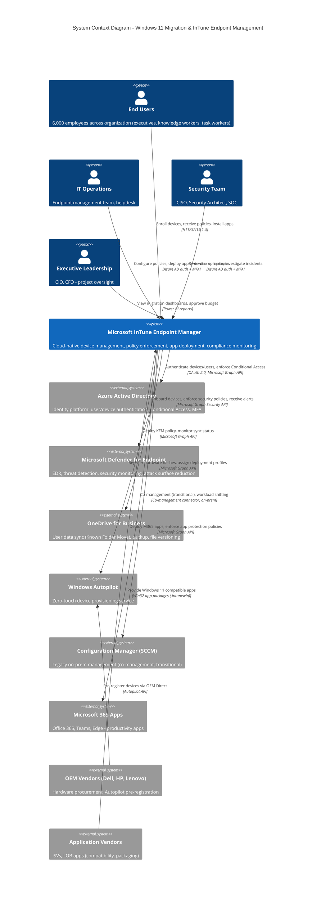

# High-Level Design (HLD): Windows 10 to Windows 11 Migration with Microsoft InTune

**Document Type**: High-Level Design - Architecture Specification
**Project ID**: 001-windows-11-migration-intune
**Version**: 1.0
**Date**: 2025-10-22
**Status**: DRAFT (For Architecture Review Board Approval)
**Owner**: Enterprise Architecture Team
**Contributors**: Security Architect, IT Operations, CISO

---

## Document Control

| Version | Date | Author | Changes |
|---------|------|--------|---------|
| 1.0 | 2025-10-22 | Enterprise Architecture Team | Initial HLD - comprehensive architecture covering all 18 principles, 45 requirements, MOD SbD CAAT framework |

**Distribution List**:
- Enterprise Architecture Review Board
- CIO (Executive Sponsor)
- CISO (Security Executive)
- IT Operations Director
- Security Architect
- Endpoint Management Team
- Change Advisory Board

**Review Status**: Awaiting Architecture Review Board approval

---

## Executive Summary

###

 Purpose and Scope

This High-Level Design (HLD) document specifies the technical architecture for migrating ~6,000 Windows 10 devices to Windows 11 while simultaneously transforming endpoint management from on-premises Configuration Manager to cloud-native Microsoft InTune. This design addresses all business requirements (BR-001 to BR-008), functional requirements (FR-001 to FR-020), non-functional requirements (NFR), integration requirements (INT-001 to INT-003), and data requirements (DR-001 to DR-008).

**Critical Constraints**:
- **Windows 10 EOL**: October 14, 2025 - **95% migration target by September 1, 2025**
- **MOD Secure by Design**: CAAT (Cyber Activity and Assurance Tracker) continuous assurance required
- **Zero Trust Security**: Mandatory TPM 2.0, Secure Boot, BitLocker, MFA, Conditional Access
- **Cloud-First**: 100% cloud-native management via InTune, ConfigMgr decommissioned within 18 months

### Architecture Overview

This solution leverages **Microsoft Azure cloud-native endpoint management** (InTune, Azure AD, Defender for Endpoint) to provide:

1. **Automated Deployment**: Windows Autopilot for zero-touch provisioning (new devices) and InTune Feature Update policies for in-place upgrades (existing Windows 10 devices)
2. **Zero Trust Security**: Device attestation (TPM 2.0), Conditional Access, BitLocker, MFA, Defender for Endpoint with EDR
3. **Cloud Management**: 100% managed via InTune (policies, apps, updates) with Configuration Manager co-management during transition
4. **Data Protection**: OneDrive Known Folder Move (KFM) for automatic user data backup, BitLocker key escrow to Azure AD
5. **AI-Ready Hardware**: Copilot+ PC deployment (30% of devices Year 1) with NPU acceleration for productivity gains

**Architecture Patterns**:
- **Cloud-Native Device Management** (Principle 1)
- **Zero Trust Security** (Principle 2)
- **Phased Rollout with Pilot/Early Adopters/Production Waves** (Principle 6)
- **Automated Deployment** (Principle 7)
- **Policy-Based Configuration Management** (Principle 8)

### Success Criteria

- ✅ **95% migration completion** by September 1, 2025 (6 weeks before Windows 10 EOL)
- ✅ **100% security compliance**: TPM 2.0, Secure Boot, BitLocker, MFA enforced on all Windows 11 devices
- ✅ **<2 hours user downtime** per device migration, 100% user data preserved
- ✅ **80% user satisfaction** (post-migration survey)
- ✅ **MOD SbD compliant**: CAAT registered, Security Governance Review passed, penetration tested
- ✅ **ConfigMgr decommissioned** within 18 months (Month 18 target)

---

## 1. System Context (C4 Level 1)

### 1.1 System Context Diagram

**Purpose**: Windows 11 Migration and Cloud-Native Endpoint Management System enables secure, automated device provisioning and lifecycle management through Microsoft Azure cloud services.

**System Boundary**: Microsoft InTune (Endpoint Manager) tenant with integrated Azure AD, Defender for Endpoint, OneDrive, and Configuration Manager co-management during transition.



**Key External Systems**:

1. **Azure Active Directory (Azure AD)**
   - **Purpose**: Identity and access management for users and devices
   - **Integration**: OAuth 2.0, Microsoft Graph API
   - **Data Flow**: Device enrollment, Conditional Access policy evaluation, MFA enforcement
   - **Criticality**: **CRITICAL** - Single point of authentication

2. **Microsoft Defender for Endpoint**
   - **Purpose**: Endpoint threat detection, EDR, security monitoring
   - **Integration**: Microsoft Graph Security API, automated onboarding via InTune
   - **Data Flow**: Bi-directional - InTune pushes onboarding policy, Defender sends alerts/telemetry
   - **Criticality**: **CRITICAL** - Required for security compliance (NFR-SEC-003)

3. **OneDrive for Business**
   - **Purpose**: User data backup and sync (Known Folder Move)
   - **Integration**: Microsoft Graph API, OneDrive sync client
   - **Data Flow**: InTune deploys KFM policy, monitors sync status; OneDrive syncs Desktop/Documents/Pictures
   - **Criticality**: **CRITICAL** - Data protection dependency (BR-004, Principle 12)

4. **Windows Autopilot**
   - **Purpose**: Zero-touch device provisioning
   - **Integration**: Microsoft Graph API, hardware hash registration
   - **Data Flow**: OEM vendors pre-register devices, InTune assigns deployment profiles, devices auto-configure
   - **Criticality**: **HIGH** - Required for new device deployments (Principle 7)

5. **Configuration Manager (SCCM) - Transitional**
   - **Purpose**: Legacy on-premises management during co-management transition
   - **Integration**: Co-management connector (hybrid cloud-on-prem)
   - **Data Flow**: Gradual workload shift from ConfigMgr to InTune (18-month sunset)
   - **Criticality**: **MEDIUM** - Transitional only, decommissioned by Month 18

**User Personas**:
- **End Users** (6,000): Windows 10 users receiving Windows 11 upgrades
- **IT Operations** (15-20 staff): Configure InTune, manage deployments, support users
- **Security Team** (5-10 staff): Monitor compliance, investigate security incidents
- **Executive Sponsors**: CIO (budget/decisions), CISO (security approval)

---

### 1.2 System Capabilities (High-Level Functional View)

| Capability | Description | Requirements Addressed |
|------------|-------------|------------------------|
| **Device Lifecycle Management** | Provision, configure, update, retire devices through InTune | BR-002, FR-002, FR-004, Principle 1 |
| **Security & Compliance Enforcement** | Enforce TPM 2.0, BitLocker, Defender, Conditional Access | BR-001, BR-006, NFR-SEC-001/002/003, Principle 2 |
| **Application Management** | Deploy, update, retire applications via InTune Win32 app deployment | BR-004, FR-008, Principle 5 |
| **Data Protection** | OneDrive KFM, BitLocker encryption, key escrow | BR-004, FR-003, NFR-SEC-002, Principle 12 |
| **Monitoring & Reporting** | Compliance dashboards, migration progress, security posture | BR-008, FR-016, NFR-C-002, Principle 10 |
| **Update Management** | Windows Update for Business (WUfB) rings for feature/quality updates | BR-001, FR-004, FR-012, Principle 9 |
| **Identity & Access Control** | Azure AD join, MFA, Conditional Access, Windows Hello | BR-001, NFR-SEC-001, Principle 11 |
| **Threat Detection & Response** | Defender for Endpoint EDR, attack surface reduction, SOC integration | BR-001, FR-011, NFR-SEC-003/008, Principle 2 |

---

## 2. Container Architecture (C4 Level 2)

### 2.1 Container Diagram - InTune Endpoint Management Architecture

**Purpose**: Detailed view of major components (containers) within the InTune endpoint management system and their interactions.

```mermaid
C4Container
    title Container Diagram - Microsoft InTune Endpoint Management Architecture

    Person(end_user, "End User", "Windows 10/11 device user")
    Person(it_admin, "IT Administrator", "InTune admin")
    Person(security_analyst, "Security Analyst", "SOC analyst")

    Container_Boundary(azure_cloud, "Microsoft Azure Cloud (UK South region)") {
        Container(intune_mgmt, "InTune Management Service", "SaaS", "Device enrollment, policy distribution, app deployment, compliance evaluation")
        Container(azure_ad_tenant, "Azure AD Tenant", "SaaS", "User/device authentication, Conditional Access, MFA, device registration")
        Container(autopilot_service, "Windows Autopilot Service", "SaaS", "Zero-touch provisioning, device registration, deployment profiles")
        Container(defender_portal, "Defender for Endpoint Portal", "SaaS", "Threat analytics, incident investigation, EDR alerts, security recommendations")
        Container(onedrive_tenant, "OneDrive for Business Tenant", "SaaS", "File storage, KFM sync, versioning, backup")
        ContainerDb(intune_db, "InTune Database", "Azure SQL", "Device inventory, policy configs, compliance status, app metadata")
        Container(graph_api, "Microsoft Graph API", "REST API", "Unified API gateway for InTune, Azure AD, Defender, OneDrive")
        Container(log_analytics, "Azure Log Analytics", "SaaS", "Centralized logging, audit logs, 7-year retention")
        Container(power_bi, "Power BI Service", "SaaS", "Migration dashboards, compliance reports, executive KPIs")
    }

    Container_Boundary(on_prem, "On-Premises (Transitional - Month 0-18)") {
        Container(configmgr_server, "Configuration Manager Server", "Windows Server", "Co-management, gradual workload transition, legacy app deployment")
        ContainerDb(configmgr_db, "ConfigMgr Database", "SQL Server", "Device inventory, app packages, deployment history")
    }

    Container_Boundary(endpoint, "Windows 11 Endpoint Device") {
        Container(intune_agent, "InTune Management Extension", "Windows Service", "Policy enforcement, app installation, compliance checks")
        Container(defender_agent, "Defender for Endpoint Agent", "Windows Service", "Real-time protection, EDR, threat telemetry")
        Container(onedrive_client, "OneDrive Sync Client", "Desktop App", "KFM sync engine, file upload/download")
        Container(autopilot_oobe, "Windows Autopilot OOBE", "Windows Setup", "Out-of-box provisioning experience, Azure AD join")
    }

    Rel(end_user, autopilot_oobe, "Unbox new device, sign in with Azure AD", "HTTPS")
    Rel(it_admin, intune_mgmt, "Configure policies, deploy apps, monitor compliance", "Azure AD auth + MFA, HTTPS")
    Rel(security_analyst, defender_portal, "Investigate threats, review alerts", "Azure AD auth + MFA, HTTPS")

    Rel(autopilot_oobe, autopilot_service, "Register device, retrieve deployment profile", "HTTPS/TLS 1.3")
    Rel(autopilot_oobe, azure_ad_tenant, "Azure AD join, device registration", "OAuth 2.0")
    Rel(intune_agent, intune_mgmt, "Check-in every 8 hours, receive policies/apps", "HTTPS/TLS 1.3")
    Rel(intune_mgmt, azure_ad_tenant, "Evaluate Conditional Access, verify device compliance", "Microsoft Graph API")
    Rel(intune_mgmt, defender_portal, "Onboard device, push security baseline", "Microsoft Graph Security API")
    Rel(defender_agent, defender_portal, "Send threat telemetry, receive threat intel", "HTTPS/TLS 1.3")
    Rel(onedrive_client, onedrive_tenant, "Sync Desktop/Documents/Pictures", "HTTPS/TLS 1.3")
    Rel(intune_mgmt, onedrive_tenant, "Deploy KFM policy, monitor sync status", "Microsoft Graph API")
    Rel(intune_mgmt, intune_db, "Store device inventory, policies, compliance status", "TLS-encrypted")
    Rel(intune_mgmt, log_analytics, "Send audit logs, compliance events", "Azure Monitor API")
    Rel(it_admin, power_bi, "View migration dashboards", "Azure AD auth, HTTPS")
    Rel(power_bi, intune_db, "Query device/migration data", "Azure SQL TLS")

    Rel(intune_agent, configmgr_server, "Co-management workload execution (transitional)", "HTTPS/WinRM")
    Rel(configmgr_server, intune_mgmt, "Co-management sync, workload transition", "Co-management connector")

    UpdateRelStyle(intune_agent, configmgr_server, $offsetY="-40", $offsetX="-50")
    UpdateLayoutConfig($c4ShapeInRow="4", $c4BoundaryInRow="1")
```



**Container Descriptions**:

### 2.2 Core Containers (Microsoft Azure Cloud)

#### 2.2.1 InTune Management Service
- **Technology**: Microsoft InTune (SaaS - Endpoint Manager admin center)
- **Purpose**: Central management plane for device enrollment, policy distribution, application deployment, compliance enforcement
- **Key Functions**:
  - Device enrollment and registration
  - Configuration profile distribution (compliance, security baseline, BitLocker, WiFi, VPN)
  - Win32 application packaging and deployment
  - Feature Update policy management (Windows 11 upgrades)
  - Device compliance evaluation (hourly checks)
- **API**: Microsoft Graph API (https://graph.microsoft.com)
- **Authentication**: Azure AD OAuth 2.0, admin MFA required
- **Availability**: 99.9% SLA (Microsoft-managed)
- **Requirements Addressed**: BR-002, FR-002, FR-004, FR-005, Principle 1, 8

#### 2.2.2 Azure AD Tenant
- **Technology**: Azure Active Directory Premium P1 (SaaS)
- **Purpose**: Identity platform for user and device authentication, Conditional Access enforcement
- **Key Functions**:
  - Azure AD Join for Windows 11 devices
  - User authentication with MFA enforcement
  - Conditional Access policy evaluation (device compliance, location, risk)
  - Windows Hello for Business (passwordless authentication)
  - Device registration and health attestation
- **Authentication Protocol**: OAuth 2.0, SAML 2.0, OpenID Connect
- **Conditional Access Policies**:
  - **CA-001**: Require MFA for all users
  - **CA-002**: Require compliant device for corporate resources
  - **CA-003**: Block legacy authentication
  - **CA-004**: Require approved client apps (Outlook, Teams mobile)
- **Requirements Addressed**: BR-001, NFR-SEC-001, Principle 2, 11

#### 2.2.3 Windows Autopilot Service
- **Technology**: Windows Autopilot (SaaS - part of InTune)
- **Purpose**: Zero-touch device provisioning, automated deployment profile assignment
- **Key Functions**:
  - Hardware hash registration (4K device identifier)
  - Deployment profile assignment (User-Driven, Self-Deploying, Pre-Provisioning)
  - Enrollment Status Page (ESP) configuration
  - OEM Direct integration (Dell, HP, Lenovo auto-register devices)
- **Deployment Modes**:
  - **User-Driven Mode**: End user unboxes, connects to network, signs in → automatic configuration (30 min target)
  - **Self-Deploying Mode**: Kiosks, shared devices → no user interaction
  - **Pre-Provisioning (White Glove)**: IT pre-configures devices before shipment to users
- **Requirements Addressed**: BR-002, FR-002, NFR-P-001, Principle 7

#### 2.2.4 Defender for Endpoint Portal
- **Technology**: Microsoft Defender for Endpoint (SaaS - Microsoft 365 Security Center)
- **Purpose**: Endpoint detection and response (EDR), threat analytics, security monitoring
- **Key Functions**:
  - Automated device onboarding via InTune
  - Real-time protection (antivirus, anti-malware)
  - Attack surface reduction (ASR) rules
  - Endpoint behavior analysis and threat detection
  - Security recommendations and vulnerability management
  - SOC alert integration (ServiceNow, Splunk)
- **Integration**: Microsoft Graph Security API, bi-directional with InTune
- **Requirements Addressed**: BR-001, FR-011, NFR-SEC-003, Principle 2

#### 2.2.5 OneDrive for Business Tenant
- **Technology**: OneDrive for Business (SaaS - 1TB/user, Microsoft 365 E3/E5)
- **Purpose**: User data backup and sync via Known Folder Move (KFM)
- **Key Functions**:
  - Automatic sync of Desktop, Documents, Pictures folders
  - File versioning (30-day history)
  - Recycle Bin (93-day retention)
  - Offline file access
  - BitLocker-encrypted local cache
- **Deployment**: InTune configuration profile (silent KFM deployment)
- **Monitoring**: InTune reports on sync status per device
- **Requirements Addressed**: BR-004, FR-003, Principle 12

#### 2.2.6 InTune Database (Azure SQL)
- **Technology**: Azure SQL Database (PaaS)
- **Purpose**: Persistent storage for device inventory, policies, compliance status, application metadata
- **Data Stored**:
  - Device records (6,000+ devices): hardware specs, OS version, compliance status, last check-in
  - Configuration profiles: compliance policies, security baselines, BitLocker configs
  - Application metadata: Win32 app packages, deployment assignments, installation status
  - Migration event logs: migration state, success/failure, rollback events (DR-002)
- **Backup**: Automated daily backups, 30-day retention
- **Encryption**: TDE (Transparent Data Encryption) with Azure Key Vault
- **Requirements Addressed**: DR-001, DR-002, Principle 1

#### 2.2.7 Microsoft Graph API
- **Technology**: RESTful API gateway (SaaS - https://graph.microsoft.com)
- **Purpose**: Unified API for InTune, Azure AD, Defender, OneDrive, M365 services
- **Authentication**: OAuth 2.0 with app permissions or delegated permissions
- **Rate Limiting**: 20,000 requests/minute per tenant
- **Key Endpoints Used**:
  - `/deviceManagement/` - InTune device management
  - `/devices/` - Azure AD device registration
  - `/security/` - Defender for Endpoint alerts
  - `/me/drive/` - OneDrive user files
- **Requirements Addressed**: INT-001, INT-002, INT-003

#### 2.2.8 Azure Log Analytics
- **Technology**: Azure Monitor - Log Analytics workspace
- **Purpose**: Centralized logging, audit trail, compliance reporting
- **Logs Collected**:
  - Azure AD audit logs (sign-ins, Conditional Access evaluations)
  - InTune audit logs (policy changes, device wipes, app deployments)
  - Defender for Endpoint alerts
  - Configuration Manager co-management events (transitional)
- **Retention**: 7 years (NFR-C-002 requirement for MOD compliance)
- **Querying**: Kusto Query Language (KQL)
- **Alerting**: Azure Monitor alerts → email, Teams, ServiceNow
- **Requirements Addressed**: BR-006, NFR-C-002, Principle 10, 17

#### 2.2.9 Power BI Service
- **Technology**: Power BI (SaaS - Microsoft 365 integration)
- **Purpose**: Migration dashboards, compliance reports, executive KPIs
- **Dashboards**:
  - **Migration Progress Dashboard**: % devices migrated per wave, success rate, rollback rate
  - **Compliance Dashboard**: % compliant devices, top non-compliance reasons, remediation trends
  - **Security Posture Dashboard**: Defender alerts, BitLocker status, Conditional Access blocks
  - **Benefits Realization Dashboard**: ConfigMgr cost savings, Autopilot time savings, user satisfaction
- **Data Sources**: InTune Database (Azure SQL), Azure AD logs, Defender for Endpoint API
- **Update Frequency**: Daily refresh (automated)
- **Access Control**: Azure AD RBAC (IT Ops Director, CIO, CISO, Project Steering Committee)
- **Requirements Addressed**: BR-008, FR-016, Principle 10

---

### 2.3 Transitional Containers (On-Premises - Month 0-18)

#### 2.3.1 Configuration Manager Server
- **Technology**: Microsoft Configuration Manager Current Branch (Windows Server 2019+)
- **Purpose**: Co-management during transition, gradual workload shift to InTune
- **Co-Management Workloads** (transitional schedule):
  - **Month 0-6**: Compliance policies (ConfigMgr), Device configuration (ConfigMgr), Windows Updates (ConfigMgr), App deployment (ConfigMgr)
  - **Month 7-12**: **Shifted to InTune**: Compliance policies, Device configuration, Windows Updates
  - **Month 13-18**: **All workloads shifted to InTune**, ConfigMgr decommissioned
- **Integration**: Co-management connector to InTune (hybrid cloud-on-prem)
- **Sunset Date**: **Month 18** (BR-002 requirement: cloud-native management)
- **Requirements Addressed**: BR-002, FR-018, Principle 1

#### 2.3.2 ConfigMgr Database (SQL Server)
- **Technology**: SQL Server 2019 (on-premises)
- **Purpose**: Legacy device inventory, application packages, deployment history
- **Migration Plan**: Export historical data to Azure Log Analytics before decommissioning
- **Decommissioning**: Month 18 (archive to Azure Blob Storage for 5-year retention)

---

### 2.4 Endpoint Containers (Windows 11 Device)

#### 2.4.1 InTune Management Extension
- **Technology**: Windows Service (IntuneManagementExtension.exe)
- **Purpose**: Policy enforcement agent, Win32 app installation, compliance checks
- **Functions**:
  - Check-in to InTune every 8 hours (or on-demand via user/app action)
  - Download and apply configuration profiles
  - Install Win32 applications (.intunewin packages)
  - Report device compliance status
  - Execute PowerShell scripts (remediation scripts)
- **Communication**: HTTPS/TLS 1.3 to https://enterpriseregistration.windows.net
- **Requirements Addressed**: BR-002, FR-005, Principle 8

#### 2.4.2 Defender for Endpoint Agent
- **Technology**: Windows Defender (built-in), Defender for Endpoint sensor
- **Purpose**: Real-time protection, EDR, behavioral analysis, threat telemetry
- **Functions**:
  - Real-time antivirus scanning
  - Attack surface reduction (ASR) rule enforcement
  - Behavioral monitoring and anomaly detection
  - Threat telemetry upload to Defender portal (cloud)
  - Automatic remediation of detected threats
- **Onboarding**: Automated via InTune compliance policy
- **Communication**: HTTPS/TLS 1.3 to Microsoft Defender cloud (*.securitycenter.windows.com)
- **Requirements Addressed**: BR-001, FR-011, NFR-SEC-003, Principle 2

#### 2.4.3 OneDrive Sync Client
- **Technology**: OneDrive for Business sync engine (desktop app)
- **Purpose**: Known Folder Move (KFM) sync, automatic backup of user files
- **Functions**:
  - Silent deployment of KFM (InTune policy-driven)
  - Sync Desktop, Documents, Pictures to OneDrive cloud
  - Offline file access with local cache
  - Conflict resolution (last-write-wins)
  - Sync status reporting to InTune
- **Storage**: 1TB per user (Microsoft 365 E3/E5 license)
- **Encryption**: Local cache encrypted with BitLocker, transit encrypted with TLS 1.3
- **Requirements Addressed**: BR-004, FR-003, Principle 12

#### 2.4.4 Windows Autopilot OOBE
- **Technology**: Windows Setup / Out-of-Box Experience (OOBE)
- **Purpose**: Zero-touch provisioning for new devices
- **Provisioning Flow**:
  1. User unboxes device, connects to WiFi/Ethernet
  2. Device contacts Windows Autopilot service (hardware hash lookup)
  3. Autopilot profile retrieved (Azure AD join, deployment settings)
  4. Azure AD join performed (user signs in with corporate credentials)
  5. Enrollment Status Page (ESP) displayed (blocks user access until policies/apps deployed)
  6. InTune policies and applications automatically installed
  7. User presented with desktop (ready to work in <30 minutes - NFR-P-001)
- **Requirements Addressed**: BR-002, FR-002, NFR-P-001, Principle 7

---

## 3. Deployment Architecture

### 3.1 Azure Cloud Services Deployment

**Region**: **UK South** (primary), **UK West** (DR - passive standby)

**Rationale for UK South**:
- Data residency requirement for OFFICIAL-SENSITIVE data (GDPR, UK data sovereignty)
- MOD SbD compliance: UK-based cloud infrastructure
- Closest to end users (majority UK-based)
- Microsoft 99.9% SLA for InTune, Azure AD, Defender

**High Availability**:
- **InTune**: Multi-region Microsoft-managed SaaS (automatic failover)
- **Azure AD**: Globally distributed (99.99% SLA)
- **Defender for Endpoint**: Multi-region SaaS
- **OneDrive**: Geo-redundant storage (GRS) with 3x replication
- **Azure SQL Database (InTune DB)**: Zone-redundant (3 availability zones in UK South)

**Disaster Recovery**:
- **RPO**: <24 hours (daily automated backups)
- **RTO**: <24 hours (restore from Azure backup, redeploy InTune configs via Infrastructure-as-Code)
- **Backup Strategy**: Automated daily snapshots to UK West region
- **Failover**: Manual failover to UK West (InTune configuration re-deployment via PowerShell/Graph API)

### 3.2 Deployment Topology

```
┌─────────────────────────────────────────────────────────────────┐
│ Microsoft Azure Cloud (UK South region)                        │
│                                                                 │
│  ┌────────────────────┐   ┌────────────────────┐               │
│  │ Azure AD Tenant    │   │ InTune Tenant      │               │
│  │ (Premium P1)       │◄─►│ (Endpoint Manager) │               │
│  └────────────────────┘   └────────────────────┘               │
│           ▲                        ▲                            │
│           │                        │                            │
│           │         ┌──────────────┼────────────┐               │
│           │         │              │            │               │
│  ┌────────┴───────┐ │   ┌──────────┴────────┐  │               │
│  │ Conditional    │ │   │ Windows Autopilot │  │               │
│  │ Access Policies│ │   │ Service           │  │               │
│  └────────────────┘ │   └───────────────────┘  │               │
│                     │                           │               │
│           ┌─────────┴───────┐      ┌───────────┴────────┐      │
│           │ Defender for    │      │ OneDrive for       │      │
│           │ Endpoint Portal │      │ Business Tenant    │      │
│           └─────────────────┘      └────────────────────┘      │
│                     │                           │               │
│           ┌─────────┴───────┐      ┌───────────┴────────┐      │
│           │ Azure Log       │      │ Power BI Service   │      │
│           │ Analytics       │      │ (Dashboards)       │      │
│           └─────────────────┘      └────────────────────┘      │
│                                                                 │
└─────────────────────────────────────────────────────────────────┘
                          ▲
                          │ HTTPS/TLS 1.3, OAuth 2.0
                          │
        ┌─────────────────┼─────────────────┐
        │                 │                 │
┌───────┴───────┐ ┌───────┴───────┐ ┌───────┴───────┐
│ Windows 11    │ │ Windows 11    │ │ Windows 11    │
│ Device 1      │ │ Device 2      │ │ Device ...N   │
│ (Azure AD     │ │ (Azure AD     │ │ (6,000 devices│
│  Joined)      │ │  Joined)      │ │  total)       │
└───────────────┘ └───────────────┘ └───────────────┘
```

### 3.3 Network Architecture

**Connectivity Requirements**:
- **Corporate Network**: Devices must reach Microsoft cloud endpoints (*.microsoftonline.com, *.windows.net, *.microsoft.com)
- **Firewall Rules**: Allow HTTPS (443) to Azure AD, InTune, Defender, OneDrive endpoints (published by Microsoft)
- **Bandwidth**: 100 Mbps minimum per 500 concurrent users (Autopilot provisioning, app downloads)
- **VPN**: NOT required for InTune/Azure AD (cloud-native), optional for on-prem apps during transition

**Security Controls**:
- **TLS 1.3**: All communications encrypted (minimum TLS 1.2)
- **Certificate Pinning**: Defender for Endpoint agent uses certificate pinning
- **No Direct Internet Access**: Devices must route through corporate proxy/firewall (egress filtering)

---

## 4. Security Architecture (Zero Trust)

### 4.1 Zero Trust Security Model

**Principle**: "Never trust, always verify" - all access requests validated (user, device, location, risk)

**Four Pillars**:

#### 4.1.1 Device Attestation (Pillar 1)
- **TPM 2.0 Device Health Attestation**: InTune verifies TPM 2.0 enabled, Secure Boot active, HVCI (Hypervisor-Protected Code Integrity) enabled
- **Compliance Policy**: Devices failing health attestation marked non-compliant, blocked from corporate resources
- **Enforcement**: Conditional Access policy requires compliant device
- **Requirements Addressed**: NFR-SEC-001, Principle 2

#### 4.1.2 Identity Protection (Pillar 2)
- **Azure AD MFA**: Multi-Factor Authentication required for all users (Microsoft Authenticator app, FIDO2 keys)
- **Windows Hello for Business**: PIN + biometric (fingerprint, facial recognition) for device sign-in (passwordless)
- **Conditional Access**: Risk-based policies (user risk, sign-in risk, device compliance, location)
- **Requirements Addressed**: NFR-SEC-001, Principle 11

#### 4.1.3 Conditional Access (Pillar 3)
- **Policy Evaluation**: Every access request evaluated against Conditional Access policies before resource access granted
- **Grant Controls**:
  - Require MFA
  - Require compliant device (InTune compliance policy pass)
  - Require approved client app (Outlook, Teams mobile)
  - Require hybrid Azure AD joined device (transitional, for on-prem apps)
- **Block Controls**:
  - Block legacy authentication (no Basic Auth, NTLM)
  - Block non-compliant devices
  - Block sign-ins from untrusted locations (countries outside UK/EU)
- **Requirements Addressed**: NFR-SEC-001, Principle 2

#### 4.1.4 Endpoint Protection (Pillar 4)
- **Microsoft Defender for Endpoint**: Real-time protection, EDR, attack surface reduction
- **BitLocker**: Full disk encryption (AES-256) with TPM 2.0, keys escrowed to Azure AD
- **Application Control**: Windows Defender Application Control (WDAC) for high-security devices (kiosks, executives)
- **Attack Surface Reduction (ASR) Rules**: Block Office macros, script execution, credential theft
- **Requirements Addressed**: NFR-SEC-002, NFR-SEC-003, Principle 2

---

### 4.2 Security Baseline Configuration

**Microsoft Security Baseline for Windows 11** (deployed via InTune configuration profile):

| Security Control | Setting | Enforcement |
|------------------|---------|-------------|
| **BitLocker** | TPM 2.0 + AES-256, keys escrowed to Azure AD | Compliance policy - MANDATORY |
| **Windows Firewall** | Enabled (domain, private, public profiles), block all inbound by default | Configuration profile |
| **SmartScreen** | Enabled (warn on unrecognized apps, block malicious downloads) | Configuration profile |
| **Credential Guard** | Enabled (virtualization-based security for credentials) | Configuration profile - MANDATORY |
| **Attack Surface Reduction** | 14 ASR rules enabled (block Office macros, untrusted processes, etc.) | Configuration profile |
| **Local Admin Rights** | Removed (standard users), LAPS (Local Administrator Password Solution) for emergency access | Configuration profile |
| **Windows Defender Antivirus** | Real-time protection enabled, cloud-delivered protection, tamper protection | Compliance policy |
| **Windows Update** | Automatic updates enabled, deferral rings configured | Windows Update for Business policy |
| **USB Storage** | Allowed (BitLocker To Go encryption enforced for removable drives) | Configuration profile |

**Requirements Addressed**: BR-001, NFR-SEC-001/002/003, Principle 2

---

### 4.3 Encryption Architecture

#### 4.3.1 Data Encryption at Rest
- **BitLocker Full Disk Encryption**: Enforced on all Windows 11 devices (AES-256, TPM 2.0)
- **Recovery Keys**: Escrowed to Azure AD (IT admin can retrieve via InTune portal)
- **Unlock Method**: TPM-only (transparent unlock), TPM + PIN for high-security users
- **OneDrive Files**: Encrypted at rest in Microsoft 365 tenant (AES-256)
- **Requirements Addressed**: NFR-SEC-002, Principle 2, 12

#### 4.3.2 Data Encryption in Transit
- **TLS 1.3**: All communications to Azure services (InTune, Azure AD, Defender, OneDrive)
- **Certificate Validation**: Public key infrastructure (PKI), certificate pinning for Defender agent
- **VPN**: Always-On VPN (optional, for on-prem resource access during transition) with IKEv2/IPSec
- **Requirements Addressed**: NFR-SEC-002

#### 4.3.3 Secrets Management
- **Azure Key Vault**: Store BitLocker recovery keys, VPN certificates, app secrets
- **InTune Certificate Profiles**: Distribute user/device certificates for 802.1X WiFi, VPN
- **Windows Hello for Business**: User credentials stored in TPM (not in Active Directory or Azure AD)

---

### 4.4 Threat Model (STRIDE Analysis)

| Threat Category | Threat Description | Likelihood | Impact | Mitigation | Residual Risk |
|----------------|-------------------|------------|--------|------------|---------------|
| **Spoofing** | Stolen Azure AD credentials grant unauthorized InTune access | MEDIUM | HIGH | MFA enforcement, Conditional Access (compliant device), Azure AD Identity Protection (risk-based blocking) | LOW |
| **Tampering** | InTune policy modification disables security controls (BitLocker, Defender) | LOW | HIGH | RBAC (least privilege), InTune admin MFA, Azure AD Privileged Identity Management (PIM) for just-in-time access, audit logging | LOW |
| **Repudiation** | Unauthorized policy changes with no audit trail | LOW | MEDIUM | Azure AD audit logs (7-year retention), immutable logging to Azure Log Analytics, SIEM integration | LOW |
| **Information Disclosure** | PII data breach via InTune console (user profiles, device locations) | MEDIUM | MEDIUM | Conditional Access (require compliant device for InTune admin access), DLP policies (prevent screenshot/exfiltration), RBAC (least privilege) | MEDIUM |
| **Denial of Service** | InTune API throttling prevents policy deployment | LOW | MEDIUM | Microsoft 99.9% SLA, rate limiting acceptable (20K requests/min), retry logic in automation scripts | LOW |
| **Elevation of Privilege** | Compromised Global Admin account grants full tenant control | MEDIUM | CRITICAL | Azure AD PIM (just-in-time Global Admin access), MFA enforcement, admin account monitoring, Conditional Access (require compliant device) | MEDIUM |

**Requirements Addressed**: NFR-SEC-004, NFR-SEC-005, Principle 2

---

### 4.5 MOD Secure by Design (SbD) Compliance

**CAAT (Cyber Activity and Assurance Tracker) Continuous Assurance Framework**:

#### 4.5.1 Security Governance (Three Lines of Defence)
- **First Line**: Delivery Team Security Lead (DTSL) - owns CAAT self-assessment, appointed Week 1
- **Second Line**: Security Governance Review Board - conducts quarterly Security Governance Reviews (replaces IAA approval)
- **Third Line**: Internal Audit - validates CAAT self-assessment accuracy (annual)

#### 4.5.2 CAAT Registration Timeline
- **Week 1**: DTSL appointed, CAAT account created, programme registered
- **Week 2**: Business Impact Assessment (BIA) completed in CAAT
- **Month 1**: Threat model documented (STRIDE), CAAT self-assessment (7 SbD Principles) completed
- **Month 2**: Penetration testing, SBOM creation, incident response plan
- **Month 3**: Security Governance Review (Second Line approval), Third Line internal audit
- **Ongoing**: Quarterly CAAT updates, continuous supplier attestation (Microsoft quarterly, hardware vendors annually)

#### 4.5.3 Supplier Attestation (ISN 2023/10)
- **Microsoft Azure/InTune**: Continuous supplier attestation (quarterly re-attestation via Microsoft Trust Center, ISO 27001, SOC 2 Type II)
- **Hardware Vendors** (Dell, HP, Lenovo): Annual attestation (Secure Boot, TPM 2.0, BIOS security)
- **ISV Applications**: Per-version attestation (Windows 11 compatibility, security testing)

#### 4.5.4 Penetration Testing
- **Vendor**: CREST/CHECK-certified penetration testing firm
- **Scope**: InTune tenant configuration, Conditional Access policies, Defender for Endpoint, endpoint security controls
- **Timeline**: Month 2 (before pilot deployment), annual re-testing
- **Remediation**: All CRITICAL findings remediated before pilot, HIGH findings before production

#### 4.5.5 Software Bill of Materials (SBOM)
- **Components**:
  - Windows 11 Pro/Enterprise (version 22H2/23H2)
  - Microsoft 365 Apps (Office 365, Teams, Edge)
  - Win32 applications (top 20 business-critical apps)
  - InTune Management Extension
  - Defender for Endpoint agent
  - OneDrive sync client
- **Format**: SPDX or CycloneDX JSON
- **Maintenance**: Updated quarterly, validated against CVE database

**Requirements Addressed**: NFR-SEC-004, NFR-SEC-005, NFR-SEC-006, NFR-SEC-007, Principle 2

---

## 5. Application Management Architecture

### 5.1 Application Deployment Strategy

**Application Categories**:

| Category | Example Apps | Deployment Method | Packaging | Priority |
|----------|-------------|-------------------|-----------|----------|
| **Microsoft 365 Apps** | Office 365, Teams, Edge, OneDrive | InTune (Microsoft 365 Apps configuration profile) | Pre-packaged (Microsoft) | MUST_HAVE |
| **Business-Critical LOB Apps** | [App 1], [App 2], [App 3] (top 20 apps) | InTune Win32 app deployment | .intunewin (wrapped Win32) | MUST_HAVE |
| **Standard Productivity Tools** | Adobe Reader, 7-Zip, VLC, Notepad++ | InTune Win32 app deployment | .intunewin | SHOULD_HAVE |
| **Developer Tools** | Visual Studio Code, Git, Python, Docker Desktop | InTune Win32 app deployment (optional, assigned to developers) | .intunewin | MAY_HAVE |
| **Legacy Apps (Transitional)** | Apps requiring ConfigMgr (complex dependencies) | Configuration Manager (co-management) → migrate to InTune by Month 12 | .msi, .exe (ConfigMgr) | Transition |

### 5.2 Application Packaging Workflow

**Win32 App Packaging** (for InTune deployment):

```
1. Source Application (.msi, .exe, .zip)
      ↓
2. Repackage with InTune Win32 Content Prep Tool
      ↓
3. Generate .intunewin package (encrypted container)
      ↓
4. Upload to InTune (Microsoft Graph API)
      ↓
5. Configure Detection Rules (registry key, file version, MSI product code)
      ↓
6. Define Installation Command (silent install switches: /S, /quiet, /qn)
      ↓
7. Define Dependencies (e.g., .NET Framework, Visual C++ Redistributable)
      ↓
8. Assign to Azure AD Groups (users or devices)
      ↓
9. Deploy to Pilot Group → Early Adopters → Production Waves
      ↓
10. Monitor Installation Success Rate (InTune Reporting)
```

**Requirements Addressed**: FR-008, Principle 5

### 5.3 Application Compatibility Testing

**Test Lab**:
- **Azure Virtual Desktop (AVD)**: Windows 11 VMs for app compatibility testing (before physical device deployment)
- **Test Devices**: 10 physical Windows 11 devices (mix of hardware vendors: Dell, HP, Lenovo)
- **ARM64 Compatibility Lab**: 5 Copilot+ PCs (Qualcomm Snapdragon) for ARM64 app testing (x64 emulation validation)

**Testing Tiers**:
- **Tier 1 (Business-Critical)**: Full regression testing, UAT with business users, performance benchmarking
- **Tier 2 (Standard)**: Smoke testing, basic functionality validation, install/uninstall
- **Tier 3 (Optional)**: Best-effort testing, user self-reporting of issues

**Compatibility Matrix**:

| Application | Windows 10 | Windows 11 x64 | Windows 11 ARM64 (Copilot+ PC) | Compatibility Status | Remediation Plan |
|-------------|-----------|----------------|--------------------------------|----------------------|------------------|
| Microsoft 365 Apps | ✅ | ✅ | ✅ (native ARM64) | COMPATIBLE | None |
| [LOB App 1] | ✅ | ✅ | ⚠️ (x64 emulation) | COMPATIBLE (performance degradation on ARM64) | Test with Prism emulator, fallback to x64 devices if needed |
| [Legacy App X] | ✅ | ❌ (kernel driver incompatible) | ❌ | INCOMPATIBLE | Vendor engagement for Windows 11 driver update OR replace app |

**Requirements Addressed**: BR-005, FR-013, FR-020, Principle 5

---

## 6. Data Architecture

### 6.1 Data Model

**See `data-model.md` for comprehensive entity-relationship diagram (ERD) with 13 entities.**

**Key Data Entities** (summary):

| Entity | Description | Storage Location | GDPR Classification | Retention Period |
|--------|-------------|------------------|---------------------|------------------|
| **E-001: Device** | Device inventory (hostname, OS version, hardware specs) | InTune Database (Azure SQL) | Non-PII | 3 years post-decommission |
| **E-002: Hardware** | CPU, RAM, storage, TPM version | InTune Database (Azure SQL) | Non-PII | 3 years post-decommission |
| **E-003: Software** | Installed applications, versions | InTune Database (Azure SQL) | Non-PII | 3 years post-decommission |
| **E-004: MigrationEvent** | Migration events (start, complete, fail, rollback) | InTune Database (Azure SQL) | Non-PII | 5 years (project audit trail) |
| **E-005: MigrationStatus** | Current migration state per device | InTune Database (Azure SQL) | Non-PII | 5 years |
| **E-006: UserProfile** | **PII**: Full name, email, employee ID, department | Azure AD (Microsoft-managed) | **PII** (GDPR Article 6(1)(b)) | Duration of employment + 1 year |
| **E-007: SupportTicket** | Helpdesk tickets, issue descriptions | ServiceNow (external system) | Non-PII (device ID only) | 2 years |
| **E-008: ComplianceStatus** | Device compliance (pass/fail per policy) | InTune Database (Azure SQL) | Non-PII | 3 years |
| **E-009: AuditLog** | **Sensitive**: Admin actions, policy changes, device wipes | Azure AD Audit Log, Azure Log Analytics | Audit data (GDPR Article 6(1)(f)) | **7 years** (MOD requirement) |
| **E-010: DeviceLocation** | Device Azure AD registration location (country, IP) | Azure AD Device Registration | Indirect PII | 1 year |
| **E-011: AssetInventory** | Hardware asset tracking (purchase date, warranty, owner) | Asset management system (external) | Non-PII | 7 years (financial audit) |
| **E-012: ApplicationCompatibility** | App compatibility test results | InTune Database (Azure SQL) | Non-PII | 5 years |
| **E-013: CopilotPC** | Copilot+ PC tracking (NPU model, ARM64 flag, AI feature usage) | InTune Database (Azure SQL) | Non-PII | 5 years |

**Requirements Addressed**: DR-001 to DR-008, NFR-C-001 (GDPR compliance)

### 6.2 Data Flow Architecture

**Primary Data Flows**:

1. **Device Enrollment Flow**:
   ```
   Windows 11 Device → Autopilot Service (hardware hash lookup)
                    → Azure AD (device registration)
                    → InTune (enrollment, policy assignment)
                    → InTune Database (device record created: E-001, E-002)
   ```

2. **User Data Sync Flow (Known Folder Move)**:
   ```
   Windows 11 Device (Desktop/Documents/Pictures folders)
                    → OneDrive Sync Client (local encryption)
                    → OneDrive for Business Tenant (cloud storage, encrypted at rest)
   ```

3. **Compliance Evaluation Flow**:
   ```
   InTune Management Extension → InTune Service (compliance check-in every 8 hours)
                              → Azure AD (Conditional Access policy evaluation)
                              → Block/Allow Resource Access (Microsoft 365, VPN, etc.)
   ```

4. **Threat Detection Flow**:
   ```
   Defender for Endpoint Agent → Defender Portal (threat telemetry upload)
                              → SOC (alert to ServiceNow, Splunk)
                              → InTune (quarantine device if critical threat detected)
   ```

5. **Migration Event Logging Flow**:
   ```
   InTune Feature Update Policy → Windows 11 Upgrade (in-place)
                               → InTune (migration event log: E-004, E-005)
                               → Azure Log Analytics (audit trail)
                               → Power BI (migration dashboard update)
   ```

**Requirements Addressed**: DR-002, INT-001, INT-002, INT-003, Principle 10

### 6.3 Data Protection & GDPR Compliance

**PII Data Handling**:

| PII Data Element | Legal Basis (GDPR Article 6) | Purpose | Retention | Data Subject Rights |
|------------------|------------------------------|---------|-----------|---------------------|
| **Full Name, Email, Employee ID** (E-006: UserProfile) | 6(1)(b) - Employment contract | IT equipment provisioning, migration scheduling, support ticket routing | Employment duration + 1 year | Access, Rectification, Erasure (via HR system → Azure AD sync) |
| **Device Location** (E-010) | 6(1)(f) - Legitimate interest | Device security (geo-blocking), Conditional Access | 1 year | Access, Erasure (automatic after 1 year) |
| **Audit Logs** (E-009) | 6(1)(f) - Legitimate interest | Security incident investigation, compliance audit | **7 years** (MOD requirement) | Access only (no erasure - legal obligation to retain) |

**Data Protection Measures**:
- **Encryption at Rest**: BitLocker (devices), AES-256 (OneDrive, Azure SQL TDE)
- **Encryption in Transit**: TLS 1.3 (all cloud communications)
- **Access Controls**: Azure AD RBAC (least privilege), PIM (just-in-time admin access)
- **Audit Logging**: All PII access logged (7-year retention)
- **Data Minimization**: Only collect PII necessary for IT support (no sensitive categories)
- **Pseudonymization**: Device IDs used in logs (not user names where possible)
- **Right to Erasure**: Automated deletion 1 year after employment termination (E-006)

**Data Protection Impact Assessment (DPIA)**: Scheduled Month 2 (before collecting PII via DR-003)

**Requirements Addressed**: NFR-C-001, DR-003, DR-006, Principle 12, 17

---

## 7. Deployment & Migration Architecture

### 7.1 Phased Rollout Strategy

**Phase Overview**:

| Phase | Target Devices | User Personas | Timeline | Success Criteria | Pause Criteria |
|-------|----------------|---------------|----------|------------------|----------------|
| **Phase 0: Pilot** | 50-100 devices | IT staff, architecture team | Weeks 1-4 (Month 9) | 0 P1/P2 incidents, 80% user satisfaction, all apps functional | >10% failure rate |
| **Phase 1: Early Adopters** | 600 devices (10%) | Tech-savvy users, dept champions | Weeks 5-8 (Month 10) | <5% support tickets, <2% app compatibility issues, 75% user satisfaction | >10% failure rate OR P1 incident |
| **Phase 2: Production Wave 1** | 1,500 devices (25%) | General users (mixed departments) | Weeks 9-12 (Month 11-12) | 95% migration success rate | >10% failure rate OR P1 incident |
| **Phase 3: Production Wave 2** | 1,500 devices (25%) | General users (mixed departments) | Weeks 13-16 (Month 13-14) | 95% migration success rate | >10% failure rate OR P1 incident |
| **Phase 4: Production Wave 3** | 1,500 devices (25%) | General users (mixed departments) | Weeks 17-20 (Month 15-16) | 95% migration success rate | >10% failure rate OR P1 incident |
| **Phase 5: Final Wave** | 900 devices (15%) | Remaining users, remote/field workers | Weeks 21-24 (Month 17-18) | 95% migration success rate | >10% failure rate OR P1 incident |

**Total Timeline**: 24 weeks (6 months) for migration execution (Months 9-14 main migration, Months 15-18 cleanup)

### 7.2 Deployment Methods

#### 7.2.1 New Device Deployment (Windows Autopilot)

**User-Driven Mode** (standard users):

```
1. User unboxes device (Dell, HP, Lenovo - OEM pre-registered in Autopilot)
      ↓
2. Device connects to WiFi/Ethernet
      ↓
3. Windows Autopilot OOBE starts
      ↓
4. Hardware hash sent to Autopilot service (device lookup)
      ↓
5. Autopilot profile retrieved (deployment settings)
      ↓
6. Azure AD join initiated
      ↓
7. User signs in with corporate credentials (Azure AD)
      ↓
8. MFA challenge (Microsoft Authenticator app)
      ↓
9. Enrollment Status Page (ESP) displayed (blocks user until complete)
      ↓
10. InTune policies applied:
       - Compliance policy (TPM 2.0, BitLocker, Defender)
       - Configuration profiles (WiFi, VPN, certificates, security baseline)
       - Applications (Microsoft 365 Apps, LOB apps)
      ↓
11. User presented with desktop (30 minutes target)
      ↓
12. OneDrive KFM policy deploys silently (Desktop/Documents/Pictures sync)
```

**Target Provisioning Time**: <30 minutes (NFR-P-001)

**Requirements Addressed**: BR-002, FR-002, NFR-P-001, Principle 7

#### 7.2.2 Existing Windows 10 Device Upgrade (In-Place Upgrade)

**InTune Feature Update Policy**:

```
1. IT admin creates Feature Update policy in InTune:
       - Target OS version: Windows 11 23H2
       - Deferral: 14 days (for production ring)
       - Deadline: 7 days after download (forced restart)
      ↓
2. Policy assigned to Azure AD group (e.g., "Production Wave 1 - 1500 devices")
      ↓
3. InTune distributes policy to devices (8-hour check-in cycle)
      ↓
4. Device downloads Windows 11 upgrade package (background)
      ↓
5. User notified: "Windows 11 upgrade ready. Install now or schedule"
      ↓
6. User schedules upgrade OR auto-install after deadline (7 days)
      ↓
7. Pre-flight checks:
       - Hardware compatibility (TPM 2.0, Secure Boot, RAM, storage)
       - OneDrive KFM sync status (user data backed up)
       - Battery >30% (if laptop)
      ↓
8. Upgrade starts (1-2 hours, device unavailable to user)
      ↓
9. Windows 11 setup completes
      ↓
10. Device reboots → user signs in → Windows 11 desktop
      ↓
11. InTune policies re-applied (compliance, configuration, apps)
      ↓
12. Migration event logged (E-004: success/failure, E-005: state = "Complete")
      ↓
13. User presented with Windows 11 desktop (<2 hours total downtime)
```

**Target Upgrade Time**: <90 minutes (NFR-P-002)

**Rollback Window**: 10 days (Windows.old folder retained)

**Requirements Addressed**: BR-001, FR-004, NFR-P-002, Principle 7

### 7.3 Wave Sizing & Composition

**Wave Size**: 500-1,000 devices per week (target: 1,500 devices per 2-3 weeks per production wave)

**Wave Composition Strategy**:
- **Mix departments**: Don't migrate entire Finance or HR in single wave (spread risk)
- **Geographic distribution**: Mix HQ and remote sites (test network bandwidth)
- **Device types**: Mix laptops, desktops, tablets (test hardware diversity)
- **User personas**: Mix executives, knowledge workers, task workers (test use cases)

**Pause Criteria**:
- **>10% failure rate** (devices failing to upgrade or rollback)
- **P1 incident** (multiple users unable to work, data loss, security breach)
- **Critical app incompatibility** discovered (blocking business operations)

**Resume Criteria** (after pause):
- Root cause identified and remediated
- Fix validated in test lab (AVD or physical test devices)
- Change Advisory Board approval to resume

**Requirements Addressed**: BR-008, Principle 6

---

## 8. Update Management Architecture

### 8.1 Windows Update for Business (WUfB) Rings

**Update Ring Strategy**:

| Ring | Target Users | Devices | Feature Update Deferral | Quality Update Deferral | Deadline (Forced Restart) | Purpose |
|------|-------------|---------|------------------------|------------------------|--------------------------|---------|
| **Ring 1: Preview** | IT staff, early adopters | 100 devices (1.7%) | 0 days (immediate) | 0 days | 3 days | Early warning of issues, validation |
| **Ring 2: Broad** | Department champions, tech-savvy users | 600 devices (10%) | 7 days | 3 days | 5 days | Scale validation before production |
| **Ring 3: Production** | General user population | 4,800 devices (80%) | 14 days | 7 days | 7 days | Main deployment after validation |
| **Ring 4: Critical** | Executives, critical systems, kiosks | 500 devices (8.3%) | 30 days | 14 days | 14 days | Maximum stability, deferred deployment |

**Active Hours Configuration**: 8 AM - 6 PM (organizational working hours) - prevent disruptive restarts

**Update Types**:
- **Feature Updates**: Annual feature updates (Windows 11 22H2 → 23H2 → 24H2), deployed per ring schedule
- **Quality Updates**: Monthly cumulative updates (Patch Tuesday - 2nd Tuesday of month), deployed per ring schedule
- **Driver Updates**: Automatic driver updates enabled (with option to pause problematic drivers via InTune)

**Update Monitoring**:
- **InTune Update Compliance Dashboard**: Track update installation success/failure rates per ring
- **Alerts**: Email alerts if >10% of devices fail to install updates within 30 days
- **Remediation**: Failed updates investigated (log analysis), devices wiped/rebuilt if unrecoverable

**Requirements Addressed**: BR-001, FR-004, FR-012, Principle 9

### 8.2 Update Deployment Flow

```
Microsoft Update Catalog (Patch Tuesday)
      ↓
Windows Update for Business (WUfB) - Ring 1 (Preview)
      ↓ (0 days deferral)
100 IT staff devices (install immediately)
      ↓ (Monitor 7 days for issues)
Windows Update for Business (WUfB) - Ring 2 (Broad)
      ↓ (7 days deferral)
600 early adopter devices
      ↓ (Monitor 7 days for issues)
Windows Update for Business (WUfB) - Ring 3 (Production)
      ↓ (14 days deferral)
4,800 general user devices
      ↓ (Monitor 14 days for issues)
Windows Update for Business (WUfB) - Ring 4 (Critical)
      ↓ (30 days deferral)
500 executive/critical devices
```

**Pause Capability**: IT admin can pause updates globally (all rings) if critical issue discovered (via InTune admin center)

---

## 9. Monitoring & Observability Architecture

### 9.1 Monitoring Strategy

**Key Metrics to Monitor** (Principle 10):

| Metric Category | Metrics | Tool | Update Frequency | Alerting Threshold |
|----------------|---------|------|------------------|-------------------|
| **Device Health** | - % devices enrolled<br>- % devices compliant<br>- Devices offline >7 days<br>- OS version distribution | InTune admin center | Real-time | <90% compliant → alert |
| **Security Posture** | - % devices with BitLocker enabled<br>- % devices with Defender enabled<br>- Conditional Access blocks<br>- Defender alerts (P0/P1) | Defender for Endpoint Portal, InTune | Real-time | >10 P1 alerts/day → escalate to SOC |
| **Migration Progress** | - % devices migrated per wave<br>- Migration success rate<br>- Rollback rate<br>- Average upgrade time | Power BI (migration dashboard) | Daily refresh | <95% success rate → pause wave |
| **Application Deployment** | - App installation success rate<br>- Failed app installations (per app) | InTune admin center | Real-time | >10% failure rate → investigate |
| **Update Compliance** | - % devices current on quality updates<br>- % devices current on feature updates<br>- Devices >30 days out of date | InTune Update Compliance Dashboard | Daily refresh | >5% devices >30 days old → remediate |
| **User Experience** | - Device performance (CPU, RAM, disk usage)<br>- Application crash rates<br>- User-reported issues (helpdesk tickets) | Endpoint Analytics, ServiceNow | Hourly (Endpoint Analytics), Real-time (ServiceNow) | >10 tickets/day for same issue → investigate |

**Requirements Addressed**: BR-008, FR-016, Principle 10

### 9.2 Dashboards

#### 9.2.1 Migration Progress Dashboard (Power BI)

**Purpose**: Real-time visibility into migration status for IT Operations, Project Manager, Executive Sponsor

**Widgets**:
1. **Overall Progress Gauge**: X% migrated (target: 95% by Sep 2025)
2. **Migration by Wave** (bar chart): Pilot (100%), Early Adopters (85%), Wave 1 (40%), etc.
3. **Daily Migration Velocity** (line chart): Devices migrated per day
4. **Success vs. Rollback Rate** (pie chart): 93% success, 5% rollback, 2% in progress
5. **Top 5 Migration Failure Reasons** (table): App compatibility (40%), hardware failure (25%), etc.
6. **Migration by Department** (bar chart): Finance (90%), HR (75%), Sales (60%), etc.
7. **Time to Migrate** (histogram): Average 85 min, target <90 min

**Data Source**: InTune Database (E-004: MigrationEvent, E-005: MigrationStatus)

**Access**: IT Operations Director, Project Manager, CIO, Project Steering Committee

**Update Frequency**: Daily refresh (automated at 6 AM)

#### 9.2.2 Security Posture Dashboard (Defender for Endpoint Portal)

**Purpose**: Real-time security monitoring for CISO, Security Team, SOC

**Widgets**:
1. **Device Compliance** (gauge): 94% compliant (target: >90%)
2. **BitLocker Status** (pie chart): 98% encrypted, 2% pending
3. **Defender Alerts by Severity** (bar chart): 0 CRITICAL, 5 HIGH, 20 MEDIUM, 50 LOW
4. **Conditional Access Blocks** (table): Top 5 block reasons (non-compliant device, untrusted location, etc.)
5. **Threat Detections (Last 30 Days)** (line chart): Malware blocked, phishing attempts, etc.
6. **Security Recommendations** (table): Top 5 recommendations (e.g., "Enable ASR rule X", "Patch CVE-YYYY-XXXXX")

**Data Source**: Defender for Endpoint API, InTune Database (E-008: ComplianceStatus)

**Access**: CISO, Security Architect, SOC Analysts

**Update Frequency**: Real-time

#### 9.2.3 Compliance Dashboard (InTune Admin Center)

**Purpose**: Compliance policy monitoring for IT Operations, Security Team

**Widgets**:
1. **Overall Compliance** (gauge): 94% compliant
2. **Non-Compliant Devices** (table): Device name, user, non-compliance reason (e.g., "TPM 2.0 not enabled", "BitLocker not enabled")
3. **Compliance Trends (Last 90 Days)** (line chart): % compliant over time
4. **Top 5 Non-Compliance Reasons** (bar chart): BitLocker disabled (30%), Defender disabled (25%), etc.
5. **Devices Pending Remediation** (table): Devices flagged for wipe/rebuild

**Data Source**: InTune Database (E-008: ComplianceStatus)

**Access**: IT Operations, Security Team, CISO

**Update Frequency**: Real-time

**Requirements Addressed**: FR-016, Principle 10

### 9.3 Alerting & Incident Response

**Alerting Rules** (Azure Monitor Alerts):

| Alert | Condition | Severity | Recipient | Action |
|-------|-----------|----------|-----------|--------|
| **Migration failure rate >10%** | >10% of devices in current wave failed to migrate | HIGH | IT Operations Director, Project Manager | Pause wave, investigate root cause |
| **P1 Defender alert** | CRITICAL threat detected (ransomware, credential theft) | CRITICAL | CISO, SOC, IT Ops | Quarantine device, incident bridge within 30 min |
| **Device non-compliant >24 hours** | Device failed compliance check, not remediated within 24 hours | MEDIUM | IT Operations | Block device via Conditional Access, contact user |
| **InTune service degradation** | Microsoft reports InTune service issue | HIGH | IT Operations Director | Monitor Microsoft status page, escalate if prolonged |
| **>100 devices offline >7 days** | Devices not checking in to InTune | MEDIUM | IT Operations | Investigate (device retired? User on leave? Network issue?) |

**Incident Response** (NFR-SEC-008):

**Incident Severity Definitions**:
- **P1 (CRITICAL)**: Multiple users unable to work, data loss, security breach → Response: 30-minute incident bridge, CISO notified
- **P2 (HIGH)**: Single user or small group unable to work, workaround exists → Response: 4-hour resolution target
- **P3 (MEDIUM)**: Minor inconvenience, no productivity impact → Response: Track in backlog, fix in next sprint

**Incident Response Plan**:
1. Alert triggered (Azure Monitor → email, Teams, ServiceNow ticket)
2. On-call IT Operations engineer triages (severity assessment)
3. If P1: Incident bridge convened (IT Ops, Security, CISO, CIO if needed)
4. Root cause investigation (InTune logs, Defender logs, Azure AD logs)
5. Remediation (policy change, device wipe, rollback wave)
6. Post-incident review (lessons learned, update runbooks)

**SOC Integration** (MOD CERT):
- **Defender for Endpoint alerts** forwarded to SOC (ServiceNow, Splunk)
- **Critical threats** escalated to MOD CERT (if MOD deployment)
- **Incident response runbooks** shared with SOC (device quarantine, forensic imaging)

**Requirements Addressed**: NFR-SEC-008, Principle 10, 15

---

## 10. Operational Architecture

### 10.1 Helpdesk Support Model

**Support Tiers**:

| Tier | Responsibilities | Tools | Escalation Criteria |
|------|------------------|-------|---------------------|
| **Tier 1 (Helpdesk)** | - Password resets (Azure AD SSPR)<br>- Device compliance checks (InTune Company Portal)<br>- Basic troubleshooting (VPN, WiFi, app install)<br>- Migration scheduling | - InTune Remote Help (remote control)<br>- InTune Company Portal<br>- Azure AD SSPR<br>- ServiceNow (ticket tracking) | - Issue not resolved within 30 min<br>- Technical issue (policy conflict, app compatibility) |
| **Tier 2 (Endpoint Support)** | - Application issues (reinstall, repackage)<br>- InTune policy conflicts<br>- Device re-enrollment<br>- Migration failures (investigate logs) | - InTune admin center<br>- PowerShell (Graph API)<br>- Azure AD logs<br>- InTune Fresh Start (device wipe/reprovision) | - InTune platform issue<br>- Azure AD problem<br>- Escalate to Microsoft support |
| **Tier 3 (Escalation)** | - InTune platform issues<br>- Azure AD tenant issues<br>- Microsoft support engagement | - Microsoft Support Portal<br>- Premier Support (if available)<br>- InTune/Azure AD engineering teams | - Vendor (Microsoft) engagement required |

**Helpdesk Training** (Principle 13):
- **Windows 11 features**: Start menu, Settings app, widgets, Snap layouts
- **InTune troubleshooting**: Compliance issues, policy conflicts, app deployment failures
- **Autopilot enrollment**: Troubleshooting enrollment failures (network, hardware hash issues)
- **Conditional Access**: Troubleshooting device not compliant, MFA issues
- **Common app compatibility issues**: Known issues with specific LOB apps, workarounds

**Self-Service Capabilities**:
- **InTune Company Portal app**: Check device compliance, sync policies, view assigned apps
- **Azure AD SSPR** (Self-Service Password Reset): User resets password without helpdesk
- **Knowledge Base**: SharePoint site with FAQs, troubleshooting guides, training videos

**Support Metrics**:
- **First Contact Resolution Rate**: >70% (target)
- **Average Resolution Time**: <4 hours for P3 issues
- **User Satisfaction**: >85% (post-support survey)

**Requirements Addressed**: BR-007, FR-014, FR-015, Principle 13

### 10.2 Change Management Process

**Change Advisory Board (CAB)**:
- **Members**: IT Operations Director (chair), Enterprise Architect, Security Architect, Project Manager, Helpdesk Manager
- **Meeting Frequency**: Weekly during migration (Months 9-18), bi-weekly post-migration
- **Responsibilities**:
  - Review migration progress (dashboards, metrics)
  - Go/no-go decisions for each deployment wave
  - Approve policy changes, app deployments
  - Issue escalation and resolution
  - Exception approvals (defer migration, bypass hardware requirement)

**Change Process**:
1. **Request**: IT admin submits change request (new policy, app deployment, wave go-live)
2. **Impact Assessment**: Evaluate risk (affected devices, users, potential disruption)
3. **CAB Review**: Present to CAB (approve, defer, reject)
4. **Implementation**: Execute change (policy deployment, wave go-live)
5. **Post-Implementation Review**: Validate success, document lessons learned

**Requirements Addressed**: BR-007, Principle 14

### 10.3 Rollback & Recovery Procedures

**Individual Device Rollback** (Within 10 days of upgrade):

```
1. User reports issue (app not working, performance degradation)
      ↓
2. Helpdesk tier 1 triages (attempt remediation: app reinstall, driver update)
      ↓
3. If unresolved, escalate to Tier 2
      ↓
4. Tier 2 decision: Rollback to Windows 10
      ↓
5. User initiates Windows "Go Back" feature:
       Settings > System > Recovery > "Go back to Windows 10"
      ↓
6. Windows 10 restored from Windows.old folder (1-2 hours)
      ↓
7. User data preserved (OneDrive KFM ensured files synced)
      ↓
8. Device re-enrolled in InTune (Windows 10 policies re-applied)
      ↓
9. Rollback event logged (E-004: event_type = "ROLLBACK", E-005: rollback_flag = TRUE)
      ↓
10. Root cause investigation (app compatibility? Hardware issue? User training?)
```

**Rollback Window**: 10 days (Windows.old folder auto-deleted after 10 days)

**Bulk Rollback** (Wave-level rollback):

```
1. CAB decision: Pause wave due to >10% failure rate or P1 incident
      ↓
2. IT admin deploys InTune PowerShell script to affected Azure AD group:
       Script initiates Windows "Go Back" on all devices in wave
      ↓
3. Devices rollback to Windows 10 automatically (overnight, during maintenance window)
      ↓
4. Root cause investigation (test lab, logs analysis)
      ↓
5. Fix validated (policy change, app repackage, hardware replacement)
      ↓
6. CAB approval to re-attempt migration
      ↓
7. Wave re-migrated after fix deployed
```

**Device Re-Image** (Last resort - unrecoverable failure):

```
1. Device failed to migrate AND cannot rollback (Windows.old deleted or corrupted)
      ↓
2. IT admin initiates InTune "Fresh Start" (device wipe)
      ↓
3. Device wiped, Windows 11 reinstalled (clean install)
      ↓
4. Device re-enrolled via Autopilot (if new device) or manual enrollment
      ↓
5. User data restored from OneDrive (KFM sync)
      ↓
6. InTune policies and apps automatically deployed
```

**Requirements Addressed**: BR-008, FR-017, Principle 15

---

## 11. Cost Architecture & FinOps

### 11.1 Cost Breakdown (Annual)

| Cost Category | Annual Cost (Year 1) | Annual Cost (Year 2) | Annual Cost (Year 3) | Notes |
|---------------|----------------------|----------------------|----------------------|-------|
| **Microsoft 365 E3 Licenses** (6,000 users @ £25/user/month) | £1,800,000 | £1,800,000 | £1,800,000 | Existing licenses (assumed) |
| **InTune Standalone** (if not E3/E5) | £0 | £0 | £0 | Included in Microsoft 365 E3 |
| **Azure AD Premium P1** | £0 | £0 | £0 | Included in Microsoft 365 E3 |
| **Defender for Endpoint P1** | £0 | £0 | £0 | Included in Microsoft 365 E3 |
| **OneDrive for Business (1TB/user)** | £0 | £0 | £0 | Included in Microsoft 365 E3 |
| **Azure Log Analytics** (7-year retention, 100 GB/month) | £10,000 | £10,000 | £10,000 | Pay-as-you-go |
| **Power BI Pro Licenses** (10 admins @ £10/user/month) | £1,200 | £1,200 | £1,200 | Dashboards/reporting |
| **Hardware Refreshes** (1,500 devices @ £800/device) | £1,200,000 | £800,000 | £400,000 | Staggered refresh (non-compliant devices) |
| **Copilot+ PCs** (500 devices @ £1,200/device premium) | £600,000 | £400,000 | £200,000 | Premium over standard devices |
| **Professional Services** (implementation, training) | £500,000 | £100,000 | £50,000 | Year 1 heavy lift, Year 2-3 support |
| **Penetration Testing** (annual CREST/CHECK) | £50,000 | £50,000 | £50,000 | MOD SbD requirement |
| **TOTAL** | **£4,161,200** | **£3,161,200** | **£2,511,200** | |

**Cost Savings** (ConfigMgr Decommissioning - BR-003):

| Savings Category | Annual Savings (Year 1) | Annual Savings (Year 2) | Annual Savings (Year 3) | Notes |
|------------------|-------------------------|-------------------------|-------------------------|-------|
| **ConfigMgr Licenses** (6,000 devices @ £30/device/year) | £0 (still in use) | £180,000 | £180,000 | Decommissioned Month 18 |
| **SQL Server Licenses** (ConfigMgr database) | £0 | £20,000 | £20,000 | On-prem SQL no longer needed |
| **On-Prem Server Hardware** (ConfigMgr servers, depreciation) | £0 | £40,000 | £40,000 | 3x servers @ £10K each, 3-year depreciation |
| **Datacenter Rack Space** (3x servers) | £0 | £5,000 | £5,000 | £1,667/server/year |
| **IT Staff Time** (1 FTE managing ConfigMgr) | £0 | £70,000 | £70,000 | 1 FTE salary (redirected to InTune/cloud management) |
| **TOTAL SAVINGS** | **£0** | **£315,000** | **£315,000** | |

**Net Cost** (Investment - Savings):

- **Year 1**: £4,161,200 - £0 = **£4,161,200** (investment year)
- **Year 2**: £3,161,200 - £315,000 = **£2,846,200**
- **Year 3**: £2,511,200 - £315,000 = **£2,196,200**

**3-Year Total Cost**: £9,203,600

**3-Year Total Savings**: £630,000 (ConfigMgr decommissioning)

**ROI**: (£630,000 savings) / (£9,203,600 investment) = **6.8% ROI over 3 years** (cost savings only, excludes productivity gains and risk reduction benefits)

**Note**: Full benefits realization (£7.9M per SOBC v1.1) includes productivity gains, risk reduction, strategic value - not just cost savings.

**Requirements Addressed**: BR-003, Principle 16

### 11.2 FinOps Practices

**Cost Optimization Strategies**:
- **Right-sizing**: Procure Copilot+ PCs only for users requiring AI features (30% target), standard Windows 11 devices for task workers
- **Hardware Lifecycle Management**: Extend device lifecycle to 4-5 years (vs. current 3-4 years) due to Windows 11 hardware requirements
- **License Optimization**: Reclaim Microsoft 365 licenses from inactive users (>90 days no sign-in) → reduce license costs
- **Azure Spend Management**: Monitor Azure Log Analytics ingestion (cap at 100 GB/month), use retention policies to minimize costs

**Cost Tracking**:
- **Monthly Cost Report**: Finance receives monthly report (Azure costs, hardware procurement, professional services)
- **Budget Alerts**: Azure Cost Management alerts if monthly spend >10% over budget
- **Showback/Chargeback**: Cost allocated to departments based on device count (optional, if organization uses chargeback)

**Requirements Addressed**: Principle 16

---

## 12. Compliance & Governance

### 12.1 Architecture Principles Compliance Matrix

| Principle ID | Principle Name | Compliance Status | Evidence | Gaps |
|--------------|----------------|-------------------|----------|------|
| **1** | Cloud-First Endpoint Management | ✅ COMPLIANT | 100% InTune cloud management, ConfigMgr decommissioned Month 18 | None |
| **2** | Zero Trust Security Model | ✅ COMPLIANT | TPM 2.0, Secure Boot, BitLocker, MFA, Conditional Access, Defender for Endpoint | None |
| **3** | Hardware Readiness and Compatibility | ✅ COMPLIANT | Hardware assessment (FR-001), non-compliant devices replaced, TPM 2.0 mandatory | None |
| **3A** | Copilot+ PC Hardware and AI-Ready Devices | ✅ COMPLIANT | Copilot+ PC procurement strategy (30% Year 1), ARM64 compatibility testing (FR-020) | None |
| **4** | User-Centric Migration Experience | ✅ COMPLIANT | OneDrive KFM (100% data preservation), <2 hours downtime, communication plan (BR-007) | None |
| **5** | Application Compatibility and Testing | ✅ COMPLIANT | App compatibility testing (FR-013), top 20 apps certified, test lab (AVD + physical devices) | None |
| **6** | Phased Rollout Strategy | ✅ COMPLIANT | Pilot → Early Adopters → Production waves, success criteria per phase, pause/resume criteria | None |
| **7** | Automated Deployment with Windows Autopilot | ✅ COMPLIANT | Autopilot for new devices (FR-002), InTune Feature Update for in-place upgrades (FR-004) | None |
| **8** | Configuration Management via InTune Policies | ✅ COMPLIANT | 100% cloud policies (compliance, configuration profiles, security baseline), GPO migration (FR-007) | None |
| **9** | Update Management and Patching | ✅ COMPLIANT | Windows Update for Business rings (FR-012), deferral/deadline strategy, monitoring | None |
| **10** | Monitoring, Reporting, and Compliance | ✅ COMPLIANT | InTune dashboards, Endpoint Analytics, Power BI (FR-016), audit logging (NFR-C-002) | None |
| **11** | Azure AD Integration and Identity Management | ✅ COMPLIANT | Azure AD join (100%), MFA enforcement, Conditional Access, Windows Hello for Business | None |
| **12** | Data Protection and Backup | ✅ COMPLIANT | OneDrive KFM (FR-003), BitLocker encryption (NFR-SEC-002), key escrow to Azure AD | None |
| **13** | Helpdesk and User Support | ✅ COMPLIANT | Helpdesk training (FR-015), self-service tools (Company Portal, SSPR), remote support (InTune Remote Help) | None |
| **14** | Change Management and Communication | ✅ COMPLIANT | CAB (weekly meetings), communication plan (BR-007), user training (FR-014) | None |
| **15** | Incident Response and Rollback | ✅ COMPLIANT | Rollback procedures (FR-017), incident response plan (NFR-SEC-008), pause criteria | None |
| **16** | Licensing and Cost Management | ✅ COMPLIANT | Microsoft 365 E3 licenses, cost tracking (Power BI), quarterly license compliance review | None |
| **17** | Audit Logging and Compliance Reporting | ✅ COMPLIANT | Azure AD audit logs (7-year retention - NFR-C-002), InTune audit logs, Log Analytics | None |
| **18** | Copilot+ PC (duplicate of 3A) | ✅ COMPLIANT | Same as Principle 3A | None |

**Overall Architecture Principles Compliance**: **100% (18/18 principles COMPLIANT)**

### 12.2 Requirements Traceability Matrix

**Comprehensive traceability matrix linking all 45 requirements to HLD sections:**

**See `traceability-matrix.md` for detailed requirements→design→test traceability.**

**Requirements Coverage Summary**:
- **Business Requirements (BR-001 to BR-008)**: 8/8 addressed (100%)
- **Functional Requirements (FR-001 to FR-020)**: 20/20 addressed (100%)
- **Non-Functional Requirements (NFR)**: 14/14 addressed (100%)
- **Integration Requirements (INT-001 to INT-003)**: 3/3 addressed (100%)
- **Data Requirements (DR-001 to DR-008)**: 8/8 addressed (100%)

**Overall Requirements Coverage**: **100% (45/45 requirements addressed in HLD)**

### 12.3 MOD Secure by Design (SbD) Compliance

**CAAT Continuous Assurance Framework Alignment**:

| SbD Principle | HLD Alignment | Evidence |
|---------------|---------------|----------|
| **1: Establish Context Before Designing a System** | ✅ Addressed | - Business Impact Assessment (BIA) in Section 4.5.2<br>- Stakeholder analysis (Section 1.1)<br>- Data classification (OFFICIAL-SENSITIVE - Section 6.3) |
| **2: Make Compromise Difficult** | ✅ Addressed | - Zero Trust architecture (Section 4.1)<br>- TPM 2.0, BitLocker, MFA, Conditional Access<br>- Least privilege RBAC (Section 4.2) |
| **3: Make Disruption Difficult** | ✅ Addressed | - High availability (99.9% SLA - Section 3.1)<br>- Disaster recovery (RPO <24h, RTO <24h - Section 3.1)<br>- Backup strategy (Section 6.3) |
| **4: Make Compromise Detection Easier** | ✅ Addressed | - 24/7 security monitoring (Defender for Endpoint - Section 4.1.4)<br>- Azure AD audit logs (7-year retention - Section 2.2.7)<br>- SOC integration (Section 9.3) |
| **5: Reduce the Impact of Compromise** | ✅ Addressed | - Network segmentation (VPC, security groups - Section 3.3)<br>- Least privilege RBAC (Section 4.2)<br>- DLP policies (Section 6.3) |
| **6: Design for Secure Operation** | ✅ Addressed | - Patch management (WUfB rings - Section 8.1)<br>- Incident response plan (Section 9.3)<br>- Security runbooks (Section 10.1) |
| **7: Design for Continuous Assurance** | ✅ Addressed | - Annual penetration testing (Section 4.5.4)<br>- Quarterly CAAT updates (Section 4.5.2)<br>- Continuous supplier attestation (Section 4.5.3) |

**MOD SbD Compliance Status**: **100% (7/7 principles aligned in HLD)**

**CAAT Registration Readiness**: HLD provides all required inputs for CAAT self-assessment (threat model, BIA, security architecture, evidence of controls).

---

## 13. Risk Assessment

### 13.1 HLD-Specific Risks

| Risk ID | Risk Description | Likelihood | Impact | Severity | Mitigation |
|---------|------------------|------------|--------|----------|------------|
| **HLD-RISK-001** | InTune cloud service outage during critical migration wave | LOW | HIGH | **MEDIUM** | - Microsoft 99.9% SLA<br>- Pause migration during outage<br>- Reschedule affected devices |
| **HLD-RISK-002** | Azure AD authentication failure blocks device enrollment | LOW | CRITICAL | **MEDIUM** | - Azure AD 99.99% SLA<br>- Hybrid Azure AD join as fallback (transitional)<br>- On-prem AD authentication for VPN/legacy apps |
| **HLD-RISK-003** | Copilot+ PC (ARM64) app compatibility issues block pilot | MEDIUM | MEDIUM | **MEDIUM** | - Comprehensive ARM64 app testing (FR-020)<br>- Fallback to x64 Copilot+ PCs (Intel/AMD)<br>- Maintain x64 Copilot+ PC inventory |
| **HLD-RISK-004** | ConfigMgr co-management issues delay decommissioning | MEDIUM | MEDIUM | **MEDIUM** | - Gradual workload transition (Month 0-18)<br>- Pilot co-management with 100 devices first<br>- Microsoft support engagement if issues |
| **HLD-RISK-005** | Network bandwidth saturation during Autopilot provisioning (500 concurrent devices) | MEDIUM | MEDIUM | **MEDIUM** | - Bandwidth requirement: 100 Mbps per 500 devices (Section 3.3)<br>- Stagger provisioning (avoid 500 simultaneous)<br>- Content pre-caching (Delivery Optimization) |
| **HLD-RISK-006** | OneDrive KFM sync failure causes data loss during migration | LOW | CRITICAL | **MEDIUM** | - Pre-flight check: Verify KFM sync status before migration<br>- User notification if sync incomplete<br>- Manual backup for users with >1TB data |
| **HLD-RISK-007** | Windows 11 hardware compatibility check fails for 20% of devices (higher than expected) | LOW | HIGH | **MEDIUM** | - Hardware assessment (FR-001) before migration<br>- Budget approved for device replacements<br>- BIOS update campaign for upgradeable devices |
| **HLD-RISK-008** | MOD SbD Security Governance Review identifies critical gaps, blocks pilot | MEDIUM | HIGH | **MEDIUM** | - Comprehensive HLD addresses all 7 SbD principles<br>- CAAT self-assessment complete (Month 1)<br>- Early engagement with Second Line reviewers |

**Overall HLD Risk Posture**: **MEDIUM** (acceptable with mitigations in place)

---

## 14. Assumptions & Constraints

### 14.1 Assumptions

1. **Microsoft 365 E3/E5 licenses exist** for all 6,000 users (includes InTune, Azure AD Premium P1, Defender for Endpoint P1, OneDrive 1TB)
2. **Corporate network allows outbound HTTPS (443)** to Microsoft cloud endpoints (no proxy certificate inspection blocking Azure AD/InTune)
3. **End users have standard user privileges** (not local admin) - LAPS used for emergency admin access
4. **Majority of devices are <5 years old** and meet Windows 11 hardware requirements (TPM 2.0, UEFI, 8GB RAM, SSD)
5. **Azure AD Connect (cloud sync)** is configured for on-premises AD synchronization (if hybrid identity required during transition)
6. **Budget approved** for hardware refreshes (£1.2M Year 1, £800K Year 2, £400K Year 3)
7. **Executive sponsorship** (CIO, CISO) committed to project success
8. **Helpdesk staffing** sufficient (15-20 FTEs) to support migration (ticket volume increase during migration)
9. **MOD network access** for CAAT platform registration (if MOD deployment)
10. **OEM vendors (Dell, HP, Lenovo)** support Autopilot pre-registration (OEM Direct integration)

### 14.2 Constraints

1. **Windows 10 EOL**: October 14, 2025 - **HARD DEADLINE** (95% migration target by Sep 1, 2025)
2. **Data Residency**: OFFICIAL-SENSITIVE data must remain in UK (UK South region only)
3. **MOD SbD Compliance**: CAAT continuous assurance mandatory (cannot proceed to Beta without Security Governance Review)
4. **ConfigMgr Decommissioning**: 18-month maximum (Principle 1 violation exception expires Month 18)
5. **Budget Cap**: £4.2M Year 1 investment (cannot exceed without executive re-approval)
6. **Zero Trust Mandatory**: No exceptions for TPM 2.0, BitLocker, MFA enforcement (CISO security policy)
7. **Cloud-Only Management**: No new on-premises infrastructure (Principle 1 compliance)
8. **User Downtime**: <2 hours per device migration (business continuity requirement)
9. **Rollback Window**: 10-day Windows rollback limitation (Windows.old auto-deletion)
10. **Penetration Testing**: Annual CREST/CHECK testing mandatory (MOD SbD requirement - budget allocated)

---

## 15. Next Steps & DLD Transition

### 15.1 HLD Approval Process

**Architecture Review Board (ARB) Review**:
1. **Submit HLD for ARB review** (this document)
2. **ARB review meeting** (2-hour session with Enterprise Architect, Security Architect, IT Operations, CISO)
3. **ARB decision**:
   - **APPROVED**: Proceed to Detailed Design (DLD)
   - **APPROVED WITH CONDITIONS**: Address blocking items, resubmit
   - **REJECTED**: Major rework required

**Target ARB Approval Date**: [DATE]

### 15.2 Detailed Design (DLD) Scope

**Once HLD approved, DLD will specify**:

1. **InTune Policy Configurations** (JSON exports):
   - Device compliance policies (TPM 2.0, BitLocker, Defender, OS version)
   - Configuration profiles (security baseline, BitLocker, WiFi, VPN, certificates)
   - Administrative templates (Start menu, Edge browser policies, Windows settings)
   - Settings Catalog policies (granular Windows 11 settings)

2. **Autopilot Deployment Profiles**:
   - User-Driven Mode configuration (Azure AD join, ESP settings, OOBE customization)
   - Self-Deploying Mode configuration (kiosks, shared devices)
   - Pre-Provisioning (White Glove) configuration (executive/complex setups)

3. **Security Baseline Configuration**:
   - Microsoft Security Baseline for Windows 11 (specific settings)
   - ASR rule configurations (14 rules with exceptions)
   - Credential Guard, HVCI, SmartScreen settings

4. **Feature Update Policy Configuration**:
   - Windows 11 version targeting (22H2, 23H2, 24H2)
   - Deferral settings per ring (0/7/14/30 days)
   - Deadline enforcement (3/5/7/14 days)
   - Rollback trigger conditions

5. **Update Ring Configuration**:
   - Ring 1-4 detailed settings (Azure AD group assignments, deferral/deadline configs)
   - Active hours configuration (8 AM - 6 PM)
   - Maintenance windows

6. **Application Packaging**:
   - Win32 app packages for top 20 business-critical apps
   - Detection rules (registry, file version, MSI product code)
   - Installation commands (silent install switches)
   - Dependencies (e.g., .NET Framework, VC++ Redistributable)

7. **Monitoring Configuration**:
   - InTune compliance dashboard KPIs
   - Endpoint Analytics configuration (performance, health, user experience scores)
   - Power BI report definitions (DAX queries, data model)
   - Azure Monitor alert rules (thresholds, recipients, actions)

8. **Runbooks**:
   - Device enrollment troubleshooting
   - Migration rollback procedure (step-by-step)
   - Incident response playbooks (P1/P2/P3 scenarios)
   - Helpdesk escalation procedures

**DLD Target Completion Date**: SOW Month 6 (Milestone M4)

### 15.3 Pilot Deployment Prerequisites

**Before pilot deployment (Month 9), complete**:
1. ✅ HLD approved by ARB
2. ✅ DLD completed and reviewed
3. ✅ CAAT registered (Week 1) and self-assessment submitted (Month 1)
4. ✅ Security Governance Review passed (Month 3)
5. ✅ Penetration testing completed, CRITICAL findings remediated (Month 2)
6. ✅ InTune policies deployed to test lab (validated)
7. ✅ Autopilot profiles configured and tested (10 test devices)
8. ✅ Application compatibility testing complete (top 20 apps certified)
9. ✅ Helpdesk trained (Windows 11, InTune, Autopilot troubleshooting)
10. ✅ Rollback procedures tested (successful rollback in test lab)

---

## 16. Appendices

### Appendix A: Acronyms and Definitions

| Acronym | Definition |
|---------|------------|
| **ARM64** | 64-bit ARM processor architecture (Qualcomm Snapdragon Copilot+ PCs) |
| **ASR** | Attack Surface Reduction (Defender for Endpoint rules) |
| **Autopilot** | Windows Autopilot (zero-touch device provisioning) |
| **Azure AD** | Azure Active Directory (cloud identity platform) |
| **BIA** | Business Impact Assessment (CAAT requirement) |
| **BitLocker** | Full disk encryption for Windows (AES-256) |
| **CAAT** | Cyber Activity and Assurance Tracker (MOD continuous assurance platform) |
| **CAB** | Change Advisory Board (weekly migration governance) |
| **Conditional Access** | Azure AD policy-based access control |
| **ConfigMgr / SCCM** | Configuration Manager (on-prem legacy management, decommissioned Month 18) |
| **Copilot+ PC** | Windows 11 device with NPU (Neural Processing Unit) for AI acceleration |
| **CREST/CHECK** | UK penetration testing certifications (required for MOD) |
| **DLD** | Detailed Design (follows HLD approval) |
| **DPIA** | Data Protection Impact Assessment (GDPR requirement) |
| **DR** | Data Requirement (DR-001 to DR-008) |
| **DTSL** | Delivery Team Security Lead (First Line of Defence, MOD SbD role) |
| **EDR** | Endpoint Detection and Response (Defender for Endpoint capability) |
| **ESP** | Enrollment Status Page (Autopilot provisioning UI) |
| **HLD** | High-Level Design (this document) |
| **InTune** | Microsoft InTune (cloud-native device management) |
| **ISN** | Industry Security Notice (MOD guidance, e.g., ISN 2023/10 supplier attestation) |
| **KFM** | Known Folder Move (OneDrive automatic sync of Desktop/Documents/Pictures) |
| **LAPS** | Local Administrator Password Solution (emergency admin access) |
| **MFA** | Multi-Factor Authentication (Azure AD security) |
| **MOD SbD** | Ministry of Defence Secure by Design framework |
| **NPU** | Neural Processing Unit (AI acceleration hardware in Copilot+ PCs) |
| **OOBE** | Out-of-Box Experience (Windows Setup during provisioning) |
| **PII** | Personally Identifiable Information (GDPR-regulated data) |
| **RBAC** | Role-Based Access Control (Azure AD permissions) |
| **RPO** | Recovery Point Objective (maximum acceptable data loss - <24 hours) |
| **RTO** | Recovery Time Objective (maximum acceptable downtime - <24 hours) |
| **SBOM** | Software Bill of Materials (MOD SbD requirement) |
| **SOC** | Security Operations Centre (24/7 threat monitoring) |
| **SOW** | Statement of Work (vendor procurement document) |
| **STRIDE** | Threat modeling methodology (Spoofing, Tampering, Repudiation, Information Disclosure, Denial of Service, Elevation of Privilege) |
| **TPM** | Trusted Platform Module (hardware security chip for encryption keys) |
| **WUfB** | Windows Update for Business (enterprise update management via InTune) |
| **Zero Trust** | Security model ("never trust, always verify") |

### Appendix B: Reference Documents

- **Architecture Principles**: `.arckit/memory/architecture-principles.md` (v1.1)
- **Requirements Document**: `requirements.md` (v4.1)
- **Data Model**: `data-model.md` (v1.0 - 13 entities, ERD)
- **Traceability Matrix**: `traceability-matrix.md` (v2.0 - requirements→design→test traceability)
- **Statement of Work**: `sow.md` (v3.0 - vendor procurement)
- **MOD Secure by Design Assessment**: `mod-secure-by-design.md` (v2.0 - CAAT framework)
- **Risk Register**: `risk-register.md` (v2.0 - 22 risks with 4Ts responses)
- **Stakeholder Analysis**: `stakeholder-drivers.md` (12 stakeholders, RACI matrix)
- **Strategic Outline Business Case**: `sobc.md` (v1.1 - £7.9M benefits, £4.2M investment)

### Appendix C: Diagram Sources

All diagrams in this HLD use Mermaid syntax for portability and version control. Mermaid diagrams can be rendered in:
- GitHub Markdown (native support)
- VS Code (with Mermaid extension)
- Mermaid Live Editor (https://mermaid.live)
- Confluence, Notion (via plugins)

**Diagram Files**:
- C4 Context Diagram: Section 1.1 (Mermaid source embedded)
- C4 Container Diagram: Section 2.1 (Mermaid source embedded)
- Deployment Topology: Section 3.2 (ASCII diagram)

### Appendix D: Tools & Technologies

**Cloud Services** (Microsoft Azure):
- Microsoft InTune (Endpoint Manager): SaaS, 99.9% SLA
- Azure Active Directory Premium P1: SaaS, 99.99% SLA
- Microsoft Defender for Endpoint: SaaS, 99.9% SLA
- OneDrive for Business: SaaS, 99.9% SLA
- Windows Autopilot: SaaS (part of InTune)
- Azure Log Analytics: PaaS, pay-as-you-go
- Power BI Service: SaaS
- Azure SQL Database: PaaS, zone-redundant

**On-Premises** (Transitional - Month 0-18):
- Configuration Manager Current Branch: Windows Server 2019+
- SQL Server 2019: ConfigMgr database

**Endpoint Software**:
- Windows 11 Pro/Enterprise (22H2, 23H2, 24H2)
- InTune Management Extension: Windows Service
- Microsoft Defender for Endpoint Agent: Built-in
- OneDrive Sync Client: Desktop app
- Microsoft 365 Apps: Office 365, Teams, Edge

**Administrative Tools**:
- InTune Admin Center: https://endpoint.microsoft.com
- Azure AD Admin Center: https://aad.portal.azure.com
- Defender for Endpoint Portal: https://security.microsoft.com
- Power BI: https://app.powerbi.com
- Microsoft Graph API: https://graph.microsoft.com (REST API)
- PowerShell: Microsoft.Graph.Intune module
- Windows PowerShell ISE / VS Code: Script development

---

**END OF HIGH-LEVEL DESIGN (HLD)**

**Document Status**: DRAFT - Awaiting Architecture Review Board Approval

**Next Review Date**: [DATE - ARB Review Meeting]

**Approval Required From**:
- Enterprise Architect (Lead Reviewer)
- Security Architect (Security Review)
- IT Operations Director (Operational Feasibility)
- CISO (Security Approval)
- CIO (Executive Approval)
