# Project Plan: Windows 10 to Windows 11 Migration with Microsoft InTune

**Project ID**: 001
**Version**: 1.0
**Date**: 2025-10-28
**Owner**: IT Operations Director
**Status**: DRAFT

---

## Executive Summary

**Project**: Windows 10 to Windows 11 Migration with Microsoft InTune
**Duration**: 78 weeks (18 months)
**Budget**: £4.2M over 3 years (£2.8M capital, £1.4M operational)
**Team**: 6-12 FTE average (varies by phase)
**Delivery Model**: Agile Delivery with Phased Rollout & Gate-Based Governance

**Objective**: Migrate 6,000 Windows 10 devices to Windows 11 and transition from on-premises Configuration Manager to cloud-native Microsoft InTune management, achieving Zero Trust security posture before Windows 10 End of Life (October 14, 2025).

**Success Criteria**:
- Achieve 95% migration completion by September 1, 2025 (6-week buffer before EOL)
- Maintain <2% support ticket rate per deployed user
- Deliver £2M annual cost savings through ConfigMgr decommissioning (Month 18)
- Achieve 100% device compliance with Zero Trust security policies (TPM 2.0, BitLocker, MFA)
- Maintain >80% user satisfaction through post-migration surveys
- Zero P1 security incidents related to unsupported Windows 10 devices post-EOL
- Complete Project 002 (Application Packaging) dependency by Week 26 (Month 6)

**Key Milestones**:
- **Discovery Complete**: Week 8 (Stakeholder alignment, initial planning)
- **Project 002 Handover**: Week 26 (220 applications packaged for InTune)
- **Alpha Complete (Design & Procurement)**: Week 34 (HLD approved, hardware ordered)
- **Pilot Complete**: Week 48 (500 devices migrated, validation successful)
- **50% Migration Complete**: Week 60 (3,000 devices migrated)
- **95% Migration Complete**: Week 74 (5,700 devices migrated - Sep 2025)
- **ConfigMgr Decommissioned**: Week 78 (Feb 2026 - 18 months post-start)

**Critical Dependencies**:
- **Project 002** (Application Packaging): Must complete by Week 26 to unblock pilot deployment
- **Hardware Procurement**: 30% devices (1,800 units) require replacement, 12-week lead time
- **Windows 10 EOL**: Hard deadline October 14, 2025 (Week 75)

---

## Gantt Timeline


---

## Workflow & Gates Diagram

```mermaid
graph TB
    Start[Project Initiation<br/>Week 0] --> Discovery

    Discovery[Discovery Phase<br/>Weeks 1-8<br/>• Stakeholder Engagement<br/>• Hardware Assessment<br/>• Risk Register<br/>• Initial SOBC] --> DiscGate{Discovery Gate<br/>Week 8}

    DiscGate -->|✅ Approved<br/>Proceed to design| AlphaDesign
    DiscGate -->|❌ Rejected<br/>Scope/budget issues| Stop1[Stop/Pivot]

    AlphaDesign[Alpha - Design<br/>Weeks 9-20<br/>• Detailed Requirements<br/>• InTune HLD<br/>• Autopilot Design<br/>• Security Baseline] --> HLDGate{HLD Review<br/>Week 20}

    HLDGate -->|✅ Approved| AlphaProcure
    HLDGate -->|❌ Rejected<br/>Design flaws| RefineHLD[Refine HLD]
    RefineHLD --> HLDGate

    AlphaProcure[Alpha - Procurement<br/>Weeks 21-34<br/>• Hardware RFP<br/>• Vendor Selection<br/>• Hardware Orders<br/>• Professional Services] --> AlphaGate{Alpha Gate<br/>Week 34}

    AlphaGate -->|✅ Approved<br/>Hardware ordered| WaitProj002
    AlphaGate -->|❌ Rejected<br/>Budget/vendor issues| RefineProcure[Refine<br/>Procurement]
    RefineProcure --> AlphaProcure

    WaitProj002[Project 002 Dependency<br/>Weeks 1-26<br/>• Application Packaging<br/>• 220 apps InTune-ready] --> Proj002Gate{Project 002<br/>Handover<br/>Week 26}

    Proj002Gate -->|✅ Apps Ready| BetaPilot
    Proj002Gate -->|❌ Blocked<br/>App issues| ResolveApps[Resolve App<br/>Blockers]
    ResolveApps --> WaitProj002

    BetaPilot[Beta - Pilot<br/>Weeks 27-48<br/>• InTune Config<br/>• Autopilot Setup<br/>• 3 Pilot Groups<br/>• Issue Resolution] --> BetaGate{Beta Gate<br/>Pilot Go/No-Go<br/>Week 48}

    BetaGate -->|✅ Go-Live<br/>Pilot success| WaveRollout
    BetaGate -->|❌ No-Go<br/>Critical issues| FixCritical[Fix Critical<br/>Issues]
    FixCritical --> BetaPilot

    WaveRollout[Beta - Wave Rollout<br/>Weeks 49-74<br/>• Wave 1-5<br/>• 5700 devices<br/>• Hypercare Support] --> ProdGate{Production<br/>Complete<br/>95% migrated<br/>Week 74}

    ProdGate -->|✅ Target Met<br/>Sep 2025| LiveClosure
    ProdGate -->|❌ Behind Schedule<br/>Risk of EOL miss| Accelerate[Accelerate<br/>Rollout]
    Accelerate --> WaveRollout

    LiveClosure[Live - Closure<br/>Weeks 75-78<br/>• ConfigMgr Decomm<br/>• Benefits Validation<br/>• BAU Transition] --> ProjectComplete{Project<br/>Closure<br/>Week 78}

    ProjectComplete -->|✅ Success| BAU[Business As Usual<br/>InTune Management]
    ProjectComplete -->|🔄 Stragglers| ExtendedSupport[Extended Support<br/>for Remaining 5%]

    ExtendedSupport --> BAU

    style DiscGate fill:#FFE4B5
    style HLDGate fill:#FFE4B5
    style AlphaGate fill:#FFE4B5
    style Proj002Gate fill:#FFE4B5
    style BetaGate fill:#FFE4B5
    style ProdGate fill:#90EE90
    style ProjectComplete fill:#90EE90
    style Stop1 fill:#FFB6C1
    style RefineHLD fill:#FFB6C1
    style RefineProcure fill:#FFB6C1
    style ResolveApps fill:#FFB6C1
    style FixCritical fill:#FFB6C1
    style Accelerate fill:#FFB6C1
```



---

## Discovery Phase (Weeks 1-8)

**Objective**: Validate problem statement, stakeholder alignment, and establish baseline for migration planning

### Activities & Timeline

| Week | Activity | ArcKit Command | Deliverable | Owner |
|------|----------|----------------|-------------|-------|
| 1-2 | **Stakeholder Engagement** | `/arckit.stakeholders` (already complete) | Stakeholder drivers, goals, conflict resolution (stakeholder-drivers.md) | Change Manager |
| 2-3 | **Architecture Principles Review** | Review existing principles | Validate 8 migration principles compliance | Enterprise Architect |
| 1-4 | **Hardware Assessment** | Manual (SCCM/InTune inventory) | Device compatibility report (TPM 2.0, RAM, CPU), 30% replacement estimate | IT Infrastructure |
| 4-6 | **Risk Register Creation** | `/arckit.risk` (already complete) | 15 risks identified with mitigation plans (risk-register.md) | Project Manager |
| 6-8 | **Initial SOBC Development** | `/arckit.sobc` (already complete) | Strategic Outline Business Case (sobc.md), £4.2M investment, £7.9M benefits | Enterprise Architect |
| 7-8 | **Project 002 Initiation** | Parallel project launch | Application Packaging project kickoff (critical dependency) | IT Ops Director |

### Team Composition (Weeks 1-8)

- IT Operations Director: 0.5 FTE (oversight, steering)
- Enterprise Architect: 1 FTE (SOBC, principles, risk register)
- Project Manager: 0.5 FTE (risk register, planning)
- Change Manager: 1 FTE (stakeholder engagement)
- IT Infrastructure: 1 FTE (hardware assessment)
- Business Analyst: 0.5 FTE (SOBC financial analysis)
- **Total**: 4.5 FTE

### Gate: Discovery Assessment (Week 8)

**Purpose**: Validate problem, approach, and business case before committing to detailed design and procurement

**Approval Criteria**:
- [ ] Stakeholder analysis complete with conflict resolution (stakeholder-drivers.md)
- [ ] Architecture principles validated (8 principles applicable to Windows 11 migration)
- [ ] Hardware assessment complete (6,000 devices inventoried, 30% replacement confirmed)
- [ ] Risk register approved with 15 risks, all HIGH risks have mitigation plans
- [ ] SOBC approved (£4.2M investment, £7.9M benefits, 88% ROI, 16-month payback)
- [ ] Project 002 (Application Packaging) launched and on track for Week 26 handover
- [ ] Windows 10 EOL deadline acknowledged (Oct 14, 2025) with 6-week buffer (Sep 1, 2025 target)
- [ ] Funding secured (£2.8M capital for hardware, £1.4M operational for InTune/services)

**Approvers**: CIO (Executive Sponsor), CFO (Budget Owner), IT Operations Director, Enterprise Architect

**Possible Outcomes**:
- ✅ **Go to Alpha** - Business case approved, proceed with design and procurement
- 🔄 **Refine SOBC** - Business case needs rework (budget, ROI, benefits), extend by 2 weeks
- ❌ **Stop** - Insufficient ROI or budget unavailable (extremely unlikely given EOL risk)

**Deliverables Required for Approval**:
- Stakeholder analysis document (`stakeholder-drivers.md`)
- Architecture principles document (`architecture-principles.md`)
- Hardware assessment report (device inventory, compatibility analysis, replacement BOM)
- Risk register (`risk-register.md`)
- Strategic Outline Business Case (`sobc.md`)
- Project 002 project plan (application packaging schedule, Week 26 handover commitment)

**Risk Thresholds**:
- **Red Flag**: Hardware replacement >40% (budget overrun) → Re-evaluate phased approach
- **Red Flag**: >5 HIGH risks without mitigation → Delay Alpha until risks managed
- **Red Flag**: Project 002 not initiated → Block Discovery gate approval

---

## Alpha Phase - Design (Weeks 9-20)

**Objective**: Design comprehensive InTune architecture, Autopilot configuration, and Zero Trust security baseline

### Activities & Timeline

| Week | Activity | ArcKit Command | Deliverable | Owner |
|------|----------|----------------|-------------|-------|
| 9-11 | **Detailed Requirements Analysis** | `/arckit.requirements` (already complete) | Technical requirements document (requirements.md - 139KB, extensive) | Business Analyst |
| 12-17 | **InTune Architecture Design (HLD)** | `/arckit.diagram` (C4 diagrams) | High-Level Design (hld.md - 92KB), InTune tenant architecture, Autopilot workflow | Enterprise Architect |
| 18-19 | **Autopilot Configuration Design** | Manual (InTune design) | Autopilot deployment profiles (3 profiles: Standard, Copilot+, Kiosk) | InTune Architect |
| 15-17 | **Security Baseline Design** | Manual (NIST, CIS, MS baselines) | Security configuration policies (50+ policies), Conditional Access rules (10 policies) | Security Architect |
| 18-19 | **Data Model Design** | `/arckit.data-model` (already complete) | ServiceNow CMDB integration schema (servicenow-data-model.md - 70KB) | Enterprise Architect |
| 20 | **HLD Review Preparation** | `/arckit.hld-review` | HLD review package (architecture diagrams, design decisions, traceability matrix) | Enterprise Architect |

### Design Outputs

**Key Design Documents Created**:
- **High-Level Design** (`hld.md` - 92KB): InTune tenant architecture, C4 Context/Container/Component diagrams, Autopilot workflow
- **Requirements** (`requirements.md` - 139KB): Comprehensive business/technical requirements with Zero Trust, Autopilot, OneDrive KFM
- **Data Models**:
  - **ServiceNow Integration** (`servicenow-data-model.md` - 70KB): CMDB tables for device lifecycle tracking
  - **Migration Database** (`migration-database-data-model.md` - 47KB): PostgreSQL schema for migration status tracking
- **Security Baseline**: Microsoft Security Baseline for Windows 11, CIS Benchmarks Level 1, Zero Trust policies

### Team Composition (Weeks 9-20)

- Enterprise Architect: 1 FTE (HLD, data models, architecture decisions)
- InTune Architect: 1 FTE (Autopilot design, tenant configuration)
- Security Architect: 1 FTE (security baseline, Zero Trust policies)
- Business Analyst: 0.5 FTE (requirements analysis)
- Solution Architect: 0.5 FTE (integration design, ServiceNow)
- Technical Writer: 0.25 FTE (documentation)
- IT Operations Director: 0.25 FTE (oversight)
- **Total**: 4.5 FTE

### Gate: HLD Review & Approval (Week 20)

**Purpose**: Validate architecture design before committing to hardware procurement and professional services contracts

**Approval Criteria**:
- [ ] HLD complete with C4 Context, Container, Component diagrams (hld.md)
- [ ] InTune tenant architecture documented (Azure AD, Autopilot, Endpoint Protection)
- [ ] Autopilot deployment profiles designed (3 profiles: Standard, Copilot+, Kiosk)
- [ ] Security baseline validated against NIST 800-171, CIS Benchmarks, Microsoft Security Baseline
- [ ] ServiceNow CMDB integration designed (servicenow-data-model.md)
- [ ] Migration database schema designed (migration-database-data-model.md)
- [ ] Requirements traceability complete (all BRs, FRs, NFRs mapped to design)
- [ ] Architecture principles compliance validated (8 principles met)
- [ ] No unresolved HIGH-severity architecture risks
- [ ] HLD review passed with Architecture Review Board sign-off

**Approvers**: Enterprise Architect (design owner), CISO (security review), IT Operations Director (delivery feasibility)

**Possible Outcomes**:
- ✅ **Approved** - Proceed to procurement phase
- 🔄 **Conditional Approval** - Minor design refinements required, address within 1 week
- ❌ **Rejected** - Significant design flaws, return to design phase (extend Alpha by 2-4 weeks)

**Deliverables Required for Approval**:
- High-Level Design document (`hld.md`)
- C4 architecture diagrams (Context, Container, Component levels)
- Autopilot deployment profiles specification
- Security baseline policy document (50+ policies)
- ServiceNow CMDB integration design (`servicenow-data-model.md`)
- Requirements traceability matrix (`traceability-matrix.md`)
- Architecture Review Board sign-off (formal approval document)

**Quality Thresholds**:
- **Red Flag**: >10% requirements not traceable to design → Incomplete HLD
- **Red Flag**: Security baseline missing TPM 2.0, BitLocker, or MFA policies → Non-compliant design
- **Amber Flag**: ServiceNow integration not fully defined → Risk to migration tracking

---

## Alpha Phase - Procurement (Weeks 21-34)

**Objective**: Procure hardware (1,800 devices) and professional services for migration execution

### Activities & Timeline

| Week | Activity | ArcKit Command | Deliverable | Owner |
|------|----------|----------------|-------------|-------|
| 21-22 | **Hardware RFP Preparation** | `/arckit.sow` (already complete) | Hardware RFP (sow.md - 96KB), technical specifications, evaluation criteria | Procurement Manager |
| 23-26 | **Vendor Evaluation & Selection** | `/arckit.evaluate` (already complete) | Vendor scoring matrix (evaluation-criteria.md - 28KB), vendor selection report | Procurement Manager |
| 27-32 | **Hardware Procurement** | Manual (purchase orders, delivery) | Hardware orders placed (1,800 devices), delivery schedule (12-week lead time) | Procurement Manager |
| 21-22 | **Professional Services SOW** | `/arckit.sow` (already complete) | Professional services contract (migration support, InTune configuration) | Procurement Manager |
| 27-28 | **Vendor Contract Negotiation** | Manual (legal review, contract finalization) | Signed contracts (hardware vendor, professional services) | Legal + Procurement |
| 29-34 | **Hardware Delivery & Staging** | Manual (logistics, receiving, staging) | Hardware staged at distribution center (1,800 devices inventoried) | IT Infrastructure |

### Procurement Outputs

**Key Procurement Documents Created**:
- **Statement of Work** (`sow.md` - 96KB): Hardware RFP, professional services scope, evaluation criteria
- **Evaluation Criteria** (`evaluation-criteria.md` - 28KB): Vendor scoring matrix (technical, financial, delivery, support)
- **Hardware Bill of Materials (BOM)**:
  - 1,200 Standard Laptops (Dell Latitude 7440 or equivalent)
  - 600 Copilot+ PCs (Dell Latitude 7440 with Snapdragon X Elite or Microsoft Surface Pro 10)
  - TPM 2.0, 16GB RAM, 512GB SSD minimum
- **Professional Services Contract**: £500K for migration support (6-month engagement)

### Team Composition (Weeks 21-34)

- Procurement Manager: 1 FTE (RFP, vendor evaluation, contract negotiation)
- IT Infrastructure: 1 FTE (hardware specs, delivery coordination, staging)
- Legal Counsel: 0.5 FTE (contract review)
- Business Analyst: 0.5 FTE (vendor evaluation scoring)
- IT Operations Director: 0.25 FTE (vendor selection approval)
- Finance Director: 0.25 FTE (budget approval, payment terms)
- **Total**: 3.5 FTE

### Gate: Alpha Gate Assessment (Week 34)

**Purpose**: Confirm hardware ordered and contracts signed before proceeding to pilot deployment

**Approval Criteria**:
- [ ] Hardware RFP completed and vendor selected (Dell, HP, or Microsoft Surface)
- [ ] Hardware orders placed for 1,800 devices (30% replacement + Copilot+ pilot)
- [ ] Hardware delivery schedule confirmed (12-week lead time, delivery Week 40-46)
- [ ] Professional services contract signed (£500K, 6-month migration support)
- [ ] Hardware procurement within budget (£2.8M capital approved)
- [ ] Vendor SLA agreements in place (warranty, support, escalation)
- [ ] Hardware staging plan approved (distribution center, logistics, asset tagging)

**Approvers**: CFO (budget approval), Procurement Manager (contract execution), IT Operations Director (delivery feasibility)

**Possible Outcomes**:
- ✅ **Go to Beta** - Hardware ordered, proceed with pilot planning
- 🔄 **Conditional Go** - Minor procurement delays (1-2 weeks), adjust pilot start date
- ❌ **Block** - Hardware budget overrun or vendor selection failed (rare, escalate to CIO)

**Deliverables Required for Approval**:
- Hardware purchase orders (1,800 devices)
- Signed hardware vendor contract (Dell/HP/Microsoft)
- Signed professional services contract (migration support)
- Hardware delivery schedule (Gantt chart with staging dates)
- Budget reconciliation report (£2.8M capital vs. actual procurement cost)
- Vendor SLA document (warranty, support, response times)

**Budget Checkpoint**:
- **Hardware Budget**: £2.8M (1,800 devices × £1,555 average = £2.8M)
- **Professional Services**: £500K (migration support)
- **Total Alpha Spend**: £3.3M (£2.8M hardware + £500K services)
- **Remaining Budget**: £900K for operational costs (InTune licenses, training, support)

**Risk Thresholds**:
- **Red Flag**: Hardware delivery delayed beyond Week 46 → Pilot start delayed, risk to EOL deadline
- **Red Flag**: Budget overrun >10% (£3.3M → £3.6M) → Reduce scope (defer Copilot+ PCs)
- **Amber Flag**: Professional services vendor not selected → Risk to migration execution quality

---

## Project 002 Dependency (Weeks 1-26)

**Objective**: Ensure all applications are packaged for InTune before pilot deployment begins

### Critical Dependency Management

**Project 002 Timeline** (Parallel Execution):
- **Discovery**: Weeks 1-4 (Application inventory, rationalization planning)
- **Readiness**: Weeks 5-8 (Tier 1/2 compatibility testing)
- **Procurement**: Weeks 9-10 (Juriba + Advanced Installer deployment)
- **Packaging**: Weeks 11-18 (220 applications packaged)
- **Testing**: Weeks 19-22 (Pilot deployment, UAT)
- **Handover**: Weeks 23-26 (Documentation, knowledge transfer)

### Handover Requirements (Week 26)

Project 001 requires the following from Project 002:
1. **220 packaged applications** ready for InTune deployment (MSIX, Win32 formats)
2. **Compatibility certification** for 100% of Tier 1 and 95% of Tier 2 applications
3. **InTune deployment configuration** complete (detection rules, install/uninstall commands)
4. **Pilot validation** (200 devices in Project 002 pilot, >95% deployment success)
5. **Documentation** (packaging playbook, troubleshooting guide, 220 app runbooks)
6. **Hypercare support plan** (4-week post-migration support from packaging team)

### Gate: Project 002 Handover (Week 26)

**Purpose**: Validate application readiness before proceeding to Project 001 pilot deployment

**Approval Criteria**:
- [ ] 220 applications packaged for InTune (65 MSIX, 143 Win32, 12 App-V migrated)
- [ ] 100% Tier 1 applications compatibility certified
- [ ] 95% Tier 2 applications compatibility certified
- [ ] InTune deployment configuration complete for all 220 apps
- [ ] Project 002 pilot successful (200 devices, >95% deployment success, >80% user satisfaction)
- [ ] Application deployment success rate >95% in Project 002 pilot
- [ ] Documentation handover complete (packaging playbook, app runbooks, troubleshooting guide)
- [ ] Hypercare support plan approved (4-week packaging team support for Project 001 pilot)

**Approvers**: IT Operations Director (handover acceptance), Project 001 Lead (readiness confirmation), Project 002 Lead (handover sign-off)

**Possible Outcomes**:
- ✅ **Apps Ready** - Proceed with Project 001 pilot (Week 27)
- 🔄 **Conditional Handover** - <10 apps have issues, accept with known risks, resolve in parallel
- ❌ **Block** - >20 apps incompatible or deployment failures >10% → Extend Project 002 by 2-4 weeks

**Deliverables Required for Acceptance**:
- Application packaging register (220 apps, packaging status, InTune package locations)
- Compatibility testing report (198 apps tested, compatibility dashboard)
- InTune deployment configuration checklist (220 apps configured)
- Project 002 pilot report (200 devices, deployment success metrics, user satisfaction)
- Documentation package (packaging playbook, 220 app runbooks, troubleshooting guide)
- Hypercare support plan (packaging team availability, escalation procedures)

**Risk Thresholds**:
- **Red Flag**: >20 apps incompatible → Project 001 pilot blocked, escalate to CIO
- **Red Flag**: Project 002 pilot deployment success <90% → High risk to Project 001, extend Project 002
- **Amber Flag**: <95% Tier 2 apps tested → Accept with risk, test remaining apps during Project 001 pilot

**Coordination**:
- **Weekly Sync**: IT Operations Director chairs joint Project 001 + Project 002 sync (30 minutes)
- **Shared Risks**: Application compatibility risks managed jointly
- **Escalation Path**: CIO owns both projects, can reallocate resources if Project 002 at risk

---

## Beta Phase - Pilot (Weeks 27-48)

**Objective**: Validate migration approach with 500 devices across 3 pilot groups before full production rollout

### Activities & Timeline

| Week | Activity | ArcKit Command | Deliverable | Owner |
|------|----------|----------------|-------------|-------|
| 27-30 | **InTune Tenant Configuration** | Manual (InTune portal) | InTune policies deployed (50+ configuration profiles, 10 Conditional Access policies) | InTune Architect |
| 31-32 | **Autopilot Deployment Profile Setup** | Manual (InTune Autopilot) | 3 Autopilot profiles configured (Standard, Copilot+, Kiosk), device registration | InTune Architect |
| 33-35 | **Pilot Group 1 (50 devices)** | Manual (Autopilot deployment) | 50 IT staff migrated (technical users), deployment metrics, issue log | Migration Team |
| 36-37 | **Issue Resolution** | Manual (packaging fixes, policy adjustments) | Root cause analysis for Pilot 1 issues, updated deployment procedures | Migration Team |
| 38-41 | **Pilot Group 2 (200 devices)** | Manual (Autopilot deployment) | 200 business users migrated (Finance, HR departments), expanded validation | Migration Team |
| 42-45 | **Pilot Group 3 (250 devices)** | Manual (Autopilot deployment) | 250 users migrated (Sales, Marketing, field workers), full application suite testing | Migration Team |
| 46-47 | **Pilot Validation & Go/No-Go** | `/arckit.analyze` (quality check) | Pilot validation report (deployment success, user satisfaction, issue summary) | Project Manager |

### Pilot Group Composition

**Pilot Group 1** (50 devices, Weeks 33-35):
- IT Operations staff (25 devices) - technical users, high issue tolerance
- Enterprise Architecture team (15 devices) - design validation
- Helpdesk staff (10 devices) - support readiness testing

**Pilot Group 2** (200 devices, Weeks 38-41):
- Finance department (80 devices) - business-critical apps (accounting, reporting)
- HR department (70 devices) - moderate IT literacy, diverse app usage
- Procurement (50 devices) - testing vendor integrations

**Pilot Group 3** (250 devices, Weeks 42-45):
- Sales department (100 devices) - mobile users, remote access requirements
- Marketing department (80 devices) - creative apps, high bandwidth usage
- Field workers (70 devices) - ruggedized devices, offline scenarios

**Rationale**: Phased approach allows issue resolution after each group before expanding scope.

### Team Composition (Weeks 27-48)

- IT Operations Director: 0.5 FTE (pilot oversight)
- InTune Architect: 1 FTE (tenant configuration, Autopilot setup)
- Migration Engineers: 3 FTE (deployment execution, user support)
- Helpdesk Support: 4 FTE (pilot user support, ticket resolution)
- Application Packaging Team (Project 002): 2 FTE (hypercare support for app issues)
- Change Manager: 0.5 FTE (pilot user communication, training)
- Project Manager: 0.5 FTE (pilot tracking, issue management)
- **Total**: 11.5 FTE

### Gate: Beta Gate - Pilot Go/No-Go (Week 48)

**Purpose**: Determine if migration approach is production-ready for wave rollout

**Approval Criteria**:
- [ ] 500 pilot devices migrated successfully (>95% deployment success = 475+ devices)
- [ ] Application deployment success rate >95% (209+ of 220 apps successfully deployed)
- [ ] User satisfaction score >80% (pilot user survey results)
- [ ] Support ticket rate <2% (10 tickets per 500 users = 1 ticket per 50 users)
- [ ] Zero P1 incidents (critical business disruption)
- [ ] <5 P2 incidents (major issues resolved within SLA)
- [ ] Security compliance validated (100% devices meet Zero Trust policies: TPM 2.0, BitLocker, MFA)
- [ ] OneDrive Known Folder Move successful (100% user data preserved)
- [ ] Autopilot zero-touch deployment validated (<2 hours user downtime)
- [ ] Hypercare support model validated (4-week support, issue resolution SLAs met)

**Approvers**: IT Operations Director, CIO (strategic go-live decision), CISO (security validation)

**Possible Outcomes**:
- ✅ **Go-Live** - Proceed with wave rollout (Wave 1 starts Week 49)
- 🔄 **Conditional Go** - Deployment success 90-95%, user satisfaction 75-80% → Proceed with enhanced support
- ❌ **No-Go** - Deployment success <90% or user satisfaction <70% → Extend pilot by 4 weeks, resolve critical issues

**Deliverables Required for Approval**:
- Pilot deployment report (500 devices, success metrics, device inventory)
- Issue resolution log (all P1/P2 issues closed, P3/P4 documented for wave rollout)
- User satisfaction survey results (pilot user feedback, NPS score)
- Support ticket analysis (ServiceNow report, ticket categorization, resolution times)
- Security compliance dashboard (InTune compliance report, Zero Trust validation)
- Quality analysis report (`/arckit.analyze` output, requirements traceability)
- Go/No-Go decision document (executive summary, recommendation, risks)

**Success Metrics Dashboard**:
| Metric | Target | Actual | Status |
|--------|--------|--------|--------|
| Deployment Success Rate | >95% | ___% | 🟢/🟡/🔴 |
| App Deployment Success | >95% | ___% | 🟢/🟡/🔴 |
| User Satisfaction | >80% | ___% | 🟢/🟡/🔴 |
| Support Ticket Rate | <2% | ___% | 🟢/🟡/🔴 |
| P1 Incidents | 0 | ___ | 🟢/🟡/🔴 |
| Security Compliance | 100% | ___% | 🟢/🟡/🔴 |

**Go/No-Go Decision Matrix**:
- **All Green (6/6)**: ✅ **GO** - Proceed with wave rollout
- **5/6 Green, 1 Amber**: 🔄 **Conditional Go** - Proceed with mitigation plan for amber metric
- **4/6 Green, 2+ Amber or 1 Red**: 🔄 **Delay** - Fix issues, extend pilot by 2-4 weeks
- **2+ Red**: ❌ **NO-GO** - Escalate to CIO, consider re-design or scope reduction

---

## Beta Phase - Wave Rollout (Weeks 49-74)

**Objective**: Migrate 5,700 devices (95% of 6,000) across 5 waves, completing by September 1, 2025 (6-week buffer before Windows 10 EOL)

### Wave Rollout Strategy

**Wave Sizing Rationale**:
- **Wave 1 (500 devices)**: Controlled expansion, similar to pilot size, validate wave process
- **Wave 2 (1,000 devices)**: 2× Wave 1, test scalability of support model
- **Wave 3 (1,500 devices)**: 1.5× Wave 2, accelerate migration pace
- **Wave 4 (1,500 devices)**: Maintain Wave 3 pace, target 50% migration complete
- **Wave 5 (1,200 devices)**: Final push to 95% complete (Sep 2025)
- **Stragglers (300 devices)**: 5% exceptions (legacy apps, hardware delays, extended support)

### Activities & Timeline

| Week | Wave | Devices | Departments | Key Activities | Owner |
|------|------|---------|-------------|----------------|-------|
| 49-52 | **Wave 1** | 500 | Legal, Compliance, Facilities | First production wave, validate end-to-end process | Migration Team |
| 53-56 | **Wave 2** | 1,000 | Customer Service, Operations | 2× scale, test support capacity | Migration Team |
| 57-62 | **Wave 3** | 1,500 | Product Development, Engineering | Complex apps, power users | Migration Team |
| 63-68 | **Wave 4** | 1,500 | Executive, Management, Shared Services | Senior stakeholders, VIP support | Migration Team |
| 69-74 | **Wave 5** | 1,200 | Remaining departments, remote workers | Final push to 95%, stragglers identified | Migration Team |

**Cumulative Progress**:
- **Week 52**: 1,000 devices (17% complete)
- **Week 56**: 2,000 devices (33% complete)
- **Week 62**: 3,500 devices (58% complete)
- **Week 68**: 5,000 devices (83% complete)
- **Week 74**: 5,700 devices (95% complete) - **Target: Sep 1, 2025**

### Wave Rollout Activities

**Per-Wave Activities** (4-6 weeks per wave):
1. **Week 1**: Pre-migration communication (email, intranet, manager briefings)
2. **Week 1**: Device staging (hardware delivery for replacements, asset tagging)
3. **Week 2-3**: Autopilot deployment (user-initiated or IT-assisted)
4. **Week 2-4**: Hypercare support (24/7 hotline first 48 hours, extended support 2 weeks)
5. **Week 3-4**: Issue resolution (packaging fixes, policy adjustments, hardware swaps)
6. **Week 4-6**: Validation (deployment success metrics, user feedback, compliance checks)

### Team Composition (Weeks 49-74)

- IT Operations Director: 0.5 FTE (wave oversight, executive reporting)
- Migration Engineers: 6 FTE (Autopilot deployment, user coordination)
- Helpdesk Support: 8 FTE (24/7 support during waves, ticket resolution)
- Application Packaging Team: 1 FTE (ongoing app support, emergency repackaging)
- Hardware Logistics: 2 FTE (device staging, asset management, hardware swaps)
- Change Manager: 1 FTE (wave communications, user training)
- Project Manager: 1 FTE (wave tracking, resource coordination, reporting)
- Professional Services (Vendor): 3 FTE (migration support, InTune troubleshooting)
- **Total**: 22.5 FTE (peak staffing during wave rollouts)

### Wave Rollout Checkpoints

**Weekly Status Review** (every Monday):
- Deployment success rate (cumulative and per-wave)
- Support ticket volume and resolution times
- User satisfaction score (pulse surveys)
- Security compliance status (InTune dashboard)
- Hardware delivery status (replacements, Copilot+ PCs)
- Budget burn rate (actuals vs. planned)

**Monthly Executive Dashboard** (Steering Committee):
- Cumulative migration progress (% devices migrated)
- EOL deadline status (weeks remaining until Oct 14, 2025)
- Budget status (£4.2M vs. actuals)
- Top 5 risks and mitigation status
- Success metrics (deployment success, user satisfaction, support tickets)

### Gate: Production Complete (Week 74 - Sep 1, 2025)

**Purpose**: Validate 95% migration target achieved with 6-week buffer before Windows 10 EOL

**Approval Criteria**:
- [ ] 5,700 devices migrated (95% of 6,000 devices)
- [ ] Deployment success rate >95% (5,415+ devices successfully migrated)
- [ ] User satisfaction >80% (ongoing pulse surveys)
- [ ] Support ticket rate <2% (114 tickets per 5,700 users)
- [ ] Security compliance 100% (all devices meet Zero Trust policies)
- [ ] Zero P1 incidents across wave rollouts
- [ ] 300 stragglers identified with extended support plan (VIPs, legacy apps, hardware delays)
- [ ] 6-week buffer before Windows 10 EOL (Oct 14, 2025)

**Approvers**: IT Operations Director, CIO (EOL deadline validation), CISO (security compliance)

**Possible Outcomes**:
- ✅ **Target Met** - Proceed with ConfigMgr decommissioning (Weeks 75-78)
- 🔄 **Behind Schedule** - 90-94% migrated (5,400-5,640 devices) → Accelerate Wave 5, extend by 2 weeks
- ❌ **Critical Delay** - <90% migrated (5,400 devices) → Escalate to CIO, risk Windows 10 EOL deadline

**Deliverables Required for Approval**:
- Wave rollout summary report (5 waves, device count, success metrics)
- Cumulative deployment report (5,700 devices, deployment success rate, user satisfaction)
- Support ticket analysis (ServiceNow report, ticket trends, resolution times)
- Security compliance dashboard (InTune compliance report, Zero Trust validation)
- Stragglers list (300 devices, extended support plan, estimated completion date)
- EOL deadline status report (6-week buffer confirmed, risk mitigation plan for stragglers)

**Risk Thresholds**:
- **Red Flag**: <90% migrated by Week 74 → Risk to EOL deadline, escalate to CIO
- **Red Flag**: >10 P1 incidents across waves → Migration process flawed, halt rollout
- **Amber Flag**: User satisfaction <75% → Risk to adoption, enhance change management

---

## Live Phase - Closure (Weeks 75-78)

**Objective**: Decommission Configuration Manager, validate benefits realization, and transition to BAU

### Activities & Timeline

| Week | Activity | ArcKit Command | Deliverable | Owner |
|------|----------|----------------|-------------|-------|
| 75-76 | **Configuration Manager Decommissioning** | Manual (SCCM shutdown) | ConfigMgr servers decommissioned, £2M annual savings realized | IT Infrastructure |
| 76-77 | **Benefits Realization Validation** | `/arckit.sobc` (update with actuals) | Benefits realization report (£7.9M benefits vs. actual, ROI validation) | Business Analyst |
| 77 | **Hypercare Transition to BAU** | Manual (support handover) | BAU support model established (InTune management, ongoing support SLAs) | Helpdesk Manager |
| 77-78 | **Project Closure** | Manual (lessons learned, final report) | Project closure report (budget actuals, timeline actuals, lessons learned) | Project Manager |
| 78 | **Stragglers Extended Support** | Manual (ongoing support for 300 devices) | Extended support plan (3-6 months for remaining 5%, escalation procedures) | IT Operations |

### Team Composition (Weeks 75-78)

- IT Operations Director: 0.5 FTE (project closure oversight)
- IT Infrastructure: 2 FTE (ConfigMgr decommissioning)
- Business Analyst: 0.5 FTE (benefits realization validation)
- Helpdesk Manager: 1 FTE (BAU transition)
- Project Manager: 1 FTE (project closure, lessons learned)
- Finance Analyst: 0.25 FTE (budget reconciliation)
- **Total**: 5.25 FTE

### Final Gate: Project Closure (Week 78 - Feb 2026)

**Purpose**: Formally close project and transition to Business As Usual operations

**Approval Criteria**:
- [ ] 95% migration target achieved (5,700 devices migrated)
- [ ] Configuration Manager decommissioned (Month 18 commitment met)
- [ ] Benefits realization validated (£7.9M benefits, 88% ROI, 16-month payback)
- [ ] Budget reconciled (£4.2M vs. actuals, <10% variance acceptable)
- [ ] Timeline reconciled (78 weeks vs. actuals, EOL deadline met)
- [ ] BAU support model operational (InTune management, support SLAs defined)
- [ ] Stragglers support plan approved (300 devices, 3-6 month extended support)
- [ ] Lessons learned captured and documented
- [ ] Project closure report submitted to Steering Committee

**Approvers**: CIO (executive closure), IT Operations Director (operational handover), CFO (budget reconciliation)

**Possible Outcomes**:
- ✅ **Project Closed Successfully** - 95% target met, benefits realized, EOL deadline met
- 🔄 **Extended Support** - 90-94% migrated, stragglers require extended support (3-6 months)
- ❌ **Partial Success** - <90% migrated, EOL deadline risk, escalate for emergency Extended Security Updates (ESU)

**Deliverables Required for Closure**:
- Final deployment report (5,700 devices, cumulative success metrics)
- Configuration Manager decommissioning certificate (servers shutdown, datacenter space reclaimed)
- Benefits realization report (£7.9M benefits vs. actual, ROI calculation)
- Budget reconciliation report (£4.2M planned vs. actuals, variance analysis)
- Timeline reconciliation report (78 weeks planned vs. actuals, EOL deadline status)
- BAU support model document (InTune management procedures, support SLAs, escalation paths)
- Stragglers support plan (300 devices, extended support schedule, completion estimate)
- Lessons learned document (what went well, what could improve, recommendations for future projects)
- Project closure report (executive summary, success criteria validation, recommendations)

**Success Criteria Validation** (Final Check):
| Success Criterion | Target | Achieved | Status |
|-------------------|--------|----------|--------|
| Migration Completion | 95% by Sep 2025 | ___% | 🟢/🔴 |
| Support Ticket Rate | <2% per user | ___% | 🟢/🔴 |
| Cost Savings | £2M annual (ConfigMgr) | £___ | 🟢/🔴 |
| Security Compliance | 100% Zero Trust | ___% | 🟢/🔴 |
| User Satisfaction | >80% | ___% | 🟢/🔴 |
| P1 Incidents | 0 post-EOL | ___ | 🟢/🔴 |
| Budget | £4.2M | £___ | 🟢/🔴 |
| Timeline | 78 weeks | ___ weeks | 🟢/🔴 |

**Project Closure Checklist**:
- [ ] All deliverables accepted by CIO and IT Operations Director
- [ ] Budget reconciled (actuals vs. planned £4.2M)
- [ ] Benefits realization report validated by CFO (£7.9M benefits, 88% ROI)
- [ ] Team members released (22.5 FTE peak → BAU team 4 FTE)
- [ ] Vendor contracts closed (professional services, hardware warranty transition)
- [ ] Lessons learned workshop completed (Project 001 + Project 002 joint session)
- [ ] Project artifacts archived (project-plan.md, requirements.md, hld.md, sobc.md, risk-register.md)
- [ ] Benefits tracking plan established (annual review for 3 years, CFO ownership)

---

## ArcKit Commands in Project Flow

### Discovery Phase (Weeks 1-8)
- **Week 1-2**: `/arckit.stakeholders` - Stakeholder analysis (already complete: stakeholder-drivers.md)
- **Week 4-6**: `/arckit.risk` - Initial risk register (already complete: risk-register.md)
- **Week 6-8**: `/arckit.sobc` - Strategic Outline Business Case (already complete: sobc.md)

### Alpha Phase - Design (Weeks 9-20)
- **Week 9-11**: `/arckit.requirements` - Detailed requirements (already complete: requirements.md)
- **Week 12-17**: `/arckit.diagram` - Architecture diagrams (C4 Context, Container, Component)
- **Week 18-19**: `/arckit.data-model` - ServiceNow CMDB integration (already complete: servicenow-data-model.md)
- **Week 20**: `/arckit.hld-review` - HLD approval gate

### Alpha Phase - Procurement (Weeks 21-34)
- **Week 21-22**: `/arckit.sow` - Hardware RFP and professional services SOW (already complete: sow.md)
- **Week 23-26**: `/arckit.evaluate` - Vendor evaluation (already complete: evaluation-criteria.md)

### Beta Phase - Pilot (Weeks 27-48)
- **Week 46-47**: `/arckit.analyze` - Pilot quality analysis (governance check, requirements traceability)
- **Week 47**: `/arckit.traceability` - Verify requirements → design → deployment traceability

### Beta Phase - Wave Rollout (Weeks 49-74)
- **Monthly**: `/arckit.analyze` - Periodic quality reviews during wave rollouts
- **Week 62** (50% complete): `/arckit.risk` - Update risk register (EOL deadline status, emerging risks)

### Live Phase - Closure (Weeks 75-78)
- **Week 76-77**: `/arckit.sobc` - Update SOBC with benefits realization actuals
- **Week 77-78**: Manual lessons learned workshop (Project 001 + Project 002 joint session)

### Post-Project (Ongoing)
- **Quarterly**: `/arckit.analyze` - Periodic quality reviews for ongoing InTune management
- **Annually**: `/arckit.sobc` - Track benefits realization (£7.9M over 3 years)

---

## Resource Plan

### Team Sizing by Phase

| Phase | Weeks | FTE Required | Key Roles |
|-------|-------|--------------|-----------|
| **Discovery** | 1-8 | 4.5 FTE | IT Ops Director (0.5), Enterprise Architect (1), Project Manager (0.5), Change Manager (1), IT Infrastructure (1), Business Analyst (0.5) |
| **Alpha - Design** | 9-20 | 4.5 FTE | Enterprise Architect (1), InTune Architect (1), Security Architect (1), Business Analyst (0.5), Solution Architect (0.5), Technical Writer (0.25), IT Ops Director (0.25) |
| **Alpha - Procurement** | 21-34 | 3.5 FTE | Procurement Manager (1), IT Infrastructure (1), Legal Counsel (0.5), Business Analyst (0.5), IT Ops Director (0.25), Finance Director (0.25) |
| **Beta - Pilot** | 27-48 | 11.5 FTE | InTune Architect (1), Migration Engineers (3), Helpdesk Support (4), Packaging Team (2), Change Manager (0.5), Project Manager (0.5), IT Ops Director (0.5) |
| **Beta - Wave Rollout** | 49-74 | 22.5 FTE | Migration Engineers (6), Helpdesk Support (8), Packaging Team (1), Hardware Logistics (2), Change Manager (1), Project Manager (1), Professional Services (3), IT Ops Director (0.5) |
| **Live - Closure** | 75-78 | 5.25 FTE | IT Infrastructure (2), Business Analyst (0.5), Helpdesk Manager (1), Project Manager (1), Finance Analyst (0.25), IT Ops Director (0.5) |

### Average FTE Over 78 Weeks

Total FTE-weeks: (4.5×8) + (4.5×12) + (3.5×14) + (11.5×22) + (22.5×26) + (5.25×4) = 36 + 54 + 49 + 253 + 585 + 21 = **998 FTE-weeks**

**Average FTE**: 998 ÷ 78 weeks = **12.8 FTE** (rounds to **13 FTE average**)

### Budget Allocation by Phase

| Phase | Labour Cost | Hardware/Services | InTune Licenses | Total |
|-------|-------------|-------------------|-----------------|-------|
| **Discovery** | £144,000 (4.5 FTE × 8 weeks × £4K/FTE-week) | £0 | £0 | £144,000 |
| **Alpha - Design** | £216,000 (4.5 FTE × 12 weeks × £4K/FTE-week) | £0 | £0 | £216,000 |
| **Alpha - Procurement** | £196,000 (3.5 FTE × 14 weeks × £4K/FTE-week) | £3,300,000 (hardware £2.8M + services £500K) | £0 | £3,496,000 |
| **Beta - Pilot** | £1,012,000 (11.5 FTE × 22 weeks × £4K/FTE-week) | £0 | £50,000 (InTune licenses Year 1) | £1,062,000 |
| **Beta - Wave Rollout** | £2,340,000 (22.5 FTE × 26 weeks × £4K/FTE-week) | £0 | £150,000 (InTune licenses Year 1-2) | £2,490,000 |
| **Live - Closure** | £84,000 (5.25 FTE × 4 weeks × £4K/FTE-week) | £0 | £0 | £84,000 |
| **Total** | **£3,992,000** | **£3,300,000** | **£200,000** | **£7,492,000** |

**Budget Reconciliation**:

The above calculation (£7.5M total) **exceeds the £4.2M stated budget** in SOBC. This indicates:
1. Labour costs assume external contractors/consultants at £4K/FTE-week (£200K/year FTE)
2. SOBC budget (£4.2M) assumes **internal team members** with incremental costs only for:
   - Hardware procurement: £2.8M (capital)
   - Professional services: £500K (migration support)
   - InTune licenses: £200K (Year 1-2)
   - Project management overhead: £700K (PM, change management, contingency)

**Revised Budget Allocation** (aligned with £4.2M SOBC):

| Cost Category | Amount | Notes |
|---------------|--------|-------|
| **Hardware** | £2,800,000 | 1,800 devices × £1,555 average (Dell Latitude, Surface Pro) |
| **Professional Services** | £500,000 | Migration support (6 months, vendor engagement) |
| **InTune Licenses** | £200,000 | Year 1-2 incremental licenses (6,000 devices, £17/device/year incremental) |
| **Project Management** | £400,000 | Dedicated PM, change manager (18 months) |
| **Contingency (10%)** | £300,000 | Risk buffer for hardware delays, rework, extended support |
| **Total** | **£4,200,000** | Matches SOBC budget (capital £2.8M, operational £1.4M) |

**Assumptions for Budget Alignment**:
- Internal team members (Enterprise Architect, InTune Architect, IT Ops Director, Helpdesk) are **shared resources**, minimal incremental cost
- External contractors hired for peak periods only (Wave Rollout: 3 FTE × 6 months = £360K included in £400K PM overhead)
- Professional services vendor provides 3 FTE migration engineers (included in £500K services contract)

---

## Timeline Estimates & Assumptions

### Project Duration: 78 Weeks (18 Months)

**Breakdown by Phase**:
- Discovery: 8 weeks (10% of timeline)
- Alpha - Design: 12 weeks (15% of timeline)
- Alpha - Procurement: 14 weeks (18% of timeline)
- Beta - Pilot: 22 weeks (28% of timeline) - **Includes Project 002 dependency wait**
- Beta - Wave Rollout: 26 weeks (33% of timeline) - **Critical path**
- Live - Closure: 4 weeks (5% of timeline)

**Critical Path**: Beta - Wave Rollout (Weeks 49-74, 26 weeks) is the longest phase, driven by 5-wave deployment schedule (500 → 1,000 → 1,500 → 1,500 → 1,200 devices). Any delays in wave rollout directly impact Windows 10 EOL deadline (Oct 14, 2025).

### Key Assumptions

1. **Project 002 Dependency**: Assumes Project 002 (Application Packaging) completes on schedule by Week 26, delivering 220 apps ready for InTune
2. **Hardware Procurement**: Assumes 12-week lead time for 1,800 devices, vendors can deliver on schedule (Week 40-46)
3. **Autopilot Adoption**: Assumes 95% user adoption of Autopilot (user-initiated deployment), 5% require IT-assisted migration
4. **Application Compatibility**: Assumes <5% applications have issues during pilot, resolved by Project 002 packaging team hypercare
5. **User Training**: Assumes 80% users can self-serve with online training, 20% require 1:1 helpdesk support
6. **Support Capacity**: Assumes helpdesk can handle 2% ticket rate (12 tickets per 600 users per wave = 1 ticket per 50 users)
7. **Hardware Compatibility**: Assumes 70% devices Windows 11 compatible, 30% require replacement (confirmed by hardware assessment)
8. **Windows 10 EOL Deadline**: Hard deadline October 14, 2025 (Week 75), with 6-week buffer (Sep 1, 2025 target = Week 74)

### Risk Factors Affecting Timeline

| Risk | Impact on Timeline | Mitigation |
|------|-------------------|------------|
| **Project 002 delays** (apps not ready Week 26) | +4-8 weeks | Weekly sync with Project 002, escalate to CIO if behind schedule |
| **Hardware procurement delays** (>12 weeks) | +2-4 weeks | Pre-order hardware in Alpha (Week 27), multiple vendor contracts |
| **Pilot failure** (deployment success <90%) | +4-8 weeks | Phased pilot (3 groups), issue resolution between groups |
| **Wave rollout slower than planned** | +4-12 weeks | Add migration engineers (6 FTE → 9 FTE), extend vendor support |
| **Application compatibility issues** | +2-6 weeks | Project 002 hypercare support (4 weeks per wave), emergency repackaging |
| **User resistance** (training, change management) | +2-4 weeks | Enhanced change management, executive sponsorship, incentives |
| **Windows 10 EOL deadline missed** | **CRITICAL** | Emergency Extended Security Updates (ESU) purchase (£25/device/year) |

**Contingency**: 78-week plan includes **4-week buffer** in wave rollout (5% contingency). If critical path extends >4 weeks, escalate to CIO for:
1. **Option A**: Accelerate wave rollout (add resources, reduce wave intervals from 4-6 weeks to 3-4 weeks)
2. **Option B**: Accept 90-94% migration by EOL, purchase ESU for stragglers (£25/device × 300 = £7,500/year)
3. **Option C**: Reduce scope (defer non-critical devices like kiosks, accept 85-90% migration)

---

## Risks & Assumptions

### High Risks (Requiring Active Mitigation)

| Risk ID | Risk Description | Probability | Impact | Mitigation Strategy | Owner |
|---------|------------------|-------------|--------|---------------------|-------|
| **R-001** | **Windows 10 EOL deadline missed** (migration <95% by Oct 14, 2025) | Medium | **CRITICAL** | 6-week buffer (Sep 1, 2025 target), accelerated wave rollout if behind schedule, Emergency ESU fallback | IT Ops Director |
| **R-002** | **Project 002 delays** (apps not ready by Week 26) | Medium | High | Weekly sync with Project 002 lead, CIO escalation if behind, pilot contingency plan (start with 50 apps) | IT Ops Director |
| **R-003** | **Hardware procurement delays** (>12 weeks lead time) | Medium | High | Pre-order hardware Week 27 (before pilot starts), multiple vendor contracts, buffer stock | Procurement Manager |
| **R-004** | **Pilot failure** (deployment success <90%, user satisfaction <70%) | Low | Very High | Phased pilot (3 groups × 50/200/250), issue resolution between groups, rollback plan | Migration Team |
| **R-005** | **Support ticket tsunami** (>5% ticket rate overwhelms helpdesk) | Medium | High | 8 FTE helpdesk during waves (2× BAU), 24/7 hotline first 48 hours, escalation to vendor support | Helpdesk Manager |
| **R-006** | **Budget overrun** (hardware/services exceed £4.2M) | Medium | High | 10% contingency (£300K), fixed-price vendor contracts, monthly budget reviews with CFO | Finance Director |
| **R-007** | **Application compatibility issues** (>10% apps fail in production) | Low | Very High | Project 002 hypercare support (4 weeks), emergency repackaging, vendor engagement for ISV apps | Packaging Team |
| **R-008** | **User resistance** (training gaps, change fatigue) | Medium | Medium | Comprehensive change management, executive sponsorship, phased rollout, incentives (Copilot+ PCs) | Change Manager |

### Medium Risks (Monitor Regularly)

| Risk ID | Risk Description | Probability | Impact | Mitigation Strategy | Owner |
|---------|------------------|-------------|--------|---------------------|-------|
| **R-009** | **InTune tenant configuration issues** (policies, Autopilot setup) | Medium | Medium | InTune Architect expertise, Microsoft Premier Support, pilot validation (Week 27-32) | InTune Architect |
| **R-010** | **OneDrive Known Folder Move failures** (data loss risk) | Low | High | Pre-migration OneDrive sync validation, 30-day file retention, rollback procedures | Migration Team |
| **R-011** | **Security compliance violations** (devices not meeting Zero Trust) | Low | Very High | InTune compliance policies (block non-compliant devices), Conditional Access enforcement, weekly audits | CISO |
| **R-012** | **Vendor support quality** (professional services inadequate) | Medium | Medium | Vendor SLA agreements (response times, escalation), weekly vendor performance reviews | IT Ops Director |
| **R-013** | **Stragglers exceed 5%** (VIPs, legacy apps, hardware delays) | Medium | Medium | Extended support plan (3-6 months post-project), emergency ESU purchase if needed | IT Operations |

### Assumptions (Dependencies Outside Project Control)

| Assumption ID | Assumption | Validation Method | Impact if Invalid |
|---------------|------------|-------------------|-------------------|
| **A-001** | Project 002 completes by Week 26 (220 apps packaged for InTune) | Weekly sync with Project 002 lead, Week 22 Beta gate | Pilot delayed by 4-8 weeks if apps not ready |
| **A-002** | Hardware vendors deliver 1,800 devices within 12 weeks | Vendor contracts with delivery SLAs, pre-orders Week 27 | Wave rollout delayed by 2-4 weeks if hardware late |
| **A-003** | Microsoft InTune platform stable (no major outages or bugs) | Microsoft Premier Support, monthly service reviews | Migration delays if InTune service disrupted |
| **A-004** | Autopilot zero-touch deployment works for 95% of users | Pilot validation (Weeks 33-47), Autopilot troubleshooting guide | Increased IT-assisted migrations if Autopilot adoption <90% |
| **A-005** | Users have adequate internet bandwidth for OneDrive sync | Network assessment (Week 1-4), bandwidth upgrades if needed | OneDrive sync failures if bandwidth insufficient |
| **A-006** | Windows 10 EOL deadline remains October 14, 2025 (no extension) | Monitor Microsoft announcements, no expectation of extension | Project timeline must meet Oct 2025 deadline |
| **A-007** | Budget remains at £4.2M (no cuts or reallocations) | Monthly CFO budget reviews, quarterly steering committee | Scope reduction if budget cut (defer Copilot+ PCs, reduce replacements) |
| **A-008** | CIO/Executive sponsorship remains strong throughout 18 months | Monthly executive dashboard, quarterly steering committee | Project at risk if executive support wanes |

---

## Integration with Project 002 (Application Packaging)

### Dependency Relationship

**Project 002 (Application Packaging)** is a **critical prerequisite** for **Project 001 (Windows 11 Migration)** pilot deployment. Project 001 cannot proceed with pilot (Week 27) until Project 002 delivers packaged applications (Week 26).

### Parallel Execution Model

**Weeks 1-26**: Project 001 (Discovery + Alpha Design/Procurement) runs in parallel with Project 002 (Discovery → Packaging → Testing)
- **No blocking dependency** during this period
- Weekly sync meetings to coordinate integration (30 minutes, IT Ops Director chairs)

**Week 26**: Project 002 Handover Gate
- **Handover Criteria**: 220 apps packaged, pilot validated, documentation complete
- **Outcome**: Project 001 receives packaged apps, proceeds with pilot (Week 27)

**Weeks 27-48**: Project 001 Pilot runs with Project 002 hypercare support
- **Project 002 Team**: 2 FTE packaging engineers provide hypercare support (4 weeks per pilot group)
- **Support Model**: Emergency repackaging, policy adjustments, ISV vendor engagement

**Weeks 49+**: Project 001 Wave Rollout with Project 002 BAU support
- **Project 002 Team**: 1 FTE packaging engineer provides ongoing support
- **Support Model**: Minor packaging fixes, new app onboarding (ongoing)

### Communication & Coordination

- **Weekly Sync**: IT Operations Director chairs joint Project 001 + Project 002 sync (30 minutes)
- **Shared Steering Committee**: CIO, IT Ops Director, Enterprise Architect oversee both projects
- **Shared Risks**: Application compatibility risks managed jointly
- **Budget Coordination**: CFO tracks combined budget (Project 001 £4.2M + Project 002 £231K = £4.43M total)

### Escalation Path

**If Project 002 at risk** (Week 20 checkpoint):
- **Scenario**: Project 002 behind schedule, Week 26 handover at risk
- **Escalation**: CIO convenes emergency steering committee
- **Options**:
  1. **Reallocate Resources**: Add 3rd packaging engineer to Project 002 (£30K), accelerate packaging
  2. **Reduce Scope**: Pilot with 150 apps (Tier 1 only), defer Tier 2/3 to Wave 2
  3. **Delay Project 001 Pilot**: Extend Project 001 by 4 weeks (Week 27 → Week 31), maintain EOL buffer

---

## Success Metrics & KPIs

### Project-Level KPIs

| KPI | Target | Measurement Method | Reporting Frequency |
|-----|--------|-------------------|---------------------|
| **Migration Completion** | 95% by Sep 1, 2025 | Device inventory count (6,000 baseline → 5,700 migrated) | Weekly during waves |
| **Deployment Success Rate** | >95% | InTune deployment reports (successful vs. failed deployments) | Daily during waves |
| **User Satisfaction** | >80% | Post-migration surveys (5-point Likert scale, NPS score) | After each wave |
| **Support Ticket Rate** | <2% per user | ServiceNow ticket analysis (tickets per 100 users) | Weekly during waves |
| **Security Compliance** | 100% | InTune compliance dashboard (Zero Trust policies: TPM 2.0, BitLocker, MFA) | Daily |
| **P1 Incidents** | 0 post-EOL | ServiceNow incident reports (P1 = critical business disruption) | Weekly |
| **Budget Adherence** | £4.2M | Monthly budget actuals vs. planned | Monthly |
| **Timeline Adherence** | 78 weeks, EOL deadline met | Weekly project status (RAG: On Track, At Risk, Delayed) | Weekly |
| **ConfigMgr Decommissioning** | Month 18 (Week 78) | Infrastructure status (servers shutdown, datacenter space reclaimed) | Once (Week 78) |

### Phase-Level Success Criteria

**Discovery (Week 8)**:
- [ ] Stakeholder analysis complete with conflict resolution
- [ ] Hardware assessment complete (6,000 devices, 30% replacement confirmed)
- [ ] SOBC approved (£4.2M investment, £7.9M benefits, 88% ROI)
- [ ] Project 002 launched and on track for Week 26 handover

**Alpha - Design (Week 20)**:
- [ ] HLD complete with C4 diagrams (hld.md)
- [ ] InTune tenant architecture designed
- [ ] Security baseline validated (50+ policies)
- [ ] Requirements traceability complete

**Alpha - Procurement (Week 34)**:
- [ ] Hardware ordered (1,800 devices)
- [ ] Professional services contract signed (£500K)
- [ ] Hardware delivery schedule confirmed (Week 40-46)

**Project 002 Handover (Week 26)**:
- [ ] 220 apps packaged for InTune
- [ ] Pilot validation successful (200 devices, >95% deployment success)

**Beta - Pilot (Week 48)**:
- [ ] 500 pilot devices migrated (>95% success)
- [ ] User satisfaction >80%
- [ ] Support ticket rate <2%

**Beta - Wave Rollout (Week 74)**:
- [ ] 5,700 devices migrated (95% target)
- [ ] 6-week buffer before EOL (Sep 1, 2025)

**Live - Closure (Week 78)**:
- [ ] ConfigMgr decommissioned (£2M annual savings)
- [ ] Benefits realized (£7.9M over 3 years)

### Benefits Realization Tracking (Post-Project)

| Benefit | Target | Measurement Method | Tracking Frequency |
|---------|--------|-------------------|-------------------|
| **Infrastructure Cost Savings** | £2M annual (ConfigMgr decommissioning) | Finance report (datacenter costs, server maintenance) | Annual (Year 1-3) |
| **Productivity Gains** | 10-15% for Copilot+ users | User surveys, time-and-motion studies | Annual (Year 1-3) |
| **Risk Reduction** | £1.5M (compliance maintained, insurance renewed) | Audit reports, cyber insurance renewal | Annual (Year 1-3) |
| **Support Cost Reduction** | 50% reduction in endpoint support tickets | ServiceNow ticket analysis (before/after migration) | Quarterly (Year 1) |
| **Security Posture Improvement** | 100% device encryption, MFA, EDR | InTune compliance dashboard, Defender reports | Quarterly (Year 1-3) |

---

## Lessons Learned & Continuous Improvement

### Post-Project Review (Week 79)

**Facilitator**: Enterprise Architect
**Participants**: Project 001 team, Project 002 team, steering committee

**Agenda**:
1. **What Went Well**: Successes, effective practices, positive surprises
2. **What Could Be Improved**: Challenges, delays, missed targets
3. **Action Items**: Specific improvements for future projects

**Output**: Lessons Learned document archived in `.arckit/memory/lessons-learned.md` for organizational knowledge sharing

### Key Questions for Review

- Was the 78-week (18-month) timeline realistic? Where did delays occur?
- Was the £4.2M budget sufficient? What were cost drivers?
- Was the Project 002 dependency well-managed? How could coordination improve?
- Was the 6-week EOL buffer adequate? Did we meet the Sep 1, 2025 target?
- Was the 5-wave rollout strategy effective? Could we have accelerated?
- What would we do differently for the next major migration project?

---

## Appendices

### Appendix A: Gate Approval Templates

**Discovery Gate Approval (Week 8)**:
```
Project: Windows 10 to Windows 11 Migration (001)
Gate: Discovery Assessment
Date: [YYYY-MM-DD]

Approval Criteria Status:
[ ] Stakeholder analysis complete ✅/❌
[ ] Hardware assessment complete ✅/❌
[ ] SOBC approved ✅/❌
[ ] Risk register approved ✅/❌
[ ] Project 002 launched ✅/❌

Decision: ✅ APPROVED / 🔄 CONDITIONAL / ❌ REJECTED

Approvers:
- CIO: ___________ Date: ______
- CFO: ___________ Date: ______
- IT Operations Director: ___________ Date: ______
- Enterprise Architect: ___________ Date: ______

Comments:
[Insert any conditions or concerns]
```

### Appendix B: RACI Matrix

| Activity | IT Ops Director | Enterprise Architect | InTune Architect | Migration Team | Helpdesk | Change Manager | Procurement | CISO | CIO |
|----------|----------------|---------------------|------------------|----------------|----------|----------------|-------------|------|-----|
| Stakeholder Analysis | C | R | I | I | I | C | I | I | I |
| Hardware Assessment | A | C | I | C | I | I | R | I | I |
| SOBC Development | C | R | I | I | I | I | C | I | A |
| HLD Design | C | R | R | I | I | I | I | C | I |
| Hardware Procurement | C | C | I | I | I | I | A/R | I | I |
| InTune Configuration | A | C | R | C | C | I | I | C | I |
| Pilot Deployment | A | C | C | R | C | C | I | C | I |
| Wave Rollout | A | C | C | R | R | C | I | C | I |
| ConfigMgr Decommissioning | A | C | C | R | C | I | I | C | I |
| Project Closure | A | C | I | I | I | C | I | I | A |

**Legend**: R = Responsible, A = Accountable, C = Consulted, I = Informed

### Appendix C: Communication Plan

| Stakeholder Group | Communication Method | Frequency | Content | Owner |
|-------------------|---------------------|-----------|---------|-------|
| **Steering Committee** | Monthly status report | Monthly | Budget, timeline, risks, gate decisions, EOL deadline status | IT Ops Director |
| **End Users (6,000)** | Email + intranet + manager briefings | Bi-weekly during waves | Wave schedules, training resources, support contact | Change Manager |
| **Department Managers** | Face-to-face briefings | Before each wave | Wave impact, user expectations, support escalation | Change Manager |
| **IT Operations Team** | Slack channel + daily standup | Daily during waves | Deployment progress, issue escalations, troubleshooting | Project Manager |
| **Executive (CIO)** | Executive dashboard | Weekly | High-level status (RAG), EOL deadline, critical risks, budget burn | IT Ops Director |
| **Helpdesk** | Training sessions + knowledge base | Before each wave | Common issues, troubleshooting scripts, escalation procedures | Migration Team |
| **Project 002 Team** | Weekly sync meeting | Weekly | Application packaging status, hypercare support, issue coordination | IT Ops Director |

---

## Document Control

**Version History**:

| Version | Date | Author | Changes |
|---------|------|--------|---------|
| 1.0 | 2025-10-28 | Enterprise Architect | Initial project plan created |

**Next Review**: Week 8 (Discovery Gate), Week 20 (HLD Review), Week 34 (Alpha Gate), Week 48 (Beta Gate), Week 74 (Production Complete)

**Living Document**: This plan should be updated at each gate based on actual progress, lessons learned, and emerging risks. Major changes require steering committee approval.

---

**END OF PROJECT PLAN**
