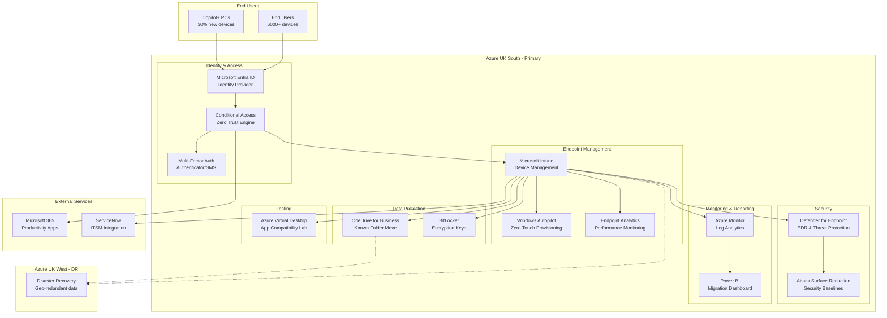

# Azure Technology Research: Windows 11 Deployment with Microsoft Intune

> **Template Status**: Experimental | **Version**: 1.0.1 | **Command**: `/arckit.azure-research`

## Document Control

| Field | Value |
|-------|-------|
| **Document ID** | ARC-001-AZRS-v1.0 |
| **Document Type** | Azure Technology Research |
| **Project** | Windows 11 Deployment with Microsoft Intune (Project 001) |
| **Classification** | OFFICIAL |
| **Status** | DRAFT |
| **Version** | 1.0 |
| **Created Date** | 2026-01-29 |
| **Last Modified** | 2026-01-29 |
| **Review Cycle** | Quarterly |
| **Next Review Date** | 2026-04-29 |
| **Owner** | Enterprise Architecture Team |
| **Reviewed By** | PENDING |
| **Approved By** | PENDING |
| **Distribution** | Project Team, IT Operations, Security Team, Steering Committee |

## Revision History

| Version | Date | Author | Changes | Approved By | Approval Date |
|---------|------|--------|---------|-------------|---------------|
| 1.0 | 2026-01-29 | ArcKit AI | Initial creation from `/arckit.azure-research` command | PENDING | PENDING |

---

## Executive Summary

### Research Scope

This document presents Azure-specific technology research findings for the Windows 11 Deployment with Microsoft Intune project. It provides Azure service recommendations, architecture patterns, and implementation guidance based on official Microsoft documentation.

**Requirements Analyzed**: 20 functional, 19 non-functional, 3 integration, 8 data requirements (58 total)

**Azure Services Evaluated**: 12 Azure services across 6 categories

**Research Sources**: Microsoft Learn, Azure Architecture Center, Azure Well-Architected Framework, Microsoft Documentation (via web fetch)

### Key Recommendations

| Requirement Category | Recommended Azure Service | Tier | Monthly Estimate |
|---------------------|---------------------------|------|------------------|
| Endpoint Management | Microsoft Intune | Plan 1 (M365 E3/E5) | Included |
| Identity & Access | Microsoft Entra ID P1/P2 | P2 (with M365 E5) | Included |
| Device Provisioning | Windows Autopilot | Included with Intune | £0 |
| Threat Protection | Microsoft Defender for Endpoint | Plan 2 (M365 E5) | Included |
| Monitoring & Analytics | Endpoint Analytics | Included with Intune | £0 |
| App Testing | Azure Virtual Desktop | Pay-as-you-go | £2,500-5,000 |

### Architecture Pattern

**Recommended Pattern**: Cloud-Native Endpoint Management with Zero Trust Security

**Reference Architecture**: Microsoft Modern Desktop Management

### UK Government Suitability

| Criteria | Status | Notes |
|----------|--------|-------|
| **UK Region Availability** | ✅ UK South, UK West | Primary: UK South |
| **G-Cloud Listing** | ✅ G-Cloud 14 | Framework: RM1557.14 |
| **Data Classification** | ✅ OFFICIAL / OFFICIAL-SENSITIVE | Standard Azure with controls |
| **NCSC Cloud Security Principles** | ✅ 14/14 principles met | Full attestation available |

---

## Azure Services Analysis

### Category 1: Endpoint Management

**Requirements Addressed**: BR-001, BR-002, FR-001 through FR-018, NFR-M-001

**Why This Category**: Core requirement for migrating 6,000+ devices from Configuration Manager to cloud-native management.

---

#### Recommended: Microsoft Intune

**Service Overview**:
- **Full Name**: Microsoft Intune (formerly Microsoft Endpoint Manager)
- **Category**: Endpoint Management / Mobile Device Management (MDM)
- **Documentation**: https://learn.microsoft.com/en-us/mem/intune/

**Key Features**:
- **Mobile Device Management (MDM)**: Full device control for organization-owned devices with policy enforcement
- **Mobile Application Management (MAM)**: App-level security for BYOD without full device management
- **Windows Autopilot Integration**: Zero-touch device provisioning with Enrollment Status Page
- **Co-Management Support**: Gradual transition from Configuration Manager with workload sliders
- **Microsoft Copilot in Intune**: AI-powered policy analysis and troubleshooting
- **Remote Help**: Remote assistance capabilities for helpdesk support

**Pricing Tiers**:

| Tier | Monthly Cost | Features | Use Case |
|------|--------------|----------|----------|
| Plan 1 (M365 E3) | Included | Core MDM/MAM, device compliance, app deployment | Standard management |
| Plan 2 (Add-on) | ~£3/user | Advanced features, Tunnel for MAM | Enhanced security |
| Intune Suite | ~£8/user | Plan 2 + Endpoint Privilege Management, Remote Help Premium | Enterprise |

**Estimated Cost for This Project**:

| Resource | Configuration | Monthly Cost | Notes |
|----------|---------------|--------------|-------|
| Intune Plan 1 | 6,000 users (M365 E3/E5) | £0 (included) | Already licensed |
| Intune Suite (optional) | 500 IT/privileged users | £4,000 | Enhanced management |
| **Total** | | **£0-4,000** | Depends on suite adoption |

**Azure Well-Architected Assessment**:

| Pillar | Rating | Notes |
|--------|--------|-------|
| **Reliability** | ⭐⭐⭐⭐⭐ | 99.9% SLA, globally distributed, automatic failover |
| **Security** | ⭐⭐⭐⭐⭐ | Zero Trust native, Conditional Access, encryption |
| **Cost Optimization** | ⭐⭐⭐⭐⭐ | Included with M365 E3/E5, eliminates ConfigMgr costs |
| **Operational Excellence** | ⭐⭐⭐⭐⭐ | Endpoint Analytics, Copilot AI, comprehensive logging |
| **Performance Efficiency** | ⭐⭐⭐⭐☆ | Cloud-native scaling, occasional portal latency |

**Azure Security Benchmark Alignment**:

| Control | Status | Implementation |
|---------|--------|----------------|
| NS-1: Network Security | ✅ | Cloud-native, no on-prem infrastructure required |
| IM-1: Identity Management | ✅ | Microsoft Entra ID integration, managed identities |
| DP-1: Data Protection | ✅ | TLS 1.2+ communications, encrypted policies |
| LT-1: Logging and Threat Detection | ✅ | Comprehensive audit logs, Defender integration |

**Integration Capabilities**:
- **APIs**: Microsoft Graph API (REST), PowerShell modules
- **SDKs**: .NET, Python, JavaScript Graph SDK
- **Event-Driven**: Azure Event Grid for device events
- **Other Azure Services**: Microsoft Entra ID, Defender for Endpoint, Azure Monitor, Power BI

**UK Region Availability**:
- ✅ UK South (Primary data location)
- ✅ UK West (Disaster recovery)
- All Intune features available in UK regions

**Compliance Certifications**:
- ✅ ISO 27001, 27017, 27018
- ✅ SOC 1, 2, 3
- ✅ UK Cyber Essentials Plus
- ✅ UK G-Cloud 14
- ✅ GDPR compliant

---

### Category 2: Identity and Access Management

**Requirements Addressed**: FR-004, FR-010, NFR-SEC-001, NFR-SEC-004

**Why This Category**: Zero Trust security model requires robust identity management with Conditional Access for device compliance enforcement.

---

#### Recommended: Microsoft Entra ID (Azure AD)

**Service Overview**:
- **Full Name**: Microsoft Entra ID (formerly Azure Active Directory)
- **Category**: Identity / Access Management
- **Documentation**: https://learn.microsoft.com/en-us/entra/

**Key Features**:
- **Conditional Access**: Zero Trust policy engine aggregating signals for access decisions
- **Device Join**: Azure AD Join and Hybrid Azure AD Join support
- **Multi-Factor Authentication (MFA)**: Microsoft Authenticator, SMS, phone call options
- **Single Sign-On (SSO)**: Seamless access to Microsoft 365 and SaaS applications
- **Identity Protection**: Risk-based authentication and user risk detection

**Conditional Access Capabilities**:

| Signal Source | Use Case |
|---------------|----------|
| User/Group membership | Role-based access policies |
| IP location | Block/allow by geography or custom ranges |
| Device compliance | Require Intune-compliant device |
| Application | Protect specific cloud apps |
| Real-time risk | Block risky sign-ins (Entra ID Protection) |
| Defender for Cloud Apps | Session monitoring and control |

**Pricing Tiers**:

| Tier | Monthly Cost | Features | Use Case |
|------|--------------|----------|----------|
| Free | £0 | Basic identity, SSO to M365 | Not sufficient |
| P1 | ~£5/user | Conditional Access, self-service | Standard |
| P2 | ~£7.50/user | P1 + Identity Protection, PIM | Recommended |

**Estimated Cost for This Project**:

| Resource | Configuration | Monthly Cost | Notes |
|----------|---------------|--------------|-------|
| Entra ID P2 | 6,000 users (M365 E5) | £0 (included) | M365 E5 includes P2 |
| Entra ID P1 | 6,000 users (M365 E3) | £0 (included) | M365 E3 includes P1 |
| **Total** | | **£0** | Included with M365 |

**Azure Well-Architected Assessment**:

| Pillar | Rating | Notes |
|--------|--------|-------|
| **Reliability** | ⭐⭐⭐⭐⭐ | 99.99% SLA, globally distributed |
| **Security** | ⭐⭐⭐⭐⭐ | Zero Trust native, phishing-resistant MFA |
| **Cost Optimization** | ⭐⭐⭐⭐⭐ | Included with M365 E3/E5 |
| **Operational Excellence** | ⭐⭐⭐⭐⭐ | Comprehensive sign-in logs, Identity Governance |
| **Performance Efficiency** | ⭐⭐⭐⭐⭐ | Sub-second authentication, global presence |

**UK Region Availability**:
- ✅ UK South (Primary)
- ✅ UK West (DR)
- Data residency options for UK tenants

---

### Category 3: Device Provisioning

**Requirements Addressed**: FR-002, FR-019, NFR-P-001

**Why This Category**: Zero-touch deployment required for 6,000+ devices with <30 minute provisioning time.

---

#### Recommended: Windows Autopilot

**Service Overview**:
- **Full Name**: Windows Autopilot
- **Category**: Device Provisioning / Deployment
- **Documentation**: https://learn.microsoft.com/en-us/mem/autopilot/

**Key Features**:
- **Zero-Touch Deployment**: OEM pre-registration or IT-registered devices
- **User-Driven Mode**: Standard users authenticate and device configures automatically
- **Self-Deploying Mode**: Kiosk and shared devices without user authentication
- **White Glove (Pre-provisioning)**: IT pre-stages devices for VIP users
- **Enrollment Status Page**: Real-time progress during deployment
- **Reset and Repurposing**: Quick preparation for new users

**Deployment Modes**:

| Mode | Use Case | User Interaction |
|------|----------|------------------|
| User-driven | Standard employees | User authenticates |
| Self-deploying | Kiosk, shared devices | No user auth required |
| Pre-provisioned | Executive/VIP users | IT pre-stages |
| Reset | Device repurposing | Automated reset |

**Requirements**:

| Requirement | Status | Notes |
|-------------|--------|-------|
| Windows 11 Pro/Enterprise | ✅ | All editions supported |
| Microsoft Entra ID | ✅ | For device join |
| Microsoft Intune | ✅ | For MDM enrollment |
| Network connectivity | ✅ | Ports 80, 443, 123 (NTP) |
| Licensing | ✅ | M365 E3/E5 includes all requirements |

**Estimated Cost for This Project**:

| Resource | Configuration | Monthly Cost | Notes |
|----------|---------------|--------------|-------|
| Windows Autopilot | All devices | £0 | Included with Intune |
| **Total** | | **£0** | No additional cost |

**Azure Well-Architected Assessment**:

| Pillar | Rating | Notes |
|--------|--------|-------|
| **Reliability** | ⭐⭐⭐⭐⭐ | Cloud-based, no on-prem dependencies |
| **Security** | ⭐⭐⭐⭐⭐ | TPM attestation, secure enrollment |
| **Cost Optimization** | ⭐⭐⭐⭐⭐ | Eliminates imaging infrastructure |
| **Operational Excellence** | ⭐⭐⭐⭐⭐ | Fully automated, minimal IT intervention |
| **Performance Efficiency** | ⭐⭐⭐⭐☆ | <30 min deployment (network dependent) |

---

### Category 4: Threat Protection

**Requirements Addressed**: FR-011, NFR-SEC-003, NFR-SEC-006

**Why This Category**: Zero Trust security requires advanced endpoint threat protection with EDR capabilities.

---

#### Recommended: Microsoft Defender for Endpoint

**Service Overview**:
- **Full Name**: Microsoft Defender for Endpoint
- **Category**: Security / Endpoint Detection and Response (EDR)
- **Documentation**: https://learn.microsoft.com/en-us/defender-endpoint/

**Key Features**:
- **Endpoint Detection and Response (EDR)**: Advanced threat hunting and investigation
- **Attack Surface Reduction**: Network protection, web filtering, exploit guard
- **Next-Generation Protection**: AI-powered antivirus, cloud-delivered protection
- **Automated Investigation and Remediation**: Automatic threat response
- **Advanced Hunting**: KQL-based threat hunting with custom detections
- **Integration with Intune**: Device risk scores for Conditional Access

**Capabilities**:

| Capability | Description |
|------------|-------------|
| Real-time protection | On-access, on-write, on-execute scanning |
| Behavioral analysis | Ransomware and fileless attack detection |
| Cloud protection | Zero-day threat detection via cloud AI |
| Device isolation | Network cutoff for compromised devices |
| Threat analytics | Intel on emerging threats |

**Pricing Tiers**:

| Tier | Monthly Cost | Features | Use Case |
|------|--------------|----------|----------|
| Defender for Business | ~£2.50/user | Core protection for SMB | Not for enterprise |
| Plan 1 | ~£2.50/user | Core endpoint protection | Basic |
| Plan 2 | ~£4.50/user | P1 + EDR, advanced hunting | Recommended |

**Estimated Cost for This Project**:

| Resource | Configuration | Monthly Cost | Notes |
|----------|---------------|--------------|-------|
| Defender Plan 2 | 6,000 users (M365 E5) | £0 (included) | M365 E5 includes P2 |
| Defender Plan 2 | 6,000 users (M365 E3) | £27,000 | If not E5 |
| **Total** | | **£0-27,000** | Depends on M365 tier |

**Azure Well-Architected Assessment**:

| Pillar | Rating | Notes |
|--------|--------|-------|
| **Reliability** | ⭐⭐⭐⭐⭐ | Cloud-native, always-on protection |
| **Security** | ⭐⭐⭐⭐⭐ | Industry-leading EDR, MITRE ATT&CK coverage |
| **Cost Optimization** | ⭐⭐⭐⭐⭐ | Included with M365 E5 |
| **Operational Excellence** | ⭐⭐⭐⭐⭐ | Automated remediation, comprehensive APIs |
| **Performance Efficiency** | ⭐⭐⭐⭐⭐ | Cloud-powered, minimal device impact |

---

### Category 5: Monitoring and Analytics

**Requirements Addressed**: FR-016, NFR-P-001, NFR-P-002

**Why This Category**: Real-time migration dashboard and device performance monitoring required.

---

#### Recommended: Endpoint Analytics + Azure Monitor

**Service Overview**:
- **Full Name**: Endpoint Analytics (Intune) + Azure Monitor
- **Category**: Monitoring / Analytics
- **Documentation**: https://learn.microsoft.com/en-us/mem/analytics/

**Endpoint Analytics Features**:
- **Startup Performance**: Boot time analysis and optimization recommendations
- **Application Reliability**: App crash monitoring and trend analysis
- **Work from Anywhere**: Device readiness assessment for remote work
- **Proactive Remediations**: Automated script-based issue resolution
- **User Experience Score**: Aggregated productivity and device health metrics

**Azure Monitor Features**:
- **Log Analytics**: Centralized log collection with KQL queries
- **Metrics Explorer**: Real-time metrics visualization
- **Alerts**: Automated notifications for threshold breaches
- **Dashboards/Workbooks**: Custom visualization for migration tracking

**Estimated Cost for This Project**:

| Resource | Configuration | Monthly Cost | Notes |
|----------|---------------|--------------|-------|
| Endpoint Analytics | 6,000 devices | £0 | Included with Intune |
| Azure Monitor (basic) | Migration dashboard | £200-500 | Log ingestion costs |
| Power BI Pro | 10 dashboard viewers | £80 | Optional for reporting |
| **Total** | | **£280-580** | |

**Azure Well-Architected Assessment**:

| Pillar | Rating | Notes |
|--------|--------|-------|
| **Reliability** | ⭐⭐⭐⭐⭐ | Highly available, global infrastructure |
| **Security** | ⭐⭐⭐⭐⭐ | RBAC, encrypted data, audit logs |
| **Cost Optimization** | ⭐⭐⭐⭐☆ | Pay-per-use for Log Analytics |
| **Operational Excellence** | ⭐⭐⭐⭐⭐ | AI-powered insights, automation |
| **Performance Efficiency** | ⭐⭐⭐⭐⭐ | Near real-time data processing |

---

### Category 6: Application Testing

**Requirements Addressed**: FR-013, FR-020

**Why This Category**: Application compatibility testing environment required for top 100 business apps and ARM64 Copilot+ PC validation.

---

#### Recommended: Azure Virtual Desktop

**Service Overview**:
- **Full Name**: Azure Virtual Desktop (AVD)
- **Category**: Desktop Virtualization / Testing
- **Documentation**: https://learn.microsoft.com/en-us/azure/virtual-desktop/

**Key Features**:
- **Windows 11 Multi-session**: Multiple users on single VM (unique to AVD)
- **Full Desktop Virtualization**: Complete Windows 11 testing environment
- **RemoteApp**: Individual application delivery for targeted testing
- **Custom Images**: Bring your own image for production testing
- **Autoscaling**: Automatically adjust capacity based on demand
- **Azure Insights**: Built-in diagnostics and monitoring

**Use Cases for This Project**:
- Application compatibility testing before migration waves
- ARM64 application validation for Copilot+ PCs
- User acceptance testing environment
- Helpdesk training environment

**Estimated Cost for This Project**:

| Resource | Configuration | Monthly Cost | Notes |
|----------|---------------|--------------|-------|
| AVD Host Pool | 10 x D4s v5 VMs | £2,000 | Testing workloads |
| Windows Licenses | M365 E3/E5 | £0 | Already licensed |
| Storage | 500GB Premium SSD | £80 | User profiles |
| Networking | Bandwidth | £200 | Data transfer |
| **Total** | | **£2,280** | 3-month testing window |

**Azure Well-Architected Assessment**:

| Pillar | Rating | Notes |
|--------|--------|-------|
| **Reliability** | ⭐⭐⭐⭐⭐ | Azure SLA, multi-zone deployment |
| **Security** | ⭐⭐⭐⭐⭐ | Entra ID auth, Conditional Access |
| **Cost Optimization** | ⭐⭐⭐⭐☆ | Pay-as-you-go, autoscale available |
| **Operational Excellence** | ⭐⭐⭐⭐⭐ | Azure Monitor integration |
| **Performance Efficiency** | ⭐⭐⭐⭐⭐ | GPU options, NVMe storage |

---

## Architecture Pattern

### Recommended Azure Reference Architecture

**Pattern Name**: Cloud-Native Endpoint Management with Zero Trust Security

**Azure Architecture Center Reference**: https://learn.microsoft.com/en-us/azure/architecture/guide/security/conditional-access-zero-trust

**Pattern Description**:

This architecture implements a cloud-native endpoint management solution using Microsoft Intune as the primary device management platform, eliminating the need for on-premises infrastructure like Configuration Manager. The Zero Trust security model is enforced through Microsoft Entra ID Conditional Access, which evaluates device compliance, user risk, and application sensitivity before granting access to corporate resources.

The architecture leverages Windows Autopilot for zero-touch device provisioning, enabling IT staff to ship devices directly to end users without pre-imaging. Microsoft Defender for Endpoint provides advanced threat protection with EDR capabilities, with device risk scores fed back to Conditional Access for dynamic access decisions.

All data remains within UK Azure regions (UK South primary, UK West DR) ensuring compliance with UK Government data residency requirements and G-Cloud procurement framework alignment.

### Architecture Diagram



### Component Mapping

| Component | Azure Service | Purpose | Tier |
|-----------|---------------|---------|------|
| Identity Provider | Microsoft Entra ID | Authentication, SSO | P2 (M365 E5) |
| Zero Trust Engine | Conditional Access | Access policy enforcement | P1+ |
| Device Management | Microsoft Intune | MDM/MAM, compliance | Plan 1 (M365 E3+) |
| Provisioning | Windows Autopilot | Zero-touch deployment | Included |
| Threat Protection | Defender for Endpoint | EDR, antivirus | Plan 2 (M365 E5) |
| Data Backup | OneDrive for Business | Known Folder Move | M365 E3/E5 |
| Encryption | BitLocker (Azure AD escrowed) | Full disk encryption | Windows Pro/Enterprise |
| Performance Monitoring | Endpoint Analytics | Device health insights | Included with Intune |
| Logging | Azure Monitor | Centralized logs | Pay-per-GB |
| Reporting | Power BI | Migration dashboard | Pro (£8/user) |
| App Testing | Azure Virtual Desktop | Compatibility testing | Pay-as-you-go |

---

## Security & Compliance

### Azure Security Benchmark Mapping

| ASB Control Domain | Controls Implemented | Azure Services |
|-------------------|---------------------|----------------|
| **Network Security (NS)** | NS-1, NS-2, NS-3 | Cloud-native (no VNet required), Defender network protection |
| **Identity Management (IM)** | IM-1, IM-2, IM-3 | Entra ID, MFA, Conditional Access, managed identities |
| **Privileged Access (PA)** | PA-1, PA-2, PA-3 | Entra ID PIM, JIT admin access, PAW devices |
| **Data Protection (DP)** | DP-1, DP-2, DP-3 | BitLocker AES-256, TLS 1.2+, OneDrive encryption |
| **Asset Management (AM)** | AM-1, AM-2, AM-3 | Intune device inventory, compliance policies |
| **Logging & Threat Detection (LT)** | LT-1, LT-2, LT-3 | Azure Monitor, Defender for Endpoint, Sentinel (optional) |
| **Incident Response (IR)** | IR-1, IR-2, IR-3 | Defender automated remediation, device isolation |
| **Posture & Vulnerability (PV)** | PV-1, PV-2, PV-3 | Defender Vulnerability Management, security baselines |
| **Endpoint Security (ES)** | ES-1, ES-2 | Defender for Endpoint, ASR rules |
| **Backup & Recovery (BR)** | BR-1, BR-2, BR-3 | OneDrive KFM, BitLocker recovery keys |
| **DevOps Security (DS)** | DS-1, DS-2, DS-3 | Intune policy-as-code (Graph API), GitHub integration |
| **Governance & Strategy (GS)** | GS-1, GS-2, GS-3 | Intune compliance policies, Azure Policy |

### UK Government Security Alignment

| Framework | Alignment | Notes |
|-----------|-----------|-------|
| **NCSC Cloud Security Principles** | ✅ 14/14 | Full attestation available via Microsoft Trust Center |
| **Cyber Essentials Plus** | ✅ Certified | Azure controls map to all CE+ requirements |
| **UK GDPR** | ✅ Compliant | UK data residency, DPA signed with Microsoft |
| **OFFICIAL** | ✅ Suitable | Standard Azure public cloud services |
| **OFFICIAL-SENSITIVE** | ✅ Suitable | Additional controls via Conditional Access, DLP |
| **SECRET** | ⚠️ Not in scope | Would require Azure Government UK (separate tenant) |

### Microsoft Defender for Cloud

**Recommendations**:
- Enable Defender for Cloud on Azure subscription
- Enable Defender plans for: Key Vault (BitLocker keys), Virtual Machines (AVD testing)
- Configure Security Policy aligned to Azure Security Benchmark
- Enable Continuous Export to Log Analytics for SIEM integration

---

## Implementation Guidance

### Infrastructure as Code

**Recommended Approach**: Microsoft Graph PowerShell / Bicep for Azure resources

#### Intune Configuration via Graph PowerShell

```powershell
# Connect to Microsoft Graph with required permissions
Connect-MgGraph -Scopes "DeviceManagementConfiguration.ReadWrite.All", `
    "DeviceManagementManagedDevices.ReadWrite.All", `
    "DeviceManagementServiceConfig.ReadWrite.All"

# Create Windows 11 device compliance policy
$compliancePolicy = @{
    "@odata.type" = "#microsoft.graph.windows10CompliancePolicy"
    displayName = "Windows 11 Compliance Policy - Production"
    description = "Compliance policy for Windows 11 devices"
    bitLockerEnabled = $true
    secureBootEnabled = $true
    codeIntegrityEnabled = $true
    defenderEnabled = $true
    defenderVersion = "1.0.0.0"
    osMinimumVersion = "10.0.22000"
    passwordRequired = $true
    passwordMinimumLength = 12
}

New-MgDeviceManagementDeviceCompliancePolicy -BodyParameter $compliancePolicy
```

#### Bicep Example for Azure Virtual Desktop Testing Environment

```bicep
// main.bicep - AVD for Application Testing
targetScope = 'subscription'

param location string = 'uksouth'
param environment string = 'test'
param projectName string = 'win11-migration'

// Resource Group
resource rg 'Microsoft.Resources/resourceGroups@2023-07-01' = {
  name: 'rg-${projectName}-avd-${environment}'
  location: location
  tags: {
    Project: 'Windows 11 Migration'
    Environment: environment
    Owner: 'IT Operations'
  }
}

// Deploy AVD Host Pool
module avd 'modules/avd.bicep' = {
  name: 'avd-deployment'
  scope: rg
  params: {
    location: location
    hostPoolName: 'hp-${projectName}-${environment}'
    hostPoolType: 'Pooled'
    maxSessionLimit: 10
    loadBalancerType: 'BreadthFirst'
  }
}

// Deploy Log Analytics for monitoring
module monitoring 'modules/monitoring.bicep' = {
  name: 'monitoring-deployment'
  scope: rg
  params: {
    location: location
    workspaceName: 'law-${projectName}-${environment}'
    retentionInDays: 90
  }
}
```

### Azure DevOps Pipeline for Intune Policy Deployment

```yaml
# azure-pipelines.yml
trigger:
  branches:
    include:
      - main
  paths:
    include:
      - 'intune-policies/**'

pool:
  vmImage: 'windows-latest'

variables:
  - group: 'Intune-ServicePrincipal'

stages:
  - stage: Validate
    displayName: 'Validate Intune Policies'
    jobs:
      - job: ValidatePolicies
        steps:
          - task: PowerShell@2
            displayName: 'Validate JSON Schema'
            inputs:
              targetType: 'inline'
              script: |
                $policies = Get-ChildItem -Path "intune-policies" -Filter "*.json"
                foreach ($policy in $policies) {
                    $content = Get-Content $policy.FullName | ConvertFrom-Json
                    Write-Host "Validated: $($policy.Name)"
                }

  - stage: Deploy
    displayName: 'Deploy to Intune'
    dependsOn: Validate
    condition: and(succeeded(), eq(variables['Build.SourceBranch'], 'refs/heads/main'))
    jobs:
      - deployment: DeployPolicies
        environment: 'intune-production'
        strategy:
          runOnce:
            deploy:
              steps:
                - task: PowerShell@2
                  displayName: 'Deploy Compliance Policies'
                  inputs:
                    targetType: 'filePath'
                    filePath: 'scripts/Deploy-IntunePolicies.ps1'
                  env:
                    AZURE_CLIENT_ID: $(ClientId)
                    AZURE_CLIENT_SECRET: $(ClientSecret)
                    AZURE_TENANT_ID: $(TenantId)
```

### Code Samples

**Official Microsoft Samples**:

| Sample | Description | GitHub Link |
|--------|-------------|-------------|
| Intune PowerShell Samples | Graph API samples for Intune management | https://github.com/microsoftgraph/powershell-intune-samples |
| Autopilot Companion | Tools for Autopilot device registration | https://github.com/microsoft/Autopilot-Companion |
| Windows 365 Samples | Cloud PC provisioning samples | https://github.com/microsoft/Windows365-PSScripts |

---

## Cost Estimate

### Monthly Cost Summary

| Category | Azure Service | Configuration | Monthly Cost |
|----------|---------------|---------------|--------------|
| Endpoint Management | Microsoft Intune | 6,000 users (M365 E3/E5) | £0 (included) |
| Identity | Microsoft Entra ID P2 | 6,000 users (M365 E5) | £0 (included) |
| Provisioning | Windows Autopilot | All devices | £0 (included) |
| Threat Protection | Defender for Endpoint P2 | 6,000 users (M365 E5) | £0 (included) |
| Analytics | Endpoint Analytics | 6,000 devices | £0 (included) |
| Monitoring | Azure Monitor | Log Analytics (50GB/month) | £300 |
| Reporting | Power BI Pro | 10 users | £80 |
| App Testing | Azure Virtual Desktop | 10 VMs (3 months) | £2,280 |
| **Total (M365 E5)** | | | **£2,660** |
| **Total (M365 E3 + add-ons)** | | | **£29,660** |

### 3-Year TCO Comparison

| Scenario | Year 1 | Year 2 | Year 3 | 3-Year Total |
|----------|--------|--------|--------|--------------|
| **Current (ConfigMgr)** | £[X] | £[X] | £[X] | £[3X] |
| **Cloud-Native (Intune)** | £32,000 | £4,600 | £4,600 | £41,200 |
| **Savings** | | | | **£[X] - £41,200** |

*Note: Year 1 includes AVD testing costs. Years 2-3 are monitoring/reporting only.*

### Cost Optimization Recommendations

1. **Use M365 E5**: Includes Intune, Entra ID P2, and Defender P2 - no add-on costs
2. **Right-size AVD**: Use autoscaling, shut down test VMs when not in use
3. **Log Analytics retention**: Set 90-day retention (vs 730 default) to reduce storage
4. **Reserved capacity**: Consider 1-year reserved VM pricing for AVD if extended testing
5. **Power BI**: Use Power BI Free with Intune built-in reports where possible

**Estimated Savings with Optimizations**: £500-1,000/month

---

## UK Government Considerations

### G-Cloud Procurement

**Azure on G-Cloud 14**:
- **Framework**: RM1557.14
- **Supplier**: Microsoft Limited
- **Service IDs**: Search "Microsoft Azure" on Digital Marketplace

**Procurement Steps**:
1. Search Digital Marketplace for "Microsoft Azure" or "Microsoft 365"
2. Review service description and pricing document
3. Direct award (if requirements clear) or further competition
4. Use call-off contract under G-Cloud 14 terms
5. Reference existing Enterprise Agreement if applicable

### Data Residency

| Data Type | Storage Location | Replication | Notes |
|-----------|------------------|-------------|-------|
| Intune device data | UK South | UK West (GRS) | Customer data at rest |
| Entra ID directory | UK or EU | Geo-redundant | Based on tenant location |
| Defender telemetry | UK/EU | As configured | Security data |
| OneDrive files | UK | UK (GRS) | Personal data protection |
| Log Analytics | UK South | UK West | Audit logs |

### NCSC Cloud Security Principles Alignment

| Principle | Azure Compliance | Evidence |
|-----------|------------------|----------|
| 1. Data in transit protection | ✅ | TLS 1.2+ enforced |
| 2. Asset protection and resilience | ✅ | UK datacenters, ISO 27001 |
| 3. Separation between customers | ✅ | Logical isolation, dedicated tenants |
| 4. Governance framework | ✅ | Microsoft Trust Center attestations |
| 5. Operational security | ✅ | SOC 2 Type II certified |
| 6. Personnel security | ✅ | Background checks, training |
| 7. Secure development | ✅ | SDL, secure coding practices |
| 8. Supply chain security | ✅ | Supplier assessments |
| 9. Secure user management | ✅ | Entra ID, MFA, Conditional Access |
| 10. Identity and authentication | ✅ | FIDO2, passwordless options |
| 11. External interface protection | ✅ | DDoS protection, WAF |
| 12. Secure service administration | ✅ | PIM, JIT access |
| 13. Audit information | ✅ | Comprehensive audit logs |
| 14. Secure use of the service | ✅ | Security documentation, baselines |

---

## References

### Microsoft Learn Documentation

| Topic | Link |
|-------|------|
| Microsoft Intune Overview | https://learn.microsoft.com/en-us/mem/intune/fundamentals/what-is-intune |
| Windows Autopilot | https://learn.microsoft.com/en-us/mem/autopilot/windows-autopilot |
| Conditional Access | https://learn.microsoft.com/en-us/entra/identity/conditional-access/overview |
| Defender for Endpoint | https://learn.microsoft.com/en-us/defender-endpoint/microsoft-defender-endpoint |
| Endpoint Analytics | https://learn.microsoft.com/en-us/mem/analytics/overview |
| Azure Virtual Desktop | https://learn.microsoft.com/en-us/azure/virtual-desktop/overview |
| Azure Well-Architected Framework | https://learn.microsoft.com/azure/well-architected/ |
| Azure Security Benchmark | https://learn.microsoft.com/security/benchmark/azure/ |

### Azure Architecture Center References

| Reference Architecture | Link |
|------------------------|------|
| Zero Trust with Conditional Access | https://learn.microsoft.com/en-us/azure/architecture/guide/security/conditional-access-zero-trust |
| Modern Desktop Management | https://learn.microsoft.com/en-us/mem/intune/fundamentals/deployment-guide-intune-setup |
| Endpoint Management Design | https://learn.microsoft.com/en-us/mem/intune/fundamentals/intune-planning-guide |

### Code Samples

| Sample | Repository |
|--------|------------|
| Intune PowerShell Samples | https://github.com/microsoftgraph/powershell-intune-samples |
| Graph API SDK | https://github.com/microsoftgraph/msgraph-sdk-powershell |
| Autopilot Tools | https://github.com/microsoft/Autopilot-Companion |

---

## Next Steps

### Immediate Actions

1. **Review Findings**: Share with architecture team and stakeholders
2. **Validate Licensing**: Confirm M365 E3/E5 licensing provides required features
3. **Security Review**: Engage security team for Azure Security Benchmark review
4. **POC Planning**: Identify 50-100 device pilot scope and success criteria

### Integration with Other ArcKit Commands

- Run `/arckit.diagram` to create detailed Azure architecture diagrams
- Run `/arckit.secure` to validate against UK Secure by Design
- Run `/arckit.devops` to plan Azure DevOps/GitHub Actions pipelines
- Run `/arckit.finops` to create Azure cost management strategy

---

**Generated by**: ArcKit `/arckit.azure-research` command
**Generated on**: 2026-01-29
**ArcKit Version**: 1.0.1
**Project**: Windows 11 Deployment with Microsoft Intune (Project 001)
**Model**: Claude Opus 4.5
**Sources**: Microsoft Learn Documentation (via WebFetch)
