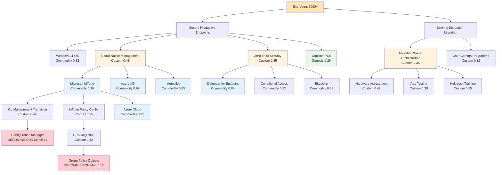

# Wardley Map: Windows 11 Migration - Full Landscape Gap Analysis

> **Template Status**: Experimental | **Version**: 2.3.0 | **Command**: `/arckit.wardley`

## Document Control

| Field | Value |
|-------|-------|
| **Document ID** | ARC-001-WARD-003-v1.0 |
| **Document Type** | Wardley Map |
| **Project** | Windows 11 Deployment with Microsoft InTune (Project 001) |
| **Classification** | OFFICIAL-SENSITIVE |
| **Status** | DRAFT |
| **Version** | 1.0 |
| **Created Date** | 2026-02-09 |
| **Last Modified** | 2026-02-09 |
| **Review Cycle** | Quarterly |
| **Next Review Date** | 2026-03-11 |
| **Owner** | Enterprise Architecture Team |
| **Reviewed By** | [PENDING] |
| **Approved By** | [PENDING] |
| **Distribution** | Project Team, IT Operations, Security Team, Steering Committee |

## Revision History

| Version | Date | Author | Changes | Approved By | Approval Date |
|---------|------|--------|---------|-------------|---------------|
| 1.0 | 2026-02-09 | ArcKit AI | Initial creation - Full landscape gap analysis map from `/arckit:wardley` command | [PENDING] | [PENDING] |

---

## Strategic Context

This is the third Wardley Map for the Windows 11 Migration project, complementing:
- **WARD-001**: InTune Policy Management (focused on policy configuration landscape)
- **WARD-002**: Procurement Strategy (focused on build vs buy for vendor procurement)

This map provides a **holistic full-landscape gap analysis** covering the complete migration journey - from current state (Windows 10 + ConfigMgr) to future state (Windows 11 + InTune cloud-native), mapping all major components including hardware, security, identity, user experience, and operational readiness.

**Strategic Questions**:
1. Where are the biggest gaps between current state and future state?
2. Which components carry the most inertia and risk?
3. What is the critical path to achieving cloud-native management?
4. Where must we invest effort (Custom/build) vs. consume services (Commodity/buy)?

**Source Documents Used**:
- ARC-000-PRIN-v1.0 (Architecture Principles - 18 principles)
- ARC-001-REQ-v1.0 (Requirements - 58 requirements: 8 BR, 20 FR, 19 NFR, 8 DR, 3 INT)
- ARC-001-STKE-v1.0 (Stakeholder Analysis - 11 internal, 5 external stakeholders)
- ARC-001-RSCH-v1.0 (Technology Research - 18 solutions evaluated across 6 categories)
- ARC-001-DATA-v1.0 (Data Model - 15 entities, 187 attributes)
- ARC-001-WARD-001-v1.0 (Previous map: InTune Policy Management)
- ARC-001-WARD-002-v1.0 (Previous map: Procurement Strategy)

---

## Map Visualization

**View this map**: Paste the map code below into [https://create.wardleymaps.ai](https://create.wardleymaps.ai)

```wardley
title Windows 11 Migration - Full Landscape Gap Analysis (2026)

anchor End Users (6000+) [0.97, 0.63]

annotation 1 [0.85, 0.22] CURRENT STATE: Legacy components with high inertia
annotation 2 [0.55, 0.88] FUTURE STATE: Cloud-native commodity services
annotation 3 [0.42, 0.40] BUILD ZONE: Custom migration work required
annotation 4 [0.18, 0.90] DECOMMISSION: Legacy infrastructure to retire
note ~6000 devices, 18-24 month timeline, Win10 EOL Oct 2025 [0.92, 0.10]

component End Users (6000+) [0.97, 0.65]
component Secure Productive Endpoints [0.93, 0.55]
component Minimal Disruption Migration [0.90, 0.30]

component Windows 11 OS [0.85, 0.82]
component Zero Trust Security [0.83, 0.45]
component Cloud-Native Management [0.80, 0.48]
component Copilot+ PC AI Features [0.78, 0.25]

component Microsoft InTune [0.68, 0.90]
component Azure Active Directory [0.66, 0.92]
component Windows Autopilot [0.64, 0.85]
component Defender for Endpoint [0.62, 0.88]
component Conditional Access [0.60, 0.82]
component OneDrive KFM [0.58, 0.90]
component Windows Update for Business [0.56, 0.85]

component Migration Wave Orchestration [0.72, 0.35]
component Hardware Compatibility Assessment [0.70, 0.42]
component Application Compatibility Testing [0.68, 0.38]
component User Communication Programme [0.66, 0.32]
component Helpdesk Training (18hrs) [0.64, 0.35]

component InTune Policy Configuration [0.52, 0.55]
component GPO to InTune Migration [0.50, 0.42]
component App Packaging (.intunewin) [0.48, 0.48]
component Security Baseline Deployment [0.46, 0.65]
component Co-Management Workload Transition [0.44, 0.45]
component Migration Dashboard (Power BI) [0.42, 0.52]

component Configuration Manager [0.30, 0.52]
component Group Policy Objects [0.28, 0.48]
component On-Premises Active Directory [0.26, 0.58]
component SCCM Distribution Points [0.24, 0.50]
component Windows 10 Devices [0.22, 0.72]
component Legacy Hardware (<TPM 2.0) [0.20, 0.62]

component Azure Cloud Platform [0.15, 0.95]
component Microsoft 365 E3/E5 Licensing [0.12, 0.90]
component BitLocker Encryption [0.18, 0.88]
component TPM 2.0 Hardware [0.16, 0.85]

End Users (6000+) -> Secure Productive Endpoints
End Users (6000+) -> Minimal Disruption Migration
Secure Productive Endpoints -> Windows 11 OS
Secure Productive Endpoints -> Zero Trust Security
Secure Productive Endpoints -> Cloud-Native Management
Secure Productive Endpoints -> Copilot+ PC AI Features

Cloud-Native Management -> Microsoft InTune
Cloud-Native Management -> Azure Active Directory
Cloud-Native Management -> Windows Autopilot
Cloud-Native Management -> OneDrive KFM

Zero Trust Security -> Defender for Endpoint
Zero Trust Security -> Conditional Access
Zero Trust Security -> BitLocker Encryption
Zero Trust Security -> TPM 2.0 Hardware

Minimal Disruption Migration -> Migration Wave Orchestration
Minimal Disruption Migration -> User Communication Programme

Migration Wave Orchestration -> Hardware Compatibility Assessment
Migration Wave Orchestration -> Application Compatibility Testing
Migration Wave Orchestration -> Helpdesk Training (18hrs)
Migration Wave Orchestration -> Migration Dashboard (Power BI)

Microsoft InTune -> InTune Policy Configuration
Microsoft InTune -> Co-Management Workload Transition
Microsoft InTune -> Windows Update for Business
Microsoft InTune -> Azure Cloud Platform

Windows Autopilot -> Azure Active Directory
Windows Autopilot -> InTune Policy Configuration

InTune Policy Configuration -> GPO to InTune Migration
InTune Policy Configuration -> App Packaging (.intunewin)
InTune Policy Configuration -> Security Baseline Deployment

Co-Management Workload Transition -> Configuration Manager
GPO to InTune Migration -> Group Policy Objects

Conditional Access -> Azure Active Directory
Conditional Access -> InTune Policy Configuration
Defender for Endpoint -> Azure Cloud Platform

OneDrive KFM -> Azure Cloud Platform
OneDrive KFM -> Microsoft 365 E3/E5 Licensing

Configuration Manager -> SCCM Distribution Points
Configuration Manager -> On-Premises Active Directory
Group Policy Objects -> On-Premises Active Directory

Windows 10 Devices -> Legacy Hardware (<TPM 2.0)
Azure Cloud Platform -> Microsoft 365 E3/E5 Licensing

pipeline Co-Management Workload Transition [0.44, 0.45, 0.15]
pipeline Copilot+ PC AI Features [0.78, 0.25, 0.60]
pipeline Windows 10 Devices [0.22, 0.72, 0.15]

evolve Configuration Manager 0.15 label Decommission by Month 18
evolve Group Policy Objects 0.15 label Migrate all to InTune
evolve On-Premises Active Directory 0.25 label Hybrid then retire
evolve Copilot+ PC AI Features 0.60 label 30% of refreshed devices
evolve Co-Management Workload Transition 0.15 label Fully cloud by Month 18
evolve InTune Policy Configuration 0.72 label Maturing to product
evolve Migration Dashboard (Power BI) 0.68 label Reusable reporting

style wardley
```

---

## Evolution Stages Reference

| Stage | Maturity | Characteristics | Strategic Actions |
|-------|----------|-----------------|-------------------|
| **Genesis** (0.00 - 0.25) | Novel, uncertain, rapidly changing | Unique and rare, poorly understood, rapid change, high uncertainty | R&D focus, accept failure, explore and experiment, build in-house if strategic |
| **Custom** (0.25 - 0.50) | Emerging, growing understanding | Bespoke solutions, competitive advantage, requires significant skill | Invest in differentiation, build custom, patent/protect IP |
| **Product** (0.50 - 0.75) | Maturing, good/rental services | Products with feature differentiation, slower evolution, defined practices | Buy products, compare features, standardize |
| **Commodity** (0.75 - 1.00) | Industrialized, utility | Standardized, volume operations, cost of deviation high | Use commodity/utility, outsource, cost efficiency |

---

## Component Inventory

### User Needs (Top of Map - High Visibility)

| Component | Visibility | Evolution | Stage | Description | Strategic Notes |
|-----------|-----------|-----------|-------|-------------|-----------------|
| End Users (6000+) | 0.97 | 0.65 | Product | ~6000 employees across multiple personas | 6 personas: Executive, Knowledge Worker, Developer, Frontline, Remote, IT Admin |
| Secure Productive Endpoints | 0.93 | 0.55 | Product | Primary user need: secure, productive Windows devices | Maps to BR-001, BR-002, BR-006 |
| Minimal Disruption Migration | 0.90 | 0.30 | Custom | User need for seamless transition | Maps to BR-007, BR-008; SD-3 (IT Ops Director risk concern) |
| Windows 11 OS | 0.85 | 0.82 | Commodity | Target operating system | Commodity - well-understood, standardised product |
| Zero Trust Security | 0.83 | 0.45 | Custom | Security posture requirement | Maps to Principle 2 (NON-NEGOTIABLE); custom implementation per org |
| Cloud-Native Management | 0.80 | 0.48 | Custom | Transition from ConfigMgr to InTune | Maps to BR-002, Principle 1; custom migration effort required |
| Copilot+ PC AI Features | 0.78 | 0.25 | Genesis/Custom | AI-ready hardware with NPU 40+ TOPS | Maps to BR-004 (SHOULD_HAVE); pilot 50-100 first |

### Cloud Services - Future State (Mid-High Visibility)

| Component | Visibility | Evolution | Stage | Description | Strategic Notes |
|-----------|-----------|-----------|-------|-------------|-----------------|
| Microsoft InTune | 0.68 | 0.90 | Commodity | Cloud-native UEM platform | Already licensed (M365 E3/E5); £0 additional cost; 4.5/5 G2 rating |
| Azure Active Directory | 0.66 | 0.92 | Commodity | Cloud identity provider | Commodity; Premium P1/P2 required for Conditional Access |
| Windows Autopilot | 0.64 | 0.85 | Commodity | Zero-touch device provisioning | Maps to FR-002, Principle 7 |
| Defender for Endpoint | 0.62 | 0.88 | Commodity | Advanced threat protection + EDR | Maps to FR-011, Principle 2; included in M365 E5 |
| Conditional Access | 0.60 | 0.82 | Commodity | Risk-based access control | Maps to FR-010, Principle 2 |
| OneDrive KFM | 0.58 | 0.90 | Commodity | Cloud folder sync for data protection | Maps to FR-003, Principle 12; max 5000 devices/day deployment |
| Windows Update for Business | 0.56 | 0.85 | Commodity | Cloud-managed update deployment | Maps to FR-012, Principle 9 |

### Migration Work - Custom (Mid Visibility)

| Component | Visibility | Evolution | Stage | Description | Strategic Notes |
|-----------|-----------|-----------|-------|-------------|-----------------|
| Migration Wave Orchestration | 0.72 | 0.35 | Custom | Phased rollout management | Maps to BR-008; Pilot -> Early Adopters -> Production waves |
| Hardware Compatibility Assessment | 0.70 | 0.42 | Custom | TPM 2.0, CPU, RAM assessment of 6000 devices | Maps to BR-005; ~30% require replacement |
| Application Compatibility Testing | 0.68 | 0.38 | Custom | Testing top 100 business-critical apps | Maps to FR-013; £85K budget for manual validation |
| User Communication Programme | 0.66 | 0.32 | Custom | Change management (T-90 to T+1 day) | Maps to FR-014, BR-007; departmental champions |
| Helpdesk Training (18hrs) | 0.64 | 0.35 | Custom | 18-hour training curriculum for helpdesk | Maps to FR-015; must complete before pilot phase |

### Policy & Configuration Work (Mid-Low Visibility)

| Component | Visibility | Evolution | Stage | Description | Strategic Notes |
|-----------|-----------|-----------|-------|-------------|-----------------|
| InTune Policy Configuration | 0.52 | 0.55 | Product | Compliance, configuration, and update policies | Maps to FR-001, FR-009; org-specific content is Custom |
| GPO to InTune Migration | 0.50 | 0.42 | Custom | Converting GPOs to InTune profiles | Maps to FR-007; Group Policy Analytics tool assists |
| App Packaging (.intunewin) | 0.48 | 0.48 | Custom | Repackaging top 100 apps for InTune delivery | Maps to FR-008; Win32 app packaging tool |
| Security Baseline Deployment | 0.46 | 0.65 | Product | Microsoft Security Baselines for W11 | Maps to FR-009; templates from Microsoft are Product |
| Co-Management Workload Transition | 0.44 | 0.45 | Custom | 6-phase workload shift (Month 3-18) | Maps to FR-006; CRITICAL PATH to decommissioning ConfigMgr |
| Migration Dashboard (Power BI) | 0.42 | 0.52 | Product | Real-time migration tracking dashboard | Maps to FR-016; connects to InTune API + Azure AD |

### Legacy Components - Current State (Low Visibility, High Inertia)

| Component | Visibility | Evolution | Stage | Description | Strategic Notes |
|-----------|-----------|-----------|-------|-------------|-----------------|
| Configuration Manager | 0.30 | 0.52 | Product | On-premises device management (SCCM) | HIGH INERTIA; 18-month decommission timeline; maps to BR-003 |
| Group Policy Objects | 0.28 | 0.48 | Custom | Current device policy mechanism | Must migrate all to InTune; analytics tool assists |
| On-Premises Active Directory | 0.26 | 0.58 | Product | Current identity store | Hybrid join transitional; pure Azure AD target |
| SCCM Distribution Points | 0.24 | 0.50 | Product | On-premises content distribution servers | Decommission with ConfigMgr; cost savings driver |
| Windows 10 Devices | 0.22 | 0.72 | Product | Current OS on ~6000 devices | EOL October 2025; mandatory migration |
| Legacy Hardware (<TPM 2.0) | 0.20 | 0.62 | Product | ~30% of devices incompatible with W11 | Must replace; budget allocation required |

### Infrastructure (Low Visibility)

| Component | Visibility | Evolution | Stage | Description | Strategic Notes |
|-----------|-----------|-----------|-------|-------------|-----------------|
| BitLocker Encryption | 0.18 | 0.88 | Commodity | Full disk encryption | Maps to Principle 2, FR-001; commodity feature of Windows |
| TPM 2.0 Hardware | 0.16 | 0.85 | Commodity | Hardware security chip | Mandatory for W11; assessment identifies gaps |
| Azure Cloud Platform | 0.15 | 0.95 | Commodity | Underlying cloud infrastructure | UK data residency (UK South/West regions) |
| Microsoft 365 E3/E5 Licensing | 0.12 | 0.90 | Commodity | License bundle including InTune | Already procured; £0 additional for InTune |

---

## Evolution Analysis

### Components in Genesis (0.00 - 0.25)

| Component | Current Position | Risk | Opportunity | Action |
|-----------|------------------|------|-------------|--------|
| Copilot+ PC AI Features | 0.25 | Medium - ARM64 app compatibility untested; NPU ecosystem immature | AI productivity gains (10-15%); future-proofing | Pilot 50-100 devices first (FR-020); x64 Intel/AMD NPU devices lower risk |

**Strategic Recommendations**:
- Copilot+ PCs are SHOULD_HAVE (BR-004), not blocking for migration
- Pilot with IT staff and early adopters before broad procurement
- Prefer Intel/AMD Copilot+ PCs over ARM64 (Snapdragon) for initial rollout to avoid emulation issues
- Validate top 20 apps on ARM64 before deploying Snapdragon devices

### Components in Custom (0.25 - 0.50)

| Component | Current Position | Competitive Advantage? | Action |
|-----------|------------------|------------------------|--------|
| Minimal Disruption Migration | 0.30 | Yes - org-specific execution | Build: Custom wave orchestration, comms, training |
| Migration Wave Orchestration | 0.35 | Yes - phased risk management | Build: Custom orchestration with pause/resume criteria |
| User Communication Programme | 0.32 | Yes - org-specific change mgmt | Build: Custom T-90 to T+1 comms plan |
| Helpdesk Training (18hrs) | 0.35 | Yes - org-specific skills | Build: Custom 18-hour curriculum |
| Application Compatibility Testing | 0.38 | Yes - org-specific app portfolio | Build: Manual testing (£85K budget) |
| Hardware Compatibility Assessment | 0.42 | No - standard process | Build using InTune Endpoint Analytics |
| GPO to InTune Migration | 0.42 | No - standard conversion | Build using Group Policy Analytics tool |
| Co-Management Workload Transition | 0.45 | No - standard Microsoft process | Build following Microsoft 6-phase guidance |
| Zero Trust Security | 0.45 | Yes - org-specific security posture | Build: Custom policy content on commodity platform |
| Cloud-Native Management | 0.48 | No - standard transition | Build following Microsoft co-management playbook |
| App Packaging (.intunewin) | 0.48 | No - standard packaging | Build using InTune Win32 packaging tool |
| Group Policy Objects | 0.48 | No - legacy debt | Migrate: Convert to InTune profiles, then decommission |

**Strategic Recommendations**:
- All Custom components require BUILD effort - this is the migration work
- Migration orchestration, comms, and training are org-specific and cannot be bought
- GPO migration and app packaging are standard processes with Microsoft tooling
- Co-management transition follows Microsoft's documented 6-phase approach
- Invest in quality of custom policy content (security baselines, compliance rules)

### Components in Product (0.50 - 0.75)

| Component | Current Position | Market Options | Action |
|-----------|------------------|----------------|--------|
| Configuration Manager | 0.52 | Microsoft InTune (replacement) | DECOMMISSION by Month 18 |
| InTune Policy Configuration | 0.55 | InTune Settings Catalog, Administrative Templates | BUY: Use InTune native capabilities |
| Migration Dashboard (Power BI) | 0.52 | Power BI, InTune reporting | BUY: Power BI connected to InTune API |
| On-Premises Active Directory | 0.58 | Azure Active Directory (replacement) | MIGRATE to Azure AD; hybrid join transitional |
| Security Baseline Deployment | 0.65 | Microsoft Security Baselines (free) | BUY: Use Microsoft templates |
| Windows 10 Devices | 0.72 | Windows 11 (upgrade target) | UPGRADE via feature update or hardware replacement |
| Legacy Hardware (<TPM 2.0) | 0.62 | Dell, HP, Lenovo new devices | REPLACE: ~30% of estate (~1800 devices) |

**Strategic Recommendations**:
- Configuration Manager is the primary DECOMMISSION target (£2M+ TCO savings)
- On-Premises AD transitions through hybrid join to pure Azure AD
- Security baselines are free Microsoft templates - use them directly
- Hardware replacement for ~30% of devices is a budget priority

### Components in Commodity (0.75 - 1.00)

| Component | Current Position | Commodity Provider | Action |
|-----------|------------------|-------------------|--------|
| Microsoft InTune | 0.90 | Microsoft (included in M365) | BUY: Already licensed, £0 additional |
| Azure Active Directory | 0.92 | Microsoft | BUY: Premium P1/P2 for Conditional Access |
| Windows Autopilot | 0.85 | Microsoft | BUY: Included with InTune |
| Defender for Endpoint | 0.88 | Microsoft | BUY: Included in M365 E5 |
| Conditional Access | 0.82 | Microsoft | BUY: Azure AD Premium feature |
| OneDrive KFM | 0.90 | Microsoft (1TB/user) | BUY: Included in M365 |
| Windows Update for Business | 0.85 | Microsoft | BUY: InTune-managed |
| Windows 11 OS | 0.82 | Microsoft | BUY: Windows 11 Pro/Enterprise |
| BitLocker Encryption | 0.88 | Microsoft | BUY: Built-in Windows feature |
| TPM 2.0 Hardware | 0.85 | OEM vendors | BUY: Standard on modern hardware |
| Azure Cloud Platform | 0.95 | Microsoft | BUY: Commodity cloud |
| Microsoft 365 E3/E5 | 0.90 | Microsoft | BUY: Already procured |

**Strategic Recommendations**:
- ALL commodity components are Microsoft services already licensed
- No justification for third-party alternatives (research confirmed: VMware Workspace ONE, Ivanti not cost-justified)
- Total 3-year TCO: £450K (Microsoft-only) vs. £1.2M (third-party)
- Never build custom alternatives for these commodity services

---

## Build vs Buy Analysis

### Build (In-House/Custom Development)

**Candidates for Building**:

| Component | Evolution Stage | Rationale | Risk | Req. Mapping |
|-----------|----------------|-----------|------|------------|
| Migration Wave Orchestration | Custom (0.35) | Org-specific phased rollout | Medium - process complexity | BR-008 |
| Application Compatibility Testing | Custom (0.38) | Org-specific app portfolio | Medium - 100 apps to test | FR-013 |
| User Communication Programme | Custom (0.32) | Org-specific change management | Low - standard comms work | FR-014, BR-007 |
| Helpdesk Training (18hrs) | Custom (0.35) | Org-specific skills development | Low - training content | FR-015 |
| GPO to InTune Migration | Custom (0.42) | Org-specific GPO estate | High - complex policy conversion | FR-007 |
| App Packaging (.intunewin) | Custom (0.48) | Org-specific application catalogue | Medium - 100 packages | FR-008 |
| Co-Management Workload Transition | Custom (0.45) | Org-specific 6-phase transition | High - 18-month duration | FR-006, BR-002 |
| Zero Trust Policy Content | Custom (0.45) | Org-specific security requirements | Medium - policy complexity | FR-001, FR-009, FR-010 |
| Migration Dashboard | Product (0.52) | Power BI + InTune API integration | Low - standard reporting | FR-016 |

### Buy (Consume Commodity/Product Services)

**Candidates for Buying**:

| Component | Evolution Stage | Provider | Rationale | Cost |
|-----------|----------------|----------|-----------|------|
| Microsoft InTune | Commodity (0.90) | Microsoft | Already licensed in M365 E3/E5 | £0 additional |
| Azure Active Directory | Commodity (0.92) | Microsoft | Cloud identity platform | Included |
| Windows Autopilot | Commodity (0.85) | Microsoft | Zero-touch provisioning | Included |
| Defender for Endpoint | Commodity (0.88) | Microsoft | EDR + threat protection | Included in M365 E5 |
| OneDrive KFM | Commodity (0.90) | Microsoft | User data protection | Included |
| Conditional Access | Commodity (0.82) | Microsoft | Risk-based access | AAD Premium |
| Windows Update for Business | Commodity (0.85) | Microsoft | Managed updates | Included |
| Security Baselines | Product (0.65) | Microsoft | Pre-built templates | Free |
| Replacement Hardware | Product (0.62) | Dell/HP/Lenovo | ~1800 new devices | Budget TBD |
| Professional Services | Custom (0.45) | System Integrator | Migration support (£150K) | £150K |

### Decommission (Legacy Retirement)

**Candidates for Decommission**:

| Component | Current Stage | Target Date | Savings | Dependencies |
|-----------|--------------|-------------|---------|-------------|
| Configuration Manager | Product (0.52) | Month 18 | £2M+ TCO over 3 years | Co-management transition complete |
| SCCM Distribution Points | Product (0.50) | Month 18 | Server/network costs | All workloads migrated to InTune |
| Group Policy Objects | Custom (0.48) | Month 12 | Admin overhead reduction | All GPOs converted to InTune |
| On-Premises Active Directory | Product (0.58) | Month 24 | Server costs | All devices Azure AD joined |
| Windows 10 Devices (OS) | Product (0.72) | Month 18 | Security risk elimination | All devices upgraded or replaced |
| Legacy Hardware (<TPM 2.0) | Product (0.62) | Month 12 | Security risk elimination | Replacement devices procured |

---

## Inertia and Barriers to Change

| Component | Current Evolution | Desired Evolution | Inertia Factor | Barrier Description | Mitigation Strategy |
|-----------|-------------------|-------------------|----------------|---------------------|---------------------|
| Configuration Manager | 0.52 (Product) | 0.15 (Decommission) | HIGH | 18+ years of institutional knowledge; IT staff expertise in ConfigMgr; complex task sequences | 18-month co-management transition; staff retraining; phased workload migration (FR-006) |
| Group Policy Objects | 0.48 (Custom) | 0.15 (Decommission) | HIGH | 100+ GPOs accumulated over years; undocumented policies; inter-dependencies unknown | Group Policy Analytics tool; systematic audit and conversion; ADRs for unsupported GPOs (FR-007) |
| On-Premises Active Directory | 0.58 (Product) | 0.25 (Minimal) | MEDIUM | Legacy apps require Kerberos/NTLM; hybrid join adds complexity | Hybrid join as transitional; app modernisation for cloud auth; 24-month sunset |
| Legacy Hardware (<TPM 2.0) | 0.62 (Product) | Replaced | MEDIUM | Budget constraints (~30% device replacement); procurement lead times | Phased hardware replacement aligned with migration waves; prioritise high-risk users |
| IT Staff Skills | N/A | N/A | MEDIUM | ConfigMgr expertise, limited InTune experience | 18-hour helpdesk training; vendor professional services (£150K); Microsoft learning paths |
| End User Habits | N/A | N/A | LOW-MEDIUM | Windows 10 UI familiarity; resistance to change | T-90 day comms plan; departmental champions; self-service resources (FR-014) |

**De-risking Strategies**:
- Phased co-management transition (6 workload phases over 18 months) to manage ConfigMgr inertia
- Group Policy Analytics tool provides automated GPO compatibility analysis
- Hybrid Azure AD Join as stepping stone to pure Azure AD Join
- IT staff retraining funded as part of £50K training budget
- Departmental champions (1 per 50 users) to manage end-user resistance

---

## Movement and Evolution Predictions

### Next 12 Months

| Component | Current | Predicted (12m) | Velocity | Impact | Action Required |
|-----------|---------|----------------|----------|--------|-----------------|
| Configuration Manager | 0.52 | 0.35 (reduced usage) | Medium | 80% workloads migrated to InTune | Execute co-management phases 1-4 |
| Group Policy Objects | 0.48 | 0.20 (mostly migrated) | Fast | All GPOs converted to InTune profiles | Complete GPO migration by Month 12 |
| On-Premises AD | 0.58 | 0.50 (hybrid reduced) | Slow | New devices Azure AD Join only | Stop creating hybrid-joined devices |
| InTune Policy Configuration | 0.55 | 0.65 (maturing) | Medium | Org-specific policies well-established | Refine policies based on pilot feedback |
| Copilot+ PC AI Features | 0.25 | 0.40 (pilot complete) | Medium | 50-100 pilot devices deployed | Validate AI features; expand to 30% of refreshes |
| Windows 10 Devices | 0.72 | 0.35 (95% migrated) | Fast | 95% devices on Windows 11 | Execute all production migration waves |
| Legacy Hardware | 0.62 | 0.30 (mostly replaced) | Fast | ~1800 devices replaced | Complete hardware procurement and deployment |
| Migration Dashboard | 0.52 | 0.68 (established) | Medium | Dashboard reusable for future projects | Build Power BI dashboard; connect to InTune API |

### Next 24 Months

| Component | Current | Predicted (24m) | Velocity | Impact | Action Required |
|-----------|---------|----------------|----------|--------|-----------------|
| Configuration Manager | 0.52 | 0.00 (decommissioned) | N/A | £2M+ TCO savings realized | Decommission servers, SQL, DPs |
| Group Policy Objects | 0.48 | 0.00 (decommissioned) | N/A | All policy via InTune | Remove GPO linkage from AD |
| On-Premises AD | 0.58 | 0.25 (minimal) | Slow | Only legacy apps; sunset path | Modernize remaining legacy apps |
| InTune Policy Configuration | 0.55 | 0.72 (product maturity) | Medium | Policy-as-Code in Git repos | Implement policy versioning and testing |
| Copilot+ PC AI Features | 0.25 | 0.55 (product adoption) | Medium | 30%+ of fleet NPU-enabled | Expand Copilot+ PC procurement |
| Azure AD | 0.92 | 0.95 (sole identity) | Slow | Primary identity provider | Full cloud identity |
| Microsoft InTune | 0.90 | 0.93 (sole management) | Slow | Single management platform | Optimize policies; reduce exceptions |

**Strategic Implications**:
- Month 12 is the critical checkpoint: 95% devices migrated, 80% workloads on InTune
- Month 18: ConfigMgr fully decommissioned, all workloads cloud-native
- Month 24: Legacy AD minimized, Copilot+ PCs scaled, full cloud-native state achieved
- Policy-as-Code is an emerging practice (Custom -> Product) that should be invested in

---

## Doctrine Assessment Summary

| Category | Area | Score | Evidence |
|----------|------|-------|----------|
| **Communication** | Common Language | 4 | ArcKit standardised requirement IDs (BR/FR/NFR); 18 architecture principles documented |
| | Challenge Assumptions | 3 | Research evaluated 18 solutions but Microsoft-native was predetermined by licensing |
| | Focus on User Needs | 4 | 6 user personas defined; user satisfaction >80% target; departmental champions |
| **Development** | Appropriate Methods | 4 | Phased rollout (Pilot/EA/Production); co-management for transition; separate approaches for Genesis (Copilot+) vs Commodity (InTune) |
| | Cell-Based Structures | 3 | Migration waves by department; helpdesk tiers; but centralized IT ops |
| | Manage Inertia | 4 | ConfigMgr 18-month transition explicitly planned; GPO migration analyzed |
| | Use Standards | 5 | Microsoft Security Baselines; CIS Benchmarks; ISO 27001; NIST 800-171 |
| **Operation** | Think FIRE | 3 | InTune is efficient; but 18-month timeline is conservative (perhaps necessarily) |
| | Manage Failure | 4 | 10-day rollback window; P1/P2 pause criteria; wave pause/resume mechanism |
| | Optimize Flow | 3 | 500-1000 devices per wave; OneDrive KFM max 5000/day acknowledged |
| **Learning** | Systematic Learning | 3 | Migration dashboard for feedback; but no formal retrospective cadence documented |
| | Know Users | 4 | 6 personas detailed; stakeholder drivers mapped; user satisfaction tracked |
| | Know Details | 4 | 58 requirements with acceptance criteria; 187 data attributes; 15 entities |
| **Leading** | Ownership | 4 | IT Operations Director as Project Owner; CIO executive sponsor; RACI implied |
| | Move Fast | 3 | 18-24 month timeline; phased approach is deliberate not fast |
| | Iterative Strategy | 3 | Pilot -> EA -> Production is iterative; but strategy documents not versioned quarterly |

**Overall Doctrine Score: 3.6/5** - Good maturity with strong standards adoption, user focus, and failure management. Improvement areas: faster iteration cycles, formal retrospectives, and more challenging of assumptions (e.g., could timeline be shortened?).

---

## Applicable Gameplay Patterns

### Offensive Patterns

**Tower and Moat** (Applied):
- **Tower**: Custom policy content (security baselines, compliance rules, org-specific configurations)
- **Moat**: Microsoft commodity services (InTune, Azure AD, Defender) provide the foundation
- **Action**: Focus all build effort on policy quality and governance; never build infrastructure

**Ecosystem** (Leveraged):
- **Platform**: Microsoft 365 ecosystem (InTune + Azure AD + Defender + OneDrive + Autopilot)
- **Benefit**: Tight integration reduces integration cost; single vendor for cloud services
- **Risk**: Deep vendor lock-in to Microsoft ecosystem
- **Mitigation**: Microsoft is commodity; switching cost acceptable given £0 incremental licensing

### Defensive Patterns

**Creating Constraints** (Applied by Microsoft):
- Microsoft 365 licensing bundles InTune, making third-party alternatives financially unattractive
- Windows 11 hardware requirements (TPM 2.0) force hardware refresh cycle
- **Impact on Project**: Aligns with our strategy; no reason to fight these constraints

### Anti-Patterns to Watch

**Legacy Trap** (Current Risk):
- Configuration Manager is the classic legacy trap - a Product-stage tool being used where Commodity alternatives exist
- IT staff skills tied to ConfigMgr create inertia
- **Resolution**: 18-month co-management transition with explicit decommission date

**Premature Innovation** (Minor Risk):
- Copilot+ PCs (Genesis, 0.25) are being piloted alongside a major migration
- **Resolution**: SHOULD_HAVE priority; pilot decoupled from migration-critical path

---

## Climatic Pattern Analysis

### Everything Evolves
- **ConfigMgr -> InTune**: On-premises management is evolving to cloud-native; this migration rides the natural evolution wave
- **GPOs -> Modern Policy**: Group Policy is legacy; cloud policy (InTune Settings Catalog) is the natural successor
- **On-Premises AD -> Azure AD**: Identity is moving to cloud; hybrid is transitional
- **Implication**: This project is moving WITH evolution, not against it. Low strategic risk.

### Efficiency Enables Innovation
- **Commodity InTune** enables custom policy innovation (policy-as-code, automated compliance)
- **Cloud management** eliminates infrastructure management, freeing IT staff for higher-value work
- **Cost savings** from ConfigMgr decommission fund Copilot+ PC investment
- **Implication**: Accelerate ConfigMgr decommission to free budget and staff for innovation

### Success Breeds Inertia
- **ConfigMgr success**: IT team highly skilled in ConfigMgr; comfortable with existing processes
- **GPO accumulation**: Years of GPOs created ad-hoc; undocumented dependencies
- **Risk**: Staff may resist InTune transition; shadow GPOs may persist
- **Counter**: Mandatory training; GPO Analytics for systematic migration; firm decommission date

### Co-Evolution
- **Windows 11 + InTune**: Windows 11 features (Autopilot, security baselines) co-evolve with InTune capabilities
- **Azure AD + Conditional Access**: Cloud identity enables risk-based access control
- **Copilot+ PCs + AI Features**: Hardware NPU enables new software capabilities
- **Implication**: Staying on the Microsoft platform captures co-evolution benefits automatically

### Disruption Pattern
- This project is not disruptive - it is riding mainstream technology evolution
- The "disruptor" is Microsoft (moving endpoint management to cloud)
- The "disrupted" is ConfigMgr / on-premises management (legacy)
- **Implication**: No strategic risk from external disruption; the market has spoken

---

## Dependencies and Value Chain



**Critical Path Analysis**:
- **Path 1 (Migration Execution)**: End Users -> Migration Wave Orchestration -> Hardware Assessment + App Testing + Helpdesk Training -> Production Waves
  - Risk: App compatibility failures could delay waves
- **Path 2 (Cloud-Native Transition)**: Cloud-Native Management -> InTune -> Co-Management Transition -> ConfigMgr Decommission
  - Risk: Co-management complexity; 18-month dependency chain
- **Path 3 (Security)**: Zero Trust -> Conditional Access + Defender -> InTune Compliance Policies
  - Risk: Policy conflicts between ConfigMgr and InTune during co-management

---

## Risk Analysis

### High-Risk Areas

| Risk | Component(s) Affected | Likelihood | Impact | Mitigation |
|------|----------------------|------------|--------|------------|
| **Application compatibility failures** | App Testing, Migration Waves | Medium | High | £85K manual testing budget; top 100 apps tested before pilot; vendor escalation path |
| **ConfigMgr co-management complexity** | Co-Management Transition | Medium | High | Follow Microsoft 6-phase guidance; vendor professional services (£150K) |
| **GPO migration gaps** | GPO Migration, Policy Config | Medium | Medium | Group Policy Analytics tool; ADRs for unsupported GPOs; compensating controls |
| **Hardware procurement delays** | Legacy Hardware, Migration Waves | Medium | Medium | Early procurement (Month 1); buffer stock; prioritize high-risk users first |
| **Helpdesk overwhelm during migration** | Helpdesk Training, End Users | Medium | High | 18-hour training; extra staff during waves; self-service knowledge base |
| **OneDrive KFM sync failures** | OneDrive KFM, Data Protection | Low | High | 5000 devices/day limit; pre-migration sync health checks; data verification |
| **Windows 10 EOL deadline pressure** | All migration components | High | Critical | Start pilot immediately; maintain 95% target by September 2025 |
| **Copilot+ PC ARM64 incompatibility** | Copilot+ PC AI Features | Medium | Low | SHOULD_HAVE priority; pilot first; prefer x64 Intel/AMD NPU devices initially |

### Opportunities

| Opportunity | Component(s) | Potential Value | Investment Required | Action Plan |
|-------------|--------------|-----------------|---------------------|-------------|
| ConfigMgr decommission savings | Configuration Manager | £2M+ TCO over 3 years | Included in migration cost | Execute 18-month decommission plan |
| Policy-as-Code maturity | InTune Policy Configuration | Reduced policy management effort | Low - Git repos + processes | Start versioning InTune policies in Git |
| AI productivity gains | Copilot+ PC AI Features | 10-15% productivity improvement | £100-300/device premium | Pilot then scale to 30%+ of fleet |
| Extended device lifecycles | Hardware, Copilot+ PCs | 4-5 years vs 3-4 years | None (better hardware) | Copilot+ PCs have better battery/performance |
| Reusable migration playbook | All migration components | Value for future projects | None (capture learnings) | Document playbook during/after migration |

---

## Traceability

### Requirements Mapping

| Requirement ID | Description | Related Components | Evolution Stage | Build/Buy Decision |
|----------------|-------------|-------------------|-----------------|-------------------|
| BR-001 | Windows 11 Migration (95%+ devices) | Windows 11 OS, Migration Waves, Windows 10 Devices | Commodity/Custom | Buy (W11), Build (migration) |
| BR-002 | Cloud-Native Endpoint Management | InTune, Co-Management, ConfigMgr Decommission | Commodity | Buy (InTune) |
| BR-003 | Cost Optimization (ConfigMgr savings) | ConfigMgr, SCCM DPs, On-Prem AD | Product -> Decommission | Decommission |
| BR-004 | Copilot+ PC Hardware (30% of refreshes) | Copilot+ PC AI Features | Genesis | Buy (hardware), Build (pilot) |
| BR-005 | Hardware Compatibility (TPM 2.0) | Hardware Assessment, Legacy Hardware | Custom/Product | Build (assessment), Buy (replacements) |
| BR-006 | Governance & Architecture Compliance | All components | Cross-cutting | Build (governance process) |
| BR-007 | Change Management | User Comms, Helpdesk Training | Custom | Build |
| BR-008 | Phased Rollout with Risk Controls | Migration Wave Orchestration | Custom | Build |
| FR-001 | Device Compliance Policy Enforcement | InTune Policy Config, Conditional Access | Commodity/Product | Buy |
| FR-002 | Windows Autopilot Provisioning | Windows Autopilot | Commodity | Buy |
| FR-003 | OneDrive KFM Deployment | OneDrive KFM | Commodity | Buy |
| FR-006 | Co-Management Workload Transition | Co-Management Transition, ConfigMgr | Custom | Build |
| FR-007 | GPO to InTune Migration | GPO Migration, Group Policy Objects | Custom | Build |
| FR-008 | Application Packaging (.intunewin) | App Packaging | Custom | Build |
| FR-009 | Security Baseline Deployment | Security Baseline Deployment | Product | Buy (templates), Build (org config) |
| FR-010 | Conditional Access Enforcement | Conditional Access | Commodity | Buy |
| FR-011 | Defender for Endpoint Onboarding | Defender for Endpoint | Commodity | Buy |
| FR-013 | App Compatibility Testing Lab | Application Compatibility Testing | Custom | Build |
| FR-016 | Migration Dashboard | Migration Dashboard (Power BI) | Product | Buy (Power BI), Build (reports) |

### Architecture Principles Alignment

| Principle | Related Components | Compliance | Gap Analysis |
|-----------|-------------------|------------|--------------|
| P1: Cloud-First Endpoint Mgmt | InTune, Co-Management, ConfigMgr Decommission | ✅ Aligned | InTune is cloud-native; ConfigMgr 18-month sunset |
| P2: Zero Trust Security (NON-NEG) | Defender, Conditional Access, BitLocker, TPM 2.0 | ✅ Aligned | All Zero Trust components are commodity services |
| P3: Hardware Readiness | Hardware Assessment, Legacy Hardware | ✅ Aligned | ~30% replacement planned |
| P3A: Copilot+ PC Hardware | Copilot+ PC AI Features | ⚠️ Partial | Pilot required; ARM64 compatibility untested |
| P4: User-Centric Migration | User Comms, Helpdesk Training | ✅ Aligned | Comprehensive change management planned |
| P5: Application Compatibility | App Testing, App Packaging | ✅ Aligned | £85K budget; top 100 apps |
| P6: Phased Rollout | Migration Wave Orchestration | ✅ Aligned | Pilot -> EA -> Production waves |
| P7: Zero-Touch Provisioning | Windows Autopilot | ✅ Aligned | Autopilot is commodity service |
| P8: Policy-Based Management | InTune Policy Config, GPO Migration | ✅ Aligned | All policies moving to InTune |
| P9: Update Management | Windows Update for Business | ✅ Aligned | 4 update rings defined |
| P10: Observability | Migration Dashboard, Endpoint Analytics | ✅ Aligned | Power BI + InTune reporting |
| P11: Cloud Identity | Azure AD, On-Prem AD transition | ✅ Aligned | Azure AD Join default; hybrid transitional |
| P12: Data Protection | OneDrive KFM, BitLocker | ✅ Aligned | Cloud sync + encryption |
| P13: Helpdesk Readiness | Helpdesk Training (18hrs) | ✅ Aligned | 18-hour curriculum before pilot |
| P14: Change Management | User Communication Programme | ✅ Aligned | T-90 to T+1 comms plan |
| P15: Resilience & Rollback | Migration Wave Orchestration | ✅ Aligned | 10-day rollback; P1/P2 pause criteria |
| P16: Licensing | Microsoft 365 E3/E5 Licensing | ✅ Aligned | Already procured |
| P17: Audit Logging | InTune audit logs, Azure AD logs | ✅ Aligned | 7-year retention for compliance |

---

## Recommendations

### Immediate Actions (0-3 months)

1. **Complete Hardware Compatibility Assessment**
   - **Component**: Hardware Assessment, Legacy Hardware
   - **Rationale**: 30% of devices need replacement; procurement has lead time
   - **Investment**: InTune Endpoint Analytics (included)
   - **Owner**: IT Operations
   - **Success Criteria**: 100% of 6000 devices assessed; replacement list finalized
   - **Req**: BR-005, FR-001

2. **Deploy OneDrive KFM to All Users**
   - **Component**: OneDrive KFM
   - **Rationale**: Data must be cloud-protected BEFORE migration begins
   - **Investment**: £0 (included in M365); max 5000 devices/day
   - **Owner**: IT Operations
   - **Success Criteria**: 100% of devices with healthy OneDrive sync
   - **Req**: FR-003

3. **Enable Co-Management Phase 1 (Compliance Policies)**
   - **Component**: Co-Management Workload Transition
   - **Rationale**: Start the 18-month transition; compliance is lowest-risk first workload
   - **Investment**: Professional services engagement (£150K total)
   - **Owner**: Enterprise Architect
   - **Success Criteria**: Compliance workload managed by InTune for pilot group
   - **Req**: FR-006

4. **Begin Application Compatibility Testing**
   - **Component**: Application Compatibility Testing
   - **Rationale**: App failures are highest-risk migration blocker
   - **Investment**: £85K manual testing budget
   - **Owner**: Application Team
   - **Success Criteria**: Top 100 apps tested and compatibility matrix published
   - **Req**: FR-013

### Short-Term Actions (3-12 months)

1. **Execute Pilot and Early Adopter Migrations**
   - **Component**: Migration Wave Orchestration
   - **Rationale**: Validate process before production waves
   - **Investment**: Included in project budget
   - **Owner**: IT Operations Director
   - **Success Criteria**: Pilot (50-100 devices) >80% satisfaction; EA (10%) <5% ticket rate
   - **Req**: BR-008

2. **Complete GPO to InTune Migration**
   - **Component**: GPO Migration
   - **Rationale**: All policies must be in InTune before ConfigMgr decommission
   - **Investment**: IT staff time + Group Policy Analytics tool (free)
   - **Owner**: Enterprise Architect
   - **Success Criteria**: 100% of applicable GPOs converted; ADRs for exceptions
   - **Req**: FR-007

3. **Execute Production Migration Waves**
   - **Component**: Migration Wave Orchestration, Windows 10 Devices
   - **Rationale**: 95% target before Windows 10 EOL
   - **Investment**: 500-1000 devices per wave
   - **Owner**: IT Operations Director
   - **Success Criteria**: 95% of eligible devices on Windows 11
   - **Req**: BR-001

4. **Launch Copilot+ PC Pilot**
   - **Component**: Copilot+ PC AI Features
   - **Rationale**: Validate AI features and ARM64 compatibility
   - **Investment**: 50-100 devices (£100-300/device premium)
   - **Owner**: Enterprise Architect
   - **Success Criteria**: 80% user satisfaction; <5% app compatibility issues
   - **Req**: BR-004, FR-020

### Long-Term Strategic Actions (12-24 months)

1. **Decommission Configuration Manager**
   - **Component**: Configuration Manager, SCCM Distribution Points
   - **Rationale**: £2M+ TCO savings; eliminate on-premises dependency
   - **Investment**: Staff time for decommission
   - **Owner**: IT Operations Director
   - **Success Criteria**: All ConfigMgr servers decommissioned; no client dependencies
   - **Req**: BR-002, BR-003

2. **Transition to Pure Azure AD Join**
   - **Component**: On-Premises Active Directory
   - **Rationale**: Eliminate hybrid complexity; full cloud identity
   - **Investment**: Legacy app modernization (varies)
   - **Owner**: Enterprise Architect
   - **Success Criteria**: 100% of devices Azure AD Join; hybrid join eliminated
   - **Req**: FR-004

3. **Scale Copilot+ PC Procurement to 30%+**
   - **Component**: Copilot+ PC AI Features
   - **Rationale**: Validated AI productivity gains; future-proof hardware
   - **Investment**: 30-50% of device refresh budget
   - **Owner**: IT Operations + Procurement
   - **Success Criteria**: 30%+ of new devices are Copilot+ PCs
   - **Req**: BR-004

4. **Implement Policy-as-Code**
   - **Component**: InTune Policy Configuration
   - **Rationale**: Version control, testing, and automation of policy changes
   - **Investment**: Git repository + CI/CD pipeline (Azure DevOps)
   - **Owner**: Enterprise Architect
   - **Success Criteria**: All InTune policies stored in Git with approval workflow
   - **Req**: BR-006

---

## Map Versioning

**Version History**:

| Version | Date | Author | Changes | Rationale |
|---------|------|--------|---------|-----------|
| v1.0 | 2026-02-09 | ArcKit AI | Initial full-landscape gap analysis map | Complement WARD-001 (policy) and WARD-002 (procurement) with holistic view |

**Next Review Date**: 2026-05-09

**Review Frequency**: Quarterly (or after each major migration phase completion)

---

## Appendix: Wardley Mapping Primer

### What is a Wardley Map?

A Wardley Map is a visual representation of:
1. **Value Chain** (Visibility axis, top to bottom): User needs -> capabilities -> components
2. **Evolution** (Evolution axis, left to right): Genesis -> Custom -> Product -> Commodity
3. **Movement**: How components evolve over time
4. **Dependencies**: What depends on what

### How to Read This Map

- **Y-axis (Visibility)**: How visible the component is to the user
  - Top (0.95-1.0): Direct user needs
  - Middle (0.4-0.7): Supporting capabilities
  - Bottom (0.0-0.3): Infrastructure components

- **X-axis (Evolution)**: How industrialized/commoditized the component is
  - Left (0.0-0.25): Genesis - novel, unproven, uncertain
  - Custom (0.25-0.50): Bespoke, emerging practices
  - Product (0.50-0.75): Products with feature differentiation
  - Right (0.75-1.0): Commodity - utility, standardized

### Strategic Decision Rules

1. **Genesis** (0.0-0.25): Build only if strategic differentiator
2. **Custom** (0.25-0.50): Build vs Buy decision critical - evaluate competitive advantage
3. **Product** (0.50-0.75): Buy from market unless very specific needs
4. **Commodity** (0.75-1.0): Always use commodity/utility - never build

### Common Mistakes to Avoid

- Building custom solutions for commodity components (high cost, low value)
- Buying products for Genesis stage needs (no market solutions exist yet)
- Ignoring inertia (people, process, technology resistance to change)
- Not mapping dependencies (missing critical path risks)
- Static maps (not updating as components evolve)

---

## Additional Resources

- **Wardley Mapping**: https://learnwardleymapping.com/
- **Create Maps**: https://create.wardleymaps.ai
- **Previous Maps**:
  - ARC-001-WARD-001-v1.0: InTune Policy Management landscape
  - ARC-001-WARD-002-v1.0: Procurement Strategy map

## External References

| Document | Type | Source | Key Extractions | Path |
|----------|------|--------|-----------------|------|
| ARC-000-PRIN-v1.0 | Architecture Principles | Global | 18 principles; cloud-first, Zero Trust, phased rollout | projects/000-global/ |
| ARC-001-REQ-v1.0 | Requirements | Project 001 | 58 requirements (8 BR, 20 FR, 19 NFR, 8 DR, 3 INT) | projects/001-windows-11-migration-intune/ |
| ARC-001-STKE-v1.0 | Stakeholder Analysis | Project 001 | 11 internal + 5 external stakeholders; driver conflicts | projects/001-windows-11-migration-intune/ |
| ARC-001-RSCH-v1.0 | Technology Research | Project 001 | 18 solutions; Microsoft-native recommended; £450K TCO | projects/001-windows-11-migration-intune/ |
| ARC-001-DATA-v1.0 | Data Model | Project 001 | 15 entities; 187 attributes; GDPR compliant | projects/001-windows-11-migration-intune/ |

---

**Generated by**: ArcKit `/arckit:wardley` command
**Generated on**: 2026-02-09 GMT
**ArcKit Version**: 2.3.0
**Project**: Windows 11 Deployment with Microsoft InTune (Project 001)
**AI Model**: claude-opus-4-6
**Generation Context**: Full landscape gap analysis informed by architecture principles (ARC-000-PRIN), requirements (ARC-001-REQ, 58 requirements), stakeholder analysis (ARC-001-STKE), technology research (ARC-001-RSCH), data model (ARC-001-DATA), and two previous Wardley Maps (WARD-001, WARD-002).
