# Project Plan: Application Packaging and Rationalisation

**Project ID**: 002
**Version**: 1.0
**Date**: 2025-10-28
**Owner**: IT Operations Director
**Status**: DRAFT

---

## Executive Summary

**Project**: Application Packaging and Rationalisation
**Duration**: 26 weeks (6 months)
**Budget**: £231,000
**Team**: 4-6 FTE average (varies by phase)
**Delivery Model**: Agile Delivery Framework with Gate-Based Governance

**Objective**: Comprehensively assess, rationalize, and repackage the application portfolio (350 → 220 applications) to ensure Windows 11 compatibility and Microsoft InTune cloud-native deployment readiness, enabling Project 001 (Windows 11 migration) to proceed without application compatibility blockers.

**Success Criteria**:
- Reduce application portfolio by 30-40% (350 → 220 applications)
- Achieve 100% Tier 1 application compatibility certification by Week 8
- Package 100% of retained applications for InTune deployment by Week 18
- Deliver £200K+ annual licensing cost savings through rationalization
- Maintain <5% application-related support tickets during migration
- Complete project within £231K budget

**Key Milestones**:
- **Discovery Complete**: Week 4 (Application inventory & rationalization plan)
- **Readiness Assessment Gate**: Week 8 (Tier 1 compatibility certified)
- **Procurement Complete**: Week 10 (Juriba + Advanced Installer deployed)
- **Alpha Complete (Packaging)**: Week 18 (All 220 apps packaged for InTune)
- **Beta Complete (Testing)**: Week 22 (Pilot deployment validated)
- **Production Ready**: Week 26 (Handover to Project 001 for migration rollout)

**Critical Dependencies**:
- **Upstream**: Architecture Principles (complete), Project 001 stakeholder analysis (complete)
- **Downstream**: Project 001 Windows 11 migration cannot proceed until Week 18 (packaged apps available)

---

## Gantt Timeline


---

## Workflow & Gates Diagram

```mermaid
graph TB
    Start[Project Initiation<br/>Week 0] --> Discovery

    Discovery[Discovery Phase<br/>Weeks 1-4<br/>• Application Inventory<br/>• Stakeholder Interviews<br/>• Usage Analysis<br/>• Initial Rationalization] --> DiscGate{Discovery Gate<br/>Week 4}

    DiscGate -->|✅ Approved<br/>Portfolio scope defined| Readiness
    DiscGate -->|❌ Rejected<br/>Unclear scope| RefineScope[Refine Inventory<br/>& Scope]
    RefineScope --> Discovery

    Readiness[Readiness Phase<br/>Weeks 5-8<br/>• Tier 1 Testing<br/>• Tier 2 Testing<br/>• Vendor Engagement<br/>• Finalize Retirements] --> ReadyGate{Readiness Gate<br/>Week 8}

    ReadyGate -->|✅ Approved<br/>Compatibility certified| Procurement
    ReadyGate -->|❌ Rejected<br/>Blockers remain| ResolveBlockers[Resolve<br/>Compatibility<br/>Issues]
    ResolveBlockers --> Readiness

    Procurement[Procurement Phase<br/>Weeks 9-10<br/>• Juriba Assessment<br/>• Advanced Installer Trial<br/>• Vendor Selection<br/>• Tool Deployment] --> ProcGate{Procurement Gate<br/>Week 10}

    ProcGate -->|✅ Approved<br/>Tools deployed| Packaging
    ProcGate -->|❌ Rejected<br/>Tools inadequate| FallbackManual[Fallback to<br/>Manual Approach]
    FallbackManual --> Packaging

    Packaging[Alpha - Packaging<br/>Weeks 11-18<br/>• VDI Setup<br/>• MSIX Packaging<br/>• Win32 Packaging<br/>• InTune Config] --> AlphaGate{Alpha Gate<br/>Week 18}

    AlphaGate -->|✅ Approved<br/>All apps packaged| Testing
    AlphaGate -->|❌ Rejected<br/>Quality issues| ReworkPackages[Rework Failed<br/>Packages]
    ReworkPackages --> Packaging

    Testing[Beta - Testing<br/>Weeks 19-22<br/>• Pilot Group 1<br/>• Issue Resolution<br/>• Pilot Group 2<br/>• UAT] --> BetaGate{Beta Gate<br/>Go/No-Go<br/>Week 22}

    BetaGate -->|✅ Go-Live<br/>Pilot success| Handover
    BetaGate -->|❌ No-Go<br/>Critical issues| FixCritical[Fix Critical<br/>Issues]
    FixCritical --> Testing

    Handover[Live - Handover<br/>Weeks 23-26<br/>• Production Readiness<br/>• Documentation<br/>• Knowledge Transfer<br/>• Hypercare Plan] --> Complete{Handover Complete<br/>Week 26}

    Complete -->|✅ Accepted| Project001[Project 001<br/>Windows 11<br/>Migration]
    Complete -->|❌ Rejected| AddressGaps[Address<br/>Handover Gaps]
    AddressGaps --> Handover

    style DiscGate fill:#FFE4B5
    style ReadyGate fill:#FFE4B5
    style ProcGate fill:#FFE4B5
    style AlphaGate fill:#FFE4B5
    style BetaGate fill:#FFE4B5
    style Complete fill:#90EE90
    style RefineScope fill:#FFB6C1
    style ResolveBlockers fill:#FFB6C1
    style FallbackManual fill:#FFB6C1
    style ReworkPackages fill:#FFB6C1
    style FixCritical fill:#FFB6C1
    style AddressGaps fill:#FFB6C1
```



---

## Discovery Phase (Weeks 1-4)

**Objective**: Establish comprehensive application inventory and initial rationalization assessment

### Activities & Timeline

| Week | Activity | ArcKit Command | Deliverable | Owner |
|------|----------|----------------|-------------|-------|
| 1-2 | **Application Inventory & Discovery** | Manual (InTune, ConfigMgr, Juriba assessment) | Application database (350 apps), installed vs. in-use metrics | IT Operations |
| 1-2 | **Data Model Creation** | `/arckit.data-model` | PostgreSQL schema for Application Catalogue (Application, ApplicationTest, ApplicationDeployment entities) | Enterprise Architect |
| 3 | **Stakeholder Interviews** | Manual (use Project 001 stakeholder map as baseline) | Stakeholder buy-in for rationalization, application ownership assignments | Change Manager |
| 2-3 | **Application Usage Analysis** | InTune reporting + Juriba analytics | Usage metrics (<5% adoption candidates), redundancy analysis (3 PDF editors → 1) | Business Analyst |
| 4 | **Initial Rationalization Assessment** | Manual analysis | Retirement candidate list (130 apps), business case for savings (£200K target) | IT Operations Director |

### Team Composition (Weeks 1-4)

- IT Operations Director: 0.25 FTE (oversight)
- Enterprise Architect: 0.5 FTE (data model, principles)
- Business Analyst: 1 FTE (usage analysis, rationalization)
- Change Manager: 0.5 FTE (stakeholder engagement)
- Application Packaging Engineer: 0.25 FTE (technical assessment)
- **Total**: 2.5 FTE

### Gate: Discovery Assessment (Week 4)

**Purpose**: Validate inventory completeness and rationalization approach before committing to compatibility testing

**Approval Criteria**:
- [ ] Complete application inventory (350 apps) with ownership, version, usage data
- [ ] Application Catalogue data model approved (PostgreSQL schema)
- [ ] Initial rationalization assessment complete with 130 retirement candidates identified
- [ ] Stakeholder buy-in confirmed for rationalization approach
- [ ] Business case shows £200K+ annual savings potential
- [ ] Application tiering complete (Tier 1: 66 apps, Tier 2: 132 apps, Tier 3: 22 apps)
- [ ] No critical risks without mitigation plan

**Approvers**: IT Operations Director, Enterprise Architect, CFO (budget impact)

**Possible Outcomes**:
- ✅ **Go to Readiness Phase** - Inventory validated, proceed with compatibility testing
- 🔄 **Refine Scope** - Inventory gaps identified, extend Discovery by 1-2 weeks
- ❌ **Stop** - Rationalization savings insufficient to justify project (unlikely given £200K target)

**Deliverables Required for Approval**:
- Application inventory database (350 apps in PostgreSQL)
- Rationalization assessment report (130 retirement candidates)
- Application Catalogue data model document (`data-model.md`)
- Stakeholder engagement log (15+ application owners confirmed)

---

## Readiness Phase (Weeks 5-8)

**Objective**: Certify Windows 11 compatibility for all business-critical applications and finalize rationalization decisions

### Activities & Timeline

| Week | Activity | ArcKit Command | Deliverable | Owner |
|------|----------|----------------|-------------|-------|
| 5-6 | **Tier 1 Compatibility Testing** | Manual (VDI + Microsoft App Assure) | 66 Tier 1 apps tested, compatibility status (Compatible/Incompatible/Remediation) | Application Testers (2 FTE) |
| 7-8 | **Tier 2 Compatibility Testing** | Manual (VDI parallel testing) | 132 Tier 2 apps tested, compatibility dashboard | Application Testers (2 FTE) |
| 5-7 | **Vendor Engagement** | Manual (ISV compatibility statements) | Vendor compatibility statements, update roadmaps for 20+ vendor apps | Procurement Manager |
| 5-8 | **VDI Test Environment Setup** | Manual (Hyper-V Windows 11 VMs) | 10 concurrent Windows 11 VMs for parallel testing (£8K infrastructure) | IT Infrastructure |
| 8 | **Rationalization Decisions Finalized** | Manual (steering committee approval) | Approved retirement list (130 apps → 220 retained), retirement communication plan | IT Operations Director |

### Team Composition (Weeks 5-8)

- IT Operations Director: 0.25 FTE (steering committee)
- Application Testers: 2 FTE (compatibility testing)
- Procurement Manager: 0.5 FTE (vendor engagement)
- IT Infrastructure: 0.5 FTE (VDI setup)
- Change Manager: 0.25 FTE (retirement communication)
- **Total**: 3.5 FTE

### Gate: Readiness Assessment (Week 8)

**Purpose**: Confirm zero application compatibility blockers before proceeding to packaging phase

**Approval Criteria**:
- [ ] 100% of Tier 1 applications (66 apps) tested and certified for Windows 11
- [ ] 95% of Tier 2 applications (132 apps) tested (125 apps minimum)
- [ ] All incompatible apps have documented remediation plans or retirement decisions
- [ ] Microsoft App Assure engaged for critical compatibility issues (if any)
- [ ] Vendor compatibility statements obtained for 20+ third-party applications
- [ ] VDI test environment operational (10 concurrent VMs)
- [ ] Rationalization decisions approved by steering committee (130 retirements confirmed)
- [ ] Retirement communication plan approved and ready for execution

**Approvers**: IT Operations Director, CISO (security review), CIO (strategic alignment)

**Possible Outcomes**:
- ✅ **Go to Procurement Phase** - No compatibility blockers, proceed with packaging tools procurement
- 🔄 **Resolve Blockers** - Critical apps incompatible, extend by 2-4 weeks for vendor remediation
- ❌ **Escalate** - Incompatible apps with no remediation path require CIO decision (retire app or defer migration)

**Deliverables Required for Approval**:
- Compatibility testing report (198 apps tested, status dashboard)
- Incompatible applications remediation plan (if any)
- Vendor compatibility statement register (20+ vendors)
- Approved retirement list (130 apps with communication plan)
- VDI environment sign-off (10 VMs operational)

**Risk Thresholds**:
- **Red Flag**: >5 Tier 1 apps incompatible with no remediation → Escalate to CIO
- **Amber Flag**: >10 Tier 2 apps incompatible → Extend phase by 2 weeks
- **Green**: <3 total incompatible apps → Proceed to procurement

---

## Alpha Phase - Procurement (Weeks 9-10)

**Objective**: Procure and deploy application packaging automation tools (Juriba Dashworks, Advanced Installer)

### Activities & Timeline

| Week | Activity | ArcKit Command | Deliverable | Owner |
|------|----------|----------------|-------------|-------|
| 9 | **Juriba 30-Day Assessment** | Manual (Juriba trial) | Readiness dashboard for 6,000 devices, migration orchestration evaluation | Enterprise Architect |
| 9 | **Advanced Installer Trial** | Manual (Advanced Installer trial) | 10 pilot app packages (MSIX + Win32), time savings validation (30% target) | Packaging Engineer |
| 9 | **Research Validation** | Review `/arckit.research` findings | Vendor shortlist confirmation (Juriba + Advanced Installer vs. alternatives) | IT Operations Director |
| 10 | **Vendor Selection & Procurement** | Manual (purchase orders) | Juriba contract (£43.2K/year), Advanced Installer license (£8K/year) | Procurement Manager |
| 10 | **Tool Deployment & Training** | Manual (vendor onboarding) | Juriba production access, Advanced Installer training (40 hours), ServiceNow connector | IT Operations + Packaging Team |

### Team Composition (Weeks 9-10)

- IT Operations Director: 0.5 FTE (vendor selection)
- Enterprise Architect: 0.5 FTE (Juriba assessment)
- Application Packaging Engineer: 1 FTE (Advanced Installer trial)
- Procurement Manager: 0.5 FTE (contracts)
- Business Analyst: 0.5 FTE (ROI validation)
- **Total**: 3 FTE

### Gate: Procurement Gate (Week 10)

**Purpose**: Confirm packaging automation tools are deployed and operational before commencing large-scale packaging work

**Approval Criteria**:
- [ ] Juriba 30-day assessment completed with validated inventory sync (6,000 devices, 220 apps)
- [ ] Advanced Installer trial demonstrates 30% time savings (60 min → 42 min per app)
- [ ] Vendor procurement completed (Juriba £43.2K, Advanced Installer £8K within £231K budget)
- [ ] Juriba production environment deployed with InTune, ServiceNow integration
- [ ] Advanced Installer training completed (40 hours, 2 packaging engineers certified)
- [ ] Packaging workflow established (Juriba orchestration → Advanced Installer → InTune publishing)
- [ ] Fallback plan documented if tools inadequate (manual packaging with Microsoft free tools)

**Approvers**: IT Operations Director, CFO (budget approval for £56K Year 1 tooling cost)

**Possible Outcomes**:
- ✅ **Go to Packaging Phase** - Tools deployed, proceed with 220-app packaging
- 🔄 **Extend Trial** - Juriba/Advanced Installer needs additional validation, extend by 1 week
- ❌ **Fallback to Manual** - Tools rejected, proceed with manual packaging (£205K TCO vs. £151K with tools, but no show-stoppers)

**Deliverables Required for Approval**:
- Juriba assessment report (readiness dashboard, 800+ task template customized)
- Advanced Installer trial report (10 packages, time savings analysis)
- Vendor contracts (signed and executed)
- Tool deployment checklist (Juriba production, Advanced Installer installed, integrations tested)
- Training completion certificates (2 engineers certified)

**Budget Checkpoint**:
- **Budget Spent to Date**: ~£50K (VDI £8K + labour £40K + vendor trials £2K)
- **Committed Spend**: £56K (Juriba £43.2K + Advanced Installer £8K + training £5K)
- **Remaining Budget**: £125K for Weeks 11-26 (packaging labour, pilot, handover)

---

## Alpha Phase - Packaging (Weeks 11-18)

**Objective**: Package all 220 retained applications for Microsoft InTune deployment

### Activities & Timeline

| Week | Activity | ArcKit Command | Deliverable | Owner |
|------|----------|----------------|-------------|-------|
| 11-12 | **VDI Test Environment Expansion** | Manual (Hyper-V VMs) | 10 concurrent Windows 11 VMs for packaging validation (£8K infrastructure) | IT Infrastructure |
| 11-14 | **MSIX Packaging** | Manual (Advanced Installer Architect) | 65 MSIX packages for modern apps (30% of portfolio), code-signed | Packaging Engineers (2 FTE) |
| 11-16 | **Win32 Packaging** | Manual (Advanced Installer + Win32 Content Prep Tool) | 143 Win32 (.intunewin) packages for legacy apps (65% of portfolio) | Packaging Engineers (2 FTE) |
| 11-12 | **App-V Migration** | Manual (Advanced Installer migration tool) | 12 App-V packages migrated to MSIX/Win32 (5% of portfolio, App-V EOL 2026) | Packaging Engineers (1 FTE) |
| 15-16 | **ARM64 Compatibility Testing** | Manual (Task Manager + Prism emulator) | 20 high-priority apps tested on Copilot+ PCs (£2K devices), ARM64 compatibility report | Application Testers (1 FTE) |
| 17-18 | **InTune Deployment Configuration** | Manual (InTune portal) | 220 apps configured in InTune (detection rules, install commands, dependencies) | Packaging Engineers (2 FTE) |
| 11-18 | **Juriba Orchestration** | Manual (Juriba workflow automation) | Migration project plan (800+ tasks), readiness dashboard, automated scheduling | Project Manager (0.5 FTE) |

### Packaging Throughput Analysis

**Assumptions**:
- 220 applications to package (65 MSIX, 143 Win32, 12 App-V migration)
- Advanced Installer: 42 minutes per app (30% faster than 60 min manual)
- 2 FTE packaging engineers × 7 hours/day × 5 days/week = 70 hours/week
- 70 hours ÷ 0.7 hours/app = 100 apps/week (theoretical max)
- 70% efficiency (interruptions, complex apps) = **70 apps/week realistic throughput**

**Timeline Validation**:
- 220 apps ÷ 70 apps/week = **3.1 weeks minimum** (best case)
- **8 weeks allocated** (Weeks 11-18) provides **2.6× buffer** for complex apps, rework, and InTune configuration

**Critical Path**: Win32 packaging (143 apps, 6 weeks) is the longest activity, determining phase duration.

### Team Composition (Weeks 11-18)

- IT Operations Director: 0.25 FTE (oversight)
- Application Packaging Engineers: 2 FTE (MSIX, Win32, App-V)
- Application Testers: 1 FTE (ARM64 testing, validation)
- Project Manager: 0.5 FTE (Juriba orchestration)
- IT Infrastructure: 0.25 FTE (VDI maintenance)
- **Total**: 4 FTE

### Gate: Alpha Gate - Packaging Complete (Week 18)

**Purpose**: Confirm all applications are packaged, validated, and ready for pilot testing

**Approval Criteria**:
- [ ] 100% of retained applications packaged (220 apps: 65 MSIX, 143 Win32, 12 migrated from App-V)
- [ ] All packages code-signed with trusted certificate
- [ ] All packages validated via test installation on VDI Windows 11 VMs (smoke testing)
- [ ] InTune deployment configuration complete (detection rules, install/uninstall commands, dependencies)
- [ ] ARM64 compatibility validated for 20 high-priority applications
- [ ] Juriba project plan updated with packaging status (220 apps "Packaged" status)
- [ ] Package quality metrics within thresholds (>95% first-time success rate, <5% rework)
- [ ] Documentation complete (packaging standards, detection rules library, troubleshooting guide)

**Approvers**: IT Operations Director, Enterprise Architect (architecture compliance), CISO (security review of signed packages)

**Possible Outcomes**:
- ✅ **Go to Beta Testing** - All apps packaged and validated, proceed with pilot deployment
- 🔄 **Rework Packages** - Quality issues in 10+ packages, extend by 1-2 weeks for fixes
- ❌ **Critical Blocker** - Packaging tool failures or widespread app incompatibility, escalate to CIO

**Deliverables Required for Approval**:
- Application packaging register (220 apps, packaging status, package locations)
- Package quality report (success rate, rework count, issues resolved)
- ARM64 compatibility report (20 apps tested, compatibility status)
- InTune deployment configuration checklist (220 apps configured)
- Packaging standards document (for ongoing maintenance)

**Quality Thresholds**:
- **Red Flag**: <90% first-time packaging success → Escalate tool issues to vendor
- **Amber Flag**: <95% success → Review packaging standards, provide additional training
- **Green**: >95% success → Proceed to Beta

**Budget Checkpoint**:
- **Budget Spent to Date**: ~£125K (tooling £56K + labour £60K + VDI/ARM64 £10K)
- **Remaining Budget**: £106K for Weeks 19-26 (pilot testing, issue resolution, handover)

---

## Beta Phase - Testing (Weeks 19-22)

**Objective**: Validate packaged applications in pilot deployment and resolve issues before production handover

### Activities & Timeline

| Week | Activity | ArcKit Command | Deliverable | Owner |
|------|----------|----------------|-------------|-------|
| 19-20 | **Pilot Group 1 Deployment** | Manual (InTune deployment, Juriba scheduling) | 50 devices migrated with 220 apps deployed, deployment success metrics (>95% target) | IT Operations |
| 21 | **Issue Resolution & Fixes** | Manual (packaging rework, InTune troubleshooting) | Root cause analysis for failures, repackaged apps (target <10 apps requiring fixes) | Packaging Engineers (2 FTE) |
| 21-22 | **Pilot Group 2 Deployment** | Manual (InTune deployment) | 150 devices migrated (total 200 pilot devices), expanded deployment validation | IT Operations |
| 22 | **User Acceptance Testing (UAT)** | Manual (user feedback surveys) | UAT report with user satisfaction scores (>80% target), usability issues identified | Change Manager |
| 19-22 | **Support Ticket Monitoring** | Manual (ServiceNow analysis) | Support ticket analysis (<5% application-related tickets target) | Helpdesk Manager |
| 22 | **Operational Readiness Review** | `/arckit.analyze` (governance quality check) | Quality analysis report, requirements traceability validation | Enterprise Architect |

### Team Composition (Weeks 19-22)

- IT Operations Director: 0.5 FTE (pilot oversight)
- Application Packaging Engineers: 2 FTE (issue resolution)
- Application Testers: 1 FTE (UAT coordination)
- Helpdesk Support: 2 FTE (pilot support)
- Change Manager: 0.5 FTE (user engagement)
- Project Manager: 0.25 FTE (tracking)
- **Total**: 6.25 FTE

### Pilot Group Composition

**Pilot Group 1** (50 devices, Weeks 19-20):
- IT Operations staff (25 devices) - technical users, high tolerance for issues
- Finance department (25 devices) - business-critical applications (accounting software, Excel, reporting tools)

**Pilot Group 2** (150 devices, Weeks 21-22):
- HR department (50 devices) - moderate IT literacy, diverse application usage
- Sales department (50 devices) - mobile users, remote access requirements
- Marketing department (50 devices) - creative applications, high bandwidth usage

**Rationale**: Phased approach allows issue resolution after Pilot Group 1 before expanding to Pilot Group 2.

### Gate: Beta Gate - Go/No-Go (Week 22)

**Purpose**: Determine if application packaging is production-ready for handover to Project 001 (Windows 11 migration)

**Approval Criteria**:
- [ ] Pilot deployment success rate >95% (190+ of 200 devices successfully migrated)
- [ ] Application deployment success rate >95% (209+ of 220 apps successfully deployed)
- [ ] User satisfaction score >80% (UAT survey results)
- [ ] Application-related support tickets <5% of total pilot tickets (<10 tickets out of 200)
- [ ] All critical issues resolved (P1/P2 issues closed)
- [ ] Zero applications requiring Configuration Manager for deployment (InTune-only verified)
- [ ] Operational readiness review complete (`/arckit.analyze` passed with no critical findings)
- [ ] Requirements traceability validated (all 88 requirements met)

**Approvers**: IT Operations Director, CIO (strategic go-live decision), Project 001 Lead (readiness to accept handover)

**Possible Outcomes**:
- ✅ **Go-Live** - Pilot successful, proceed with handover to Project 001 for production rollout
- 🔄 **Fix Critical Issues** - Deployment success <95% or user satisfaction <70%, extend by 1-2 weeks
- ❌ **No-Go** - Widespread failures (>10% deployment failure rate), revert to Alpha for packaging rework (escalate to CIO)

**Deliverables Required for Approval**:
- Pilot deployment report (success metrics, device inventory, application deployment status)
- Issue resolution log (all P1/P2 issues closed, P3/P4 documented for post-migration)
- UAT report (user satisfaction scores, usability feedback)
- Support ticket analysis (ServiceNow report, <5% application-related tickets)
- Operational readiness review report (`/arckit.analyze` output)
- Requirements traceability matrix (88 requirements validated)

**Success Metrics Dashboard**:
| Metric | Target | Actual | Status |
|--------|--------|--------|--------|
| Deployment Success Rate | >95% | __%  | 🟢/🟡/🔴 |
| App Deployment Success | >95% | ___% | 🟢/🟡/🔴 |
| User Satisfaction | >80% | ___% | 🟢/🟡/🔴 |
| Support Tickets | <5% | ___% | 🟢/🟡/🔴 |
| Critical Issues | 0 | ___ | 🟢/🟡/🔴 |

**Go/No-Go Decision Matrix**:
- **All Green (5/5)**: ✅ **GO** - Proceed to handover
- **4/5 Green, 1 Amber**: 🔄 **Conditional Go** - Proceed with mitigation plan for amber metric
- **3/5 Green, 2+ Amber or 1 Red**: 🔄 **Delay** - Fix issues, extend by 1-2 weeks
- **2+ Red**: ❌ **NO-GO** - Escalate to CIO, consider packaging rework

---

## Live Phase - Handover (Weeks 23-26)

**Objective**: Complete production readiness activities and handover packaged applications to Project 001 for Windows 11 migration rollout

### Activities & Timeline

| Week | Activity | ArcKit Command | Deliverable | Owner |
|------|----------|----------------|-------------|-------|
| 23 | **Production Readiness Review** | `/arckit.analyze` (final governance check) | Final quality analysis, architecture compliance validation | Enterprise Architect |
| 23-24 | **Documentation Completion** | Manual | Application packaging playbook, troubleshooting guide, runbooks for 220 apps | Packaging Team |
| 24-25 | **Knowledge Transfer** | Manual (training sessions) | Handover training for Project 001 team (3 sessions: packaging, troubleshooting, InTune management) | Packaging Engineers |
| 25-26 | **Hypercare Planning** | Manual | Hypercare support plan (4-week post-migration), escalation procedures, support runbooks | Helpdesk Manager |
| 26 | **Handover Acceptance** | Manual (formal sign-off) | Handover acceptance document signed by Project 001 Lead | IT Operations Director |

### Team Composition (Weeks 23-26)

- IT Operations Director: 0.5 FTE (handover oversight)
- Enterprise Architect: 0.5 FTE (final reviews)
- Application Packaging Engineers: 1 FTE (documentation, knowledge transfer)
- Helpdesk Manager: 0.5 FTE (hypercare planning)
- Project Manager: 0.25 FTE (closure)
- **Total**: 2.75 FTE

### Final Gate: Handover Complete (Week 26)

**Purpose**: Formalize handover of packaged applications to Project 001 and close Project 002

**Approval Criteria**:
- [ ] All 220 applications packaged and validated for InTune deployment
- [ ] Production readiness review complete (`/arckit.analyze` passed)
- [ ] Documentation complete (packaging playbook, troubleshooting guide, 220 app runbooks)
- [ ] Knowledge transfer completed (3 training sessions delivered to Project 001 team)
- [ ] Hypercare support plan approved (4-week support, escalation procedures)
- [ ] Handover acceptance document signed by Project 001 Lead
- [ ] Lessons learned captured and documented
- [ ] Project closure report submitted (budget actuals, success metrics, recommendations)

**Approvers**: IT Operations Director, CIO (project closure), Project 001 Lead (handover acceptance)

**Possible Outcomes**:
- ✅ **Handover Accepted** - Project 001 accepts responsibility, Project 002 closed successfully
- 🔄 **Address Gaps** - Minor documentation/training gaps, extend by 1 week
- ❌ **Handover Rejected** - Project 001 identifies critical gaps, resolve before acceptance

**Deliverables Required for Acceptance**:
- Application packaging register (final, 220 apps)
- Application packaging playbook (packaging standards, best practices, lessons learned)
- Troubleshooting guide (common issues, resolutions, escalation paths)
- Application runbooks (220 apps, install/uninstall procedures, detection rules)
- Knowledge transfer completion certificates (Project 001 team trained)
- Hypercare support plan (4-week plan, support roster, SLAs)
- Handover acceptance document (signed)
- Project closure report (budget, timeline, success metrics, lessons learned)

**Success Criteria Validation** (Final Check):
| Success Criterion | Target | Achieved | Status |
|-------------------|--------|----------|--------|
| Portfolio Reduction | 30-40% (350 → 220) | ___% | 🟢/🔴 |
| Tier 1 Compatibility | 100% by Week 8 | ___% | 🟢/🔴 |
| Apps Packaged | 220 by Week 18 | ___ apps | 🟢/🔴 |
| Licensing Savings | £200K+ annual | £___ | 🟢/🔴 |
| Support Tickets | <5% application-related | ___% | 🟢/🔴 |
| Budget | £231K | £___ | 🟢/🔴 |

**Project Closure Checklist**:
- [ ] All deliverables accepted by Project 001
- [ ] Budget reconciled (actual vs. planned £231K)
- [ ] Team members released (4-6 FTE reassigned)
- [ ] Vendor contracts transitioned to BAU (Juriba, Advanced Installer ongoing support)
- [ ] Lessons learned workshop completed
- [ ] Benefits realization plan established (track £200K annual savings)
- [ ] Project artifacts archived (project-plan.md, requirements.md, research-findings.md, etc.)

---

## ArcKit Commands in Project Flow

### Discovery Phase (Weeks 1-4)
- **Week 2**: `/arckit.data-model` - Create PostgreSQL schema for Application Catalogue (Application, ApplicationTest, ApplicationDeployment entities)
- **Week 1-4**: Manual inventory using InTune, ConfigMgr, Juriba assessment (no ArcKit command)

### Readiness Phase (Weeks 5-8)
- **Week 5-8**: Manual compatibility testing (VDI, Microsoft App Assure) - no specific ArcKit command for testing execution
- **Note**: `/arckit.requirements` was run previously (requirements.md already created with 88 requirements)

### Alpha Phase - Procurement (Weeks 9-10)
- **Week 9**: Review `/arckit.research` findings (research-findings.md + research-findings-automation-platforms.md already created)
- **Week 9-10**: Manual vendor trials and procurement (Juriba, Advanced Installer)

### Alpha Phase - Packaging (Weeks 11-18)
- **Week 11-18**: Manual packaging using Advanced Installer Architect (MSIX, Win32 formats)
- **Week 17-18**: Manual InTune configuration (no specific ArcKit command for InTune portal configuration)

### Beta Phase - Testing (Weeks 19-22)
- **Week 22**: `/arckit.analyze` - Governance quality analysis (validate requirements traceability, architecture compliance)
- **Week 22**: `/arckit.traceability` (if needed) - Verify requirements → design → tests → deployment traceability

### Live Phase - Handover (Weeks 23-26)
- **Week 23**: `/arckit.analyze` - Final production readiness review
- **Week 26**: Manual handover and project closure (no specific ArcKit command)

### Post-Project (Ongoing)
- **Quarterly**: `/arckit.analyze` - Periodic quality reviews for ongoing application portfolio management
- **Annually**: Review `/arckit.risk` - Update operational risks as application portfolio evolves

---

## Resource Plan

### Team Sizing by Phase

| Phase | Weeks | FTE Required | Key Roles |
|-------|-------|--------------|-----------|
| **Discovery** | 1-4 | 2.5 FTE | Business Analyst (1), Enterprise Architect (0.5), Change Manager (0.5), IT Ops Director (0.25), Packaging Engineer (0.25) |
| **Readiness** | 5-8 | 3.5 FTE | Application Testers (2), Procurement Manager (0.5), IT Infrastructure (0.5), IT Ops Director (0.25), Change Manager (0.25) |
| **Alpha - Procurement** | 9-10 | 3 FTE | Packaging Engineer (1), Enterprise Architect (0.5), IT Ops Director (0.5), Procurement Manager (0.5), Business Analyst (0.5) |
| **Alpha - Packaging** | 11-18 | 4 FTE | Packaging Engineers (2), Application Testers (1), Project Manager (0.5), IT Ops Director (0.25), IT Infrastructure (0.25) |
| **Beta - Testing** | 19-22 | 6.25 FTE | Helpdesk Support (2), Packaging Engineers (2), Application Testers (1), IT Ops Director (0.5), Change Manager (0.5), Project Manager (0.25) |
| **Live - Handover** | 23-26 | 2.75 FTE | Packaging Engineers (1), Enterprise Architect (0.5), IT Ops Director (0.5), Helpdesk Manager (0.5), Project Manager (0.25) |

### Average FTE Over 26 Weeks

Total FTE-weeks: (2.5×4) + (3.5×4) + (3×2) + (4×8) + (6.25×4) + (2.75×4) = 10 + 14 + 6 + 32 + 25 + 11 = **98 FTE-weeks**

**Average FTE**: 98 ÷ 26 weeks = **3.8 FTE** (rounds to **4 FTE average**)

### Budget Allocation by Phase

| Phase | Labour Cost | Tooling/Infrastructure | Total |
|-------|-------------|------------------------|-------|
| **Discovery** | £40,000 (2.5 FTE × 4 weeks × £1K/FTE-week) | £2,000 (Juriba trial, early assessment) | £42,000 |
| **Readiness** | £56,000 (3.5 FTE × 4 weeks × £4K/FTE-week) | £8,000 (VDI infrastructure) | £64,000 |
| **Alpha - Procurement** | £24,000 (3 FTE × 2 weeks × £4K/FTE-week) | £61,000 (Juriba £43.2K, Advanced Installer £8K, training £5K, ARM64 devices £2K, integration £3K) | £85,000 |
| **Alpha - Packaging** | £128,000 (4 FTE × 8 weeks × £4K/FTE-week) | £0 (infrastructure already procured) | £128,000 |
| **Beta - Testing** | £100,000 (6.25 FTE × 4 weeks × £4K/FTE-week) | £0 | £100,000 |
| **Live - Handover** | £44,000 (2.75 FTE × 4 weeks × £4K/FTE-week) | £0 | £44,000 |
| **Total** | **£392,000** | **£71,000** | **£463,000** |

**Budget Reconciliation**:

The above calculation (£463K total) **exceeds the £231K stated budget** in requirements.md. This indicates either:
1. Labour costs are not fully allocated to Project 002 (shared resources with Project 001)
2. Budget estimate in requirements.md assumes existing team members (no incremental hires)
3. Tooling costs (£71K) plus external contractor costs (packaging engineers, testers) are the primary budget drivers

**Revised Budget Allocation** (assuming internal team, external contractors for packaging/testing):

| Cost Category | Amount | Notes |
|---------------|--------|-------|
| **Tooling** | £71,000 | Juriba £43.2K, Advanced Installer £8K, VDI £8K, ARM64 £2K, Training £5K, Integration £5K |
| **External Contractors** | £120,000 | 2 packaging engineers × 12 weeks × £5K/week |
| **External Testers** | £24,000 | 2 testers × 3 weeks × £4K/week |
| **Internal Labour (allocation)** | £16,000 | PM, EA, IT Ops overhead (20% allocation from Project 001 budget) |
| **Total** | **£231,000** | Matches requirements.md budget |

**Assumptions for Budget Alignment**:
- Internal team members (IT Ops Director, Enterprise Architect, Change Manager, Helpdesk Manager) are **shared resources** with Project 001, minimal incremental cost
- External contractors hired for packaging (2 FTE × 12 weeks) and testing (2 FTE × 3 weeks) are the primary variable costs
- Tooling costs (£71K) are the largest fixed cost component

---

## Timeline Estimates & Assumptions

### Project Duration: 26 Weeks (6 Months)

**Breakdown by Phase**:
- Discovery: 4 weeks (15% of timeline)
- Readiness: 4 weeks (15% of timeline)
- Alpha - Procurement: 2 weeks (8% of timeline)
- Alpha - Packaging: 8 weeks (31% of timeline) - **Critical path**
- Beta - Testing: 4 weeks (15% of timeline)
- Live - Handover: 4 weeks (15% of timeline)

**Critical Path**: Alpha - Packaging (Weeks 11-18, 8 weeks) is the longest phase, driven by 220 application packaging workload. Any delays in packaging directly extend project timeline.

### Key Assumptions

1. **Application Inventory Complete**: Assumes InTune and ConfigMgr provide accurate inventory (350 apps identified by Week 2)
2. **Rationalization Acceptance**: Assumes stakeholders approve 130 application retirements without significant pushback (Week 4)
3. **Compatibility Success**: Assumes <5 Tier 1 apps incompatible with no remediation (Week 8)
4. **Vendor Tool Adoption**: Assumes Juriba + Advanced Installer trials successful, tools deployed by Week 10
5. **Packaging Throughput**: Assumes 70 apps/week packaging throughput with Advanced Installer (2 FTE engineers)
6. **Pilot Success**: Assumes >95% deployment success in pilot (Weeks 19-22), minimal rework required
7. **Project 001 Readiness**: Assumes Project 001 (Windows 11 migration) is ready to accept handover by Week 26
8. **No Scope Creep**: Assumes no additional applications discovered during project (350 → 220 scope locked at Week 4)

### Risk Factors Affecting Timeline

| Risk | Impact on Timeline | Mitigation |
|------|-------------------|------------|
| **Discovery extends** (inventory gaps) | +1-2 weeks | Start Juriba assessment in Week 1 for rapid inventory validation |
| **Readiness extends** (>10 incompatible apps) | +2-4 weeks | Engage Microsoft App Assure early (Week 5), parallel vendor engagement |
| **Procurement delays** (vendor contract negotiations) | +1-2 weeks | Pre-approve vendor shortlist (Juriba, Advanced Installer) in Week 8, expedite procurement |
| **Packaging throughput lower than expected** | +2-4 weeks | Add 3rd packaging engineer (£30K), prioritize Tier 1 apps, defer Tier 3 if needed |
| **Pilot failure** (deployment success <90%) | +2-4 weeks | Conduct smaller pilot (25 devices) in Week 19 before expanding to 200 devices |
| **Project 001 delays handover** | +2-8 weeks | Establish clear handover criteria in Week 1, weekly sync with Project 001 lead |

**Contingency**: 26-week plan includes **2-week buffer** (10% contingency) absorbed across phases. If critical path extends >2 weeks, escalate to CIO for timeline/scope trade-offs.

---

## Risks & Assumptions

### High Risks (Requiring Active Mitigation)

| Risk ID | Risk Description | Probability | Impact | Mitigation Strategy | Owner |
|---------|------------------|-------------|--------|---------------------|-------|
| **R-001** | **Application inventory incomplete** (apps missing from InTune/ConfigMgr) | Medium | High | Use Juriba 30-day assessment (Week 1) to cross-validate inventory across multiple sources (InTune, ConfigMgr, AD, ServiceNow CMDB) | Business Analyst |
| **R-002** | **Rationalization resistance** (stakeholders block retirements) | Medium | Medium | Early stakeholder engagement (Week 1-3), CFO sponsorship for cost savings mandate, document business justification for each retirement | Change Manager |
| **R-003** | **Compatibility testing failures** (>10 Tier 1 apps incompatible) | Low | Very High | Engage Microsoft App Assure (free, 150+ devices eligible) in Week 5 for remediation support, parallel vendor engagement for compatibility statements | IT Ops Director |
| **R-004** | **Packaging tool adoption failure** (Advanced Installer inadequate) | Low | High | Conduct thorough 30-day trial (Week 9), test with 10 complex apps, fallback to manual packaging (£205K TCO) if tools rejected | Packaging Engineers |
| **R-005** | **Packaging throughput lower than expected** (<50 apps/week) | Medium | High | Add 3rd packaging engineer (£30K), prioritize Tier 1/2 apps, defer Tier 3 packaging to post-migration if needed | IT Ops Director |
| **R-006** | **Pilot deployment failures** (deployment success <90%) | Medium | Very High | Phased pilot approach (50 → 200 devices), issue resolution after Pilot Group 1 before expanding, rollback plan for failed deployments | IT Operations |
| **R-007** | **Project 001 delays** (Windows 11 migration not ready for handover) | Medium | Medium | Weekly sync with Project 001 lead, establish clear handover criteria in Week 1, document dependencies and blockers | IT Ops Director |
| **R-008** | **Budget overrun** (tooling + labour exceeds £231K) | Medium | High | Monthly budget reviews, prioritize essential tooling (Juriba + Advanced Installer), defer optional tools (Nexthink) to Year 2, control contractor weeks | CFO + IT Ops Director |

### Medium Risks (Monitor Regularly)

| Risk ID | Risk Description | Probability | Impact | Mitigation Strategy | Owner |
|---------|------------------|-------------|--------|---------------------|-------|
| **R-009** | **Vendor tool performance issues** (Juriba/Advanced Installer bugs) | Medium | Medium | Leverage vendor support SLAs (24-hour response for Advanced Installer Architect), escalation path to vendor account managers | Packaging Engineers |
| **R-010** | **VDI infrastructure capacity** (10 VMs insufficient for parallel testing) | Low | Medium | Monitor VM utilization (Weeks 5-8), provision additional VMs if needed (marginal cost £1K/VM) | IT Infrastructure |
| **R-011** | **ARM64 compatibility issues** (Copilot+ PC apps fail Prism emulation) | Medium | Low | Document ARM64 incompatible apps, defer Copilot+ PC deployment to Year 2 if >20% apps incompatible, fallback to x64 devices | Application Testers |
| **R-012** | **Knowledge transfer gaps** (Project 001 team not trained adequately) | Low | Medium | 3 formal training sessions (packaging, troubleshooting, InTune), hands-on shadowing, recorded training videos | Packaging Engineers |
| **R-013** | **Hypercare support burden** (post-migration support exceeds capacity) | Medium | Medium | 4-week hypercare plan with dedicated 2 FTE support, escalation procedures, runbooks for 220 apps | Helpdesk Manager |

### Assumptions (Dependencies Outside Project Control)

| Assumption ID | Assumption | Validation Method | Impact if Invalid |
|---------------|------------|-------------------|-------------------|
| **A-001** | InTune and ConfigMgr provide accurate application inventory (350 apps) | Juriba cross-validation (Week 1) | Discovery extends by 1-2 weeks if significant gaps found |
| **A-002** | Microsoft App Assure is available and responsive for compatibility remediation | Engage in Week 5, validate SLA (2-4 week remediation) | Readiness extends by 2-4 weeks if App Assure unavailable |
| **A-003** | Vendor tools (Juriba, Advanced Installer) meet functionality requirements | 30-day trials (Week 9), 10 pilot apps | Fallback to manual packaging (£205K TCO, +4-8 weeks) |
| **A-004** | Application owners provide timely compatibility feedback during testing | Weekly status meetings (Weeks 5-8) | Readiness extends if feedback delayed, may proceed without full owner sign-off |
| **A-005** | Project 001 (Windows 11 migration) ready to accept handover by Week 26 | Weekly sync with Project 001 lead | Handover delayed by 2-8 weeks if Project 001 not ready, Project 002 enters extended hypercare |
| **A-006** | No major application discoveries after Week 4 (scope locked at 220 apps) | Scope freeze approval (Week 4 gate) | Additional apps require scope change request, may extend timeline by 2-4 weeks per 50 apps |
| **A-007** | Budget remains at £231K (no cuts or reallocations) | Monthly CFO budget reviews | Scope reduction (defer Tier 3 apps) or timeline extension if budget cut |
| **A-008** | Packaging engineers available and skilled (2 FTE external contractors) | Recruitment initiated Week 1 | Hire delay extends Packaging phase, consider internal training as fallback |

---

## Integration with Project 001 (Windows 11 Migration)

### Dependency Relationship

**Project 002 (Application Packaging)** is a **critical prerequisite** for **Project 001 (Windows 11 Migration)**. Project 001 cannot proceed with large-scale user migration until Project 002 delivers packaged applications ready for InTune deployment.

### Handover Criteria (Week 26)

Project 001 requires the following from Project 002:
1. **220 packaged applications** ready for InTune deployment (MSIX, Win32 formats)
2. **Compatibility certification** for 100% of Tier 1 and 95% of Tier 2 applications
3. **InTune deployment configuration** complete (detection rules, install/uninstall commands, dependencies)
4. **Pilot validation** (200 devices successfully migrated with >95% deployment success)
5. **Documentation** (packaging playbook, troubleshooting guide, 220 app runbooks)
6. **Hypercare support plan** (4-week post-migration support)

### Parallel Execution Constraints

**Weeks 1-18** (Discovery, Readiness, Packaging): Project 001 can proceed with infrastructure planning, Autopilot setup, and policy configuration in parallel with Project 002.

**Weeks 19-26** (Testing, Handover): Project 001 pilot deployment planning should align with Project 002 pilot (Weeks 19-22) to validate end-to-end migration workflow.

**Week 26+**: Project 001 production rollout begins immediately after Project 002 handover accepted.

### Communication & Coordination

- **Weekly Sync**: IT Operations Director chairs joint Project 001 + Project 002 sync (30 minutes)
- **Shared Steering Committee**: CIO, IT Ops Director, Enterprise Architect oversee both projects
- **Shared Risks**: Application compatibility risks managed jointly (e.g., incompatible Tier 1 app blocks both projects)
- **Budget Coordination**: CFO tracks combined budget (Project 001 + Project 002) for overall Windows 11 transformation

---

## Success Metrics & KPIs

### Project-Level KPIs

| KPI | Target | Measurement Method | Reporting Frequency |
|-----|--------|-------------------|---------------------|
| **Portfolio Reduction** | 30-40% (350 → 220 apps) | Application inventory count (Week 4 baseline, Week 26 final) | Weekly (Weeks 1-8) |
| **Tier 1 Compatibility** | 100% by Week 8 | Compatibility testing dashboard (VDI + App Assure) | Weekly (Weeks 5-8) |
| **Apps Packaged** | 220 by Week 18 | Packaging register status (Juriba dashboard) | Weekly (Weeks 11-18) |
| **Deployment Success** | >95% in pilot | InTune deployment reports (200 pilot devices) | Daily (Weeks 19-22) |
| **User Satisfaction** | >80% in UAT | UAT survey results (5-point Likert scale) | Once (Week 22) |
| **Support Tickets** | <5% application-related | ServiceNow ticket categorization | Weekly (Weeks 19-26) |
| **Budget Adherence** | £231K | Monthly budget actuals vs. planned | Monthly |
| **Timeline Adherence** | 26 weeks | Weekly project status (RAG: On Track, At Risk, Delayed) | Weekly |

### Phase-Level Success Criteria

**Discovery (Week 4)**:
- [ ] 350 applications inventoried with ownership, version, usage data
- [ ] 130 retirement candidates identified with business justification

**Readiness (Week 8)**:
- [ ] 100% Tier 1 apps tested (66 apps)
- [ ] 95% Tier 2 apps tested (125+ apps)
- [ ] 130 retirements approved by steering committee

**Procurement (Week 10)**:
- [ ] Juriba + Advanced Installer deployed and operational
- [ ] 2 packaging engineers trained (40 hours)

**Packaging (Week 18)**:
- [ ] 220 apps packaged (65 MSIX, 143 Win32, 12 migrated)
- [ ] >95% first-time packaging success rate

**Testing (Week 22)**:
- [ ] 200 pilot devices migrated successfully (>95% success)
- [ ] >80% user satisfaction in UAT

**Handover (Week 26)**:
- [ ] Project 001 accepts handover (signed acceptance document)
- [ ] £200K+ annual licensing savings validated

### Benefits Realization Tracking (Post-Project)

| Benefit | Target | Measurement Method | Tracking Frequency |
|---------|--------|-------------------|-------------------|
| **Licensing Cost Savings** | £200K+ annual | Finance report (retired app licenses cancelled) | Quarterly (Year 1-3) |
| **Support Ticket Reduction** | 50% reduction in app-related tickets | ServiceNow ticket analysis (before/after migration) | Monthly (Year 1) |
| **Configuration Manager Decommissioning** | £35K annual savings | Infrastructure cost report (ConfigMgr servers decommissioned) | Once (Month 18 of Project 001) |
| **User Productivity** | Zero productivity loss from app issues | User satisfaction surveys, incident reports | Quarterly (Year 1) |

---

## Lessons Learned & Continuous Improvement

### Post-Project Review (Week 27)

**Facilitator**: Enterprise Architect
**Participants**: Project team, steering committee, Project 001 lead

**Agenda**:
1. **What Went Well**: Successes, effective practices, positive surprises
2. **What Could Be Improved**: Challenges, delays, missed targets
3. **Action Items**: Specific improvements for future projects

**Output**: Lessons Learned document archived in `.arckit/memory/lessons-learned.md` for organizational knowledge sharing

### Key Questions for Review

- Was the 26-week timeline realistic? Where did delays occur?
- Was the £231K budget sufficient? What were cost drivers?
- Were Juriba and Advanced Installer the right tools? ROI achieved?
- Was the 30-40% rationalization target achievable? Resistance encountered?
- Was the pilot approach (50 → 200 devices) effective?
- What would we do differently for the next application packaging project?

---

## Appendices

### Appendix A: Gate Approval Templates

**Discovery Gate Approval (Week 4)**:
```
Project: Application Packaging and Rationalisation (002)
Gate: Discovery Assessment
Date: [YYYY-MM-DD]

Approval Criteria Status:
[ ] Complete inventory (350 apps) ✅/❌
[ ] Data model approved ✅/❌
[ ] 130 retirements identified ✅/❌
[ ] Stakeholder buy-in ✅/❌
[ ] £200K savings potential ✅/❌
[ ] Application tiering complete ✅/❌

Decision: ✅ APPROVED / 🔄 CONDITIONAL / ❌ REJECTED

Approvers:
- IT Operations Director: ___________ Date: ______
- Enterprise Architect: ___________ Date: ______
- CFO: ___________ Date: ______

Comments:
[Insert any conditions or concerns]
```

### Appendix B: RACI Matrix

| Activity | IT Ops Director | Enterprise Architect | Packaging Engineers | App Testers | Change Manager | Procurement | Helpdesk | CIO |
|----------|----------------|---------------------|-----------------------|-------------|---------------|-------------|---------|-----|
| Application Inventory | A | C | R | I | I | I | I | I |
| Rationalization Decisions | A | C | I | I | C | I | I | I |
| Compatibility Testing | A | C | I | R | I | I | I | I |
| Tool Procurement | C | C | C | I | I | A/R | I | I |
| Application Packaging | A | C | R | C | I | I | I | I |
| Pilot Deployment | A | C | C | R | C | I | C | I |
| Handover to Project 001 | A | C | C | I | C | I | I | A |

**Legend**: R = Responsible, A = Accountable, C = Consulted, I = Informed

### Appendix C: Communication Plan

| Stakeholder Group | Communication Method | Frequency | Content | Owner |
|-------------------|---------------------|-----------|---------|-------|
| **Steering Committee** | Monthly status report | Monthly | Budget, timeline, risks, gate decisions | IT Ops Director |
| **Application Owners** | Email updates | Bi-weekly | Compatibility testing results, retirement notices | Change Manager |
| **End Users** | Intranet news | Monthly | Project progress, upcoming changes, training resources | Change Manager |
| **Project 001 Team** | Weekly sync meeting | Weekly | Handover planning, dependencies, blockers | IT Ops Director |
| **IT Operations** | Slack channel | Daily | Packaging progress, issue escalations, support requests | Project Manager |
| **Executive (CIO)** | Executive dashboard | Weekly | High-level status (RAG), critical risks, budget burn | IT Ops Director |

---

## Document Control

**Version History**:

| Version | Date | Author | Changes |
|---------|------|--------|---------|
| 1.0 | 2025-10-28 | Enterprise Architect | Initial project plan created |

**Next Review**: Week 4 (Discovery Gate), Week 8 (Readiness Gate), Week 18 (Alpha Gate), Week 22 (Beta Gate)

**Living Document**: This plan should be updated at each gate based on actual progress, lessons learned, and emerging risks. Major changes require steering committee approval.

---

**END OF PROJECT PLAN**
