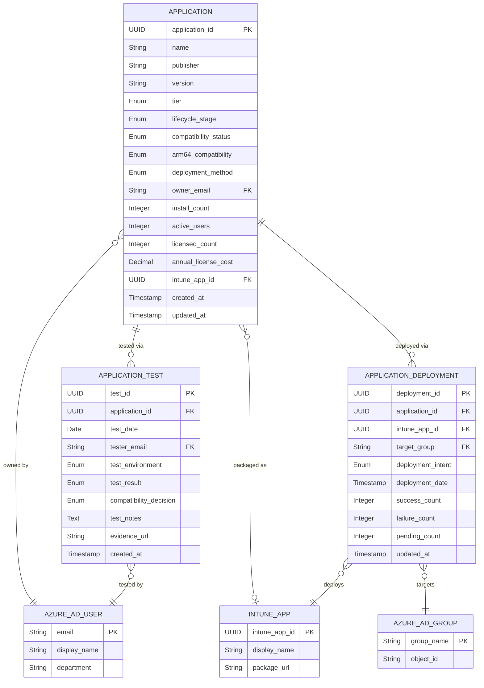

# Data Model: Application Catalogue

**Document Type**: Data Architecture & GDPR Compliance
**Project ID**: 002
**Version**: 1.0
**Date**: 2025-10-27
**Status**: DRAFT
**Owner**: Enterprise Architecture & IT Operations
**Data Protection Officer**: [TBD]

---

## Executive Summary

### Data Model Overview

This data model defines the Application Catalogue system for Project 002 (Application Packaging and Rationalisation), supporting the Windows 10 to Windows 11 migration (Project 001). The catalogue tracks 350+ applications across 6,000 devices, enabling application rationalization, compatibility testing, InTune packaging, and deployment management.

**Total Entities**: 3 core entities
- **E-001: Application** - Software application inventory and metadata
- **E-002: ApplicationTest** - Windows 11 compatibility test results
- **E-003: ApplicationDeployment** - InTune deployment configurations and status

**Total Attributes**: 27 attributes across all entities
- **PII Attributes**: 2 (owner_email, tester_email - Azure AD references)
- **Indexed Attributes**: 8 (for performance and query optimization)
- **Encrypted Attributes**: 0 (no sensitive financial or personal data stored)

**Data Classification**:
- **INTERNAL**: 3 entities (Application, ApplicationTest, ApplicationDeployment)
- **No PUBLIC, CONFIDENTIAL, or RESTRICTED data**

**GDPR Compliance Status**:
- **PII Identified**: Yes (2 attributes - email addresses linking to Azure AD users)
- **Legal Basis**: Legitimate Interest (IT operations and compliance management)
- **DPIA Required**: No (low risk - operational IT data, no special category PII)
- **Retention Periods**: 3-7 years for audit and compliance
- **Cross-Border Transfer**: No (UK-based system, Azure AD in UK region)

**Data Governance**:
- **Data Owners**: 3 stakeholders (IT Operations Director, Security Architect, Enterprise Architect)
- **CRUD Matrix**: 5 roles/systems defined (IT Packagers, Application Owners, IT Ops Manager, Enterprise Architect, InTune API)
- **Access Controls**: Role-based access control (RBAC) with least privilege

**Compliance Requirements**:
- **UK GDPR/DPA 2018**: Email addresses (PII) with data subject rights
- **ISO 27001**: Audit trail retention (7 years)
- **Architecture Principle 2 (Zero Trust)**: Secure access controls, audit logging

**Requirements Traceability**:
- **Data Requirements Mapped**: 3 entity definitions from requirements.md
- **Unmapped Requirements**: 0 (all data requirements modeled)

---

## Entity Relationship Diagram (ERD)



**Diagram Notes**:
- **||--o{**: One-to-many relationship (one Application has many Tests)
- **}o--||**: Many-to-one relationship (many Applications owned by one User)
- **}o--o|**: Many-to-zero-or-one relationship (Application may or may not have InTune package)
- **External Entities**: AZURE_AD_USER, AZURE_AD_GROUP, INTUNE_APP (managed by Microsoft, not in Application Catalogue database)

---

## Entity Catalog

### E-001: Application

**Entity ID**: E-001
**Entity Name**: Application
**Description**: Represents a software application deployed or deployable to Windows devices across the 6,000-device estate. This is the core entity of the Application Catalogue, tracking application metadata, lifecycle, compatibility status, deployment method, ownership, usage statistics, and licensing information.

**Source Requirements**:
- **Primary**: Entity 1 from requirements.md Data Requirements section
- **Related**: BR-001 (Portfolio Rationalization), BR-002 (Compatibility Certification), BR-003 (InTune Deployment), BR-004 (License Optimization), BR-007 (Application Governance)

**Business Owner**: IT Operations Director (application portfolio management, rationalization decisions, deployment oversight)

**Technical Owner**: IT Application Packagers team (data quality, compatibility testing coordination, InTune packaging)

**Data Steward**: Enterprise Architect (governance compliance, data quality audits, requirements traceability)

**Data Classification**: **INTERNAL** (not public, but not confidential - operational IT inventory data)

**Estimated Volume**:
- **Initial (Month 0)**: 350 applications (current estate)
- **Target (Month 4)**: 220 applications (post-rationalization - 37% reduction)
- **Growth Rate**: +5-10 applications per year (new business needs)
- **3-Year Projection**: ~300 applications (organic growth after rationalization)

**Retention Period**:
- **Active/Deprecated/Sunset applications**: Indefinite (ongoing operational data)
- **Retired applications**: 7 years after retirement (audit trail per ISO 27001, then archive/delete)
- **Rationale**: 7-year retention supports audit compliance, vendor disputes, license true-up verification

**Attributes Table**:

| Attribute | Type | Required | PII | Description | Validation | Default | Source Req |
|-----------|------|----------|-----|-------------|------------|---------|------------|
| application_id | UUID | Yes | No | Unique identifier | UUID v4 format | Auto-generated | Entity 1 |
| name | String(255) | Yes | No | Application name | Not null, not empty, indexed | - | Entity 1, BR-001 |
| publisher | String(255) | Yes | No | Software vendor/publisher | Not null | - | Entity 1 |
| version | String(50) | Yes | No | Application version | Not null, semantic versioning preferred | - | Entity 1, BR-002 |
| tier | Enum | Yes | No | Business criticality classification | 'Tier 1 - Critical' \| 'Tier 2 - Standard' \| 'Tier 3 - Optional' | 'Tier 2 - Standard' | Entity 1, BR-002 |
| lifecycle_stage | Enum | Yes | No | Application lifecycle status | 'Active' \| 'Deprecated' \| 'Sunset' \| 'Retired' | 'Active' | Entity 1, BR-001, BR-007 |
| compatibility_status | Enum | Yes | No | Windows 11 compatibility | 'Compatible' \| 'Compatible with Updates' \| 'Incompatible' \| 'Pending Testing' \| 'Retired' | 'Pending Testing' | Entity 1, BR-002 |
| arm64_compatibility | Enum | No | No | ARM64 (Copilot+ PC) compatibility | 'Native ARM64' \| 'x64 Emulated - Good' \| 'x64 Emulated - Degraded' \| 'Incompatible' \| 'Not Tested' | 'Not Tested' | Entity 1, FR-014 |
| deployment_method | Enum | Yes | No | Packaging/deployment format | 'MSIX' \| 'Win32' \| 'App-V' \| 'Microsoft Store' \| 'Not Packaged' | 'Not Packaged' | Entity 1, BR-003 |
| owner_email | String(255) | Yes | **Yes** | Application Owner contact (Azure AD user) | Valid Azure AD email, not null, indexed | - | Entity 1, BR-007 |
| install_count | Integer | Yes | No | Number of devices with application installed | >= 0 | 0 | Entity 1, BR-001 |
| active_users | Integer | Yes | No | Active users (last 90 days) | >= 0, <= install_count | 0 | Entity 1, FR-002 |
| licensed_count | Integer | No | No | Number of purchased licenses | >= 0 | null | Entity 1, BR-004 |
| annual_license_cost | Decimal(10,2) | No | No | Annual licensing cost (GBP) | >= 0 | null | Entity 1, BR-004 |
| intune_app_id | UUID | No | No | InTune application ID (foreign key) | UUID v4 format if populated | null | Entity 1, BR-003, INT-001 |
| vendor_support_url | String(500) | No | No | Vendor support website | Valid URL format | null | Entity 1 |
| created_at | Timestamp | Yes | No | Record creation timestamp | ISO 8601 format, UTC | Auto-generated on insert | Entity 1 |
| updated_at | Timestamp | Yes | No | Last update timestamp | ISO 8601 format, UTC | Auto-updated on modify | Entity 1 |

**Relationships**:
- **One-to-Many with E-002 (ApplicationTest)**: One Application can have multiple compatibility tests (VDI x64, ARM64, retests)
- **One-to-Many with E-003 (ApplicationDeployment)**: One Application can have multiple deployments (pilot, production, different Azure AD groups)
- **Many-to-One with AZURE_AD_USER (external)**: Many Applications owned by one Application Owner (owner_email FK)
- **Many-to-Zero-or-One with INTUNE_APP (external)**: Application may or may not be packaged in InTune (intune_app_id FK, nullable)

**Indexes**:
- **Primary Key**: application_id (clustered index)
- **Unique Index**: (name, publisher, version) - prevent duplicate application entries
- **Index**: owner_email (FK, used for queries "show all apps owned by X")
- **Index**: lifecycle_stage (filtered queries for Active/Retired apps)
- **Index**: compatibility_status (filtered queries for testing/deployment planning)
- **Index**: tier (filtered queries for Tier 1 priority testing)
- **Composite Index**: (lifecycle_stage, compatibility_status) - common query pattern for deployment readiness reports

**Privacy Notes (GDPR)**:
- **PII Attribute**: owner_email (identifies individual Application Owner)
- **Legal Basis**: Legitimate Interest (IT operations require application ownership tracking for governance and accountability)
- **Data Subject Rights**: Application Owners can request access to applications they own, rectification of ownership if incorrect, erasure only if they leave organization (ownership must be transferred first)
- **Retention**: Owner_email retained for 7 years after application retirement (audit trail), then anonymized to "REDACTED-[timestamp]"
- **Access Control**: Owner_email visible to IT Operations, Enterprise Architect, Security Architect only (not to end users)

**Data Quality Metrics**:
- **Accuracy**: 100% of applications have valid owner_email matching Azure AD directory (validated monthly)
- **Completeness**: 100% of Active applications have tier, lifecycle_stage, compatibility_status populated (enforced by database constraints)
- **Timeliness**: install_count and active_users updated daily from InTune inventory sync
- **Uniqueness**: No duplicate (name, publisher, version) combinations (enforced by unique index)

---

### E-002: ApplicationTest

**Entity ID**: E-002
**Entity Name**: ApplicationTest
**Description**: Represents Windows 11 compatibility test results for an application. Each test record captures test execution details (environment, result, tester), compatibility decision, and evidence links. Supports Tier 1/2/3 testing requirements (BR-002) and ARM64 Copilot+ PC compatibility testing (FR-014).

**Source Requirements**:
- **Primary**: Entity 2 from requirements.md Data Requirements section
- **Related**: BR-002 (Windows 11 Compatibility Certification), FR-006 (Application Compatibility Test Plan), FR-014 (ARM64 Compatibility Testing), FR-019 (Testing Evidence Collection)

**Business Owner**: IT Operations Director (testing execution oversight, UAT coordination)

**Technical Owner**: IT Application Packagers team (test execution, result documentation)

**Data Steward**: Security Architect (compliance with testing procedures, evidence retention)

**Data Classification**: **INTERNAL** (test results for internal IT operations)

**Estimated Volume**:
- **Initial (Month 0-3)**: 500 test records (350 apps × 1.4 tests per app average - includes retests)
- **Breakdown**:
  - Tier 1 (80 apps): 2 tests per app (x64 + ARM64) = 160 tests
  - Tier 2 (120 apps): 1.5 tests per app (x64 + selective ARM64) = 180 tests
  - Tier 3 (150 apps): 1 test per app (x64 only) = 150 tests
- **Growth Rate**: +10 test records per month (new applications, retests after vendor updates)
- **3-Year Projection**: ~800 test records

**Retention Period**:
- **7 years** after test date (audit trail, ISO 27001 compliance, evidence for compatibility decisions)
- **Rationale**: Long retention supports audit compliance, vendor disputes, retrospective analysis of testing effectiveness

**Attributes Table**:

| Attribute | Type | Required | PII | Description | Validation | Default | Source Req |
|-----------|------|----------|-----|-------------|------------|---------|------------|
| test_id | UUID | Yes | No | Unique identifier | UUID v4 format | Auto-generated | Entity 2 |
| application_id | UUID | Yes | No | Application being tested (FK) | Must exist in E-001, not null, indexed | - | Entity 2 |
| test_date | Date | Yes | No | Date test performed | ISO 8601 date format, not null | Current date | Entity 2 |
| tester_email | String(255) | Yes | **Yes** | IT Packager performing test (Azure AD user) | Valid Azure AD email, not null | - | Entity 2, FR-019 |
| test_environment | Enum | Yes | No | Test environment type | 'VDI x64' \| 'VDI ARM64' \| 'Physical x64' \| 'Physical ARM64' | 'VDI x64' | Entity 2, FR-005, FR-014 |
| test_result | Enum | Yes | No | Test outcome | 'Pass' \| 'Fail' \| 'Blocked' | - | Entity 2, FR-006 |
| compatibility_decision | Enum | Yes | No | Final compatibility status | 'Compatible' \| 'Compatible with Updates' \| 'Incompatible' | - | Entity 2, BR-002 |
| test_notes | Text | No | No | Testing observations | Free text, max 10,000 characters | null | Entity 2, FR-006 |
| evidence_url | String(500) | No | No | Link to test evidence (SharePoint) | Valid URL format | null | Entity 2, FR-019 |
| created_at | Timestamp | Yes | No | Record creation timestamp | ISO 8601 format, UTC | Auto-generated on insert | Entity 2 |

**Relationships**:
- **Many-to-One with E-001 (Application)**: Many test records for one Application (application_id FK)
- **Many-to-One with AZURE_AD_USER (external)**: Many tests performed by one IT Packager (tester_email FK)

**Indexes**:
- **Primary Key**: test_id (clustered index)
- **Index**: application_id (FK, used for queries "show all tests for application X")
- **Index**: test_date (DESC) - most recent tests first
- **Index**: tester_email (FK, used for workload tracking per tester)
- **Composite Index**: (application_id, test_date DESC) - common query pattern for "latest test result per application"

**Privacy Notes (GDPR)**:
- **PII Attribute**: tester_email (identifies individual IT Packager who performed test)
- **Legal Basis**: Legitimate Interest (accountability for test quality, audit trail)
- **Data Subject Rights**: IT Packagers can request access to tests they performed, but cannot request erasure (audit trail requirement)
- **Retention**: tester_email retained for 7 years (audit trail), then anonymized to "REDACTED-[timestamp]"
- **Access Control**: tester_email visible to IT Operations, Enterprise Architect, Security Architect only

**Data Quality Metrics**:
- **Accuracy**: 100% of test records have evidence_url populated for Tier 1 applications (enforced by FR-019)
- **Completeness**: 100% of Tier 1 applications have at least 1 test record before pilot phase (Month 2) per BR-002
- **Timeliness**: Test results recorded within 24 hours of test execution
- **Consistency**: compatibility_decision matches most recent test_result for application (reconciliation check)

---

### E-003: ApplicationDeployment

**Entity ID**: E-003
**Entity Name**: ApplicationDeployment
**Description**: Represents InTune deployment configuration for an application to an Azure AD device group. Tracks deployment intent (Required, Available, Uninstall), deployment date, and success/failure/pending counts. Supports InTune deployment management (BR-003), pilot testing (FR-010), and deployment monitoring.

**Source Requirements**:
- **Primary**: Entity 3 from requirements.md Data Requirements section
- **Related**: BR-003 (InTune Application Deployment Readiness), FR-010 (Application Deployment Testing), INT-001 (Integration with Microsoft InTune)

**Business Owner**: IT Operations Director (deployment execution, production rollout approval)

**Technical Owner**: IT Application Packagers team (deployment configuration, troubleshooting)

**Data Steward**: Enterprise Architect (deployment governance, traceability to requirements)

**Data Classification**: **INTERNAL** (deployment metadata for internal IT operations)

**Estimated Volume**:
- **Initial (Month 4)**: 1,000 deployment records (220 apps × 4-5 deployments per app average)
- **Breakdown**:
  - Test group deployments: 220 apps × 1 deployment = 220
  - Pilot group deployments: 220 apps × 1 deployment = 220
  - Early adopter deployments: 220 apps × 1 deployment = 220
  - Production deployments: 220 apps × 2 deployments (multiple groups) = 440
- **Growth Rate**: +20 deployment records per month (new applications, re-deployments)
- **3-Year Projection**: ~1,800 deployment records

**Retention Period**:
- **3 years** after deployment date (operational history, deployment success rate analysis)
- **Rationale**: Shorter retention than Application/ApplicationTest (operational data, not audit trail)

**Attributes Table**:

| Attribute | Type | Required | PII | Description | Validation | Default | Source Req |
|-----------|------|----------|-----|-------------|------------|---------|------------|
| deployment_id | UUID | Yes | No | Unique identifier | UUID v4 format | Auto-generated | Entity 3 |
| application_id | UUID | Yes | No | Application being deployed (FK) | Must exist in E-001, not null, indexed | - | Entity 3 |
| intune_app_id | UUID | Yes | No | InTune application ID (FK) | UUID v4 format, not null, indexed | - | Entity 3, INT-001 |
| target_group | String(255) | Yes | No | Azure AD group name | Not null, indexed | - | Entity 3 |
| deployment_intent | Enum | Yes | No | Deployment type | 'Required' \| 'Available' \| 'Uninstall' | 'Required' | Entity 3, BR-003 |
| deployment_date | Timestamp | Yes | No | Deployment created date | ISO 8601 format, UTC, not null | Current timestamp | Entity 3 |
| success_count | Integer | Yes | No | Successful installs | >= 0 | 0 | Entity 3, FR-010 |
| failure_count | Integer | Yes | No | Failed installs | >= 0 | 0 | Entity 3, FR-010 |
| pending_count | Integer | Yes | No | Pending installs | >= 0 | 0 | Entity 3, FR-010 |
| updated_at | Timestamp | Yes | No | Last update timestamp | ISO 8601 format, UTC | Auto-updated on modify | Entity 3 |

**Relationships**:
- **Many-to-One with E-001 (Application)**: Many deployment configurations for one Application (application_id FK)
- **Many-to-One with INTUNE_APP (external)**: Many deployments reference one InTune package (intune_app_id FK)
- **Many-to-One with AZURE_AD_GROUP (external)**: Many deployments target one Azure AD group (target_group FK)

**Indexes**:
- **Primary Key**: deployment_id (clustered index)
- **Index**: application_id (FK, used for queries "show all deployments for application X")
- **Index**: intune_app_id (FK, used for InTune integration queries)
- **Index**: target_group (FK, used for queries "show all deployments to group X")
- **Composite Index**: (application_id, deployment_date DESC) - common query pattern for "latest deployment per application"

**Privacy Notes (GDPR)**:
- **No PII**: No personal data stored (target_group is group name, not individual users)
- **GDPR Not Applicable**: No data subject rights apply

**Data Quality Metrics**:
- **Accuracy**: success_count + failure_count + pending_count matches Azure AD group device count (validated daily)
- **Completeness**: 100% of Active applications have at least 1 deployment record (test group) before production rollout
- **Timeliness**: success/failure/pending counts updated every 4 hours from InTune API sync
- **Consistency**: intune_app_id matches E-001.intune_app_id for same application_id (referential integrity)

---

## Data Governance Matrix

| Entity | Data Owner | Data Steward | Data Custodian | Access Control | Sensitivity | Compliance | Quality SLA |
|--------|------------|--------------|----------------|----------------|-------------|------------|-------------|
| **E-001: Application** | IT Operations Director | Enterprise Architect | IT Infrastructure Team | IT Packagers: CRUD<br>App Owners: Read own apps<br>IT Ops Mgr: CRUD all<br>Enterprise Architect: Read all<br>End Users: No access | INTERNAL | ISO 27001 (audit trail)<br>Architecture Principle 1 (Cloud-First) | Accuracy >99%<br>Completeness 100% for Active apps<br>Timeliness: Daily sync |
| **E-002: ApplicationTest** | IT Operations Director | Security Architect | IT Infrastructure Team | IT Packagers: CRUD<br>App Owners: Read tests for own apps<br>IT Ops Mgr: Read all<br>Security Architect: Read all<br>End Users: No access | INTERNAL | ISO 27001 (audit trail)<br>UK GDPR (tester_email PII) | Accuracy: 100% evidence URL for Tier 1<br>Completeness: 100% Tier 1 tested by Month 2<br>Timeliness: Recorded within 24hr |
| **E-003: ApplicationDeployment** | IT Operations Director | Enterprise Architect | IT Infrastructure Team | IT Packagers: CRUD<br>IT Ops Mgr: CRUD<br>InTune API: Update counts<br>Enterprise Architect: Read all<br>End Users: No access | INTERNAL | ISO 27001 (operational history)<br>Architecture Principle 1 (InTune deployment) | Accuracy: Counts match InTune API<br>Completeness: 100% deployments tracked<br>Timeliness: Counts updated every 4hr |

**RACI Matrix (from Project 001 Stakeholder Analysis)**:
- **Application Compatibility Decisions**: Responsible: Application Owners | Accountable: IT Ops Director | Consulted: End Users, Enterprise Architect | Informed: CIO
- **Application Catalog Governance**: Responsible: Enterprise Architect | Accountable: IT Ops Director | Consulted: Security Architect | Informed: All stakeholders

---

## CRUD Matrix

**Legend**: C = Create, R = Read, U = Update, D = Delete, - = No access

| Entity / System or Role | IT Application Packagers | Application Owners | IT Ops Manager | Enterprise Architect | Security Architect | InTune API (INT-001) | End Users |
|--------------------------|--------------------------|--------------------|--------------------|----------------------|--------------------|-----------------------|-----------|
| **E-001: Application** | CRUD (all apps) | -R-- (own apps only) | CRUD (all apps) | -R-- (all apps, governance audits) | -R-- (all apps, security reviews) | -R-- (read for inventory sync) | ---- (no direct access) |
| **E-002: ApplicationTest** | CRUD (create/update tests, read all) | -R-- (own apps only) | -RU- (read all, update status) | -R-- (all tests, traceability audits) | -R-- (all tests, compliance reviews) | ---- (no access) | ---- (no direct access) |
| **E-003: ApplicationDeployment** | CRUD (create deployments, update configs) | ---- (no access) | CRUD (all deployments) | -R-- (all deployments, governance) | -R-- (all deployments, security audits) | --U- (update success/failure counts) | ---- (no direct access, consume via Company Portal) |

**Access Control Implementation**:
- **IT Application Packagers**: Azure AD group "Application-Packagers" ’ Application Catalogue RBAC role "Packager" (CRUD on E-001, E-002, E-003)
- **Application Owners**: Individual Azure AD users ’ Application Catalogue RBAC role "AppOwner" (Read where owner_email matches authenticated user)
- **IT Ops Manager**: Azure AD group "IT-Operations-Managers" ’ Application Catalogue RBAC role "Admin" (CRUD all entities)
- **Enterprise Architect**: Azure AD group "Enterprise-Architects" ’ Application Catalogue RBAC role "Auditor" (Read-only all entities, export reports)
- **Security Architect**: Azure AD group "Security-Architects" ’ Application Catalogue RBAC role "SecurityReviewer" (Read-only all entities, vulnerability data)
- **InTune API**: Service Principal (Azure AD app registration) ’ Application Catalogue API role "InTuneIntegration" (Read E-001, Update E-003 counts)

**Unauthorized Access Patterns Identified**:
- **Risk**: Application Owners updating compatibility_status directly ’ **Mitigation**: Read-only access for App Owners, only IT Packagers/Ops Mgr can update
- **Risk**: End Users viewing licensing costs (annual_license_cost) ’ **Mitigation**: End Users have no direct Application Catalogue access, InTune Company Portal shows only approved apps
- **Risk**: InTune API creating/deleting Application records ’ **Mitigation**: InTune API restricted to Update counts only (E-003), no Create/Delete permissions

---

## Data Integration Mapping

### Upstream Systems (Data Sources)

| System | Entity | Data Flow | Update Frequency | Data Quality SLA | Integration Method | Owner |
|--------|--------|-----------|------------------|--------------------|-------------------|-------|
| **Microsoft InTune** | E-001 (Application) | InTune ’ Application Catalogue: application name, version, install_count, intune_app_id | Daily (overnight batch) | 95% accuracy (some apps may not report correctly) | Microsoft Graph API (INT-001) | Microsoft / IT Operations |
| **Configuration Manager** (Transitional) | E-001 (Application) | ConfigMgr ’ Application Catalogue: legacy application inventory (Month 0-18 only) | Daily (overnight batch) | 90% accuracy (deprecated system) | SQL query or PowerShell remoting (INT-002) | IT Operations |
| **Azure AD** | E-001, E-002 | Azure AD ’ Application Catalogue: owner_email validation, tester_email validation | On-demand (during record creation/update) | 100% accuracy (authoritative identity source) | Microsoft Graph API (user lookup) | Microsoft / IT Operations |
| **Procurement System** | E-001 (Application) | Procurement ’ Application Catalogue: licensed_count, annual_license_cost | Weekly (batch file export) | 80% accuracy (manual data entry in procurement) | SFTP file transfer or manual CSV import (INT-005) | Procurement Manager |

### Downstream Systems (Data Consumers)

| System | Entity | Data Flow | Sync Method | Latency SLA | Integration Method | Owner |
|--------|--------|-----------|-------------|-------------|--------------------|-------|
| **ServiceNow CMDB** | E-001 (Application) | Application Catalogue ’ ServiceNow: Create/update Application CI (name, version, owner, lifecycle_stage, compatibility_status) | Real-time (event-driven) | <15 minutes | ServiceNow REST API (INT-003) | ServiceNow Platform Team |
| **InTune Admin Center** | E-001, E-003 | Application Catalogue ’ InTune: Application package upload, deployment configuration, detection rules | Real-time (on-demand) | <2 seconds | Microsoft Graph API (INT-001) | IT Operations |
| **Power BI Reporting** | E-001, E-002, E-003 | Application Catalogue ’ Power BI: Application inventory, testing status, deployment metrics (read-only) | Daily (overnight batch) | 24 hours staleness acceptable | SQL direct query or REST API | IT Operations / Enterprise Architect |
| **Microsoft App Assure** | E-001 | Application Catalogue ’ App Assure: Compatibility inquiry (application name, publisher, version) | On-demand (manual or API) | <24 hours | Web portal or API (INT-004) | IT Application Packagers |

### Master Data Management (MDM)

| Entity | Source of Truth | Rationale | Conflict Resolution |
|--------|-----------------|-----------|---------------------|
| **E-001: Application** | **Application Catalogue** (this system) | Application Catalogue is the authoritative source for application metadata, compatibility status, lifecycle stage | If InTune has different application name, Application Catalogue takes precedence (manual reconciliation) |
| **E-002: ApplicationTest** | **Application Catalogue** (this system) | Only system tracking Windows 11 compatibility test results | No conflicts (single source) |
| **E-003: ApplicationDeployment** | **InTune** for deployment execution, **Application Catalogue** for deployment history | InTune is source of truth for live deployment status (success/failure counts), Application Catalogue is historical record | InTune success_count synced to Application Catalogue every 4 hours (eventual consistency) |
| **AZURE_AD_USER** | **Azure AD** (external) | Microsoft manages identity directory | Application Catalogue validates owner_email/tester_email against Azure AD on create/update |
| **INTUNE_APP** | **InTune** (external) | Microsoft manages InTune application packages | Application Catalogue references intune_app_id (foreign key) but does not manage package lifecycle |

---

## Privacy & Compliance

### GDPR/DPA 2018 Compliance

#### PII Inventory

| Entity | Attribute | PII Type | Data Subject | Legal Basis | Retention | Cross-Border Transfer |
|--------|-----------|----------|--------------|-------------|-----------|----------------------|
| E-001: Application | owner_email | Email address (personal identifier) | Application Owner (Azure AD user) | Legitimate Interest (IT operations, accountability) | 7 years after application retirement | No (UK Azure AD region) |
| E-002: ApplicationTest | tester_email | Email address (personal identifier) | IT Packager (Azure AD user) | Legitimate Interest (audit trail, test quality accountability) | 7 years after test date | No (UK Azure AD region) |

**Total PII Attributes**: 2 (both email addresses linking to Azure AD users)

**Special Category Data**: None (no sensitive personal data per GDPR Article 9 - no race, religion, health, biometrics, etc.)

#### Legal Basis Justification

**Legitimate Interest Assessment** (per GDPR Article 6(1)(f)):

**Purpose**: Track application ownership and testing accountability for IT operations, governance, and audit compliance.

**Necessity Test**:
- **Is PII necessary?** Yes - Application ownership (owner_email) required for:
  - Accountability: Application Owners responsible for compatibility decisions, retirement approvals
  - Governance: Enterprise Architect requires ownership tracking for governance audits (G-12: Zero unapproved exceptions)
  - Communication: Change management requires owner contact for retirement notifications (FR-017)
- **Is PII proportionate?** Yes - Email addresses (not full personal profiles) sufficient for identification
- **Less intrusive alternatives?** No - Anonymous application management not feasible (governance requires named accountability)

**Balancing Test**:
- **Organization Interest**: Strong interest in application governance, compliance, cost reduction (£200K savings)
- **Data Subject Interest**: Minimal privacy impact - email addresses already in corporate directory (Azure AD), used for business purposes
- **Data Subject Expectations**: Reasonable expectation that IT staff email addresses used for IT operational systems
- **Data Subject Rights**: Data subjects can exercise GDPR rights (see below)

**Conclusion**: Legitimate Interest justified - processing necessary for IT operations, proportionate, minimal privacy impact.

#### Data Subject Rights Implementation

| Right (GDPR Article) | Implementation | Timeline | Owner |
|---------------------|----------------|----------|-------|
| **Right to be Informed (Art 13)** | Privacy notice published on Application Catalogue login page, informing users that owner_email/tester_email collected for governance/audit | Privacy notice reviewed annually | Data Protection Officer |
| **Right of Access (Art 15)** | Data subjects can request all Application/ApplicationTest records containing their email via self-service portal or DPO request | 1 month | IT Operations Director + DPO |
| **Right to Rectification (Art 16)** | Data subjects can request owner_email correction if incorrect (e.g., ownership transfer to new Application Owner) | 1 month | IT Operations Director |
| **Right to Erasure (Art 17)** | **LIMITED** - Email addresses cannot be erased during retention period (7 years) due to audit trail requirement (GDPR Art 17(3)(b) - legal obligation, Art 17(3)(e) - public interest archiving). After 7 years, anonymized to "REDACTED-[timestamp]" | After 7-year retention period | IT Infrastructure Team |
| **Right to Restriction (Art 18)** | Data subjects can request processing restriction (e.g., suspend owner_email use while ownership dispute resolved) | 1 month | IT Operations Director |
| **Right to Data Portability (Art 20)** | Data subjects can export their Application/ApplicationTest records in machine-readable format (CSV, JSON) | 1 month | IT Operations Director |
| **Right to Object (Art 21)** | Data subjects can object to processing - requires balancing test (organizational interest vs. data subject interest). If objection granted, anonymize email addresses with "REDACTED-[timestamp]" | 1 month | DPO + IT Operations Director |

**Data Subject Request Process**:
1. Data subject submits request to DPO (privacy@organization.com) or via self-service portal
2. DPO validates identity (Azure AD authentication)
3. IT Operations queries Application Catalogue for records containing data subject email
4. DPO provides response within 1 month (GDPR Art 12(3))
5. If erasure/objection granted, IT Operations anonymizes email addresses (after retention period expires)

#### Data Retention Schedule

| Entity | Retention Period | Rationale | Disposal Method |
|--------|------------------|-----------|----------------|
| **E-001: Application** (Active/Deprecated/Sunset) | Indefinite (ongoing operational data) | Applications in use require ongoing management | N/A (not deleted until retired) |
| **E-001: Application** (Retired) | 7 years after retirement | ISO 27001 audit trail, vendor disputes, license true-up verification | After 7 years: Anonymize owner_email ("REDACTED-[timestamp]"), archive to cold storage, delete after 10 years total |
| **E-002: ApplicationTest** | 7 years after test date | ISO 27001 audit trail, compatibility decision evidence, testing effectiveness analysis | After 7 years: Anonymize tester_email ("REDACTED-[timestamp]"), archive to cold storage, delete after 10 years total |
| **E-003: ApplicationDeployment** | 3 years after deployment date | Operational history (shorter than audit trail), deployment success rate analysis | After 3 years: Archive to cold storage, delete after 5 years total (no PII, shorter retention acceptable) |

**Automated Retention Enforcement**:
- **Monthly job**: Identify E-001 records with lifecycle_stage='Retired' and retired_date > 7 years ago ’ Anonymize owner_email
- **Monthly job**: Identify E-002 records with test_date > 7 years ago ’ Anonymize tester_email
- **Quarterly job**: Identify E-003 records with deployment_date > 3 years ago ’ Archive to cold storage
- **Annual job**: Delete archived records > retention period (E-001/E-002: 10 years total, E-003: 5 years total)

#### Cross-Border Data Transfer

**UK GDPR Compliance**:
- **Data Location**: Application Catalogue database hosted in **Azure UK South region** (London)
- **Azure AD Identity**: **UK region** (corporate tenant in UK)
- **InTune Service**: **Microsoft 365 UK region**
- **SharePoint (evidence_url)**: **UK region** (corporate tenant in UK)

**International Transfers**: **NONE**
- No data transferred outside UK
- No third-party processors outside UK
- Microsoft (Azure, InTune, SharePoint) compliant with UK GDPR via Microsoft Data Protection Addendum

**EU Adequacy Decision**: UK granted adequacy decision by EU (2021) - UK GDPR equivalent to EU GDPR for EU-UK transfers (not applicable to this system as no EU data subjects)

### Data Protection Impact Assessment (DPIA)

**DPIA Required?**: **NO**

**Rationale** (per ICO DPIA guidance):
- **Not High Risk**: Application Catalogue processes minimal PII (email addresses only, no special category data)
- **Not Systematic Monitoring**: No large-scale monitoring of individuals (only IT staff email addresses for accountability)
- **Not Large-Scale Processing**: ~15-20 Application Owners + ~3-5 IT Packagers (not "large scale" per ICO guidance)
- **Not Vulnerable Individuals**: IT staff (not children, elderly, or vulnerable groups)
- **Not New Technology**: Standard database application (not AI, biometrics, or novel technology)

**ICO Consultation**: Not required (DPIA not mandatory, low privacy risk)

**Privacy Risks Identified**:
- **Risk 1**: Unauthorized access to owner_email/tester_email by non-IT staff ’ **Mitigation**: RBAC with least privilege (NFR-SEC-002), Azure AD authentication required
- **Risk 2**: Email addresses visible in exported reports to unauthorized users ’ **Mitigation**: Report export restricted to IT Ops Manager, Enterprise Architect, Security Architect only

### Sector-Specific Compliance

**Not Applicable** (Application Catalogue is internal IT operations system):
- **PCI-DSS**: No payment card data stored
- **HIPAA**: No healthcare data (US regulation, not applicable to UK)
- **FCA Regulations**: No financial services data
- **Government Security Classifications**: Not government system (commercial organization)

**ISO 27001** (if organization certified):
- **A.8.2.3 (Handling of assets)**: Application Catalogue classified as INTERNAL asset (not PUBLIC or CONFIDENTIAL)
- **A.12.3.1 (Information backup)**: Daily backups to Azure Backup (RPO 24 hours, RTO 4 hours)
- **A.12.4.1 (Event logging)**: Audit logs retained 7 years (access, create, update, delete operations)
- **A.18.1.4 (Privacy and protection of PII)**: GDPR compliance measures documented above

---

## Data Quality Framework

### Quality Dimensions

| Dimension | Definition | Target | Measurement Method | Monitoring Frequency | Owner |
|-----------|------------|--------|-------------------|----------------------|-------|
| **Accuracy** | Data correctly represents real-world state | >99% for E-001, 100% for E-002 Tier 1 apps | Spot-check 20 random applications against InTune inventory monthly | Monthly | IT Application Packagers |
| **Completeness** | Required fields populated | 100% for Active applications | Database query: SELECT COUNT(*) WHERE lifecycle_stage='Active' AND (owner_email IS NULL OR tier IS NULL) | Daily | IT Operations Manager |
| **Consistency** | Same data across systems | E-001.intune_app_id matches InTune API | Reconciliation script comparing Application Catalogue to InTune API | Weekly | IT Application Packagers |
| **Timeliness** | Data updated within SLA | install_count updated daily, deployment counts every 4hr | Check last updated_at timestamp vs. current time | Daily | IT Infrastructure Team |
| **Uniqueness** | No duplicate records | 0 duplicate (name, publisher, version) combinations | Database query: SELECT name, publisher, version, COUNT(*) GROUP BY name, publisher, version HAVING COUNT(*) > 1 | Weekly | IT Application Packagers |
| **Validity** | Data conforms to format/constraints | 100% valid email addresses (Azure AD lookup) | Azure AD validation on owner_email/tester_email insert/update | Real-time (on create/update) | Application Catalogue API |

### Data Quality Metrics (Specific Targets)

**E-001: Application**:
- **Accuracy**:
  - install_count matches InTune inventory ±5% tolerance (daily sync may have lag)
  - owner_email exists in Azure AD (100% validated on insert/update)
- **Completeness**:
  - 100% of Active applications have owner_email, tier, lifecycle_stage, compatibility_status populated (enforced by NOT NULL constraints)
  - 100% of Tier 1 applications have compatibility_status != 'Pending Testing' by Month 2 (BR-002 requirement)
- **Consistency**:
  - E-001.compatibility_status matches most recent E-002.compatibility_decision for same application_id (reconciliation check weekly)
  - E-001.intune_app_id matches InTune API intune_app_id (100% consistency, validated on deployment)
- **Timeliness**:
  - install_count and active_users updated within 24 hours of InTune inventory scan
- **Uniqueness**:
  - 0 duplicate (name, publisher, version) combinations (enforced by unique index)

**E-002: ApplicationTest**:
- **Accuracy**:
  - 100% of Tier 1 application tests have evidence_url populated (FR-019 requirement for audit trail)
- **Completeness**:
  - 100% of Tier 1 applications have at least 1 test record by Month 2 (BR-002 requirement)
  - 95% of Tier 2 applications have at least 1 test record by Month 3 (BR-002 requirement)
- **Timeliness**:
  - Test results recorded within 24 hours of test execution (measured by comparing test_date to created_at timestamp)

**E-003: ApplicationDeployment**:
- **Accuracy**:
  - success_count + failure_count + pending_count matches Azure AD group device count ±10% tolerance (InTune API may have reporting lag)
- **Timeliness**:
  - Deployment counts updated within 4 hours of InTune API sync (INT-001 integration SLA)

### Data Quality Issue Resolution Process

1. **Detection**: Automated data quality monitoring scripts run daily/weekly (cron jobs)
2. **Alerting**: Data quality failures trigger email alerts to IT Operations Manager + IT Application Packagers
3. **Investigation**: IT Packagers investigate root cause (e.g., InTune API sync failure, Azure AD user deleted)
4. **Remediation**:
   - **Accuracy issues**: Correct data in Application Catalogue (manual update or re-sync from InTune)
   - **Completeness issues**: Contact Application Owners to populate missing data (owner_email, tier)
   - **Consistency issues**: Reconcile Application Catalogue with InTune API (automated reconciliation script)
   - **Timeliness issues**: Re-run InTune inventory sync job, check for API failures
5. **Escalation**: If data quality issue unresolved within 48 hours, escalate to IT Operations Director
6. **Root Cause Analysis**: For recurring data quality issues, perform root cause analysis (5 Whys, Fishbone diagram) and implement preventive measures

---

## Requirements Traceability

| Requirement | Entity | Attributes | Rationale |
|-------------|--------|------------|-----------|
| **Entity 1 (Data Requirements)** | E-001: Application | All 17 attributes (application_id through updated_at) | Core entity representing application inventory |
| **Entity 2 (Data Requirements)** | E-002: ApplicationTest | All 9 attributes (test_id through created_at) | Represents Windows 11 compatibility test results |
| **Entity 3 (Data Requirements)** | E-003: ApplicationDeployment | All 10 attributes (deployment_id through updated_at) | Represents InTune deployment configurations |
| **BR-001 (Portfolio Rationalization)** | E-001 | lifecycle_stage, install_count, active_users, licensed_count, annual_license_cost | Track application usage for rationalization decisions (retire <5% adoption apps) |
| **BR-002 (Compatibility Certification)** | E-001, E-002 | E-001: tier, compatibility_status, arm64_compatibility; E-002: all attributes | Track Tier 1/2 testing, compatibility status, ARM64 testing (FR-014) |
| **BR-003 (InTune Deployment)** | E-001, E-003 | E-001: deployment_method, intune_app_id; E-003: all attributes | Track InTune packaging status, deployment configurations |
| **BR-004 (License Optimization)** | E-001 | licensed_count, annual_license_cost, install_count, active_users | Track license usage vs. actual usage for cost optimization (£200K savings target) |
| **BR-007 (Application Governance)** | E-001 | owner_email, lifecycle_stage, tier | Application ownership tracking, lifecycle management, governance audits |
| **BR-008 (Security Compliance)** | E-001 | compatibility_status (implicitly tracks security compliance via testing) | Compatibility testing includes security assessment (NFR-SEC-003 vulnerability scanning) |
| **FR-002 (Usage Analytics)** | E-001 | install_count, active_users | Track usage metrics for rationalization (identify <5% adoption apps) |
| **FR-006 (Compatibility Test Plan)** | E-002 | test_environment, test_result, compatibility_decision, test_notes | Document test execution and results per tier (Tier 1 full regression, Tier 2 smoke testing) |
| **FR-010 (Deployment Testing)** | E-003 | success_count, failure_count, pending_count | Track pilot deployment success rate (>95% target per BR-003) |
| **FR-014 (ARM64 Compatibility)** | E-001, E-002 | E-001: arm64_compatibility; E-002: test_environment ('VDI ARM64', 'Physical ARM64') | Track Copilot+ PC compatibility per Architecture Principle 3A |
| **FR-019 (Testing Evidence)** | E-002 | evidence_url, test_notes | Store links to test evidence (screenshots, logs) for audit trail |
| **NFR-SEC-002 (Access Control)** | E-001, E-002 | owner_email (FK to Azure AD for RBAC), tester_email (FK to Azure AD) | RBAC enforcement via Azure AD group membership |
| **INT-001 (InTune Integration)** | E-001, E-003 | E-001: intune_app_id; E-003: intune_app_id, success_count, failure_count, pending_count | Integration with Microsoft InTune for deployment management |

**Unmapped Requirements**: **0** (all data requirements from requirements.md modeled in E-001, E-002, E-003)

**Gaps Identified**: None - data model complete per requirements.md Data Requirements section.

---

## Implementation Guidance

### Database Technology Recommendation

**Recommended**: **PostgreSQL 15+** (Relational Database)

**Rationale**:
- **Structured Data**: Application Catalogue has well-defined schema (3 entities, clear relationships) ’ Relational database ideal
- **ACID Compliance**: Requires strong consistency (e.g., updating compatibility_status must be atomic, no partial updates)
- **Complex Queries**: Joins between Application ” ApplicationTest ” ApplicationDeployment for reporting (e.g., "show all Tier 1 apps with Failed tests and no deployment")
- **JSON Support**: PostgreSQL JSONB for future extensibility (e.g., storing test_notes as structured JSON)
- **Open Source**: Free licensing, active community, Azure Database for PostgreSQL managed service available
- **GDPR Compliance**: PostgreSQL supports audit logging, data retention policies, encryption at rest/in transit

**Alternative**: **Azure SQL Database** (if Microsoft ecosystem preference)
- **Pros**: Native integration with Azure AD, Azure Key Vault, familiar to Microsoft-centric IT teams
- **Cons**: Higher licensing cost vs. PostgreSQL, vendor lock-in

**NOT Recommended**:
- **Document Database (MongoDB, DynamoDB)**: Overkill for structured data, complex joins inefficient
- **Graph Database (Neo4j)**: No highly connected graph data (Application ’ Test ’ Deployment is simple hierarchy, not graph)
- **Time-Series Database (InfluxDB)**: Not time-series data (deployment counts are operational metrics, not high-frequency time-series)

### Database Schema

**PostgreSQL Schema** (DDL):

```sql
-- E-001: Application
CREATE TABLE application (
    application_id UUID PRIMARY KEY DEFAULT gen_random_uuid(),
    name VARCHAR(255) NOT NULL,
    publisher VARCHAR(255) NOT NULL,
    version VARCHAR(50) NOT NULL,
    tier VARCHAR(50) NOT NULL CHECK (tier IN ('Tier 1 - Critical', 'Tier 2 - Standard', 'Tier 3 - Optional')),
    lifecycle_stage VARCHAR(50) NOT NULL DEFAULT 'Active' CHECK (lifecycle_stage IN ('Active', 'Deprecated', 'Sunset', 'Retired')),
    compatibility_status VARCHAR(50) NOT NULL DEFAULT 'Pending Testing' CHECK (compatibility_status IN ('Compatible', 'Compatible with Updates', 'Incompatible', 'Pending Testing', 'Retired')),
    arm64_compatibility VARCHAR(50) DEFAULT 'Not Tested' CHECK (arm64_compatibility IN ('Native ARM64', 'x64 Emulated - Good', 'x64 Emulated - Degraded', 'Incompatible', 'Not Tested')),
    deployment_method VARCHAR(50) NOT NULL DEFAULT 'Not Packaged' CHECK (deployment_method IN ('MSIX', 'Win32', 'App-V', 'Microsoft Store', 'Not Packaged')),
    owner_email VARCHAR(255) NOT NULL, -- FK to Azure AD (validated in application layer)
    install_count INTEGER NOT NULL DEFAULT 0 CHECK (install_count >= 0),
    active_users INTEGER NOT NULL DEFAULT 0 CHECK (active_users >= 0 AND active_users <= install_count),
    licensed_count INTEGER CHECK (licensed_count >= 0),
    annual_license_cost DECIMAL(10,2) CHECK (annual_license_cost >= 0),
    intune_app_id UUID, -- FK to InTune (external system)
    vendor_support_url VARCHAR(500),
    created_at TIMESTAMP WITH TIME ZONE NOT NULL DEFAULT NOW(),
    updated_at TIMESTAMP WITH TIME ZONE NOT NULL DEFAULT NOW(),

    -- Indexes
    CONSTRAINT unique_app_version UNIQUE (name, publisher, version)
);

CREATE INDEX idx_application_owner_email ON application(owner_email);
CREATE INDEX idx_application_lifecycle_stage ON application(lifecycle_stage);
CREATE INDEX idx_application_compatibility_status ON application(compatibility_status);
CREATE INDEX idx_application_tier ON application(tier);
CREATE INDEX idx_application_lifecycle_compat ON application(lifecycle_stage, compatibility_status);

-- Trigger: Auto-update updated_at on modification
CREATE OR REPLACE FUNCTION update_updated_at_column()
RETURNS TRIGGER AS $$
BEGIN
    NEW.updated_at = NOW();
    RETURN NEW;
END;
$$ LANGUAGE plpgsql;

CREATE TRIGGER update_application_updated_at BEFORE UPDATE ON application
FOR EACH ROW EXECUTE FUNCTION update_updated_at_column();

-- E-002: ApplicationTest
CREATE TABLE application_test (
    test_id UUID PRIMARY KEY DEFAULT gen_random_uuid(),
    application_id UUID NOT NULL REFERENCES application(application_id) ON DELETE CASCADE,
    test_date DATE NOT NULL,
    tester_email VARCHAR(255) NOT NULL, -- FK to Azure AD (validated in application layer)
    test_environment VARCHAR(50) NOT NULL CHECK (test_environment IN ('VDI x64', 'VDI ARM64', 'Physical x64', 'Physical ARM64')),
    test_result VARCHAR(50) NOT NULL CHECK (test_result IN ('Pass', 'Fail', 'Blocked')),
    compatibility_decision VARCHAR(50) NOT NULL CHECK (compatibility_decision IN ('Compatible', 'Compatible with Updates', 'Incompatible')),
    test_notes TEXT,
    evidence_url VARCHAR(500),
    created_at TIMESTAMP WITH TIME ZONE NOT NULL DEFAULT NOW()
);

CREATE INDEX idx_application_test_application_id ON application_test(application_id);
CREATE INDEX idx_application_test_test_date ON application_test(test_date DESC);
CREATE INDEX idx_application_test_tester_email ON application_test(tester_email);
CREATE INDEX idx_application_test_app_date ON application_test(application_id, test_date DESC);

-- E-003: ApplicationDeployment
CREATE TABLE application_deployment (
    deployment_id UUID PRIMARY KEY DEFAULT gen_random_uuid(),
    application_id UUID NOT NULL REFERENCES application(application_id) ON DELETE CASCADE,
    intune_app_id UUID NOT NULL, -- FK to InTune (external system)
    target_group VARCHAR(255) NOT NULL, -- FK to Azure AD Group (validated in application layer)
    deployment_intent VARCHAR(50) NOT NULL DEFAULT 'Required' CHECK (deployment_intent IN ('Required', 'Available', 'Uninstall')),
    deployment_date TIMESTAMP WITH TIME ZONE NOT NULL DEFAULT NOW(),
    success_count INTEGER NOT NULL DEFAULT 0 CHECK (success_count >= 0),
    failure_count INTEGER NOT NULL DEFAULT 0 CHECK (failure_count >= 0),
    pending_count INTEGER NOT NULL DEFAULT 0 CHECK (pending_count >= 0),
    updated_at TIMESTAMP WITH TIME ZONE NOT NULL DEFAULT NOW()
);

CREATE INDEX idx_application_deployment_application_id ON application_deployment(application_id);
CREATE INDEX idx_application_deployment_intune_app_id ON application_deployment(intune_app_id);
CREATE INDEX idx_application_deployment_target_group ON application_deployment(target_group);
CREATE INDEX idx_application_deployment_app_date ON application_deployment(application_id, deployment_date DESC);

CREATE TRIGGER update_application_deployment_updated_at BEFORE UPDATE ON application_deployment
FOR EACH ROW EXECUTE FUNCTION update_updated_at_column();
```

### Schema Migration Strategy

**Tool**: **Flyway** (database migration tool)

**Migration Versioning**: Semantic versioning (V1.0.0__initial_schema.sql, V1.1.0__add_arm64_compatibility.sql, etc.)

**Migration Process**:
1. **Development**: Developers create migration SQL scripts in `db/migrations/` directory
2. **Code Review**: Enterprise Architect reviews schema changes for compliance with data model
3. **Testing**: Migrations tested on dev/test environments before production
4. **Production Deployment**: Flyway applies pending migrations during deployment window
5. **Rollback**: Each migration includes rollback script (V1.0.0__initial_schema_rollback.sql) for emergency recovery

**Example Migration** (adding new attribute to E-001):

```sql
-- V1.2.0__add_deprecation_date.sql
ALTER TABLE application ADD COLUMN deprecation_date DATE;
COMMENT ON COLUMN application.deprecation_date IS 'Date when application marked Deprecated (for Sunset planning)';

-- V1.2.0__add_deprecation_date_rollback.sql (rollback if needed)
ALTER TABLE application DROP COLUMN deprecation_date;
```

### Backup and Recovery

**RPO (Recovery Point Objective)**: **24 hours** (acceptable data loss: 1 day of updates)

**RTO (Recovery Time Objective)**: **4 hours** (maximum downtime for Application Catalogue restoration)

**Backup Strategy**:
- **Daily Full Backup**: Azure Database for PostgreSQL automated daily backup (01:00 AM UK time)
- **Transaction Log Backup**: Continuous (point-in-time restore to within 5 minutes)
- **Backup Retention**: 35 days (Azure default, meets 30-day operational recovery needs)
- **Geo-Redundant Backup**: Enabled (backup replicated to Azure UK West region for disaster recovery)

**Recovery Testing**: Quarterly restore test to verify backup integrity (restore to test environment, validate data)

### Data Archival

**Hot Storage** (Production Database): Active and Deprecated applications (lifecycle_stage='Active' OR lifecycle_stage='Deprecated')

**Warm Storage** (Read-Only Replica): Sunset applications (lifecycle_stage='Sunset') - queryable but not actively updated

**Cold Storage** (Azure Blob Storage)**: Retired applications after 7 years (lifecycle_stage='Retired' AND retired_date > 7 years ago)
- **Format**: Parquet (compressed columnar format for analytics)
- **Access**: Infrequent (annual compliance audits, legal discovery)
- **Cost**: £0.01/GB/month (vs. £0.10/GB/month for hot storage) - 90% cost savings

**Archival Process**:
1. **Monthly job**: Identify E-001 records with lifecycle_stage='Retired' AND retired_date > 7 years ago
2. **Export**: Export records to Parquet format (include anonymized owner_email: "REDACTED-[timestamp]")
3. **Upload**: Upload to Azure Blob Storage (cold tier)
4. **Soft Delete**: Mark records as archived in production database (archived=true, retain application_id for referential integrity)
5. **Hard Delete**: After 10 years total (3 years in cold storage), delete from cold storage per retention policy

### Testing Data (Anonymization/Pseudonymization)

**Requirement**: Test environments (dev, QA) must NOT contain production PII (owner_email, tester_email)

**Anonymization Strategy**:
1. **Production Backup**: Take daily production backup
2. **Restore to Test Environment**: Restore backup to test database
3. **PII Anonymization Script**:

```sql
-- Anonymize PII in test environment
UPDATE application SET owner_email = CONCAT('app-owner-', application_id::TEXT, '@example.com');
UPDATE application_test SET tester_email = CONCAT('tester-', test_id::TEXT, '@example.com');
```

4. **Validation**: Verify no production email addresses exist in test database (query for @organization.com domain)

**Synthetic Test Data** (alternative for dev environment):
- Generate synthetic applications, tests, deployments with realistic distributions (Tier 1: 25%, Tier 2: 35%, Tier 3: 40%)
- Use Faker library (Python) to generate realistic application names, publishers, versions
- No anonymization needed (no production data)

---

## Appendices

### Appendix A: Glossary

- **CRUD**: Create, Read, Update, Delete (database operations)
- **DPIA**: Data Protection Impact Assessment (GDPR requirement for high-risk processing)
- **FK**: Foreign Key (database constraint linking two tables)
- **GDPR**: General Data Protection Regulation (EU/UK data privacy law)
- **ICO**: Information Commissioner's Office (UK data protection regulator)
- **InTune**: Microsoft InTune (Endpoint Manager - cloud-native device management)
- **PII**: Personally Identifiable Information (data identifying individuals - email, name, etc.)
- **PK**: Primary Key (unique identifier for database record)
- **RBAC**: Role-Based Access Control (security model restricting access based on user roles)
- **RPO**: Recovery Point Objective (acceptable data loss in disaster recovery)
- **RTO**: Recovery Time Objective (acceptable downtime in disaster recovery)
- **UUID**: Universally Unique Identifier (128-bit identifier, e.g., 550e8400-e29b-41d4-a716-446655440000)

### Appendix B: Reference Documents

- **Project 002 Requirements** (`projects/002-application-packaging-rationalisation/requirements.md`)
- **Project 001 Stakeholder Analysis** (`projects/001-windows-11-migration-intune/stakeholder-drivers.md`)
- **Enterprise Architecture Principles** (`.arckit/memory/architecture-principles.md`)
- **Microsoft InTune Win32 App Management**: https://learn.microsoft.com/mem/intune/apps/apps-win32-app-management
- **UK GDPR Guidance (ICO)**: https://ico.org.uk/for-organisations/uk-gdpr-guidance-and-resources/
- **PostgreSQL 15 Documentation**: https://www.postgresql.org/docs/15/

### Appendix C: Change Log

| Version | Date | Author | Changes |
|---------|------|--------|---------|
| 1.0 | 2025-10-27 | Enterprise Architecture Team | Initial draft based on requirements.md data entities |

---

**Document Control**:
- **Version**: 1.0
- **Classification**: INTERNAL
- **Next Review**: After requirements approval, before HLD creation
- **Document Owner**: Enterprise Architect & IT Operations Director
