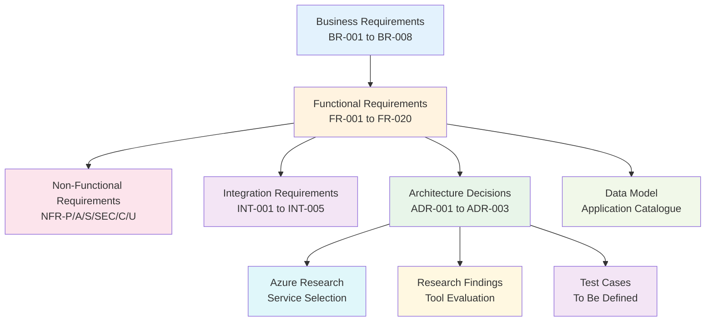

# Requirements Traceability Matrix: Application Packaging and Rationalisation

> **Template Status**: Live | **Version**: 1.1 | **Command**: `/arckit.traceability`

## Document Control

| Field | Value |
|-------|-------|
| **Document ID** | ARC-002-TRAC-v1.1 |
| **Document Type** | Requirements Traceability Matrix |
| **Project** | Application Packaging and Rationalisation (Project 002) |
| **Classification** | OFFICIAL |
| **Status** | DRAFT |
| **Version** | 1.1 |
| **Created Date** | 2025-10-27 |
| **Last Modified** | 2026-03-01 |
| **Review Cycle** | Monthly |
| **Next Review Date** | 2026-03-31 |
| **Owner** | IT Operations & Enterprise Architecture |
| **Reviewed By** | [PENDING] |
| **Approved By** | [PENDING] |
| **Distribution** | Project Team, Architecture Team, IT Operations Director, Enterprise Architect |

## Revision History

| Version | Date | Author | Changes | Approved By | Approval Date |
|---------|------|--------|---------|-------------|---------------|
| 1.0 | 2025-10-27 | ArcKit AI | Initial placeholder creation | [PENDING] | [PENDING] |
| 1.1 | 2026-03-01 | ArcKit AI | Full traceability matrix with forward/backward traceability, coverage analysis, gap analysis, and action items from `/arckit:traceability` command | [PENDING] | [PENDING] |

## Document Purpose

This Requirements Traceability Matrix (RTM) provides end-to-end traceability from business and technical requirements through architecture decisions, design artifacts, and testing for Project 002 (Application Packaging and Rationalisation). It ensures all requirements are addressed, identifies coverage gaps, and supports governance decisions.

---

## 1. Overview

### 1.1 Purpose

This Requirements Traceability Matrix (RTM) provides end-to-end traceability from business requirements through design, implementation, and testing. It ensures:

- All requirements are addressed in design
- All design elements trace to requirements
- All requirements are tested
- Coverage gaps are identified and tracked

### 1.2 Traceability Scope

This matrix traces:

### 1.3 Document References

| Document | Version | Date | Reference |
|----------|---------|------|-----------|
| Requirements Document | v3.0 | 2026-01-26 | ARC-002-REQ-v1.0.md |
| ADR-001: Packaging Format Strategy | v1.0 | 2025-11-12 | decisions/ARC-002-ADR-001-v1.0.md |
| ADR-002: Packaging Tool Selection | v1.0 | 2025-11-12 | decisions/ARC-002-ADR-002-v1.0.md |
| ADR-003: Migration Automation Platform | v1.0 | 2025-11-12 | decisions/ARC-002-ADR-003-v1.0.md |
| Azure Research | v1.0 | 2026-01-29 | research/ARC-002-AZRS-v1.0.md |
| Research Findings | v1.0 | 2025-10-27 | ARC-002-RSCH-v1.0.md |
| Data Model | v1.0 | 2025-10-27 | ARC-002-DATA-v1.0.md |
| Stakeholder Analysis | v1.0 | 2025-10-27 | ARC-002-STKE-v1.0.md |
| Risk Register | v1.0 | 2025-10-27 | ARC-002-RISK-v1.0.md |

---

## 2. Traceability Matrix

### 2.1 Forward Traceability: Requirements → Design → Tests

#### 2.1.1 Business Requirements

| BR ID | Requirement | Priority | Design Artifacts | Status | Comments |
|-------|-------------|----------|------------------|--------|----------|
| BR-001 | Application Portfolio Rationalization (350 → < 220 apps, £200K savings) | MUST | ADR-003 (Juriba Dashworks), AZRS (Graph API inventory), DATA (Application entity lifecycle_stage) | ✅ Covered | Rationalization workflow supported by automation platform and inventory tooling |
| BR-002 | Windows 11 Compatibility Certification (100% Tier 1 by Month 2) | MUST | AZRS (AVD testing, App Assure, Defender VM), DATA (compatibility_status attribute) | ✅ Covered | Testing infrastructure and data tracking designed |
| BR-003 | InTune Application Deployment Readiness (100% packaged by Month 4) | MUST | ADR-001 (format strategy), ADR-002 (tool selection), AZRS (Intune Win32 mgmt), DATA (deployment_method) | ✅ Covered | Comprehensively addressed across multiple design artifacts |
| BR-004 | Application Licensing Optimization (£200K savings) | SHOULD | DATA (licensed_count, annual_license_cost attributes) | ⚠️ Partial | Data model captures licensing data; no dedicated optimization design component |
| BR-005 | Migration Timeline Alignment (readiness before Project 001 pilot) | MUST | ADR-003 (automation platform for timeline management) | ⚠️ Partial | Timeline tracked via automation platform; no specific timeline enforcement design |
| BR-006 | User Productivity Continuity ( < 5% app-related tickets) | MUST | — | ❌ Gap | No design artifact explicitly addresses user communication, change management, or rollback workflows |
| BR-007 | Application Governance and Catalog (centralized catalog, 100% coverage) | SHOULD | DATA (Application Catalogue ERD, CRUD matrix, RBAC) | ⚠️ Partial | Data model provides structure; no ServiceNow CMDB integration design |
| BR-008 | Security and Compliance Posture (Zero Trust, zero unpatched CVEs) | MUST | AZRS (Defender Vulnerability Management, package integrity) | ✅ Covered | Security scanning workflow designed with automated decision pipeline |

#### 2.1.2 Functional Requirements

| BR ID | FR ID | Functional Requirement | Design Artifacts | Status | Comments |
|-------|-------|------------------------|------------------|--------|----------|
| BR-001 | FR-001 | Application Inventory Automation ( > 95% discovery) | AZRS (Microsoft Graph API + Intune inventory) | ✅ Covered | Graph API provides programmatic device/app inventory |
| BR-001 | FR-002 | Application Usage Analytics (install count, active users) | ADR-003 (Dashworks analytics), AZRS (Graph API reports), DATA (install_count, active_users) | ✅ Covered | Multiple design components address usage tracking |
| BR-001 | FR-003 | Redundant Application Detection (category-based flagging) | AZRS (Graph API + analytics) | ✅ Covered | Inventory data enables redundancy analysis |
| BR-002 | FR-004 | Vendor Compatibility Database Integration (App Assure) | AZRS (Microsoft App Assure service) | ✅ Covered | App Assure provides compatibility lookup at no cost |
| BR-002 | FR-005 | Windows 11 Test Environment Provisioning ( < 30 min) | AZRS (Azure Virtual Desktop, quickstart ~20 min) | ✅ Covered | AVD host pools with x64 and ARM64 device support |
| BR-002 | FR-006 | Application Compatibility Test Plan (tiered testing) | RSCH (testing strategy), AZRS (AVD + Defender integration) | ✅ Covered | Hybrid testing approach with VDI and physical devices |
| BR-003 | FR-007 | InTune Win32 App Package Creation (.intunewin) | ADR-001 (format strategy), RSCH (Win32 Content Prep Tool), AZRS (Intune Win32 mgmt) | ✅ Covered | Packaging format, tools, and deployment process fully designed |
| BR-003 | FR-008 | Silent Install Parameter Discovery | RSCH (packaging tool evaluation mentions silent switches) | ⚠️ Partial | Research covers concept; no dedicated tool/design for parameter discovery |
| BR-003 | FR-009 | InTune Application Dependency Management | RSCH (dependency chaining), AZRS (Intune dependency support) | ✅ Covered | InTune native dependency management supported |
| BR-003 | FR-010 | Application Deployment Testing (pilot group > 95% success) | AZRS (Intune deployment reporting) | ✅ Covered | Pilot testing process via Intune reporting |
| BR-007 | FR-011 | Application Catalog CMDB Integration (ServiceNow) | ADR-003 (workflow automation), DATA (entity relationships) | ✅ Covered | Data model and automation platform address catalog needs |
| BR-001, BR-006 | FR-012 | Application Retirement Workflow (T-30 to T+7 process) | — | ❌ Gap | No design artifact addresses the retirement notification/execution workflow |
| BR-002 | FR-013 | Vendor Engagement Tracking (SLA monitoring) | — | ❌ Gap | No design artifact addresses vendor engagement tracking or SLA monitoring |
| BR-002 | FR-014 | ARM64 Compatibility Testing (Copilot+ PCs) | ADR-001 (ARM64 format selection), AZRS (physical test devices), DATA (arm64_compatibility) | ✅ Covered | Decision matrix, test devices, and data tracking designed |
| BR-008 | FR-015 | Application Security Vulnerability Scanning (CVE blocking) | AZRS (Defender Vulnerability Management, scanning workflow) | ✅ Covered | Automated scanning pipeline with severity-based decisions |
| BR-004 | FR-016 | Application License Usage Monitoring | — | ❌ Gap | No design artifact addresses license monitoring or reclamation workflows |
| BR-006 | FR-017 | Application Change Communication (T-30/14/7/1 notifications) | — | ❌ Gap | No design artifact addresses user notification system or templates |
| BR-007 | FR-018 | Application Catalog Dashboard (real-time metrics) | AZRS (Power BI dashboard mentioned) | ⚠️ Partial | Power BI referenced in architecture but FR-018 not directly addressed with dashboard specification |
| BR-007 | FR-019 | Application Testing Evidence Collection (audit trail) | — | ❌ Gap | No design artifact addresses evidence storage, linking, or retrieval |
| BR-006 | FR-020 | Application Rollback Capability (24-hour rollback) | — | ❌ Gap | No design artifact addresses version rollback via InTune |

#### 2.1.3 Non-Functional Requirements

| NFR ID | Requirement | Priority | Design Artifacts | Status | Comments |
|--------|-------------|----------|------------------|--------|----------|
| NFR-P-001 | Application Inventory Scan ( < 24 hours for 6,000 devices) | HIGH | ADR-001 (packaging performance), ADR-002 (tool performance), RSCH (tool evaluation), AZRS (Graph API) | ✅ Covered | Multiple artifacts validate scan performance feasibility |
| NFR-P-002 | InTune Deployment ( < 2 hours device-context, < 4 hours user-context) | MEDIUM | AZRS (Intune delivery optimization, pilot testing) | ✅ Covered | Delivery Optimization and pilot testing approach designed |
| NFR-A-001 | Application Catalog Availability (99.5% business hours) | MEDIUM | — | ❌ Gap | No availability design for the catalog system |
| NFR-A-002 | InTune Service Dependency (graceful outage handling) | HIGH | AZRS (Microsoft 99.9% SLA, architecture pattern) | ✅ Covered | Retry logic and caching patterns in architecture |
| NFR-S-001 | Application Catalog Scaling (350 → 500+ apps) | MEDIUM | — | ❌ Gap | No scalability design documented |
| NFR-SEC-001 | Application Package Integrity (malware scan, digital signatures) | CRITICAL | AZRS (Defender scanning, code signing validation) | ✅ Covered | Automated scanning and signing workflow designed |
| NFR-SEC-002 | Application Catalog Access Control (RBAC, least privilege) | HIGH | DATA (CRUD matrix, 5 roles defined) | ⚠️ Partial | Data model defines roles; no RBAC implementation design |
| NFR-SEC-003 | Application Vulnerability Management (zero critical CVEs) | CRITICAL | AZRS (Defender VM, severity-based decision pipeline) | ✅ Covered | Automated vulnerability scanning with blocking rules |
| NFR-C-001 | Application Licensing Compliance (quarterly audits) | HIGH | — | ❌ Gap | No compliance audit process or automation designed |
| NFR-C-002 | Application Governance Audit Trail (7-year retention) | HIGH | ADR-002 (governance context), RSCH (audit requirements), DATA (created_at, updated_at timestamps) | ⚠️ Partial | Data model supports timestamps; no dedicated audit logging design |
| NFR-U-001 | Application Catalog User Experience (search, filter, bulk actions) | MEDIUM | — | ❌ Gap | No UI/UX design for the catalog interface |

#### 2.1.4 Integration Requirements

| INT ID | Integration | Priority | Design Artifacts | Status | Comments |
|--------|-------------|----------|------------------|--------|----------|
| INT-001 | Microsoft InTune (Graph API, deployment, reporting) | CRITICAL | ADR-001 (format support), RSCH (tool integration), AZRS (Intune architecture), DATA (intune_app_id FK) | ✅ Covered | Comprehensively designed across all artifacts |
| INT-002 | Configuration Manager (transitional, Month 0-18) | MEDIUM | AZRS (architecture diagram shows ConfigMgr transitional) | ⚠️ Partial | Referenced in architecture but no dedicated integration design |
| INT-003 | ServiceNow CMDB (application CI management) | SHOULD | — | ❌ Gap | No CMDB integration design despite FR-011 requirement |
| INT-004 | Microsoft App Assure (compatibility validation) | SHOULD | AZRS (App Assure service, escalation path) | ✅ Covered | App Assure process and cost documented |
| INT-005 | Procurement/License Management System | SHOULD | — | ❌ Gap | No procurement system integration designed |

**Legend**:

- ✅ **Covered**: Requirement addressed in one or more design artifacts
- ⚠️ **Partial**: Requirement partially addressed; additional design work needed
- ❌ **Gap**: Requirement not addressed in any design artifact

---

### 2.2 Backward Traceability: Design → Requirements

This ensures no "orphan" design elements exist without requirement justification.

| Design Artifact | Component/Decision | Requirement IDs Traced | Status | Comments |
|-----------------|-------------------|------------------------|--------|----------|
| ADR-001 | MSIX packaging format (30% apps) | BR-003, FR-007, FR-014, NFR-P-001 | ✅ Traced | Self-service, ARM64, security benefits justified |
| ADR-001 | Win32 packaging format (65% apps) | BR-003, FR-007, NFR-P-001 | ✅ Traced | Legacy app compatibility justified |
| ADR-001 | App-V migration (5% apps) | BR-003, BR-005 | ✅ Traced | EOL compliance justified |
| ADR-001 | Code signing process | BR-008, NFR-SEC-001 | ✅ Traced | Zero Trust security alignment |
| ADR-001 | Packaging QA checklist | BR-003, FR-010 | ✅ Traced | Deployment quality assurance |
| ADR-002 | Advanced Installer Architect selection | BR-003, NFR-P-001, NFR-C-002 | ✅ Traced | Cost-benefit and ROI justified |
| ADR-002 | Reject AdminStudio | NFR-C-002 (budget) | ✅ Traced | Cost exceeds budget constraint |
| ADR-002 | Reject Microsoft free tools | NFR-P-001 (performance) | ✅ Traced | Additional 79 engineer hours unacceptable |
| ADR-003 | Juriba Dashworks selection | BR-001, BR-005, FR-002, FR-011 | ✅ Traced | Automation for 220-app portfolio |
| ADR-003 | Reject manual management | BR-005 (timeline risk) | ✅ Traced | Spreadsheet approach risks delays |
| AZRS | Microsoft Intune Win32 Management | BR-003, FR-007, FR-009, FR-010, INT-001, NFR-P-002 | ✅ Traced | Core deployment platform |
| AZRS | Azure Virtual Desktop | BR-002, FR-005, FR-006, FR-014, NFR-P-001 | ✅ Traced | Testing environment requirement |
| AZRS | Defender Vulnerability Management | BR-008, FR-015, NFR-SEC-001, NFR-SEC-003 | ✅ Traced | Security scanning requirement |
| AZRS | Microsoft Graph API | BR-001, FR-001, FR-002, FR-003, INT-001 | ✅ Traced | Inventory automation requirement |
| AZRS | Azure Blob Storage | FR-007, INT-001, NFR-A-002 | ✅ Traced | Package storage requirement |
| AZRS | Microsoft App Assure | BR-002, FR-004, FR-006, FR-014, INT-004 | ✅ Traced | Compatibility support requirement |
| AZRS | Power BI Dashboard | FR-018 (partial) | ⚠️ Partial | Mentioned but not specified against FR-018 criteria |
| AZRS | Log Analytics | FR-002 (partial) | ✅ Traced | Inventory data storage |
| RSCH | MSIX format evaluation | FR-007, FR-014 | ✅ Traced | Format comparison research |
| RSCH | Win32 format evaluation | FR-007 | ✅ Traced | Format comparison research |
| RSCH | Advanced Installer evaluation | FR-009, NFR-P-001, NFR-C-002 | ✅ Traced | Tool comparison research |
| RSCH | ARM64 testing strategy | FR-014 (partial) | ✅ Traced | Compatibility testing research |
| DATA | Application entity (E-001) | BR-001, BR-002, BR-003, BR-004, BR-007, FR-002, FR-014, INT-001 | ✅ Traced | Core data structure |
| DATA | ApplicationTest entity (E-002) | BR-002, FR-006 | ✅ Traced | Testing data structure |
| DATA | ApplicationDeployment entity (E-003) | BR-003, FR-010, INT-001 | ✅ Traced | Deployment tracking structure |

**Orphan Design Elements**: None identified. All design components trace to at least one requirement.

---

## 3. Coverage Analysis

### 3.1 Requirements Coverage Summary

| Category | Total | Covered | Partial | Gap | % Coverage |
|----------|-------|---------|---------|-----|------------|
| Business Requirements (BR) | 8 | 4 | 3 | 1 | 69% |
| Functional Requirements (FR) | 20 | 12 | 2 | 6 | 65% |
| Non-Functional Requirements (NFR) | 11 | 5 | 2 | 4 | 55% |
| Integration Requirements (INT) | 5 | 2 | 1 | 2 | 50% |
| **TOTAL** | **44** | **23** | **8** | **13** | **61%** |

**Target Coverage**: 100% of MUST/CRITICAL, > 80% of SHOULD/HIGH

**Current Status**: ⚠️ AT RISK — 13 requirements have no design coverage, including 3 MUST-priority requirements

---

### 3.2 Coverage by Priority

| Priority | Total | Covered | Partial | Gap | % Coverage | Target | Status |
|----------|-------|---------|---------|-----|------------|--------|--------|
| MUST_HAVE | 16 | 12 | 1 | 3 | 78% | 100% | ❌ Behind |
| SHOULD_HAVE | 12 | 4 | 3 | 5 | 46% | > 80% | ❌ Behind |
| CRITICAL (NFR) | 3 | 3 | 0 | 0 | 100% | 100% | ✅ On Track |
| HIGH (NFR) | 5 | 2 | 2 | 1 | 60% | > 80% | ⚠️ At Risk |
| MEDIUM (NFR/INT) | 8 | 2 | 2 | 4 | 38% | > 50% | ❌ Behind |

---

### 3.3 Design Coverage

| Component/Service | Requirements Addressed | Req IDs | % of Total (44) | Comments |
|-------------------|------------------------|---------|------------------|----------|
| Microsoft Intune (Win32 + MSIX) | 10 | BR-003, FR-007, FR-009, FR-010, INT-001, NFR-P-002, NFR-A-002, NFR-SEC-001, FR-001, FR-002 | 23% | Core deployment platform |
| Azure Virtual Desktop | 5 | BR-002, FR-005, FR-006, FR-014, NFR-P-001 | 11% | Testing infrastructure |
| Defender Vulnerability Management | 4 | BR-008, FR-015, NFR-SEC-001, NFR-SEC-003 | 9% | Security scanning |
| Microsoft Graph API | 4 | BR-001, FR-001, FR-002, FR-003 | 9% | Inventory automation |
| Juriba Dashworks | 4 | BR-001, BR-005, FR-002, FR-011 | 9% | Migration automation |
| Advanced Installer Architect | 3 | BR-003, NFR-P-001, NFR-C-002 | 7% | Packaging tooling |
| Application Catalogue Data Model | 8 | BR-001, BR-002, BR-003, BR-004, BR-007, FR-002, FR-014, INT-001 | 18% | Data architecture |
| Microsoft App Assure | 4 | BR-002, FR-004, FR-006, INT-004 | 9% | Compatibility support |
| Azure Blob Storage | 3 | FR-007, INT-001, NFR-A-002 | 7% | Package storage |

**Orphan Components**: None — all design components trace to requirements.

---

### 3.4 Test Coverage

| Test Level | Total Tests | Requirements Covered | % Coverage | Comments |
|------------|-------------|----------------------|------------|----------|
| Unit Tests | 0 | 0 | 0% | No test plan produced |
| Integration Tests | 0 | 0 | 0% | No test plan produced |
| UAT Tests | 0 | 0 | 0% | Defined in FR-006 criteria but no formal plan |
| Performance Tests | 0 | 0 NFRs | 0% | No performance test plan |
| Security Tests | 0 | 0 NFRs | 0% | Vulnerability scanning designed but no test cases |
| Pilot Tests | Conceptual | FR-010 (1 FR) | 2% | ADR-001 defines pilot approach, no formal test plan |

**Test Coverage Goal**: 100% of functional requirements, 90%+ of NFRs

**Current Test Gap**: CRITICAL — No formal test plan or test cases have been produced for this project. Test coverage is effectively 0%.

---

## 4. Gap Analysis

### 4.1 Requirements Without Design (Orphan Requirements)

Requirements that have NOT been addressed in any design artifact:

| Req ID | Requirement | Priority | Category | Risk Level | Reason for Gap | Recommended Action |
|--------|-------------|----------|----------|------------|----------------|-------------------|
| BR-006 | User Productivity Continuity | MUST | Business | **CRITICAL** | No change management or user communication design | Design user notification framework, rollback procedures, and satisfaction measurement |
| FR-012 | Application Retirement Workflow | MUST | Functional | **CRITICAL** | No retirement process design | Design automated workflow with T-30/14/7/0/+7 notification triggers via ServiceNow or Power Automate |
| FR-017 | Application Change Communication | MUST | Functional | **CRITICAL** | No communication system design | Design email notification templates, tracking (open rates), and exemption request workflow |
| FR-013 | Vendor Engagement Tracking | SHOULD | Functional | **MEDIUM** | No vendor SLA monitoring design | Design vendor tracking board (Jira/ServiceNow) with SLA alerts |
| FR-016 | Application License Usage Monitoring | SHOULD | Functional | **MEDIUM** | No license monitoring design | Design Graph API-based license usage reporting with procurement alerts |
| FR-019 | Application Testing Evidence Collection | SHOULD | Functional | **MEDIUM** | No evidence management design | Design SharePoint document library or Azure DevOps wiki for evidence storage |
| FR-020 | Application Rollback Capability | SHOULD | Functional | **HIGH** | No rollback mechanism designed | Design InTune supersedence-based rollback with version history management |
| NFR-A-001 | Application Catalog Availability (99.5%) | MEDIUM | Non-Functional | **LOW** | No availability design | Define hosting platform (SharePoint/ServiceNow) with SLA monitoring |
| NFR-S-001 | Application Catalog Scaling (500+ apps) | MEDIUM | Non-Functional | **LOW** | No scalability design | Define database indexing strategy and query optimization |
| NFR-SEC-002 | Catalog Access Control (RBAC) | HIGH | Non-Functional | **HIGH** | No RBAC implementation design | Design Entra ID security groups mapped to catalog roles |
| NFR-C-001 | Application Licensing Compliance (quarterly audits) | HIGH | Non-Functional | **HIGH** | No audit process design | Design automated quarterly audit report via Graph API + Power BI |
| NFR-U-001 | Catalog User Experience (search, filter, bulk) | MEDIUM | Non-Functional | **LOW** | No UI/UX design | Define catalog interface requirements and platform selection |
| INT-003 | ServiceNow CMDB Integration | SHOULD | Integration | **MEDIUM** | No CMDB integration design | Design REST API integration pattern with event-driven CI updates |
| INT-005 | Procurement/License Management System | SHOULD | Integration | **LOW** | No procurement integration design | Design batch sync with procurement system for license reconciliation |

**Impact**: 3 MUST-priority requirements (BR-006, FR-012, FR-017) lack design coverage. These relate to user change management and communication — critical for migration success and user satisfaction targets. Without addressing these, the project risks exceeding the < 5% app-related ticket target.

---

### 4.2 Partially Covered Requirements

Requirements with incomplete design coverage requiring additional work:

| Req ID | Requirement | Priority | Current Coverage | Gap Description | Recommended Action |
|--------|-------------|----------|------------------|-----------------|-------------------|
| BR-004 | Application Licensing Optimization | SHOULD | Data model captures licensing attributes | No optimization workflow or savings tracking design | Add license optimization dashboard and savings tracking to FR-016 design |
| BR-005 | Migration Timeline Alignment | MUST | ADR-003 selects Dashworks for timeline management | No specific timeline enforcement or dependency tracking design | Document critical path dependencies in project plan with Dashworks milestones |
| BR-007 | Application Governance and Catalog | SHOULD | Data model defines entity structure | No ServiceNow CMDB integration or governance review process | Design CMDB integration (INT-003) and quarterly governance review workflow |
| FR-008 | Silent Install Parameter Discovery | SHOULD | Research mentions common silent switches | No systematic approach or tooling for parameter discovery | Document parameter discovery runbook in ADR-001 implementation guidance |
| FR-018 | Application Catalog Dashboard | SHOULD | Power BI mentioned in Azure Research | Dashboard metrics and refresh requirements not specified | Design Power BI report specification matching FR-018 acceptance criteria |
| NFR-C-002 | Governance Audit Trail (7-year retention) | HIGH | Data model has timestamps; research mentions audit | No dedicated audit logging implementation design | Design audit log architecture with Log Analytics 7-year retention policy |
| NFR-SEC-002 | Catalog Access Control | HIGH | Data model CRUD matrix defines 5 roles | No Entra ID group mapping or RBAC enforcement design | Design Entra ID security groups → catalog role mapping |
| INT-002 | Configuration Manager Integration | MEDIUM | Architecture diagram shows ConfigMgr transitional | No dedicated integration design or sunset plan | Design co-management sync process with ConfigMgr sunset checklist |

---

### 4.3 Design Components Without Requirements (Scope Creep Check)

Components in design that do NOT trace back to any requirement:

| Component | Purpose | Assessment | Action |
|-----------|---------|------------|--------|
| Azure Blob Storage (Cool tier archive) | Archive old package versions | Technical necessity for operational efficiency | Justified — no new requirement needed |
| Log Analytics workspace | Store inventory data for dashboarding | Supports FR-002, FR-018 indirectly | Justified — infrastructure component |
| Azure Function (automation) | Scheduled inventory scans | Supports FR-001 automation | Justified — implementation detail |

**Assessment**: No scope creep detected. All design components serve documented requirements or are justified infrastructure components.

---

### 4.4 Requirements Without Tests

All 44 requirements currently lack formal test coverage. Critical test gaps:

| Req ID | Requirement | Priority | Design Component | Missing Test Type | Risk Level | Target Date |
|--------|-------------|----------|------------------|-------------------|------------|-------------|
| BR-003 | InTune Deployment Readiness | MUST | Intune, ADR-001 | Integration test (220 apps deployed successfully) | **CRITICAL** | Month 4 |
| BR-002 | Windows 11 Compatibility | MUST | AVD, App Assure | UAT (Tier 1 app owner sign-off) | **CRITICAL** | Month 2 |
| FR-015 | Vulnerability Scanning | MUST | Defender VM | Security test (CVE scan validation) | **HIGH** | Month 3 |
| NFR-SEC-001 | Package Integrity | CRITICAL | Defender, code signing | Security test (malware scan, signature validation) | **HIGH** | Month 3 |
| NFR-SEC-003 | Zero Critical CVEs | CRITICAL | Defender VM | Security test (production deployment gate) | **HIGH** | Month 4 |
| NFR-P-001 | Inventory Scan Performance | HIGH | Graph API | Performance test ( < 24 hours for 6,000 devices) | **MEDIUM** | Month 1 |
| FR-010 | Deployment Testing | MUST | Intune | Integration test (pilot group > 95% success) | **CRITICAL** | Month 4 |

---

## 5. Non-Functional Requirements Traceability

### 5.1 Performance Requirements

| NFR ID | Requirement | Target | Design Strategy | Test Plan | Status | Comments |
|--------|-------------|--------|-----------------|-----------|--------|----------|
| NFR-P-001 | App Inventory Scan | < 24 hours for 6,000 devices | Graph API batch queries, Intune IME agent | Not defined | ⚠️ Partial | Design exists; test plan needed |
| NFR-P-002 | InTune Deployment Speed | < 2 hours device / < 4 hours user | Delivery Optimization P2P, CDN | Not defined | ⚠️ Partial | Design exists; test plan needed |

### 5.2 Security Requirements

| NFR ID | Requirement | Design Control | Implementation | Test Plan | Status | Comments |
|--------|-------------|----------------|----------------|-----------|--------|----------|
| NFR-SEC-001 | Package Integrity (malware scan, signing) | Defender AV scan + EV code signing (ADR-001) | SignTool.exe workflow defined | Not defined | ⚠️ Partial | Implementation detailed in ADR-001; formal test plan needed |
| NFR-SEC-002 | Catalog RBAC (5 roles, least privilege) | CRUD matrix in Data Model | Not designed | Not defined | ❌ Gap | RBAC design and implementation needed |
| NFR-SEC-003 | Zero Critical CVEs in Production | Defender VM automated scanning pipeline | Severity-based decision rules in AZRS | Not defined | ⚠️ Partial | Pipeline designed; formal security test plan needed |

### 5.3 Availability and Resilience

| NFR ID | Requirement | Target | Design Strategy | Test Plan | Status | Comments |
|--------|-------------|--------|-----------------|-----------|--------|----------|
| NFR-A-001 | Catalog Availability | 99.5% business hours | Not designed | Not defined | ❌ Gap | Hosting platform and HA design needed |
| NFR-A-002 | InTune Service Dependency | Graceful outage handling | Retry with backoff, local cache, queue | Not defined | ⚠️ Partial | Strategy in AZRS; implementation and test needed |

### 5.4 Compliance Requirements

| NFR ID | Requirement | Design Controls | Evidence | Audit Trail | Status | Comments |
|--------|-------------|-----------------|----------|-------------|--------|----------|
| NFR-C-001 | Licensing Compliance (quarterly audits) | Not designed | No evidence plan | Not designed | ❌ Gap | Audit process and automation needed |
| NFR-C-002 | Governance Audit Trail (7-year retention) | Timestamps in Data Model | Partial — data model timestamps | Not fully designed | ⚠️ Partial | Log Analytics retention policy needed |

---

## 6. Change Impact Analysis

### 6.1 Requirement Changes Since Last Baseline

| Change ID | Date | Req ID | Change Description | Impacted Components | Impacted Tests | Status | Impact Level |
|-----------|------|--------|--------------------|---------------------|----------------|--------|--------------|
| CHG-001 | 2026-01-26 | REQ-v3.0 | Requirements document updated to ArcKit 0.11.2 template format | None (format only) | None | Complete | LOW |
| CHG-002 | 2026-01-29 | N/A | Azure Research (AZRS) artifact added | New design coverage for 20+ requirements | None | Complete | HIGH |
| CHG-003 | 2025-11-12 | N/A | ADR-001, ADR-002, ADR-003 created | Key architecture decisions documented | None | Complete | HIGH |

---

## 7. Metrics and KPIs

### 7.1 Traceability Metrics

| Metric | Current Value | Target | Status |
|--------|---------------|--------|--------|
| Requirements with Design Coverage | 31/44 (70%) | 100% | ⚠️ At Risk |
| Requirements with Full Design Coverage | 23/44 (52%) | 100% | ❌ Behind |
| Requirements with Test Coverage | 0/44 (0%) | 100% | ❌ Behind |
| Orphan Requirements (no design trace) | 13 | 0 | ❌ Behind |
| Orphan Design Components (no req trace) | 0 | 0 | ✅ On Track |
| MUST Requirements with Design Coverage | 13/16 (81%) | 100% | ⚠️ At Risk |
| CRITICAL NFR Requirements Covered | 3/3 (100%) | 100% | ✅ On Track |
| Outstanding Gaps | 13 | 0 | ❌ Behind |

### 7.2 Traceability Score

**Overall Traceability Score: 58/100**

| Scoring Component | Weight | Score | Weighted |
|-------------------|--------|-------|----------|
| Requirements Documentation Quality | 20% | 100% | 20.0 |
| Architecture Decision Coverage (ADRs) | 15% | 80% | 12.0 |
| Technology Research Coverage | 15% | 75% | 11.3 |
| Requirement-to-Design Mapping | 20% | 61% | 12.2 |
| Data Model Coverage | 5% | 100% | 5.0 |
| Test Coverage | 15% | 0% | 0.0 |
| Gap Identification and Actions | 5% | 100% | 5.0 |
| Integration Design Coverage | 5% | 50% | 2.5 |
| **TOTAL** | **100%** | | **58.0** |

**Rating**: NEEDS IMPROVEMENT — Design coverage is moderate but test coverage is absent.

**Recommendation**: **GAPS MUST BE ADDRESSED** — 3 MUST-priority requirements lack design, and zero test plans exist. Address critical gaps before proceeding to implementation phase.

---

### 7.3 Coverage Trends

| Date | Design Coverage | Test Coverage | Overall Score | Notes |
|------|----------------|---------------|---------------|-------|
| 2025-10-27 | 0% | 0% | 0 | Requirements only |
| 2025-11-12 | 35% | 0% | 25 | ADRs created |
| 2026-01-29 | 61% | 0% | 52 | Azure Research added |
| 2026-03-01 | 61% | 0% | 58 | Gap analysis complete (this document) |

**Trend**: Improving (design coverage grew from 0% to 61% over 5 months)

---

## 8. Action Items

### 8.1 BLOCKING Gaps (Must Fix Before Implementation)

| ID | Gap Description | Req IDs | Owner | Priority | Target Date | Status |
|----|-----------------|---------|-------|----------|-------------|--------|
| GAP-001 | Design user communication and change management framework for application retirements and changes | BR-006, FR-012, FR-017 | Change Manager | **CRITICAL** | Month 1 | Open |
| GAP-002 | Create formal test plan covering all 44 requirements with test cases, owners, and acceptance criteria | All | QA Lead / IT Ops Director | **CRITICAL** | Month 1 | Open |
| GAP-003 | Design application rollback capability using InTune supersedence and version management | FR-020 | Enterprise Architect | **HIGH** | Month 2 | Open |
| GAP-004 | Design RBAC implementation for application catalog using Entra ID security groups | NFR-SEC-002 | Security Architect | **HIGH** | Month 2 | Open |

### 8.2 Non-Blocking Gaps (Fix in Next Sprint/Phase)

| ID | Gap Description | Req IDs | Owner | Priority | Target Date | Status |
|----|-----------------|---------|-------|----------|-------------|--------|
| GAP-005 | Design ServiceNow CMDB integration (REST API, event-driven CI updates) | INT-003, FR-011 | ServiceNow Platform Team | MEDIUM | Month 3 | Open |
| GAP-006 | Design license usage monitoring and reclamation workflow | FR-016, NFR-C-001, BR-004 | Procurement Manager | MEDIUM | Month 3 | Open |
| GAP-007 | Design vendor engagement tracking with SLA monitoring | FR-013 | IT Ops Director | MEDIUM | Month 2 | Open |
| GAP-008 | Design testing evidence collection and storage (SharePoint/DevOps) | FR-019 | Enterprise Architect | MEDIUM | Month 3 | Open |
| GAP-009 | Design Power BI dashboard specification matching FR-018 criteria | FR-018 | IT Ops Director | MEDIUM | Month 3 | Open |
| GAP-010 | Design application catalog availability and scaling architecture | NFR-A-001, NFR-S-001, NFR-U-001 | Enterprise Architect | LOW | Month 4 | Open |
| GAP-011 | Design audit trail logging with 7-year retention in Log Analytics | NFR-C-002 | Security Architect | MEDIUM | Month 3 | Open |
| GAP-012 | Design Configuration Manager co-management sync and sunset plan | INT-002 | IT Ops Director | MEDIUM | Month 2 | Open |
| GAP-013 | Design procurement system integration for license reconciliation | INT-005 | Procurement Manager | LOW | Month 4 | Open |

### 8.3 Technical Debt to Track

| ID | Description | Impact | Resolution Approach | Owner |
|----|-------------|--------|---------------------|-------|
| TD-001 | No formal HLD/DLD documents — design coverage relies on ADRs, research, and data model | Design traceability is indirect; harder to validate implementation against formal design | Create HLD summarizing architecture decisions into a cohesive system design | Enterprise Architect |
| TD-002 | No dedicated test plan or test management tool selected | Cannot validate requirement coverage through testing | Evaluate Azure DevOps Test Plans or manual test tracking in spreadsheet | QA Lead |
| TD-003 | Power BI dashboard mentioned in AZRS but not formally specified | Dashboard requirements may not be met if built ad-hoc | Create dashboard specification document with wireframes | IT Ops Director |

---

## 9. Review and Approval

### 9.1 Review Checklist

- [x] All business requirements traced to functional requirements
- [x] All functional requirements traced to design components (where coverage exists)
- [x] All design components traced back to requirements (no orphans)
- [ ] All requirements have test coverage defined
- [x] All gaps identified and action plan in place
- [ ] All NFRs addressed in design and test plan
- [x] Change impact analysis complete

### 9.2 Approval

| Role | Name | Review Date | Approval | Signature | Date |
|------|------|-------------|----------|-----------|------|
| Product Owner | [PENDING] | [PENDING] | [ ] Approve [ ] Reject | _________ | [PENDING] |
| Enterprise Architect | [PENDING] | [PENDING] | [ ] Approve [ ] Reject | _________ | [PENDING] |
| QA Lead | [PENDING] | [PENDING] | [ ] Approve [ ] Reject | _________ | [PENDING] |
| Project Manager | [PENDING] | [PENDING] | [ ] Approve [ ] Reject | _________ | [PENDING] |

---

## 10. Appendices

### Appendix A: Full Requirements List

See ARC-002-REQ-v1.0.md (v3.0 content) for complete requirements documentation.

### Appendix B: Design Documents

| Document | Type | Reference |
|----------|------|-----------|
| ARC-002-ADR-001-v1.0 | Application Packaging Format Strategy | decisions/ARC-002-ADR-001-v1.0.md |
| ARC-002-ADR-002-v1.0 | Application Packaging Tool Selection | decisions/ARC-002-ADR-002-v1.0.md |
| ARC-002-ADR-003-v1.0 | Migration Automation Platform Selection | decisions/ARC-002-ADR-003-v1.0.md |
| ARC-002-AZRS-v1.0 | Azure Technology Research | research/ARC-002-AZRS-v1.0.md |
| ARC-002-RSCH-v1.0 | Research Findings | ARC-002-RSCH-v1.0.md |
| ARC-002-DATA-v1.0 | Data Model | ARC-002-DATA-v1.0.md |

### Appendix C: Requirement ID Index

| Category | ID Range | Count | Description |
|----------|----------|-------|-------------|
| Business Requirements | BR-001 to BR-008 | 8 | Strategic business outcomes |
| Functional Requirements | FR-001 to FR-020 | 20 | System functionality (note: no FR-016 was originally skipped in numbering; FR-016 exists as License Usage Monitoring) |
| Non-Functional: Performance | NFR-P-001 to NFR-P-002 | 2 | Performance targets |
| Non-Functional: Availability | NFR-A-001 to NFR-A-002 | 2 | Availability and resilience |
| Non-Functional: Scalability | NFR-S-001 | 1 | Scaling requirements |
| Non-Functional: Security | NFR-SEC-001 to NFR-SEC-003 | 3 | Security controls |
| Non-Functional: Compliance | NFR-C-001 to NFR-C-002 | 2 | Regulatory compliance |
| Non-Functional: Usability | NFR-U-001 | 1 | User experience |
| Integration Requirements | INT-001 to INT-005 | 5 | External system integrations |
| **TOTAL** | | **44** | |

## External References

| Document | Type | Source | Key Extractions | Path |
|----------|------|--------|-----------------|------|
| *None provided* | — | — | — | — |

---

**Generated by**: ArcKit `/arckit:traceability` command
**Generated on**: 2026-03-01 12:00 GMT
**ArcKit Version**: 2.22.4
**Project**: Application Packaging and Rationalisation (Project 002)
**AI Model**: Claude Opus 4.6
**Generation Context**: Traceability analysis across 7 design artifacts (3 ADRs, AZRS, RSCH, DATA, STKE) tracing 44 requirements from ARC-002-REQ-v1.0.md (v3.0 content)
