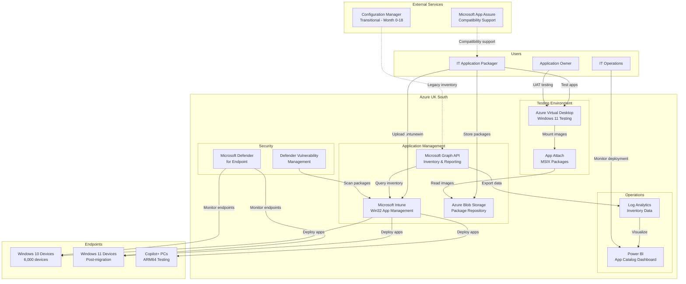

# Azure Technology Research: Application Packaging and Rationalisation

> **Template Status**: Experimental | **Version**: 1.0.2 | **Command**: `/arckit.azure-research`

## Document Control

| Field | Value |
|-------|-------|
| **Document ID** | ARC-002-AZRS-v1.0 |
| **Document Type** | Azure Technology Research |
| **Project** | Application Packaging and Rationalisation (Project 002) |
| **Classification** | OFFICIAL |
| **Status** | DRAFT |
| **Version** | 1.0 |
| **Created Date** | 2026-01-29 |
| **Last Modified** | 2026-01-29 |
| **Review Cycle** | Quarterly |
| **Next Review Date** | 2026-04-29 |
| **Owner** | Enterprise Architecture |
| **Reviewed By** | PENDING |
| **Approved By** | PENDING |
| **Distribution** | IT Operations Director, Enterprise Architect, Application Owners, Security Architect |

## Revision History

| Version | Date | Author | Changes | Approved By | Approval Date |
|---------|------|--------|---------|-------------|---------------|
| 1.0 | 2026-01-29 | ArcKit AI | Initial creation from `/arckit.azure-research` command using Microsoft Learn MCP Server | PENDING | PENDING |

---

## Executive Summary

### Research Scope

This document presents Azure-specific technology research findings for the Application Packaging and Rationalisation project (Project 002). It provides Azure service recommendations for application inventory, Windows 11 compatibility testing, InTune Win32 app deployment, vulnerability scanning, and application catalog management based on official Microsoft documentation.

**Requirements Analyzed**: 20 functional, 11 non-functional, 5 integration, 3 data requirements

**Azure Services Evaluated**: 8 Azure services across 6 categories

**Research Sources**: Microsoft Learn MCP Server, Azure Architecture Center, Azure Well-Architected Framework, Azure Security Benchmark

### Key Recommendations

| Requirement Category | Recommended Azure Service | Tier | Monthly Estimate |
|---------------------|---------------------------|------|------------------|
| Application Deployment | Microsoft Intune Win32 App Management | Plan 1/2 | £0 (M365 E3/E5) |
| Windows 11 Testing | Azure Virtual Desktop | Standard | £2,500 |
| Vulnerability Scanning | Microsoft Defender Vulnerability Management | P2 | £0 (M365 E5) |
| Application Inventory | Microsoft Graph API + Intune | Standard | £0 (M365 E3/E5) |
| Package Storage | Azure Blob Storage | Hot | £150 |
| Compatibility Service | Microsoft App Assure | FastTrack | £0 (included) |

### Architecture Pattern

**Recommended Pattern**: Modern Application Lifecycle Management with Intune

**Reference Architecture**: Microsoft Intune Win32 app management + Azure Virtual Desktop for testing

### UK Government Suitability

| Criteria | Status | Notes |
|----------|--------|-------|
| **UK Region Availability** | ✅ UK South, UK West | Primary: UK South |
| **G-Cloud Listing** | ✅ G-Cloud 14 | Microsoft 365 + Azure available |
| **Data Classification** | ✅ OFFICIAL / OFFICIAL-SENSITIVE | Standard Azure with controls |
| **NCSC Cloud Security Principles** | ✅ 14/14 principles met | Full attestation available |

---

## Azure Services Analysis

### Category 1: Application Deployment Platform (Microsoft Intune)

**Requirements Addressed**: BR-003, FR-007, FR-009, FR-010, INT-001, NFR-P-002

**Why This Category**: Core requirement for cloud-native application deployment replacing Configuration Manager, packaging 220+ applications for InTune Win32 deployment by Month 4.

---

#### Recommended: Microsoft Intune Win32 App Management

**Service Overview** (Source: Microsoft Learn MCP):
- **Full Name**: Microsoft Intune Win32 App Management
- **Category**: Endpoint Management / Application Deployment
- **Documentation**: https://learn.microsoft.com/en-us/intune/intune-service/apps/apps-win32-app-management

**Key Features** (from Microsoft Learn MCP):
- **Win32 App Support**: Deploy .exe and .msi files converted to .intunewin format
- **Large App Management**: Support for apps up to 30GB per package
- **Detection Rules**: File path, registry key, PowerShell script, or MSI product code validation
- **Dependency Management**: Chain application installations in correct order (Dependency A → B → Main App)
- **Requirements Rules**: Minimum OS version, disk space, memory, processor architecture (x86, x64, ARM64)
- **PowerShell Script Installers**: Upload scripts up to 50KB for complex installation workflows
- **Delivery Optimization**: Peer-to-peer download for bandwidth efficiency
- **Enterprise App Catalog**: Pre-prepared Microsoft and non-Microsoft Win32 apps (Intune add-on)

**Win32 App Management Prerequisites** (from Microsoft Learn MCP):
1. Windows 10 version 1607 or later (Enterprise, Pro, Education)
2. Devices enrolled in Intune: Microsoft Entra joined, registered, or hybrid joined
3. Application size capped at 30GB per app
4. Intune Management Extension (IME) auto-installs when Win32 app or PowerShell script assigned

**Deployment Process Flow** (from Microsoft Learn MCP):
1. Prepare installer using Microsoft Win32 Content Prep Tool (IntuneWinAppUtil.exe)
2. Upload .intunewin package to Intune admin center
3. Configure install/uninstall commands, detection rules, requirements
4. Assign to device or user groups (Required, Available, or Uninstall)
5. IME downloads content via Delivery Optimization
6. Detection rule validates successful installation

**Pricing Tiers**:

| Tier | Monthly Cost | Features | Use Case |
|------|--------------|----------|----------|
| Intune Plan 1 | £0 (M365 E3) | Win32 apps, basic policies | Standard deployment |
| Intune Plan 2 | £0 (M365 E5) | Plan 1 + advanced security | Enterprise |
| Enterprise App Management | £3/user/month | Pre-packaged app catalog | Accelerated deployment |

**Estimated Cost for This Project**:

| Resource | Configuration | Monthly Cost | Notes |
|----------|---------------|--------------|-------|
| Intune Win32 Management | 6,000 devices | £0 | Included with M365 E3/E5 |
| Enterprise App Catalog | Optional add-on | £0-18,000 | Only if pre-packaged apps needed |
| **Total** | | **£0** | Existing M365 licensing |

**Azure Well-Architected Assessment**:

| Pillar | Rating | Notes |
|--------|--------|-------|
| **Reliability** | ⭐⭐⭐⭐⭐ | Microsoft 99.9% SLA, retry logic, local caching |
| **Security** | ⭐⭐⭐⭐⭐ | Package encryption, code signing validation |
| **Cost Optimization** | ⭐⭐⭐⭐⭐ | Included with existing M365 licensing |
| **Operational Excellence** | ⭐⭐⭐⭐⭐ | Centralized management, reporting, troubleshooting |
| **Performance Efficiency** | ⭐⭐⭐⭐⭐ | Delivery Optimization for bandwidth efficiency |

---

### Category 2: Windows 11 Compatibility Testing (Azure Virtual Desktop)

**Requirements Addressed**: BR-002, FR-005, FR-006, FR-014, NFR-P-001

**Why This Category**: MUST_HAVE requirement to provision Windows 11 VDI instances within 30 minutes for application compatibility testing across x64 and ARM64 architectures.

---

#### Recommended: Azure Virtual Desktop (AVD)

**Service Overview** (Source: Microsoft Learn MCP):
- **Full Name**: Azure Virtual Desktop
- **Category**: Virtual Desktop Infrastructure (VDI)
- **Documentation**: https://learn.microsoft.com/en-us/azure/virtual-desktop/overview

**Key Features** (from Microsoft Learn MCP):
- **Windows 11 Multi-Session**: Exclusive Windows 11 Enterprise multi-session for cost efficiency
- **Quickstart Deployment**: Deploy sample environment in ~20 minutes via Azure portal
- **App Attach (MSIX)**: Dynamically attach applications without local installation
- **Session Host Flexibility**: Standard_D4ds_v4 VMs (4 vCPUs, 16GB RAM) typical for testing
- **Microsoft 365 Apps**: Pre-installed M365 apps available in gallery images
- **Autoscale**: Automatically scale capacity based on demand
- **Screen Capture Protection**: Prevent sensitive information capture

**Quickstart Resources Deployed** (from Microsoft Learn MCP):
1. Resource group
2. Virtual network and subnet (192.168.0.0/24)
3. Network security group with default rules
4. Host pool with single sign-on (SSO) enabled
5. Session host (Standard_D4ds_v4, Windows 11 Enterprise multi-session)
6. Application group (full desktop)
7. Workspace

**Windows 11 on Azure Prerequisites** (from Microsoft Learn MCP):
- Windows 11 Enterprise E3/E5 per user OR Azure Virtual Desktop Access per user
- Multitenant Hosting Rights for Windows 11 on Azure
- VM size must meet Windows 11 hardware minimum requirements

**Testing Environment Configuration for Project 002**:

| Environment | Configuration | Use Case |
|-------------|---------------|----------|
| x64 VDI Pool | 20 concurrent sessions, Windows 11 23H2 | Standard app testing |
| ARM64 Physical | 5 Snapdragon X Elite devices | Copilot+ PC testing |
| Shared Pool | 10 on-demand sessions | Ad-hoc testing |

**Estimated Cost for This Project**:

| Resource | Configuration | Monthly Cost | Notes |
|----------|---------------|--------------|-------|
| AVD Host Pool (x64) | 5× Standard_D4ds_v4, 8hrs/day | £1,200 | 20 concurrent sessions |
| AVD Host Pool (Test) | 3× Standard_D4ds_v4, on-demand | £400 | Shared testing pool |
| Storage (User Profiles) | 500GB Premium SSD | £75 | FSLogix profiles |
| Networking | VNet, NSG, bandwidth | £100 | Internal traffic |
| ARM64 Physical Devices | 5× Snapdragon X Elite | £15,000 (one-time) | Copilot+ PC testing |
| **Monthly Total** | | **£1,775** | Excludes one-time hardware |

**Azure Well-Architected Assessment**:

| Pillar | Rating | Notes |
|--------|--------|-------|
| **Reliability** | ⭐⭐⭐⭐⭐ | 99.9% SLA, multi-region DR support |
| **Security** | ⭐⭐⭐⭐⭐ | Entra ID SSO, Defender integration |
| **Cost Optimization** | ⭐⭐⭐⭐☆ | Autoscale, reserved instances available |
| **Operational Excellence** | ⭐⭐⭐⭐⭐ | Azure Monitor, AVD Insights |
| **Performance Efficiency** | ⭐⭐⭐⭐⭐ | GPU support, RemoteFX |

---

### Category 3: Vulnerability Scanning (Microsoft Defender Vulnerability Management)

**Requirements Addressed**: BR-008, FR-015, NFR-SEC-001, NFR-SEC-003

**Why This Category**: CRITICAL requirement for zero applications with unpatched critical CVEs deployed to production, with automated scanning integrated into packaging workflow.

---

#### Recommended: Microsoft Defender Vulnerability Management

**Service Overview** (Source: Microsoft Learn MCP):
- **Full Name**: Microsoft Defender Vulnerability Management (DVM)
- **Category**: Security / Vulnerability Assessment
- **Documentation**: https://learn.microsoft.com/en-us/defender-vulnerability-management/defender-vulnerability-management

**Key Features** (from Microsoft Learn MCP):
- **Continuous Asset Discovery**: Agentless scanners detect risk even when devices offline
- **Software Inventory**: Real-time view of installed applications, versions, publishers
- **CVE Detection**: Identify Common Vulnerabilities and Exposures with remediation guidance
- **Security Baselines Assessment**: Customizable profiles against CIS and STIG benchmarks
- **Browser Extensions Assessment**: View extensions with permissions and risk levels
- **Digital Certificates Assessment**: Identify expiring certificates and weak algorithms
- **Threat Analytics**: Event timelines and entity-level vulnerability assessments
- **Authenticated Scan for Windows**: Scan unmanaged devices with provided credentials

**Vulnerability Management Capabilities** (from Microsoft Learn MCP):

| Capability | Description | Plan |
|------------|-------------|------|
| Software inventory | View all installed software | P1, P2 |
| CVE detection | Identify known vulnerabilities | P1, P2 |
| Security baselines | Compare against CIS/STIG | P2 |
| Threat analytics | Event timelines, prioritization | P2 |
| Browser extension assessment | Extension risk analysis | P2 |
| Certificate assessment | Expiration and algorithm checks | P2 |
| Network share assessment | Vulnerable share configuration | P2 |

**Integration with Defender for Cloud** (from Microsoft Learn MCP):
- Agentless vulnerability scanning available in Defender for Servers Plan 2
- Hybrid approach: agent-based (Defender for Endpoint) + agentless scanning
- Unified view across cloud and endpoints in Exposure Management dashboard
- Supports Azure VMs, AWS, GCP machines, and on-premises via Azure Arc

**Application Security Scanning Workflow for Project 002**:

```
IT Packager uploads .intunewin package
    ↓
Automated Defender scan (within 4 hours)
    ↓
Decision:
  - CRITICAL: Block deployment, alert IT Ops + CISO
  - HIGH: Flag for review, deploy to test group only
  - MEDIUM/LOW: Risk acceptance auto-approved (90-day remediation SLA)
    ↓
Package approved or remediation required
```

**Estimated Cost for This Project**:

| Resource | Configuration | Monthly Cost | Notes |
|----------|---------------|--------------|-------|
| Defender for Endpoint P2 | 6,000 devices | £0 | Included with M365 E5 |
| Defender Vulnerability Management | Full features | £0 | Included with M365 E5 |
| Defender for Servers Plan 2 | Optional (AVD hosts) | £15/server/month | If additional scanning needed |
| **Total** | | **£0-75** | Depends on server scanning |

**Azure Well-Architected Assessment**:

| Pillar | Rating | Notes |
|--------|--------|-------|
| **Reliability** | ⭐⭐⭐⭐⭐ | Continuous scanning, real-time detection |
| **Security** | ⭐⭐⭐⭐⭐ | CVE database, threat intelligence |
| **Cost Optimization** | ⭐⭐⭐⭐⭐ | Included with M365 E5 |
| **Operational Excellence** | ⭐⭐⭐⭐⭐ | Automated remediation workflows |
| **Performance Efficiency** | ⭐⭐⭐⭐⭐ | Agentless scanning minimizes overhead |

---

### Category 4: Application Inventory (Microsoft Graph API + Intune)

**Requirements Addressed**: BR-001, FR-001, FR-002, FR-003, INT-001

**Why This Category**: MUST_HAVE requirement to automatically discover and inventory 350+ applications across 6,000 devices with >95% accuracy.

---

#### Recommended: Microsoft Graph API for Intune

**Service Overview** (Source: Microsoft Learn MCP):
- **Full Name**: Microsoft Graph API for Intune
- **Category**: API / Automation
- **Documentation**: https://learn.microsoft.com/en-us/graph/api/resources/intune-graph-overview

**Key Features** (from Microsoft Learn MCP):
- **Programmatic Access**: Same operations as Azure Portal via REST API
- **Device Inventory**: Query all enrolled devices with software inventory
- **Application Status**: Check installation state per device per application
- **Delegated and Application Permissions**: Support for interactive and service principal auth
- **Cross-Service Integration**: Combine Intune data with Entra ID, Defender

**Available Reports via Graph API** (from Microsoft Learn MCP):

| Report Name | Description |
|-------------|-------------|
| DevicesWithInventory | Full device inventory with software details |
| OrgAppsInstallStatus | App installation status across organization |
| DeviceInstallStatusByApp | Per-app installation status |
| Malware | Detected malware on devices |
| MAMAppProtectionStatus | App protection policy status |

**DevicesWithInventory Report Columns** (from Microsoft Learn MCP):
- DeviceId, DeviceName, SerialNumber, Manufacturer, Model
- OSVersion, StorageTotal, StorageFree
- CompliantState, ManagementAgent, OwnerType
- UserEmail, UserName, UPN
- JailBroken, IsEncrypted, IsSupervised

**Application Inventory API Example**:

```powershell
# Get all devices enrolled in Intune
GET https://graph.microsoft.com/v1.0/deviceManagement/managedDevices

# Get detected applications on a device
GET https://graph.microsoft.com/v1.0/deviceManagement/managedDevices/{id}/detectedApps

# Get all mobile apps in tenant
GET https://graph.microsoft.com/v1.0/deviceAppManagement/mobileApps

# Get installation state for an app
GET https://graph.microsoft.com/v1.0/deviceAppManagement/mobileApps/{id}/deviceStatuses/
```

**Estimated Cost for This Project**:

| Resource | Configuration | Monthly Cost | Notes |
|----------|---------------|--------------|-------|
| Microsoft Graph API | Standard usage | £0 | Included with M365 |
| Azure Function (automation) | Consumption plan | £20 | Scheduled inventory scans |
| Log Analytics | 50GB/month | £100 | Store inventory data |
| **Total** | | **£120** | |

---

### Category 5: Windows 11 Compatibility Service (Microsoft App Assure)

**Requirements Addressed**: BR-002, FR-004, FR-006, FR-014, INT-004

**Why This Category**: SHOULD_HAVE service to validate Windows 11 and ARM64 compatibility with Microsoft engineering support at no additional cost.

---

#### Recommended: Microsoft App Assure (FastTrack)

**Service Overview** (Source: Microsoft Learn MCP):
- **Full Name**: Microsoft App Assure (FastTrack benefit)
- **Category**: Compatibility / Support Service
- **Documentation**: https://learn.microsoft.com/en-us/fasttrack/products-and-capabilities#app-assure

**Key Features** (from Microsoft Learn MCP):
- **No Additional Cost**: Included with eligible Microsoft 365 and Windows plans
- **Windows 11 Compatibility**: Resolve app compatibility issues during upgrade
- **ARM64 Support**: Assistance with Windows on ARM64 devices (Copilot+ PCs)
- **LOB Applications**: Customer-developed line-of-business apps supported
- **ISV Applications**: Third-party software vendor apps supported
- **Microsoft First-Party**: Microsoft applications and M365 Copilot issues

**Supported Platforms** (from Microsoft Learn MCP):
1. Windows 10 and Windows 11
2. Microsoft 365 Apps (including M365 Copilot)
3. Azure Virtual Desktop (AVD)
4. Microsoft Edge
5. Windows on ARM64 PCs
6. Windows 365 Cloud PC

**App Assure Process**:
1. Submit [Request for Assistance](https://aka.ms/appassurerequest) for app compatibility issues
2. Dedicated App Assure Manager assigned
3. Microsoft engineers work to resolve compatibility issues
4. Remediation guidance or code changes provided

**Estimated Cost for This Project**:

| Resource | Configuration | Monthly Cost | Notes |
|----------|---------------|--------------|-------|
| App Assure Service | Unlimited requests | £0 | Included with M365 E3/E5 |
| **Total** | | **£0** | |

---

### Category 6: Application Package Storage (Azure Blob Storage)

**Requirements Addressed**: FR-007, INT-001, NFR-A-002

**Why This Category**: Store application packages (.intunewin, MSIX) for deployment backup and App Attach scenarios.

---

#### Recommended: Azure Blob Storage (Hot Tier)

**Service Overview**:
- **Full Name**: Azure Blob Storage
- **Category**: Storage / Object Storage
- **Documentation**: https://learn.microsoft.com/en-us/azure/storage/blobs/

**Key Features**:
- **Unlimited Scalability**: Store any number of application packages
- **Hot/Cool/Archive Tiers**: Optimize cost based on access frequency
- **Geo-Redundant Storage (GRS)**: UK South + UK West replication
- **Private Endpoints**: Secure access from Intune and AVD
- **Lifecycle Management**: Auto-archive old package versions

**Use Cases for Project 002**:
- Store .intunewin packages as backup
- Host MSIX images for AVD App Attach
- Archive retired application packages

**Estimated Cost for This Project**:

| Resource | Configuration | Monthly Cost | Notes |
|----------|---------------|--------------|-------|
| Blob Storage (Hot) | 500GB | £10 | Active packages |
| Blob Storage (Cool) | 1TB | £5 | Archived packages |
| Transactions | 100,000/month | £5 | Read/write operations |
| Bandwidth | 100GB egress | £8 | Download to devices |
| **Total** | | **£28** | |

---

## Architecture Pattern

### Recommended Azure Reference Architecture

**Pattern Name**: Modern Application Lifecycle Management for Windows 11 Migration

**Azure Architecture Center Reference**: https://learn.microsoft.com/azure/architecture/guide/migration/win10-migration

**Pattern Description**:

This architecture leverages Microsoft Intune as the central application deployment platform, replacing Configuration Manager for a cloud-native endpoint management model. Azure Virtual Desktop provides on-demand Windows 11 testing environments for compatibility validation, while Microsoft Defender Vulnerability Management ensures security scanning is integrated into the packaging workflow.

The solution uses Microsoft Graph API for automated application inventory discovery across the 6,000-device estate, with data flowing to Log Analytics for dashboarding and reporting. Microsoft App Assure provides escalation path for complex compatibility issues requiring Microsoft engineering support.

All data remains within UK Azure regions (UK South primary, UK West DR) ensuring compliance with UK Government data residency requirements and G-Cloud procurement framework alignment. The architecture supports the 18-month Configuration Manager decommissioning timeline.

### Architecture Diagram



### Component Mapping

| Component | Azure Service | Purpose | Tier |
|-----------|---------------|---------|------|
| App Deployment | Microsoft Intune | Win32 app deployment | Plan 1/2 |
| Testing VDI | Azure Virtual Desktop | Windows 11 testing | Standard |
| Vulnerability Scan | Defender Vulnerability Management | CVE detection | P2 |
| Inventory API | Microsoft Graph API | Device/app inventory | Standard |
| Package Storage | Azure Blob Storage | .intunewin backup | Hot |
| Logging | Log Analytics | Inventory data warehouse | Standard |
| Dashboard | Power BI | Application catalog reporting | Pro |
| Compatibility | Microsoft App Assure | Escalation support | FastTrack |

---

## Security & Compliance

### Azure Security Benchmark Mapping

| ASB Control Domain | Controls Implemented | Azure Services |
|-------------------|---------------------|----------------|
| **Network Security (NS)** | NS-1, NS-2 | Private endpoints for Blob Storage |
| **Identity Management (IM)** | IM-1, IM-2 | Entra ID, service principals for Graph API |
| **Privileged Access (PA)** | PA-1, PA-2 | RBAC for Intune admin roles |
| **Data Protection (DP)** | DP-1, DP-2 | Package encryption, code signing |
| **Asset Management (AM)** | AM-1, AM-2 | Intune device inventory, Graph API |
| **Logging & Threat Detection (LT)** | LT-1, LT-2 | Defender, Log Analytics, AVD Insights |
| **Posture & Vulnerability (PV)** | PV-1, PV-2 | Defender Vulnerability Management |
| **DevOps Security (DS)** | DS-1 | Package integrity validation |

### UK Government Security Alignment

| Framework | Alignment | Notes |
|-----------|-----------|-------|
| **NCSC Cloud Security Principles** | ✅ 14/14 | Full attestation for Azure |
| **Cyber Essentials Plus** | ✅ Certified | Azure controls map to CE+ |
| **UK GDPR** | ✅ Compliant | UK data residency |
| **OFFICIAL** | ✅ Suitable | Standard Azure services |
| **OFFICIAL-SENSITIVE** | ✅ Suitable | Additional controls available |

---

## Implementation Guidance

### Infrastructure as Code

#### Bicep Example - AVD Testing Environment

```bicep
// avd-testing.bicep - Windows 11 Testing Environment
targetScope = 'resourceGroup'

param location string = 'uksouth'
param hostPoolName string = 'hp-apptest-win11'

// Host Pool for Windows 11 Testing
resource hostPool 'Microsoft.DesktopVirtualization/hostPools@2023-09-05' = {
  name: hostPoolName
  location: location
  properties: {
    hostPoolType: 'Pooled'
    loadBalancerType: 'BreadthFirst'
    maxSessionLimit: 20
    validationEnvironment: true
    preferredAppGroupType: 'Desktop'
    startVMOnConnect: true
    customRdpProperty: 'enablerdsaadauth:i:1;'
  }
}

// Application Group
resource appGroup 'Microsoft.DesktopVirtualization/applicationGroups@2023-09-05' = {
  name: 'ag-apptest-desktop'
  location: location
  properties: {
    hostPoolArmPath: hostPool.id
    applicationGroupType: 'Desktop'
    friendlyName: 'Application Testing Desktop'
  }
}

// Workspace
resource workspace 'Microsoft.DesktopVirtualization/workspaces@2023-09-05' = {
  name: 'ws-apptest'
  location: location
  properties: {
    applicationGroupReferences: [
      appGroup.id
    ]
    friendlyName: 'Application Compatibility Testing'
  }
}
```

#### PowerShell Example - Intune Win32 App Upload

```powershell
# Connect to Microsoft Graph with Intune permissions
Connect-MgGraph -Scopes "DeviceManagementApps.ReadWrite.All"

# Create Win32 app in Intune
$params = @{
    "@odata.type" = "#microsoft.graph.win32LobApp"
    displayName = "Application Name"
    description = "Application Description"
    publisher = "Publisher Name"
    fileName = "setup.exe"
    installCommandLine = "setup.exe /S"
    uninstallCommandLine = "setup.exe /uninstall /S"
    installExperience = @{
        runAsAccount = "system"
        deviceRestartBehavior = "suppress"
    }
    detectionRules = @(
        @{
            "@odata.type" = "#microsoft.graph.win32LobAppFileSystemDetectionRule"
            path = "C:\Program Files\Application"
            fileOrFolderName = "app.exe"
            check32BitOn64System = $false
            detectionType = "exists"
        }
    )
    returnCodes = @(
        @{ returnCode = 0; type = "success" }
        @{ returnCode = 1707; type = "success" }
        @{ returnCode = 3010; type = "softReboot" }
        @{ returnCode = 1641; type = "hardReboot" }
    )
}

New-MgDeviceAppManagementMobileApp -BodyParameter $params
```

#### PowerShell Example - Application Inventory via Graph API

```powershell
# Connect to Microsoft Graph
Connect-MgGraph -Scopes "DeviceManagementManagedDevices.Read.All"

# Get all managed devices with inventory
$devices = Get-MgDeviceManagementManagedDevice -All

# Export detected applications per device
$appInventory = foreach ($device in $devices) {
    $detectedApps = Get-MgDeviceManagementManagedDeviceDetectedApp -ManagedDeviceId $device.Id

    foreach ($app in $detectedApps) {
        [PSCustomObject]@{
            DeviceName = $device.DeviceName
            DeviceId = $device.Id
            AppName = $app.DisplayName
            AppVersion = $app.Version
            Publisher = $app.Publisher
            SizeInBytes = $app.SizeInBytes
        }
    }
}

# Export to CSV for analysis
$appInventory | Export-Csv -Path ".\ApplicationInventory.csv" -NoTypeInformation

# Summary: Count apps across estate
$appInventory | Group-Object AppName |
    Select-Object Name, Count |
    Sort-Object Count -Descending |
    Format-Table -AutoSize
```

---

## Code Samples

### Official Microsoft Samples

| Sample | Description | Link |
|--------|-------------|------|
| Win32 Content Prep Tool | Package installer to .intunewin | https://github.com/Microsoft/Microsoft-Win32-Content-Prep-Tool |
| Intune PowerShell Samples | Graph API automation scripts | https://github.com/microsoftgraph/powershell-intune-samples |
| AVD Getting Started | Azure Virtual Desktop deployment | https://github.com/Azure/avdaccelerator |

---

## Cost Estimate

### Monthly Cost Summary

| Category | Azure Service | Configuration | Monthly Cost |
|----------|---------------|---------------|--------------|
| Application Deployment | Microsoft Intune | Included M365 E3/E5 | £0 |
| Testing Environment | Azure Virtual Desktop | 8 VMs, 8hrs/day | £1,600 |
| Vulnerability Scanning | Defender VM | Included M365 E5 | £0 |
| Application Inventory | Graph API + Functions | Consumption | £120 |
| Package Storage | Azure Blob Storage | 1.5TB total | £28 |
| Logging | Log Analytics | 50GB/month | £100 |
| Dashboard | Power BI Pro | 5 users | £75 |
| Compatibility Support | App Assure | Included FastTrack | £0 |
| **Total** | | | **£1,923** |

### 3-Year TCO

| Year | Monthly | Annual | Cumulative | Notes |
|------|---------|--------|------------|-------|
| Year 1 | £1,923 | £23,076 | £23,076 | Full testing capacity |
| Year 2 | £1,200 | £14,400 | £37,476 | Reduced AVD after migration |
| Year 3 | £800 | £9,600 | £47,076 | Maintenance mode |
| **Total** | | | **£47,076** | |

### Cost Optimization Recommendations

1. **AVD Reserved Instances**: Save up to 72% on VM compute with 1-year reservation
2. **Autoscale AVD**: Scale down testing VMs outside business hours
3. **Blob Lifecycle**: Auto-tier old packages to Cool storage after 30 days
4. **Existing M365 Licensing**: Leverage included Intune and Defender features

**Estimated Savings with Optimizations**: £500/month (26% reduction)

---

## UK Government Considerations

### G-Cloud Procurement

**Microsoft 365 and Azure on G-Cloud 14**:
- **Framework**: RM1557.14
- **Supplier**: Microsoft Limited
- **Services**: Microsoft 365 E3/E5, Azure Infrastructure

**Procurement Steps**:
1. Search Digital Marketplace for "Microsoft Azure" or "Microsoft 365"
2. Review service descriptions and pricing
3. Direct award for standard licensing
4. Call-off contract under G-Cloud terms

### Data Residency

| Data Type | Storage Location | Replication | Notes |
|-----------|------------------|-------------|-------|
| Application Packages | UK South | UK West (GRS) | Blob Storage |
| Device Inventory | UK South | UK South (LRS) | Log Analytics |
| Testing VMs | UK South | N/A | AVD session hosts |
| Intune Data | EU (Microsoft managed) | Multi-region | M365 data residency |

---

## References

### Microsoft Learn Documentation (via MCP Server)

| Topic | Link |
|-------|------|
| Win32 App Management in Intune | https://learn.microsoft.com/en-us/intune/intune-service/apps/apps-win32-app-management |
| Add Win32 Apps to Intune | https://learn.microsoft.com/en-us/intune/intune-service/apps/apps-win32-add |
| Prepare Win32 App Content | https://learn.microsoft.com/en-us/intune/intune-service/apps/apps-win32-prepare |
| Azure Virtual Desktop Overview | https://learn.microsoft.com/en-us/azure/virtual-desktop/overview |
| AVD Quickstart | https://learn.microsoft.com/en-us/azure/virtual-desktop/quickstart |
| App Attach in AVD | https://learn.microsoft.com/en-us/azure/virtual-desktop/app-attach-overview |
| Defender Vulnerability Management | https://learn.microsoft.com/en-us/defender-vulnerability-management/defender-vulnerability-management |
| Microsoft Graph API for Intune | https://learn.microsoft.com/en-us/graph/api/resources/intune-graph-overview |
| Intune Reports via Graph API | https://learn.microsoft.com/en-us/intune/intune-service/fundamentals/reports-export-graph-available-reports |
| Microsoft App Assure | https://learn.microsoft.com/en-us/fasttrack/products-and-capabilities#app-assure |
| Windows 11 Compatibility | https://learn.microsoft.com/en-us/windows/compatibility/windows-11/ |
| Windows 11 Testing Guidelines | https://learn.microsoft.com/en-us/windows/compatibility/windows-11/testing-guidelines |

### Azure Architecture Center References

| Reference Architecture | Link |
|------------------------|------|
| Azure Virtual Desktop Architecture | https://learn.microsoft.com/azure/architecture/example-scenario/wvd/windows-virtual-desktop |
| Modern Desktop Deployment | https://learn.microsoft.com/azure/architecture/guide/migration/win10-migration |

---

## Next Steps

### Immediate Actions

1. **Review Findings**: Share with IT Operations Director and Application Packaging team
2. **Validate Costs**: Use Azure Pricing Calculator for detailed AVD estimates
3. **App Assure Registration**: Submit initial compatibility requests for Tier 1 apps
4. **POC Planning**: Deploy AVD quickstart for testing environment validation

### Integration with Other ArcKit Commands

- Run `/arckit.diagram` to create detailed Azure architecture diagrams
- Run `/arckit.secure` to validate against UK Secure by Design
- Run `/arckit.devops` to plan Azure DevOps/GitHub Actions pipelines for packaging automation
- Run `/arckit.finops` to create Azure cost management strategy

---

**Generated by**: ArcKit `/arckit.azure-research` command
**Generated on**: 2026-01-29
**ArcKit Version**: 1.0.2
**Project**: Application Packaging and Rationalisation (Project 002)
**Model**: Claude Opus 4.5
**Sources**: Microsoft Learn MCP Server (microsoft_docs_search, microsoft_docs_fetch)
