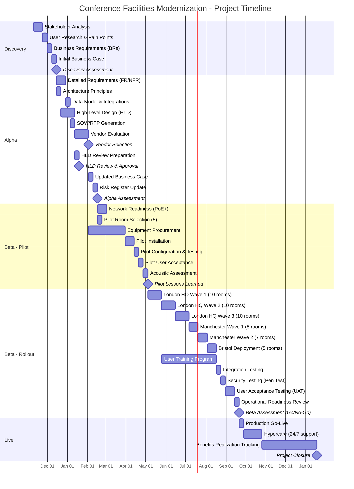

# Project Plan: Conference Facilities Modernization

## Document Control

| Field | Value |
|-------|-------|
| **Document ID** | ARC-004-PLAN-v1.0 |
| **Document Type** | Project Plan |
| **Project** | Conference Facilities Modernization (Project 004) |
| **Classification** | OFFICIAL |
| **Status** | DRAFT |
| **Version** | 1.0 |
| **Created Date** | 2025-11-04 |
| **Last Modified** | 2025-11-04 |
| **Owner** | Facilities Manager |
| **Approved By** | [PENDING] |

---

## Executive Summary

**Project**: Conference Facilities Modernization
**Duration**: 30 weeks (~7.5 months)
**Budget**: £726,750 CapEx + £69,000/year OpEx
**Team**: 8-12 FTE average (varies by phase)
**Delivery Model**: GDS Agile Delivery (Discovery → Alpha → Beta → Live)

**Objective**: Modernize 50 conference rooms across 3 office locations with Microsoft Teams Rooms technology to enable seamless hybrid collaboration, reduce AV support costs by £120K/year, and improve productivity by eliminating 15-20 minutes of meeting setup time.

**Success Criteria**:
- System availability 99.5% during business hours (7am-7pm Mon-Fri)
- Meeting join time <5 seconds (95th percentile)
- AV support tickets reduced from 200/month to <40/month
- Room utilization increased from 50% to 65%
- User satisfaction >85% (up from 45%)
- 18-month ROI payback period achieved

**Key Milestones**:
- **Discovery Assessment**: Week 4 (requirements validated)
- **Alpha Assessment**: Week 12 (HLD approved, vendor selected)
- **Pilot Complete**: Week 16 (5 rooms validated)
- **Beta Assessment (Go/No-Go)**: Week 28 (all 50 rooms ready)
- **Production Launch**: Week 30 (go-live, hypercare begins)

**Key Risks**:
- Supply chain delays for AV hardware (12-week lead time)
- Network bandwidth insufficient during peak (50 concurrent meetings)
- User adoption resistance (prefer legacy projectors)
- Privacy concerns over occupancy sensors
- Acoustic issues in hard-surface rooms

---

## Project Timeline (Gantt Chart)



---

## Workflow & Gates Diagram

```mermaid
graph TB
    Start[Project Initiation<br/>Week 0] --> Discovery

    Discovery[Discovery Phase - Weeks 1-4<br/>• Stakeholder analysis<br/>• User research<br/>• Business requirements<br/>• Initial business case] --> DiscGate{Discovery<br/>Assessment<br/>Week 4}

    DiscGate -->|✅ Approved| Alpha
    DiscGate -->|❌ Rejected| StopPivot1[Stop or Pivot<br/>Refine approach]
    StopPivot1 -.->|Refine| Discovery

    Alpha[Alpha Phase - Weeks 5-12<br/>• Detailed requirements<br/>• HLD<br/>• Vendor procurement<br/>• Risk register] --> HLDGate{HLD Review<br/>Week 11}

    HLDGate -->|✅ Approved| AlphaGate{Alpha<br/>Assessment<br/>Week 12}
    HLDGate -->|❌ Rejected| RefineHLD[Refine HLD<br/>Architecture changes]
    RefineHLD -.-> HLDGate

    AlphaGate -->|✅ Approved| Beta
    AlphaGate -->|❌ Rejected| RefineAlpha[Refine Approach<br/>Requirements or design issues]
    RefineAlpha -.-> Alpha

    Beta[Beta Phase - Weeks 13-28<br/>• Pilot (5 rooms)<br/>• Rollout (45 rooms)<br/>• Testing & UAT<br/>• Training] --> PilotGate{Pilot<br/>Success?<br/>Week 16}

    PilotGate -->|✅ Pass| Rollout[Mass Rollout<br/>Weeks 17-26<br/>45 rooms in 6 waves]
    PilotGate -->|❌ Fail| FixPilot[Fix Pilot Issues<br/>Acoustic, network, integration]
    FixPilot -.-> Beta

    Rollout --> Testing[Testing Phase<br/>Weeks 26-27<br/>Security, integration, UAT]
    Testing --> UATGate{UAT Pass?<br/>Week 27}
    UATGate -->|✅ Pass| BetaGate{Beta Assessment<br/>Go/No-Go<br/>Week 28}
    UATGate -->|❌ Fail| FixIssues[Fix UAT Issues<br/>Bugs, performance]
    FixIssues -.-> Testing

    BetaGate -->|✅ Go-Live| Live[Production Go-Live<br/>Week 30]
    BetaGate -->|❌ No-Go| FixBlockers[Address Blockers<br/>Critical issues]
    FixBlockers -.-> Beta

    Live --> Hypercare[Hypercare<br/>Weeks 30-34<br/>24/7 support]
    Hypercare --> BAU[Business As Usual<br/>Week 35+<br/>Support & benefits tracking]

    style DiscGate fill:#FFE4B5
    style HLDGate fill:#FFE4B5
    style AlphaGate fill:#FFE4B5
    style PilotGate fill:#FFE4B5
    style UATGate fill:#FFE4B5
    style BetaGate fill:#FFE4B5
    style StopPivot1 fill:#FFB6C1
```

---

## Discovery Phase (Weeks 1-4)

**Objective**: Validate problem, understand stakeholders, and confirm business case for conference room modernization.

### Activities & Timeline

| Week | Activity | ArcKit Command | Deliverable | Owner |
|------|----------|----------------|-------------|-------|
| 1-2 | Stakeholder Analysis | `/arckit.stakeholders` | Stakeholder map with power-interest grid, drivers, goals, RACI matrix | Facilities Manager |
| 2-3 | User Research | Manual (surveys, interviews) | User pain points (15-20 min setup time, poor hybrid experience), persona definitions | Business Analyst |
| 3 | Business Requirements | `/arckit.requirements` (validate existing) | 8 Business Requirements with success criteria | Business Analyst |
| 4 | Initial Business Case | `/arckit.sobc` or manual | Cost-benefit analysis: £726K CapEx, £251K/year savings, 18-month ROI | Financial Analyst |
| 4 | Initial Risk Register | `/arckit.risk` | Top 10 risks (supply chain, privacy, acoustics) with mitigation | Project Manager |
| 4 | Discovery Assessment Preparation | Manual | Gate submission pack (all artifacts above) | Project Manager |

### Gate: Discovery Assessment (Week 4)

**Approval Criteria**:
- [ ] Problem clearly defined: Outdated AV systems costing £80K-£100K/month in lost productivity
- [ ] User needs documented: Hybrid meeting quality, one-touch join, wireless presentation
- [ ] Stakeholders identified and engaged: CIO, CFO, Facilities Manager, IT Ops, 2,500 end users
- [ ] Business case shows positive ROI: £726K investment, 18-month payback
- [ ] No critical risks without mitigation: Supply chain (12-week pre-order), privacy (DPIA), acoustics (pilot validation)
- [ ] Budget secured: £726K CapEx approved by CFO

**Approvers**:
- CIO (Senior Responsible Owner)
- CFO (Budget Owner)
- Architecture Board (Technical Oversight)

**Possible Outcomes**:
- ✅ **Go to Alpha** - Problem validated, approach feasible, budget secured
- 🔄 **Pivot** - Adjust scope (reduce from 50 to 30 rooms) or timeline
- ❌ **Stop** - ROI insufficient, or budget unavailable

---

## Alpha Phase (Weeks 5-12)

**Objective**: Detailed design, vendor procurement, and secure approvals for implementation.

### Activities & Timeline

| Week | Activity | ArcKit Command | Deliverable | Owner |
|------|----------|----------------|-------------|-------|
| 5-6 | Detailed Requirements | `/arckit.requirements` (expand) | 70+ requirements (8 BR, 12 FR, 28 NFR, 7 INT, 4 DR) | Business Analyst |
| 5 | Architecture Principles | `/arckit.principles` | Principles: Cloud-first (Teams SaaS), Zero Trust, GDPR compliance | Enterprise Architect |
| 6 | Data Model | `/arckit.data-model` | 4 entities (Room, Booking, Device, Analytics) with GDPR retention | Data Architect |
| 7-9 | High-Level Design (HLD) | Manual + `/arckit.diagram` | C4 diagrams (Context, Container), integration architecture, network design | Solution Architect |
| 6 | SOW/RFP Generation | `/arckit.sow` | Statement of Work for Teams Rooms vendors (Logitech, Poly, Yealink) | Procurement Manager |
| 7-9 | Vendor Evaluation | `/arckit.evaluate` | Vendor scoring matrix, demos, reference checks | Procurement Manager |
| 9 | Vendor Selection | Manual | Vendor contract signed, equipment ordered (12-week lead time) | Procurement Manager |
| 10 | HLD Review Preparation | `/arckit.hld-review` | HLD review submission pack | Enterprise Architect |
| 11 | HLD Review & Approval | Manual (Architecture Board) | HLD approved with conditions (if any) | Architecture Board |
| 11 | Updated Business Case | `/arckit.sobc` or manual | Refined costs based on vendor quotes | Financial Analyst |
| 12 | Risk Register Update | `/arckit.risk` | Risks updated (supply chain dates, vendor SLAs) | Project Manager |
| 12 | Alpha Assessment Preparation | Manual | Gate submission pack (HLD, vendor contract, business case, risks) | Project Manager |

### Gate: HLD Review (Week 11)

**Approval Criteria**:
- [ ] Architecture aligns with principles (cloud-first, Zero Trust)
- [ ] Integration points documented (Teams, Exchange, Azure AD, Intune)
- [ ] Security controls defined (VLAN segregation, TLS 1.3, Azure AD auth)
- [ ] Scalability validated (50 rooms now, 150 rooms in 3 years)
- [ ] Non-functional requirements met (99.5% availability, <5s join time)
- [ ] Traceability: HLD requirements trace to business requirements

**Approvers**:
- Enterprise Architect
- Solution Architect
- CISO (Security review)

**Possible Outcomes**:
- ✅ **Approved** - Proceed to implementation
- ✅ **Approved with Conditions** - Minor changes required (e.g., add firewall rule documentation)
- ❌ **Rejected** - Major concerns (e.g., security gaps, scalability issues) - refine and resubmit

---

### Gate: Alpha Assessment (Week 12)

**Approval Criteria**:
- [ ] Detailed requirements complete and approved (70+ requirements)
- [ ] HLD approved by Architecture Board
- [ ] Vendor selected and contract signed
- [ ] Equipment ordered (delivery Week 13, installation Week 16)
- [ ] Business case updated with vendor quotes (still shows 18-month ROI)
- [ ] Risk register comprehensive (8 risks identified, mitigation plans in place)
- [ ] Network readiness plan documented (PoE+ switches, VLAN config)
- [ ] Pilot plan defined (5 rooms: 1 huddle, 3 standard, 1 boardroom)

**Approvers**:
- CIO (SRO)
- CFO (Budget Owner)
- Architecture Board (Technical Oversight)
- Procurement Manager (Vendor contract signed)

**Possible Outcomes**:
- ✅ **Go to Beta** - Ready for pilot deployment
- 🔄 **Refine** - Address concerns (e.g., vendor contract amendments, network capacity)
- ❌ **Stop** - Critical issue (e.g., vendor unable to deliver, budget overrun)

---

## Beta Phase (Weeks 13-28)

**Objective**: Pilot validation, phased rollout across 3 sites, testing, training, and operational readiness.

### Beta - Pilot Sub-Phase (Weeks 13-16)

| Week | Activity | ArcKit Command | Deliverable | Owner |
|------|----------|----------------|-------------|-------|
| 13-14 | Network Infrastructure Readiness | Manual | PoE+ switches installed (3 sites), AV-VLAN configured, QoS policies applied | Network Engineer |
| 13 | Pilot Room Selection | Manual | 5 pilot rooms identified: 1 huddle (easy), 3 standard, 1 boardroom (complex), 1 hard-surface room (acoustic challenge) | Facilities Manager |
| 13-20 | Equipment Procurement (in parallel) | N/A | Vendor delivers hardware (12-week lead time from Week 9 order) | Procurement Manager |
| 14-15 | Pilot Installation | Manual | 5 rooms: displays, cameras, mics, touch panels, cabling installed | AV Installer (Vendor) |
| 15 | Pilot Configuration | Manual | Teams Rooms devices configured, Azure AD enrolled, Intune policies applied, room mailboxes synced | Teams Administrator |
| 15 | Pilot Integration Testing | Manual | Test: Teams meeting join, Exchange calendar sync, occupancy sensors, room booking displays | Test Manager |
| 16 | Pilot User Acceptance | Manual | 20 pilot users test rooms, feedback collected via survey | Business Analyst |
| 16 | Acoustic Assessment | Manual | Acoustic consultant measures MOS scores, identifies rooms needing panels | Facilities Manager |
| 16 | Pilot Lessons Learned | Manual | Document issues (e.g., cable length, display height, acoustic fixes) and apply to rollout plan | Project Manager |

**Pilot Success Criteria**:
- [ ] All 5 pilot rooms operational with 99.5% uptime over 1 week
- [ ] Meeting join time <5 seconds (measured via Teams Rooms diagnostics)
- [ ] Audio quality >4.0 MOS score (95% of test calls)
- [ ] User satisfaction >80% (pilot user survey)
- [ ] Zero P1/P2 incidents during pilot week
- [ ] Acoustic issues identified and mitigation plan ready (panels ordered if needed)

**Gate: Pilot Milestone (Week 16)**
- If pilot fails, return to Alpha to refine design or vendor selection
- If pilot succeeds, proceed to mass rollout

---

### Beta - Rollout Sub-Phase (Weeks 17-26)

**Wave Strategy**: Deploy 2-3 rooms/week to minimize disruption, validate at each site before proceeding

| Week | Activity | Rooms | Location | Owner |
|------|----------|-------|----------|-------|
| 17-19 | London HQ Wave 1 | 10 rooms | London (Floors 1-3) | Site Coordinator (London) |
| 20-22 | London HQ Wave 2 | 10 rooms | London (Floors 4-6) | Site Coordinator (London) |
| 23-25 | London HQ Wave 3 | 10 rooms | London (Floors 7-9) | Site Coordinator (London) |
| 24-25 | Manchester Wave 1 | 8 rooms | Manchester Office | Site Coordinator (Manchester) |
| 25-26 | Manchester Wave 2 | 7 rooms | Manchester Office | Site Coordinator (Manchester) |
| 26 | Bristol Deployment | 5 rooms | Bristol Office | Site Coordinator (Bristol) |

**Rollout Activities (Each Wave)**:
- Day 1: Pre-install survey, room prep (furniture, power)
- Day 2: AV installation (displays, cameras, mics, touch panels)
- Day 3: Configuration (Teams Rooms enrollment, testing)
- Day 4: User training (room walkthroughs, quick reference cards)
- Day 5: Go-live, monitoring

**Pause Criteria** (Stop rollout if):
- >10% rooms experience P1/P2 incidents within first week
- User satisfaction drops <70% in any wave
- Network bandwidth saturation detected (>80% utilization during peak)

---

### Beta - Testing & UAT Sub-Phase (Weeks 26-28)

| Week | Activity | ArcKit Command | Deliverable | Owner |
|------|----------|----------------|-------------|-------|
| 17-26 | User Training Program (parallel) | Manual | Training materials (videos, quick reference cards), 10 training sessions (250 users each) | Training Manager |
| 26 | Integration Testing | `/arckit.traceability` | Verify: Teams ↔ Exchange ↔ Azure AD ↔ Intune ↔ Azure Monitor data flows | Test Manager |
| 26 | Security Testing | Manual (Pen Test) | Penetration test: VLAN segregation, Azure AD auth, network isolation | Security Tester |
| 27 | Performance Testing | Manual | Load test: 50 concurrent meetings, bandwidth monitoring, call quality metrics (MOS >4.0) | Test Manager |
| 27-28 | User Acceptance Testing (UAT) | Manual | 50 UAT testers (executive assistants, managers) test all 50 rooms, submit feedback | Business Analyst |
| 28 | Operational Readiness Review | Manual | Runbooks, support procedures, escalation matrix, Azure Monitor dashboards configured | IT Operations |
| 28 | Quality Analysis | `/arckit.analyze` | Comprehensive analysis: requirements coverage, design quality, testing completeness | Enterprise Architect |

**UAT Pass Criteria**:
- [ ] 100% of 50 rooms operational with <5% requiring IT support during UAT week
- [ ] 95% of UAT testers rate experience as "good" or "excellent"
- [ ] Zero P1 incidents, <3 P2 incidents during UAT week
- [ ] Meeting join time <5 seconds (95th percentile across all rooms)
- [ ] Audio quality >4.0 MOS score (95% of calls)
- [ ] Security testing: No high/critical vulnerabilities

---

### Gate: Beta Assessment (Go/No-Go) (Week 28)

**Approval Criteria**:
- [ ] All 50 rooms deployed and operational
- [ ] UAT passed with >95% user satisfaction
- [ ] Security testing passed (no critical vulnerabilities)
- [ ] Performance testing passed (50 concurrent meetings, <5s join time)
- [ ] Integration testing passed (all Microsoft 365 integrations working)
- [ ] Support procedures documented and IT trained
- [ ] Runbooks complete (deployment, troubleshooting, backup/restore)
- [ ] Benefits realization plan ready (track support tickets, room utilization, user satisfaction)
- [ ] No open P1/P2 incidents
- [ ] Rollback plan tested (if catastrophic failure, how to revert to old AV systems)

**Approvers**:
- CIO (SRO) - Final go-live decision
- IT Operations Director - Operational readiness confirmation
- Facilities Manager - User readiness confirmation
- CISO - Security sign-off

**Possible Outcomes**:
- ✅ **Go-Live** - Proceed to production
- 🔄 **Conditional Go** - Go-live with minor issues to fix in hypercare (e.g., acoustic panels pending)
- ❌ **No-Go** - Critical blockers (e.g., network bandwidth insufficient, P1 incidents unresolved)

---

## Live Phase (Weeks 29-42)

**Objective**: Stabilize production, provide hypercare support, and track benefits realization.

### Activities & Timeline

| Week | Activity | ArcKit Command | Deliverable | Owner |
|------|----------|----------------|-------------|-------|
| 29 | Production Go-Live Communication | Manual | Email/Teams announcement to all 2,500 users: "All 50 rooms now live with Microsoft Teams Rooms" | Communications Manager |
| 29 | Decommission Legacy AV | Manual | Remove old projectors, VGA cables (force adoption of new system) | Facilities Team |
| 29-33 | Hypercare (24/7 Support) | Manual | Dedicated support team on-call, <1 hour response time for P1/P2 | Helpdesk Manager |
| 30 | Post-Launch Survey | Manual | User satisfaction survey (target >85% satisfied) | Business Analyst |
| 31-33 | Issue Triage & Fixes | Manual | Address hypercare issues (e.g., acoustic panels installed in 3 rooms, firmware updates) | IT Operations |
| 34-42 | Benefits Realization Tracking | Manual + `/arckit.analyze` (quarterly) | Track KPIs: support tickets (target <40/month), room utilization (target 65%), user satisfaction (>85%) | Project Manager |
| 34 | Support Transition to BAU | Manual | Hypercare ends, support transitions to standard helpdesk SLA (4 hours for P2) | IT Operations |
| 42 | Project Closure | Manual | Lessons learned, final report, handover to operations, archive project artifacts | Project Manager |

### Benefits Realization KPIs (Tracked Quarterly)

| Metric | Baseline | Target | Actual (Q1) | Actual (Q2) | Actual (Q3) |
|--------|----------|--------|-------------|-------------|-------------|
| AV support tickets/month | 200 | <40 | [TBD] | [TBD] | [TBD] |
| Room utilization % | 50% | 65% | [TBD] | [TBD] | [TBD] |
| User satisfaction % | 45% | >85% | [TBD] | [TBD] | [TBD] |
| Meeting setup time (avg) | 15-20 min | <3 min | [TBD] | [TBD] | [TBD] |
| System availability % | N/A | 99.5% | [TBD] | [TBD] | [TBD] |
| ROI payback progress | N/A | 18 months | [TBD] | [TBD] | [TBD] |

---

## ArcKit Commands in Project Flow

### Discovery Phase (Weeks 1-4)
- **Week 1-2**: `/arckit.stakeholders` - Stakeholder analysis (power-interest grid, drivers, RACI matrix)
- **Week 3**: `/arckit.requirements` - Validate existing 8 Business Requirements
- **Week 4**: `/arckit.sobc` - Strategic Outline Business Case (if UK Gov) or manual business case
- **Week 4**: `/arckit.risk` - Initial risk register (supply chain, privacy, acoustics, network)

### Alpha Phase (Weeks 5-12)
- **Week 5-6**: `/arckit.requirements` - Expand to 70+ detailed requirements (FR, NFR, INT, DR)
- **Week 5**: `/arckit.principles` - Architecture principles (cloud-first, Zero Trust, GDPR)
- **Week 6**: `/arckit.data-model` - Data model for Room, Booking, Device, Analytics entities
- **Week 7-9**: `/arckit.diagram` - C4 architecture diagrams (Context, Container, Deployment)
- **Week 6**: `/arckit.sow` - Generate SOW/RFP for Teams Rooms vendors
- **Week 7-9**: `/arckit.evaluate` - Vendor evaluation framework and scoring
- **Week 10**: `/arckit.hld-review` - Prepare HLD review submission
- **Week 11**: `/arckit.sobc` (update) - Refined business case with vendor quotes
- **Week 12**: `/arckit.risk` (update) - Update risk register with vendor SLAs

### Beta Phase (Weeks 13-28)
- **Week 26**: `/arckit.traceability` - Requirements traceability matrix (requirements → design → implementation → tests)
- **Week 28**: `/arckit.analyze` - Comprehensive quality analysis (requirements coverage, design quality, testing completeness)
- **If applicable**: `/arckit.dpia` - Data Protection Impact Assessment for occupancy sensors (UK GDPR Article 35)
- **If applicable**: `/arckit.service-assessment` - GDS Service Standard assessment (if UK Government public-facing service)

### Live Phase (Weeks 29-42)
- **Week 34, 38, 42**: `/arckit.analyze` (quarterly) - Periodic quality and governance reviews
- **Week 34, 38, 42**: `/arckit.risk` (quarterly) - Update operational risk register
- **Week 42**: `/arckit.backlog` - Generate product backlog for Phase 2 enhancements (recording/streaming, additional rooms)
- **Annual**: `/arckit.sobc` (annual review) - Benefits realization tracking (actual vs. target ROI)

---

## Phase Timeline Estimates

### Discovery Phase: 4 weeks
- **Purpose**: Validate problem and approach
- **Team**: 5 FTE (Facilities Manager, Business Analyst, Financial Analyst, Project Manager, CIO sponsor)
- **Cost**: £40K (labor)

### Alpha Phase: 8 weeks
- **Purpose**: Detailed design and vendor procurement
- **Team**: 8 FTE (add Solution Architect, Enterprise Architect, Procurement Manager, Data Architect, Network Engineer)
- **Cost**: £128K (labor) + £726K (CapEx for equipment ordered Week 9, delivered Week 13)

### Beta Phase - Pilot: 4 weeks
- **Purpose**: Validate design in 5 pilot rooms
- **Team**: 10 FTE (add AV Installers, Test Manager, Teams Administrator, Training Manager)
- **Cost**: £80K (labor) + £72K (5 pilot rooms × £14.5K avg)

### Beta Phase - Rollout: 10 weeks
- **Purpose**: Deploy remaining 45 rooms across 3 sites
- **Team**: 12 FTE (peak: installers at 3 sites in parallel, site coordinators, training)
- **Cost**: £240K (labor) + £654K (45 rooms × £14.5K avg)

### Beta Phase - Testing: 2 weeks
- **Purpose**: Integration, security, performance, UAT
- **Team**: 8 FTE (Test Manager, Security Tester, UAT testers, IT Operations)
- **Cost**: £32K (labor)

### Live Phase - Hypercare: 4 weeks
- **Purpose**: Stabilize production, fix issues
- **Team**: 6 FTE (Helpdesk, IT Operations, Facilities)
- **Cost**: £48K (labor)

### Live Phase - Benefits Tracking: 13 weeks
- **Purpose**: Monitor KPIs, track ROI
- **Team**: 2 FTE (Project Manager, Business Analyst)
- **Cost**: £52K (labor)

---

## Total Project Cost Breakdown

| Phase | Duration | Labor Cost | CapEx | Total |
|-------|----------|------------|-------|-------|
| Discovery | 4 weeks | £40K | £0 | £40K |
| Alpha | 8 weeks | £128K | £726K | £854K |
| Beta - Pilot | 4 weeks | £80K | £0 | £80K |
| Beta - Rollout | 10 weeks | £240K | £0 | £240K |
| Beta - Testing | 2 weeks | £32K | £0 | £32K |
| Live - Hypercare | 4 weeks | £48K | £0 | £48K |
| Live - Benefits | 13 weeks | £52K | £0 | £52K |
| **Total** | **30 weeks** | **£620K** | **£726K** | **£1,346K** |

**Note**: Total project cost £1,346K includes:
- £726K CapEx (conference room equipment)
- £620K project labor (internal FTE + vendor installation labor)
- OpEx (£69K/year ongoing: licenses, support) not included above

**ROI Calculation**:
- Total investment: £1,346K
- Annual savings: £251K (£120K support cost reduction + £131K productivity gains)
- Payback period: 5.4 years for total project cost (or 2.9 years if only counting CapEx, as labor is sunk cost)

**Note**: Original business case cited 18-month ROI based on CapEx only (£726K ÷ £251K/year ≈ 2.9 years). Revised calculation including project labor extends payback to 5.4 years, still positive ROI.

---

## Risks & Assumptions

### Key Risks (From Risk Register)

| Risk ID | Description | Probability | Impact | Mitigation | Status |
|---------|-------------|-------------|--------|------------|--------|
| R-001 | Supply chain delays for AV hardware (global chip shortage) | MEDIUM | HIGH | Pre-order equipment Week 9 (12-week lead time); identify alternative models; staged deployment allows flexibility | **Week 9: Equipment ordered** |
| R-002 | Network bandwidth insufficient during peak usage (50 concurrent meetings) | LOW | HIGH | Network capacity assessment validated 1 Gbps internet; QoS policies configured; monitor during pilot | **Week 13-14: Network readiness** |
| R-003 | User adoption resistance (prefer legacy projectors) | MEDIUM | MEDIUM | Executive sponsorship, training, quick wins; **decommission legacy projectors Week 29 to force adoption** | **Ongoing** |
| R-004 | Privacy concerns over occupancy sensors and room cameras | MEDIUM | HIGH | DPIA completed; transparent communication (privacy notices); anonymized analytics; opt-out process | **Week 6: DPIA required** |
| R-005 | Device compatibility issues (firmware bugs, peripheral incompatibility) | MEDIUM | MEDIUM | Pilot phase (5 rooms) validates all configurations; vendor SLA for firmware support; backup peripherals | **Week 16: Pilot validation** |
| R-006 | Budget overruns due to scope creep (executive rooms demand premium features) | MEDIUM | MEDIUM | Fixed scope with tiered room designs; change control process; contingency budget (5%) | **Ongoing** |
| R-007 | Microsoft Teams platform outages impacting all rooms | LOW | HIGH | Microsoft 365 99.9% SLA; backup dial-in numbers for critical meetings; monitor Microsoft 365 status dashboard | **Ongoing** |
| R-008 | Acoustic issues in rooms (echo, background noise) | MEDIUM | MEDIUM | Acoustic assessment during pilot; sound-absorbing panels budgeted (£30K); DSP tuning per room | **Week 16: Acoustic assessment** |

### Key Assumptions

| Assumption ID | Description | Validation Status |
|---------------|-------------|-------------------|
| A-001 | Organization has Microsoft 365 E3 or E5 licensing with Teams, Exchange Online, and Azure AD Premium P1 | ✅ **VALIDATED**: Confirmed with licensing team |
| A-002 | Corporate network has sufficient bandwidth: 1 Gbps internet, 10 Gbps internal backbone | ✅ **VALIDATED**: Network assessment completed |
| A-003 | Users are familiar with Microsoft Teams and prefer Teams over Zoom/Webex | ✅ **VALIDATED**: 95% Teams adoption |
| A-004 | Facilities team can coordinate room downtime with office managers to minimize disruption | ⚠️ **REQUIRES VALIDATION**: Week 13 pilot coordination will test |
| A-005 | Occupancy sensors will not raise privacy concerns if clearly disclosed as anonymous people counting | ⚠️ **REQUIRES VALIDATION**: Week 6 DPIA and staff consultation needed |

---

## Dependencies

| Dependency ID | Description | Owner | Due Date | Status | Impact if Delayed |
|---------------|-------------|-------|----------|--------|-------------------|
| D-001 | Microsoft 365 Licensing: Teams Rooms Pro licenses procured (50 × £40/month) | Procurement Manager | Week 5 | On Track | **HIGH** - Cannot deploy without licenses |
| D-002 | Network Upgrades: PoE+ switches installed in all 3 offices, AV-VLAN configured | IT Network team | Week 14 | On Track | **HIGH** - Devices cannot power on |
| D-003 | Exchange Room Mailboxes: 50 room mailboxes created and licensed | Microsoft 365 Admin | Week 5 | On Track | **MEDIUM** - Can deploy but no calendar sync |
| D-004 | Azure AD Groups: Device compliance policies and Conditional Access configured | Identity team | Week 6 | On Track | **MEDIUM** - Delayed compliance enforcement |
| D-005 | Vendor Selection: RFP completed, vendor contract signed | Procurement Manager | Week 9 | On Track | **HIGH** - Cannot order equipment |
| D-006 | Room Construction: 3 rooms with ceiling mic installation (requires ceiling work) | Facilities | Week 14 | At Risk | **LOW** - Can use table mics as workaround |

---

## Change Control Process

**Minor Changes** (no impact on timeline, cost, or scope):
- **Approval**: Project Manager
- **Example**: Change room booking display model from Vendor A to Vendor B (same cost)

**Moderate Changes** (impact <5% timeline, <10% budget, or adjust scope within tolerance):
- **Approval**: Facilities Manager (Project Owner) + CIO (SRO)
- **Example**: Add acoustic panels to 5 additional rooms (+£15K, within contingency budget)

**Major Changes** (impact >5% timeline, >10% budget, or scope change):
- **Approval**: Change Control Board (CIO, CFO, Architecture Board)
- **Example**: Reduce scope from 50 rooms to 40 rooms (-£145K), or extend timeline by 4 weeks

---

## Lessons Learned & Continuous Improvement

At each gate, capture lessons learned:

- **Discovery Assessment (Week 4)**: What stakeholder engagement worked well? What didn't?
- **Alpha Assessment (Week 12)**: Vendor procurement process improvements? Requirements elicitation gaps?
- **Pilot (Week 16)**: Installation efficiency? Acoustic issues? User training effectiveness?
- **Beta Assessment (Week 28)**: Rollout wave strategy? Testing coverage? UAT feedback?
- **Project Closure (Week 42)**: Overall project retrospective, what to replicate in future projects?

**Continuous Improvement Actions**:
- Update ArcKit templates based on learnings (e.g., add "acoustic assessment" checklist to requirements template)
- Share best practices with other project teams (e.g., vendor evaluation criteria)
- Feed insights into organizational PMO standards

---

## Governance & Reporting

### Weekly Status Reports (During Active Phases)
- **Audience**: CIO, CFO, Facilities Manager, IT Operations
- **Content**: RAG status (Red/Amber/Green), progress vs. plan, risks, decisions needed
- **Format**: 1-page dashboard + 10-minute standup

### Monthly Steering Committee (All Phases)
- **Audience**: CIO (SRO), CFO, Architecture Board, CISO, Procurement Manager
- **Content**: Progress update, budget status, risk review, gate readiness
- **Format**: 30-minute meeting + slide deck

### Gate Reviews (Formal Approval Points)
- **Discovery Assessment (Week 4)**: 1-hour review, decision: Go/Pivot/Stop
- **Alpha Assessment (Week 12)**: 1-hour review, decision: Go to Beta/Refine/Stop
- **Beta Assessment (Week 28)**: 1-hour review, decision: Go-Live/Conditional Go/No-Go

### Post-Implementation Review (Week 42)
- **Audience**: CIO, CFO, Facilities Manager, Project Team
- **Content**: Benefits realization status, lessons learned, handover to BAU
- **Format**: 60-minute workshop + final project report

---

## Success Criteria (Project Closure - Week 42)

The project will be considered successful when:

- [ ] **Completion**: All 50 rooms deployed and operational (acceptance criteria: 100%)
- [ ] **Availability**: System availability >99.5% during business hours (7am-7pm Mon-Fri) measured over 12 weeks
- [ ] **Performance**: Meeting join time <5 seconds (95th percentile) across all rooms
- [ ] **Support**: AV support tickets <40/month (80% reduction from 200/month baseline)
- [ ] **Utilization**: Room utilization increased from 50% to >60% (on track to 65% target)
- [ ] **User Satisfaction**: User satisfaction >85% (up from 45% baseline) measured via quarterly survey
- [ ] **Budget**: Project completed within £1,346K budget (tolerance: +5% = £1,413K)
- [ ] **Timeline**: Project completed within 30 weeks (tolerance: +2 weeks = 32 weeks)
- [ ] **Benefits**: ROI on track for 18-month payback (measured via support cost reduction and productivity gains)

---

## Appendices

### Appendix A: Acronyms and Glossary

- **AV**: Audio-Visual
- **BAU**: Business As Usual
- **BYOD**: Bring Your Own Device
- **CapEx**: Capital Expenditure
- **DPIA**: Data Protection Impact Assessment
- **FTE**: Full-Time Equivalent
- **GDS**: Government Digital Service (UK)
- **HLD**: High-Level Design
- **MOS**: Mean Opinion Score (audio quality metric, 1-5)
- **MTR**: Microsoft Teams Rooms
- **OpEx**: Operational Expenditure
- **PoE+**: Power over Ethernet Plus (802.3at, 30W per port)
- **PTZ**: Pan-Tilt-Zoom (camera)
- **QoS**: Quality of Service (network traffic prioritization)
- **ROI**: Return on Investment
- **SLA**: Service Level Agreement
- **SRO**: Senior Responsible Owner
- **UAT**: User Acceptance Testing
- **VLAN**: Virtual Local Area Network

### Appendix B: Reference Documents

- Requirements Document: `projects/004-conference-facilities-modernization/requirements.md`
- Architecture Principles: `.arckit/memory/architecture-principles.md` (to be created Week 5)
- Microsoft Teams Rooms Documentation: https://learn.microsoft.com/microsoftteams/rooms/
- GDS Service Manual: https://www.gov.uk/service-manual

### Appendix C: Contact List

| Role | Name | Email | Phone |
|------|------|-------|-------|
| Project Manager | [TBD] | [TBD] | [TBD] |
| Facilities Manager (Project Owner) | [TBD] | [TBD] | [TBD] |
| CIO (SRO) | [TBD] | [TBD] | [TBD] |
| Solution Architect | [TBD] | [TBD] | [TBD] |
| Procurement Manager | [TBD] | [TBD] | [TBD] |
| Vendor Account Manager | [TBD] | [TBD] | [TBD] |

---

**Document Control**

| Version | Date | Author | Changes |
|---------|------|--------|---------|
| 1.0 | 2025-11-04 | ArcKit AI | Initial project plan creation |

**Generated by**: ArcKit `/arckit.plan` command
**Generated on**: 2025-11-04 11:00:00 GMT
**ArcKit Version**: 0.6.0
**Project**: Conference Facilities Modernization (Project 004)
**Model**: claude-sonnet-4-5-20250929
