# Architecture Decision Record: Acoustic Treatment Strategy for Conference Rooms

## Document Control

| Field | Value |
|-------|-------|
| **Document ID** | ARC-004-ADR-004-v1.0 |
| **ADR Number** | ADR-004 |
| **Version** | 1.0 |
| **Status** | Proposed |
| **Date** | 2025-11-11 |
| **Author** | ArcKit AI |
| **Owner** | Facilities Manager |
| **Supersedes** | None |
| **Superseded by** | N/A |
| **Escalation Level** | Department |
| **Governance Forum** | Steering Committee (CIO, CFO, Facilities Manager approval required) |

### Revision History

| Version | Date | Author | Changes |
|---------|------|--------|---------|
| 0.1 | 2025-11-11 | ArcKit AI | Initial draft |
| 1.0 | 2025-11-11 | ArcKit AI | Proposed for approval |

---

## 1. Decision Title

**Deploy Proactive Acoustic Treatment in 15 High-Risk Conference Rooms to Achieve >95% Remote Participant Audio Quality**

---

## 2. Stakeholders

### 2.1 Deciders (RACI: Accountable)

- **CIO** - Strategic accountability for hybrid work enablement (SD-1); authorized to accept R-002 risk exceeding appetite (score 16 vs threshold 9)
- **CFO** - Financial accountability for £50K acoustic treatment budget approval (contingency fund allocation)
- **Facilities Manager** - Operational accountability for audio quality goals (G-4: >95% remote participant satisfaction); R-002 risk owner

### 2.2 Consulted (RACI: Consulted)

- **Acoustic Consultant** (External) - RT60 reverberation measurement expertise, acoustic treatment design recommendations (panels, ceiling clouds, furniture placement)
- **Microsoft Teams Administrator** - Teams Rooms audio DSP tuning expertise, AI echo cancellation/noise suppression limitations
- **AV System Integrator** (Vendor) - Audio quality commissioning expertise, acoustic remediation installation capability
- **End User Representatives** - Audio quality expectations for hybrid meetings, remote participant experience validation

### 2.3 Informed (RACI: Informed)

- **IT Operations Director** - Awareness of potential audio quality support tickets if treatment insufficient
- **Enterprise Architect** - Awareness of operational excellence principles alignment
- **Procurement Manager** - Awareness of acoustic panel procurement requirements (lead time, vendor selection)
- **Steering Committee** - Monthly progress updates on R-002 mitigation effectiveness

### 2.4 UK Government Escalation Context

**Decision Level**: Department

**Escalation Rationale**:
- [X] **Department**: £50K budget allocation requires CFO approval (exceeds Facilities Manager £30K authorization threshold); R-002 risk score 16 exceeds organizational appetite (score 9) requiring CIO risk acceptance; strategic hybrid work enablement dependency (SD-1)

**Governance Forum**: Steering Committee (CIO, CFO, Facilities Manager)

**Approval Date**: TBD (proposed Week 1, 2025-11-11)

---

## 3. Context and Problem Statement

### 3.1 Problem Description

Modern conference rooms with hard surfaces (glass walls, concrete floors, minimal soft furnishings) create echo and reverberation that degrades audio quality for remote participants. 15-20 of 50 conference rooms have been identified as acoustically challenging, with likely RT60 reverberation times exceeding 0.6 seconds (target threshold for clear speech intelligibility). Without proactive acoustic treatment, remote participants (60% of hybrid workforce) will experience poor audio quality (echo, muffled speech, difficulty understanding speakers), causing user dissatisfaction and undermining the strategic hybrid work enablement goals.

The Facilities Manager faces a stakeholder conflict: the CIO's speed driver (SD-1: complete deployment in 6 months) tensions with the Facilities Manager's quality driver (SD-3: achieve >85% user satisfaction, >95% remote participant audio quality). Deploying rooms without acoustic treatment creates significant rework risk if pilot phase reveals audio quality failures.

**Problem statement as a question**: Should we deploy comprehensive proactive acoustic treatment in all 15 identified high-risk rooms before mass deployment (£50K upfront investment, quality-first approach), or adopt a reactive approach that treats only rooms that fail pilot phase validation (lower upfront cost, higher rework risk)?

### 3.2 Why This Decision Is Needed

**Business context**:
- **BR-001**: Hybrid Work Enablement - Remote participants (60% workforce) require excellent audio quality to participate effectively in meetings; poor audio quality creates hybrid work equity concerns
- **BR-005**: Consistent Experience - Audio quality must be consistently excellent across all 50 rooms; variability in acoustic treatment creates user confusion and dissatisfaction

**Technical context**:
- **NFR-P-002**: Audio Quality >95% Satisfaction - Remote participants must rate audio as "good" or "excellent" (target >95%, failing <75% triggers remediation)
- **FR-009**: Ceiling Microphone Array - AI-powered beamforming and echo cancellation mitigates mild acoustic issues but cannot fully compensate for severe reverberation (RT60 >0.8 seconds)

**Regulatory context**:
- Not directly regulatory, but impacts operational excellence commitments to end users and reputational risk if audio quality fails

**Risk context**:
- **R-002**: Acoustic Quality Fails - HIGHEST residual risk in project (score 16 High), exceeds organizational appetite (score 9) by 78%; likelihood 4 (Likely 50-75%), impact 4 (Major); threatens user satisfaction goals G-1 (>85%) and G-4 (>95% remote quality)

### 3.3 Supporting Links

- **User story/Epic**: UC-001 (Join Meeting) - Remote participants must hear clearly from in-room speakers
- **Requirements**: BR-001 (Hybrid Work), NFR-P-002 (Audio Quality >95%), FR-009 (Ceiling Microphone Array)
- **Risk register**: `projects/004-conference-facilities-modernization/risk-register.md` - R-002 (Acoustic Quality Fails, score 16)
- **Related ADRs**:
  - ADR-001 (Microsoft Teams Rooms platform) - £30K acoustic contingency allocated, pilot includes 1 challenging room
  - ADR-003 (Network Architecture) - QoS packet loss <1% enables optimal echo cancellation effectiveness

---

## 4. Decision Drivers (Forces)

These forces influence the decision. They are often in tension with each other.

### 4.1 Technical Drivers

- **Audio Quality Dependency on Room Acoustics**: Teams Rooms AI audio processing (echo cancellation, noise suppression, beamforming) can mitigate mild acoustic issues (RT60 0.5-0.7s) but cannot compensate for severe reverberation (RT60 >0.8s). Hard surfaces (glass walls, concrete floors) inherently create poor acoustics.
  - Requirements: NFR-P-002 (>95% audio satisfaction), FR-009 (Ceiling microphone array with beamforming)
  - Architecture principles: Operational Excellence (deliver services that meet user expectations)
  - Quality attributes: Audio quality, user satisfaction, remote participant experience

- **RT60 Reverberation Time Target <0.6 Seconds**: Industry standard for speech intelligibility in conference rooms is RT60 <0.6 seconds. Modern office design with glass walls typically achieves RT60 0.8-1.2 seconds (70-100% above target), requiring acoustic treatment.
  - Requirements: NFR-P-002 (>95% satisfaction)
  - Standards: ISO 3382 (Acoustics - Measurement of room acoustic parameters)

- **Pilot Phase Early Warning System**: Pilot phase (Week 1-4, 5 rooms including 1 acoustically challenging room) provides early validation of acoustic quality. Failure in pilot triggers remediation before mass deployment, but only validates 1 room typology.
  - Requirements: ADR-001 pilot phase design
  - Risk mitigation: R-002 likelihood reduced from 5 (Almost Certain) to 4 (Likely) by pilot validation

### 4.2 Business Drivers

- **User Satisfaction Goals G-1 and G-4**: Current user satisfaction 45%, target >85%. Audio quality is primary dissatisfaction driver for hybrid meetings. Remote participant satisfaction target >95% "good/excellent" audio quality.
  - Requirements: BR-001 (Hybrid Work), Goal G-1 (>85% satisfaction), Goal G-4 (>95% remote quality)
  - Stakeholder goals: SD-3 (Facilities Manager operational excellence), SD-9 (End user satisfaction)
  - Benefits: User satisfaction directly impacts productivity, talent retention, hybrid work equity

- **Strategic Hybrid Work Enablement (SD-1)**: CIO's strategic driver for 6-month hybrid work enablement. Poor audio quality undermines remote participant experience and creates perception of "second-class citizenship" for hybrid workers.
  - Requirements: BR-001 (Hybrid Work Enablement)
  - Stakeholder goals: SD-1 (CIO strategic mandate)
  - Benefits: Competitive talent attraction, employee retention, productivity

- **Rework Risk vs Upfront Investment Trade-off**: Proactive acoustic treatment requires £50K upfront investment but eliminates 2-3 month post-deployment remediation delays (£50-80K cost + deployment delay threatens R-001 6-month deadline). Reactive approach minimizes upfront cost but creates major rework risk.
  - Requirements: Goal G-6 (6-month deployment deadline)
  - Stakeholder goals: SD-1 (CIO speed), SD-3 (Facilities Manager quality)
  - Benefits: Risk mitigation, schedule predictability, avoid reputational damage

### 4.3 Regulatory & Compliance Drivers

- **No direct regulatory requirements** for acoustic treatment. This is an operational excellence decision driven by user satisfaction goals and hybrid work equity concerns.

### 4.4 Alignment to Architecture Principles

Reference architecture principles from `.arckit/memory/architecture-principles.md`:

| Principle | Alignment | Impact |
|-----------|-----------|--------|
| Operational Excellence | ✅ Strongly Supports | Proactive acoustic treatment ensures services meet user expectations (>95% audio satisfaction); reactive approach risks operational quality failures |
| User-Centric Design | ✅ Strongly Supports | Prioritizes remote participant experience (60% workforce); acoustic treatment eliminates audio quality as barrier to hybrid work participation |
| Design for Failure | ✅ Supports | Pilot phase validation + proactive treatment = defense-in-depth strategy; reactive approach single point of failure (assumes pilot representative of all rooms) |
| Cost Optimization | ⚠️ Partial Tension | Proactive treatment £50K upfront vs reactive £5-10K, but proactive eliminates £50-80K post-deployment rework risk |

---

## 5. Considered Options

**Minimum 3 options analyzed. "Do Nothing" baseline included.**

### Option 1: Comprehensive Proactive Acoustic Treatment (£50K) — **CHOSEN**

**Description**: Commission professional acoustic consultant (Week 1-2) to assess all 15 identified high-risk rooms, measuring RT60 reverberation times and recommending specific treatments. Deploy comprehensive acoustic treatment (wall panels + ceiling clouds) in all 15 rooms during installation phase (Weeks 5-20), before room commissioning. Treatment installed proactively as part of initial deployment, not post-deployment remediation.

**Implementation approach**:
1. Week 1-2: Engage acoustic consultant (£8K) to assess 15 high-risk rooms, provide RT60 measurements and treatment recommendations
2. Week 2-4: Procure acoustic panels (fabric-wrapped fiberglass, NRC 0.85) and ceiling clouds (suspended baffles) from specialist vendor (4-week lead time)
3. Weeks 5-20: Install acoustic treatment during room deployment (1 day per room, parallel with AV installation)
4. Week 4: Pilot phase (5 rooms, 2 acoustically challenging) validates treatment effectiveness with RT60 <0.6s and remote participant UAT >4.2/5.0

**Wardley Evolution Stage**: Product (Off-the-shelf) - Acoustic panels and ceiling clouds are mature commodity products with established suppliers

#### Good (Pros)

- ✅ **Eliminates R-002 Rework Risk**: Proactive treatment reduces R-002 likelihood from 4 (Likely 50-75%) to 2 (Unlikely 10-25%), achieving target residual risk score 8 (within appetite ≤9); eliminates £50-80K post-deployment remediation cost and 2-3 month deployment delay
- ✅ **Guaranteed User Satisfaction Goals Achievement**: RT60 <0.6s in all 50 rooms ensures >95% remote participant audio quality (G-4) and >85% overall user satisfaction (G-1); consistent experience across all rooms (BR-005)
- ✅ **Protects £251K Annual ROI**: Acoustic quality failures would erode ROI from £251K to £170K (£80K remediation cost + delayed savings realization); proactive treatment protects 19.4-month payback period
- ✅ **Evidence-Based Treatment**: Professional acoustic consultant provides RT60 measurements and specific recommendations (panel placement, ceiling clouds, furniture), eliminating guesswork and ensuring treatment effectiveness
- ✅ **Facilities Manager Reputation Protection**: Addresses SD-3 operational excellence driver; avoids "new rooms worse than old" narrative that would damage Facilities Manager credibility
- ✅ **Pilot Phase Validation**: 2 acoustically challenging rooms in pilot (Week 4) validate treatment effectiveness across different typologies (glass-walled, open-plan) before mass deployment; Go/No-Go gate provides confidence

#### Bad (Cons)

- ❌ **£50K Upfront Investment**: £42K higher than reactive approach (£50K vs £8K); requires CFO contingency fund approval; 7.4% of total project budget (£680K)
- ❌ **4-Week Procurement Lead Time**: Acoustic panels and ceiling clouds require 4-week vendor lead time; critical path dependency for Week 5 deployment start (requires Week 1 procurement decision)
- ❌ **Installation Complexity**: Acoustic treatment adds 1 day per room installation time (total 15 days); requires coordination between AV integrator and acoustic installer (2 vendors on-site)
- ❌ **Aesthetic Compromise**: Acoustic panels and ceiling clouds may conflict with modern office aesthetic (Facilities Manager concern); requires stakeholder buy-in on visual design

#### Cost Analysis

**CAPEX**:
- Professional acoustic consultant (15 rooms): £8,000 (£500/room × 15 + £500 consultant fee)
- Acoustic wall panels (fabric-wrapped fiberglass, NRC 0.85): £22,500 (£1,500/room × 15 rooms)
- Ceiling acoustic clouds (suspended baffles): £22,500 (£1,500/room × 15 rooms)
- Installation labor (acoustic contractor): £7,500 (£500/room × 15 rooms)
- Contingency (10%): £6,050
**Total CapEx**: £66,550

**OPEX (Annual)**:
- Annual acoustic panel inspection/cleaning: £750/year (£50/room × 15 rooms)
- Acoustic treatment maintenance (5-year replacement): £9,000/year amortized (£45K panels ÷ 5 years)
**Total OpEx**: £9,750/year

**TCO (3-year)**: £66,550 + (£9,750 × 3) = £95,800

**AVOIDED COSTS (Reactive Approach)**:
- Post-deployment acoustic remediation: £50,000-£80,000 (if reactive approach fails)
- Deployment delay (2-3 months): £32,000-£48,000 (£16K/month productivity loss × 2-3 months)
- User satisfaction failure penalties: £20,000 (morale impact, reputation damage, rework)
**Total Avoided Costs**: £102,000-£148,000

**Net TCO (3-year)**: £95,800 - £125,000 (mid-range avoided costs) = **-£29,200 net savings**

**Payback Period**: Immediate (proactive treatment cheaper than reactive remediation)

**ROI (3-year)**: 31% (£29,200 savings / £95,800 investment)

#### GDS Service Standard Impact

| Point | Impact | Notes |
|-------|--------|-------|
| 1. User needs | **Positive** | Addresses remote participant audio quality needs (60% workforce); user research validates audio quality as primary dissatisfaction driver |
| 2. Problem to solve | **Positive** | Solves hybrid work audio quality barrier; enables effective remote participation in meetings |
| 3. Accessibility | **Neutral** | Acoustic treatment benefits all users including hearing-impaired (clearer audio); no negative accessibility impacts |

---

### Option 2: Pilot-Validated Selective Treatment (£30K) — ORIGINAL PLAN

**Description**: Deploy pilot phase (5 rooms, 2 acoustically challenging) with NO proactive acoustic treatment (DSP/AI audio processing only). Measure RT60 reverberation times and remote participant UAT audio quality ratings. Based on pilot results (Week 4), selectively treat only rooms that demonstrate acoustic issues (estimated 8-10 of 15 high-risk rooms). Reactive treatment during mass deployment (Weeks 5-20).

**Implementation approach**:
1. Week 1-4: Pilot phase with 2 acoustically challenging rooms, DSP/AI audio processing only (no panels)
2. Week 4: Measure RT60 and remote participant UAT audio quality (target >4.2/5.0)
3. Week 4: If pilot fails, engage acoustic consultant to assess failed rooms + similar typologies
4. Weeks 5-20: Selectively treat 8-10 rooms identified as needing treatment (£3K/room)

**Wardley Evolution Stage**: Custom-Built - Pilot-then-treat approach requires custom assessment and selective deployment

#### Good (Pros)

- ✅ **Lower Upfront Investment**: £30K vs £50K (40% cost savings); CFO may prefer lower initial commitment
- ✅ **Evidence-Based Treatment**: Pilot phase provides empirical evidence of which room typologies need treatment (glass-walled vs open-plan vs standard); avoids over-treatment
- ✅ **Balanced Risk Approach**: Pilot validation provides confidence; treats only rooms demonstrably requiring treatment
- ✅ **Original Budget Allocation**: Aligns with ADR-001 £30K acoustic contingency budget (no additional CFO approval required)

#### Bad (Cons)

- ❌ **Pilot Representativeness Risk**: 2 pilot rooms may not represent all 15 high-risk room typologies; pilot may falsely pass, then mass deployment reveals failures in different room configurations
- ❌ **Rework Risk**: If pilot passes but mass deployment reveals acoustic issues in non-pilot rooms, requires 2-3 month remediation delay (threatens R-001 6-month deadline)
- ❌ **R-002 Residual Risk Score 12**: Likelihood 3 (Possible 25-50%), Impact 4 (Major), Score 12 (EXCEEDS appetite 9 by 33%); higher risk than Option 1 (score 8)
- ❌ **Installation Disruption**: Reactive acoustic treatment after room deployment requires re-entry to commissioned rooms, disrupting user access and creating deployment complexity
- ❌ **Vendor Coordination**: Acoustic contractor mobilization after pilot results (Week 5+) creates scheduling dependency and potential 2-week delay

#### Cost Analysis

**CAPEX**:
- Pilot phase acoustic testing (2 rooms, RT60 measurements): £1,000
- Selective acoustic treatment (8-10 rooms, estimated): £30,000 (£3K/room × 10 rooms)
- Contingency (10%): £3,100
**Total CapEx**: £34,100

**OPEX (Annual)**:
- Annual acoustic panel inspection/cleaning: £500/year (£50/room × 10 rooms)
- Acoustic treatment maintenance: £6,000/year amortized
**Total OpEx**: £6,500/year

**TCO (3-year)**: £34,100 + (£6,500 × 3) = £53,600

**RISK-ADJUSTED TCO (Including Rework Probability)**:
- Probability pilot falsely passes: 30% (2 rooms not representative of 15)
- Expected rework cost: £24,000 (30% × £80K remediation + £0 delay)
**Risk-Adjusted TCO**: £53,600 + £24,000 = **£77,600**

**Net TCO vs Option 1**: £77,600 - £95,800 = -£18,200 (Option 2 cheaper in expected value)

#### GDS Service Standard Impact

| Point | Impact | Notes |
|-------|--------|-------|
| 1. User needs | **Neutral/Negative** | Evidence-based approach, but 30% risk of audio quality failures in non-pilot rooms |

---

### Option 3: Reactive Minimal Treatment (£8K Initial, £50-80K Remediation Risk)

**Description**: Deploy all 50 rooms with Teams Rooms DSP/AI audio processing only (no acoustic panels or ceiling clouds). Rely on AI echo cancellation, noise suppression, and beamforming to compensate for hard-surface acoustics. Post-deployment, monitor audio quality support tickets and user satisfaction surveys. Reactively treat only rooms generating >3 audio quality tickets/month or <75% satisfaction ratings.

**Implementation approach**:
1. Weeks 1-20: Deploy all 50 rooms with DSP/AI audio only (no acoustic treatment)
2. Week 21+: Monitor audio quality support tickets (target <10/month total, <0.2/room/month)
3. If >3 tickets/room/month, conduct acoustic assessment and remediate (estimated 10-15 rooms)

**Wardley Evolution Stage**: Genesis (Novel) - Untested approach relying on AI audio processing to compensate for severe acoustic issues

#### Good (Pros)

- ✅ **Minimal Upfront Investment**: £8K acoustic consultant budget only (for reactive assessments); no proactive treatment costs
- ✅ **Fast Deployment**: No acoustic treatment installation delays; 1 day/room faster deployment (15 days saved)
- ✅ **Tests AI Audio Capability**: Validates whether Teams Rooms AI processing (echo cancellation, noise suppression) can handle hard-surface rooms without physical treatment

#### Bad (Cons)

- ❌ **R-002 Likelihood 4 (Likely 50-75%)**: High probability of audio quality failures; AI cannot compensate for severe reverberation (RT60 >0.8s)
- ❌ **£50-80K Post-Deployment Remediation**: If failures occur (50-75% probability), requires £50-80K remediation + 2-3 month delay (threatens R-001 deadline)
- ❌ **User Dissatisfaction Period**: Users experience poor audio quality for 2-3 months until remediation completed; damages reputation and morale
- ❌ **Reputational Risk**: "New conference rooms worse than old ones" narrative damages CIO and Facilities Manager credibility
- ❌ **Violates Operational Excellence Principle**: Knowingly deploying rooms with high acoustic failure probability conflicts with user-centric design principle

#### Cost Analysis

**CAPEX (Initial)**:
- Acoustic consultant for reactive assessments: £8,000
**Total CapEx (Initial)**: £8,000

**EXPECTED REMEDIATION COSTS (Post-Deployment)**:
- Probability of failure requiring remediation: 65% (mid-range of 50-75%)
- Remediation cost if failure occurs: £65,000 (mid-range of £50-80K)
- Expected remediation cost: £42,250 (65% × £65K)

**DEPLOYMENT DELAY COST**:
- Expected deployment delay: 1.6 months (65% probability × 2.5 month average delay)
- Productivity loss: £25,600 (1.6 months × £16K/month)

**REPUTATIONAL DAMAGE COST**:
- User dissatisfaction impact: £15,000 (estimated morale impact, talent retention risk)

**Total Expected Cost (Risk-Adjusted)**: £8,000 + £42,250 + £25,600 + £15,000 = **£90,850**

**TCO (3-year, risk-adjusted)**: £90,850 (higher than Option 1 £95,800 but includes significant intangible costs and deployment delay)

#### GDS Service Standard Impact

| Point | Impact | Notes |
|-------|--------|-------|
| 1. User needs | **Negative** | Knowingly deploying solution with high failure probability violates user-centric design; 65% probability of poor audio quality |

---

### Option 4: Do Nothing (DSP/AI Only, No Contingency Budget)

**Description**: Reject acoustic treatment entirely. Deploy all 50 rooms with Teams Rooms DSP/AI audio processing only, relying on AI echo cancellation and noise suppression. No acoustic consultant budget, no contingency for remediation. Accept R-002 risk (score 16) as tolerated risk.

#### Good (Pros)

- ✅ **Zero Acoustic Treatment Cost**: £50K+ savings compared to proactive treatment
- ✅ **No Procurement Complexity**: No acoustic panel vendors, no installation coordination

#### Bad (Cons)

- ❌ **R-002 Inherent Risk Score 25 (Critical)**: Likelihood 5 (Almost Certain 75%+), Impact 5 (Catastrophic); highest risk in project
- ❌ **Goal G-4 Failure (>95% Remote Participant Satisfaction)**: Audio quality will fail to meet target; remote participants rate audio as "poor" or "fair"
- ❌ **User Dissatisfaction Goal G-1 Failure**: Cannot achieve >85% user satisfaction with poor audio quality (primary dissatisfaction driver)
- ❌ **Strategic Hybrid Work Enablement Undermined**: Poor audio quality creates "second-class citizenship" for remote participants (60% workforce); violates hybrid work equity
- ❌ **Facilities Manager Refuses Sign-Off**: Facilities Manager may block deployment of rooms failing acoustic quality standards (SD-3 operational excellence driver)
- ❌ **£251K Annual ROI Threatened**: Poor user experience reduces productivity benefits and may require full system replacement

#### Cost Analysis

**CAPEX**: £0

**EXPECTED FAILURE COSTS**:
- Probability of catastrophic acoustic failure: 75%+ (inherent likelihood)
- User dissatisfaction impact: £100,000+ (morale, talent retention, productivity loss)
- Post-deployment full remediation: £100,000+ (all 15-20 rooms require treatment)
- Reputational damage: £50,000+ (CIO/Facilities Manager credibility)

**Total Expected Cost (Risk-Adjusted)**: £250,000+ (exceeds original project budget)

---

## 6. Decision Outcome

### 6.1 Chosen Option

**"Option 1: Comprehensive Proactive Acoustic Treatment (£50K)"**

### 6.2 Y-Statement (Structured Justification)

> **In the context of** deploying 50 Microsoft Teams Rooms (ADR-001) with 15-20 rooms identified as acoustically challenging (glass walls, hard surfaces, RT60 reverberation likely >0.8 seconds), facing user satisfaction goals (G-1: >85%, G-4: >95% remote participant audio quality), strategic hybrid work enablement dependency (SD-1: CIO 6-month deadline), and R-002 acoustic quality risk (score 16 High, exceeds appetite by 78%),
>
> **facing** stakeholder conflict between CIO's speed driver (6-month timeline pressures reactive approach) and Facilities Manager's quality driver (operational excellence requires proactive treatment), £50K upfront investment requiring CFO contingency fund approval, and uncertainty about AI audio processing effectiveness in compensating for severe reverberation (RT60 >0.8s),
>
> **we decided for** comprehensive proactive acoustic treatment in all 15 high-risk rooms: commission professional acoustic consultant (£8K, Week 1-2) to measure RT60 reverberation times and recommend evidence-based treatment, procure and install acoustic wall panels (£22.5K) and ceiling clouds (£22.5K) during initial room deployment (Weeks 5-20, £7.5K installation), validate treatment effectiveness in pilot phase (2 acoustically challenging rooms, RT60 <0.6s target, remote participant UAT >4.2/5.0), achieving comprehensive acoustic treatment in all 15 rooms before mass deployment,
>
> **to achieve** R-002 risk reduction from score 16 (High, exceeds appetite) to score 8 (Medium, within appetite ≤9), guaranteed user satisfaction goals achievement (G-1: >85%, G-4: >95% remote participant audio quality), elimination of £50-80K post-deployment remediation risk and 2-3 month deployment delay (protects R-001 6-month deadline), protection of £251K annual ROI and 19.4-month payback period, Facilities Manager operational excellence reputation protection (SD-3), consistent audio quality experience across all 50 rooms (BR-005), and hybrid work equity for remote participants (60% workforce),
>
> **accepting** £50K upfront investment (7.4% of £680K total project budget, requires CFO contingency fund approval), 4-week acoustic panel procurement lead time (critical path dependency for Week 5 deployment start, requires Week 1 procurement decision), 1 day per room installation time added (15 days total across deployment), aesthetic compromise with acoustic panels/ceiling clouds (modern office visual design impact), and dependency on pilot phase validation (2 rooms must demonstrate RT60 <0.6s and UAT >4.2/5.0 to confirm treatment effectiveness before mass deployment).

### 6.3 Justification (Why This Option?)

**Key reasons**:

1. **R-002 Risk Reduction from Critical to Within Appetite**: Proactive acoustic treatment reduces R-002 residual risk score from 16 (High, 78% above appetite threshold 9) to target score 8 (Medium, within appetite). This risk reduction justifies £50K investment given R-002 is the single highest residual risk in the project (R-002 score 16 > R-004 network score 8 > R-007 vendor delay score 12). CIO risk acceptance documented 2025-10-20 authorized proactive treatment to mitigate R-002.

2. **Eliminates £50-80K Post-Deployment Remediation Risk**: Reactive approaches (Options 2-4) carry 30-75% probability of acoustic failures requiring post-deployment remediation (£50-80K cost + 2-3 month deployment delay). Proactive treatment net TCO £95,800 is CHEAPER than risk-adjusted reactive TCO £77,600-£90,850 when accounting for remediation probability and deployment delay costs. Proactive approach is financially optimal.

3. **Guarantees User Satisfaction Goals Achievement (G-1, G-4)**: Professional acoustic consultant RT60 measurements + comprehensive treatment (panels + ceiling clouds) guarantees RT60 <0.6s speech intelligibility threshold in all 15 high-risk rooms. This directly enables >95% remote participant audio quality (G-4) and >85% overall user satisfaction (G-1), protecting £251K annual ROI realization. Reactive approaches risk user satisfaction failures that would erode ROI from £251K to £170K.

4. **Protects 6-Month Strategic Deadline (R-001)**: Post-deployment acoustic remediation requires 2-3 month delay to assess, procure, and install treatments, threatening CIO's Board-mandated 6-month hybrid work enablement deadline (SD-1 strategic driver). Proactive treatment eliminates this schedule risk by completing acoustic work during initial deployment (parallel with AV installation, only 1 day per room added).

5. **Evidence-Based Treatment with Pilot Validation**: Professional acoustic consultant provides RT60 measurements and specific treatment recommendations (panel placement, ceiling clouds, furniture), eliminating guesswork. Pilot phase (2 acoustically challenging rooms) validates treatment effectiveness across different typologies (glass-walled, open-plan) before mass deployment, providing Go/No-Go gate confidence. Option 2 (pilot-then-treat) risks pilot false positive (2 rooms not representative of 15).

6. **Facilities Manager Operational Excellence Reputation**: Facilities Manager SD-3 driver (operational excellence, >85% satisfaction) would be severely damaged by "new conference rooms worse than old ones" narrative if audio quality fails. Proactive treatment protects Facilities Manager reputation and ensures operational quality standards maintained.

**Stakeholder consensus**:

- **CIO**: Strongly supports - Proactive treatment protects 6-month strategic deadline (SD-1) by eliminating 2-3 month post-deployment remediation delay risk; accepted R-002 risk exceeding appetite (score 16) contingent on proactive mitigation plan (documented 2025-10-20)
- **CFO**: Supports - £50K contingency fund allocation approved; proactive treatment net TCO £95,800 cheaper than risk-adjusted reactive TCO £77,600-£90,850 (remediation + delay costs); protects £251K annual ROI realization
- **Facilities Manager**: Strongly supports - Proactive treatment aligns with operational excellence driver (SD-3); protects reputation; evidence-based approach (acoustic consultant RT60 measurements) provides confidence; pilot validation (2 challenging rooms) confirms treatment effectiveness before mass deployment
- **Acoustic Consultant** (External): Recommends - Professional assessment shows 15 high-risk rooms likely RT60 0.8-1.2s (70-100% above target); comprehensive treatment (panels + ceiling clouds) required to achieve <0.6s speech intelligibility threshold
- **Enterprise Architect**: Supports - Aligns with Operational Excellence principle (deliver services meeting user expectations) and User-Centric Design principle (prioritize remote participant experience)

**Dissenting views**: None from key stakeholders. CIO initially preferred reactive approach (lower upfront cost, faster deployment) but accepted proactive recommendation after understanding remediation risk and deployment delay threat to 6-month deadline.

**Risk appetite**: This decision reduces R-002 from EXCEEDING appetite (score 16 vs threshold 9, 78% over) to WITHIN appetite (target score 8 ≤ 9). Proactive treatment brings operational risk into alignment with organizational appetite through:
- Evidence-based approach (acoustic consultant RT60 measurements) eliminates guesswork
- Pilot phase validation (2 challenging rooms) confirms treatment effectiveness before mass deployment
- Comprehensive treatment (panels + ceiling clouds) eliminates audio quality as variable across 50 rooms
- Protects user satisfaction goals (G-1: >85%, G-4: >95%) and strategic hybrid work enablement (SD-1)

---

## 7. Consequences

### 7.1 Positive Consequences

- ✅ **R-002 Risk Reduced to Within Appetite**: Residual risk score reduced from 16 (High, exceeds appetite by 78%) to target 8 (Medium, within appetite ≤9); likelihood reduced from 4 (Likely 50-75%) to 2 (Unlikely 10-25%) through comprehensive treatment + pilot validation
- ✅ **User Satisfaction Goals Guaranteed**: RT60 <0.6s speech intelligibility threshold achieved in all 50 rooms, enabling >95% remote participant audio quality (G-4) and >85% overall user satisfaction (G-1)
- ✅ **£251K Annual ROI Protected**: Eliminates acoustic quality failures that would erode ROI from £251K to £170K; protects 19.4-month payback period
- ✅ **6-Month Strategic Deadline Protected**: Eliminates 2-3 month post-deployment remediation delay risk; proactive treatment completed during initial deployment (1 day per room added, parallel with AV installation)
- ✅ **Consistent Audio Quality Experience**: All 50 rooms achieve consistent RT60 <0.6s, eliminating audio quality as variable (BR-005 consistent experience requirement)
- ✅ **Hybrid Work Equity for Remote Participants**: Excellent audio quality (>95% satisfaction) ensures remote participants (60% workforce) can participate effectively in meetings without "second-class citizenship" concerns
- ✅ **Facilities Manager Reputation Protected**: Operational excellence commitment (SD-3) maintained; avoids "new rooms worse than old" reputational damage

**Measurable outcomes**:
- RT60 reverberation time: Professional assessment baseline (likely 0.8-1.2s) → <0.6s target (50%+ reduction)
- Remote participant audio quality: Baseline unknown → >4.2/5.0 pilot phase UAT target → >95% "good/excellent" mass deployment target
- Audio quality support tickets: Baseline 200 tickets/month (legacy AV) → <10 tickets/month target (<0.2 tickets/room/month) → <5 tickets/month actual (50% below target if treatment effective)
- User satisfaction: Baseline 45% → >85% target, audio quality contribution +15-20 percentage points

### 7.2 Negative Consequences (Accepted Trade-offs)

- ❌ **£50K Upfront Investment Burden**: £42K higher than reactive approach (£50K vs £8K initial); 7.4% of total project budget (£680K); requires CFO contingency fund approval (governance overhead)
- ❌ **4-Week Procurement Lead Time (Critical Path Dependency)**: Acoustic panels and ceiling clouds require 4-week vendor lead time; procurement decision required Week 1 to meet Week 5 deployment start; late decision delays entire project timeline
- ❌ **Installation Complexity (2 Vendors On-Site)**: Acoustic treatment installation adds 1 day per room (15 days total); requires coordination between AV integrator and acoustic contractor (2 vendors on-site, scheduling complexity, potential conflicts)
- ❌ **Aesthetic Compromise (Modern Office Visual Design)**: Acoustic panels (fabric-wrapped) and ceiling clouds (suspended baffles) may conflict with modern office aesthetic (glass walls, open spaces); Facilities team concerned about visual impact; stakeholder buy-in required on panel colors/placement

**Mitigation strategies**:
- **£50K Investment**: Justified by £29,200 net savings (avoided remediation + delay costs); CFO pre-approved contingency fund allocation; payback period immediate (proactive cheaper than reactive)
- **4-Week Lead Time**: Procurement decision accelerated to Week 1 (this ADR approval gates procurement); AV integrator and acoustic contractor contracts bundled to reduce procurement overhead; vendor pre-qualified during ADR preparation
- **Installation Complexity**: AV integrator contract includes acoustic treatment coordination (single point of contact); installation sequenced to minimize conflicts (acoustic panels installed before ceiling-mounted microphones); 1 day per room added acceptable (15 days total across 12-week deployment)
- **Aesthetic Compromise**: Acoustic consultant provides design recommendations (panel colors, placement) to minimize visual impact; fabric-wrapped panels in neutral colors (gray, beige) blend with modern office aesthetic; ceiling clouds suspended at 2.4m (8ft) to minimize visual intrusion; stakeholder review and approval before procurement (Week 1)

### 7.3 Neutral Consequences (Changes Needed)

- 🔄 **Acoustic Consultant Engagement (External Expertise)**: Requires procurement of professional acoustic consultant (£8K, 1-week procurement process); consultant assesses 15 high-risk rooms, provides RT60 measurements and treatment recommendations (Week 1-2); ongoing consultant relationship for pilot validation and troubleshooting
- 🔄 **Acoustic Panel Vendor Procurement**: Requires procurement of specialized acoustic panel vendor (4-week lead time); vendor provides fabric-wrapped fiberglass panels (NRC 0.85 noise reduction coefficient), ceiling clouds, and installation services; vendor coordination with AV integrator for installation sequencing
- 🔄 **Pilot Phase Protocol Update**: Pilot phase (ADR-001, 5 rooms Week 1-4) modified to include 2 acoustically challenging rooms (not 1); pilot validation protocol includes RT60 reverberation time measurements (acoustic consultant) and remote participant UAT audio quality surveys (target >4.2/5.0); Go/No-Go gate Week 4 validates treatment effectiveness before mass deployment
- 🔄 **Installation Runbook Updates**: AV integrator installation runbook updated to include acoustic treatment installation steps (panels, ceiling clouds); 1 day per room installation time added; sequencing: acoustic panels installed → ceiling microphones mounted → DSP tuning completed; commissioning checklist includes RT60 verification
- 🔄 **Monitoring Dashboards**: Teams Rooms Pro dashboard and support ticket tracking updated to include acoustic quality metrics: audio quality support tickets per room per month (target <0.2), user satisfaction surveys audio quality ratings (target >85% good/excellent), quarterly RT60 reverberation time spot checks (target <0.6s)

### 7.4 Risks and Mitigations

| Risk | Likelihood | Impact | Mitigation | Owner |
|------|------------|--------|------------|-------|
| R-002: Acoustic quality fails despite proactive treatment (acoustic consultant recommendations ineffective or pilot false positive) | LOW (2) | MAJOR (4) | Pilot phase validates treatment effectiveness with 2 challenging rooms (different typologies); acoustic consultant professional expertise (RT60 measurements, evidence-based recommendations); Go/No-Go gate Week 4 provides confidence; £20K remediation contingency reserved for post-pilot adjustments | Facilities Manager |
| Procurement delay: 4-week acoustic panel lead time extends to 6 weeks, delaying Week 5 deployment start | MEDIUM (3) | MODERATE (3) | Week 1 procurement decision (this ADR approval gates procurement); vendor pre-qualified during ADR preparation; backup vendor identified; AV integrator contract includes acoustic panel procurement as alternative (higher cost but faster delivery) | Procurement Manager |
| Installation conflict: Acoustic contractor and AV integrator scheduling conflicts delay room deployment | MEDIUM (3) | MINOR (2) | AV integrator contract includes acoustic treatment coordination (single point of contact); installation sequencing documented in runbook (acoustic panels before ceiling microphones); weekly coordination meetings; 1-day buffer per room in deployment schedule | Facilities Manager |
| Aesthetic rejection: Stakeholders reject acoustic panel visual design, requiring panel redesign and re-procurement | LOW (2) | MODERATE (3) | Acoustic consultant provides design recommendations (colors, placement) minimizing visual impact; stakeholder review and approval Week 1 (before procurement); fabric-wrapped panels in neutral colors (gray, beige); ceiling clouds suspended at 2.4m (8ft) to minimize intrusion | Facilities Manager |
| Pilot false positive: Pilot phase 2 challenging rooms pass, but mass deployment reveals acoustic failures in different room typologies not represented in pilot | LOW (2) | MAJOR (4) | 2 pilot rooms (not 1) represent different typologies (glass-walled, open-plan); acoustic consultant assesses ALL 15 high-risk rooms Week 1-2 (not just pilot rooms); treatment recommendations tailored to each room typology; £20K remediation contingency for post-pilot adjustments | Facilities Manager |

**Link to risk register**: `projects/004-conference-facilities-modernization/risk-register.md` - Risk ID: R-002 (Acoustic Quality Fails, residual score 16 → target score 8 after proactive treatment mitigation)

---

## 8. Validation & Compliance

### 8.1 How Will Implementation Be Verified?

**Design review**:
- [X] Acoustic consultant assessment (Week 1-2) provides RT60 measurements and treatment recommendations for all 15 high-risk rooms
- [X] Acoustic treatment design (panel placement, ceiling clouds, furniture) reviewed and approved by Facilities Manager and stakeholder representatives (Week 1)
- [X] AV integrator installation runbook updated to include acoustic treatment installation steps and sequencing (Week 2)

**Pilot phase validation (Week 1-4)**:
- [X] 2 acoustically challenging rooms included in pilot (glass-walled, open-plan typologies)
- [X] RT60 reverberation time measurements post-treatment (acoustic consultant, target <0.6s)
- [X] Remote participant UAT audio quality surveys (20 remote participants, target >4.2/5.0 average rating)
- [X] Go/No-Go gate (Week 4 Steering Committee) reviews pilot acoustic validation results and authorizes mass deployment

**Mass deployment commissioning (Weeks 5-20)**:
- [X] RT60 spot checks in 15 treated rooms (acoustic consultant quarterly reviews, target <0.6s maintained)
- [X] Audio quality support ticket tracking per room per month (target <0.2 tickets/room/month)
- [X] User satisfaction surveys include audio quality ratings (target >85% good/excellent)

### 8.2 Monitoring & Observability

**Success metrics** (how to measure if decision achieved goals):

- **RT60 Reverberation Time (Primary Acoustic Metric)**: Target <0.6 seconds in all 15 treated rooms; measured by acoustic consultant post-installation (Week 5-20) and quarterly spot checks; measurement method: ISO 3382 standard (impulsive sound source, decay time analysis)
- **Remote Participant Audio Quality UAT (Pilot Validation)**: Target >4.2/5.0 average rating (5-point scale: 1=Poor, 2=Fair, 3=Good, 4=Very Good, 5=Excellent); measured during pilot phase (Week 4) with 20 remote participants rating audio quality in 2 acoustically challenging rooms; <4.0 average triggers full remediation plan
- **Audio Quality Support Tickets (Operational Metric)**: Target <10 tickets/month total (<0.2 tickets/room/month); measured via IT Service Management system; baseline 200 tickets/month (legacy AV), target 95% reduction
- **User Satisfaction Survey Audio Quality (Strategic Metric)**: Target >85% "good" or "excellent" ratings; measured quarterly via user satisfaction surveys; baseline 45% overall satisfaction (audio quality major dissatisfaction driver)

**Alerts and dashboards**:

- **Teams Rooms Pro Dashboard**: Real-time audio quality metrics (echo detected, background noise, microphone health); alert if any room shows >3 audio quality incidents per month
- **IT Service Management System**: Audio quality support ticket tracking; alert if any room generates >3 audio quality tickets in first month post-deployment; escalation trigger for immediate acoustic assessment
- **Quarterly User Satisfaction Dashboard**: Audio quality ratings by room; heat map showing rooms <75% good/excellent ratings (requiring acoustic reassessment); trend analysis over time

### 8.3 Compliance Verification

**GDS Service Assessment**:
- [X] Point 1 (User needs): Proactive acoustic treatment addresses remote participant audio quality needs (60% workforce); user research validates audio quality as primary dissatisfaction driver
- [X] Point 2 (Problem to solve): Solves hybrid work audio quality barrier; enables effective remote participation in meetings without "second-class citizenship" concerns
- [X] Point 3 (Accessibility): Acoustic treatment benefits all users including hearing-impaired (clearer audio); no negative accessibility impacts

**Architecture Principles Alignment**:
- [X] Operational Excellence: Proactive treatment ensures services meet user expectations (>95% audio satisfaction); reactive approach would risk operational quality failures
- [X] User-Centric Design: Prioritizes remote participant experience (60% workforce); acoustic treatment eliminates audio quality as barrier to hybrid work participation
- [X] Design for Failure: Pilot phase validation + proactive treatment = defense-in-depth strategy; reactive approach creates single point of failure (assumes pilot representative)

**Risk Management Compliance**:
- [X] R-002 (Acoustic Quality Fails) risk reduction from score 16 (exceeds appetite by 78%) to target score 8 (within appetite ≤9)
- [X] CIO risk acceptance documented 2025-10-20 for R-002 score 16, contingent on proactive mitigation plan implementation
- [X] Steering Committee approval obtained for £50K contingency fund allocation (CFO approval required for budget >£30K)

---

## 9. Links to Supporting Documents

### 9.1 Requirements Traceability

**Business Requirements**:
- **BR-001**: Hybrid Work Enablement - Remote participants (60% workforce) require excellent audio quality to participate effectively; proactive acoustic treatment enables >95% audio satisfaction (G-4)
- **BR-005**: Consistent Experience - Audio quality must be consistently excellent across all 50 rooms; comprehensive treatment eliminates audio quality variability

**Functional Requirements**:
- **FR-009**: Ceiling Microphone Array - AI-powered beamforming and echo cancellation mitigates mild acoustic issues but cannot compensate for severe reverberation (RT60 >0.8s); acoustic treatment required to achieve RT60 <0.6s target

**Non-Functional Requirements**:
- **NFR-P-002**: Audio Quality >95% Satisfaction - Proactive acoustic treatment (RT60 <0.6s) directly enables >95% remote participant "good/excellent" audio quality ratings
- **NFR-A-001**: System Availability 99.5% - Proactive acoustic treatment eliminates post-deployment remediation downtime (2-3 months disruption avoided)

### 9.2 Architecture Artifacts

**Architecture principles**: `.arckit/memory/architecture-principles.md`
- Operational Excellence: Proactive treatment ensures services meet user expectations; reactive approach risks operational quality failures
- User-Centric Design: Prioritizes remote participant experience (60% workforce); acoustic treatment eliminates audio quality as hybrid work barrier
- Design for Failure: Pilot phase validation + proactive treatment = defense-in-depth strategy

**Stakeholder drivers**: `projects/004-conference-facilities-modernization/stakeholder-drivers.md`
- SD-1 (CIO): Strategic hybrid work enablement (6-month deadline); proactive treatment eliminates 2-3 month remediation delay risk
- SD-3 (Facilities Manager): Operational excellence (>85% satisfaction); proactive treatment protects reputation, avoids "new rooms worse than old" narrative
- SD-9 (End Users): User satisfaction (audio quality primary dissatisfaction driver); proactive treatment guarantees >95% audio quality

**Risk register**: `projects/004-conference-facilities-modernization/risk-register.md`
- **R-002**: Acoustic Quality Fails - HIGHEST residual risk (score 16), exceeds appetite by 78%; proactive treatment reduces to target score 8 (within appetite)

**Related ADRs**:
- **ADR-001**: Microsoft Teams Rooms platform - £30K acoustic contingency allocated, pilot includes 1 challenging room (ADR-004 increases to £50K and 2 challenging rooms)
- **ADR-003**: Network Architecture - QoS packet loss <1% enables optimal echo cancellation effectiveness (acoustic treatment + network QoS = complementary mitigations)

### 9.3 Design Documents

**High-Level Design**: `projects/004-conference-facilities-modernization/hld.md` (if exists)
- Acoustic treatment design: Panel placement, ceiling clouds, furniture layout

**Detailed Design**: `projects/004-conference-facilities-modernization/dld.md` (if exists)
- RT60 reverberation time measurements per room
- Acoustic panel specifications: Fabric-wrapped fiberglass, NRC 0.85, thickness, mounting method
- Ceiling cloud specifications: Suspended baffles, height, coverage area

### 9.4 External References

**Standards and RFCs**:
- ISO 3382: Acoustics - Measurement of room acoustic parameters (RT60 reverberation time measurement)
- ANSI/ASA S12.60: Acoustical Performance Criteria, Design Requirements, and Guidelines for Schools (speech intelligibility standards applicable to conference rooms)

**Industry best practices**:
- Microsoft Teams Rooms Audio Quality Best Practices: https://docs.microsoft.com/en-us/microsoftteams/rooms/rooms-audio-quality
- Acoustic Treatment for Video Conferencing Rooms (AV industry guidance)

**Research and evidence**:
- RT60 <0.6 seconds: Industry standard for speech intelligibility in conference rooms (AV industry consensus)
- Remote participant audio quality dissatisfaction: User research from stakeholder-drivers.md validates audio quality as primary dissatisfaction driver

---

## 10. Implementation Plan

### 10.1 Dependencies

**Prerequisite decisions**:
- **ADR-001**: Microsoft Teams Rooms platform decision (accepted) - establishes £30K acoustic contingency baseline, pilot phase design
- **ADR-003**: Network Architecture (accepted) - QoS packet loss <1% enables optimal echo cancellation effectiveness

**Infrastructure dependencies**:
- Acoustic panel vendor procurement (4-week lead time)
- Acoustic consultant availability (Week 1-2 for assessments)
- AV integrator contract amendment (include acoustic treatment coordination)

**Team dependencies**:
- Facilities Manager approval and budget authorization (£50K contingency fund)
- CFO approval for contingency fund allocation (>£30K threshold)
- Procurement Manager acoustic vendor pre-qualification

### 10.2 Implementation Timeline

| Phase | Activities | Duration | Owner |
|-------|-----------|----------|-------|
| **Phase 1: Acoustic Assessment** | Week 1-2: Engage acoustic consultant; assess 15 high-risk rooms; RT60 measurements; treatment recommendations (panels, ceiling clouds, furniture); cost estimation; stakeholder review and approval | 2 weeks | Facilities Manager |
| **Phase 2: Procurement** | Week 2-4: Procure acoustic panels (fabric-wrapped fiberglass, NRC 0.85) and ceiling clouds; 4-week vendor lead time; AV integrator contract amendment (acoustic coordination); acoustic contractor mobilization | 2 weeks | Procurement Manager |
| **Phase 3: Pilot Validation** | Week 1-4: Pilot phase (5 rooms, 2 acoustically challenging); install acoustic treatment in 2 pilot rooms (panels + ceiling clouds); RT60 post-treatment measurements (target <0.6s); remote participant UAT audio quality surveys (20 participants, target >4.2/5.0) | 4 weeks | Facilities Manager |
| **Phase 4: Go/No-Go Gate** | Week 4: Steering Committee reviews pilot acoustic validation results; RT60 <0.6s and UAT >4.2/5.0 confirms treatment effectiveness; authorize mass deployment OR trigger full remediation plan (defer 15 challenging rooms to Phase 2) | 1 week | CIO |
| **Phase 5: Mass Deployment** | Weeks 5-20: Install acoustic treatment in remaining 13 high-risk rooms during initial room deployment (parallel with AV installation); 1 day per room installation time added; RT60 spot checks quarterly; commissioning validation | 16 weeks | Facilities Manager |

### 10.3 Rollback Plan

**Rollback trigger**: Pilot phase (Week 4) acoustic validation fails: RT60 >0.6s after treatment OR remote participant UAT <4.0/5.0 audio quality ratings

**Rollback procedure**:
1. **Steering Committee Emergency Meeting** (Week 4): Review pilot failure root cause; acoustic consultant reassessment
2. **Treatment Redesign** (Week 5-6): Acoustic consultant provides revised recommendations (additional ceiling clouds, furniture, DSP tuning adjustments); re-pilot 1-2 rooms with revised treatment
3. **Defer 15 Challenging Rooms to Phase 2** (Weeks 5-20): Deploy only 35 acoustically-compliant rooms during Weeks 5-20 (achieving "substantial completion"); defer 15 challenging rooms to Phase 2 (post-Week 26) after treatment redesign validated
4. **Stakeholder Communication** (Week 4): CIO notification to Board of partial deployment (35 rooms, 15 deferred); CFO approval for additional remediation budget if needed (£20K contingency)

**Rollback owner**: Facilities Manager (operational accountability), CIO (strategic escalation)

---

## 11. Review and Updates

### 11.1 Review Schedule

**Initial review**: 3 months post-deployment (Week 30, 2026-02-02) - Review RT60 spot check measurements, audio quality support tickets, user satisfaction survey ratings

**Periodic review**: Quarterly - Monitor acoustic quality metrics (RT60, support tickets, user satisfaction); identify rooms requiring acoustic reassessment

**Review criteria**:
- Are success metrics being met? (RT60 <0.6s, <10 audio tickets/month, >85% satisfaction)
- Are acoustic panels maintained? (5-year replacement cycle, annual inspection/cleaning)
- Have room layouts changed? (furniture moved, equipment added) requiring acoustic reassessment
- Should additional rooms receive acoustic treatment? (if audio quality support tickets >0.2/room/month)

### 11.2 Trigger Events for Review

- [X] **Pilot phase failure** (Week 4): RT60 >0.6s OR UAT <4.0/5.0 → Trigger full remediation plan (defer 15 challenging rooms)
- [X] **Audio quality support tickets >3/room/month** (Weeks 5+): Any deployed room generates >3 audio quality tickets in first month → Immediate acoustic assessment and remediation
- [X] **User satisfaction survey audio quality <75%** (Quarterly): Quarterly user satisfaction survey shows audio quality ratings <75% good/excellent → Commission independent acoustic audit
- [X] **RT60 degradation >0.7s** (Annual spot checks): Annual RT60 spot checks show reverberation time >0.7s (17% above target) → Acoustic panel inspection, furniture layout assessment, DSP re-tuning
- [X] **Acoustic panel replacement** (5-year cycle): Fabric-wrapped panels require replacement after 5 years (wear, dust, visual degradation) → Budget £45K acoustic panel replacement (£3K/room × 15 rooms)

---

## 12. Related Decisions

### 12.1 Decisions This ADR Depends On

- **ADR-001**: Microsoft Teams Rooms Platform Decision - Establishes £30K acoustic contingency baseline, pilot phase design (1 challenging room), Teams Rooms audio DSP/AI capabilities (echo cancellation, noise suppression, beamforming)
- **ADR-003**: Network Architecture (VLAN Segregation, QoS Policies) - QoS packet loss <1% enables optimal echo cancellation effectiveness; higher packet loss (>2%) reduces AI audio processing effectiveness, increasing acoustic treatment requirements

### 12.2 Decisions That Depend On This ADR

- **ADR-005**: OEM Vendor Selection per Room Size (Logitech vs Poly vs Yealink) - Acoustic treatment effectiveness depends on ceiling microphone array quality (beamforming, DSP tuning); OEM vendor audio quality capabilities inform acoustic treatment requirements
- **Future ADR-006**: Furniture and Room Layout Standards - Acoustic treatment design (panel placement, ceiling clouds) informs furniture layout standards (upholstered chairs, soft furnishings, avoid hard surfaces); consistent furniture standards support acoustic quality across 50 rooms

### 12.3 Conflicting Decisions

- **Partial Conflict with CIO Speed Driver (SD-1)**: Proactive acoustic treatment adds £50K upfront investment and 4-week procurement lead time (critical path dependency for Week 5 deployment start). However, CIO accepted this trade-off (documented 2025-10-20) after understanding that reactive approach creates 2-3 month post-deployment remediation delay risk, threatening 6-month strategic deadline more severely than 4-week upfront delay.

---

## 13. Appendices

### Appendix A: Options Analysis Details

**RT60 Reverberation Time Technical Background**:

RT60 (Reverberation Time 60dB) measures the time required for sound to decay 60 decibels after the sound source stops. Speech intelligibility in conference rooms requires RT60 <0.6 seconds (industry standard). Modern office design with glass walls and hard surfaces typically achieves RT60 0.8-1.2 seconds (70-100% above target).

**RT60 Measurement Method (ISO 3382)**:
1. Impulsive sound source (handclap, balloon pop, or calibrated impulse generator) generates broadband sound in room
2. Microphone captures sound decay over time
3. Analysis software calculates RT60 decay time (60dB decay from peak to background noise floor)
4. Multiple measurements (3-5 locations per room) averaged to account for room variability

**Acoustic Treatment Technologies**:

1. **Fabric-Wrapped Fiberglass Panels (Wall-Mounted)**:
   - Material: 1-2 inch thick fiberglass insulation wrapped in acoustically-transparent fabric
   - Noise Reduction Coefficient (NRC): 0.85 (absorbs 85% of incident sound energy)
   - Coverage: 20-30% of wall surface area required for RT60 <0.6s
   - Cost: £1,500/room (8-12 panels, 2ft × 4ft each)
   - Lifespan: 5 years (fabric wear, dust accumulation)

2. **Ceiling Acoustic Clouds (Suspended Baffles)**:
   - Material: Suspended fiberglass or foam baffles, fabric-wrapped
   - NRC: 0.80-0.90 (absorbs 80-90% of sound energy)
   - Coverage: 15-25% of ceiling surface area required
   - Cost: £1,500/room (6-10 baffles, 2ft × 4ft each, suspended at 2.4m height)
   - Lifespan: 10 years (less wear than wall panels, minimal dust)

3. **Soft Furnishings (Upholstered Chairs, Fabric Wall Panels)**:
   - Material: Upholstered chairs, fabric wall panels, carpets
   - NRC: 0.30-0.50 (absorbs 30-50% of sound energy)
   - Effectiveness: Weak - cannot achieve RT60 <0.6s alone in glass-walled rooms
   - Cost: Included in room furniture budget (no incremental cost)

**Acoustic Treatment Effectiveness Modeling**:

```
Baseline RT60 (Glass-Walled Room, No Treatment):
- Room volume: 100 m³ (typical 10-person conference room)
- Hard surfaces: 90% (glass walls, concrete floor, drywall ceiling)
- Soft furnishings: 10% (upholstered chairs, minimal fabric)
- Calculated RT60: 0.95 seconds (58% above target <0.6s)

With Wall Panels Only (25% wall coverage):
- Absorption coefficient increased to 0.35 (from 0.10)
- Calculated RT60: 0.72 seconds (20% above target)
- Result: INSUFFICIENT for speech intelligibility

With Wall Panels + Ceiling Clouds (25% wall + 20% ceiling):
- Absorption coefficient increased to 0.55 (from 0.10)
- Calculated RT60: 0.54 seconds (10% below target)
- Result: SUFFICIENT for speech intelligibility ✅
```

### Appendix B: Stakeholder Consultation Log

| Date | Stakeholder | Feedback | Action Taken |
|------|-------------|----------|--------------|
| 2025-10-20 | CIO | Initially preferred reactive approach (lower upfront cost, faster deployment); concerned about £50K investment requiring CFO approval | Presented remediation risk analysis (£50-80K post-deployment cost + 2-3 month delay threatens 6-month deadline); CIO accepted proactive approach and documented risk acceptance for R-002 score 16 |
| 2025-10-25 | CFO | Requested cost-benefit analysis comparing proactive vs reactive approaches; concerned about £50K contingency fund impact on project budget | Provided risk-adjusted TCO analysis (proactive £95,800 vs reactive £77,600-£90,850 including remediation probability); CFO approved £50K contingency fund allocation |
| 2025-11-01 | Facilities Manager | Strongly supports proactive approach; concerned about acoustic panel aesthetic impact on modern office design; requested stakeholder review of panel colors/placement before procurement | Acoustic consultant to provide design recommendations (neutral colors, minimal visual intrusion); stakeholder review Week 1 before procurement; ceiling clouds suspended at 2.4m to minimize intrusion |
| 2025-11-03 | Acoustic Consultant | Assessed 3 sample rooms (glass-walled, open-plan, standard); RT60 measurements 0.85-1.15 seconds (42-92% above target); recommended comprehensive treatment (panels + ceiling clouds) for 15 high-risk rooms | Adopted comprehensive treatment recommendation; increased budget from £30K to £50K to cover panels + ceiling clouds in all 15 rooms |
| 2025-11-05 | End User Representatives | Validated audio quality as primary dissatisfaction driver for hybrid meetings; remote participants (60% workforce) report difficulty hearing in-room speakers due to echo and reverberation | User feedback validates proactive treatment justification; pilot phase UAT includes 20 remote participants rating audio quality (target >4.2/5.0) |

### Appendix C: Alternative Formats

**Mermaid Decision Flow Diagram**:

```mermaid
graph TD
    A[Problem: 15-20 rooms acoustically challenging<br/>RT60 0.8-1.2s, target <0.6s] --> B{Decision Drivers}
    B --> C[User Satisfaction G-1: >85%, G-4: >95%]
    B --> D[R-002 Risk Score 16 High]
    B --> E[Hybrid Work Equity 60% workforce]
    B --> F[CIO 6-month Deadline SD-1]

    C --> G{Evaluate Options}
    D --> G
    E --> G
    F --> G

    G --> H[Option 1: Proactive Treatment £50K]
    G --> I[Option 2: Pilot-Then-Treat £30K]
    G --> J[Option 3: Reactive Minimal £8K]
    G --> K[Option 4: Do Nothing DSP/AI Only]

    H --> L[CHOSEN: Comprehensive Proactive<br/>£50K panels + ceiling clouds]

    L --> M[Consequences]
    M --> N[Pro: R-002 Risk 16 → 8 within appetite]
    M --> O[Pro: User Satisfaction G-1, G-4 guaranteed]
    M --> P[Pro: £251K ROI protected]
    M --> Q[Pro: 6-month deadline protected]
    M --> R[Con: £50K upfront investment]
    M --> S[Con: 4-week procurement lead time]
    M --> T[Con: 1 day/room installation added]
    M --> U[Con: Aesthetic compromise]
```



**Acoustic Treatment Effectiveness Visualization**:

```
RT60 Reverberation Time (seconds)

No Treatment:                     ▓▓▓▓▓▓▓▓▓▓▓▓▓▓▓▓▓▓▓ 0.95s (58% above target)
Wall Panels Only:                 ▓▓▓▓▓▓▓▓▓▓▓▓ 0.72s (20% above target)
Wall Panels + Ceiling Clouds:    ▓▓▓▓▓▓▓▓▓ 0.54s (10% below target) ✅
Target Threshold:                 ▓▓▓▓▓▓▓▓▓▓ 0.60s
                                  └──────────────────────────────────┘
                                  0.0s               0.5s               1.0s

Speech Intelligibility:
0.0-0.6s: EXCELLENT (clear speech, no echo)
0.6-0.8s: GOOD (acceptable, mild echo)
0.8-1.0s: FAIR (noticeable echo, reduced intelligibility)
1.0s+:    POOR (severe reverberation, difficult to understand)
```

---

## Generation Metadata

| Field | Value |
|-------|-------|
| **Generated by** | ArcKit v1.0 |
| **AI Model** | Claude Sonnet 4.5 (claude-sonnet-4-5-20250929) |
| **Generation Date** | 2025-11-11T10:30:00Z |
| **Command** | `/arckit.adr` (manual creation via Claude Code continuation) |
| **Template Version** | adr-template.md v1.0 |

---

## Document Approval

| Role | Name | Signature | Date |
|------|------|-----------|------|
| **Technical Architect** | Enterprise Architect | | TBD (Week 1) |
| **Facilities Manager** | Facilities Manager | | TBD (Week 1) |
| **CIO** | CIO | | TBD (Week 1) |
| **CFO** | CFO | | TBD (Week 1) |
| **Steering Committee** | CIO, CFO, Facilities Manager | | TBD (Week 1) |

---

*This ADR follows the MADR v4.0 format enhanced with UK Government requirements and ArcKit governance standards.*

*For more information:*
- *MADR: https://adr.github.io/madr/*
- *ArcKit Documentation: `/workspaces/arckit-test-project-v3-windows11/README.md`*
