# Project Plan: Hybrid Public Key Infrastructure (PKI)

## Document Control

| Field | Value |
|-------|-------|
| **Document ID** | ARC-005-PLAN-v1.0 |
| **Document Type** | Project Plan |
| **Project** | Hybrid Public Key Infrastructure (PKI) (Project 005) |
| **Classification** | OFFICIAL-SENSITIVE |
| **Status** | DRAFT |
| **Version** | 1.0 |
| **Created Date** | 2025-11-07 |
| **Owner** | Enterprise Security Architect |
| **Distribution** | Project Team, SRO, Architecture Team, Security Team, Infrastructure Team |

---

## Executive Summary

**Project**: Hybrid Public Key Infrastructure (PKI) Modernization

**Duration**: 52 weeks (12 months)

**Budget**: £1,275,000 (3-year TCO)
- Year 1: £520,000
- Year 2: £410,000
- Year 3: £345,000

**Team**:
- Discovery: 2-3 FTE
- Alpha: 3-4 FTE
- Beta: 5-7 FTE
- Live: 1-2 FTE

**Delivery Model**: GDS Agile Delivery (Discovery → Alpha → Beta → Live)

**Objective**: Replace aging on-premises Microsoft Certificate Authority (Windows Server 2012 R2 end-of-life) with hybrid PKI architecture combining cloud-native PKI services (80-90% of certificates) for automated high-volume issuance with modernized on-premises CA (10-20% of certificates) for sensitive low-volume certificates, achieving 70% reduction in certificate management effort, 90% reduction in certificate-related outages, and 30% total cost of ownership reduction over 3 years.

**Success Criteria**:
- **Availability**: 99.9% cloud PKI uptime (Year 1 single-region), 99.99% (Year 2 multi-region); 99.5% on-premises PKI uptime
- **Performance**: Certificate issuance <5 minutes (cloud automated), <4 hours (on-prem approval workflow)
- **Operational Efficiency**: 70% reduction in manual certificate management effort (40 hrs/month → 12 hrs/month)
- **Reliability**: 90% reduction in certificate-related outages (12 incidents/year → ≤1/year)
- **Cost Optimization**: 30% TCO reduction vs. on-premises refresh (£1,275K hybrid vs. £1,580K on-prem = £305K savings)
- **Security**: Zero security incidents, FIPS 140-2 Level 3 HSM, SOC 2 Type II compliance
- **Migration**: Zero-downtime migration with phased approach (Pilot → Wave 1 → Wave 2 → Wave 3)

**Key Milestones**:
- Discovery Assessment: Week 8
- Vendor Selection (Cloud PKI): Week 18
- Alpha Assessment (HLD Approved): Week 20
- Beta Assessment (DLD Approved): Week 28
- Pilot Go-Live (50 test devices): Week 32
- Wave 1 Complete (2,000 devices, VPN, Wi-Fi): Week 38
- Wave 2 Complete (User certs, Kubernetes, dev/test): Week 44
- Wave 3 Complete (On-prem PKI, production certs): Week 52
- Production Launch (Legacy CA decommission): Week 56

---

## Project Timeline - Gantt Chart

---

## Workflow & Gates Diagram

```mermaid
graph TB
    Start[Project Initiation] --> Discovery

    Discovery["<b>Discovery Phase (Weeks 1-8)</b><br/>• Stakeholder analysis<br/>• User research<br/>• Business requirements<br/>• Architecture principles<br/>• Business case<br/>• Risk register"] --> DiscGate{Discovery<br/>Assessment<br/>Week 8}

    DiscGate -->|✅ Approved<br/>Problem validated| Alpha
    DiscGate -->|❌ Rejected| Stop1[Stop/Pivot]

    Alpha["<b>Alpha Phase (Weeks 9-20)</b><br/>• Detailed requirements<br/>• HLD architecture design<br/>• Wardley Map<br/>• Vendor procurement SOW<br/>• Vendor evaluation<br/>• Threat model<br/>• Data model"] --> VendorGate{Vendor<br/>Selection<br/>Week 18}

    VendorGate -->|✅ Vendor selected| HLDGate{HLD Review<br/>Week 18}
    VendorGate -->|❌ No suitable vendor| RefineSOW[Refine SOW<br/>Broaden criteria]
    RefineSOW --> VendorGate

    HLDGate -->|✅ Approved| AlphaGate{Alpha<br/>Assessment<br/>Week 20}
    HLDGate -->|❌ Rejected| RefineHLD[Refine HLD<br/>Address gaps]
    RefineHLD --> HLDGate

    AlphaGate -->|✅ Approved<br/>Design validated| Beta
    AlphaGate -->|❌ Rejected| RefineAlpha[Refine Approach<br/>Address concerns]
    RefineAlpha --> Alpha

    Beta["<b>Beta Phase (Weeks 21-52)</b><br/>• Detailed design DLD<br/>• Cloud PKI setup<br/>• On-prem PKI build<br/>• Pilot (50 devices)<br/>• Wave 1 (2K devices, VPN, Wi-Fi)<br/>• Wave 2 (User certs, K8s)<br/>• Wave 3 (On-prem prod certs)<br/>• Security testing<br/>• Performance testing<br/>• UAT"] --> DLDGate{DLD Review<br/>Week 28}

    DLDGate -->|✅ Approved| Pilot[Pilot Implementation<br/>50 test devices<br/>Weeks 29-32]
    DLDGate -->|❌ Rejected| RefineDLD[Refine DLD<br/>Fix design issues]
    RefineDLD --> DLDGate

    Pilot --> PilotTest{Pilot Pass?<br/>Week 32}
    PilotTest -->|✅ Success| Wave1[Wave 1<br/>2K devices<br/>Weeks 33-38]
    PilotTest -->|❌ Fail| FixPilot[Fix Issues<br/>Re-test]
    FixPilot --> Pilot

    Wave1 --> Wave1Test{Wave 1 Pass?}
    Wave1Test -->|✅ Success| Wave2[Wave 2<br/>User certs, K8s<br/>Weeks 39-44]
    Wave1Test -->|❌ Fail| FixWave1[Fix Issues<br/>Stabilize]
    FixWave1 --> Wave1

    Wave2 --> Wave2Test{Wave 2 Pass?}
    Wave2Test -->|✅ Success| Wave3[Wave 3<br/>On-prem PKI<br/>Weeks 45-52]
    Wave2Test -->|❌ Fail| FixWave2[Fix Issues<br/>Stabilize]
    FixWave2 --> Wave2

    Wave3 --> Testing[Security &<br/>Performance<br/>Testing<br/>Weeks 51-53]
    Testing --> UAT{UAT Pass?<br/>Week 54}
    UAT -->|✅ Pass| BetaGate{Beta Assessment<br/>Go/No-Go<br/>Week 55}
    UAT -->|❌ Fail| FixIssues[Fix Critical<br/>Issues]
    FixIssues --> UAT

    BetaGate -->|✅ Go-Live| Live[Legacy CA<br/>Decommission<br/>Week 56]
    BetaGate -->|❌ No-Go| FixBlockers[Address<br/>Blockers]
    FixBlockers --> Testing

    Live --> Hypercare[Hypercare<br/>4 weeks<br/>Weeks 57-60]
    Hypercare --> BAU[Business As Usual<br/>Quarterly Reviews]

    style DiscGate fill:#FFE4B5,stroke:#FF8C00,stroke-width:3px
    style VendorGate fill:#FFE4B5,stroke:#FF8C00,stroke-width:3px
    style HLDGate fill:#FFE4B5,stroke:#FF8C00,stroke-width:3px
    style AlphaGate fill:#FFE4B5,stroke:#FF8C00,stroke-width:3px
    style DLDGate fill:#FFE4B5,stroke:#FF8C00,stroke-width:3px
    style PilotTest fill:#E6F3FF,stroke:#0066CC,stroke-width:2px
    style Wave1Test fill:#E6F3FF,stroke:#0066CC,stroke-width:2px
    style Wave2Test fill:#E6F3FF,stroke:#0066CC,stroke-width:2px
    style UAT fill:#E6F3FF,stroke:#0066CC,stroke-width:2px
    style BetaGate fill:#FFE4B5,stroke:#FF8C00,stroke-width:3px
    style Stop1 fill:#FFB6C1,stroke:#DC143C,stroke-width:2px
```

---

## Discovery Phase (Weeks 1-8)

**Objective**: Validate the problem (aging PKI infrastructure) and approach (hybrid cloud + on-premises architecture)

**Team**: 2-3 FTE (Enterprise Architect, Security Architect, Business Analyst)

### Activities & Timeline

| Week | Activity | ArcKit Command | Deliverable | Owner |
|------|----------|----------------|-------------|-------|
| 1-2 | Stakeholder Analysis | `/arckit.stakeholders` | Stakeholder map with 12 drivers, 7 goals, 5 measurable outcomes | Business Analyst |
| 3-4 | User Research & Current State | Manual (interviews, shadowing) | User needs, pain points (40 hrs/month manual effort, 12 outages/year) | Business Analyst |
| 5-6 | Business Requirements (BR) | `/arckit.requirements` | 8 business requirements with acceptance criteria (hybrid approach, automation, Zero Trust, organizational control, compliance, cost, HA, migration) | Enterprise Architect |
| 7 | Architecture Principles | `/arckit.principles` | 10-15 enterprise architecture principles (Cloud-First, Zero Trust, hybrid pragmatism, data residency) | Enterprise Architect |
| 7 | Initial Business Case | Manual (TCO analysis) | Cost/benefit analysis showing 30% TCO reduction (£1,275K hybrid vs. £1,580K on-prem) | Business Analyst |
| 8 | Initial Risk Register | `/arckit.risk` | Top 10 risks with mitigation strategies (vendor lock-in, migration outage, key compromise, compliance breach) | Security Architect |
| 8 | Discovery Assessment Prep | Compile artifacts | Discovery assessment pack for SRO review | Project Manager |

### Deliverables

- **ARC-005-STKE-v1.0**: Stakeholder Drivers & Goals Analysis ✅ (COMPLETED)
- **ARC-005-REQ-v2.0**: Business Requirements (8 BRs) ✅ (COMPLETED - 106 total requirements)
- **Architecture Principles**: 10-15 principles (Cloud-First, Zero Trust, data residency, hybrid pragmatism)
- **Initial Business Case**: TCO analysis showing 30% savings
- **Initial Risk Register**: Top 10 risks with mitigation strategies

### Gate: Discovery Assessment (Week 8)

**Purpose**: Validate that the problem is worth solving and the proposed hybrid PKI approach is feasible.

**Approval Criteria**:
- [ ] Problem clearly defined: Aging Windows Server 2012 R2 CA (end-of-life), 12 certificate-related outages/year, 40 hrs/month manual effort, lack of cloud integration
- [ ] User needs documented: Zero-touch enrollment for devices, automated renewal, certificate inventory visibility, reduced operational burden
- [ ] Business Requirements defined: 8 BRs covering hybrid architecture, automation, Zero Trust, organizational control, compliance, cost, HA, migration
- [ ] Architecture principles agreed: Cloud-First with on-premises pragmatism, Zero Trust security, data residency for sensitive certificates
- [ ] Business case shows positive ROI: 30% TCO reduction (£305K savings over 3 years), 70% operational effort reduction, 90% reduction in outages
- [ ] No critical risks without mitigation: Vendor lock-in mitigated (multi-vendor evaluation), migration outage mitigated (phased approach with rollback)
- [ ] Stakeholder buy-in confirmed: CISO (sponsor), Infrastructure Manager (implementer), Security Architect (designer) all supportive; CFO concern about cloud OpEx addressed via TCO analysis
- [ ] Funding secured: £520K Year 1 budget approved

**Approvers**:
- Senior Responsible Owner (SRO)
- Enterprise Architecture Board
- CISO (Executive Sponsor)

**Possible Outcomes**:
- ✅ **Go to Alpha** - Problem validated (aging CA unsustainable), hybrid approach feasible, ROI positive, stakeholders aligned → Proceed to detailed requirements and vendor procurement
- 🔄 **Pivot** - Problem valid but approach needs adjustment (e.g., full cloud instead of hybrid, or on-prem-only) → Revise approach and re-assess
- ❌ **Stop** - Problem not significant enough to justify investment, or no feasible solution within budget → Project cancelled

**Key Metrics for Success**:
- Stakeholder alignment score: MEDIUM-HIGH or better
- Business case NPV: Positive over 3 years
- Risk severity: No HIGH risks without mitigation plan

---

## Alpha Phase (Weeks 9-20)

**Objective**: Detailed requirements, architecture design, vendor procurement for cloud PKI service, and validation of technical feasibility.

**Team**: 3-4 FTE (Enterprise Architect, Security Architect, Infrastructure Architect, Procurement Specialist)

### Activities & Timeline

| Week | Activity | ArcKit Command | Deliverable | Owner |
|------|----------|----------------|-------------|-------|
| 9-11 | Detailed Requirements (FR, NFR, INT, DR) | `/arckit.requirements` (update) | 21 functional requirements (SCEP, ACME, API, enrollment, inventory, revocation, alerting, dashboard, code signing, VPN, Wi-Fi, export, migration, multi-platform, RBAC) | Enterprise Architect |
| 9-11 | Detailed Requirements (NFR) | `/arckit.requirements` (update) | 15 non-functional requirements (performance, security, availability, scalability, monitoring, compliance) | Security Architect |
| 12-15 | Architecture Design (HLD) | Manual (Word/Confluence) | High-Level Design document with hybrid architecture (cloud PKI 80-90%, on-prem PKI 10-20%), technology choices, integration patterns | Enterprise Architect |
| 12-15 | Architecture Diagrams | `/arckit.diagram context` `/arckit.diagram container` | C4 Context and Container diagrams showing 42 components across 6 functional groups ✅ (COMPLETED) | Enterprise Architect |
| 10 | Wardley Map (Build vs Buy) | `/arckit.wardley` | Wardley Map showing evolution stages: BUILD (Inventory [Custom 0.42]), BUY (Cloud PKI [Product 0.70]), USE (PostgreSQL [Commodity 0.95]) | Enterprise Architect |
| 13-14 | Generate SOW/RFP (Cloud PKI) | `/arckit.sow` | Statement of Work for cloud PKI vendors (Azure Key Vault, DigiCert ONE, Sectigo, AWS Private CA) with technical requirements, SLAs, pricing model | Procurement Specialist |
| 15-16 | Vendor Research & Shortlist | `/arckit.research` | Vendor research report with 4 shortlisted cloud PKI providers and capability comparison | Procurement Specialist |
| 17-19 | Vendor Evaluation | `/arckit.evaluate` | Vendor evaluation framework with scoring (weighted criteria: SCEP/ACME support, Azure AD integration, cost, HSM FIPS 140-2 Level 3, multi-region, SLA) | Procurement Specialist |
| 18 | Vendor Selection | Decision | Cloud PKI vendor selected (e.g., Azure Key Vault Managed HSM / DigiCert ONE / Sectigo) | SRO + Procurement |
| 16 | HLD Review Preparation | Compile HLD + diagrams | HLD review pack with architecture diagrams, technology choices, NFR validation | Enterprise Architect |
| 18 | HLD Review & Approval | `/arckit.hld-review` | HLD review report with approval or gaps to address | Architecture Review Board |
| 17-18 | Security Threat Model | Manual (STRIDE) | Threat model for hybrid PKI (spoofing, tampering, repudiation, information disclosure, denial of service, elevation of privilege) with mitigations | Security Architect |
| 19 | Data Model (GDPR) | `/arckit.data-model` | Certificate inventory data model with GDPR compliance (PII fields, retention 7 years, deletion process) | Security Architect |
| 19-20 | Updated Business Case | `/arckit.business-case` (update) | Business case v2.0 with vendor pricing (£120K/year cloud PKI single-region, £180K/year multi-region Year 2) | Business Analyst |
| 20 | Alpha Assessment Prep | Compile artifacts | Alpha assessment pack: HLD, diagrams, vendor selection, threat model, business case v2.0 | Project Manager |

### Deliverables

- **ARC-005-REQ-v2.0**: Complete Requirements (8 BR + 21 FR + 15 NFR + INT + DR = 106 total) ✅ (COMPLETED)
- **ARC-005-HLDR-v1.0**: High-Level Design document (hybrid architecture, technology stack, integration patterns)
- **ARC-005-DIAG-CONTAINER-v1.0**: C4 Container Diagram ✅ (COMPLETED)
- **ARC-005-DIAG-BLOCK-v1.0**: Block Diagram (42 components) ✅ (COMPLETED)
- **Wardley Map**: Build vs Buy positioning with evolution stages
- **Cloud PKI SOW/RFP**: Statement of Work for vendor procurement
- **Vendor Evaluation Report**: Scoring and recommendation
- **Vendor Selection Decision**: Cloud PKI vendor chosen
- **Threat Model**: STRIDE analysis with mitigations
- **Data Model**: Certificate inventory schema with GDPR compliance
- **Business Case v2.0**: Updated with vendor pricing

### Gate: HLD Review (Week 18)

**Purpose**: Validate that the High-Level Design is technically sound, meets requirements, and is implementable.

**Approval Criteria**:
- [ ] HLD covers all 106 requirements (8 BR, 21 FR, 15 NFR)
- [ ] Architecture diagrams complete: C4 Context, C4 Container, Block Diagram showing 42 components
- [ ] Hybrid architecture justified: Cloud PKI for 80-90% (16,700 certs/year), On-prem PKI for 10-20% (800 certs/year)
- [ ] Technology stack validated: Cloud PKI (Azure/DigiCert/Sectigo), On-prem (Windows Server 2022, TPM/HSM), Unified Management (Python/FastAPI), Integrations (Azure AD, InTune, cert-manager, VPN, RADIUS, SIEM)
- [ ] NFR targets achievable: 99.9% cloud availability (Year 1), <5 min issuance (cloud), <4 hr approval (on-prem), FIPS 140-2 Level 3 HSM
- [ ] Integration patterns defined: SCEP (InTune), ACME (Kubernetes cert-manager), REST API (programmatic), CES/CEP (on-prem approval workflows)
- [ ] Security architecture validated: TPM/HSM key protection, network security zones, RBAC, audit logging (7-year retention)
- [ ] Threat model complete: STRIDE analysis with mitigations for key threats (certificate spoofing, CA compromise, key theft, DoS)
- [ ] Build vs Buy decisions justified: BUILD (Inventory System [Custom 0.42] for competitive advantage), BUY (Cloud PKI [Product 0.70]), USE (PostgreSQL [Commodity 0.95])

**Approvers**:
- Enterprise Architecture Board
- Security Architect
- Infrastructure Manager

**Possible Outcomes**:
- ✅ **Approved** - HLD meets all requirements, design is sound → Proceed to DLD
- 🔄 **Conditional Approval** - Minor gaps identified, can proceed with caveats → Address gaps during DLD
- ❌ **Rejected** - Significant design flaws, requirements not met → Revise HLD and re-submit

### Gate: Alpha Assessment (Week 20)

**Purpose**: Validate that the project is ready to proceed to Beta (implementation) phase with vendor selected, design approved, and business case updated.

**Approval Criteria**:
- [ ] HLD approved by Architecture Review Board
- [ ] Cloud PKI vendor selected with signed contract
- [ ] Vendor meets all critical requirements: SCEP/ACME support, Azure AD integration, FIPS 140-2 Level 3 HSM, 99.9% SLA, pricing within budget
- [ ] Threat model reviewed by Security team with no unmitigated HIGH risks
- [ ] Data model compliant with UK GDPR (data retention, PII handling, deletion process)
- [ ] Business case v2.0 approved showing 30% TCO reduction with actual vendor pricing
- [ ] Funding secured for Year 1 implementation (£520K)
- [ ] Stakeholder alignment maintained (no new blockers or conflicts)
- [ ] Project plan validated with 52-week timeline and 4-wave migration approach

**Approvers**:
- SRO (Senior Responsible Owner)
- CFO (Budget approval for Year 1 implementation)
- CISO (Executive Sponsor)
- Enterprise Architecture Board

**Possible Outcomes**:
- ✅ **Go to Beta** - Design validated, vendor selected, business case approved, funding secured → Proceed to DLD and implementation
- 🔄 **Refine** - Minor concerns (e.g., vendor contract negotiation pending, budget adjustment needed) → Resolve and re-assess within 2 weeks
- ❌ **Stop** - Major issues (e.g., no suitable vendor, business case ROI insufficient, stakeholder opposition) → Project cancelled or major pivot required

**Key Metrics for Success**:
- HLD approval: No critical gaps
- Vendor selection: Completed with signed contract
- Business case NPV: Positive with vendor pricing
- Risk register: No HIGH risks without mitigation

---

## Beta Phase (Weeks 21-52)

**Objective**: Detailed design, implementation, testing, and phased migration from legacy CA to hybrid PKI with zero downtime.

**Team**: 5-7 FTE (Solution Architect, Infrastructure Engineers ×2, Security Engineer, DevOps Engineer, Test Engineer, Project Manager)

### Activities & Timeline

| Week | Activity | ArcKit Command | Deliverable | Owner |
|------|----------|----------------|-------------|-------|
| 21-24 | Detailed Design (DLD) | Manual | DLD document with component specifications: Cloud CA config, On-prem CA build, SCEP/ACME endpoints, certificate templates, OCSP/CRL, discovery agents, dashboard, alerting | Solution Architect |
| 25-26 | Component Diagrams | `/arckit.diagram component` | C4 Component diagrams for Certificate Inventory System, Discovery Agents, Alert Engine | Solution Architect |
| 27 | Sequence Diagrams | `/arckit.diagram sequence` | Sequence diagrams for: Device enrollment (SCEP), Kubernetes cert (ACME), Production server cert (approval workflow) | Solution Architect |
| 28 | DLD Review & Approval | `/arckit.dld-review` | DLD review report with approval | Architecture Review Board |
| 29-30 | Cloud PKI Service Setup | Manual (vendor portal) | Cloud PKI configured: Root CA, Issuing CA, SCEP endpoint, ACME endpoint, REST API, OCSP, CRL, certificate templates | Infrastructure Engineer |
| 29-31 | On-Prem PKI Infrastructure Build | Manual | On-prem PKI deployed: Root CA (offline, Windows Server 2022, TPM-backed), Issuing CA (online, HSM/TPM), CES/CEP, OCSP primary/standby, CRL HTTP+LDAP | Infrastructure Engineer |
| 30-31 | Certificate Inventory System Build | Manual (Python/FastAPI) | Inventory system developed with discovery agents (PowerShell/Python), dashboard (React), alerting engine (Celery), database (PostgreSQL) | DevOps Engineer |
| 31-32 | Pilot Implementation (50 devices) | Manual | Pilot deployment: InTune SCEP profile, 50 Windows 11 test devices enrolled, certificates in TPM | Infrastructure Engineer |
| 33-34 | Pilot Testing & Validation | Manual | Pilot tests: Certificate issuance <5 min, TPM storage validated, VPN auth tested, renewal tested | Test Engineer |
| 32 | Pilot Go-Live | Decision | Pilot successful: 50 devices operational, zero issues → Proceed to Wave 1 | Project Manager |
| 33-38 | Wave 1 - Device Certs, VPN, WiFi | Manual | Wave 1 deployment: 2,000 Windows/macOS/iOS/Android devices, VPN certificate auth, Wi-Fi 802.1X EAP-TLS | Infrastructure Engineer |
| 37-38 | Wave 1 Testing & Stabilization | Manual | Wave 1 validation: 2,000 devices enrolled, VPN/Wi-Fi working, renewal automated, no outages | Test Engineer |
| 38 | Wave 1 Complete | Milestone | Wave 1 successful: 2,000 devices operational → Proceed to Wave 2 | Project Manager |
| 39-42 | Wave 2 - User Certs, K8s, Dev/Test | Manual | Wave 2 deployment: 3,000 user certificates, Kubernetes cert-manager (ACME), dev/test code signing, dev/test server certs | Infrastructure Engineer |
| 41-42 | Wave 2 Testing & Stabilization | Manual | Wave 2 validation: User certs working, Kubernetes auto-renewal tested, dev/test certs operational | Test Engineer |
| 42 | Wave 2 Complete | Milestone | Wave 2 successful: User certs + K8s operational → Proceed to Wave 3 | Project Manager |
| 43-48 | Wave 3 - On-Prem PKI, Prod Certs | Manual | Wave 3 deployment: On-prem CA operational, 500 production server certs migrated, 50 production code signing certs, legacy app certs, air-gapped certs | Infrastructure Engineer |
| 47-48 | Wave 3 Testing & Stabilization | Manual | Wave 3 validation: On-prem CA operational, production certs working, approval workflows tested | Test Engineer |
| 48 | Wave 3 Complete | Milestone | Wave 3 successful: On-prem PKI operational, production certs migrated → Proceed to final testing | Project Manager |
| 49-50 | Security Testing (SAST, DAST, VAPT) | Manual | Security tests: Vulnerability assessment, penetration testing, SAST (code), DAST (runtime), threat validation | Security Engineer |
| 51 | Performance Testing | Manual | Performance tests: Cloud PKI <5 min issuance validated, On-prem <4 hr approval validated, OCSP <500ms validated, load test 10K certs | Test Engineer |
| 52-53 | User Acceptance Testing (UAT) | Manual | UAT with 20 business users: End-to-end workflows tested (device enrollment, VPN, Wi-Fi, server certs, code signing) | Test Engineer + Business Users |
| 54 | Operational Readiness Review | Manual | Ops readiness: Runbooks, monitoring dashboards, alerting configured, SIEM integration tested, backup/restore tested | Infrastructure Manager |
| 55 | Traceability Validation | `/arckit.traceability` | Requirements traceability matrix: All 106 requirements traced to design → implementation → tests | Solution Architect |
| 55 | Governance Quality Analysis | `/arckit.analyze` | Comprehensive quality analysis: Requirements coverage, design completeness, test coverage, risk mitigation status | Solution Architect |
| 55 | Beta Assessment Prep | Compile artifacts | Beta assessment pack: Test results, UAT sign-off, ops readiness, traceability, quality analysis | Project Manager |

### Deliverables

- **ARC-005-DLDR-v1.0**: Detailed Design document with component specifications
- **Component Diagrams**: C4 Component diagrams for Inventory System, Discovery Agents, Alert Engine
- **Sequence Diagrams**: Device enrollment, Kubernetes cert, Production server cert workflows
- **Cloud PKI Configuration**: Root CA, Issuing CA, SCEP/ACME/REST endpoints, templates, OCSP, CRL
- **On-Prem PKI Infrastructure**: Root CA (offline), Issuing CA (online), CES/CEP, OCSP, CRL
- **Certificate Inventory System**: Dashboard, discovery agents, alerting, database
- **Pilot Results**: 50 devices successfully enrolled and operational
- **Wave 1 Results**: 2,000 devices, VPN, Wi-Fi operational
- **Wave 2 Results**: User certs, Kubernetes, dev/test operational
- **Wave 3 Results**: On-prem PKI, production certs operational
- **Security Test Results**: SAST, DAST, VAPT reports with no HIGH vulnerabilities
- **Performance Test Results**: Issuance <5 min (cloud), approval <4 hr (on-prem), OCSP <500ms validated
- **UAT Sign-Off**: Business users approve all workflows
- **Operational Runbooks**: Day-1 and Day-2 operations documentation
- **Traceability Matrix**: Requirements → Design → Implementation → Tests
- **Quality Analysis Report**: Governance quality scorecard

### Gate: DLD Review (Week 28)

**Purpose**: Validate that the Detailed Design is complete, implementable, and ready for build.

**Approval Criteria**:
- [ ] DLD covers all 42 components from HLD
- [ ] Component specifications complete: Cloud CA, On-prem CA, SCEP/ACME, REST API, OCSP/CRL, inventory, discovery, dashboard, alerting
- [ ] Certificate templates defined: Cloud PKI (device, user, Wi-Fi, VPN, dev/test server, dev/test code signing), On-prem PKI (production server, production code signing, legacy app, air-gapped)
- [ ] Integration specifications complete: Azure AD (Microsoft Graph API), InTune (SCEP), cert-manager (ACME), VPN gateway, RADIUS server, SIEM, Key Vault, monitoring
- [ ] Data model finalized: Certificate inventory schema, GDPR PII fields, 7-year retention, deletion process
- [ ] API contracts defined: REST API endpoints (POST /certificates, GET /certificates/{id}, POST /certificates/{id}/renew, POST /certificates/{id}/revoke, GET /certificates)
- [ ] Deployment architecture complete: Cloud (single-region Year 1, multi-region Year 2), On-prem (datacenter deployment), network zones (public, DMZ, internal, secure, management)
- [ ] Test strategy defined: Pilot (50 devices), Wave 1 (2K devices), Wave 2 (user certs + K8s), Wave 3 (on-prem prod), security testing, performance testing, UAT
- [ ] Rollback procedures documented: Revert to legacy CA if issues arise during any wave

**Approvers**:
- Solution Architect
- Security Architect
- Infrastructure Manager

**Possible Outcomes**:
- ✅ **Approved** - DLD complete and implementable → Proceed to build
- 🔄 **Conditional Approval** - Minor gaps, can proceed with caveats → Address during build
- ❌ **Rejected** - Significant design issues → Refine DLD and re-submit

### Pilot Gate: Pilot Validation (Week 32)

**Purpose**: Validate that the cloud PKI and certificate enrollment workflow work correctly on a small scale before scaling to production.

**Approval Criteria**:
- [ ] 50 Windows 11 devices successfully enrolled via InTune SCEP
- [ ] Certificates stored in TPM 2.0 (non-exportable verified)
- [ ] Certificate issuance time <5 minutes (target met)
- [ ] VPN authentication tested (certificate-based auth working)
- [ ] Wi-Fi 802.1X tested (EAP-TLS working)
- [ ] Certificate renewal tested (auto-renewal at 30 days before expiry working)
- [ ] Certificate revocation tested (OCSP responds correctly, CRL updated)
- [ ] Certificate inventory discovery working (50 devices appear in dashboard)
- [ ] Zero issues or blockers identified

**Approvers**:
- Infrastructure Manager
- Test Engineer

**Possible Outcomes**:
- ✅ **Proceed to Wave 1** - Pilot successful, scale to 2,000 devices
- 🔄 **Fix and Re-test** - Minor issues identified, fix and re-test pilot
- ❌ **Rollback** - Major issues, revert pilot devices to legacy CA, fix design

### Wave 1 Gate: Wave 1 Validation (Week 38)

**Purpose**: Validate that device certificates, VPN, and Wi-Fi authentication work at scale (2,000 devices).

**Approval Criteria**:
- [ ] 2,000 devices successfully enrolled (Windows, macOS, iOS, Android)
- [ ] VPN certificate authentication working for all device types
- [ ] Wi-Fi 802.1X EAP-TLS working for all device types
- [ ] Certificate renewal automation validated (test certificates renewed at 30 days before expiry)
- [ ] Certificate inventory complete (2,000+ devices visible in dashboard)
- [ ] Zero certificate-related outages during Wave 1 deployment
- [ ] Performance targets met (issuance <5 min, OCSP <500ms)
- [ ] User feedback positive (no complaints about VPN/Wi-Fi access)

**Approvers**:
- Infrastructure Manager
- Network Security Engineer

**Possible Outcomes**:
- ✅ **Proceed to Wave 2** - Wave 1 successful, scale to user certs and Kubernetes
- 🔄 **Stabilize** - Minor issues, stabilize before Wave 2
- ❌ **Rollback** - Major issues, revert to legacy CA for affected devices

### Wave 2 Gate: Wave 2 Validation (Week 44)

**Purpose**: Validate that user certificates, Kubernetes cert-manager, and dev/test environments work correctly.

**Approval Criteria**:
- [ ] 3,000 user authentication certificates issued
- [ ] Kubernetes cert-manager ACME working (ingress TLS certificates auto-issued and renewed)
- [ ] Dev/test code signing working (CI/CD pipelines signing builds)
- [ ] Dev/test server certificates working (development environments using cloud-issued certs)
- [ ] Certificate inventory updated (user certs + Kubernetes certs visible)
- [ ] Zero certificate-related incidents during Wave 2
- [ ] Developer feedback positive (no complaints about code signing or dev/test certs)

**Approvers**:
- Infrastructure Manager
- DevOps Lead

**Possible Outcomes**:
- ✅ **Proceed to Wave 3** - Wave 2 successful, deploy on-prem PKI for production
- 🔄 **Stabilize** - Minor issues, stabilize before Wave 3
- ❌ **Rollback** - Major issues, revert affected users/systems to legacy CA

### Wave 3 Gate: Wave 3 Validation (Week 50)

**Purpose**: Validate that on-premises PKI infrastructure is operational and production certificates are successfully migrated.

**Approval Criteria**:
- [ ] On-prem PKI operational: Root CA (offline), Issuing CA (online), CES/CEP, OCSP primary/standby, CRL HTTP+LDAP
- [ ] 500 production server certificates migrated from legacy CA to on-prem PKI
- [ ] 50 production code signing certificates migrated with approval workflows tested
- [ ] Legacy application certificates working (Windows PKP format)
- [ ] Air-gapped network certificates issued and operational
- [ ] Certificate export/backup working (on-prem CA database backed up to Azure Blob Storage)
- [ ] Approval workflows tested (manual approval <4 hours SLA met)
- [ ] Zero production outages during Wave 3 migration
- [ ] Security review passed (no unauthorized certificate issuance)

**Approvers**:
- Infrastructure Manager
- Security Architect

**Possible Outcomes**:
- ✅ **Proceed to Final Testing** - Wave 3 successful, on-prem PKI operational
- 🔄 **Stabilize** - Minor issues, stabilize before final testing
- ❌ **Rollback** - Major issues, revert production certs to legacy CA

### Gate: Beta Assessment (Go/No-Go) (Week 55)

**Purpose**: Final validation that the hybrid PKI system is ready for production launch and legacy CA decommission.

**Approval Criteria**:
- [ ] All 4 waves complete: Pilot (50), Wave 1 (2K devices), Wave 2 (user certs + K8s), Wave 3 (on-prem prod)
- [ ] Security testing passed: SAST, DAST, VAPT with no HIGH vulnerabilities unmitigated
- [ ] Performance testing passed: Cloud issuance <5 min, On-prem approval <4 hr, OCSP <500ms, load test 10K certs successful
- [ ] UAT passed: 20 business users signed off on all workflows (device enrollment, VPN, Wi-Fi, server certs, code signing)
- [ ] Operational readiness: Runbooks complete, monitoring dashboards operational, alerting configured, SIEM integration tested, backup/restore tested
- [ ] Requirements traceability: All 106 requirements traced to design → implementation → tests
- [ ] Quality analysis: Governance quality scorecard shows no critical gaps
- [ ] Zero certificate-related outages during Beta phase
- [ ] Certificate inventory coverage >95% (all certificates discovered and visible)
- [ ] Renewal success rate >90% (automated renewal working)
- [ ] Business case benefits tracking: Baseline metrics captured for post-launch comparison

**Approvers**:
- SRO (Senior Responsible Owner)
- CISO (Executive Sponsor)
- Infrastructure Manager
- Security Architect
- Enterprise Architecture Board

**Possible Outcomes**:
- ✅ **Go-Live** - All criteria met, system ready for production launch → Proceed to Legacy CA decommission
- 🔄 **Conditional Go** - Minor issues acceptable for go-live with monitoring → Launch with caveats, fix issues post-launch
- ❌ **No-Go** - Critical issues identified → Address blockers and re-assess (delay launch)

**Key Metrics for Success**:
- Test pass rate: 100% for critical tests
- UAT sign-off: All 20 business users approve
- Vulnerability severity: No HIGH vulnerabilities unmitigated
- Performance SLA: All targets met (<5 min cloud, <4 hr on-prem, <500ms OCSP)
- Operational readiness: All runbooks complete, monitoring operational

---

## Live Phase (Weeks 53-60+)

**Objective**: Decommission legacy CA, production launch, hypercare support, and benefits realization tracking.

**Team**: 1-2 FTE (Infrastructure Engineer, Support Engineer)

### Activities & Timeline

| Week | Activity | ArcKit Command | Deliverable | Owner |
|------|----------|----------------|-------------|-------|
| 53-54 | Legacy CA Decommission Prep | Manual | Legacy CA decommission plan: Remove SCEP profiles, disable certificate issuance, keep OCSP/CRL operational for 90 days | Infrastructure Engineer |
| 55-56 | Legacy CA Root Certificate Removal | Manual | Remove legacy CA root certificate from trust stores (Windows GPO, macOS, iOS, Android MDM) 90 days after last cert expires | Infrastructure Engineer |
| 56 | Production Launch | Milestone | Legacy CA fully decommissioned, hybrid PKI is sole certificate authority | Project Manager |
| 57-60 | Hypercare (4 weeks) | Manual | 24/7 support, incident response, issue triage, user support, monitoring | Support Engineer |
| 61-72 | Benefits Realization Tracking | Manual | Track benefits: Certificate management effort (baseline 40 hrs/month → target 12 hrs/month), outages (baseline 12/year → target ≤1/year), TCO (track actual costs vs. forecast) | Business Analyst |
| 73+ | Quarterly Reviews | `/arckit.analyze` (quarterly) | Quarterly governance reviews: Certificate inventory health, renewal success rate, compliance status, risk register updates | Infrastructure Manager |
| 73+ | Risk Register Updates | `/arckit.risk` (quarterly) | Update risk register with operational risks, retire mitigated risks, add new risks | Security Architect |
| Annual | Benefits Realization Reporting | `/arckit.business-case` (annual) | Annual benefits report: Compare actual vs. planned benefits, ROI validation, lessons learned | Business Analyst |

### Deliverables

- **Legacy CA Decommission Plan**: Step-by-step plan for legacy CA shutdown
- **Production Launch Checklist**: Go-live readiness checklist
- **Hypercare Support Plan**: 4-week intensive support plan with 24/7 coverage
- **Benefits Realization Dashboard**: Tracking dashboard for KPIs (effort reduction, outages, costs)
- **Quarterly Review Reports**: Governance quality scorecards
- **Annual Benefits Report**: Actual vs. planned benefits analysis

### Production Launch (Week 56)

**Criteria**:
- [ ] Legacy CA SCEP profiles disabled (no new enrollments to legacy CA)
- [ ] Legacy CA certificate issuance stopped
- [ ] Legacy CA OCSP/CRL remain operational for 90 days (validate existing certs)
- [ ] Legacy CA root certificate scheduled for removal from trust stores (90 days after last cert expires)
- [ ] Hybrid PKI handling 100% of new certificate requests
- [ ] Communication sent to all users: "PKI migration complete, legacy CA decommissioned"

### Hypercare (Weeks 57-60)

**Objectives**:
- Provide intensive support for first 4 weeks post-launch
- Rapid incident response for certificate-related issues
- User support and training on new workflows
- Monitor certificate inventory, renewal rates, outages

**Support Model**:
- 24/7 on-call for P1 incidents (certificate outage affecting production)
- Business hours support for P2/P3 incidents (individual certificate issues)
- Daily monitoring dashboard reviews
- Weekly stakeholder updates

**Success Criteria**:
- Zero P1 incidents (certificate-related outages)
- P2 incidents resolved within SLA (4 hours for on-prem approval, <5 min for cloud issuance)
- User satisfaction >80% (post-hypercare survey)
- Certificate inventory coverage maintained >95%
- Renewal success rate maintained >90%

### Benefits Realization Tracking (Weeks 61-72 and ongoing)

**KPIs to Track**:

| KPI | Baseline (Before) | Target (After) | Measurement Frequency |
|-----|-------------------|----------------|----------------------|
| Certificate Management Effort | 40 hrs/month | 12 hrs/month (70% reduction) | Monthly |
| Certificate-Related Outages | 12 incidents/year | ≤1 incident/year (90% reduction) | Quarterly |
| Certificate Issuance Time (Cloud) | Manual (hours/days) | <5 minutes (automated) | Monthly average |
| Certificate Issuance Time (On-prem) | Manual (days) | <4 hours (approval workflow) | Monthly average |
| Certificate Inventory Coverage | ~60% visibility | >95% visibility | Quarterly |
| Certificate Renewal Success Rate | Manual (variable) | >90% automated renewal | Monthly |
| Total Cost of Ownership | £1,580K (on-prem refresh) | £1,275K (hybrid) - 30% reduction | Annual |
| Cloud PKI Availability | N/A | 99.9% Year 1, 99.99% Year 2 | Monthly |
| On-Prem PKI Availability | Variable | 99.5% | Monthly |

**Reporting**:
- Monthly KPI dashboard for operational metrics
- Quarterly benefits report for SRO and CISO
- Annual benefits realization report comparing actual vs. planned benefits

---

## ArcKit Commands in Project Flow

### Discovery Phase (Weeks 1-8)

| Week | Command | Purpose | Output |
|------|---------|---------|--------|
| 1-2 | `/arckit.stakeholders` | Identify stakeholders, drivers, goals, outcomes | `stakeholder-drivers.md` ✅ (COMPLETED) |
| 5-6 | `/arckit.requirements` | Define business requirements (BRs) | `requirements.md` (BRs) ✅ (COMPLETED) |
| 7 | `/arckit.principles` | Establish architecture principles | `.arckit/memory/architecture-principles.md` |
| 8 | `/arckit.risk` | Identify top 10 risks with mitigation | `risk-register.md` |

### Alpha Phase (Weeks 9-20)

| Week | Command | Purpose | Output |
|------|---------|---------|--------|
| 9-11 | `/arckit.requirements` (update) | Add detailed requirements (FR, NFR, INT, DR) | `requirements.md` (complete) ✅ (COMPLETED - 106 total) |
| 12-15 | `/arckit.diagram context` | Create C4 Context diagram | `diagrams/context-hybrid-pki.md` |
| 12-15 | `/arckit.diagram container` | Create C4 Container diagram | `diagrams/container-hybrid-pki.md` ✅ (COMPLETED) |
| 12-15 | `/arckit.diagram block` | Create block diagram (all components) | `diagrams/block-hybrid-pki-components.md` ✅ (COMPLETED) |
| 10 | `/arckit.wardley` | Create Wardley Map (build vs buy) | `wardley-maps/hybrid-pki-strategy.md` |
| 13-14 | `/arckit.sow` | Generate SOW/RFP for cloud PKI vendors | `procurement/cloud-pki-sow.md` |
| 15-16 | `/arckit.research` | Research cloud PKI vendors | `research/cloud-pki-vendors.md` |
| 17-19 | `/arckit.evaluate` | Evaluate and score vendors | `evaluation/cloud-pki-evaluation.md` |
| 18 | `/arckit.hld-review` | Review HLD for approval | `reviews/hld-review-report.md` |
| 19 | `/arckit.data-model` | Create data model (GDPR) | `data-models/certificate-inventory.md` |
| 19-20 | `/arckit.business-case` (update) | Update business case with vendor pricing | `business-case.md` (v2.0) |

### Beta Phase (Weeks 21-52)

| Week | Command | Purpose | Output |
|------|---------|---------|--------|
| 25-26 | `/arckit.diagram component` | Create component diagrams | `diagrams/component-*.md` |
| 27 | `/arckit.diagram sequence` | Create sequence diagrams for key flows | `diagrams/sequence-*.md` |
| 28 | `/arckit.dld-review` | Review DLD for approval | `reviews/dld-review-report.md` |
| 55 | `/arckit.traceability` | Generate traceability matrix | `traceability-matrix.md` |
| 55 | `/arckit.analyze` | Comprehensive quality analysis | `analysis/governance-quality-report.md` |

### Live Phase (Weeks 53+)

| Frequency | Command | Purpose | Output |
|-----------|---------|---------|--------|
| Quarterly | `/arckit.analyze` | Periodic governance quality reviews | `analysis/quarterly-review-YYYY-QX.md` |
| Quarterly | `/arckit.risk` (update) | Update operational risk register | `risk-register.md` (updates) |
| Annual | `/arckit.business-case` (update) | Track benefits realization | `business-case.md` (annual updates) |

---

## Timeline Estimates by Complexity

This project is classified as **LARGE** based on:
- **106 total requirements** (8 BR, 21 FR, 15 NFR, plus INT/DR)
- **12+ stakeholders** with complex drivers and conflict resolution
- **Hybrid architecture** combining cloud and on-premises infrastructure
- **Vendor procurement** required (cloud PKI service selection)
- **Multiple compliance regimes** (SOC 2, ISO 27001, UK GDPR, PCI-DSS)
- **Data migration** from legacy Windows Server 2012 R2 CA
- **Zero-downtime requirement** with phased 4-wave migration

**Timeline Justification**:

| Phase | Standard Duration | This Project | Rationale |
|-------|-------------------|--------------|-----------|
| **Discovery** | 4-12 weeks | **8 weeks** | Complex stakeholder landscape (12 stakeholders, 2 conflicts to resolve), hybrid architecture justification needed, business case with 3-scenario TCO analysis |
| **Alpha** | 8-16 weeks | **12 weeks** | Vendor procurement adds 6-8 weeks (SOW generation, vendor research, evaluation, selection), detailed requirements (106 total), HLD with hybrid architecture complexity, threat model (STRIDE), data model (GDPR) |
| **Beta** | 24-52 weeks | **32 weeks** | Phased 4-wave migration (Pilot 2 weeks, Wave 1 6 weeks, Wave 2 6 weeks, Wave 3 8 weeks), dual PKI build (cloud + on-prem), comprehensive testing (security, performance, UAT), zero-downtime requirement adds complexity |
| **Live** | 4-12 weeks | **4 weeks hypercare + ongoing** | Legacy CA decommissioning (2 weeks prep, 2 weeks removal), 4-week intensive hypercare, ongoing benefits tracking |
| **TOTAL** | 12-24 months | **52 weeks (12 months)** | Large project with vendor procurement, hybrid architecture, phased migration, compliance |

**Comparison to Standard Timelines**:
- **Small Projects (3-6 months)**: Not applicable - too many requirements (106 vs. <30), complex hybrid architecture, vendor procurement
- **Medium Projects (6-12 months)**: This project is at the upper end of medium/lower end of large - 106 requirements, hybrid architecture, vendor procurement, 4-wave phased migration pushes to 12 months
- **Large Projects (12-24 months)**: This project fits 12-month timeline due to phased migration approach reducing risk and allowing concurrent activities (e.g., Wave 1 deployment while Wave 2 prep, vendor procurement during HLD design)

---

## Risk & Assumptions

### Key Risks

| Risk ID | Risk Description | Probability | Impact | Mitigation Strategy | Owner |
|---------|------------------|-------------|--------|---------------------|-------|
| **R-001** | **Vendor Lock-In**: Dependency on single cloud PKI vendor (Azure/DigiCert/Sectigo) for 80-90% of certificates | MEDIUM | HIGH | - Evaluate 3+ vendors with portable standards (SCEP RFC 8894, ACME RFC 8555) - Build abstraction layer in inventory system to support multi-vendor - Retain on-prem PKI as fallback (10-20% of certs) | Procurement |
| **R-002** | **Migration Outage**: Certificate-related outage during migration causing production disruption | MEDIUM | CRITICAL | - Phased 4-wave approach with pilot validation before scaling - Dual CA trust during migration (legacy + new both trusted) - Rollback capability at each wave gate - Zero-downtime requirement enforced | Infrastructure Manager |
| **R-003** | **Private Key Compromise**: Cloud or on-prem CA private key compromised leading to rogue certificates | LOW | CRITICAL | - FIPS 140-2 Level 3 HSM for cloud CA keys - TPM/HSM for on-prem CA keys (offline root CA) - Certificate pinning for critical systems - OCSP must-staple for high-value certs - Incident response plan for CA compromise | Security Architect |
| **R-004** | **Compliance Breach**: Failure to meet SOC 2/ISO 27001/UK GDPR/PCI-DSS requirements | LOW | HIGH | - Threat model (STRIDE) reviewed by Security team - Data model with GDPR PII fields and retention - 7-year audit log retention - SIEM integration for compliance monitoring - Quarterly compliance reviews | Compliance Officer |
| **R-005** | **Vendor Delays**: Cloud PKI vendor unable to meet timeline or SLA commitments | MEDIUM | MEDIUM | - Build 4-week buffer into timeline for vendor onboarding - Vendor SLA penalties in contract - Evaluate 3+ vendors with proven track record - Pilot phase validates vendor capabilities before scale | Procurement |
| **R-006** | **Cost Overrun**: Actual costs exceed budget (£520K Year 1) due to scope creep or vendor pricing changes | MEDIUM | MEDIUM | - Fixed-price vendor contract for Year 1 - Scope change control process with CFO approval - Monthly budget tracking and variance reporting - Contingency reserve (10% of budget = £52K) | CFO |
| **R-007** | **Skills Gap**: Team lacks cloud PKI expertise (SCEP, ACME, Azure AD, InTune) | MEDIUM | MEDIUM | - Vendor professional services for initial setup and knowledge transfer - Team training (2-week bootcamp before Beta) - Hire 1 FTE with cloud PKI experience - Document runbooks for Day-1 and Day-2 operations | Infrastructure Manager |
| **R-008** | **Legacy App Incompatibility**: Legacy applications cannot use cloud-issued certificates (e.g., require Windows PKP format) | HIGH | LOW | - On-prem PKI handles legacy app certificates (10-20% of total) - Certificate classification matrix defines cloud vs on-prem - Pilot testing validates legacy app compatibility - Manual export/import process documented | Solution Architect |

### Key Assumptions

| Assumption | Impact if False | Validation Plan |
|------------|-----------------|-----------------|
| **A-001**: Cloud PKI vendor (Azure/DigiCert/Sectigo) can meet 99.9% availability SLA Year 1, 99.99% Year 2 | Project ROI depends on reliability; if unavailable, business continuity at risk | Validate vendor SLA commitments during procurement; request reference customers with similar uptime requirements |
| **A-002**: Microsoft InTune supports SCEP RFC 8894 for all device platforms (Windows, macOS, iOS, Android) | Device certificate enrollment fails if InTune SCEP incompatible; 80% of certificates affected | Pilot phase (Week 31-32) tests InTune SCEP on all 4 platforms with 50 devices before Wave 1 scale |
| **A-003**: Azure AD identity available for 100% of users and devices to populate certificate subject names | Certificate issuance fails if Azure AD unavailable or incomplete; automation breaks | Validate Azure AD coverage during Discovery; remediate identity gaps before Beta |
| **A-004**: Existing infrastructure supports TPM 2.0 for Windows 11 devices and Secure Enclave for macOS/iOS | Private key protection fails if hardware security unavailable; fallback to software keys reduces security | Pilot phase validates TPM/Secure Enclave on 50 devices before Wave 1 scale |
| **A-005**: Network connectivity allows HTTPS access to cloud PKI endpoints (SCEP, ACME, REST API, OCSP) from all locations | Certificate enrollment/validation fails if network blocked; affects remote workers, branch offices | Network security team validates firewall rules allow HTTPS to cloud PKI endpoints before Beta |
| **A-006**: Budget approved for Year 1 (£520K) and commitment for Year 2 (£410K) and Year 3 (£345K) | Project cannot proceed without funding; TCO benefits require 3-year investment | CFO approval at Alpha Assessment gate; multi-year budget commitment documented |
| **A-007**: Stakeholder alignment maintained throughout project (no new conflicts or blockers) | Scope changes, timeline delays, or project cancellation if stakeholders withdraw support | Quarterly stakeholder reviews; escalate conflicts to SRO immediately; maintain transparent communication |
| **A-008**: Legacy CA (Windows Server 2012 R2) remains operational during migration for fallback | If legacy CA fails during migration, no fallback; forced to complete migration under pressure | Monitor legacy CA health during Beta; plan for emergency procurement of temporary CA if legacy fails |

---

## Team Structure

### Discovery Phase (Weeks 1-8): 2-3 FTE

| Role | Responsibility | Allocation |
|------|----------------|------------|
| Enterprise Architect | Lead stakeholder analysis, business requirements, architecture principles | 100% (1 FTE) |
| Security Architect | Security requirements, risk register, threat identification | 50% (0.5 FTE) |
| Business Analyst | User research, business case, TCO analysis, stakeholder interviews | 100% (1 FTE) |
| Project Manager | Planning, tracking, reporting | 25% (0.25 FTE) |

### Alpha Phase (Weeks 9-20): 3-4 FTE

| Role | Responsibility | Allocation |
|------|----------------|------------|
| Enterprise Architect | Detailed requirements, HLD, architecture diagrams, Wardley Map | 100% (1 FTE) |
| Security Architect | Threat model, data model, security NFRs, vendor security evaluation | 100% (1 FTE) |
| Infrastructure Architect | On-prem PKI design, integration patterns, HLD co-author | 75% (0.75 FTE) |
| Procurement Specialist | SOW/RFP generation, vendor research, evaluation, contract negotiation | 100% (1 FTE) |
| Business Analyst | Business case v2.0, vendor TCO analysis | 50% (0.5 FTE) |
| Project Manager | Planning, vendor procurement tracking, gate preparation | 50% (0.5 FTE) |

### Beta Phase (Weeks 21-52): 5-7 FTE

| Role | Responsibility | Allocation |
|------|----------------|------------|
| Solution Architect | DLD, component/sequence diagrams, technical leadership | 100% (1 FTE) |
| Infrastructure Engineer #1 | Cloud PKI setup, pilot/wave implementations, InTune configuration | 100% (1 FTE) |
| Infrastructure Engineer #2 | On-prem PKI build (Windows Server 2022, CES/CEP, OCSP), migration | 100% (1 FTE) |
| DevOps Engineer | Certificate inventory system build (Python/FastAPI), discovery agents, dashboard | 100% (1 FTE) |
| Security Engineer | Security testing (SAST, DAST, VAPT), threat validation, compliance | 75% (0.75 FTE) |
| Test Engineer | Test planning, pilot/wave testing, performance testing, UAT coordination | 100% (1 FTE) |
| Project Manager | Sprint planning, wave coordination, gate preparation, stakeholder communication | 100% (1 FTE) |

### Live Phase (Weeks 53+): 1-2 FTE

| Role | Responsibility | Allocation |
|------|----------------|------------|
| Infrastructure Engineer | Legacy CA decommission, hypercare support, operational monitoring | 100% (1 FTE) |
| Support Engineer | User support, incident response, runbook execution | 50% during hypercare (0.5 FTE), 25% ongoing (0.25 FTE) |
| Business Analyst | Benefits realization tracking, quarterly reviews | 25% (0.25 FTE) |
| Project Manager | Hypercare coordination, quarterly reviews, lessons learned | 25% during hypercare (0.25 FTE), ad-hoc ongoing |

---

## Success Metrics

### Discovery Phase Success

- [ ] Stakeholder alignment score: MEDIUM-HIGH or better
- [ ] Business Requirements documented: 8 BRs with acceptance criteria
- [ ] Business case ROI: Positive NPV over 3 years (30% TCO reduction = £305K savings)
- [ ] Risk register: Top 10 risks identified with mitigation plans
- [ ] Discovery Assessment: APPROVED by SRO and Architecture Board

### Alpha Phase Success

- [ ] Requirements complete: 106 total (8 BR, 21 FR, 15 NFR, INT, DR)
- [ ] HLD approved: Architecture Review Board sign-off
- [ ] Vendor selected: Cloud PKI vendor chosen with signed contract
- [ ] Threat model reviewed: Security team sign-off, no unmitigated HIGH risks
- [ ] Alpha Assessment: APPROVED by SRO, CFO, CISO, Architecture Board

### Beta Phase Success

- [ ] DLD approved: Solution Architect and Architecture Board sign-off
- [ ] Pilot successful: 50 devices enrolled and operational with zero issues
- [ ] Wave 1 successful: 2,000 devices, VPN, Wi-Fi operational with zero outages
- [ ] Wave 2 successful: User certs, Kubernetes, dev/test operational
- [ ] Wave 3 successful: On-prem PKI operational, 500 production certs migrated
- [ ] Security testing: No HIGH vulnerabilities unmitigated
- [ ] Performance testing: All SLAs met (<5 min cloud, <4 hr on-prem, <500ms OCSP)
- [ ] UAT: 100% business user sign-off
- [ ] Beta Assessment: GO-LIVE approved by SRO, CISO, Infrastructure Manager

### Live Phase Success

- [ ] Legacy CA decommissioned: Root certificate removed from all trust stores
- [ ] Hypercare incident-free: Zero P1 incidents during 4-week hypercare
- [ ] Benefits realized (12 months post-launch):
  - Certificate management effort reduced 70% (40 hrs/month → 12 hrs/month)
  - Certificate-related outages reduced 90% (12/year → ≤1/year)
  - TCO reduced 30% (£1,275K vs. £1,580K on-prem refresh)
  - Cloud PKI availability: 99.9% Year 1, 99.99% Year 2
  - Certificate inventory coverage: >95%
  - Renewal success rate: >90%

---

## Communication Plan

### Stakeholder Communication Matrix

| Stakeholder | Frequency | Channel | Content | Owner |
|-------------|-----------|---------|---------|-------|
| **SRO** | Weekly | Email update | Project status, gate preparation, risks/issues | Project Manager |
| **CISO** | Bi-weekly | In-person meeting | Security posture, compliance, risks | Security Architect |
| **Architecture Board** | Monthly | Architecture Review | HLD/DLD review, design decisions | Enterprise Architect |
| **CFO** | Monthly | Budget report | Costs vs. budget, forecast, ROI tracking | Business Analyst |
| **Infrastructure Manager** | Daily (during Beta) | Standup | Sprint progress, blockers, testing | Solution Architect |
| **End Users** | As needed | Email + training | Migration communications, new workflows | Infrastructure Manager |
| **Project Team** | Daily | Standup + Slack | Sprint tasks, blockers, coordination | Project Manager |
| **Vendor** | Weekly | Vendor call | Service setup, issues, escalations | Infrastructure Engineer |

### Communication Calendar

| Week | Event | Audience | Purpose |
|------|-------|----------|---------|
| 8 | Discovery Assessment | SRO, CISO, Architecture Board | Gate approval for Alpha |
| 18 | Vendor Selection | SRO, CFO, Procurement | Cloud PKI vendor chosen |
| 18 | HLD Review | Architecture Board | HLD approval |
| 20 | Alpha Assessment | SRO, CFO, CISO, Architecture Board | Gate approval for Beta |
| 28 | DLD Review | Architecture Board | DLD approval |
| 32 | Pilot Go-Live | Infrastructure team, test users | Pilot launch announcement |
| 38 | Wave 1 Complete | All users | VPN/Wi-Fi migration complete |
| 44 | Wave 2 Complete | Developers, K8s teams | User certs and K8s migration complete |
| 50 | Wave 3 Complete | Production teams | Production certs migration complete |
| 55 | Beta Assessment | SRO, CISO, Infrastructure Manager | Go/No-Go for production launch |
| 56 | Production Launch | All users | Legacy CA decommissioned, hybrid PKI live |
| 60 | Hypercare Complete | SRO, stakeholders | Project handover to BAU |

---

## Next Steps

After creating this project plan:

1. **Review with SRO and Stakeholders** (Week -1):
   - Present plan to SRO and key stakeholders
   - Confirm budget approval (£520K Year 1)
   - Confirm team availability (2-3 FTE Discovery, 3-4 FTE Alpha, 5-7 FTE Beta)
   - Adjust timeline if needed based on resource constraints

2. **Baseline the Plan** (Week 0):
   - Finalize start date (2026-01-05 suggested)
   - Lock down budget and team commitments
   - Set up project tracking tools (Jira, MS Project, etc.)
   - Create RAID log (Risks, Assumptions, Issues, Dependencies)

3. **Start Discovery Phase** (Week 1):
   - Run `/arckit.stakeholders` to create stakeholder analysis (Weeks 1-2) ✅ (ALREADY COMPLETED)
   - Conduct user research and interviews (Weeks 3-4)
   - Run `/arckit.requirements` to document BRs (Weeks 5-6) ✅ (ALREADY COMPLETED)
   - Run `/arckit.principles` to establish architecture principles (Week 7)
   - Run `/arckit.risk` to create initial risk register (Week 8)
   - Prepare for Discovery Assessment (Week 8)

4. **Update Plan as Project Progresses**:
   - This is a living document - update after each gate
   - Track actual vs. planned timelines
   - Adjust future phases based on lessons learned
   - Update risk register weekly during Beta
   - Communicate changes to stakeholders immediately

5. **ArcKit Command Schedule**:
   - Follow the ArcKit Commands section for optimal artifact generation timing
   - Do not skip gates - each gate validates readiness for next phase
   - Use `/arckit.analyze` at Beta Assessment to validate governance quality

---

## References

- **ARC-005-STKE-v1.0**: Stakeholder Drivers & Goals Analysis ✅ (COMPLETED)
- **ARC-005-REQ-v2.0**: Hybrid PKI Requirements (106 total requirements) ✅ (COMPLETED)
- **ARC-005-DIAG-CONTAINER-v1.0**: C4 Container Diagram (42 components) ✅ (COMPLETED)
- **ARC-005-DIAG-BLOCK-v1.0**: Block Diagram (42 components across 6 functional groups) ✅ (COMPLETED)
- **GDS Service Manual**: https://www.gov.uk/service-manual/agile-delivery
- **GDS Service Standard**: 14 points for digital service assessment
- **Technology Code of Practice (TCoP)**: 12 points for UK Government technology projects

---

**Generated by**: ArcKit `/arckit.plan` command
**Generated on**: 2025-11-07
**Model**: Claude Sonnet 4.5
**Project**: Hybrid Public Key Infrastructure (PKI) (Project 005)
