# Architecture Block Diagram: Hybrid PKI - All Components

## Document Control

| Field | Value |
|-------|-------|
| **Document ID** | ARC-005-DIAG-BLOCK-v1.0 |
| **Document Type** | High-Level Block Architecture Diagram |
| **Project** | Hybrid Public Key Infrastructure (PKI) (Project 005) |
| **Classification** | OFFICIAL-SENSITIVE |
| **Status** | DRAFT |
| **Version** | 1.0 |
| **Created Date** | 2025-11-07 |
| **Owner** | Enterprise Security Architect |
| **Distribution** | Project Team, Architecture Team, Security Team, Infrastructure Team |

---

## Purpose

This document provides a **high-level block diagram** showing all major components of the Hybrid PKI architecture organized by functional groups. This complements the C4 Container diagram (ARC-005-DIAG-CONTAINER-v1.0) by providing a simplified view for executive and stakeholder communication.

---

## Block Diagram - All Components

```mermaid
flowchart TB
    subgraph Users["👥 Users & Clients"]
        direction LR
        EndUsers["End Users | Employees"]
        PKIAdmins["PKI Administrators"]
        Developers["Developers"]
        Auditors["Compliance Auditors"]

        WinDevices["Windows 11 Devices | TPM 2.0"]
        MacDevices["macOS Devices | Secure Enclave"]
        MobileDevices["iOS/Android | Hardware-backed"]
        LinuxServers["Linux Servers | Production"]
        K8sClusters["Kubernetes Clusters"]
        CICDPipelines["CI/CD Pipelines"]
    end

    subgraph CloudPKI["☁️ Cloud PKI Services (80-90% of Certificates)"]
        direction TB

        subgraph CloudEnrollment["Certificate Enrollment Endpoints"]
            SCEP["SCEP Endpoint | InTune Integration | RFC 8894"]
            ACME["ACME Endpoint | Kubernetes cert-manager | RFC 8555"]
            RestAPI["REST API | Programmatic Access | OAuth 2.0"]
        end

        subgraph CloudCore["Core PKI Services"]
            CloudCA["Cloud Certificate Authority | Azure Key Vault Managed HSM | DigiCert ONE | Sectigo"]
            CloudOCSP["OCSP Responder | Sub-500ms p99"]
            CloudCRL["CRL Distribution | 24h update"]
        end

        subgraph CloudData["Cloud Data & Audit"]
            CloudDB[("Certificate Database | PostgreSQL | 7-year audit retention")]
        end
    end

    subgraph OnPremPKI["🏢 On-Premises PKI Infrastructure (10-20% of Certificates)"]
        direction TB

        subgraph OnPremCAs["Certificate Authorities"]
            RootCA["Root CA OFFLINE | Windows Server 2022 | TPM-backed | Powered quarterly"]
            IssuingCA["Issuing CA ONLINE | Windows Server 2022 | HSM/TPM-backed"]
        end

        subgraph OnPremEnrollment["Certificate Enrollment"]
            CESCEP["CES/CEP Web Services | IIS/HTTPS | Manual approval workflows"]
        end

        subgraph OnPremRevocation["Certificate Revocation"]
            OnPremOCSP1["OCSP Primary | Windows"]
            OnPremOCSP2["OCSP Standby | HA failover"]
            OnPremCRL["CRL Distribution | HTTP + LDAP | 1h update"]
        end

        subgraph OnPremData["On-Prem Data"]
            OnPremDB[("CA Database | Windows Internal Database")]
        end
    end

    subgraph UnifiedMgmt["📊 Unified Management Plane"]
        direction TB

        subgraph Dashboard["Management Interface"]
            CertDashboard["Certificate Management Dashboard | React/Angular | Azure AD SSO"]
        end

        subgraph Inventory["Certificate Inventory & Discovery"]
            CertInventory["Certificate Inventory System | Python/FastAPI"]
            DiscoveryAgents["Discovery Agents | PowerShell/Python | Scan infrastructure"]
            InventoryDB[("Inventory Database | PostgreSQL | Unified view")]
        end

        subgraph Operations["Operational Management"]
            AlertEngine["Notification & Alerting | Python/Celery | Expiration alerts"]
            ComplianceReporter["Compliance Reporting | Python/Pandas | SOC 2/ISO 27001"]
        end
    end

    subgraph Integrations["🔗 Integration Systems"]
        direction TB

        subgraph Identity["Identity & Device Management"]
            AzureAD["Azure Active Directory | User/device identity | Conditional Access"]
            InTune["Microsoft InTune | Cloud MDM | SCEP deployment"]
        end

        subgraph Network["Network Authentication"]
            VPNGateway["VPN Gateway | Cisco/Palo Alto/Fortinet | Certificate auth"]
            RADIUS["RADIUS Server | NPS/ISE/ClearPass | Wi-Fi 802.1X EAP-TLS"]
        end

        subgraph DevOps["DevOps & Secrets"]
            CertManager["cert-manager | Kubernetes Operator | ACME client"]
            KeyVault["Azure Key Vault | Code signing certs | CI/CD secrets"]
        end

        subgraph Monitoring["Security & Monitoring"]
            SIEM["SIEM System | Splunk/Sentinel/ELK | Audit aggregation"]
            MonitoringPlatform["Monitoring | Prometheus/Azure Monitor | Health checks"]
        end
    end

    subgraph External["🌐 External Systems"]
        direction LR
        TimestampAuth["Timestamping Authority | DigiCert/Sectigo | RFC 3161"]
        BackupStorage[("Azure Blob Storage | Encrypted backups | 7-year retention")]
    end

    %% User to System Relationships
    EndUsers -->|Enroll devices| InTune
    PKIAdmins -->|Manage| CertDashboard
    PKIAdmins -->|Configure| CloudCA
    PKIAdmins -->|Configure| IssuingCA
    Developers -->|Request certs| RestAPI
    Developers -->|Request prod certs| CESCEP
    Auditors -->|Review compliance| CertDashboard

    %% Client Device Relationships
    WinDevices -->|Receive certs via| InTune
    WinDevices -->|Validate certs| CloudOCSP
    MacDevices -->|Receive certs via| InTune
    MobileDevices -->|Receive certs via| InTune
    LinuxServers -->|Validate certs| OnPremOCSP1
    K8sClusters -->|Request certs via| ACME
    CICDPipelines -->|Request dev certs| RestAPI
    CICDPipelines -->|Request prod certs| CESCEP

    %% Cloud PKI Flows
    InTune -->|SCEP requests| SCEP
    SCEP -->|Issue| CloudCA
    CertManager -->|ACME requests| ACME
    ACME -->|Issue| CloudCA
    RestAPI -->|API requests| CloudCA

    CloudCA -->|Store metadata| CloudDB
    CloudCA -->|Publish status| CloudOCSP
    CloudCA -->|Publish CRL| CloudCRL

    SCEP -->|Validate identity| AzureAD
    RestAPI -->|Authenticate| AzureAD

    %% On-Premises PKI Flows
    IssuingCA -->|Subordinate cert| RootCA
    CESCEP -->|Submit CSR| IssuingCA
    IssuingCA -->|Store records| OnPremDB
    IssuingCA -->|Publish status| OnPremOCSP1
    OnPremOCSP1 -.->|Replicate| OnPremOCSP2
    IssuingCA -->|Publish CRL| OnPremCRL
    IssuingCA -->|Backup| BackupStorage

    %% Unified Management Flows
    CertDashboard -->|Query inventory| CertInventory
    CertInventory -->|Read/write| InventoryDB

    DiscoveryAgents -->|Discover| CloudDB
    DiscoveryAgents -->|Discover| OnPremDB
    DiscoveryAgents -->|Discover| KeyVault
    DiscoveryAgents -->|Discover| LinuxServers
    DiscoveryAgents -->|Write to| InventoryDB

    AlertEngine -->|Monitor| InventoryDB
    AlertEngine -->|Send alerts| PKIAdmins
    AlertEngine -->|Publish metrics| MonitoringPlatform

    ComplianceReporter -->|Query| InventoryDB
    ComplianceReporter -->|Generate reports| Auditors

    %% Network Authentication Flows
    WinDevices -->|VPN auth| VPNGateway
    VPNGateway -->|Validate cert| CloudOCSP
    VPNGateway -->|Check access| AzureAD

    WinDevices -->|Wi-Fi 802.1X| RADIUS
    RADIUS -->|Validate cert| CloudOCSP
    RADIUS -->|Validate device| AzureAD

    %% DevOps Flows
    K8sClusters -->|Install cert| CertManager
    CICDPipelines -->|Retrieve signing cert| KeyVault
    CICDPipelines -->|Add timestamp| TimestampAuth

    %% Audit & Monitoring Flows
    CloudDB -->|Forward logs| SIEM
    OnPremDB -->|Forward logs| SIEM
    CertInventory -->|Send events| SIEM

    MonitoringPlatform -->|Monitor health| CloudCA
    MonitoringPlatform -->|Monitor health| IssuingCA
    MonitoringPlatform -->|Monitor latency| CloudOCSP

    %% Styling
    classDef cloudPKI fill:#E6F3FF,stroke:#0066CC,stroke-width:2px,color:#000
    classDef onpremPKI fill:#FFE6E6,stroke:#CC0000,stroke-width:2px,color:#000
    classDef mgmt fill:#E6FFE6,stroke:#00CC00,stroke-width:2px,color:#000
    classDef integration fill:#FFF4E6,stroke:#FF9900,stroke-width:2px,color:#000
    classDef external fill:#F0F0F0,stroke:#666666,stroke-width:2px,color:#000
    classDef users fill:#F5E6FF,stroke:#9900CC,stroke-width:2px,color:#000
    classDef database fill:#E6E6FA,stroke:#4B0082,stroke-width:2px,color:#000

    class SCEP,ACME,RestAPI,CloudCA,CloudOCSP,CloudCRL cloudPKI
    class RootCA,IssuingCA,CESCEP,OnPremOCSP1,OnPremOCSP2,OnPremCRL onpremPKI
    class CertDashboard,CertInventory,DiscoveryAgents,AlertEngine,ComplianceReporter mgmt
    class AzureAD,InTune,VPNGateway,RADIUS,CertManager,KeyVault,SIEM,MonitoringPlatform integration
    class TimestampAuth,BackupStorage external
    class EndUsers,PKIAdmins,Developers,Auditors,WinDevices,MacDevices,MobileDevices,LinuxServers,K8sClusters,CICDPipelines users
    class CloudDB,OnPremDB,InventoryDB database
```



---

## Component Groups Summary

### 👥 Users & Clients (12 components)

| Component | Type | Purpose |
|-----------|------|---------|
| End Users | Human Actors | Employees enrolling devices and using certificates |
| PKI Administrators | Human Actors | Manage hybrid PKI infrastructure |
| Developers | Human Actors | Request code signing certificates for CI/CD |
| Compliance Auditors | Human Actors | Review certificate compliance and audit logs |
| Windows 11 Devices | Client Systems | Managed endpoints with TPM 2.0 for certificate storage |
| macOS Devices | Client Systems | Managed endpoints with Secure Enclave |
| iOS/Android Devices | Client Systems | Mobile devices with hardware-backed key storage |
| Linux Servers | Production Systems | Production application servers |
| Kubernetes Clusters | Container Platforms | Automated TLS certificate management |
| CI/CD Pipelines | DevOps Systems | Code signing in build automation |

### ☁️ Cloud PKI Services (7 components)

**Purpose**: High-volume automated certificate issuance (80-90% of certificates)

| Component | Technology | SLA/Target | Requirements |
|-----------|-----------|------------|--------------|
| SCEP Endpoint | RFC 8894 SCEP over HTTPS | <5 min issuance | FR-003, NFR-P-001 |
| ACME Endpoint | RFC 8555 ACME over HTTPS | <5 min issuance | FR-004, NFR-P-001 |
| REST API | HTTPS REST, OAuth 2.0 | 100 req/min rate limit | FR-005 |
| Cloud Certificate Authority | Azure Key Vault Managed HSM / DigiCert ONE / Sectigo | FIPS 140-2 Level 3 | FR-001, BR-001, NFR-S-001 |
| OCSP Responder | HTTP OCSP (RFC 6960) | <500ms p99 response time | FR-011, NFR-P-001 |
| CRL Distribution | HTTP | 24-hour update interval | FR-011 |
| Certificate Database | PostgreSQL/Cloud SQL | 7-year audit retention | FR-010, BR-005, NFR-C-001 |

**Certificate Types Handled**:
- Device Authentication (5,000+ certificates)
- User Authentication (3,000+ certificates)
- Wi-Fi 802.1X (5,000+ certificates)
- VPN Client (3,000+ certificates)
- Server Auth - Dev/Test (500+ certificates)
- Code Signing - Dev/Test (200+ certificates)

**Total**: ~16,000 certificates (85% of total)

### 🏢 On-Premises PKI Infrastructure (7 components)

**Purpose**: Low-volume sensitive certificate issuance (10-20% of certificates)

| Component | Technology | SLA/Target | Requirements |
|-----------|-----------|------------|--------------|
| Root CA (Offline) | Windows Server 2022, TPM 2.0 | Powered quarterly for CRL signing | FR-002, BR-004 |
| Issuing CA (Online) | Windows Server 2022, HSM/TPM-backed | <4 hour approval workflow | FR-002, BR-004, NFR-P-002 |
| CES/CEP Web Services | IIS/HTTPS, Active Directory integrated | Manual approval workflows | FR-002 |
| OCSP Responder (Primary) | Windows OCSP Service, HTTP | Real-time revocation status | FR-011, BR-007 |
| OCSP Responder (Standby) | Windows OCSP Service, HTTP | High availability failover | FR-011, BR-007, NFR-A-002 |
| CRL Distribution | IIS/HTTP + Active Directory/LDAP | 1-hour update interval | FR-011 |
| CA Database | Windows Internal Database | 7-year audit retention | FR-002, BR-005 |

**Certificate Types Handled**:
- Server Auth - Production (500 certificates)
- Code Signing - Production (50 certificates)
- Legacy Application Auth (100 certificates)
- Air-Gapped Networks (50 certificates)
- Compliance Workloads - PCI-DSS (100 certificates)

**Total**: ~800 certificates (15% of total)

### 📊 Unified Management Plane (6 components)

**Purpose**: Single pane of glass for hybrid certificate inventory and lifecycle management

| Component | Technology | Purpose | Requirements |
|-----------|-----------|---------|--------------|
| Certificate Management Dashboard | React/Angular, Azure AD SSO | Unified view of all certificates | FR-013 |
| Certificate Inventory System | Python/FastAPI, REST API | Centralized metadata aggregation | FR-010 |
| Certificate Discovery Agents | PowerShell/Python scripts | Scan infrastructure for certificates | FR-010 |
| Notification & Alerting Engine | Python/Celery, Email/SMS | Certificate expiration alerts | FR-012 |
| Compliance Reporting Engine | Python/Pandas, PDF/CSV export | SOC 2/ISO 27001 compliance reports | BR-005 |
| Inventory Database | PostgreSQL/SQL Server | Unified certificate inventory | FR-010 |

**Management Capabilities**:
- Total certificate count by source (cloud/on-prem/third-party)
- Certificates expiring in 30/60/90 days
- Certificates already expired (remediation required)
- Certificate type distribution
- Shadow IT certificates (discovered non-organizational PKI)
- Renewal success rate KPI (target: 95%)
- Compliance status percentage

### 🔗 Integration Systems (8 components)

**Purpose**: Integrate PKI with identity, network, DevOps, and security platforms

| Category | Component | Technology | Purpose | Requirements |
|----------|-----------|-----------|---------|--------------|
| **Identity & Device Management** | Azure Active Directory | Cloud Identity Provider | User/device identity, Conditional Access | FR-006 |
| | Microsoft InTune | Cloud MDM | Device certificate deployment via SCEP | FR-007, FR-019 |
| **Network Authentication** | VPN Gateway | Cisco AnyConnect / Palo Alto / Fortinet | Certificate-based VPN authentication | FR-015 |
| | RADIUS Server | Microsoft NPS / Cisco ISE / Aruba ClearPass | Wi-Fi 802.1X EAP-TLS authentication | FR-016 |
| **DevOps & Secrets** | cert-manager | Kubernetes Operator | Automated certificate lifecycle for K8s | FR-004 |
| | Azure Key Vault | Cloud Secrets Vault | Code signing certificate storage | FR-014 |
| **Security & Monitoring** | SIEM System | Splunk / Azure Sentinel / ELK | Audit log aggregation | BR-005, NFR-C-001 |
| | Monitoring Platform | Prometheus / Azure Monitor / Nagios | PKI health and performance monitoring | FR-012, NFR-M-001 |

### 🌐 External Systems (2 components)

| Component | Technology | Purpose | Requirements |
|-----------|-----------|---------|--------------|
| Timestamping Authority | DigiCert TSA / Sectigo TSA | RFC 3161 timestamps for code signing | FR-014 |
| Backup Storage | Azure Blob Storage, AES-256 encryption | Encrypted backups of on-prem CA database | FR-017, BR-007 |

---

## Total Component Count

| Category | Component Count |
|----------|----------------|
| Users & Clients | 12 (4 human actors + 8 client systems) |
| Cloud PKI Services | 7 |
| On-Premises PKI Infrastructure | 7 |
| Unified Management Plane | 6 |
| Integration Systems | 8 |
| External Systems | 2 |
| **TOTAL** | **42 components** |

---

## Data Flow Patterns

### Pattern 1: Automated Device Certificate Enrollment (Cloud PKI)
```
End User → Microsoft InTune → SCEP Endpoint → Azure AD (validate) →
Cloud CA → Certificate Database → OCSP Responder →
InTune → Windows 11 Device (TPM storage) →
Discovery Agents → Inventory Database → Certificate Dashboard
```
**SLA**: <5 minutes end-to-end

### Pattern 2: Manual Production Server Certificate (On-Premises PKI)
```
PKI Administrator → CES/CEP Web Services → Issuing CA (approval workflow) →
CA Database → OCSP Primary/Standby → CRL Distribution →
Linux Server (install cert) →
Discovery Agents → Inventory Database → Compliance Reporter
```
**SLA**: <4 hours (includes manual approval)

### Pattern 3: Kubernetes Ingress Certificate (Cloud PKI ACME)
```
Kubernetes Cluster → cert-manager → ACME Endpoint (challenge) →
Cloud CA → Certificate Database → OCSP Responder →
cert-manager → Kubernetes Secret →
Discovery Agents → Inventory Database
```
**SLA**: <5 minutes, auto-renewal at 30 days before expiry

### Pattern 4: Hybrid Code Signing (Dev/Test Cloud, Production On-Prem)
```
DEV/TEST:
CI/CD Pipeline → REST API (OAuth) → Cloud CA → Azure Key Vault →
Sign build artifacts → Timestamping Authority →
Published artifacts

PRODUCTION:
Developer → CES/CEP (request) → Security Architect (approval) →
Issuing CA → Azure Key Vault Managed HSM →
Dedicated signing server (dual approval) → Sign production release →
Timestamping Authority → SIEM (audit log)
```
**SLA**: Dev/test <5 min, production <4 hours

### Pattern 5: Certificate Validation (VPN/Wi-Fi Authentication)
```
Windows 11 Device → VPN Gateway / RADIUS Server →
Cloud OCSP Responder (validate cert) →
Azure AD (Conditional Access) →
VPN/Wi-Fi access granted →
SIEM (log authentication event)
```
**SLA**: <2 seconds for authentication

### Pattern 6: Certificate Expiration Management
```
Alert Engine (daily scan) → Inventory Database (60-day expiry check) →
Email notification → PKI Administrator →
InTune SCEP auto-renewal (at 30 days) OR Manual renewal via CES/CEP →
New certificate issued → Discovery Agents update inventory →
Old certificate revoked (7 days after renewal)
```
**Target**: 95% auto-renewal success rate

---

## Certificate Type Classification

### Cloud PKI (Automated, High Volume)

| Certificate Type | Annual Volume | Validity | Auto-Renewal | Use Case |
|------------------|---------------|----------|--------------|----------|
| Device Authentication | 5,000 | 1 year | Yes | Windows, macOS, iOS, Android device auth |
| User Authentication | 3,000 | 1 year | Yes | Smart card logon, user certificates |
| Wi-Fi 802.1X | 5,000 | 1 year | Yes | EAP-TLS wireless authentication |
| VPN Client | 3,000 | 1 year | Yes | Certificate-based VPN authentication |
| Server Auth (Dev/Test) | 500 | 90 days | Yes | Development/test environment TLS |
| Code Signing (Dev/Test) | 200 | 1 year | Yes | Non-production code signing |
| **TOTAL CLOUD** | **~16,700** | | | **85% of total certificates** |

### On-Premises PKI (Manual Approval, Low Volume)

| Certificate Type | Annual Volume | Validity | Approval Required | Use Case |
|------------------|---------------|----------|-------------------|----------|
| Server Auth (Production) | 500 | 2 years | Yes | Production server SSL/TLS |
| Code Signing (Production) | 50 | 3 years | Yes (Security Review) | Production software releases |
| Legacy Application Auth | 100 | 1 year | Yes | Windows PKP format certificates |
| Air-Gapped Networks | 50 | 2 years | Yes | Certificates for isolated networks |
| Compliance Workloads | 100 | 2 years | Yes | PCI-DSS regulated workloads |
| **TOTAL ON-PREM** | **~800** | | | **15% of total certificates** |

---

## Requirements Traceability

### Business Requirements Coverage

| Requirement | Components Involved | Evidence in Diagram |
|-------------|---------------------|---------------------|
| BR-001: Hybrid PKI Architecture | All Cloud PKI + All On-Prem PKI + Unified Management | Separate color-coded boundaries for cloud (blue) and on-prem (red) |
| BR-002: Automated Lifecycle (Cloud) | SCEP, ACME, REST API, Alert Engine, InTune | Auto-renewal flows shown for cloud-issued certificates |
| BR-003: Zero Trust Security | Cloud CA, Azure AD, InTune, VPN Gateway, RADIUS | Certificate-based auth flows with Conditional Access |
| BR-004: Organizational Control (On-Prem) | Issuing CA, CES/CEP, OCSP Primary/Standby | Manual approval workflows for sensitive certificate types |
| BR-005: Compliance and Audit | SIEM, Compliance Reporter, Certificate Databases | Audit log flows to SIEM, 7-year retention |
| BR-006: Cost Optimization | Hybrid architecture (cloud for high-volume, on-prem for low-volume) | Certificate type classification shows volume distribution |
| BR-007: High Availability | Cloud OCSP, On-Prem OCSP Primary/Standby, Backup Storage | Redundant components and backup flows |
| BR-008: Phased Migration | All PKI components support dual CA trust | Not explicitly shown (operational process) |

### Functional Requirements Coverage

| Requirement | Components | Diagram Evidence |
|-------------|-----------|------------------|
| FR-001: Cloud PKI Deployment | Cloud CA, Cloud OCSP, Cloud CRL, Cloud DB | Cloud PKI Services boundary (7 components) |
| FR-002: On-Prem PKI Modernization | Root CA, Issuing CA, CES/CEP, OCSP, CRL, CA DB | On-Premises PKI Infrastructure boundary (7 components) |
| FR-003: SCEP Protocol | SCEP Endpoint, InTune, Windows/macOS/Mobile Devices | SCEP enrollment flow with InTune integration |
| FR-004: ACME Protocol | ACME Endpoint, cert-manager, Kubernetes Clusters | ACME enrollment flow with cert-manager |
| FR-005: REST API | REST API, Azure AD (OAuth) | API-based programmatic certificate management |
| FR-006: Azure AD Integration | Azure AD, Cloud CA, SCEP, REST API, VPN, RADIUS | Identity validation flows throughout diagram |
| FR-007: InTune Integration | InTune, SCEP Endpoint, Client Devices | Device certificate deployment flows |
| FR-010: Certificate Inventory | Cert Inventory, Discovery Agents, Inventory DB, Dashboard | Unified Management Plane (6 components) |
| FR-011: Revocation (OCSP/CRL) | Cloud OCSP, Cloud CRL, OnPrem OCSP (Primary/Standby), OnPrem CRL | Revocation infrastructure in both environments |
| FR-012: Notification & Alerting | Alert Engine, Monitoring Platform | Operational management flows |
| FR-013: Certificate Dashboard | Cert Dashboard, Cert Inventory, Inventory DB | Management interface with unified view |
| FR-014: Code Signing (Hybrid) | REST API, CES/CEP, CI/CD Pipelines, Key Vault, Timestamping | Hybrid code signing flows (dev cloud, prod on-prem) |
| FR-015: VPN Certificate Auth | VPN Gateway, Cloud OCSP, Azure AD | VPN authentication flow |
| FR-016: Wi-Fi 802.1X | RADIUS Server, Cloud OCSP, Azure AD | Wi-Fi EAP-TLS authentication flow |
| FR-017: Certificate Export/Backup | CES/CEP, Backup Storage | On-prem CA backup to Azure Blob Storage |
| FR-019: Multi-Platform Support | SCEP Endpoint, Windows/macOS/iOS/Android/Linux | Multi-platform client device support |

### Non-Functional Requirements Coverage

| Requirement | Component Evidence | Target/SLA |
|-------------|-------------------|------------|
| NFR-P-001: Cloud PKI Performance | Cloud CA, SCEP, ACME, REST API | <5 min certificate issuance |
| NFR-P-002: On-Prem PKI Performance | Issuing CA, CES/CEP | <4 hour approval workflow |
| NFR-S-001: Cloud PKI Security | Cloud CA (Azure Key Vault Managed HSM / DigiCert / Sectigo) | FIPS 140-2 Level 3 HSM |
| NFR-S-002: On-Prem PKI Security | Root CA (TPM), Issuing CA (HSM/TPM) | TPM 2.0 / HSM-backed keys |
| NFR-A-001: Cloud Availability | Cloud PKI Services (multi-region Year 2) | 99.9% Year 1, 99.99% Year 2 |
| NFR-A-002: On-Prem Availability | OCSP Primary/Standby, Backup Storage | 99.5% uptime, 4hr RTO, 24hr RPO |
| NFR-M-001: Operational Monitoring | Monitoring Platform, Alert Engine | PKI health metrics and alerting |
| NFR-C-001: Audit Logging | Certificate Databases, SIEM | 7-year audit log retention |
| NFR-C-002: Data Residency | On-Premises PKI for sensitive certificates | PII/sensitive data on-premises |

---

## Technology Stack Summary

### Cloud Technologies

| Component | Primary Technology | Alternative Options | Evolution Stage |
|-----------|-------------------|---------------------|-----------------|
| Cloud CA | Azure Key Vault Managed HSM | DigiCert ONE, Sectigo Certificate Manager, AWS Private CA | **PRODUCT** [0.70] - BUY decision |
| Certificate Database | PostgreSQL/Cloud SQL | Azure SQL Database, Amazon RDS | **COMMODITY** [0.95] - USE decision |
| SCEP/ACME Endpoints | Cloud PKI service built-in | Third-party SCEP/ACME connectors | **PRODUCT** [0.75] - BUY decision |
| REST API | Cloud PKI service built-in | Custom API development | **PRODUCT** [0.70] - BUY decision |

### On-Premises Technologies

| Component | Technology | Rationale | Evolution Stage |
|-----------|-----------|-----------|-----------------|
| CA Platform | Windows Server 2022 Active Directory Certificate Services | Existing Windows expertise, AD integration, lower cost vs. commercial appliances | **PRODUCT** [0.80] - USE decision |
| Root CA Key Storage | TPM 2.0 (Year 1), HSM (Year 2) | Hardware-backed security, FIPS 140-2 compliance | **COMMODITY** [0.90] - USE decision |
| Issuing CA Key Storage | HSM/TPM-backed | Production security requirements | **COMMODITY** [0.90] - USE decision |
| CES/CEP | IIS/HTTPS, Active Directory integrated | Standard Microsoft stack, approval workflow support | **COMMODITY** [0.85] - USE decision |

### Unified Management Technologies

| Component | Technology | Rationale | Evolution Stage |
|-----------|-----------|-----------|-----------------|
| Certificate Dashboard | React/Angular, Azure AD SSO | Modern web framework, cloud identity integration | **COMMODITY** [0.85] - BUILD decision (custom requirements) |
| Certificate Inventory | Python/FastAPI | Flexibility for heterogeneous sources, API-first | **CUSTOM** [0.42] - BUILD decision (competitive advantage) |
| Discovery Agents | PowerShell/Python scripts | Cross-platform support, custom discovery logic | **CUSTOM** [0.38] - BUILD decision |
| Alerting Engine | Python/Celery | Async task processing, extensibility | **COMMODITY** [0.88] - BUILD with commodity components |
| Compliance Reporting | Python/Pandas | Data analysis, report generation | **COMMODITY** [0.90] - BUILD with commodity libraries |
| Inventory Database | PostgreSQL/SQL Server | Relational data, mature technology | **COMMODITY** [0.95] - USE decision |

### Integration Technologies

| Component | Technology | Evolution Stage |
|-----------|-----------|-----------------|
| Identity Provider | Azure Active Directory | **COMMODITY** [0.92] - USE decision |
| MDM Platform | Microsoft InTune | **PRODUCT** [0.75] - USE decision |
| Kubernetes Operator | cert-manager (open source) | **PRODUCT** [0.68] - USE decision |
| Secrets Vault | Azure Key Vault | **COMMODITY** [0.90] - USE decision |
| SIEM | Splunk / Azure Sentinel / ELK | **COMMODITY** [0.88] - REUSE existing |
| Monitoring | Prometheus / Azure Monitor / Nagios | **COMMODITY** [0.92] - REUSE existing |

---

## Build vs. Buy Decisions

### BUY Decisions (Commodity/Product Stage)

| Component | Vendor | Cost (3-Year TCO) | Justification |
|-----------|--------|-------------------|---------------|
| Cloud PKI Service | Azure Key Vault / DigiCert / Sectigo | $360K-$540K | HSM infrastructure, SCEP/ACME protocols, multi-region redundancy too complex to build. Commercial service provides proven reliability and compliance. |
| Azure Active Directory | Microsoft | Included in M365 license | Core identity platform, not feasible to build. |
| Microsoft InTune | Microsoft | Included in M365 license | Enterprise MDM, integrated with Azure AD and SCEP. |
| Monitoring Platform | Existing (Prometheus/Azure Monitor) | $0 (reuse existing) | Leverage existing infrastructure, avoid duplication. |

**Total BUY Cost**: ~$400K over 3 years (Cloud PKI subscription)

### BUILD Decisions (Genesis/Custom Stage)

| Component | Technology | Development Cost | Justification |
|-----------|-----------|------------------|---------------|
| Certificate Inventory System | Python/FastAPI | $80K (4 months × 1 developer) | Commercial solutions (Venafi ~$150K/year) expensive and inflexible. Hybrid discovery requires custom logic for cloud + on-prem + third-party sources. **Competitive advantage**. |
| Certificate Discovery Agents | PowerShell/Python | $40K (2 months × 1 developer) | Heterogeneous infrastructure (Windows, Linux, cloud, on-prem) requires custom discovery. Commercial agents may not support all systems. |
| Certificate Dashboard | React/Angular | $60K (3 months × 1 developer) | Simple web dashboard for inventory visualization. Commercial solutions over-engineered for requirements. |
| Notification & Alerting | Python/Celery | $20K (1 month × 1 developer) | Extend existing monitoring platform with PKI-specific alerts. |
| Compliance Reporting | Python/Pandas | $20K (1 month × 1 developer) | Custom compliance reports for SOC 2/ISO 27001 tailored to organizational needs. |

**Total BUILD Cost**: ~$220K development + $105K/year staff (1 FTE)

### USE/REUSE Decisions (Existing Infrastructure)

| Component | Source | Cost | Justification |
|-----------|--------|------|---------------|
| Windows Server 2022 CA | Microsoft | $60K (licenses + TPM hardware) | Existing Windows infrastructure and expertise. Lower cost than commercial PKI appliances ($200K+). |
| SIEM System | Existing Splunk/Sentinel | $0 (reuse existing) | Leverage existing audit log infrastructure. |
| Monitoring Platform | Existing Prometheus/Azure Monitor | $0 (reuse existing) | Extend existing monitoring with PKI metrics. |

**Total USE/REUSE Cost**: ~$60K one-time + $30K/year maintenance

---

## Cost Analysis (3-Year TCO)

### Year 1 Costs

| Category | Component | Cost |
|----------|-----------|------|
| **Cloud PKI (BUY)** | Single-region subscription | $120K |
| | Development (custom inventory/dashboard) | $220K |
| **On-Prem PKI (USE)** | Windows Server 2022 licenses | $15K |
| | TPM hardware | $5K |
| | Virtual infrastructure | $20K |
| **Staff** | 1 FTE PKI Engineer | $120K |
| | 0.2 FTE Developer (maintenance) | $20K |
| **TOTAL YEAR 1** | | **$520K** |

### Year 2 Costs

| Category | Component | Cost |
|----------|-----------|------|
| **Cloud PKI (BUY)** | Multi-region subscription (upgrade) | $180K |
| **On-Prem PKI** | HSM upgrade | $80K |
| | Maintenance | $30K |
| **Staff** | 1 FTE PKI Engineer | $120K |
| **TOTAL YEAR 2** | | **$410K** |

### Year 3 Costs

| Category | Component | Cost |
|----------|-----------|------|
| **Cloud PKI (BUY)** | Multi-region subscription | $180K |
| **On-Prem PKI** | Maintenance | $30K |
| | Support contracts | $30K |
| **Staff** | 0.75 FTE PKI Engineer (automation reduces workload) | $90K |
| | 0.15 FTE Developer | $15K |
| **TOTAL YEAR 3** | | **$345K** |

### 3-Year Total Cost of Ownership

**Hybrid PKI Approach**: $1,275K

**Comparison**:
- **Full Cloud PKI**: $1,320K (+$45K, 3.5% more expensive)
- **Full On-Premises Refresh**: $1,580K (+$305K, 24% more expensive)

**Cost Savings**: Hybrid approach saves **$305K (24%) vs. on-premises refresh**, exceeding 25% TCO reduction target (BR-006).

---

## Security Architecture

### Certificate Private Key Protection

| Certificate Type | Key Storage | Exportability | Hardware Protection |
|------------------|-----------|---------------|---------------------|
| **Cloud-Issued Certificates** | | | |
| Device Authentication | Device TPM 2.0 / Secure Enclave | Non-exportable | Hardware-backed |
| User Authentication | Smart Card / TPM 2.0 | Non-exportable | Hardware-backed |
| Wi-Fi 802.1X | Device TPM 2.0 / Secure Enclave | Non-exportable | Hardware-backed |
| VPN Client | Device TPM 2.0 / Secure Enclave | Non-exportable | Hardware-backed |
| Server Auth (Dev/Test) | Azure Key Vault | Non-exportable | Software-protected |
| Code Signing (Dev/Test) | Azure Key Vault | Non-exportable | Software-protected |
| **On-Prem-Issued Certificates** | | | |
| Root CA | TPM 2.0 (Year 1), HSM (Year 2) | Non-exportable | FIPS 140-2 Level 2+ |
| Issuing CA | TPM 2.0 (Year 1), HSM (Year 2) | Non-exportable | FIPS 140-2 Level 2+ |
| Server Auth (Production) | Linux file system / Windows Store | Exportable (with approval) | Software (until installed) |
| Code Signing (Production) | Azure Key Vault Managed HSM | Non-exportable | FIPS 140-2 Level 3 |
| Legacy App Auth | Windows Certificate Store | Exportable (with approval) | Software |

### Network Security Zones

```
PUBLIC ZONE (Internet-facing):
- Cloud PKI OCSP Responder (http://ocsp.pki.example.com)
- Cloud PKI CRL Distribution (http://crl.pki.example.com)
- On-Prem OCSP Responder (http://ocsp.corp.example.com)
- On-Prem CRL Distribution (http://crl.corp.example.com)

DMZ ZONE:
- VPN Gateway (certificate validation)
- RADIUS Server (Wi-Fi authentication)

INTERNAL ZONE (Corporate network):
- Cloud PKI SCEP Endpoint (https://pki.example.com/scep)
- Cloud PKI ACME Endpoint (https://pki.example.com/acme)
- Cloud PKI REST API (https://api.pki.example.com)
- Certificate Management Dashboard (https://certs.corp.example.com)
- On-Prem CES/CEP Web Enrollment (https://ca.corp.example.com/certsrv)

SECURE ZONE (Restricted access):
- Cloud Certificate Authority (HSM-backed)
- On-Prem Root CA (offline, powered quarterly)
- On-Prem Issuing CA (online, HSM/TPM-backed)
- Certificate Databases (Cloud DB, On-Prem CA DB, Inventory DB)
- Azure Key Vault (code signing certificates)

MANAGEMENT ZONE:
- Certificate Inventory System
- Certificate Discovery Agents
- Notification & Alerting Engine
- Compliance Reporting Engine
- Monitoring Platform
- SIEM System
```

### Authentication & Authorization

| Component | Authentication Method | Authorization Model |
|-----------|----------------------|---------------------|
| Cloud PKI SCEP | InTune SCEP challenge (device identity validated via Azure AD) | Device registration in InTune required |
| Cloud PKI ACME | ACME HTTP-01 or DNS-01 challenge | Kubernetes service account |
| Cloud PKI REST API | OAuth 2.0 (Azure AD), API key | RBAC (PKI Administrator, Certificate Owner) |
| Certificate Dashboard | Azure AD SSO, MFA | RBAC (Admin, Auditor, Certificate Owner, Helpdesk) |
| On-Prem CES/CEP | Windows Authentication (Active Directory) | AD security groups (PKI Approvers) |
| On-Prem CA Management | Windows Authentication (Active Directory) | AD security groups (PKI Admins) |

### Audit Logging & SIEM Integration

**Audit Events Logged**:
- Certificate issuance (subject, serial number, requestor, timestamp, approval status)
- Certificate revocation (serial number, reason code, requestor, timestamp)
- Certificate renewal (old serial, new serial, renewal method)
- API authentication (API key ID, IP address, timestamp, success/failure)
- CA configuration changes (admin identity, change description, timestamp)
- Certificate export (subject, requestor, approver, export format, timestamp)
- Certificate validation failures (OCSP/CRL query, serial number, failure reason)

**Audit Log Retention**:
- Certificate Databases (Cloud DB, On-Prem CA DB): 7 years (BR-005, NFR-C-001)
- SIEM System: 7 years with hot/warm/cold storage tiering

**SIEM Correlation Rules**:
- Alert: Certificate issued outside business hours for production server
- Alert: Single user requests >10 certificates in 1 hour (anomaly detection)
- Alert: Certificate exported with private key (security review required)
- Alert: High-risk certificate revoked (code signing, production server)
- Alert: OCSP/CRL validation failure spike (potential CA outage or attack)

---

## Deployment Phases

### Phase 1: Pilot (Months 1-2)

**Components Deployed**:
- ✅ Cloud PKI Services (single-region): Cloud CA, SCEP Endpoint, OCSP, CRL
- ✅ Azure AD integration
- ✅ InTune SCEP profile
- ✅ Certificate Inventory System (basic)
- ✅ 50 test devices (Windows 11)

**Validation Criteria**:
- Certificate issued via SCEP in <5 minutes
- Certificate stored in TPM 2.0 (non-exportable verified)
- OCSP validation <500ms
- Zero-touch enrollment (no user intervention)

### Phase 2: Wave 1 (Months 3-6)

**Components Deployed**:
- ✅ Production device certificates (2,000 devices)
- ✅ VPN Gateway certificate authentication
- ✅ RADIUS Server + Wi-Fi 802.1X EAP-TLS
- ✅ Certificate Management Dashboard
- ✅ Notification & Alerting Engine
- ✅ Monitoring Platform integration

**Validation Criteria**:
- 90% reduction in certificate-related outages (from 12/year baseline)
- VPN authentication <2 seconds
- Wi-Fi authentication <3 seconds
- Certificate inventory coverage >80%

### Phase 3: Wave 2 (Months 7-9)

**Components Deployed**:
- ✅ User authentication certificates (3,000 users)
- ✅ ACME Endpoint + cert-manager (Kubernetes)
- ✅ REST API for programmatic access
- ✅ Dev/test code signing (cloud PKI)
- ✅ Compliance Reporting Engine

**Validation Criteria**:
- Certificate inventory coverage >90%
- Kubernetes certificate auto-renewal validated
- API rate limiting tested (100 req/min)
- Compliance report generated (SOC 2 format)

### Phase 4: Wave 3 (Months 10-12)

**Components Deployed**:
- ✅ On-Premises PKI Infrastructure: Root CA (offline), Issuing CA (online)
- ✅ CES/CEP Web Services with approval workflows
- ✅ On-Prem OCSP Primary/Standby (HA)
- ✅ On-Prem CRL Distribution (HTTP + LDAP)
- ✅ Production server certificate migration to on-prem PKI
- ✅ Production code signing with security review
- ✅ Backup to Azure Blob Storage
- ✅ Legacy CA decommission

**Validation Criteria**:
- On-prem CA approval workflow <4 hours
- On-prem OCSP availability 99.5%
- Production server certificates migrated (500 certs)
- Legacy CA root certificate removed from trust stores 90 days after last cert expires

### Phase 5: Year 2 Enhancements

**Components Upgraded**:
- ☁️ Cloud PKI multi-region deployment (US East + EU West)
- 🔒 On-Prem CA HSM upgrade (FIPS 140-2 Level 3)
- 📊 Advanced analytics (certificate usage patterns, cost optimization)
- 🤖 Automated remediation (auto-revoke on compliance violation)

**Target SLAs**:
- Cloud PKI availability: 99.99% (multi-region)
- On-prem PKI availability: 99.5%
- Certificate inventory coverage: 100%
- Auto-renewal success rate: 95%

---

## Integration Patterns

### Pattern 1: Cloud Identity-Driven Enrollment
**Flow**: Azure AD → InTune → SCEP → Cloud CA → Device TPM
**Protocols**: Microsoft Graph API, SCEP (RFC 8894), TPM 2.0
**Use Cases**: Device auth, user auth, Wi-Fi, VPN
**Advantage**: Zero-touch enrollment, automatic identity verification

### Pattern 2: Kubernetes-Native Certificate Lifecycle
**Flow**: cert-manager → ACME → Cloud CA → Kubernetes Secret
**Protocols**: ACME (RFC 8555), Kubernetes API
**Use Cases**: Ingress TLS, service mesh mTLS
**Advantage**: Kubernetes-native automation, no human intervention

### Pattern 3: API-Driven Programmatic Issuance
**Flow**: Application → REST API (OAuth) → Cloud CA → Application
**Protocols**: HTTPS REST, OAuth 2.0
**Use Cases**: Service accounts, dev/test code signing, API authentication
**Advantage**: CI/CD integration, flexible workflows

### Pattern 4: Approval-Based Manual Issuance
**Flow**: Admin → CES/CEP → Approver → Issuing CA → Admin
**Protocols**: HTTPS, Windows Authentication, Active Directory
**Use Cases**: Production servers, code signing, legacy apps
**Advantage**: Security review gate, organizational control, audit trail

### Pattern 5: Hybrid Discovery and Inventory
**Flow**: Discovery Agents → (Cloud DB + On-Prem DB + Key Vaults + Servers) → Inventory DB → Dashboard
**Protocols**: SQL, Azure API, SSH, WMI, DCOM
**Use Cases**: Certificate visibility, expiration monitoring, compliance
**Advantage**: Unified view across heterogeneous infrastructure

---

## Next Steps

After creating this block diagram, recommended follow-on activities:

### 1. Design Review
```bash
/arckit.hld-review Review HLD against block diagram
```
Validate that HLD sections cover all 42 components shown in diagram.

### 2. Requirements Traceability
```bash
/arckit.traceability Generate requirements traceability matrix
```
Validate all requirements are covered by diagram components.

### 3. Deployment Planning
```bash
/arckit.plan Generate project plan with 4-phase deployment
```
Create detailed Gantt chart for Pilot → Wave 1 → Wave 2 → Wave 3.

### 4. Vendor Evaluation (if needed)
```bash
/arckit.research Cloud PKI vendors (Azure Key Vault vs DigiCert vs Sectigo)
/arckit.evaluate Create vendor evaluation framework for Cloud PKI
```

### 5. UK Government Compliance (if applicable)
```bash
/arckit.tcop Assess TCoP compliance with deployment diagram
/arckit.secure Generate Secure by Design assessment
```

### 6. Detailed Design (DLD)
```bash
/arckit.dld-review Create detailed component specifications
```
Expand component blocks into detailed technical specifications.

### 7. Governance Analysis
```bash
/arckit.analyze Comprehensive governance quality analysis
```
Validate diagram completeness, traceability, and compliance.

---

## Glossary

| Term | Definition |
|------|------------|
| **ACME** | Automated Certificate Management Environment (RFC 8555) - Protocol for automated certificate issuance |
| **CA** | Certificate Authority - Entity that issues digital certificates |
| **CES/CEP** | Certificate Enrollment Services / Certificate Enrollment Policy - Microsoft web services |
| **CRL** | Certificate Revocation List - List of revoked certificates |
| **HSM** | Hardware Security Module - FIPS 140-2 certified tamper-resistant cryptographic device |
| **MDM** | Mobile Device Management - Platform for managing mobile devices (e.g., InTune) |
| **OCSP** | Online Certificate Status Protocol (RFC 6960) - Real-time certificate revocation checking |
| **PKI** | Public Key Infrastructure - Framework for digital certificates |
| **SCEP** | Simple Certificate Enrollment Protocol (RFC 8894) - Automated certificate enrollment |
| **TPM** | Trusted Platform Module - Hardware chip for secure key storage |
| **TSA** | Timestamping Authority - Provides RFC 3161 timestamps for code signing |

---

## References

- **ARC-005-REQ-v2.0**: Hybrid PKI Requirements Document
- **ARC-005-DIAG-CONTAINER-v1.0**: C4 Container Architecture Diagram
- **ARC-005-STKE-v1.0**: Stakeholder Drivers & Goals Analysis
- **RFC 8894**: Simple Certificate Enrollment Protocol (SCEP)
- **RFC 8555**: Automatic Certificate Management Environment (ACME)
- **RFC 6960**: Online Certificate Status Protocol (OCSP)
- **RFC 3161**: Time-Stamp Protocol (TSP)

---

**View this diagram**:
- **GitHub**: Renders automatically in markdown
- **Online**: https://mermaid.live (paste Mermaid code)
- **VS Code**: Install Mermaid Preview extension

---

**Generated by**: ArcKit `/arckit.diagram` command
**Generated on**: 2025-11-07
**Model**: Claude Sonnet 4.5
**Project**: Hybrid Public Key Infrastructure (PKI) (Project 005)
