# Cloud Deployment Diagram: Hybrid PKI - Cloud Infrastructure

## Document Control

| Field | Value |
|-------|-------|
| **Document ID** | ARC-005-DIAG-DEPLOY-CLOUD-v1.0 |
| **Document Type** | Cloud Deployment Architecture Diagram |
| **Project** | Hybrid Public Key Infrastructure (PKI) (Project 005) |
| **Classification** | OFFICIAL-SENSITIVE |
| **Status** | DRAFT |
| **Version** | 1.0 |
| **Created Date** | 2025-11-09 |
| **Owner** | Enterprise Security Architect |
| **Distribution** | Project Team, Architecture Team, Security Team, Infrastructure Team |

---

## Purpose

This document provides a **detailed deployment architecture diagram** for the **cloud PKI implementation** showing Azure cloud infrastructure, network topology, security zones, managed services, and integration points. This diagram shows how the cloud PKI services (handling 80-90% of certificates) are deployed in Azure following cloud-first principles and UK Government TCoP compliance.

This complements:
- **ARC-005-DIAG-CONTAINER-v1.0**: C4 Container diagram (logical architecture)
- **ARC-005-DIAG-BLOCK-v1.0**: Block diagram (all components)

---

## Cloud Deployment Architecture

### Azure Cloud Infrastructure (Primary Region: UK South)

```mermaid
flowchart TB
    subgraph Internet["🌐 Internet"]
        Users["End Users<br/>Employees with managed devices"]
        Developers["Developers<br/>CI/CD pipelines"]
        K8sWorkloads["Kubernetes Clusters<br/>cert-manager clients"]
    end

    subgraph Azure["☁️ Azure Cloud - UK South (Primary Region)"]
        subgraph NetworkPerimeter["Network Security Perimeter"]
            AFD["Azure Front Door<br/>WAF enabled<br/>DDoS Protection Standard<br/>99.99% SLA"]
            APIM["API Management<br/>OAuth 2.0 + mTLS<br/>Rate limiting: 100 req/min/client<br/>Standard v2 tier"]
        end

        subgraph VNet["Virtual Network (10.100.0.0/16)"]
            subgraph AppGatewaySubnet["Application Gateway Subnet<br/>10.100.1.0/24"]
                AppGW["Application Gateway v2<br/>TLS 1.3 termination<br/>Web Application Firewall"]
            end

            subgraph PKIServicesSubnet["PKI Services Subnet<br/>10.100.10.0/24<br/>NSG: Deny all inbound by default"]
                subgraph VMSS_PKI["VM Scale Set - PKI API Servers"]
                    PKI_API_1["PKI API Instance 1<br/>Ubuntu 22.04 LTS<br/>Standard_D4s_v5<br/>Python/FastAPI<br/>SCEP/ACME/REST endpoints"]
                    PKI_API_2["PKI API Instance 2<br/>Ubuntu 22.04 LTS<br/>Standard_D4s_v5<br/>Auto-scale: Min 2, Max 10"]
                end

                subgraph VMSS_OCSP["VM Scale Set - OCSP Responders"]
                    OCSP_1["OCSP Responder 1<br/>Ubuntu 22.04 LTS<br/>Standard_D2s_v5<br/>Target: sub-500ms p99"]
                    OCSP_2["OCSP Responder 2<br/>Ubuntu 22.04 LTS<br/>Auto-scale: Min 2, Max 6"]
                end
            end

            subgraph DataSubnet["Data Subnet<br/>10.100.20.0/24<br/>NSG: No internet access<br/>Private Link only"]
                PostgreSQL["Azure Database for PostgreSQL<br/>Flexible Server<br/>General Purpose: 4 vCore, 16GB RAM<br/>Storage: 256GB, 7-year retention<br/>Zone-redundant HA<br/>99.99% SLA<br/>Encrypted: TDE + CMK"]

                Redis["Azure Cache for Redis<br/>Premium P1 (6GB)<br/>Zone redundancy enabled<br/>TLS 1.3 only<br/>Session + OCSP response cache"]
            end

            subgraph MgmtSubnet["Management Subnet<br/>10.100.30.0/24<br/>NSG: Jump box access only"]
                Dashboard["Certificate Dashboard<br/>App Service Plan: P2v3<br/>React SPA + Node.js API<br/>Azure AD authentication<br/>Private endpoint enabled"]

                InventoryAPI["Certificate Inventory API<br/>App Service Plan: P2v3<br/>Python/FastAPI<br/>Private endpoint enabled"]
            end
        end

        subgraph PaaS["Azure PaaS Services (Private Endpoints)"]
            KeyVault["Azure Key Vault<br/>Managed HSM Pool<br/>FIPS 140-2 Level 3<br/>Premium tier<br/>Root CA signing keys<br/>VNet integration + Private Link"]

            Storage["Azure Blob Storage<br/>StorageV2 (General Purpose v2)<br/>GRS (Geo-Redundant)<br/>Private endpoint enabled<br/>Immutable storage for audit logs<br/>CRL distribution via CDN"]

            EventHub["Azure Event Hubs<br/>Standard tier<br/>4 partitions<br/>Certificate lifecycle events<br/>7-day retention"]

            Monitor["Azure Monitor<br/>Log Analytics Workspace<br/>Application Insights<br/>Metrics + Logs<br/>Alert rules for PKI health"]
        end

        subgraph Integration["Azure Integration Services"]
            AzureAD["Azure Active Directory<br/>Premium P2<br/>Device + User identity source<br/>Conditional Access policies"]

            InTune["Microsoft InTune<br/>MDM/MAM enrollment<br/>SCEP profile deployment<br/>Certificate lifecycle management"]

            Sentinel["Azure Sentinel<br/>SIEM + SOAR<br/>PKI security monitoring<br/>Threat detection rules"]
        end

        subgraph Backup["Backup & DR Services"]
            BackupVault["Azure Backup Vault<br/>VM backups (daily)<br/>PostgreSQL backups (hourly)<br/>30-day retention<br/>GRS replication"]

            ASR["Azure Site Recovery<br/>DR to UK West (secondary region)<br/>RPO: 15 minutes<br/>RTO: 4 hours"]
        end
    end

    subgraph AzureSecondary["☁️ Azure Cloud - UK West (Secondary Region - DR)"]
        subgraph VNetDR["Virtual Network (10.200.0.0/16)"]
            PKI_API_DR["PKI API Servers (Standby)<br/>ASR replicas<br/>Cold standby"]

            OCSP_DR["OCSP Responders (Active)<br/>Active-Active for low latency<br/>GeoDNS load balancing"]

            PostgreSQL_DR["PostgreSQL Read Replica<br/>Async replication<br/>Promote on failover"]
        end

        Storage_DR["Blob Storage (GRS)<br/>Automatic geo-replication<br/>Read-access enabled (RA-GRS)"]
    end

    subgraph OnPremises["🏢 On-Premises Infrastructure"]
        VPNGateway["Azure VPN Gateway<br/>VpnGw2 (Zone-redundant)<br/>Site-to-Site VPN<br/>BGP enabled"]

        DiscoveryAgents["Certificate Discovery Agents<br/>PowerShell + Python<br/>Scan on-prem servers<br/>Report to Cloud Inventory API"]
    end

    subgraph External["🌍 External Services"]
        DigiCert["DigiCert ONE Platform<br/>Cloud CA option<br/>REST API integration<br/>HSM-backed issuance"]

        Sectigo["Sectigo Certificate Manager<br/>Cloud CA option<br/>ACME/SCEP/REST API"]

        TSA["Timestamping Authority<br/>RFC 3161 compliant<br/>DigiCert/Sectigo TSA"]

        CDN["Azure CDN<br/>Microsoft CDN (Verizon Premium)<br/>CRL distribution<br/>Global edge caching"]
    end

    %% User traffic flows
    Users -->|"HTTPS:443<br/>Device enrollment"| AFD
    Developers -->|"HTTPS:443<br/>API requests"| AFD
    K8sWorkloads -->|"HTTPS:443<br/>ACME challenges"| AFD

    %% Front Door to API Management
    AFD -->|"WAF filtered<br/>TLS 1.3"| APIM

    %% API Management to Application Gateway
    APIM -->|"mTLS<br/>Backend pool"| AppGW

    %% Application Gateway to PKI API Servers
    AppGW -->|"HTTP:8080<br/>Health probe enabled"| PKI_API_1
    AppGW -->|"HTTP:8080<br/>Load balanced"| PKI_API_2

    %% PKI API to backend services
    PKI_API_1 -->|"Private endpoint<br/>TLS 1.3"| PostgreSQL
    PKI_API_2 -->|"Private endpoint<br/>TLS 1.3"| PostgreSQL
    PKI_API_1 -->|"TLS 1.3<br/>Session cache"| Redis
    PKI_API_2 -->|"TLS 1.3<br/>OCSP cache"| Redis
    PKI_API_1 -->|"Private Link<br/>Key operations"| KeyVault
    PKI_API_2 -->|"Private Link<br/>Certificate signing"| KeyVault
    PKI_API_1 -->|"Private endpoint<br/>Audit logs"| Storage
    PKI_API_2 -->|"Private endpoint<br/>CRL upload"| Storage
    PKI_API_1 -->|"AMQP over TLS<br/>Events"| EventHub
    PKI_API_2 -->|"AMQP over TLS<br/>Lifecycle events"| EventHub

    %% OCSP responder flows
    Users -->|"HTTP:80<br/>OCSP validation"| AFD
    AFD -->|"GeoDNS routing"| OCSP_1
    AFD -->|"GeoDNS routing"| OCSP_2
    OCSP_1 -->|"TLS 1.3<br/>Read cache"| Redis
    OCSP_2 -->|"TLS 1.3<br/>Read cache"| Redis
    OCSP_1 -->|"Private endpoint<br/>Revocation status"| PostgreSQL
    OCSP_2 -->|"Private endpoint<br/>Revocation status"| PostgreSQL

    %% Management interface
    Users -->|"HTTPS:443<br/>Azure AD SSO"| Dashboard
    Dashboard -->|"Private endpoint<br/>REST API"| InventoryAPI
    InventoryAPI -->|"Private endpoint<br/>TLS 1.3"| PostgreSQL

    %% Integration services
    PKI_API_1 -->|"Microsoft Graph API<br/>User/device lookup"| AzureAD
    PKI_API_1 -->|"InTune API<br/>Device enrollment"| InTune
    PKI_API_1 -->|"Syslog over TLS<br/>Security events"| Sentinel

    %% External CA integration
    PKI_API_1 -.->|"REST API (Option 1)<br/>Cloud CA delegation"| DigiCert
    PKI_API_2 -.->|"REST API (Option 2)<br/>Cloud CA delegation"| Sectigo
    PKI_API_1 -->|"RFC 3161<br/>Timestamp requests"| TSA

    %% CRL distribution via CDN
    Storage -->|"Origin<br/>CRL files"| CDN
    Users -->|"HTTP:80<br/>CRL download"| CDN

    %% Monitoring and backup
    PKI_API_1 -->|"Metrics + Logs<br/>Application Insights SDK"| Monitor
    OCSP_1 -->|"Metrics + Logs"| Monitor
    Dashboard -->|"Metrics + Logs"| Monitor
    PostgreSQL -->|"Diagnostic logs"| Monitor
    Monitor -->|"Alert webhooks<br/>PagerDuty/Teams"| Users

    PostgreSQL -->|"Automated backups<br/>Hourly incremental"| BackupVault
    PKI_API_1 -->|"VM snapshots<br/>Daily full"| BackupVault

    %% DR replication
    PostgreSQL -->|"Async replication<br/>15-min lag"| PostgreSQL_DR
    Storage -->|"GRS auto-replication<br/>RTO: 1 hour"| Storage_DR
    PKI_API_1 -.->|"ASR replication<br/>RPO: 15 min"| PKI_API_DR
    OCSP_1 -->|"Active-Active<br/>GeoDNS"| OCSP_DR

    %% On-premises connectivity
    VPNGateway <-->|"IPsec tunnel<br/>BGP routing"| OnPremises
    DiscoveryAgents -->|"HTTPS:443<br/>Certificate inventory upload"| InventoryAPI

    %% OCSP to secondary region (Active-Active)
    OCSP_DR -->|"Private endpoint<br/>Read replica"| PostgreSQL_DR

    %% Styling
    classDef azure fill:#0078D4,stroke:#004578,color:#fff
    classDef compute fill:#EC7211,stroke:#232F3E,color:#fff
    classDef database fill:#3B48CC,stroke:#232F3E,color:#fff
    classDef storage fill:#569A31,stroke:#232F3E,color:#fff
    classDef network fill:#8C4FFF,stroke:#232F3E,color:#fff
    classDef security fill:#DD344C,stroke:#232F3E,color:#fff
    classDef integration fill:#00BCF2,stroke:#004578,color:#fff
    classDef external fill:#FFB900,stroke:#744210,color:#000

    class Azure,AzureSecondary,VNet,VNetDR azure
    class PKI_API_1,PKI_API_2,OCSP_1,OCSP_2,Dashboard,InventoryAPI,PKI_API_DR,OCSP_DR compute
    class PostgreSQL,Redis,PostgreSQL_DR database
    class Storage,BackupVault,Storage_DR storage
    class AFD,APIM,AppGW,VPNGateway,CDN network
    class KeyVault,Sentinel security
    class AzureAD,InTune,EventHub,Monitor,ASR integration
    class DigiCert,Sectigo,TSA external
```



---

## Cloud Infrastructure Components

### Network Security Perimeter

| Component | Technology | Purpose | SLA/Target | Requirements |
|-----------|-----------|---------|------------|--------------|
| **Azure Front Door** | Microsoft CDN with WAF | Global entry point with DDoS protection, geo-filtering, rate limiting | 99.99% availability | NFR-A-001 (99.9% cloud), NFR-S-001 (DDoS protection) |
| **API Management** | Azure APIM Standard v2 | OAuth 2.0 authentication, rate limiting (100 req/min/client), API gateway | 99.95% availability | NFR-S-002 (rate limiting), FR-005 (REST API) |
| **Application Gateway** | Azure App Gateway v2 with WAF | TLS 1.3 termination, backend load balancing, Web Application Firewall | 99.95% availability | NFR-S-007 (TLS 1.3), NFR-A-001 (HA) |

### PKI Services Compute

| Component | Technology | Purpose | SLA/Target | Requirements |
|-----------|-----------|---------|------------|--------------|
| **PKI API Servers** | Azure VM Scale Set, Ubuntu 22.04 LTS, Standard_D4s_v5, Python/FastAPI | SCEP/ACME/REST API endpoints, certificate lifecycle management | Auto-scale 2-10 instances, <5 min issuance | FR-003 (SCEP), FR-004 (ACME), FR-005 (REST), NFR-P-001 (<5 min) |
| **OCSP Responders** | Azure VM Scale Set, Ubuntu 22.04 LTS, Standard_D2s_v5 | Real-time certificate revocation status checks | Auto-scale 2-6 instances, <500ms p99 | FR-008 (OCSP), NFR-P-003 (<500ms) |

### Data Services

| Component | Technology | Purpose | SLA/Target | Requirements |
|-----------|-----------|---------|------------|--------------|
| **Certificate Database** | Azure Database for PostgreSQL Flexible Server, Zone-redundant HA, 4 vCore, 16GB RAM, 256GB storage | Certificate metadata, audit logs, revocation status | 99.99% availability, 7-year retention | FR-006 (database), NFR-C-003 (7-year audit), NFR-A-001 (HA) |
| **Cache** | Azure Cache for Redis Premium P1 (6GB), Zone redundancy | Session cache, OCSP response cache | 99.99% availability, <10ms latency | NFR-P-003 (OCSP performance) |

### Management Services

| Component | Technology | Purpose | SLA/Target | Requirements |
|-----------|-----------|---------|------------|--------------|
| **Certificate Dashboard** | Azure App Service P2v3, React SPA + Node.js API, Azure AD authentication | Unified certificate management UI across cloud and on-premises | 99.95% availability | FR-012 (unified dashboard), NFR-S-003 (Azure AD SSO) |
| **Certificate Inventory API** | Azure App Service P2v3, Python/FastAPI | Centralized certificate inventory aggregation from cloud and on-premises | 99.95% availability | FR-013 (centralized inventory), FR-014 (discovery agents) |

### Azure PaaS Services

| Component | Technology | Purpose | SLA/Target | Requirements |
|-----------|-----------|---------|------------|--------------|
| **Azure Key Vault Managed HSM** | FIPS 140-2 Level 3 HSM, Premium tier | Root CA signing keys, HSM-backed certificate issuance | 99.99% availability | FR-001 (cloud CA), NFR-S-001 (FIPS 140-2 Level 3) |
| **Azure Blob Storage** | StorageV2 (GRS), Immutable storage | Audit logs (immutable), CRL distribution (public HTTP) | 99.99% availability (RA-GRS) | NFR-C-003 (audit logs), FR-009 (CRL distribution) |
| **Azure Event Hubs** | Standard tier, 4 partitions | Certificate lifecycle events (issued, renewed, revoked, expired) | 99.95% availability | FR-010 (event publishing) |
| **Azure Monitor** | Log Analytics + Application Insights | PKI health monitoring, performance metrics, operational alerts | 99.9% availability | NFR-M-001 (monitoring), NFR-M-002 (alerting) |

### Integration Services

| Component | Technology | Purpose | SLA/Target | Requirements |
|-----------|-----------|---------|------------|--------------|
| **Azure Active Directory** | Azure AD Premium P2 | User and device identity source for certificate subject names | 99.99% availability | FR-015 (Azure AD integration), INT-001 (identity) |
| **Microsoft InTune** | Cloud MDM/MAM | Device certificate deployment via SCEP profiles | 99.9% availability | FR-003 (SCEP with InTune), INT-002 (InTune) |
| **Azure Sentinel** | SIEM + SOAR | PKI security monitoring, threat detection, incident response | 99.9% availability | NFR-S-009 (SIEM integration), NFR-C-004 (security monitoring) |

### Backup & Disaster Recovery

| Component | Technology | Purpose | SLA/Target | Requirements |
|-----------|-----------|---------|------------|--------------|
| **Azure Backup Vault** | GRS replication | VM backups (daily), PostgreSQL backups (hourly), 30-day retention | 99.9% availability | NFR-A-005 (backup), NFR-C-003 (retention) |
| **Azure Site Recovery** | DR to UK West (secondary region) | Disaster recovery for PKI API servers | RPO: 15 min, RTO: 4 hours | NFR-A-004 (DR), BR-005 (HA) |
| **PostgreSQL Read Replica** | UK West (secondary region) | Database replication for DR, promote on failover | Async replication, 15-min lag | NFR-A-004 (DR), NFR-A-001 (HA) |

### External Services

| Component | Technology | Purpose | SLA/Target | Requirements |
|-----------|-----------|---------|------------|--------------|
| **Cloud CA (DigiCert ONE)** | Option 1: DigiCert ONE Platform with REST API | Cloud-based Certificate Authority with HSM-backed issuance | 99.9% SLA (vendor) | FR-001 (cloud CA option 1) |
| **Cloud CA (Sectigo)** | Option 2: Sectigo Certificate Manager with ACME/SCEP/REST API | Cloud-based Certificate Authority alternative | 99.9% SLA (vendor) | FR-001 (cloud CA option 2) |
| **Timestamping Authority** | DigiCert/Sectigo TSA, RFC 3161 | Trusted timestamps for code signing certificates | 99% SLA (vendor) | FR-007 (code signing timestamp) |
| **Azure CDN** | Microsoft CDN (Verizon Premium) | Global CRL distribution with edge caching | 99.9% availability | FR-009 (CRL HTTP distribution), NFR-P-002 (CDN caching) |

---

## Network Architecture

### Virtual Network Design

**Primary Region (UK South)**:
- **VNet CIDR**: 10.100.0.0/16
- **Subnets**:
  - **Application Gateway Subnet**: 10.100.1.0/24 (public-facing, TLS termination)
  - **PKI Services Subnet**: 10.100.10.0/24 (private, NSG: deny all inbound by default)
  - **Data Subnet**: 10.100.20.0/24 (private, NSG: no internet access, Private Link only)
  - **Management Subnet**: 10.100.30.0/24 (private, jump box access only)

**Secondary Region (UK West - DR)**:
- **VNet CIDR**: 10.200.0.0/16
- **VNet Peering**: UK South <-> UK West (encrypted)
- **Purpose**: Disaster recovery (cold standby for API, active-active for OCSP)

### Network Security Groups (NSGs)

| Subnet | Inbound Rules | Outbound Rules |
|--------|---------------|----------------|
| **Application Gateway Subnet** | Allow 443 from Azure Front Door, Allow 80 from Azure Front Door (OCSP), Allow GatewayManager (Azure control plane) | Allow to PKI Services Subnet (8080) |
| **PKI Services Subnet** | Allow 8080 from Application Gateway, Deny all else | Allow to Data Subnet (PostgreSQL 5432, Redis 6380), Allow to Key Vault (HTTPS 443), Allow to Storage (HTTPS 443), Allow to Event Hubs (AMQP 5671) |
| **Data Subnet** | Allow 5432 from PKI Services Subnet (PostgreSQL), Allow 6380 from PKI Services Subnet (Redis), Deny all else | Deny all (no internet access) |
| **Management Subnet** | Allow 443 from Azure AD Conditional Access IPs, Deny all else | Allow to InventoryAPI (HTTPS 443), Allow to PostgreSQL (5432) |

### Private Link / Private Endpoints

All PaaS services use **Private Endpoints** for network isolation:

- **Azure Key Vault**: Private endpoint in Data Subnet (10.100.20.x)
- **Azure Blob Storage**: Private endpoint in Data Subnet (10.100.20.x)
- **Azure Database for PostgreSQL**: Private endpoint in Data Subnet (10.100.20.x)
- **Azure Cache for Redis**: VNet injection in Data Subnet (10.100.20.x)
- **Azure Event Hubs**: Private endpoint in PKI Services Subnet (10.100.10.x)

**Benefit**: No public internet access to PaaS services, all traffic stays within Azure backbone network.

### Site-to-Site VPN

**On-Premises Connectivity**:
- **Azure VPN Gateway**: VpnGw2 (Zone-redundant), Site-to-Site VPN with BGP
- **Protocol**: IPsec/IKEv2
- **Purpose**: Certificate discovery agents in on-premises infrastructure upload inventory to Cloud Inventory API
- **Security**: Encrypted tunnel (AES-256-GCM), mutual authentication

---

## Security Architecture

### Defense in Depth

| Layer | Security Controls |
|-------|-------------------|
| **1. Perimeter** | Azure Front Door WAF (OWASP Top 10), DDoS Protection Standard, Geo-filtering (UK + approved countries) |
| **2. Network** | NSGs (deny by default), Private Link (no public endpoints), Azure Firewall (egress filtering) |
| **3. Identity** | Azure AD authentication (OAuth 2.0 + OpenID Connect), Conditional Access policies, MFA enforcement |
| **4. Application** | API Management rate limiting (100 req/min/client), mTLS client authentication, Input validation |
| **5. Data** | PostgreSQL TDE + CMK (customer-managed keys), Blob Storage encryption (AES-256), Key Vault HSM (FIPS 140-2 Level 3) |
| **6. Monitoring** | Azure Sentinel threat detection, Azure Monitor alerts, Audit logs (immutable 7-year retention) |

### Authentication & Authorization

**API Authentication Flow**:

1. **Client Authentication**:
   - SCEP clients: Device certificate (InTune enrollment)
   - ACME clients: Account key + challenge validation (RFC 8555)
   - REST API clients: OAuth 2.0 bearer token (Azure AD)

2. **API Management Gateway**:
   - Validate OAuth 2.0 token (Azure AD issuer)
   - Rate limiting (100 requests/min/client)
   - Subscription key validation

3. **Backend API Authorization**:
   - Role-Based Access Control (RBAC):
     - `PKI.User`: Request device/user certificates
     - `PKI.Admin`: Manage certificate policies, revoke certificates
     - `PKI.Auditor`: Read-only access to audit logs
   - Certificate type authorization (user can only request allowed cert types)

### Data Encryption

| Data State | Encryption Method | Key Management |
|------------|-------------------|----------------|
| **Data in Transit** | TLS 1.3 (AES-256-GCM) | Azure-managed TLS certificates (Let's Encrypt + Azure DNS) |
| **Data at Rest (PostgreSQL)** | Transparent Data Encryption (TDE) + Customer-Managed Key (CMK) | Azure Key Vault with customer-managed key, RBAC access control |
| **Data at Rest (Blob Storage)** | AES-256 encryption | Azure-managed encryption key (option: CMK) |
| **Certificate Private Keys** | Azure Key Vault Managed HSM (FIPS 140-2 Level 3) | HSM-backed, non-exportable keys |
| **Backup Data** | AES-256 encryption | Azure Backup Vault encryption (Azure-managed key) |

### Certificate Private Key Protection

**Cloud PKI Private Keys**:
- **Storage**: Azure Key Vault **Managed HSM** (FIPS 140-2 Level 3 validated)
- **Key Type**: RSA 4096-bit or ECC P-384 (Root CA), RSA 2048-bit or ECC P-256 (Issuing CA)
- **Exportability**: **Non-exportable** (keys never leave HSM)
- **Access Control**: Azure RBAC with Just-In-Time (JIT) access for key operations
- **Auditing**: All key operations logged to immutable Azure Monitor Logs (7-year retention)

**Certificate Signing Operations**:
1. PKI API receives certificate request (CSR)
2. PKI API validates request (authentication, authorization, policy)
3. PKI API calls Azure Key Vault HSM API with CSR
4. HSM signs certificate within HSM boundary (key never exposed)
5. Signed certificate returned to PKI API
6. PKI API stores certificate metadata in PostgreSQL
7. Certificate issued to client

---

## High Availability & Disaster Recovery

### High Availability Design

**Component HA Strategy**:

| Component | HA Approach | Availability Target | Requirements |
|-----------|-------------|---------------------|--------------|
| **Azure Front Door** | Global anycast network, automatic failover | 99.99% | NFR-A-001 |
| **API Management** | Zone-redundant deployment (3 AZs in UK South) | 99.95% | NFR-A-001 |
| **Application Gateway** | Zone-redundant deployment (3 AZs in UK South) | 99.95% | NFR-A-001 |
| **PKI API Servers** | VM Scale Set (min 2, max 10), auto-scale on CPU/requests, zone distribution | 99.9% (3 VMs across 3 AZs) | NFR-A-001, NFR-P-001 |
| **OCSP Responders** | VM Scale Set (min 2, max 6), auto-scale, zone distribution + **Active-Active with UK West** | 99.99% (GeoDNS routing) | NFR-A-001, NFR-P-003 |
| **PostgreSQL** | Zone-redundant HA (primary + standby in different AZs), automatic failover | 99.99% | NFR-A-001 |
| **Redis Cache** | Zone redundancy, automatic failover | 99.99% | NFR-A-001 |
| **Azure Key Vault** | Multi-region replication (automatic), zone redundancy | 99.99% | NFR-A-001, NFR-S-001 |

**Auto-Scaling Triggers**:
- **PKI API Servers**:
  - Scale out: CPU > 70% for 5 minutes OR Requests > 80/second/instance
  - Scale in: CPU < 30% for 10 minutes AND Requests < 20/second/instance
  - Cooldown: 5 minutes
- **OCSP Responders**:
  - Scale out: CPU > 60% for 3 minutes OR Response time > 400ms p95
  - Scale in: CPU < 20% for 10 minutes AND Response time < 200ms p95
  - Cooldown: 3 minutes

### Disaster Recovery Strategy

**RPO/RTO Targets**:
- **Recovery Point Objective (RPO)**: 15 minutes (max data loss)
- **Recovery Time Objective (RTO)**: 4 hours (max downtime for API services)
- **OCSP RTO**: 0 seconds (active-active with GeoDNS)

**DR Architecture**:

| Component | DR Method | RPO | RTO |
|-----------|-----------|-----|-----|
| **PKI API Servers** | Azure Site Recovery (ASR) to UK West | 15 minutes | 4 hours (cold standby, manual failover) |
| **OCSP Responders** | Active-Active deployment in UK West with GeoDNS | 0 (real-time) | 0 (automatic GeoDNS routing) |
| **PostgreSQL** | Async read replica in UK West, promote on failover | 15 minutes | 1 hour (manual failover + DNS update) |
| **Blob Storage** | GRS (Geo-Redundant Storage) with RA-GRS | ~15 minutes | 1 hour (Microsoft-managed failover) |
| **Azure Key Vault** | Automatic multi-region replication | Real-time | Automatic (Microsoft-managed) |

**DR Failover Process** (Primary Region Failure):

1. **Automatic Failover** (no manual intervention):
   - OCSP responders: GeoDNS routes traffic to UK West automatically
   - Azure Key Vault: Automatic failover to secondary region

2. **Manual Failover** (requires intervention):
   - **Step 1** (T+0): Operations team declares disaster, initiates failover playbook
   - **Step 2** (T+15min): Promote PostgreSQL read replica in UK West to primary (read-write)
   - **Step 3** (T+30min): Trigger ASR failover for PKI API VMs to UK West
   - **Step 4** (T+1hr): Update Azure Front Door backend pool to UK West endpoints
   - **Step 5** (T+2hr): Validate certificate issuance in UK West (SCEP/ACME/REST)
   - **Step 6** (T+4hr): Full validation complete, service restored

3. **Failback** (when primary region recovers):
   - Reverse replication from UK West to UK South
   - Planned failover during maintenance window
   - Validate primary region health before switching traffic

**DR Testing**:
- **Quarterly DR drills**: Full failover test to UK West (non-production)
- **Annual DR exercise**: Production failover during maintenance window
- **Runbook**: Documented step-by-step DR procedures with screenshots

---

## Performance Architecture

### Performance Targets

| Metric | Target | Measurement | Requirements |
|--------|--------|-------------|--------------|
| **Certificate Issuance (SCEP/ACME)** | <5 minutes p95 | End-to-end from request to issued certificate | NFR-P-001 |
| **REST API Response Time** | <2 seconds p95 | API Gateway to response | NFR-P-001 |
| **OCSP Response Time** | <500ms p99 | Client request to revocation status response | NFR-P-003 |
| **CRL Download Time** | <10 seconds (50KB CRL) | CDN edge to client | NFR-P-002 |
| **API Throughput** | 10,000 requests/hour sustained | API Gateway inbound requests | NFR-P-001 |

### Performance Optimizations

**1. Caching Strategy**:

| Cache Type | Technology | TTL | Purpose |
|------------|-----------|-----|---------|
| **Session Cache** | Azure Cache for Redis | 1 hour | OAuth 2.0 tokens, user sessions |
| **OCSP Response Cache** | Azure Cache for Redis | 5 minutes | Certificate revocation status (reduce database load) |
| **CRL Cache** | Azure CDN | 24 hours | Global edge caching for CRL distribution |
| **API Response Cache** | API Management | 60 seconds | GET requests for certificate metadata |

**2. Database Optimization**:
- **Read Replicas**: UK West read replica for cross-region queries
- **Connection Pooling**: PgBouncer (max 500 connections per API instance)
- **Indexing**: B-tree indexes on `certificate_id`, `serial_number`, `subject_dn`, `expiration_date`
- **Partitioning**: Time-based partitioning on `issued_date` (quarterly partitions, archive after 7 years)

**3. Auto-Scaling**:
- **PKI API Servers**: Scale 2 → 10 instances based on CPU and request rate
- **OCSP Responders**: Scale 2 → 6 instances based on response time and CPU
- **PostgreSQL**: Vertical scaling (4 vCore → 16 vCore) during peak hours (automated schedule)

**4. Content Delivery**:
- **CRL Distribution**: Azure CDN with 150+ global edge locations
- **Static Assets**: Dashboard static files (React build) served from Azure CDN

---

## Monitoring & Observability

### Monitoring Stack

| Layer | Tool | Metrics | Alerts |
|-------|------|---------|--------|
| **Application** | Azure Application Insights | Request rate, response time, error rate, dependency calls | Response time >2s p95, Error rate >1% |
| **Infrastructure** | Azure Monitor Metrics | VM CPU/memory, database DTU, cache hit rate, network throughput | CPU >80%, Memory >90%, Database DTU >80% |
| **Security** | Azure Sentinel | Failed auth attempts, suspicious API calls, certificate revocation spikes | 10 failed auth/min, Revocation >100/hour |
| **Business** | Custom Metrics (Application Insights) | Certificates issued/hour, SCEP enrollments, ACME challenges, expiration alerts | Issuance <10/hour (expected >50), Expiring certs (30-day warning) |

### Key Metrics Dashboard

**PKI Health Dashboard** (Azure Monitor Workbook):

1. **Certificate Issuance Metrics**:
   - Certificates issued/hour (by type: device, user, server, code signing)
   - Issuance time distribution (p50, p95, p99)
   - Enrollment protocol breakdown (SCEP 60%, ACME 30%, REST API 10%)

2. **Revocation Metrics**:
   - OCSP response time (p50, p95, p99)
   - OCSP requests/second
   - CRL size and update frequency
   - Revocation events/hour

3. **Availability Metrics**:
   - Azure Front Door availability (%)
   - PKI API uptime (%)
   - OCSP uptime (%)
   - PostgreSQL availability (%)

4. **Security Metrics**:
   - Failed authentication attempts/hour
   - Rate limit violations/hour
   - Suspicious certificate requests (mismatched identity)
   - Unauthorized access attempts

### Alert Rules

**Critical Alerts** (PagerDuty 24/7):
- PKI API availability <99% over 5 minutes
- OCSP response time >1 second p95
- PostgreSQL connection failures >10/minute
- Azure Key Vault unavailable
- Certificate issuance failures >10/hour

**Warning Alerts** (Email + Teams):
- Certificate expiration warnings (30 days, 14 days, 7 days)
- Auto-scale limits reached (max instances)
- Database storage >80%
- Backup failures

**Informational Alerts** (Teams only):
- Daily certificate issuance summary
- Weekly certificate inventory report
- Monthly compliance report

---

## Cost Optimization

### Azure Cost Breakdown (Monthly Estimate - UK South)

| Service | SKU | Quantity | Unit Cost | Monthly Cost | Annual Cost |
|---------|-----|----------|-----------|--------------|-------------|
| **Compute** |
| VM Scale Set (PKI API) | Standard_D4s_v5 (4 vCPU, 16GB) | 2-10 (avg 4) | £120/VM/month | £480 | £5,760 |
| VM Scale Set (OCSP) | Standard_D2s_v5 (2 vCPU, 8GB) | 2-6 (avg 3) | £60/VM/month | £180 | £2,160 |
| App Service (Dashboard) | P2v3 (2 vCPU, 8GB) | 1 | £150/month | £150 | £1,800 |
| App Service (Inventory API) | P2v3 (2 vCPU, 8GB) | 1 | £150/month | £150 | £1,800 |
| **Database & Cache** |
| PostgreSQL Flexible Server | General Purpose 4 vCore, 16GB, 256GB | 1 (zone-redundant) | £350/month | £350 | £4,200 |
| Redis Cache | Premium P1 (6GB, zone-redundant) | 1 | £220/month | £220 | £2,640 |
| **Security & Networking** |
| Azure Key Vault Managed HSM | Premium tier | 1 pool | £900/month | £900 | £10,800 |
| Azure Front Door | Standard tier | 1 | £25/month + traffic | £80 | £960 |
| API Management | Standard v2 | 1 unit | £450/month | £450 | £5,400 |
| Application Gateway | WAF v2 | 1 | £180/month + traffic | £220 | £2,640 |
| VPN Gateway | VpnGw2 (zone-redundant) | 1 | £300/month | £300 | £3,600 |
| **Storage & Backup** |
| Blob Storage (GRS) | 500GB (audit logs + CRL) | 500GB | £0.04/GB/month | £20 | £240 |
| Azure Backup Vault | VM + Database backups | 1TB/month | £0.10/GB/month | £100 | £1,200 |
| **Monitoring & Integration** |
| Azure Monitor | Log Analytics (50GB/month) | 50GB | £2/GB/month | £100 | £1,200 |
| Azure Sentinel | SIEM (10GB/month) | 10GB | £1.50/GB/month | £15 | £180 |
| Event Hubs | Standard tier (4 partitions) | 1 | £10/month | £10 | £120 |
| **Disaster Recovery** |
| Azure Site Recovery | 10 VMs replication | 10 VMs | £20/VM/month | £200 | £2,400 |
| PostgreSQL Read Replica (UK West) | General Purpose 4 vCore, 16GB | 1 | £350/month | £350 | £4,200 |
| **External Services** |
| Cloud CA (DigiCert/Sectigo) | 20,000 certificates/year | 20,000 | £0.50/cert/year | £833 | £10,000 |
| Timestamping Authority | 1,000 timestamps/year | 1,000 | £0.10/timestamp | £8 | £100 |
| **TOTAL** | | | | **£5,116/month** | **£61,400/year** |

**3-Year TCO (Cloud PKI Only)**: £184,200

**Notes**:
- Does not include on-premises PKI infrastructure costs (Windows Server 2022 licenses, HSM hardware, datacenter hosting)
- Traffic costs estimated at 1TB outbound/month (£0.05/GB after 100GB free tier)
- Assumes 20,000 certificates/year issued via cloud PKI (80% of total 25,000)
- Cost optimization: Reserved Instances (1-year) would reduce VM costs by 30% (£2,088/year savings)

### Cost Optimization Strategies

1. **Reserved Instances**: Purchase 1-year Azure Reserved VM Instances for base load (2 PKI API, 2 OCSP) → 30% savings
2. **Auto-Scaling**: Use auto-scale to reduce instances during off-peak hours (nights, weekends) → 20% compute savings
3. **Spot Instances**: Use Azure Spot VMs for non-critical OCSP responders → 60% savings on burst capacity
4. **Storage Lifecycle Management**: Archive audit logs >1 year old to Cool tier, >3 years to Archive tier → 50% storage savings
5. **API Management Consumption Tier**: Consider switching to Consumption tier if request volume <1M/month → £200/month savings
6. **PostgreSQL Right-Sizing**: Monitor actual DTU usage, downscale during low-traffic periods → 20% database savings

**Optimized 3-Year TCO**: £132,000 (vs. £184,200 unoptimized) = **28% cost reduction**

---

## Compliance & Governance

### UK Government TCoP Compliance

| TCoP Point | Requirement | Compliance Status | Evidence |
|------------|-------------|-------------------|----------|
| **Point 5: Cloud First** | Use public cloud services in preference to on-premises | ✅ **COMPLIANT** | 80-90% of certificates issued via Azure cloud PKI, only 10-20% on-premises for specific requirements |
| **Point 3: Open Standards** | Use open standards for data, protocols, and interoperability | ✅ **COMPLIANT** | SCEP (RFC 8894), ACME (RFC 8555), OCSP (RFC 6960), X.509 (RFC 5280), TLS 1.3 (RFC 8446) |
| **Point 8: Share, Reuse** | Avoid duplication, reuse existing government services | ✅ **COMPLIANT** | Azure AD (shared identity), Azure Sentinel (shared SIEM), Azure Monitor (shared monitoring) |
| **Point 10: Make Data Open** | Publish operational data (non-sensitive) | ⚠️ **PARTIAL** | Certificate transparency logs planned (Phase 2), anonymized issuance statistics published quarterly |

### Data Residency & GDPR Compliance

**UK GDPR Requirements**:

| Data Type | PII | Legal Basis | Retention | Location | Compliance |
|-----------|-----|-------------|-----------|----------|------------|
| **Certificate Subject Names** | Yes (name, email) | Legitimate Interest (authentication) | 7 years (audit requirement) | UK South primary, UK West replica | ✅ Both regions in UK |
| **Audit Logs** | Yes (username, IP address) | Legal Obligation (SOC 2, ISO 27001) | 7 years | UK South (immutable storage) | ✅ UK only |
| **Certificate Metadata** | No (serial number, expiration) | N/A | 7 years | UK South primary, UK West replica | ✅ Both regions in UK |
| **Session Data (Redis)** | Yes (OAuth tokens) | Consent (Azure AD login) | 1 hour (ephemeral) | UK South (in-memory only) | ✅ UK only |

**GDPR Rights Implementation**:
- **Right to Access**: API endpoint `/api/v1/gdpr/access` provides user's certificate history
- **Right to Erasure**: Pseudonymize PII in certificate metadata after 7-year retention (cannot erase audit logs per legal obligation)
- **Right to Portability**: Export certificate history in JSON format via API
- **Data Breach Notification**: Azure Sentinel alerts Security Team within 1 hour, ICO notification within 72 hours

**Azure Services Data Residency**:
- ✅ **Azure Database for PostgreSQL**: UK South + UK West (data never leaves UK)
- ✅ **Azure Key Vault Managed HSM**: UK South (keys generated and stored in UK HSM, replicated to UK West)
- ✅ **Azure Blob Storage**: GRS with UK South + UK West (data never leaves UK)
- ⚠️ **Azure Monitor Logs**: UK West workspace (logs stored in UK, telemetry metadata may transit via Microsoft global backbone)

---

## Integration Points

### Azure Active Directory Integration

**Identity Source for Certificates**:

```
Certificate Subject DN Format:
CN={User DisplayName from Azure AD}
E={User UserPrincipalName from Azure AD}
OU={User Department from Azure AD}
O={Organization Name}
L=London
ST=England
C=GB
```

**Device Certificate Subject DN**:
```
CN={Device DisplayName from Azure AD}
OU=Devices
O={Organization Name}
L=London
ST=England
C=GB

Subject Alternative Name (SAN):
- UPN: {Device PrincipalName}@{Domain}
- DNS: {Device Hostname}.{Domain}
```

**Integration API**:
- **Microsoft Graph API**: `/users/{id}` to fetch user attributes
- **InTune API**: `/deviceManagement/managedDevices/{id}` to fetch device attributes
- **Authentication**: Azure AD Service Principal with `User.Read.All`, `Device.Read.All` permissions

### Microsoft InTune Integration

**SCEP Profile Deployment**:

1. **InTune Administrator** creates SCEP profile in InTune portal:
   - **SCEP Server URL**: `https://pki.example.com/scep`
   - **Certificate Template**: `InTune Device Authentication`
   - **Subject Name Format**: `CN={{DeviceName}}, OU=Devices, O=Example Corp`
   - **SAN**: `UPN={{UserPrincipalName}}, DNS={{DeviceName}}.example.com`
   - **Key Usage**: Digital Signature, Key Encipherment
   - **EKU**: Client Authentication (1.3.6.1.5.5.7.3.2)
   - **Validity Period**: 1 year
   - **Renewal Threshold**: 80% (auto-renew at 10 months)

2. **InTune deploys SCEP profile** to target device group (e.g., "All Windows 11 Devices")

3. **Device receives SCEP profile**, generates key pair in TPM (non-exportable), sends SCEP request to cloud PKI

4. **Cloud PKI validates** SCEP challenge (shared secret + device identity), issues certificate

5. **Certificate installed** in device TPM, used for VPN/Wi-Fi/SSO authentication

**InTune API Integration**:
- **Validation Endpoint**: Cloud PKI calls InTune API to validate SCEP challenge before issuance
- **Compliance Check**: Cloud PKI verifies device compliance status (encrypted, antivirus, patch level) before issuing certificate
- **Revocation Trigger**: InTune retirement/wipe event triggers certificate revocation via webhook

### Kubernetes cert-manager Integration

**ACME Issuer Configuration** (cert-manager):

```yaml
apiVersion: cert-manager.io/v1
kind: ClusterIssuer
metadata:
  name: cloud-pki-acme
spec:
  acme:
    server: https://pki.example.com/acme/directory
    email: platform-team@example.com
    privateKeySecretRef:
      name: cloud-pki-acme-account-key
    solvers:
    - http01:
        ingress:
          class: nginx
```

**Certificate Request** (Kubernetes Ingress):

```yaml
apiVersion: cert-manager.io/v1
kind: Certificate
metadata:
  name: myapp-tls
  namespace: production
spec:
  secretName: myapp-tls-secret
  issuerRef:
    name: cloud-pki-acme
    kind: ClusterIssuer
  dnsNames:
  - myapp.example.com
  - www.myapp.example.com
  duration: 2160h  # 90 days
  renewBefore: 720h  # 30 days (auto-renew at 60 days)
```

**ACME Flow**:
1. cert-manager requests certificate from cloud PKI ACME endpoint
2. Cloud PKI responds with HTTP-01 challenge (random token)
3. cert-manager creates Ingress route for `/.well-known/acme-challenge/{token}`
4. Cloud PKI validates challenge by HTTP GET to `http://myapp.example.com/.well-known/acme-challenge/{token}`
5. Cloud PKI issues certificate, cert-manager installs in Kubernetes Secret `myapp-tls-secret`
6. Ingress controller uses certificate for TLS termination

### SIEM Integration (Azure Sentinel)

**Security Events Forwarded**:

| Event Type | Source | Destination | Format | Retention |
|------------|--------|-------------|--------|-----------|
| **Failed Authentication** | PKI API (Application Insights) | Azure Sentinel | Syslog CEF | 90 days |
| **Certificate Revocation** | PKI API (Event Hubs) | Azure Sentinel | JSON | 90 days |
| **Suspicious Certificate Requests** | PKI API (Application Insights) | Azure Sentinel | Syslog CEF | 90 days |
| **Admin Actions** | Azure Activity Log | Azure Sentinel | JSON | 90 days |
| **Key Vault Access** | Azure Key Vault Diagnostic Logs | Azure Sentinel | JSON | 90 days |

**Sentinel Analytics Rules**:
- **High-Risk Alert**: >10 failed certificate requests from same IP in 5 minutes → Incident + Block IP
- **Medium-Risk Alert**: Certificate revocation spike (>100/hour, baseline <10/hour) → Incident + Investigate
- **Low-Risk Alert**: Certificate request for unexpected SAN (e.g., external domain) → Incident + Review

---

## Requirements Traceability

### Business Requirements (BR) Coverage

| Requirement ID | Description | Cloud Implementation Components | Coverage |
|----------------|-------------|--------------------------------|----------|
| **BR-001** | Deploy hybrid PKI architecture combining cloud and on-premises | **Cloud PKI Services**: Azure Key Vault Managed HSM, PKI API Servers, SCEP/ACME endpoints | ✅ 100% |
| **BR-002** | Automate certificate lifecycle management (90% automation target) | **Cloud PKI**: SCEP (InTune), ACME (cert-manager), auto-renewal workflows | ✅ 100% |
| **BR-003** | Enable Zero Trust security with certificate-based authentication | **Cloud PKI**: Device certificates (VPN/Wi-Fi), user certificates (smart card), Azure AD integration | ✅ 100% |
| **BR-005** | Ensure high availability with 99.9% cloud uptime | **Cloud HA**: Zone-redundant VMs, PostgreSQL HA, Redis HA, Azure Front Door (99.99% SLA) | ✅ 100% |
| **BR-006** | Reduce TCO by 25% over 3 years | **Cloud Cost Optimization**: Auto-scaling, Reserved Instances, cloud automation (vs. on-prem refresh) | ✅ 100% |

### Functional Requirements (FR) Coverage

| Requirement ID | Description | Cloud Implementation Components | Coverage |
|----------------|-------------|--------------------------------|----------|
| **FR-001** | Cloud Certificate Authority with HSM-backed keys | **Azure Key Vault Managed HSM** (FIPS 140-2 Level 3) + DigiCert ONE or Sectigo integration | ✅ 100% |
| **FR-003** | SCEP protocol support (RFC 8894) for InTune | **SCEP Endpoint** (PKI API Servers) + InTune API integration | ✅ 100% |
| **FR-004** | ACME protocol support (RFC 8555) for Kubernetes | **ACME Endpoint** (PKI API Servers) + cert-manager integration | ✅ 100% |
| **FR-005** | REST API for programmatic certificate management | **REST API** (PKI API Servers) with OAuth 2.0 authentication | ✅ 100% |
| **FR-006** | Certificate database with 7-year audit retention | **Azure Database for PostgreSQL** with immutable audit logs in Blob Storage | ✅ 100% |
| **FR-008** | OCSP responder with sub-500ms response time | **OCSP Responders** (VM Scale Set) + Redis cache + GeoDNS (Active-Active UK South + UK West) | ✅ 100% |
| **FR-009** | CRL distribution via HTTP with CDN caching | **Azure Blob Storage** (CRL files) + **Azure CDN** (global edge caching) | ✅ 100% |
| **FR-010** | Certificate lifecycle event publishing | **Azure Event Hubs** (issued, renewed, revoked, expired events) | ✅ 100% |
| **FR-012** | Unified certificate management dashboard | **Certificate Dashboard** (Azure App Service) with Azure AD SSO | ✅ 100% |
| **FR-013** | Centralized certificate inventory across hybrid infrastructure | **Certificate Inventory API** (Azure App Service) + PostgreSQL + discovery agents | ✅ 100% |
| **FR-015** | Azure AD integration for identity source | **Microsoft Graph API** integration for user/device attributes in certificate subject DN | ✅ 100% |

### Non-Functional Requirements (NFR) Coverage

| Requirement ID | Description | Cloud Implementation Components | Coverage |
|----------------|-------------|--------------------------------|----------|
| **NFR-A-001** | 99.9% cloud PKI availability (Year 1), 99.99% (Year 2) | **Zone-redundant**: VMs, PostgreSQL, Redis, Key Vault, Front Door (99.99% SLA) | ✅ 100% |
| **NFR-A-004** | Disaster recovery with RPO 15 min, RTO 4 hours | **Azure Site Recovery** (UK South → UK West), PostgreSQL async replica, GRS storage | ✅ 100% |
| **NFR-P-001** | Certificate issuance <5 minutes (SCEP/ACME) | **Auto-scaling PKI API**, Redis cache, Key Vault HSM performance | ✅ 100% |
| **NFR-P-003** | OCSP response time <500ms p99 | **OCSP Responders** with Redis cache (5-min TTL), GeoDNS Active-Active | ✅ 100% |
| **NFR-S-001** | HSM-backed private keys (FIPS 140-2 Level 3) | **Azure Key Vault Managed HSM** (FIPS 140-2 Level 3 validated) | ✅ 100% |
| **NFR-S-003** | Azure AD SSO with MFA enforcement | **Azure AD OAuth 2.0** with Conditional Access policies (MFA required) | ✅ 100% |
| **NFR-S-007** | TLS 1.3 with forward secrecy | **Application Gateway** TLS 1.3 termination, all internal traffic TLS 1.3 | ✅ 100% |
| **NFR-S-009** | SIEM integration for security monitoring | **Azure Sentinel** with PKI security analytics rules and threat detection | ✅ 100% |
| **NFR-C-003** | 7-year audit log retention (immutable) | **Azure Blob Storage** immutable storage + Azure Monitor Logs (7-year retention) | ✅ 100% |
| **NFR-M-001** | Real-time monitoring with operational dashboard | **Azure Monitor** + Application Insights + custom PKI Health Dashboard | ✅ 100% |

### Integration Requirements (INT) Coverage

| Requirement ID | Description | Cloud Implementation Components | Coverage |
|----------------|-------------|--------------------------------|----------|
| **INT-001** | Azure AD integration for identity attributes | **Microsoft Graph API** integration | ✅ 100% |
| **INT-002** | Microsoft InTune integration for device enrollment | **InTune API** validation + SCEP endpoint | ✅ 100% |
| **INT-003** | Kubernetes cert-manager integration | **ACME endpoint** (RFC 8555 compliant) | ✅ 100% |
| **INT-006** | SIEM integration (Splunk/Azure Sentinel) | **Azure Sentinel** data connectors (Event Hubs, Application Insights, Activity Log) | ✅ 100% |
| **INT-007** | Monitoring platform integration | **Azure Monitor** metrics + Application Insights telemetry | ✅ 100% |
| **INT-009** | Azure Key Vault integration for secret storage | **Azure Key Vault** Private Link integration for code signing cert storage (CI/CD) | ✅ 100% |

**Overall Cloud Implementation Coverage**: **100% of cloud-related requirements** (28/28 cloud requirements)

---

## Technology Stack

### Cloud Infrastructure (Azure)

| Layer | Technology | Version/SKU | Rationale | Evolution Stage |
|-------|-----------|-------------|-----------|-----------------|
| **CDN** | Azure Front Door | Standard tier with WAF | Global entry point, DDoS protection, geo-filtering | **USE** [Commodity 0.92] |
| **API Gateway** | Azure API Management | Standard v2 | OAuth 2.0, rate limiting, API lifecycle management | **USE** [Product 0.75] |
| **Load Balancer** | Azure Application Gateway | WAF v2 | TLS termination, Web Application Firewall, backend load balancing | **USE** [Product 0.78] |
| **Compute** | Azure VM Scale Set | Ubuntu 22.04 LTS, Standard_D4s_v5 | Auto-scaling, zone distribution, cost-effective | **USE** [Commodity 0.90] |
| **Container Platform** | Azure App Service | P2v3 (Linux) | Managed platform for Dashboard and Inventory API, auto-scale | **USE** [Product 0.80] |
| **Database** | Azure Database for PostgreSQL | Flexible Server, 4 vCore, Zone-redundant HA | Relational database, 99.99% SLA, managed backups | **USE** [Commodity 0.95] |
| **Cache** | Azure Cache for Redis | Premium P1 (6GB), Zone redundancy | Session cache, OCSP response cache, sub-10ms latency | **USE** [Commodity 0.92] |
| **Key Management** | Azure Key Vault Managed HSM | Premium tier, FIPS 140-2 Level 3 | HSM-backed CA private keys, non-exportable | **BUY** [Product 0.70] |
| **Object Storage** | Azure Blob Storage | StorageV2 (GRS) | Audit logs (immutable), CRL distribution | **USE** [Commodity 0.95] |
| **Messaging** | Azure Event Hubs | Standard tier, 4 partitions | Certificate lifecycle event streaming | **USE** [Product 0.82] |
| **Monitoring** | Azure Monitor + Application Insights | Standard tier | Metrics, logs, alerts, distributed tracing | **USE** [Commodity 0.90] |
| **SIEM** | Azure Sentinel | Standard tier | Threat detection, incident response, security analytics | **BUY** [Product 0.68] |
| **Backup** | Azure Backup | GRS replication | VM and database backups, 30-day retention | **USE** [Commodity 0.88] |
| **Disaster Recovery** | Azure Site Recovery | Standard tier | DR to UK West, RPO 15 min, RTO 4 hours | **USE** [Product 0.75] |

### Application Stack

| Layer | Technology | Version | Rationale | Evolution Stage |
|-------|-----------|---------|-----------|-----------------|
| **PKI API** | Python + FastAPI | Python 3.11, FastAPI 0.104 | Async performance, OpenAPI docs, OAuth 2.0 integration | **BUILD** [Custom 0.42] |
| **OCSP Responder** | Python + Flask | Python 3.11, Flask 3.0 | Lightweight, sub-500ms response time | **BUILD** [Custom 0.45] |
| **Dashboard Frontend** | React | React 18, TypeScript 5 | Modern SPA, Azure AD SSO, WCAG 2.2 AA | **BUILD** [Custom 0.48] |
| **Dashboard Backend** | Node.js + Express | Node.js 20 LTS, Express 4.18 | REST API for dashboard, PostgreSQL integration | **BUILD** [Custom 0.50] |
| **Inventory API** | Python + FastAPI | Python 3.11, FastAPI 0.104 | Certificate discovery aggregation, reporting | **BUILD** [Custom 0.42] |
| **Discovery Agents** | PowerShell + Python | PowerShell 7, Python 3.11 | Scan on-prem servers for certificates, upload to cloud | **BUILD** [Custom 0.38] |

### External Cloud CA Options

| Vendor | Product | Integration Method | Cost Model | Rationale | Evolution Stage |
|--------|---------|-------------------|------------|-----------|-----------------|
| **DigiCert** | DigiCert ONE Platform | REST API + SCEP/ACME | £0.50/cert/year (volume pricing) | Market leader, FIPS 140-2 Level 3 HSM, Azure Key Vault integration | **BUY** [Product 0.72] |
| **Sectigo** | Sectigo Certificate Manager | REST API + SCEP/ACME | £0.45/cert/year (volume pricing) | Cost-effective, strong ACME support, Kubernetes focus | **BUY** [Product 0.70] |

**Decision**: Evaluate both during Alpha phase vendor selection, choose based on cost, SCEP/InTune integration quality, and Azure integration maturity.

---

## Build vs. Buy Decisions

### BUILD Components (Competitive Advantage)

| Component | Rationale | Evolution Stage |
|-----------|-----------|-----------------|
| **PKI API (SCEP/ACME/REST)** | Custom logic for hybrid routing (cloud vs. on-prem), certificate type classification, Azure AD/InTune integration | **BUILD** [Custom 0.42] |
| **Certificate Inventory System** | Unified view across hybrid infrastructure, custom discovery logic for legacy systems | **BUILD** [Custom 0.42] |
| **Discovery Agents** | Custom scanning for on-premises servers, network devices, cloud key vaults | **BUILD** [Custom 0.38] |
| **Certificate Dashboard** | Unified management interface for cloud and on-prem PKI, custom workflows | **BUILD** [Custom 0.48] |

**Justification**: These components provide **hybrid PKI orchestration** that is unique to the organization's specific architecture (cloud + on-prem). No vendor provides out-of-the-box hybrid management at this level of integration with Azure AD, InTune, and custom discovery.

### BUY Components (Market Products)

| Component | Rationale | Evolution Stage |
|-----------|-----------|-----------------|
| **Cloud Certificate Authority** | Mature market (DigiCert, Sectigo), FIPS 140-2 Level 3 HSM required, high compliance/audit burden | **BUY** [Product 0.70] |
| **Azure Key Vault Managed HSM** | Microsoft-managed HSM, FIPS 140-2 Level 3 validated, deep Azure integration | **BUY** [Product 0.70] |
| **Azure Sentinel (SIEM)** | Mature SIEM market, pre-built threat detection rules, Azure-native integration | **BUY** [Product 0.68] |

**Justification**: Certificate Authority operations require high trust, compliance (WebTrust, FIPS), and 24/7 uptime that is prohibitively expensive to build in-house. Cloud CA vendors provide this as a mature product.

### USE Components (Commodity/Utility)

| Component | Rationale | Evolution Stage |
|-----------|-----------|-----------------|
| **Azure Database for PostgreSQL** | Commodity relational database, managed by Azure, no competitive advantage | **USE** [Commodity 0.95] |
| **Azure Cache for Redis** | Commodity in-memory cache, managed by Azure | **USE** [Commodity 0.92] |
| **Azure Front Door** | Commodity CDN with DDoS protection | **USE** [Commodity 0.92] |
| **Azure Blob Storage** | Commodity object storage | **USE** [Commodity 0.95] |

**Justification**: Infrastructure services that are fully commoditized, no benefit from building in-house, use managed cloud services.

---

## Strategic Alignment (Wardley Map)

**Build vs. Buy Positioning**:

```
Genesis (0.0-0.25)   Custom (0.25-0.50)        Product (0.50-0.75)        Commodity (0.75-1.0)
    |                      |                          |                          |
    |                      |                          |                          |
    |                 [PKI API 0.42]              [Cloud CA 0.70]          [PostgreSQL 0.95]
    |              [Inventory 0.42]            [Key Vault HSM 0.70]       [Redis Cache 0.92]
    |            [Discovery 0.38]                 [Sentinel 0.68]         [Blob Storage 0.95]
    |           [Dashboard 0.48]                                          [Front Door 0.92]
    |                                                                     [Azure Monitor 0.90]
```

**Key Strategic Decisions**:
1. **BUILD Custom Components**: PKI API, Inventory, Discovery, Dashboard → Provide hybrid orchestration competitive advantage
2. **BUY Product Components**: Cloud CA (DigiCert/Sectigo), Key Vault HSM → Avoid compliance/trust burden of building CA
3. **USE Commodity Components**: PostgreSQL, Redis, Storage, Networking → No competitive advantage, use managed services

**Risk Mitigation**:
- **Vendor Lock-In (Cloud CA)**: Mitigated by using open standards (SCEP/ACME) and portable abstraction layer in PKI API
- **Azure Lock-In**: Mitigated by using open-source components (PostgreSQL, Redis) that can migrate to other clouds

---

## Next Steps

### Recommended Follow-Up Actions

1. **Vendor Selection** (`/arckit.evaluate`):
   - Evaluate DigiCert ONE vs. Sectigo Certificate Manager for cloud CA
   - Criteria: Cost (£0.45-£0.50/cert), SCEP/InTune integration quality, Azure Key Vault integration, UK data residency

2. **Detailed Design** (`/arckit.dld-review`):
   - PKI API component specifications (SCEP/ACME/REST handlers)
   - Certificate Inventory database schema design
   - Discovery agent protocols and scanning logic

3. **Security Assessment** (`/arckit.secure`):
   - Secure by Design assessment for UK Government compliance
   - Threat model for cloud PKI (STRIDE analysis)
   - Security controls validation

4. **TCoP Compliance** (`/arckit.tcop`):
   - Technology Code of Practice assessment for cloud-first compliance
   - Validate Point 5 (Cloud First), Point 3 (Open Standards), Point 8 (Share & Reuse)

5. **Traceability Matrix** (`/arckit.traceability`):
   - Requirements → Cloud Deployment Components → HLD → DLD
   - Validate 100% coverage and no orphaned components

---

## Visualization

**View this diagram by pasting the Mermaid code into:**
- **GitHub markdown** (renders automatically)
- **https://mermaid.live** (online editor)
- **VS Code** (install Mermaid Preview extension)

---

## Document Metadata

**Related Artifacts**:
- **Requirements**: `projects/005-cloud-pki/requirements.md` (ARC-005-REQ-v2.0)
- **C4 Container Diagram**: `projects/005-cloud-pki/diagrams/container-hybrid-pki.md` (ARC-005-DIAG-CONTAINER-v1.0)
- **Block Diagram**: `projects/005-cloud-pki/diagrams/block-hybrid-pki-components.md` (ARC-005-DIAG-BLOCK-v1.0)
- **Project Plan**: `projects/005-cloud-pki/project-plan.md` (ARC-005-PLAN-v1.0)

**Approval**:
- [ ] Enterprise Security Architect
- [ ] Cloud Architect
- [ ] Infrastructure Manager
- [ ] CISO (Executive Sponsor)

**Review Schedule**: Quarterly review to validate against actual deployment

---

*Document generated by ArcKit `/arckit.diagram` command on 2025-11-09*
