# Architecture Diagram: Hybrid PKI Container View

## Document Control

| Field | Value |
|-------|-------|
| **Document ID** | ARC-005-DIAG-CONTAINER-v1.0 |
| **Document Type** | C4 Container Architecture Diagram |
| **Project** | Hybrid Public Key Infrastructure (PKI) (Project 005) |
| **Classification** | OFFICIAL-SENSITIVE |
| **Status** | DRAFT |
| **Version** | 1.0 |
| **Created Date** | 2025-11-07 |
| **Owner** | Enterprise Security Architect |
| **Distribution** | Project Team, Architecture Team, Security Team, Infrastructure Team |

---

## Purpose

This document provides a **C4 Container-level architecture diagram** for the Hybrid PKI solution, showing all technical containers (applications, services, data stores) across cloud and on-premises infrastructure, their technologies, protocols, and relationships. This diagram supports the requirements defined in **ARC-005-REQ-v2.0**.

---

## Architecture Overview

The Hybrid PKI architecture combines:
- **Cloud PKI Services** (80-90% of certificates): High-volume automated certificate issuance for devices, users, Wi-Fi, VPN, dev/test
- **On-Premises PKI Infrastructure** (10-20% of certificates): Low-volume sensitive certificates for production servers, code signing, legacy apps, air-gapped networks
- **Unified Management Plane**: Single dashboard and inventory system providing visibility across both environments

---

## C4 Container Diagram

```mermaid
C4Container
    title Container Diagram - Hybrid PKI Architecture (Project 005)

    Person(user, "End User", "Employee with managed device")
    Person(admin, "PKI Administrator", "Manages hybrid PKI infrastructure")
    Person(dev, "Developer", "Requests code signing certificates")
    Person(auditor, "Compliance Auditor", "Reviews certificate compliance")

    System_Boundary(cloud_pki, "Cloud PKI Services") {
        Container(scep_endpoint, "SCEP Endpoint", "HTTPS/SCEP", "Device certificate enrollment via Microsoft InTune (RFC 8894)")
        Container(acme_endpoint, "ACME Endpoint", "HTTPS/ACME", "Automated cert management for Kubernetes cert-manager (RFC 8555)")
        Container(rest_api, "REST API", "HTTPS/REST", "Programmatic certificate issuance, renewal, revocation")
        Container(cloud_ca, "Cloud Certificate Authority", "Azure Key Vault Managed HSM / DigiCert ONE / Sectigo", "Issues certificates with HSM-backed private key")
        Container(cloud_ocsp, "OCSP Responder", "HTTP/OCSP", "Real-time certificate revocation status (<500ms p99)")
        Container(cloud_crl, "CRL Distribution", "HTTP", "Certificate Revocation List (24h update interval)")
        ContainerDb(cloud_cert_db, "Certificate Database", "Cloud SQL/PostgreSQL", "Certificate metadata and audit logs")
    }

    System_Boundary(onprem_pki, "On-Premises PKI Infrastructure") {
        Container(root_ca, "Root CA (Offline)", "Windows Server 2022, TPM-backed", "Offline root CA, powered quarterly for CRL signing")
        Container(issuing_ca, "Issuing CA (Online)", "Windows Server 2022, HSM/TPM-backed", "Issues production server and code signing certificates")
        Container(ces_cep, "Certificate Enrollment Services", "IIS/HTTPS", "Web-based certificate enrollment (CES/CEP)")
        Container(onprem_ocsp_primary, "OCSP Responder (Primary)", "Windows/HTTP", "Real-time revocation status for on-premises certs")
        Container(onprem_ocsp_standby, "OCSP Responder (Standby)", "Windows/HTTP", "High availability failover for OCSP")
        Container(onprem_crl, "CRL Distribution", "IIS/HTTP + Active Directory/LDAP", "CRL published via HTTP and LDAP (1h update)")
        ContainerDb(onprem_ca_db, "CA Database", "Windows Internal Database", "Certificate records and configuration")
    }

    System_Boundary(unified_mgmt, "Unified Management Plane") {
        Container(cert_dashboard, "Certificate Management Dashboard", "Web Application (React/Angular)", "Unified view of all certificates across hybrid infrastructure")
        Container(cert_inventory, "Certificate Inventory System", "Python/FastAPI", "Centralized certificate metadata aggregation")
        Container(discovery_agents, "Certificate Discovery Agents", "PowerShell/Python", "Scan servers, key vaults, load balancers for certificates")
        Container(alert_engine, "Notification & Alerting Engine", "Python/Celery", "Certificate expiration alerts and operational monitoring")
        Container(compliance_reporter, "Compliance Reporting Engine", "Python/Pandas", "Generate SOC 2/ISO 27001 compliance reports")
        ContainerDb(inventory_db, "Inventory Database", "PostgreSQL/SQL Server", "Unified certificate inventory across all sources")
    }

    System_Boundary(integrations, "Integration Systems") {
        Container(azure_ad, "Azure Active Directory", "Cloud Identity Provider", "User/device identity for certificate subject names")
        Container(intune, "Microsoft InTune", "Cloud MDM", "Device certificate deployment via SCEP")
        Container(certmanager, "cert-manager", "Kubernetes Operator", "Automated certificate lifecycle for K8s workloads")
        Container(vpn_gateway, "VPN Gateway", "Cisco AnyConnect/Palo Alto/Fortinet", "Certificate-based VPN authentication")
        Container(radius, "RADIUS Server", "Microsoft NPS/Cisco ISE/Aruba", "Wi-Fi 802.1X EAP-TLS authentication")
        Container(siem, "SIEM System", "Splunk/Azure Sentinel/ELK", "Audit log aggregation and security monitoring")
        Container(keyvault, "Azure Key Vault", "Cloud Secrets Vault", "Code signing certificate storage for CI/CD")
        Container(monitoring, "Monitoring Platform", "Prometheus/Azure Monitor/Nagios", "PKI health and performance monitoring")
    }

    System_Boundary(external, "External Systems") {
        Container(timestamp_authority, "Timestamping Authority", "DigiCert/Sectigo TSA", "RFC 3161 timestamps for code signing")
        ContainerDb(backup_storage, "Backup Storage", "Azure Blob Storage", "Encrypted backups of on-premises CA database")
    }

    System_Boundary(clients, "Client Devices & Applications") {
        Container(windows_device, "Windows 11 Device", "TPM 2.0", "Certificate stored in TPM, non-exportable")
        Container(macos_device, "macOS Device", "Keychain/Secure Enclave", "Certificate stored in Secure Enclave")
        Container(mobile_device, "iOS/Android Device", "Secure Enclave/KeyStore", "Certificate stored in hardware-backed storage")
        Container(linux_server, "Linux Server", "OpenSSL", "Server certificates for production apps")
        Container(k8s_cluster, "Kubernetes Cluster", "cert-manager", "Automated TLS certificates for ingress")
        Container(cicd_pipeline, "CI/CD Pipeline", "Azure DevOps/GitHub Actions/Jenkins", "Code signing in build process")
    }

    %% Cloud PKI Relationships
    Rel(user, intune, "Enrolls device", "HTTPS")
    Rel(intune, scep_endpoint, "Requests device certificate", "SCEP/HTTPS")
    Rel(scep_endpoint, cloud_ca, "Issues certificate", "Internal API")
    Rel(cloud_ca, cloud_cert_db, "Stores certificate metadata", "SQL")
    Rel(cloud_ca, cloud_ocsp, "Publishes revocation status", "Internal")
    Rel(cloud_ca, cloud_crl, "Publishes CRL", "Internal")

    Rel(k8s_cluster, acme_endpoint, "Requests certificate", "ACME/HTTPS")
    Rel(acme_endpoint, cloud_ca, "Issues certificate", "Internal API")

    Rel(dev, rest_api, "Requests code signing cert", "HTTPS/REST")
    Rel(rest_api, cloud_ca, "Issues certificate", "Internal API")

    Rel(scep_endpoint, azure_ad, "Validates device/user identity", "Microsoft Graph API")
    Rel(rest_api, azure_ad, "Authenticates API requests", "OAuth 2.0")

    %% On-Premises PKI Relationships
    Rel(issuing_ca, root_ca, "Issues subordinate CA cert", "Manual/Quarterly")
    Rel(admin, ces_cep, "Requests production server cert", "HTTPS")
    Rel(ces_cep, issuing_ca, "Submits CSR with approval", "RPC/DCOM")
    Rel(issuing_ca, onprem_ca_db, "Stores certificate records", "WID")
    Rel(issuing_ca, onprem_ocsp_primary, "Publishes revocation status", "File replication")
    Rel(issuing_ca, onprem_ocsp_standby, "Replicates revocation data", "File sync")
    Rel(issuing_ca, onprem_crl, "Publishes CRL", "File system")

    %% Unified Management Relationships
    Rel(admin, cert_dashboard, "Manages certificates", "HTTPS")
    Rel(auditor, cert_dashboard, "Reviews compliance", "HTTPS")
    Rel(cert_dashboard, cert_inventory, "Queries certificate data", "REST API")
    Rel(cert_inventory, inventory_db, "Reads/writes inventory", "SQL")

    Rel(discovery_agents, cloud_cert_db, "Discovers cloud certificates", "SQL/API")
    Rel(discovery_agents, onprem_ca_db, "Discovers on-prem certificates", "DCOM/RPC")
    Rel(discovery_agents, keyvault, "Discovers key vault certs", "Azure API")
    Rel(discovery_agents, linux_server, "Scans certificate stores", "SSH/Python")
    Rel(discovery_agents, inventory_db, "Writes discovered certs", "SQL")

    Rel(alert_engine, inventory_db, "Monitors expiration dates", "SQL")
    Rel(alert_engine, admin, "Sends expiration alerts", "Email/SMS")
    Rel(alert_engine, monitoring, "Publishes metrics", "Prometheus/HTTPS")

    Rel(compliance_reporter, inventory_db, "Queries certificate data", "SQL")
    Rel(compliance_reporter, auditor, "Generates compliance reports", "PDF/CSV export")

    %% Client Certificate Validation Relationships
    Rel(windows_device, cloud_ocsp, "Validates certificate status", "OCSP/HTTP")
    Rel(windows_device, cloud_crl, "Downloads CRL", "HTTP")
    Rel(linux_server, onprem_ocsp_primary, "Validates certificate status", "OCSP/HTTP")
    Rel(vpn_gateway, cloud_ocsp, "Validates VPN client cert", "OCSP/HTTP")
    Rel(radius, cloud_ocsp, "Validates Wi-Fi client cert", "OCSP/HTTP")

    %% Integration Relationships
    Rel(intune, windows_device, "Deploys SCEP profile", "MDM/HTTPS")
    Rel(intune, macos_device, "Deploys SCEP profile", "MDM/HTTPS")
    Rel(intune, mobile_device, "Deploys SCEP profile", "MDM/HTTPS")

    Rel(certmanager, k8s_cluster, "Installs certificate", "Kubernetes Secret")

    Rel(cicd_pipeline, rest_api, "Requests dev/test code signing cert", "HTTPS/API")
    Rel(cicd_pipeline, ces_cep, "Requests prod code signing cert", "HTTPS with approval")
    Rel(cicd_pipeline, timestamp_authority, "Adds RFC 3161 timestamp", "HTTP")
    Rel(cicd_pipeline, keyvault, "Retrieves signing certificate", "Azure API")

    Rel(vpn_gateway, azure_ad, "Validates conditional access", "HTTPS")
    Rel(radius, azure_ad, "Validates device identity", "HTTPS")

    Rel(siem, cloud_cert_db, "Ingests audit logs", "Syslog/API")
    Rel(siem, issuing_ca, "Ingests CA audit logs", "Windows Event Forwarding")
    Rel(siem, cert_inventory, "Ingests inventory events", "Syslog/API")

    Rel(monitoring, cloud_ca, "Monitors health", "HTTPS health check")
    Rel(monitoring, issuing_ca, "Monitors CA service", "Windows WMI/SNMP")
    Rel(monitoring, cloud_ocsp, "Monitors OCSP latency", "HTTP health check")

    Rel(issuing_ca, backup_storage, "Backs up CA database", "Azure Blob API")

    UpdateLayoutConfig($c4ShapeInRow="4", $c4BoundaryInRow="2")
```

---

## Component Inventory

### Cloud PKI Components

| Component | Technology | Protocol | Purpose | Requirements |
|-----------|-----------|----------|---------|--------------|
| SCEP Endpoint | Cloud PKI Service (Azure/DigiCert/Sectigo) | HTTPS, RFC 8894 SCEP | Device certificate enrollment via InTune | FR-003, FR-007 |
| ACME Endpoint | Cloud PKI Service | HTTPS, RFC 8555 ACME | Kubernetes cert-manager integration | FR-004 |
| REST API | Cloud PKI Service | HTTPS REST, OAuth 2.0 | Programmatic certificate management | FR-005 |
| Cloud Certificate Authority | Azure Key Vault Managed HSM / DigiCert ONE / Sectigo | Internal HSM API | Issues certificates with HSM-backed keys | FR-001, BR-001 |
| OCSP Responder (Cloud) | Cloud PKI Service | HTTP OCSP (RFC 6960) | Real-time revocation status (<500ms p99) | FR-011, NFR-P-001 |
| CRL Distribution (Cloud) | HTTP Server | HTTP | Certificate Revocation List (24h update) | FR-011 |
| Certificate Database (Cloud) | PostgreSQL/Cloud SQL | SQL | Certificate metadata and audit logs | FR-010, BR-005 |

### On-Premises PKI Components

| Component | Technology | Protocol | Purpose | Requirements |
|-----------|-----------|----------|---------|--------------|
| Root CA (Offline) | Windows Server 2022, TPM 2.0 | Manual/Offline | Offline root CA, powered quarterly | FR-002, BR-004 |
| Issuing CA (Online) | Windows Server 2022, HSM/TPM | Microsoft CA protocols | Issues production/sensitive certificates | FR-002, BR-004 |
| Certificate Enrollment Services | IIS, CES/CEP | HTTPS | Web-based certificate enrollment | FR-002 |
| OCSP Responder (Primary) | Windows OCSP Service | HTTP OCSP | Real-time revocation status | FR-011 |
| OCSP Responder (Standby) | Windows OCSP Service | HTTP OCSP | High availability failover | FR-011, BR-007 |
| CRL Distribution | IIS (HTTP), Active Directory (LDAP) | HTTP, LDAP | CRL distribution (1h update interval) | FR-011 |
| CA Database | Windows Internal Database | WID/SQL | Certificate records and configuration | FR-002 |

### Unified Management Components

| Component | Technology | Protocol | Purpose | Requirements |
|-----------|-----------|----------|---------|--------------|
| Certificate Management Dashboard | React/Angular Web App | HTTPS, REST | Unified view of hybrid certificate inventory | FR-013 |
| Certificate Inventory System | Python FastAPI | REST API, SQL | Centralized certificate metadata aggregation | FR-010 |
| Certificate Discovery Agents | PowerShell/Python | SSH, WMI, API | Scan infrastructure for certificates | FR-010 |
| Notification & Alerting Engine | Python Celery | Email, SMTP, API | Certificate expiration and operational alerts | FR-012 |
| Compliance Reporting Engine | Python Pandas | SQL, PDF/CSV | SOC 2/ISO 27001 compliance reports | BR-005 |
| Inventory Database | PostgreSQL/SQL Server | SQL | Unified certificate inventory database | FR-010 |

### Integration Systems

| Component | Technology | Protocol | Purpose | Requirements |
|-----------|-----------|----------|---------|--------------|
| Azure Active Directory | Cloud Identity Provider | Microsoft Graph API, OAuth 2.0 | User/device identity for certificate subjects | FR-006 |
| Microsoft InTune | Cloud MDM | HTTPS, MDM protocols | Device certificate deployment via SCEP | FR-007 |
| cert-manager | Kubernetes Operator | ACME, Kubernetes API | Automated Kubernetes certificate lifecycle | FR-004 |
| VPN Gateway | Cisco AnyConnect / Palo Alto / Fortinet | IPSec, SSL VPN | Certificate-based VPN authentication | FR-015 |
| RADIUS Server | Microsoft NPS / Cisco ISE / Aruba ClearPass | RADIUS, EAP-TLS | Wi-Fi 802.1X certificate authentication | FR-016 |
| SIEM System | Splunk / Azure Sentinel / ELK | Syslog, API | Audit log aggregation and security monitoring | BR-005 |
| Azure Key Vault | Cloud Secrets Vault | Azure REST API | Code signing certificate storage | FR-014 |
| Monitoring Platform | Prometheus / Azure Monitor / Nagios | HTTPS, SNMP, WMI | PKI health and performance monitoring | FR-012, NFR-M-001 |

### External Systems

| Component | Technology | Protocol | Purpose | Requirements |
|-----------|-----------|----------|---------|--------------|
| Timestamping Authority | DigiCert TSA / Sectigo TSA | RFC 3161 HTTP | Timestamps for code signing certificates | FR-014 |
| Backup Storage | Azure Blob Storage | Azure Storage API | Encrypted backups of on-premises CA database | FR-017, BR-007 |

### Client Devices & Applications

| Component | Technology | Key Storage | Purpose | Requirements |
|-----------|-----------|-------------|---------|--------------|
| Windows 11 Device | TPM 2.0 | TPM, non-exportable | Device authentication certificates | FR-003, FR-019 |
| macOS Device | Keychain / Secure Enclave | Secure Enclave | Device authentication certificates | FR-019 |
| iOS/Android Device | Secure Enclave / KeyStore | Hardware-backed | Mobile device authentication | FR-019 |
| Linux Server | OpenSSL | File system / HSM | Production server SSL/TLS certificates | FR-002, BR-004 |
| Kubernetes Cluster | cert-manager | Kubernetes Secrets | Automated ingress TLS certificates | FR-004 |
| CI/CD Pipeline | Azure DevOps / GitHub Actions / Jenkins | Azure Key Vault / Secrets | Code signing in build process | FR-014 |

---

## Data Flow Scenarios

### Scenario 1: Device Certificate Enrollment (Cloud PKI via InTune SCEP)

1. **User** enrolls Windows 11 device in **Microsoft InTune**
2. **InTune** triggers SCEP certificate profile deployment
3. **InTune** sends SCEP certificate request to **SCEP Endpoint** (cloud PKI)
4. **SCEP Endpoint** validates device identity with **Azure Active Directory** (Microsoft Graph API)
5. **SCEP Endpoint** requests certificate from **Cloud Certificate Authority**
6. **Cloud CA** issues certificate, stores metadata in **Certificate Database**
7. **Cloud CA** publishes revocation status to **OCSP Responder** and **CRL Distribution**
8. **SCEP Endpoint** returns certificate to **InTune**
9. **InTune** deploys certificate to **Windows 11 Device**, stores in **TPM 2.0** (non-exportable)
10. **Certificate Discovery Agents** discover new certificate, add to **Inventory Database**
11. **Alert Engine** monitors certificate expiration, schedules renewal notification

**SLA**: Certificate issued in <5 minutes (FR-001, NFR-P-001)

### Scenario 2: Production Server Certificate Issuance (On-Premises PKI)

1. **Administrator** logs into **Certificate Enrollment Services (CES/CEP)** web portal
2. **Administrator** submits CSR for production server certificate with business justification
3. **CES/CEP** submits certificate request to **Issuing CA** with "approval required" flag
4. **Certificate Approver** (Security Architect) reviews request in approval queue
5. **Certificate Approver** approves request after validation
6. **Issuing CA** issues certificate, stores in **CA Database**
7. **Issuing CA** publishes revocation status to **OCSP Responder (Primary/Standby)** and **CRL Distribution**
8. **Administrator** downloads certificate from CES/CEP portal
9. **Administrator** installs certificate on **Linux Server**
10. **Certificate Discovery Agents** discover certificate on Linux server, add to **Inventory Database**
11. **Compliance Reporting Engine** includes certificate in next SOC 2 compliance report
12. **Issuing CA** backs up certificate record to **Azure Blob Storage**

**SLA**: Certificate issued in <4 hours (manual approval workflow) (FR-002, NFR-P-002)

### Scenario 3: Kubernetes Ingress Certificate (Cloud PKI via ACME)

1. **cert-manager** detects new Ingress resource requiring TLS certificate
2. **cert-manager** sends ACME certificate request to **ACME Endpoint** (cloud PKI)
3. **ACME Endpoint** issues HTTP-01 or DNS-01 challenge
4. **cert-manager** completes challenge validation
5. **ACME Endpoint** requests certificate from **Cloud Certificate Authority**
6. **Cloud CA** issues certificate, stores metadata in **Certificate Database**
7. **Cloud CA** publishes revocation status to **OCSP Responder** and **CRL Distribution**
8. **ACME Endpoint** returns certificate to **cert-manager**
9. **cert-manager** creates Kubernetes Secret with certificate
10. **Kubernetes Cluster** uses certificate for Ingress TLS termination
11. **Certificate Discovery Agents** query cert-manager Certificate resources, add to **Inventory Database**
12. **cert-manager** auto-renews certificate 30 days before expiry

**SLA**: Certificate issued in <5 minutes (FR-004, NFR-P-001)

### Scenario 4: Code Signing in CI/CD Pipeline (Hybrid Approach)

**Development/Test Code Signing (Cloud PKI):**
1. **CI/CD Pipeline** (GitHub Actions) triggers build on commit
2. **CI/CD Pipeline** authenticates to **REST API** (cloud PKI) via API key
3. **REST API** issues short-lived code signing certificate (1-year validity)
4. **REST API** returns certificate to **CI/CD Pipeline**
5. **CI/CD Pipeline** stores certificate in **Azure Key Vault** (build secrets)
6. **CI/CD Pipeline** signs build artifacts using certificate
7. **CI/CD Pipeline** adds RFC 3161 timestamp from **Timestamping Authority**
8. Build artifacts published with valid signature

**Production Code Signing (On-Premises PKI):**
1. **Developer** requests production code signing certificate via **CES/CEP** with business justification
2. **Security Architect** reviews and approves request
3. **Issuing CA** issues 3-year code signing certificate with Code Signing EKU
4. Certificate stored in **Azure Key Vault Managed HSM** (non-exportable)
5. **CI/CD Pipeline** (production release job) requests signature from dedicated signing server
6. **Security Architect** approves production signing request (dual approval)
7. Signing server retrieves certificate from **Azure Key Vault Managed HSM**
8. Signing server signs production release artifacts
9. Signing server adds RFC 3161 timestamp from **Timestamping Authority**
10. **SIEM** logs signing operation with certificate subject, approver, timestamp

**SLA**: Dev/test signing <5 minutes, production signing <4 hours (FR-014)

### Scenario 5: VPN Certificate-Based Authentication (Cloud-Issued Certificate)

1. **Windows 11 Device** has certificate deployed via InTune SCEP (Scenario 1)
2. **User** initiates VPN connection to **VPN Gateway**
3. **VPN Gateway** requests client certificate during TLS handshake
4. **Windows 11 Device** presents certificate from TPM 2.0
5. **VPN Gateway** validates certificate chain against cloud PKI root CA
6. **VPN Gateway** queries **OCSP Responder (Cloud)** to verify certificate not revoked
7. **VPN Gateway** validates certificate subject CN matches device hostname in **Azure Active Directory**
8. **VPN Gateway** queries **Azure AD Conditional Access** to verify device compliance
9. **Azure AD** confirms device is InTune-managed and has valid certificate
10. **VPN Gateway** grants VPN access, logs connection with certificate subject and serial number to **SIEM**

**SLA**: VPN authentication <2 seconds (FR-015)

### Scenario 6: Certificate Expiration Alert and Renewal (Cloud PKI)

1. **Alert Engine** scans **Inventory Database** daily for certificates expiring in next 60 days
2. **Alert Engine** identifies device certificate expiring in 30 days
3. **Alert Engine** sends email notification to **Infrastructure Manager** and certificate owner
4. At 30 days before expiry, **InTune SCEP profile** triggers automatic renewal
5. **Windows 11 Device** generates new key pair in TPM
6. **Windows 11 Device** sends SCEP renewal request to **SCEP Endpoint**
7. **SCEP Endpoint** issues renewed certificate with 1-year validity
8. **Windows 11 Device** replaces old certificate with new certificate in TPM
9. **Certificate Discovery Agents** detect renewed certificate, update **Inventory Database**
10. **Alert Engine** marks certificate as "renewed successfully"
11. Old certificate marked for revocation 7 days after renewal

**SLA**: 95% auto-renewal success rate (FR-009)

---

## Certificate Type Classification Matrix

| Certificate Type | PKI Source | Automation Level | Approval Required | Volume | Validity Period | Use Case |
|------------------|-----------|------------------|-------------------|--------|----------------|----------|
| Device Authentication | **Cloud PKI** | Fully Automated | No | High (5,000+) | 1 year | Windows, macOS, iOS, Android device auth |
| User Authentication | **Cloud PKI** | Fully Automated | No | High (3,000+) | 1 year | Smart card logon, user certificates |
| Wi-Fi 802.1X | **Cloud PKI** | Fully Automated | No | High (5,000+) | 1 year | EAP-TLS wireless authentication |
| VPN Client | **Cloud PKI** | Fully Automated | No | High (3,000+) | 1 year | Certificate-based VPN authentication |
| Server Auth (Dev/Test) | **Cloud PKI** | Fully Automated | No | Medium (500+) | 90 days | Development/test environment TLS |
| Code Signing (Dev/Test) | **Cloud PKI** | Automated | No | Medium (200+) | 1 year | Non-production code signing |
| Server Auth (Production) | **On-Premises PKI** | Manual | Yes | Low (500) | 2 years | Production server SSL/TLS |
| Code Signing (Production) | **On-Premises PKI** | Manual | Yes (Security Review) | Low (50) | 3 years | Production software releases |
| Legacy Application Auth | **On-Premises PKI** | Manual | Yes | Low (100) | 1 year | Windows PKP format certificates |
| Air-Gapped Network | **On-Premises PKI** | Manual | Yes | Low (50) | 2 years | Certificates for isolated networks |
| Compliance Workloads (PCI-DSS) | **On-Premises PKI** | Manual | Yes | Low (100) | 2 years | Regulated workloads requiring on-prem keys |

**Total Certificate Distribution**:
- **Cloud PKI**: ~16,000 certificates (85% of total)
- **On-Premises PKI**: ~800 certificates (15% of total)

**Decision Criteria**:
- **Cloud PKI**: High volume, automated enrollment capability, low sensitivity, device/user authentication
- **On-Premises PKI**: Low volume, manual approval required, high sensitivity, data residency requirements

---

## Technology Choices and Rationale

### Cloud PKI Service

**Evaluated Options**:
1. **Azure Key Vault Managed HSM** (Preferred for Azure-centric environments)
   - Native Azure AD integration
   - SCEP/ACME support via third-party connectors
   - FIPS 140-2 Level 3 HSM
   - Cost: ~$120K/year (single-region)
2. **DigiCert ONE** (Preferred for multi-cloud)
   - Built-in SCEP/ACME support
   - Multi-cloud support (Azure, AWS, GCP)
   - Certificate lifecycle automation
   - Cost: ~$150K/year
3. **Sectigo Certificate Manager** (Preferred for cost optimization)
   - Comprehensive SCEP/ACME support
   - Lower per-certificate cost
   - Cost: ~$100K/year
4. **AWS Private CA** (Preferred for AWS-centric environments)
   - Native AWS IAM integration
   - ACME support built-in
   - Cost: ~$130K/year

**Selection Criteria** (from requirements BR-001, BR-006):
- Azure AD integration for identity verification (FR-006)
- SCEP support for InTune integration (FR-003)
- ACME support for cert-manager (FR-004)
- REST API for programmatic management (FR-005)
- Multi-region deployment capability (Year 2) (BR-007)
- Total cost of ownership optimization (BR-006)

### On-Premises CA Platform

**Choice**: **Windows Server 2022 Active Directory Certificate Services**

**Rationale**:
- Native Active Directory integration for approval workflows
- Existing Windows infrastructure expertise
- Certificate Enrollment Web Services (CES/CEP) for HTTPS enrollment
- TPM 2.0 support for offline root CA key protection
- HSM support for online issuing CA (Year 2 upgrade)
- Lower cost vs. commercial PKI appliances (Entrust, Venafi)
- Meets data residency and organizational control requirements (BR-004)

**Alternative Considered**: Commercial PKI appliance (Entrust PKI Manager, Venafi Trust Protection Platform)
- Rejected due to higher cost ($200K+ CapEx vs. $60K Windows licensing)
- Windows CA meets all technical requirements

### Certificate Inventory Platform

**Choice**: **Custom Python/FastAPI application with PostgreSQL database**

**Rationale**:
- Flexibility to aggregate certificates from heterogeneous sources (cloud, on-premises, third-party)
- Support for custom discovery agents (PowerShell, Python scripts)
- Integration with both cloud APIs and on-premises WMI/DCOM
- Lower cost vs. commercial certificate lifecycle management platforms (Venafi ~$150K/year)
- Meets all inventory requirements (FR-010)

**Alternative Considered**: Venafi Trust Protection Platform
- Comprehensive certificate lifecycle management
- Rejected due to cost ($150K/year license) and vendor lock-in
- May be reconsidered in Year 2 if custom solution proves inadequate

### Monitoring and Alerting

**Choice**: **Existing organizational monitoring platform** (Prometheus / Azure Monitor / Nagios)

**Rationale**:
- Leverage existing monitoring infrastructure and expertise
- Avoid additional licensing costs
- Integration with existing alerting channels (email, SMS, PagerDuty)
- Meets operational monitoring requirements (FR-012, NFR-M-001)

---

## Requirements Traceability

### Business Requirements Coverage

| Requirement | Components | Diagram Elements |
|-------------|-----------|------------------|
| BR-001: Hybrid PKI Architecture | Cloud PKI Services + On-Premises PKI Infrastructure + Unified Management Plane | All cloud_pki, onprem_pki, unified_mgmt boundaries |
| BR-002: Automated Certificate Lifecycle (Cloud) | SCEP Endpoint, ACME Endpoint, REST API, Alert Engine | scep_endpoint, acme_endpoint, rest_api, alert_engine |
| BR-003: Zero Trust Security (Cloud Certs) | Cloud PKI + Azure AD + InTune + VPN Gateway + RADIUS | cloud_ca, azure_ad, intune, vpn_gateway, radius |
| BR-004: Organizational Control (On-Prem) | On-Premises PKI Infrastructure | All onprem_pki components |
| BR-005: Compliance and Audit | SIEM, Compliance Reporting, Certificate Databases | siem, compliance_reporter, cloud_cert_db, onprem_ca_db |
| BR-006: Cost Optimization | Hybrid architecture leveraging cloud for high-volume, on-prem for low-volume | Certificate Type Classification Matrix |
| BR-007: High Availability | Cloud multi-region (Year 2), On-prem OCSP redundancy | cloud_pki multi-region, onprem_ocsp_primary/standby |
| BR-008: Phased Migration | All components support dual CA trust during migration | Legacy CA trust relationships (not shown in container diagram) |

### Functional Requirements Coverage

| Requirement | Components | Diagram Elements |
|-------------|-----------|------------------|
| FR-001: Cloud PKI Deployment | Cloud PKI Services boundary | cloud_ca, cloud_ocsp, cloud_crl, cloud_cert_db |
| FR-002: On-Premises PKI Modernization | On-Premises PKI Infrastructure boundary | root_ca, issuing_ca, ces_cep, onprem_ocsp, onprem_crl |
| FR-003: SCEP Protocol (InTune) | SCEP Endpoint, InTune, Windows/macOS/Mobile Devices | scep_endpoint, intune, windows_device, macos_device, mobile_device |
| FR-004: ACME Protocol (Kubernetes) | ACME Endpoint, cert-manager, Kubernetes Cluster | acme_endpoint, certmanager, k8s_cluster |
| FR-005: REST API | REST API container | rest_api |
| FR-006: Azure AD Integration | Azure Active Directory | azure_ad with relationships to cloud_ca, vpn_gateway, radius |
| FR-007: InTune Integration | Microsoft InTune | intune with relationships to scep_endpoint, devices |
| FR-008: Certificate Templates | Cloud CA, Issuing CA configuration | cloud_ca, issuing_ca (templates not shown as separate containers) |
| FR-009: Automated Renewal | Alert Engine, SCEP auto-renewal, cert-manager | alert_engine, scep_endpoint renewal flow |
| FR-010: Certificate Inventory | Certificate Inventory System, Discovery Agents, Inventory Database | cert_inventory, discovery_agents, inventory_db |
| FR-011: Revocation (CRL/OCSP) | OCSP Responders, CRL Distribution (cloud and on-prem) | cloud_ocsp, cloud_crl, onprem_ocsp_primary/standby, onprem_crl |
| FR-012: Notification and Alerting | Notification & Alerting Engine | alert_engine |
| FR-013: Certificate Dashboard | Certificate Management Dashboard | cert_dashboard |
| FR-014: Code Signing (Hybrid) | REST API (dev/test), CES/CEP (production), Timestamping Authority | rest_api, ces_cep, cicd_pipeline, timestamp_authority, keyvault |
| FR-015: VPN Certificate Auth | VPN Gateway, Cloud PKI, Azure AD | vpn_gateway, cloud_ocsp, azure_ad |
| FR-016: Wi-Fi 802.1X | RADIUS Server, Cloud PKI | radius, cloud_ocsp |
| FR-017: Certificate Export/Backup | CES/CEP, Backup Storage | ces_cep, backup_storage |
| FR-018: Certificate Migration | All PKI components with dual CA trust | All CA components (migration flows not shown) |
| FR-019: Multi-Platform Support | SCEP Endpoint, All device types | scep_endpoint, windows_device, macos_device, mobile_device, linux_server |
| FR-020: RBAC | Certificate Dashboard, Cloud PKI, Issuing CA | cert_dashboard, cloud_ca, issuing_ca (RBAC not shown as separate container) |

### Non-Functional Requirements Coverage

| Requirement | Components | Evidence in Diagram |
|-------------|-----------|---------------------|
| NFR-P-001: Cloud PKI Performance (<5 min issuance) | Cloud PKI Services | Scenario 1, 3 show <5 minute SLA |
| NFR-P-002: On-Prem PKI Performance (<4 hr approval) | On-Premises PKI Infrastructure | Scenario 2 shows <4 hour SLA |
| NFR-S-001: Cloud PKI Security (FIPS 140-2 L3 HSM) | Cloud Certificate Authority | Technology: Azure Key Vault Managed HSM / DigiCert / Sectigo |
| NFR-S-002: On-Prem PKI Security (TPM/HSM) | Root CA (TPM), Issuing CA (HSM/TPM) | root_ca (TPM-backed), issuing_ca (HSM/TPM-backed) |
| NFR-A-001: Cloud Availability (99.9%/99.99%) | Cloud PKI Services multi-region | cloud_pki boundary (multi-region Year 2) |
| NFR-A-002: On-Prem Availability (99.5%) | OCSP Responders (redundant) | onprem_ocsp_primary, onprem_ocsp_standby |
| NFR-SC-001: Cloud Scalability (10K certs) | Cloud PKI Services auto-scaling | Cloud PKI Services boundary handles 16,000 certs |
| NFR-SC-002: On-Prem Scalability (1K certs) | On-Premises PKI Infrastructure | On-Prem PKI handles 800 certs |
| NFR-M-001: Operational Monitoring | Monitoring Platform | monitoring container with relationships to all PKI components |
| NFR-C-001: Audit Logging (7-year retention) | Certificate Databases, SIEM | cloud_cert_db, onprem_ca_db, siem |
| NFR-C-002: Data Residency | On-Premises PKI for sensitive certs | Certificate Type Classification Matrix shows data residency compliance |

---

## Deployment Architecture Notes

### Year 1 Deployment (Single-Region)

**Cloud PKI**:
- Single Azure region (US East or EU West based on data residency)
- Availability: 99.9% SLA
- Cost: $120K/year subscription

**On-Premises PKI**:
- Single datacenter deployment
- Root CA: Virtual machine, powered off (quarterly power-on for CRL signing)
- Issuing CA: Virtual machine, high availability via VM snapshots
- OCSP: Primary + standby (file replication)

**Unified Management**:
- Certificate Dashboard: Azure App Service (single region)
- Certificate Inventory: Azure SQL Database (single region)
- Discovery Agents: Deployed on-premises and in Azure (hybrid)

### Year 2 Deployment (Multi-Region)

**Cloud PKI**:
- Multi-region deployment (US East + EU West)
- Automatic cross-region replication and failover
- Availability: 99.99% SLA
- Cost: $180K/year subscription

**On-Premises PKI**:
- Optional: Secondary datacenter deployment for DR (not in initial scope)
- Issuing CA: HSM upgrade ($80K one-time cost)

**Unified Management**:
- Certificate Dashboard: Multi-region deployment with Traffic Manager
- Certificate Inventory: Geo-replicated database

---

## Security Architecture

### Certificate Private Key Protection

| Certificate Type | Key Storage | Exportability | Technology |
|------------------|-----------|---------------|------------|
| Device Authentication (Cloud) | Device TPM 2.0 / Secure Enclave | Non-exportable | Windows TPM, macOS Secure Enclave, iOS Secure Enclave, Android KeyStore |
| User Authentication (Cloud) | Smart Card / TPM | Non-exportable | Smart card chip, TPM 2.0 |
| Server Auth (Cloud - Dev/Test) | Azure Key Vault | Non-exportable | Azure Key Vault software-protected keys |
| Code Signing (Cloud - Dev/Test) | Azure Key Vault | Non-exportable | Azure Key Vault software-protected keys |
| Server Auth (On-Prem - Production) | Linux file system / Windows Certificate Store | Exportable (with approval) | OpenSSL, Windows CAPI |
| Code Signing (On-Prem - Production) | Azure Key Vault Managed HSM | Non-exportable | FIPS 140-2 Level 3 HSM |
| Root CA (On-Prem) | TPM 2.0 (Year 1), HSM (Year 2) | Non-exportable | Windows TPM / Entrust nShield HSM |
| Issuing CA (On-Prem) | TPM 2.0 (Year 1), HSM (Year 2) | Non-exportable | Windows TPM / Entrust nShield HSM |

### Network Security

**Cloud PKI Endpoints**:
- SCEP Endpoint: `https://pki.example.com/scep` (HTTPS only, TLS 1.2+)
- ACME Endpoint: `https://pki.example.com/acme/directory` (HTTPS only, TLS 1.2+)
- REST API: `https://api.pki.example.com` (HTTPS only, OAuth 2.0, API key auth)
- OCSP Responder: `http://ocsp.pki.example.com` (HTTP, no auth - public revocation checking)
- CRL Distribution: `http://crl.pki.example.com/cloudca.crl` (HTTP, no auth - public CRL download)

**On-Premises PKI Endpoints**:
- CES/CEP Web Enrollment: `https://ca.corp.example.com/certsrv` (HTTPS, Windows authentication)
- OCSP Responder: `http://ocsp.corp.example.com` (HTTP, no auth - public revocation checking)
- CRL Distribution: `http://crl.corp.example.com/corpca.crl` (HTTP, no auth)
- CRL Distribution (LDAP): `ldap:///CN=Corp CA,CN=CDP,...` (LDAP, Active Directory integrated)

**Access Controls**:
- Cloud PKI Management: Azure AD authentication with MFA, RBAC (PKI Administrator role)
- On-Premises CA Management: Windows authentication, Active Directory security groups (PKI Admins)
- Certificate Dashboard: Azure AD SSO, RBAC (Admin, Auditor, Certificate Owner roles)
- Certificate Approval: Active Directory security group (PKI Approvers)

### Audit Logging

**Cloud PKI Audit Events**:
- Certificate issuance (subject, serial number, requestor, timestamp)
- Certificate revocation (serial number, reason code, requestor, timestamp)
- API authentication (API key ID, IP address, timestamp)
- CA configuration changes (admin identity, change description, timestamp)
- Retention: 7 years in cloud_cert_db

**On-Premises PKI Audit Events**:
- Certificate issuance (subject, serial number, requestor, approver, timestamp)
- Certificate revocation (serial number, reason code, requestor, timestamp)
- CA configuration changes (admin identity, change description, timestamp)
- Approval workflow events (request submitted, approved, denied)
- Retention: 7 years in onprem_ca_db and backed up to Azure Blob Storage

**Centralized Audit Logging**:
- All audit events forwarded to **SIEM System** for correlation and alerting
- SIEM retention: 7 years (compliance requirement BR-005)

---

## Integration Patterns

### Pattern 1: Cloud Identity-Driven Certificate Issuance
**Flow**: Azure AD → InTune → SCEP Endpoint → Cloud CA → Device
**Use Cases**: Device auth, user auth, Wi-Fi, VPN
**Advantage**: Zero-touch enrollment, automatic identity verification, no manual intervention

### Pattern 2: Kubernetes-Native Certificate Lifecycle
**Flow**: cert-manager → ACME Endpoint → Cloud CA → Kubernetes Secret
**Use Cases**: Ingress TLS, service mesh mTLS, application certificates
**Advantage**: Kubernetes-native automation, automatic renewal, no human intervention

### Pattern 3: API-Driven Programmatic Issuance
**Flow**: Application/Script → REST API → Cloud CA → Application
**Use Cases**: Service accounts, API authentication, dev/test code signing
**Advantage**: Programmatic integration, CI/CD automation, flexible workflows

### Pattern 4: Approval-Based Manual Issuance
**Flow**: Admin → CES/CEP → Approver → Issuing CA → Admin
**Use Cases**: Production servers, code signing, legacy apps
**Advantage**: Security review gate, organizational control, audit trail

### Pattern 5: Hybrid Discovery and Inventory
**Flow**: Discovery Agents → (Cloud DB + On-Prem DB + Key Vaults + Servers) → Inventory DB → Dashboard
**Use Cases**: Certificate visibility, expiration monitoring, compliance reporting
**Advantage**: Unified view across heterogeneous infrastructure

---

## Evolution and Roadmap

### Phase 1: Pilot (Months 1-2)
**Components Deployed**:
- Cloud PKI Services (single-region)
- SCEP Endpoint + InTune integration
- Azure AD integration
- Certificate Inventory System (basic)
- 50 test devices enrolled

### Phase 2: Wave 1 (Months 3-6)
**Components Deployed**:
- Production device certificates (2,000 devices)
- VPN Gateway certificate auth
- RADIUS Server certificate auth (Wi-Fi 802.1X)
- Monitoring and alerting
- Certificate Dashboard (basic)

### Phase 3: Wave 2 (Months 7-9)
**Components Deployed**:
- User authentication certificates
- ACME Endpoint + cert-manager (Kubernetes)
- REST API for programmatic access
- Dev/test code signing
- Compliance reporting

### Phase 4: Wave 3 (Months 10-12)
**Components Deployed**:
- On-Premises PKI modernization (Windows Server 2022)
- Production server certificate migration to on-prem PKI
- Production code signing with approval workflow
- Certificate export/backup
- Legacy CA decommission

### Phase 5: Year 2 Enhancements
**Components Upgraded**:
- Cloud PKI multi-region deployment (99.99% SLA)
- On-Premises PKI HSM upgrade (FIPS 140-2 Level 3)
- Advanced analytics and reporting
- Automated remediation workflows

---

## Build vs. Buy Decisions

| Component | Decision | Rationale |
|-----------|----------|-----------|
| Cloud PKI Service | **BUY** (Azure Key Vault / DigiCert / Sectigo) | Complexity of building HSM-backed CA, SCEP/ACME protocols, multi-region redundancy not justified. Commercial service provides proven reliability. |
| On-Premises CA | **BUILD** (Windows Server 2022 AD CS) | Existing Windows infrastructure and expertise. Lower cost than commercial PKI appliances. Meets all technical requirements. |
| Certificate Inventory | **BUILD** (Python/FastAPI custom app) | Commercial solutions (Venafi) expensive ($150K/year). Custom solution provides flexibility for hybrid discovery. May buy in Year 2 if inadequate. |
| Certificate Dashboard | **BUILD** (React/Angular web app) | Simple web dashboard for inventory visualization. Commercial solutions over-engineered for requirements. |
| Discovery Agents | **BUILD** (PowerShell/Python scripts) | Heterogeneous infrastructure requires custom discovery logic. Commercial agents may not support all systems. |
| Monitoring | **REUSE** (Existing Prometheus/Azure Monitor/Nagios) | Leverage existing monitoring platform. No need for PKI-specific monitoring platform. |
| SIEM | **REUSE** (Existing Splunk/Sentinel/ELK) | Leverage existing SIEM for audit log aggregation. No need for PKI-specific SIEM. |

---

## Glossary

| Term | Definition |
|------|------------|
| **ACME** | Automated Certificate Management Environment (RFC 8555) - Protocol for automated certificate issuance and renewal |
| **CA** | Certificate Authority - Entity that issues digital certificates |
| **CES/CEP** | Certificate Enrollment Services / Certificate Enrollment Policy - Microsoft web services for certificate enrollment |
| **CRL** | Certificate Revocation List - List of revoked certificates published by CA |
| **CSR** | Certificate Signing Request - Request submitted to CA to issue certificate |
| **EKU** | Extended Key Usage - Certificate extension defining certificate purpose (e.g., Server Authentication, Code Signing) |
| **HSM** | Hardware Security Module - Tamper-resistant device for cryptographic key storage (FIPS 140-2 certified) |
| **MDM** | Mobile Device Management - System for managing mobile devices (e.g., Microsoft InTune) |
| **OCSP** | Online Certificate Status Protocol (RFC 6960) - Real-time certificate revocation status checking |
| **PKI** | Public Key Infrastructure - Framework of policies, processes, and technologies for digital certificates |
| **SCEP** | Simple Certificate Enrollment Protocol (RFC 8894) - Protocol for automated certificate enrollment (used by MDM systems) |
| **TPM** | Trusted Platform Module - Hardware chip for secure cryptographic key storage |
| **TSA** | Timestamping Authority - Service providing RFC 3161 timestamps for code signing |

---

## References

- **ARC-005-REQ-v2.0**: Hybrid PKI Requirements Document
- **ARC-005-STKE-v1.0**: Stakeholder Drivers & Goals Analysis
- **RFC 8894**: Simple Certificate Enrollment Protocol (SCEP)
- **RFC 8555**: Automatic Certificate Management Environment (ACME)
- **RFC 6960**: Online Certificate Status Protocol (OCSP)
- **RFC 3161**: Time-Stamp Protocol (TSP)
- **C4 Model**: https://c4model.com/ (Context, Container, Component, Code architecture diagrams)

---

**Generated by**: ArcKit `/arckit.diagram` command
**Generated on**: 2025-11-07
**Model**: Claude Sonnet 4.5
**Project**: Hybrid Public Key Infrastructure (PKI) (Project 005)
