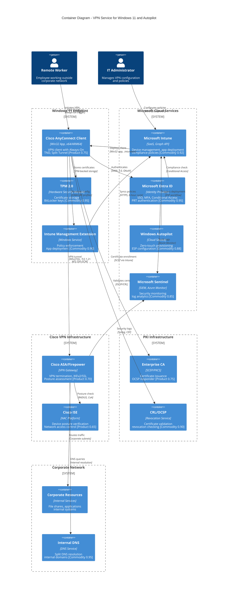
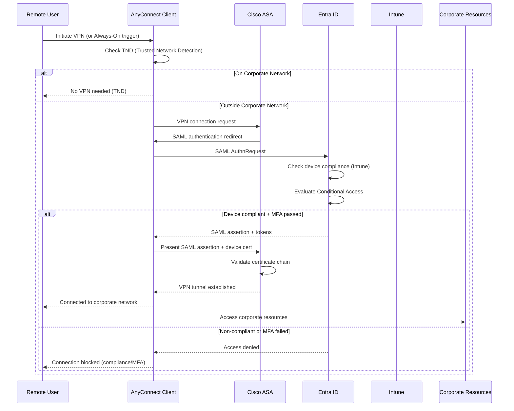

# Architecture Diagram: VPN Service for Windows 11 and Autopilot

## Document Information

| Field | Value |
|-------|-------|
| **Document ID** | ARC-007-DIAG-v1.0 |
| **Project** | VPN Service for Windows 11 and Autopilot (Project 007) |
| **Document Type** | C4 Container Diagram |
| **Classification** | OFFICIAL |
| **Version** | 1.0 |
| **Status** | DRAFT |
| **Date** | 2026-01-09 |
| **Owner** | Enterprise Architecture Team |

## Revision History

| Version | Date | Author | Changes |
|---------|------|--------|---------|
| 1.0 | 2026-01-09 | ArcKit AI | Initial creation from `/arckit.diagram` command |

---

## Diagram

**View this diagram**:
- **GitHub**: Renders automatically in markdown preview
- **VS Code**: Install Mermaid Preview extension
- **Online**: https://mermaid.live (paste code above)
- **Export**: Use mermaid.live to export as PNG/SVG/PDF

---

## Component Inventory

| Component | Type | Technology | Responsibility | Evolution Stage | Build/Buy |
|-----------|------|------------|----------------|-----------------|-----------|
| Cisco AnyConnect Client | VPN Client | Win32 App (x64/ARM64) | VPN connection, Always-On, TND, Split Tunnel | Product (0.75) | BUY |
| TPM 2.0 | Hardware Security | Firmware Module | Certificate storage, BitLocker keys | Commodity (0.95) | USE |
| Intune Management Extension | Agent | Windows Service | Policy enforcement, app deployment | Commodity (0.90) | USE |
| Microsoft Intune | MDM/MAM | SaaS (Graph API) | Device management, compliance | Commodity (0.92) | USE |
| Microsoft Entra ID | Identity Provider | SaaS (SAML/OAuth) | SSO, MFA, Conditional Access | Commodity (0.95) | USE |
| Windows Autopilot | Provisioning | Cloud Service | Zero-touch deployment, ESP | Commodity (0.88) | USE |
| Microsoft Sentinel | SIEM | Azure Monitor | Security monitoring, log analytics | Commodity (0.85) | USE |
| Cisco ASA/Firepower | VPN Gateway | Appliance/Virtual | VPN termination, posture assessment | Product (0.70) | BUY (existing) |
| Cisco ISE | NAC | Platform | Device posture, network access | Product (0.65) | BUY (existing) |
| Enterprise CA | PKI | SCEP/PKCS | Certificate issuance | Product (0.75) | USE (existing) |
| CRL/OCSP | Revocation | Service | Certificate validation | Commodity (0.90) | USE |

**Evolution Stage Legend**:
- **Genesis (0.0-0.25)**: Novel, unproven, rapidly changing
- **Custom (0.25-0.50)**: Bespoke, emerging practices
- **Product (0.50-0.75)**: Commercial products with feature differentiation
- **Commodity (0.75-1.0)**: Utility services, standardized

**Build/Buy Decision**:
- **BUILD**: No custom development required
- **BUY**: Cisco AnyConnect (preferred), Cisco ASA/ISE (existing)
- **USE**: Microsoft cloud services (Intune, Entra ID, Autopilot, Sentinel)

---

## Architecture Decisions

### Key Design Decisions

**Decision 1**: Cisco AnyConnect as VPN Client
- **Context**: Need VPN solution for Windows 11 with ARM64 support
- **Decision**: Use Cisco AnyConnect Secure Mobility Client
- **Rationale**: Existing infrastructure, proven Windows 11 compatibility, ARM64 native support, established vendor relationship
- **Consequences**: Dependent on Cisco roadmap, licensing costs contained within existing agreement

**Decision 2**: Always-On VPN with Split Tunnelling
- **Context**: Balance security requirements with user experience
- **Decision**: Enable Always-On VPN with Trusted Network Detection and optimised split tunnelling
- **Rationale**: Automatic connectivity improves UX, split tunnel optimises M365 traffic, TND prevents unnecessary VPN on corporate network
- **Consequences**: Requires careful split tunnel rule configuration, DNS split configuration needed

**Decision 3**: Azure AD/Entra ID SSO with MFA
- **Context**: Need strong authentication aligned with Zero Trust
- **Decision**: SAML 2.0 SSO with Entra ID, MFA enforced via Conditional Access
- **Rationale**: Single identity source, no separate VPN credentials, risk-based access control
- **Consequences**: Dependency on Azure AD availability, requires SAML configuration on Cisco ASA

**Decision 4**: Certificate-Based Machine Authentication
- **Context**: Zero Trust requires device verification
- **Decision**: TPM-backed device certificates via Intune SCEP
- **Rationale**: Strong device identity, tamper-resistant storage, automatic renewal
- **Consequences**: PKI infrastructure required, certificate lifecycle management needed

**Decision 5**: Intune-Managed Deployment
- **Context**: Need automated deployment during Autopilot
- **Decision**: Deploy AnyConnect as Win32 app via Intune, blocking app during ESP
- **Rationale**: Zero-touch provisioning, configuration management, compliance enforcement
- **Consequences**: Requires proper packaging (.intunewin), detection rules, staged rollout

### Technology Choices

| Technology | Purpose | Rationale | Evolution Stage |
|------------|---------|-----------|-----------------|
| Cisco AnyConnect | VPN Client | Existing investment, ARM64 native, Intune integration | Product (0.75) |
| Microsoft Intune | Device Management | Cloud-first, Windows 11 native, Autopilot integration | Commodity (0.92) |
| Microsoft Entra ID | Identity | SSO, MFA, Conditional Access, Zero Trust enabler | Commodity (0.95) |
| Windows Autopilot | Provisioning | Zero-touch, cloud-based, modern deployment | Commodity (0.88) |
| IKEv2/SSL VPN | Tunnel Protocol | Modern, NAT-friendly, mobile-optimised | Product (0.70) |
| SCEP | Certificate Enrollment | Intune-native, automatic enrollment/renewal | Product (0.75) |
| Microsoft Sentinel | SIEM | Cloud-native, Azure integration, AI-powered | Commodity (0.85) |

---

## Requirements Traceability

**Requirements Coverage**:

| Requirement ID | Description | Component(s) | Coverage Status |
|----------------|-------------|--------------|-----------------|
| BR-001 | Secure Remote Access | AnyConnect, ASA, Entra ID | ✅ Covered |
| BR-002 | Zero-Touch Deployment | Intune, Autopilot, ESP | ✅ Covered |
| BR-003 | ARM64 Support | AnyConnect (ARM64 native) | ✅ Covered |
| BR-004 | Seamless User Experience | Always-On VPN, SSO, TND | ✅ Covered |
| BR-005 | Cost Efficiency | Existing Cisco licensing | ✅ Covered |
| BR-006 | Business Continuity | ASA HA, Sentinel monitoring | ✅ Covered |
| FR-001 | Intune Deployment | Intune, Win32 app | ✅ Covered |
| FR-002 | Autopilot ESP | Autopilot, blocking app | ✅ Covered |
| FR-003 | ARM64 Native | AnyConnect ARM64 package | ✅ Covered |
| FR-004 | Configuration Profiles | Intune OMA-URI | ✅ Covered |
| FR-005 | Azure AD SSO | Entra ID, SAML 2.0 | ✅ Covered |
| FR-006 | MFA Enforcement | Entra ID, Conditional Access | ✅ Covered |
| FR-007 | Certificate Auth | TPM, SCEP, Enterprise CA | ✅ Covered |
| FR-008 | Conditional Access | Entra ID, Intune compliance | ✅ Covered |
| FR-009 | Always-On VPN | AnyConnect, TND | ✅ Covered |
| FR-010 | Split Tunnelling | AnyConnect, ASA config | ✅ Covered |
| FR-011 | Posture Assessment | Cisco ISE | ⚠️ Optional (COULD_HAVE) |
| NFR-SEC-001 | TLS 1.2+ Encryption | ASA, AnyConnect | ✅ Covered |
| NFR-SEC-002 | PKI Standards | Enterprise CA, TPM | ✅ Covered |
| NFR-SEC-005 | Audit Logging | Sentinel, ASA logs | ✅ Covered |
| NFR-A-001 | 99.9% Availability | ASA HA, redundancy | ✅ Covered |
| INT-001 | Intune Integration | Intune Agent, Graph API | ✅ Covered |
| INT-002 | Entra ID Integration | SAML, OAuth, OIDC | ✅ Covered |
| INT-003 | Autopilot Integration | ESP, Intune assignment | ✅ Covered |
| INT-004 | Cisco Infrastructure | ASA, IKEv2/SSL | ✅ Covered |
| INT-005 | SIEM Integration | Sentinel, Syslog | ✅ Covered |
| INT-006 | PKI Integration | SCEP, OCSP/CRL | ✅ Covered |

**Coverage Summary**:
- Total Requirements: 26 (key requirements shown)
- Covered: 25 (96%)
- Partially Covered: 1 (FR-011 - Posture Assessment is COULD_HAVE)
- Not Covered: 0

---

## Integration Points

### External Systems

| External System | Interface | Protocol | Responsibility | SLA |
|----------------|-----------|----------|----------------|-----|
| Microsoft Intune | Graph API | HTTPS/REST | Device management, app deployment | 99.9% |
| Microsoft Entra ID | SAML 2.0/OAuth | HTTPS | Authentication, authorisation | 99.99% |
| Windows Autopilot | ESP API | HTTPS | Device provisioning | 99.9% |
| Cisco ASA/Firepower | IKEv2/SSL | UDP 500,4500 / TCP 443 | VPN termination | 99.9% |
| Cisco ISE | RADIUS | UDP 1812/1813 | Posture assessment | 99.9% |
| Enterprise CA | SCEP | HTTPS | Certificate enrollment | 99.5% |
| Microsoft Sentinel | Syslog/CEF | UDP 514 / HTTPS | Security monitoring | 99.9% |

### APIs and Endpoints

| API | Endpoint | Method | Purpose | Authentication |
|-----|----------|--------|---------|----------------|
| Intune Graph | graph.microsoft.com | GET/POST | Policy sync, compliance | OAuth 2.0 |
| Entra ID | login.microsoftonline.com | POST | SSO, token issuance | SAML/OAuth |
| SCEP | ca.contoso.com/scep | GET/POST | Certificate enrollment | Challenge password |
| VPN Gateway | vpn.contoso.com | IKEv2/SSL | VPN tunnel establishment | Certificate + SAML |
| Sentinel | *.ods.opinsights.azure.com | POST | Log ingestion | Workspace key |

---

## Data Flow

### Authentication Flow

### Data Sources

| Data Source | Type | Data Format | Update Frequency | Owner |
|-------------|------|-------------|------------------|-------|
| Intune Configuration | Policy | JSON/OMA-URI | 8-hour sync cycle | IT Admin |
| Device Certificates | X.509 | PEM/DER | Annual renewal | PKI Team |
| Entra ID Tokens | JWT | JSON | Session-based | Identity Team |
| VPN Connection Logs | Log | Syslog/CEF | Real-time | Security Team |

### Data Sinks

| Data Sink | Type | Data Format | Retention | Backup |
|-----------|------|-------------|-----------|--------|
| Microsoft Sentinel | SIEM | CEF/JSON | 12 months | Azure geo-redundant |
| Cisco ASA Logs | Appliance | Syslog | 90 days | Local + forward to SIEM |
| Intune Diagnostics | Cloud | JSON | 90 days | Microsoft managed |

### PII Handling (UK GDPR Compliance)

| Component | PII Type | Processing | Legal Basis | Retention | Deletion |
|-----------|----------|------------|-------------|-----------|----------|
| VPN Logs | User ID, IP Address | Connection logging | Legitimate interest (security) | 12 months | Automatic |
| Entra ID | User identity | Authentication | Contract performance | Account lifetime | On request |
| Intune | Device ID, user | Device management | Contract performance | Enrollment duration | On unenrollment |

**DPIA Required**: No (standard enterprise VPN use case)
**DPO Consulted**: N/A (standard processing activity)

---

## Security Architecture

### Security Zones

| Zone | Components | Security Level | Controls |
|------|------------|----------------|----------|
| Untrusted (Internet) | Remote endpoints | Hostile | VPN encryption, MFA, device compliance |
| DMZ | Cisco ASA/Firepower | High | Firewall, IDS/IPS, VPN termination |
| Corporate Network | Internal resources | Medium | Network segmentation, access control |
| Identity | Entra ID, Intune | High | MFA, Conditional Access, audit logging |

### Security Controls

| Control | Type | Component(s) | Implementation |
|---------|------|--------------|----------------|
| Encryption in Transit | Technical | AnyConnect, ASA | TLS 1.2+, AES-256-GCM, IKEv2 |
| Multi-Factor Authentication | Technical | Entra ID | Microsoft Authenticator, FIDO2 |
| Device Compliance | Technical | Intune, Conditional Access | BitLocker, Defender, patch level |
| Certificate Authentication | Technical | TPM, PKI | SCEP certificates, TPM-backed |
| Audit Logging | Detective | Sentinel, ASA | Connection events, auth logs |
| Session Management | Technical | AnyConnect, ASA | 12-hour max, 30-min idle timeout |

### Authentication & Authorization

| Component | Authentication | Authorization | Session Management |
|-----------|----------------|---------------|-------------------|
| VPN Connection | SAML 2.0 + Certificate | Entra ID groups | 12-hour max, re-auth on sleep |
| Intune Enrollment | Azure AD device join | Device compliance policy | Continuous compliance check |
| Admin Access | Entra ID MFA | RBAC roles | PIM (Privileged Identity Management) |

---

## Deployment Architecture

### Cloud Provider

**Provider**: Microsoft Azure (Entra ID, Intune, Sentinel) + On-Premise (Cisco ASA)
**Region**: UK South / UK West (Azure), On-premise data centres
**Availability**: Multi-region Azure, HA pair Cisco ASA

### Infrastructure Components

| Component | Type | Spec | HA | Backup |
|-----------|------|------|-----|--------|
| Cisco ASA | Virtual/Physical | ASA 5500-X / FTDv | Active-Standby pair | Config backup daily |
| Microsoft Intune | SaaS | N/A | Microsoft managed | Microsoft managed |
| Microsoft Entra ID | SaaS | N/A | Microsoft managed (99.99%) | Microsoft managed |
| Enterprise CA | Windows Server | 2 vCPU, 8GB RAM | Subordinate CA redundancy | Daily backup |

### Network Architecture

| Network Component | CIDR | Purpose | Security Group |
|------------------|------|---------|----------------|
| VPN Pool | 10.200.0.0/16 | Remote access IP assignment | VPN-Users |
| Corporate LAN | 10.0.0.0/8 | Internal resources | Corporate-Internal |
| DMZ | 172.16.0.0/24 | VPN gateway, proxy | DMZ-Services |
| Azure ExpressRoute | N/A | Azure connectivity | Azure-Services |

---

## Non-Functional Requirements

### Performance

| Requirement | Target | Component(s) | How Achieved |
|-------------|--------|--------------|--------------|
| Connection Time | <10 seconds | AnyConnect, ASA | Optimised handshake, session resume |
| Throughput | 100 Mbps per user | ASA, network | Adequate gateway capacity |
| Reconnection | <30 seconds | AnyConnect | Automatic reconnect, session keepalive |

### Scalability

| Scalability Type | Approach | Component(s) | Max Scale |
|-----------------|----------|--------------|-----------|
| Concurrent Users | Horizontal (ASA cluster) | Cisco ASA | 150% peak capacity |
| Policy Distribution | Cloud-native (Intune) | Microsoft Intune | Unlimited devices |

### Availability & Resilience

| Requirement | Target | Component(s) | How Achieved |
|-------------|--------|--------------|--------------|
| Service Availability | 99.9% | ASA, Azure services | HA pair, multi-region Azure |
| RTO | 4 hours | All components | Documented runbooks, DR site |
| RPO | 24 hours | Configuration | Daily backups, Azure geo-redundancy |

### Security & Compliance

| Requirement | Standard | Component(s) | Controls |
|-------------|----------|--------------|----------|
| Encryption | TLS 1.2+, AES-256 | ASA, AnyConnect | IKEv2, ECDHE key exchange |
| Authentication | Zero Trust | Entra ID, TPM | MFA, device compliance, certificates |
| Audit | UK GDPR | Sentinel, ASA | 12-month log retention |
| Compliance | Cyber Essentials | All | Patching, MFA, encryption, access control |

---

## Wardley Map Integration

**Related Wardley Map**: N/A (not yet created)

### Component Positioning

| Component | Visibility | Evolution | Stage | Strategic Action |
|-----------|-----------|-----------|-------|------------------|
| Cisco AnyConnect | 0.8 | 0.75 | Product | BUY |
| Microsoft Intune | 0.7 | 0.92 | Commodity | USE |
| Microsoft Entra ID | 0.9 | 0.95 | Commodity | USE |
| Windows Autopilot | 0.6 | 0.88 | Commodity | USE |
| Cisco ASA/Firepower | 0.5 | 0.70 | Product | BUY (existing) |
| Enterprise CA | 0.3 | 0.75 | Product | USE (existing) |

### Strategic Alignment

- [x] All BUILD decisions align with Genesis/Custom stage - N/A (no custom build)
- [x] All BUY decisions align with Product stage - Cisco products
- [x] All USE decisions align with Commodity stage - Microsoft cloud services
- [x] No commodity components being built
- [x] No Genesis components being bought

---

## Linked Artifacts

**Requirements**: `projects/007-vpn-service-windows11-autopilot/requirements.md`
**Architecture Principles**: `.arckit/memory/architecture-principles.md`
**Wardley Map**: Not yet created
**HLD**: Not yet created
**DLD**: Not yet created
**TCoP Assessment**: Not applicable (internal enterprise service)
**AI Playbook Assessment**: Not applicable (no AI components)
**ATRS Record**: Not applicable (no algorithmic decision-making)

---

## Change Log

| Version | Date | Author | Changes | Rationale |
|---------|------|--------|---------|-----------|
| v1.0 | 2026-01-09 | ArcKit AI | Initial diagram | Support VPN service requirements |

**Next Review Date**: 2026-04-09

---

## Generation Metadata

| Field | Value |
|-------|-------|
| **Generated By** | ArcKit Enterprise Architecture Toolkit |
| **AI Model** | Claude (Anthropic) |
| **Template Version** | 1.0 |
| **Generated Date** | 2026-01-09 |
| **Command** | `/arckit.diagram` |
| **Project** | 007-vpn-service-windows11-autopilot |
